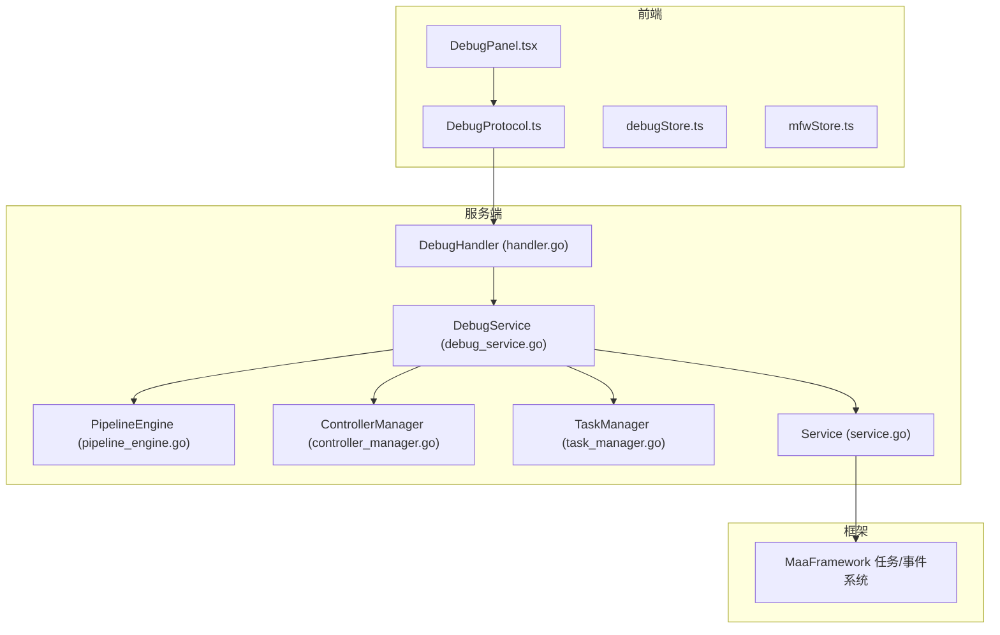
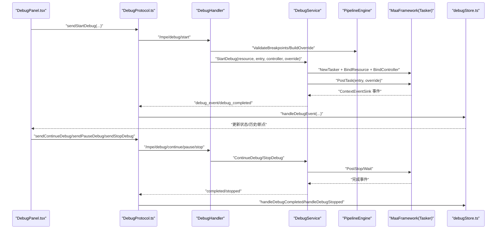
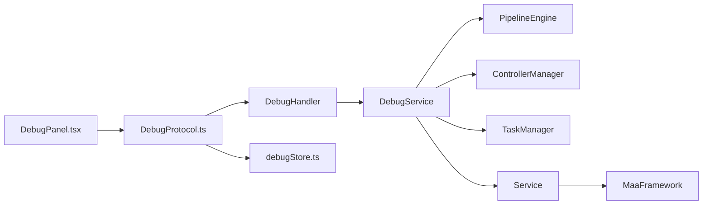

# 调试框架

<cite>
**本文引用的文件列表**
- [debug_service.go](file://LocalBridge/internal/mfw/debug_service.go)
- [controller_manager.go](file://LocalBridge/internal/mfw/controller_manager.go)
- [task_manager.go](file://LocalBridge/internal/mfw/task_manager.go)
- [pipeline_engine.go](file://LocalBridge/internal/mfw/pipeline_engine.go)
- [service.go](file://LocalBridge/internal/mfw/service.go)
- [handler.go](file://LocalBridge/internal/protocol/debug/handler.go)
- [DebugProtocol.ts](file://src/services/protocols/DebugProtocol.ts)
- [debugStore.ts](file://src/stores/debugStore.ts)
- [DebugPanel.tsx](file://src/components/panels/toolPanels/DebugPanel.tsx)
- [mfwStore.ts](file://src/stores/mfwStore.ts)
- [API参考/任务管理器.md](file://instructions/maafw-golang/API参考/任务管理器.md)
- [API参考/事件系统.md](file://instructions/maafw-golang/API参考/事件系统.md)
- [高级功能/动态流水线构建.md](file://instructions/maafw-golang/高级功能/动态流水线构建.md)
</cite>

## 目录
1. [简介](#简介)
2. [项目结构](#项目结构)
3. [核心组件](#核心组件)
4. [架构总览](#架构总览)
5. [详细组件分析](#详细组件分析)
6. [依赖关系分析](#依赖关系分析)
7. [性能考虑](#性能考虑)
8. [故障排查指南](#故障排查指南)
9. [结论](#结论)
10. [附录](#附录)

## 简介
本文件系统性阐述 MaaPipelineEditor 项目中的“调试框架”，覆盖从前端 UI 到后端服务、从 WebSocket 协议到 MaaFramework 事件回调的全链路实现。调试框架支持：
- 启动/暂停/继续/停止调试任务
- 断点与单步执行（通过动态覆盖 pipeline 的 next/on_error）
- 节点级事件上报（识别开始/成功/失败、动作开始/成功/失败、节点执行周期完成/失败）
- 执行历史记录与日志导出
- 前后端协同的调试状态机与 UI 响应

## 项目结构
调试框架由三层构成：
- 前端层：DebugPanel（工具栏）、DebugProtocol（WebSocket 协议）、debugStore（调试状态与历史）
- 服务层：LocalBridge 内部的 DebugHandler（路由与业务）、DebugService（任务生命周期与事件分发）、PipelineEngine（动态覆盖断点/继续/单步）
- 框架层：MaaFramework 任务管理器、控制器管理器、资源管理器、事件系统

图表来源
- [DebugPanel.tsx](file://src/components/panels/toolPanels/DebugPanel.tsx#L1-L606)
- [DebugProtocol.ts](file://src/services/protocols/DebugProtocol.ts#L1-L735)
- [debugStore.ts](file://src/stores/debugStore.ts#L1-L695)
- [mfwStore.ts](file://src/stores/mfwStore.ts#L1-L134)
- [handler.go](file://LocalBridge/internal/protocol/debug/handler.go#L1-L436)
- [debug_service.go](file://LocalBridge/internal/mfw/debug_service.go#L1-L1160)
- [pipeline_engine.go](file://LocalBridge/internal/mfw/pipeline_engine.go#L1-L250)
- [controller_manager.go](file://LocalBridge/internal/mfw/controller_manager.go#L1-L514)
- [task_manager.go](file://LocalBridge/internal/mfw/task_manager.go#L1-L114)
- [service.go](file://LocalBridge/internal/mfw/service.go#L1-L181)

章节来源
- [DebugPanel.tsx](file://src/components/panels/toolPanels/DebugPanel.tsx#L1-L606)
- [DebugProtocol.ts](file://src/services/protocols/DebugProtocol.ts#L1-L735)
- [debugStore.ts](file://src/stores/debugStore.ts#L1-L695)
- [mfwStore.ts](file://src/stores/mfwStore.ts#L1-L134)
- [handler.go](file://LocalBridge/internal/protocol/debug/handler.go#L1-L436)
- [debug_service.go](file://LocalBridge/internal/mfw/debug_service.go#L1-L1160)
- [pipeline_engine.go](file://LocalBridge/internal/mfw/pipeline_engine.go#L1-L250)
- [controller_manager.go](file://LocalBridge/internal/mfw/controller_manager.go#L1-L514)
- [task_manager.go](file://LocalBridge/internal/mfw/task_manager.go#L1-L114)
- [service.go](file://LocalBridge/internal/mfw/service.go#L1-L181)

## 核心组件
- 调试处理器（DebugHandler）：负责路由 /mpe/debug/* 请求，协调启动/停止/暂停/继续/单步等操作
- 调试服务（DebugService）：封装 Tasker 生命周期、事件回调、断点/继续/单步的 override 构造与提交
- 流水线引擎（PipelineEngine）：从资源目录加载 pipeline.json，构造断点/继续/单步所需的 override
- 控制器管理器（ControllerManager）：创建/连接控制器，提供截图、点击、滑动、输入文本、启停应用等操作
- 任务管理器（TaskManager）：面向通用任务的提交/停止/状态查询（调试场景中由 DebugService 直接使用 Tasker）
- 服务（Service）：MaaFramework 初始化/释放、模块聚合
- 前端协议（DebugProtocol）：WebSocket 路由注册、事件分发、UI 状态同步
- 前端状态（debugStore）：调试状态机、执行历史、断点集合、日志导出
- 前端面板（DebugPanel）：调试工具栏、断点管理、日志导出、与后端交互

章节来源
- [handler.go](file://LocalBridge/internal/protocol/debug/handler.go#L1-L436)
- [debug_service.go](file://LocalBridge/internal/mfw/debug_service.go#L1-L1160)
- [pipeline_engine.go](file://LocalBridge/internal/mfw/pipeline_engine.go#L1-L250)
- [controller_manager.go](file://LocalBridge/internal/mfw/controller_manager.go#L1-L514)
- [task_manager.go](file://LocalBridge/internal/mfw/task_manager.go#L1-L114)
- [service.go](file://LocalBridge/internal/mfw/service.go#L1-L181)
- [DebugProtocol.ts](file://src/services/protocols/DebugProtocol.ts#L1-L735)
- [debugStore.ts](file://src/stores/debugStore.ts#L1-L695)
- [DebugPanel.tsx](file://src/components/panels/toolPanels/DebugPanel.tsx#L1-L606)

## 架构总览
调试流程从前端发起，经由 DebugProtocol 与 DebugHandler，调用 DebugService 启动/继续/停止任务，并通过 MaaFramework 的事件系统将节点级事件回推到前端，前端更新 UI 与执行历史。

图表来源
- [DebugPanel.tsx](file://src/components/panels/toolPanels/DebugPanel.tsx#L1-L606)
- [DebugProtocol.ts](file://src/services/protocols/DebugProtocol.ts#L1-L735)
- [handler.go](file://LocalBridge/internal/protocol/debug/handler.go#L1-L436)
- [debug_service.go](file://LocalBridge/internal/mfw/debug_service.go#L1-L1160)
- [pipeline_engine.go](file://LocalBridge/internal/mfw/pipeline_engine.go#L1-L250)

## 详细组件分析

### 调试处理器（DebugHandler）
- 路由前缀：/mpe/debug/*
- 支持操作：
  - 启动调试：校验参数、加载 PipelineEngine、构造断点 override、启动 DebugService、返回 /lte/debug/started
  - 停止调试：校验 task_id，调用 StopDebug，返回 /lte/debug/stopped
  - 暂停调试：向 Tasker 发送 PostStop，返回 /lte/debug/paused
  - 继续调试：构造 continue override（保留断点，移除当前节点），提交任务
  - 单步调试：构造 step override（保留断点，新增 next_nodes 临时断点），提交任务
- 错误处理：统一发送 /lte/debug/error

章节来源
- [handler.go](file://LocalBridge/internal/protocol/debug/handler.go#L1-L436)

### 调试服务（DebugService）
- 调试会话（DebugSession）：包含 TaskID、资源路径、入口节点、控制器 ID、Tasker/Resource/Controller、状态、事件处理器、节点计时/计数映射、停止标志与 done 通道
- 启动调试：
  - 获取控制器/资源实例，启用全局调试模式，创建 Tasker 并绑定资源/控制器
  - 注册 ContextEventSink，提交任务（可带 override）
  - 异步等待任务完成，发送 debug_completed 事件
- 停止调试：PostStop + Wait，销毁 Tasker，清理会话
- 继续调试：构造 override，提交任务，等待完成并发送 debug_completed
- 事件分发：debugContextSink 将节点级事件转换为统一的 DebugEvent，通过 DebugEventHandler.OnDebugEvent 回推

章节来源
- [debug_service.go](file://LocalBridge/internal/mfw/debug_service.go#L1-L1160)

### 流水线引擎（PipelineEngine）
- 从资源目录加载 pipeline.json，合并为 pipelineConfig
- 构造 override：
  - 断点：将断点节点的 next/on_error 置为空数组，阻止继续前进
  - 继续：移除当前节点的断点 override，保留其余断点
  - 单步：保留断点，新增 next_nodes 临时断点
- 提供断点校验、获取节点配置/下一跳列表、节点存在性验证

章节来源
- [pipeline_engine.go](file://LocalBridge/internal/mfw/pipeline_engine.go#L1-L250)

### 控制器管理器（ControllerManager）
- 创建 ADB/Win32 控制器，连接/断开，截图、点击、滑动、输入文本、启停应用
- 为调试提供截图能力，将图像编码为 Base64，便于前端展示

章节来源
- [controller_manager.go](file://LocalBridge/internal/mfw/controller_manager.go#L1-L514)

### 任务管理器（TaskManager）
- 通用任务提交/停止/状态查询（调试场景中由 DebugService 直接使用 Tasker）
- 提供 StopAll 清理所有任务

章节来源
- [task_manager.go](file://LocalBridge/internal/mfw/task_manager.go#L1-L114)

### 服务（Service）
- 初始化 MaaFramework（库路径、日志目录、调试模式），释放资源
- 聚合设备/控制器/资源/任务管理器

章节来源
- [service.go](file://LocalBridge/internal/mfw/service.go#L1-L181)

### 前端协议（DebugProtocol）
- 注册 /lte/debug/* 路由，处理事件、错误、完成、启动/停止/暂停响应
- 将后端事件转换为前端可消费的数据结构，驱动 debugStore 更新
- 提供 sendStartDebug/sendContinueDebug/sendPauseDebug/sendStopDebug/sendStepDebug

章节来源
- [DebugProtocol.ts](file://src/services/protocols/DebugProtocol.ts#L1-L735)

### 前端状态（debugStore）
- 调试状态机：idle/preparing/running/paused/completed
- 执行历史：每条记录对应一次完整的识别周期，包含节点名/ID、开始/结束时间、耗时、识别/动作结果、runIndex
- 断点集合、当前节点、当前阶段（识别/动作）、日志导出（文本/JSON）

章节来源
- [debugStore.ts](file://src/stores/debugStore.ts#L1-L695)

### 前端面板（DebugPanel）
- 调试配置：资源路径、入口节点、截图模式、日志级别
- 断点管理：设置/移除/清空断点
- 调试控制：开始/暂停/继续/停止、单步执行（预留）
- 日志导出：文本/JSON 下载
- 与 mfwStore 协作，确保控制器连接状态与调试按钮可用性

章节来源
- [DebugPanel.tsx](file://src/components/panels/toolPanels/DebugPanel.tsx#L1-L606)
- [mfwStore.ts](file://src/stores/mfwStore.ts#L1-L134)

## 依赖关系分析
- 前端依赖后端协议与状态管理，后端依赖服务层与框架层
- DebugHandler 依赖 Service 与 DebugService；DebugService 依赖 PipelineEngine、ControllerManager、TaskManager
- 事件系统通过 ContextEventSink 将节点级事件回推到前端，前端通过 DebugProtocol 路由分发

图表来源
- [DebugPanel.tsx](file://src/components/panels/toolPanels/DebugPanel.tsx#L1-L606)
- [DebugProtocol.ts](file://src/services/protocols/DebugProtocol.ts#L1-L735)
- [handler.go](file://LocalBridge/internal/protocol/debug/handler.go#L1-L436)
- [debug_service.go](file://LocalBridge/internal/mfw/debug_service.go#L1-L1160)
- [pipeline_engine.go](file://LocalBridge/internal/mfw/pipeline_engine.go#L1-L250)
- [controller_manager.go](file://LocalBridge/internal/mfw/controller_manager.go#L1-L514)
- [task_manager.go](file://LocalBridge/internal/mfw/task_manager.go#L1-L114)
- [service.go](file://LocalBridge/internal/mfw/service.go#L1-L181)

章节来源
- [DebugProtocol.ts](file://src/services/protocols/DebugProtocol.ts#L1-L735)
- [handler.go](file://LocalBridge/internal/protocol/debug/handler.go#L1-L436)
- [debug_service.go](file://LocalBridge/internal/mfw/debug_service.go#L1-L1160)
- [pipeline_engine.go](file://LocalBridge/internal/mfw/pipeline_engine.go#L1-L250)
- [controller_manager.go](file://LocalBridge/internal/mfw/controller_manager.go#L1-L514)
- [task_manager.go](file://LocalBridge/internal/mfw/task_manager.go#L1-L114)
- [service.go](file://LocalBridge/internal/mfw/service.go#L1-L181)

## 性能考虑
- 事件回调：MaaFramework 事件系统采用统一回调注册与分发，回调 ID 生成与全局表使用读写锁，读多写少场景下具备较好并发性能
- 任务等待：PostTask 返回 TaskJob，Wait 阻塞等待任务完成；调试场景中 DebugService 异步等待并发送完成事件，避免 UI 阻塞
- 截图与 Base64 编码：控制器截图后编码为 Base64，前端直接渲染，注意大图传输带来的带宽与内存压力
- 断点/继续/单步：通过动态覆盖 pipeline 的 next/on_error，避免额外的节点扫描与解析成本

章节来源
- [API参考/事件系统.md](file://instructions/maafw-golang/API参考/事件系统.md#L1-L550)
- [API参考/任务管理器.md](file://instructions/maafw-golang/API参考/任务管理器.md#L1-L353)
- [controller_manager.go](file://LocalBridge/internal/mfw/controller_manager.go#L1-L514)

## 故障排查指南
- 启动失败
  - 检查 MFW 是否初始化成功、资源路径与入口节点是否有效、控制器是否连接
  - 查看 /lte/debug/error 响应与前端错误提示
- 事件未到达
  - 确认已注册 ContextEventSink，检查 Tasker 是否绑定资源/控制器
  - 核对事件名称与 detail 字段是否匹配前端处理逻辑
- 暂停/继续无效
  - 确认 task_id 与当前会话一致，检查 PostStop 是否成功
- 单步执行未断点
  - 确认 next_nodes 与断点列表已正确转换为 pipeline 名称，且 PipelineEngine 校验通过
- 日志导出
  - 使用 debugStore 的导出方法，检查 executionHistory 是否为空

章节来源
- [handler.go](file://LocalBridge/internal/protocol/debug/handler.go#L1-L436)
- [debug_service.go](file://LocalBridge/internal/mfw/debug_service.go#L1-L1160)
- [DebugProtocol.ts](file://src/services/protocols/DebugProtocol.ts#L1-L735)
- [debugStore.ts](file://src/stores/debugStore.ts#L1-L695)

## 结论
调试框架通过前后端协同与 MaaFramework 事件系统，实现了从断点/单步到节点级事件回推的完整闭环。前端提供直观的工具栏与状态机，后端负责任务生命周期与动态覆盖，形成可扩展、可观测、可导出的日志体系。建议在生产环境中：
- 严格校验断点与入口节点
- 合理使用截图模式，避免不必要的带宽与内存消耗
- 在回调中避免阻塞操作，必要时异步处理
- 使用日志导出辅助问题定位与回归分析

## 附录
- 事件系统参考：[API参考/事件系统.md](file://instructions/maafw-golang/API参考/事件系统.md#L1-L550)
- 任务管理器参考：[API参考/任务管理器.md](file://instructions/maafw-golang/API参考/任务管理器.md#L1-L353)
- 动态流水线构建参考：[高级功能/动态流水线构建.md](file://instructions/maafw-golang/高级功能/动态流水线构建.md#L1-L360)