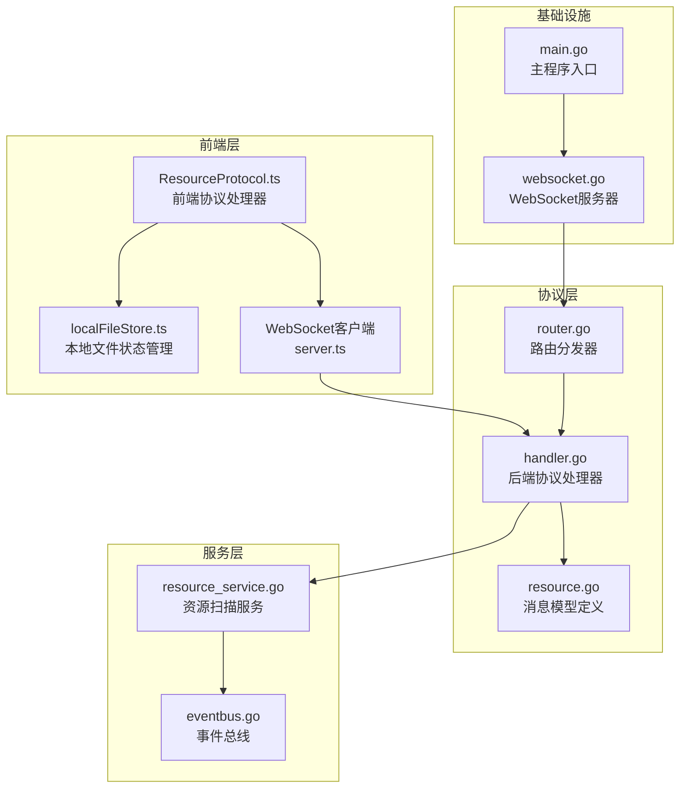
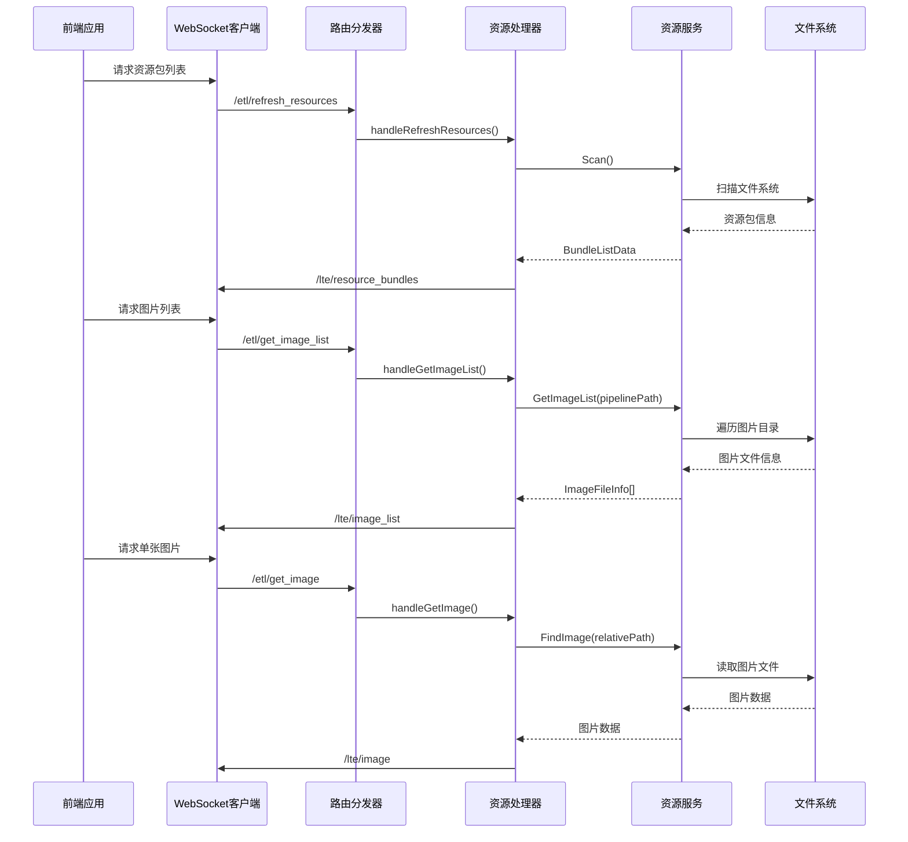
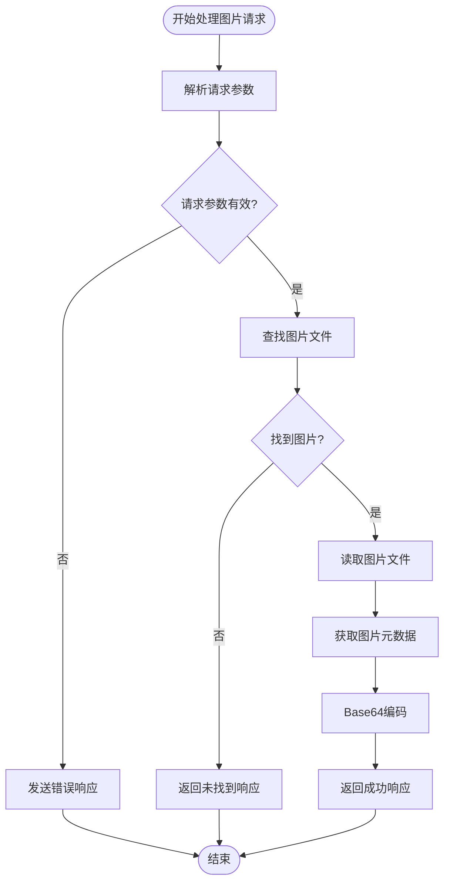
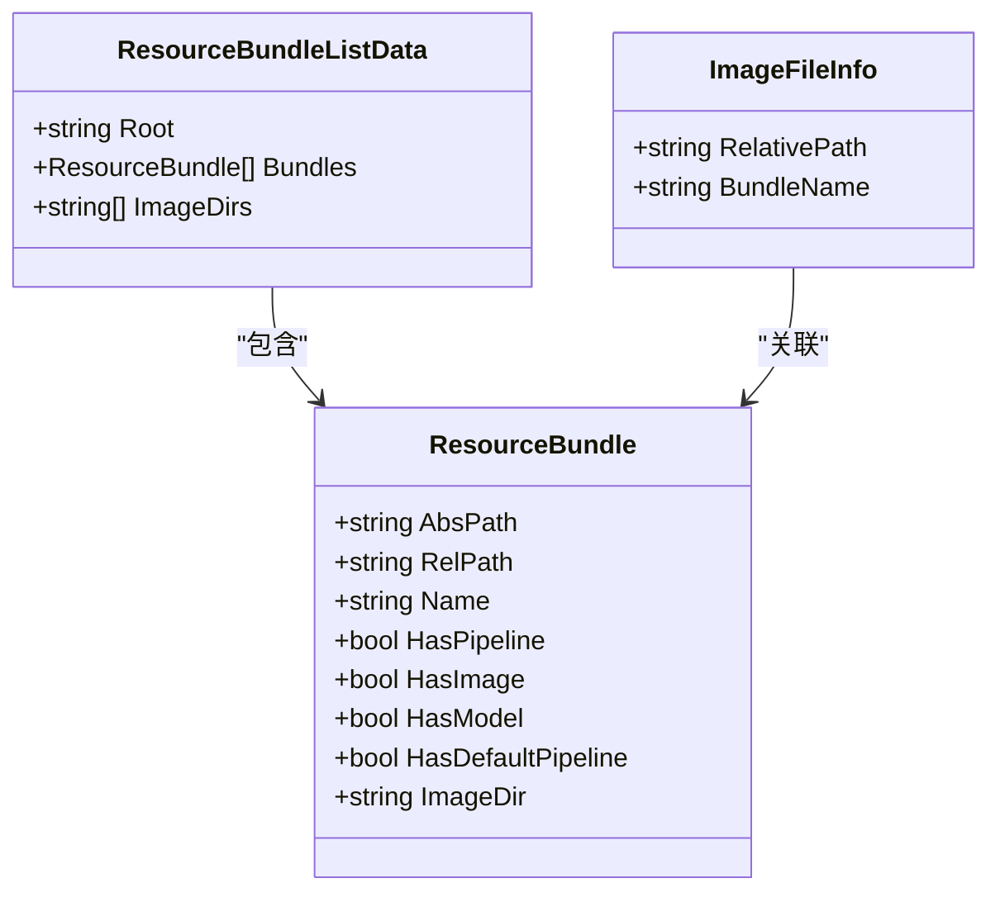
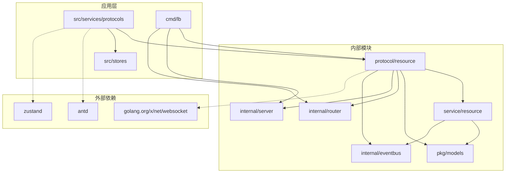

# 资源协议

<cite>
**本文档引用的文件**
- [LocalBridge/internal/protocol/resource/handler.go](file://LocalBridge/internal/protocol/resource/handler.go)
- [src/services/protocols/ResourceProtocol.ts](file://src/services/protocols/ResourceProtocol.ts)
- [LocalBridge/pkg/models/resource.go](file://LocalBridge/pkg/models/resource.go)
- [LocalBridge/internal/service/resource/resource_service.go](file://LocalBridge/internal/service/resource/resource_service.go)
- [src/stores/localFileStore.ts](file://src/stores/localFileStore.ts)
- [LocalBridge/internal/router/router.go](file://LocalBridge/internal/router/router.go)
- [LocalBridge/internal/server/websocket.go](file://LocalBridge/internal/server/websocket.go)
- [src/services/server.ts](file://src/services/server.ts)
- [LocalBridge/cmd/lb/main.go](file://LocalBridge/cmd/lb/main.go)
</cite>

## 目录
1. [简介](#简介)
2. [项目结构](#项目结构)
3. [核心组件](#核心组件)
4. [架构概览](#架构概览)
5. [详细组件分析](#详细组件分析)
6. [依赖关系分析](#依赖关系分析)
7. [性能考虑](#性能考虑)
8. [故障排除指南](#故障排除指南)
9. [结论](#结论)

## 简介

资源协议是 MaaPipelineEditor 本地桥接服务中的核心通信协议，负责处理资源包管理和图片资源的获取、缓存和展示。该协议实现了前后端之间的双向通信，支持资源包列表推送、图片批量获取、图片列表筛选等功能。

资源协议基于 WebSocket 通信，采用前后端约定的消息格式，在 LocalBridge 后端和前端应用之间建立了稳定的资源管理通道。通过该协议，前端可以实时获取资源包信息、批量获取图片资源，并根据当前 pipeline 文件自动筛选相关的图片资源。

## 项目结构

资源协议涉及的文件组织遵循清晰的分层架构：

**图表来源**
- [LocalBridge/internal/protocol/resource/handler.go](file://LocalBridge/internal/protocol/resource/handler.go#L1-L272)
- [src/services/protocols/ResourceProtocol.ts](file://src/services/protocols/ResourceProtocol.ts#L1-L281)
- [LocalBridge/internal/service/resource/resource_service.go](file://LocalBridge/internal/service/resource/resource_service.go#L1-L337)

**章节来源**
- [LocalBridge/internal/protocol/resource/handler.go](file://LocalBridge/internal/protocol/resource/handler.go#L1-L272)
- [src/services/protocols/ResourceProtocol.ts](file://src/services/protocols/ResourceProtocol.ts#L1-L281)
- [LocalBridge/pkg/models/resource.go](file://LocalBridge/pkg/models/resource.go#L1-L67)

## 核心组件

### 后端处理器 (Handler)

后端资源协议处理器是整个协议的核心实现，负责：
- 处理前端发送的各种资源请求
- 管理资源包的生命周期
- 实现图片资源的查找和传输
- 推送资源包列表到前端

### 资源服务 (Service)

资源服务负责资源包的扫描、管理和查询：
- 递归扫描文件系统中的资源包
- 维护资源包的元数据信息
- 提供图片资源的查找功能
- 支持基于 pipeline 文件的资源包筛选

### 前端协议处理器 (ResourceProtocol)

前端协议处理器负责：
- 注册和处理各种资源相关的 WebSocket 路由
- 管理图片缓存和请求状态
- 处理资源包列表的接收和更新
- 提供便捷的资源请求 API

**章节来源**
- [LocalBridge/internal/protocol/resource/handler.go](file://LocalBridge/internal/protocol/resource/handler.go#L22-L43)
- [LocalBridge/internal/service/resource/resource_service.go](file://LocalBridge/internal/service/resource/resource_service.go#L14-L31)
- [src/services/protocols/ResourceProtocol.ts](file://src/services/protocols/ResourceProtocol.ts#L13-L40)

## 架构概览

资源协议采用典型的客户端-服务器架构，通过 WebSocket 实现实时双向通信：

**图表来源**
- [LocalBridge/internal/protocol/resource/handler.go](file://LocalBridge/internal/protocol/resource/handler.go#L56-L137)
- [LocalBridge/internal/service/resource/resource_service.go](file://LocalBridge/internal/service/resource/resource_service.go#L243-L274)
- [src/services/protocols/ResourceProtocol.ts](file://src/services/protocols/ResourceProtocol.ts#L233-L246)

## 详细组件分析

### 后端处理器实现

后端处理器实现了完整的资源协议处理逻辑：

#### 路由处理机制

处理器通过 `GetRoutePrefix()` 方法声明支持的路由前缀：
- `/etl/get_image` - 获取单张图片
- `/etl/get_images` - 批量获取图片
- `/etl/get_image_list` - 获取图片列表
- `/etl/refresh_resources` - 刷新资源列表

#### 图片获取流程

**图表来源**
- [LocalBridge/internal/protocol/resource/handler.go](file://LocalBridge/internal/protocol/resource/handler.go#L72-L182)

#### 资源包管理

处理器通过订阅事件总线实现资源包的自动推送：
- 连接建立时推送资源包列表
- 资源扫描完成后推送更新
- 支持手动刷新资源列表

**章节来源**
- [LocalBridge/internal/protocol/resource/handler.go](file://LocalBridge/internal/protocol/resource/handler.go#L46-L114)
- [LocalBridge/internal/protocol/resource/handler.go](file://LocalBridge/internal/protocol/resource/handler.go#L219-L245)

### 资源服务实现

资源服务提供了完整的资源包扫描和管理功能：

#### 资源包检测算法

资源服务通过以下规则检测资源包：
- 包含 `pipeline` 目录
- 包含 `image` 目录  
- 包含 `model` 目录
- 包含 `default_pipeline.json` 文件

#### 图片扫描策略

服务支持两种扫描模式：
- **全局模式**：扫描所有资源包中的图片
- **过滤模式**：根据当前 pipeline 文件定位资源包，仅返回该资源包的图片

#### 并发安全设计

使用读写锁确保多线程环境下的数据一致性：
- 读操作使用 `RLock()` 共享锁定
- 写操作使用 `Lock()` 独占锁定
- 支持高并发的资源包查询

**章节来源**
- [LocalBridge/internal/service/resource/resource_service.go](file://LocalBridge/internal/service/resource/resource_service.go#L121-L153)
- [LocalBridge/internal/service/resource/resource_service.go](file://LocalBridge/internal/service/resource/resource_service.go#L240-L274)

### 前端协议处理器

前端协议处理器实现了完整的资源协议客户端：

#### 状态管理

使用 Zustand 状态管理库维护资源相关状态：
- 资源包列表：`resourceBundles`
- 图片缓存：`imageCache`
- 图片列表：`imageList`
- 请求状态：`pendingImageRequests`

#### 缓存机制

实现了智能的图片缓存策略：
- 基于相对路径的缓存键
- 支持 MIME 类型和尺寸信息
- 自动去重和过期管理
- 批量请求的去重处理

#### 请求优化

提供多种请求优化策略：
- 避免重复请求相同的图片
- 批量请求的智能合并
- 请求状态的原子性更新
- 失败请求的重试机制

**章节来源**
- [src/services/protocols/ResourceProtocol.ts](file://src/services/protocols/ResourceProtocol.ts#L50-L106)
- [src/stores/localFileStore.ts](file://src/stores/localFileStore.ts#L113-L146)

### 消息模型定义

资源协议使用标准化的消息模型确保前后端兼容性：

#### 资源包信息模型

**图表来源**
- [LocalBridge/pkg/models/resource.go](file://LocalBridge/pkg/models/resource.go#L3-L66)

#### 请求响应模型

消息模型涵盖了所有资源协议场景：
- 图片获取请求/响应
- 图片列表请求/响应  
- 资源包列表推送
- 错误信息处理

**章节来源**
- [LocalBridge/pkg/models/resource.go](file://LocalBridge/pkg/models/resource.go#L22-L66)

## 依赖关系分析

资源协议的依赖关系体现了清晰的分层架构：

**图表来源**
- [LocalBridge/internal/protocol/resource/handler.go](file://LocalBridge/internal/protocol/resource/handler.go#L3-L20)
- [src/services/protocols/ResourceProtocol.ts](file://src/services/protocols/ResourceProtocol.ts#L1-L7)

### 关键依赖关系

1. **协议到服务的依赖**：处理器依赖资源服务进行实际的文件系统操作
2. **服务到模型的依赖**：服务使用标准化的数据模型进行数据传递
3. **前端到状态管理的依赖**：前端协议处理器依赖状态管理库维护应用状态
4. **路由到处理器的依赖**：路由分发器将消息分发给相应的处理器

**章节来源**
- [LocalBridge/internal/router/router.go](file://LocalBridge/internal/router/router.go#L19-L31)
- [LocalBridge/internal/server/websocket.go](file://LocalBridge/internal/server/websocket.go#L35-L46)

## 性能考虑

资源协议在设计时充分考虑了性能优化：

### 缓存策略

- **内存缓存**：图片数据缓存在前端内存中，避免重复网络请求
- **智能去重**：避免对同一资源的重复请求
- **批量处理**：支持批量图片请求的合并处理

### 并发处理

- **读写分离**：使用读写锁支持高并发访问
- **异步处理**：资源扫描和图片处理采用异步方式
- **连接池**：WebSocket 连接的高效管理

### 网络优化

- **Base64 编码**：减少 HTTP 请求次数
- **压缩传输**：图片数据的高效传输
- **增量更新**：只推送变化的资源包信息

## 故障排除指南

### 常见问题及解决方案

#### 连接问题

**症状**：前端无法连接到本地服务
**原因**：
- 端口被占用
- 防火墙阻止连接
- 本地服务未启动

**解决方法**：
1. 检查本地服务端口配置
2. 确认防火墙设置
3. 重启本地服务进程

#### 资源包扫描失败

**症状**：资源包列表为空或不完整
**原因**：
- 根目录权限不足
- 资源包结构不符合规范
- 文件系统访问异常

**解决方法**：
1. 检查根目录访问权限
2. 验证资源包目录结构
3. 查看服务日志获取详细错误信息

#### 图片加载失败

**症状**：图片无法显示或加载缓慢
**原因**：
- 图片文件损坏
- 路径解析错误
- 网络传输中断

**解决方法**：
1. 验证图片文件完整性
2. 检查相对路径配置
3. 重新发起图片请求

**章节来源**
- [LocalBridge/internal/protocol/resource/handler.go](file://LocalBridge/internal/protocol/resource/handler.go#L261-L271)
- [LocalBridge/internal/service/resource/resource_service.go](file://LocalBridge/internal/service/resource/resource_service.go#L175-L193)

## 结论

资源协议作为 MaaPipelineEditor 的核心通信协议，成功实现了前后端之间的高效资源管理。通过清晰的分层架构、完善的错误处理机制和智能的缓存策略，该协议为用户提供了流畅的资源管理体验。

协议的主要优势包括：
- **模块化设计**：清晰的职责分离便于维护和扩展
- **高性能实现**：智能缓存和并发处理提升用户体验
- **容错性强**：完善的错误处理和恢复机制
- **易于集成**：标准化的消息格式便于第三方集成

未来可以考虑的改进方向：
- 支持更丰富的图片格式
- 增加资源包的动态加载
- 优化大文件传输性能
- 增强资源包的版本管理