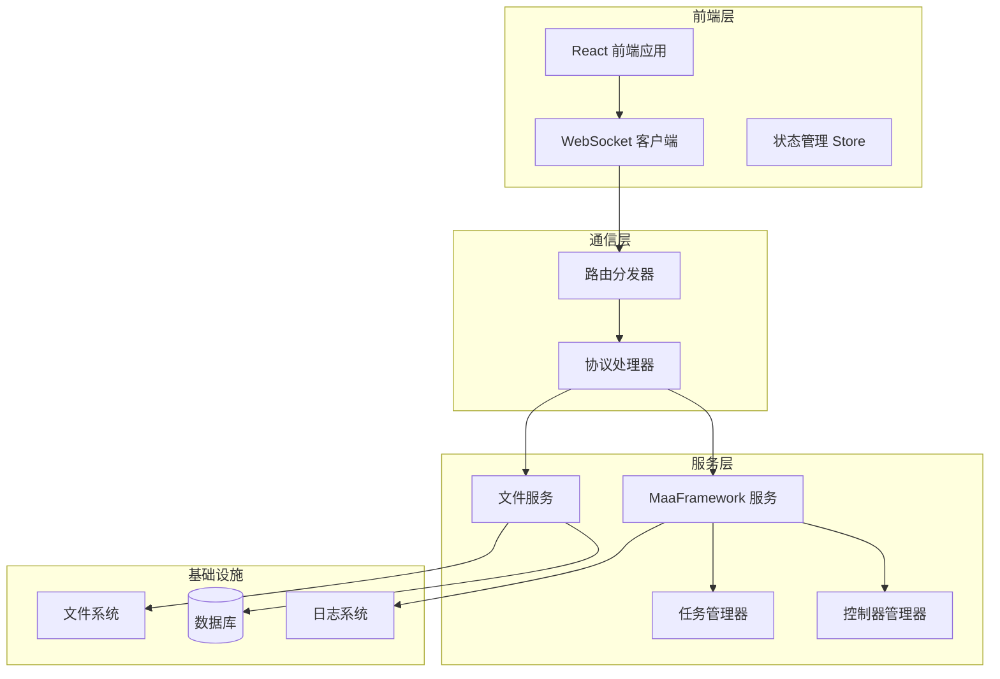
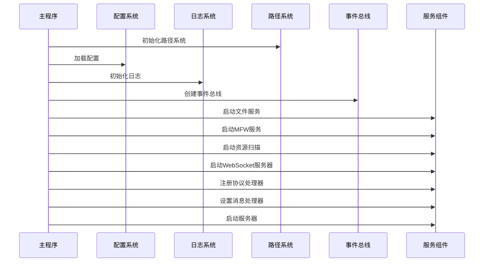
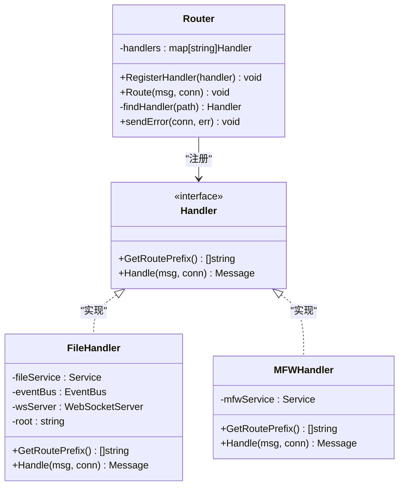
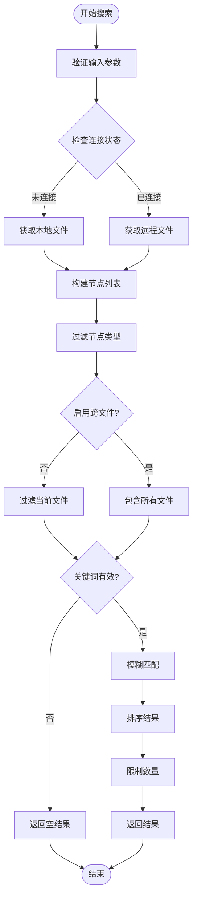
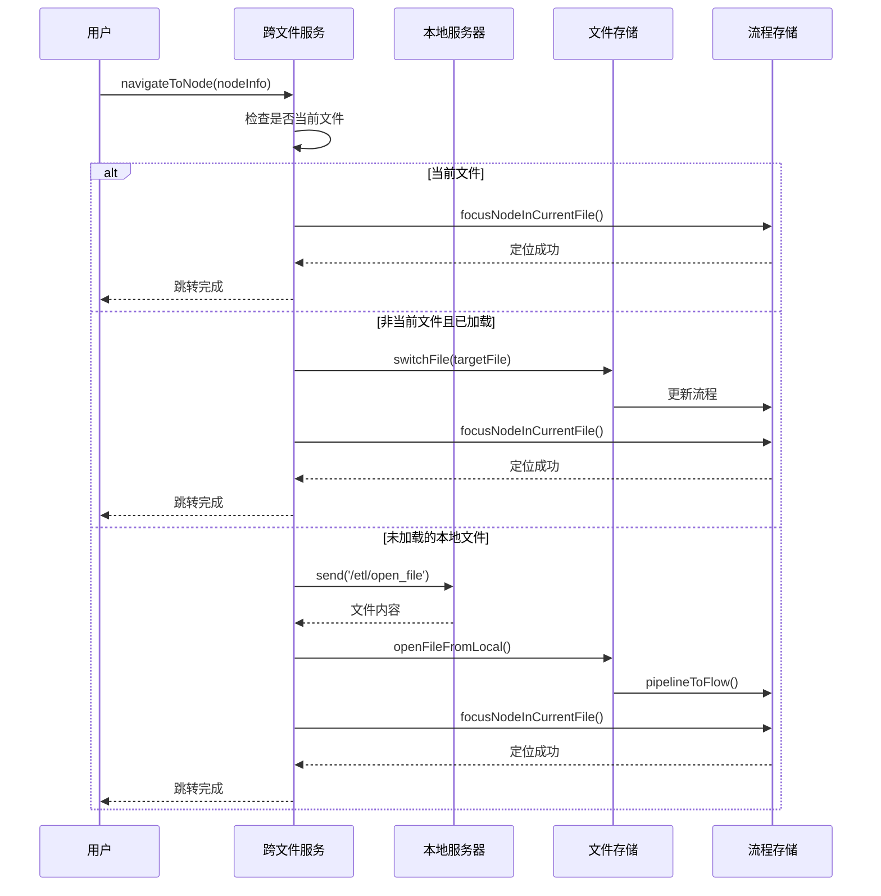
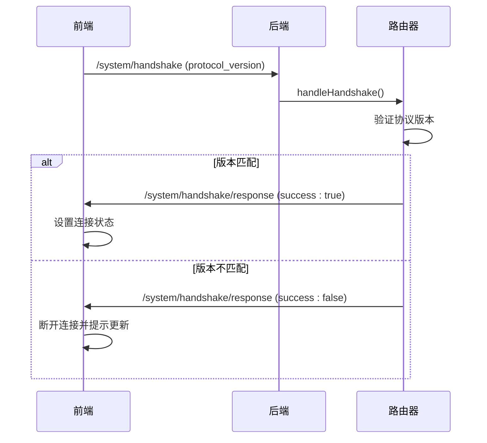
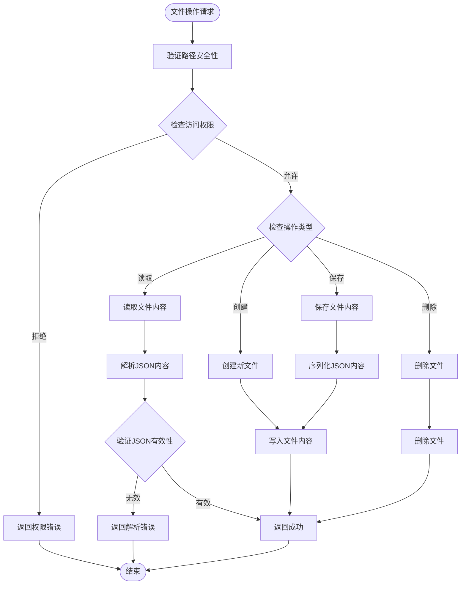
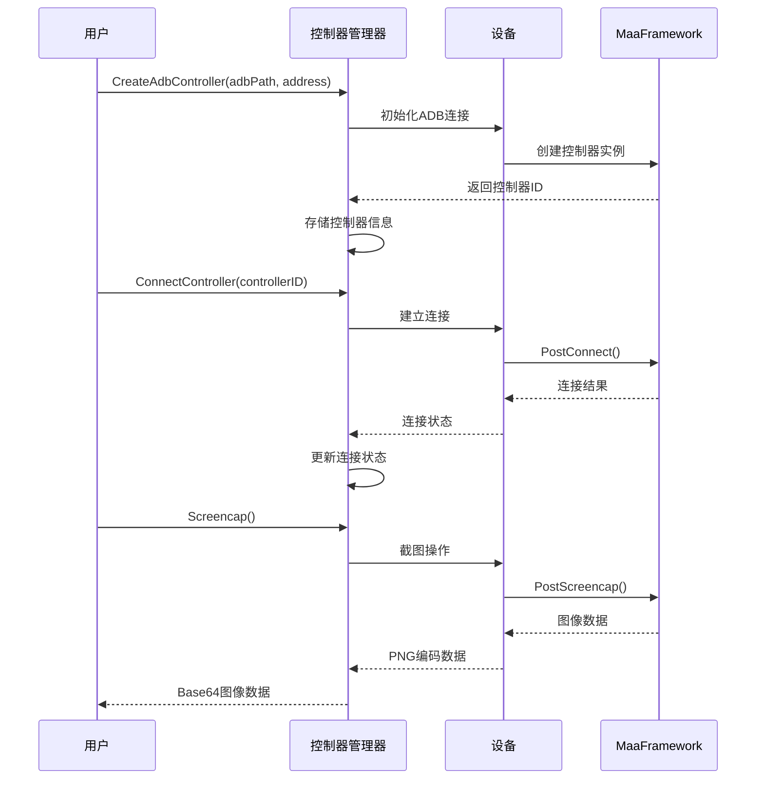

# 跨文件导航系统技术文档

<cite>
**本文档引用的文件**
- [main.go](file://LocalBridge/cmd/lb/main.go)
- [controller_manager.go](file://LocalBridge/internal/mfw/controller_manager.go)
- [task_manager.go](file://LocalBridge/internal/mfw/task_manager.go)
- [file_service.go](file://LocalBridge/internal/service/file/file_service.go)
- [crossFileService.ts](file://src/services/crossFileService.ts)
- [file_handler.go](file://LocalBridge/internal/protocol/file/file_handler.go)
- [paths.go](file://LocalBridge/internal/paths/paths.go)
- [config.go](file://LocalBridge/internal/config/config.go)
- [router.go](file://LocalBridge/internal/router/router.go)
- [websocket.go](file://LocalBridge/internal/server/websocket.go)
- [localFileStore.ts](file://src/stores/localFileStore.ts)
- [fileStore.ts](file://src/stores/fileStore.ts)
- [server.ts](file://src/services/server.ts)
- [wsStore.ts](file://src/stores/wsStore.ts)
</cite>

## 目录
1. [项目概述](#项目概述)
2. [系统架构](#系统架构)
3. [核心组件分析](#核心组件分析)
4. [跨文件导航机制](#跨文件导航机制)
5. [协议通信系统](#协议通信系统)
6. [文件服务架构](#文件服务架构)
7. [MaaFramework集成](#maaframework集成)
8. [性能优化策略](#性能优化策略)
9. [故障排除指南](#故障排除指南)
10. [总结](#总结)

## 项目概述

MaaPipelineEditor 跨文件导航系统是一个集成了本地服务与前端界面的智能文件管理系统。该系统通过 LocalBridge 本地服务提供文件管理、MaaFramework 集成和实时通信能力，前端通过 WebSocket 与本地服务进行双向通信，实现跨文件节点搜索、跳转和自动完成功能。

### 系统特点
- **实时文件监控**: 自动扫描和监听文件系统变化
- **跨文件导航**: 支持在多个 Pipeline 文件间无缝跳转
- **智能搜索**: 提供模糊匹配和优先级排序的节点搜索
- **MaaFramework集成**: 支持控制器管理和任务执行
- **协议版本控制**: 确保前后端通信的兼容性

## 系统架构



**图表来源**
- [main.go](file://LocalBridge/cmd/lb/main.go#L170-L319)
- [router.go](file://LocalBridge/internal/router/router.go#L28-L76)
- [websocket.go](file://LocalBridge/internal/server/websocket.go#L35-L91)

## 核心组件分析

### LocalBridge 主程序

LocalBridge 作为系统的核心入口，负责初始化整个服务架构并协调各个组件的生命周期。



**图表来源**
- [main.go](file://LocalBridge/cmd/lb/main.go#L170-L319)

**章节来源**
- [main.go](file://LocalBridge/cmd/lb/main.go#L1-L705)

### 路由分发系统

路由分发器采用前缀匹配机制，支持精确匹配和前缀匹配两种模式，确保消息能够准确路由到相应的处理器。



**图表来源**
- [router.go](file://LocalBridge/internal/router/router.go#L28-L93)
- [file_handler.go](file://LocalBridge/internal/protocol/file/file_handler.go#L14-L46)

**章节来源**
- [router.go](file://LocalBridge/internal/router/router.go#L1-L151)

## 跨文件导航机制

### 节点搜索算法

跨文件导航系统提供了强大的节点搜索和跳转功能，支持模糊匹配、优先级排序和跨文件导航。



**图表来源**
- [crossFileService.ts](file://src/services/crossFileService.ts#L208-L269)

### 文件加载流程

当需要跳转到未加载的文件时，系统会自动处理文件加载和节点定位。



**图表来源**
- [crossFileService.ts](file://src/services/crossFileService.ts#L332-L491)

**章节来源**
- [crossFileService.ts](file://src/services/crossFileService.ts#L1-L589)

## 协议通信系统

### WebSocket 通信架构

系统采用基于 WebSocket 的实时通信架构，支持双向消息传递和事件广播。

```mermaid
graph LR
subgraph "前端 WebSocket"
A[LocalWebSocketServer]
B[MessageHandler]
C[RouteRegistry]
end
subgraph "后端 WebSocket"
D[WebSocketServer]
E[ConnectionManager]
F[MessageRouter]
end
subgraph "协议层"
G[FileProtocol]
H[MFWProtocol]
I[ConfigProtocol]
J[DebugProtocol]
end
A < --> D
B --> F
C --> F
D --> E
F --> G
F --> H
F --> I
F --> J
```

**图表来源**
- [server.ts](file://src/services/server.ts#L19-L331)
- [websocket.go](file://LocalBridge/internal/server/websocket.go#L35-L177)

### 握手协议

系统实现了严格的版本控制机制，确保前后端协议兼容性。



**图表来源**
- [router.go](file://LocalBridge/internal/router/router.go#L107-L150)
- [server.ts](file://src/services/server.ts#L38-L63)

**章节来源**
- [server.ts](file://src/services/server.ts#L1-L369)
- [websocket.go](file://LocalBridge/internal/server/websocket.go#L1-L177)

## 文件服务架构

### 文件监控系统

文件服务提供了完整的文件监控和管理功能，包括文件扫描、变更监听和索引维护。

```mermaid
classDiagram
class Service {
-root : string
-scanner : Scanner
-watcher : Watcher
-fileIndex : map[string]File
-mu : RWMutex
-eventBus : EventBus
+Start() error
+Stop() void
+GetFileList() []FileInfo
+ReadFile(filePath) interface{}
+SaveFile(filePath, content) error
+CreateFile(directory, fileName, content) error
-validatePath(path) error
}
class Scanner {
-root : string
-exclude : []string
-extensions : []string
+Scan() []File
+ScanSingle(filePath) File
}
class Watcher {
-root : string
-extensions : []string
-onChange : func(FileChange)
+Start() error
+Stop() void
}
class EventBus {
+Publish(event, data) void
+Subscribe(event, handler) void
}
Service --> Scanner : "使用"
Service --> Watcher : "使用"
Service --> EventBus : "使用"
```

**图表来源**
- [file_service.go](file://LocalBridge/internal/service/file/file_service.go#L16-L78)

### 文件操作流程

系统支持多种文件操作，包括读取、保存、创建和删除。



**图表来源**
- [file_service.go](file://LocalBridge/internal/service/file/file_service.go#L93-L149)

**章节来源**
- [file_service.go](file://LocalBridge/internal/service/file/file_service.go#L1-L250)

## MaaFramework集成

### 控制器管理系统

MaaFramework 集成了多种设备控制器，支持 ADB、Win32 和 PlayCover 等不同平台的设备控制。

```mermaid
classDiagram
class ControllerManager {
-controllers : map[string]ControllerInfo
-mu : RWMutex
+CreateAdbController(adbPath, address, ...) string
+CreateWin32Controller(hwnd, ...) string
+CreatePlayCoverController(address, ...) string
+ConnectController(controllerID) error
+DisconnectController(controllerID) error
+GetController(controllerID) ControllerInfo
+Click(controllerID, x, y) ControllerOperationResult
+Swipe(controllerID, x1, y1, x2, y2, duration) ControllerOperationResult
+InputText(controllerID, text) ControllerOperationResult
+StartApp(controllerID, intent) ControllerOperationResult
+StopApp(controllerID, intent) ControllerOperationResult
+Screencap(req) ScreencapResult
+GetControllerStatus(controllerID) (bool, string)
+ListControllers() []ControllerInfo
+CleanupInactive(timeout) void
+DisconnectAll() void
}
class TaskManager {
-tasks : map[int64]TaskInfo
-mu : RWMutex
+SubmitTask(controllerID, resourceID, entry, override) int64
+GetTaskStatus(taskID) string
+StopTask(taskID) error
+StopAll() void
}
class ControllerInfo {
+ControllerID : string
+Type : string
+Controller : Controller
+Connected : bool
+UUID : string
+CreatedAt : time
+LastActiveAt : time
}
class TaskInfo {
+TaskID : int64
+ControllerID : string
+ResourceID : string
+Tasker : Tasker
+Entry : string
+Override : map[string]interface{}
+Status : string
+SubmittedAt : time
}
ControllerManager --> ControllerInfo : "管理"
TaskManager --> TaskInfo : "管理"
```

**图表来源**
- [controller_manager.go](file://LocalBridge/internal/mfw/controller_manager.go#L20-L544)
- [task_manager.go](file://LocalBridge/internal/mfw/task_manager.go#L11-L114)

### 设备连接流程

系统支持多种设备类型的自动发现和连接。



**图表来源**
- [controller_manager.go](file://LocalBridge/internal/mfw/controller_manager.go#L158-L481)

**章节来源**
- [controller_manager.go](file://LocalBridge/internal/mfw/controller_manager.go#L1-L544)
- [task_manager.go](file://LocalBridge/internal/mfw/task_manager.go#L1-L114)

## 性能优化策略

### 缓存机制

系统采用了多层次的缓存策略来提升性能：

1. **文件索引缓存**: 维护文件路径到文件信息的映射
2. **图片缓存**: 缓存资源包中的图片数据
3. **节点信息缓存**: 缓存跨文件节点信息以支持快速搜索

### 异步处理

- **文件监控**: 使用独立的 goroutine 处理文件系统事件
- **WebSocket 通信**: 异步处理消息收发
- **任务执行**: 异步执行 MaaFramework 任务

### 内存管理

- **连接池**: 复用 WebSocket 连接
- **资源清理**: 定期清理非活跃的控制器和任务
- **内存回收**: 及时释放不再使用的资源

## 故障排除指南

### 常见问题诊断

1. **连接失败**
   - 检查 LocalBridge 服务是否正常运行
   - 验证端口配置是否正确
   - 确认防火墙设置

2. **文件无法加载**
   - 检查文件路径权限
   - 验证文件格式是否正确
   - 确认文件大小限制

3. **跨文件导航失效**
   - 检查 LocalBridge 连接状态
   - 验证文件扫描配置
   - 确认节点标签唯一性

### 日志分析

系统提供了详细的日志记录功能，可以通过以下方式查看：

- **前端日志**: 浏览器开发者工具的 Console
- **后端日志**: LocalBridge 启动目录下的 logs 文件夹
- **错误报告**: 系统自动捕获的异常信息

**章节来源**
- [paths.go](file://LocalBridge/internal/paths/paths.go#L178-L190)
- [config.go](file://LocalBridge/internal/config/config.go#L191-L221)

## 总结

MaaPipelineEditor 跨文件导航系统通过精心设计的架构和完善的组件体系，实现了高效、可靠的跨文件文件管理功能。系统的主要优势包括：

1. **模块化设计**: 各组件职责明确，便于维护和扩展
2. **实时通信**: 基于 WebSocket 的双向通信机制
3. **智能搜索**: 支持模糊匹配和优先级排序的节点搜索
4. **MaaFramework集成**: 提供完整的设备控制和任务管理能力
5. **性能优化**: 多层次缓存和异步处理机制

该系统为用户提供了流畅的跨文件导航体验，大大提升了 Pipeline 文件的开发效率和协作能力。