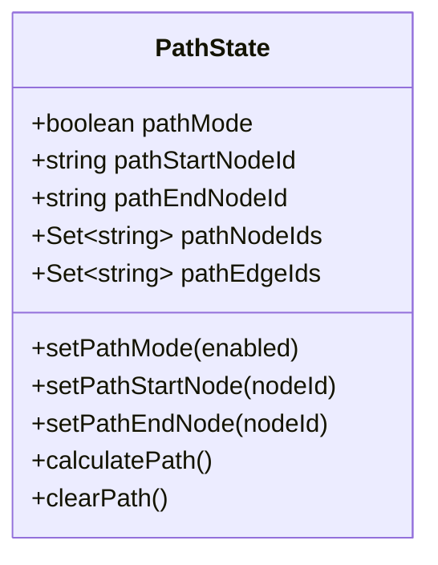
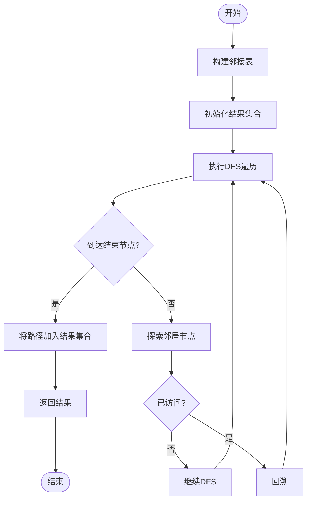
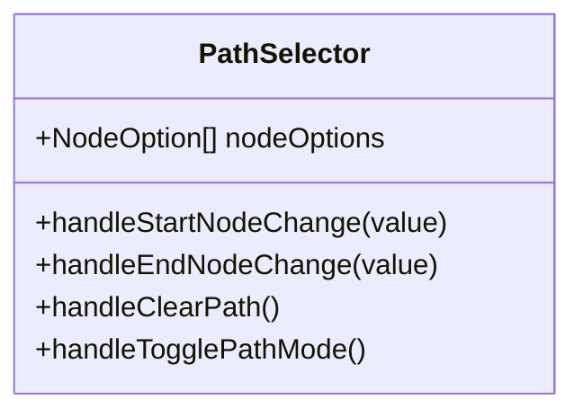
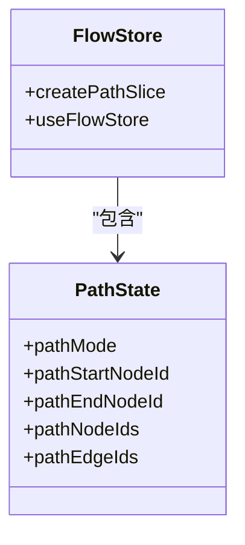
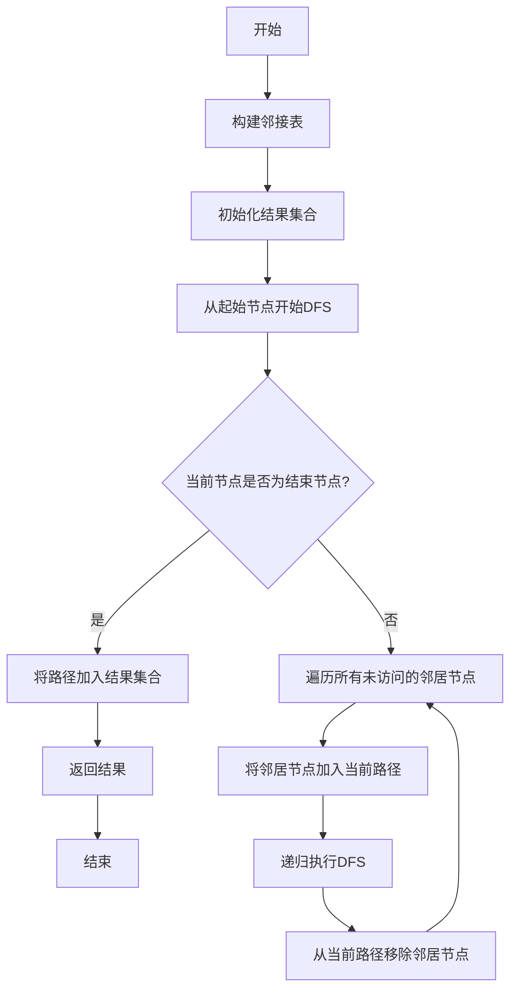
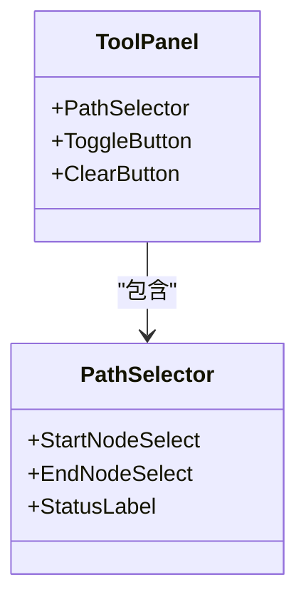
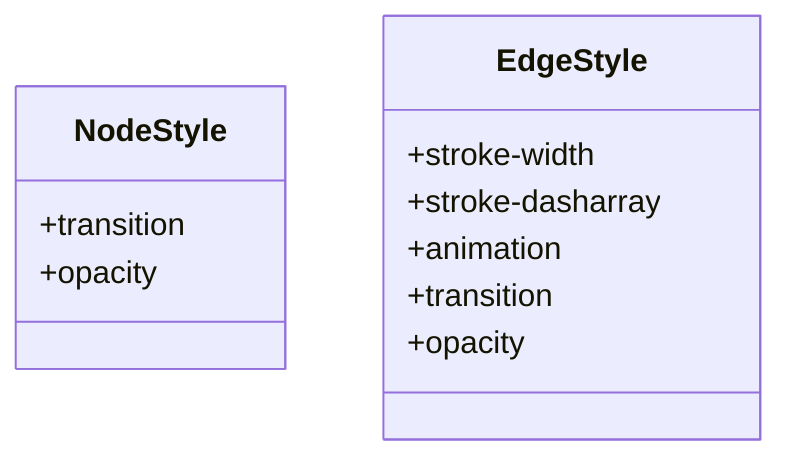
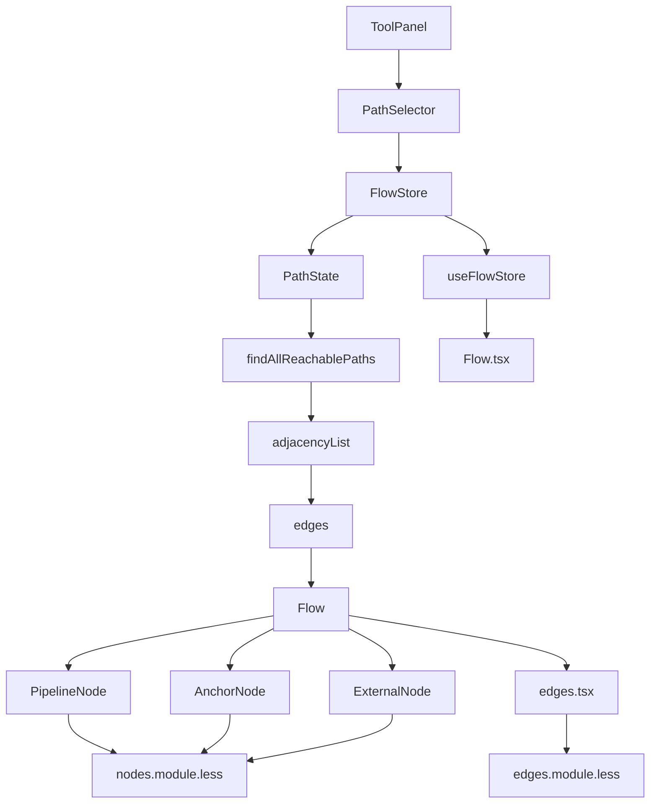

# 路径高亮

<cite>
**本文档引用的文件**   
- [main.go](file://LocalBridge/cmd/lb/main.go)
- [paths.go](file://LocalBridge/internal/paths/paths.go)
- [pathSlice.ts](file://src/stores/flow/slices/pathSlice.ts)
- [Flow.tsx](file://src/components/Flow.tsx)
- [edges.tsx](file://src/components/flow/edges.tsx)
- [PipelineNode/index.tsx](file://src/components/flow/nodes/PipelineNode/index.tsx)
- [AnchorNode.tsx](file://src/components/flow/nodes/AnchorNode.tsx)
- [ExternalNode.tsx](file://src/components/flow/nodes/ExternalNode.tsx)
- [ToolPanel.tsx](file://src/components/panels/ToolPanel.tsx)
- [nodes.module.less](file://src/styles/nodes.module.less)
- [edges.module.less](file://src/styles/edges.module.less)
</cite>

## 目录
1. [简介](#简介)
2. [功能概述](#功能概述)
3. [核心组件分析](#核心组件分析)
4. [状态管理机制](#状态管理机制)
5. [路径计算算法](#路径计算算法)
6. [用户界面交互](#用户界面交互)
7. [视觉样式设计](#视觉样式设计)
8. [依赖关系图](#依赖关系图)

## 简介
路径高亮功能是MaaPipelineEditor中的一个重要特性，它允许用户在工作流图中选择起始节点和结束节点，系统会自动计算并高亮显示所有可达路径上的节点和边。该功能通过深度优先搜索算法实现，能够帮助用户更好地理解和分析复杂的工作流结构。

## 功能概述
路径高亮功能允许用户在工作流编辑器中选择两个节点（起始节点和结束节点），系统会自动计算并高亮显示从起始节点到结束节点之间的所有可达路径。当用户选择两个节点后，系统会执行深度优先搜索（DFS）算法来查找所有可能的路径，并将路径上的节点和边进行高亮显示。

该功能的主要特点包括：
- 支持在工作流图中选择任意两个节点作为路径的起点和终点
- 自动计算并高亮显示所有可达路径上的节点和边
- 提供清晰的视觉反馈，帮助用户理解工作流的执行路径
- 支持路径模式的开启和关闭，方便用户在不同模式下查看工作流

## 核心组件分析

**路径高亮功能的核心组件包括路径状态管理、路径计算和用户界面交互三个部分。**

### 路径状态管理
路径状态管理是路径高亮功能的核心，它负责维护路径模式的状态、起始节点、结束节点以及需要高亮显示的节点和边的集合。状态管理通过Zustand库实现，确保了状态的高效更新和组件间的同步。



**代码片段路径**
- [pathSlice.ts](file://src/stores/flow/slices/pathSlice.ts#L93-L158)

### 路径计算
路径计算功能负责查找从起始节点到结束节点之间的所有可达路径。它使用深度优先搜索（DFS）算法遍历工作流图，收集所有路径上的节点和边。算法首先构建邻接表，然后从起始节点开始进行DFS遍历，记录所有可能的路径。



**代码片段路径**
- [pathSlice.ts](file://src/stores/flow/slices/pathSlice.ts#L9-L87)

### 用户界面交互
用户界面交互组件负责处理用户在界面上的操作，包括开启/关闭路径模式、选择起始节点和结束节点等。这些操作通过工具面板中的按钮和下拉菜单实现，用户可以通过点击按钮来切换路径模式，通过下拉菜单来选择节点。



**代码片段路径**
- [ToolPanel.tsx](file://src/components/panels/ToolPanel.tsx#L18-L126)

## 状态管理机制
路径高亮功能的状态管理机制基于Zustand库实现，它提供了一个全局的状态存储，用于管理路径模式的相关状态。状态存储包含路径模式开关、起始节点ID、结束节点ID、需要高亮的节点ID集合和边ID集合等属性。

状态管理机制的关键特性包括：
- **响应式更新**：当路径模式、起始节点或结束节点发生变化时，相关组件会自动重新渲染
- **状态同步**：确保所有使用路径状态的组件都能获取到最新的状态
- **性能优化**：通过useShallow等优化手段减少不必要的重新渲染

状态管理的实现方式是通过createPathSlice函数创建一个状态切片，该切片包含设置路径模式、设置起始节点、设置结束节点、计算路径和清除路径等方法。这些方法通过set函数更新状态，触发相关组件的重新渲染。



**代码片段路径**
- [pathSlice.ts](file://src/stores/flow/slices/pathSlice.ts#L89-L158)
- [Flow.tsx](file://src/components/Flow.tsx#L28)

## 路径计算算法
路径计算算法是路径高亮功能的核心，它使用深度优先搜索（DFS）算法来查找从起始节点到结束节点之间的所有可达路径。算法的主要步骤包括构建邻接表、执行DFS遍历和收集路径结果。

### 算法流程
1. **构建邻接表**：遍历所有边，为每个节点构建其邻居节点的列表
2. **初始化结果集合**：创建用于存储结果的节点ID集合和边ID集合
3. **执行DFS遍历**：从起始节点开始，递归地探索所有可能的路径
4. **收集路径结果**：当到达结束节点时，将当前路径上的所有节点和边加入结果集合

### 算法特点
- **完整性**：能够找到所有从起始节点到结束节点的可达路径
- **效率**：通过邻接表优化了图的遍历效率
- **灵活性**：支持处理复杂的图结构，包括环路和多路径



**代码片段路径**
- [pathSlice.ts](file://src/stores/flow/slices/pathSlice.ts#L9-L87)

## 用户界面交互
用户界面交互是路径高亮功能的重要组成部分，它提供了用户与功能交互的入口。用户可以通过工具面板中的"节点路径"按钮来开启或关闭路径模式，并通过下拉菜单选择起始节点和结束节点。

### 交互流程
1. **开启路径模式**：用户点击"节点路径"按钮，开启路径模式
2. **选择起始节点**：在下拉菜单中选择一个节点作为路径的起始节点
3. **选择结束节点**：在另一个下拉菜单中选择一个节点作为路径的结束节点
4. **查看结果**：系统自动计算并高亮显示所有可达路径
5. **清除路径**：用户可以点击"清除"按钮来清除当前的路径选择

### 视觉反馈
- 当路径模式开启时，"节点路径"按钮会变为蓝色，表示当前处于路径模式
- 当成功找到路径时，会显示绿色的"✓ 找到路径"提示
- 当未找到路径时，会显示红色的"✗ 未找到路径"提示
- 路径上的节点和边会被高亮显示，与其他元素形成对比



**代码片段路径**
- [ToolPanel.tsx](file://src/components/panels/ToolPanel.tsx#L18-L126)

## 视觉样式设计
视觉样式设计是路径高亮功能的重要组成部分，它通过CSS样式来实现节点和边的高亮效果。样式设计的主要目标是让用户能够清晰地识别出路径上的节点和边，同时保持整体界面的美观性。

### 节点样式
节点的高亮效果通过调整节点的透明度来实现。当节点位于路径上时，其透明度保持为1；当节点不在路径上时，其透明度会根据配置的聚焦透明度值进行调整。

```css
.node {
  transition: all 0.15s ease;
}

.node-related {
  opacity: 1;
}

.node-unrelated {
  opacity: 0.4;
}
```

### 边样式
边的高亮效果同样通过透明度调整来实现。路径上的边会保持完全不透明，而不在路径上的边会根据配置的聚焦透明度值进行淡化处理。

```css
.edge {
  stroke-width: 3;
  stroke-dasharray: 30, 5;
  animation: dash-animation 1s linear infinite;
  transition: stroke 0.2s ease, stroke-width 0.2s ease;
}

.edge-related {
  opacity: 1;
}

.edge-unrelated {
  opacity: 0.4;
}
```



**代码片段路径**
- [nodes.module.less](file://src/styles/nodes.module.less#L4-L289)
- [edges.module.less](file://src/styles/edges.module.less#L5-L98)

## 依赖关系图
路径高亮功能的各个组件之间存在复杂的依赖关系。以下图表展示了主要组件之间的依赖关系：



**代码片段路径**
- [ToolPanel.tsx](file://src/components/panels/ToolPanel.tsx#L7-L11)
- [pathSlice.ts](file://src/stores/flow/slices/pathSlice.ts#L2-L3)
- [Flow.tsx](file://src/components/Flow.tsx#L28)
- [edges.tsx](file://src/components/flow/edges.tsx#L282-L288)
- [PipelineNode/index.tsx](file://src/components/flow/nodes/PipelineNode/index.tsx#L30-L31)
- [AnchorNode.tsx](file://src/components/flow/nodes/AnchorNode.tsx#L37-L38)
- [ExternalNode.tsx](file://src/components/flow/nodes/ExternalNode.tsx#L37-L38)