# 连接

<cite>
**本文引用的文件**
- [edges.tsx](file://src/components/flow/edges.tsx)
- [edges.module.less](file://src/styles/edges.module.less)
- [edgeSlice.ts](file://src/stores/flow/slices/edgeSlice.ts)
- [edgeUtils.ts](file://src/stores/flow/utils/edgeUtils.ts)
- [Flow.tsx](file://src/components/Flow.tsx)
- [EdgePanel.tsx](file://src/components/panels/EdgePanel.tsx)
- [constants.ts](file://src/components/flow/nodes/constants.ts)
- [types.ts](file://src/stores/flow/types.ts)
- [edgeLinker.ts](file://src/core/parser/edgeLinker.ts)
- [exporter.ts](file://src/core/parser/exporter.ts)
- [importer.ts](file://src/core/parser/importer.ts)
- [40.连接.md](file://docsite/docs/01.指南/10.工作流面板/40.连接.md)
- [3.1-任务流水线协议.md](file://instructions/maafw-guide/3.1-任务流水线协议.md)
</cite>

## 更新摘要
**变更内容**
- 将 jumpback 连接逻辑从源句柄类型迁移至目标句柄类型，简化连接逻辑并提升工作流直观性
- 更新边的视觉呈现部分，反映目标句柄类型的 jumpback 样式判断
- 重构连接合法性校验与状态更新部分，说明 jumpback 属性在目标句柄的处理
- 更新编译为 Pipeline 协议的转换逻辑，说明目标句柄 jumpback 的映射规则
- 移除关于源句柄 jumpback 的过时说明与图表

## 目录
1. [简介](#简介)
2. [项目结构](#项目结构)
3. [核心组件](#核心组件)
4. [架构总览](#架构总览)
5. [详细组件分析](#详细组件分析)
6. [依赖关系分析](#依赖关系分析)
7. [性能考量](#性能考量)
8. [故障排查指南](#故障排查指南)
9. [结论](#结论)
10. [附录](#附录)

## 简介
本节围绕“连接（Edge）”在可视化流程中的作用展开，重点说明其作为控制流与数据流载体的语义：控制流体现在 next、jump_back、on_error 三类连接类型；数据流体现在边的属性（如 jump_back、anchor）与导出为 Pipeline 协议时的映射。文档结合 edges.tsx 的视觉呈现、edgeSlice.ts 的状态存储、edgeLinker.ts 的连接合法性校验与状态更新，并给出从 Flow 到 Pipeline 的转换规则，最后提供常见问题与解决方案。本次更新重点反映连接逻辑的重构，将 jumpback 从源句柄类型改为目标句柄类型，简化了连接逻辑并使工作流更直观。

## 项目结构
连接相关的代码分布在以下区域：
- 可视化渲染层：edges.tsx 定义边的绘制与样式，edges.module.less 提供样式细节
- 状态管理层：edgeSlice.ts 管理边的增删改查、顺序与冲突检测
- 工具与类型：edgeUtils.ts 提供计算与筛选工具；types.ts 定义边的结构
- 编辑器入口：Flow.tsx 注册边类型并在连接回调中调用状态层
- 面板交互：EdgePanel.tsx 提供边信息与顺序调整
- 解析与导出：edgeLinker.ts 负责从 Pipeline 文本构建边与节点；exporter.ts 将 Flow 边导出为 Pipeline 的 next/jump_back/on_error 字段

图表来源
- [edges.tsx](file://src/components/flow/edges.tsx#L1-L453)
- [edges.module.less](file://src/styles/edges.module.less#L1-L56)
- [edgeSlice.ts](file://src/stores/flow/slices/edgeSlice.ts#L1-L223)
- [edgeUtils.ts](file://src/stores/flow/utils/edgeUtils.ts#L1-L46)
- [Flow.tsx](file://src/components/Flow.tsx#L170-L200)
- [EdgePanel.tsx](file://src/components/panels/EdgePanel.tsx#L52-L183)
- [types.ts](file://src/stores/flow/types.ts#L1-L290)
- [edgeLinker.ts](file://src/core/parser/edgeLinker.ts#L1-L162)
- [exporter.ts](file://src/core/parser/exporter.ts#L1-L217)
- [importer.ts](file://src/core/parser/importer.ts#L1-L294)

章节来源
- [edges.tsx](file://src/components/flow/edges.tsx#L1-L453)
- [edges.module.less](file://src/styles/edges.module.less#L1-L56)
- [edgeSlice.ts](file://src/stores/flow/slices/edgeSlice.ts#L1-L223)
- [edgeUtils.ts](file://src/stores/flow/utils/edgeUtils.ts#L1-L46)
- [Flow.tsx](file://src/components/Flow.tsx#L170-L200)
- [EdgePanel.tsx](file://src/components/panels/EdgePanel.tsx#L52-L183)
- [types.ts](file://src/stores/flow/types.ts#L1-L290)
- [edgeLinker.ts](file://src/core/parser/edgeLinker.ts#L1-L162)
- [exporter.ts](file://src/core/parser/exporter.ts#L1-L217)
- [importer.ts](file://src/core/parser/importer.ts#L1-L294)

## 核心组件
- 边组件与样式
  - edges.tsx 使用贝塞尔曲线路径绘制边，按 sourceHandleId 和 targetHandleId 区分 next、jump_back、on_error 的视觉样式，并支持标签渲染与选中态高亮
  - edges.module.less 定义了边的颜色、动画、选中态与标签样式
- 边状态与变更
  - edgeSlice.ts 提供 addEdge、updateEdges、setEdgeLabel、setEdgeData 等接口，负责边的增删改、顺序调整、冲突检测与历史记录保存
  - edgeUtils.ts 提供计算链接次序、查找边、筛选选中边等工具
- 类型与枚举
  - types.ts 定义 EdgeType 结构，包含 id、source、sourceHandle、target、targetHandle、label、type、selected、attributes 等字段
  - constants.ts 定义 SourceHandleTypeEnum（next、error）和 TargetHandleTypeEnum（target、jump_back）
- 编辑器入口与面板
  - Flow.tsx 注册边类型并在 onConnect 回调中调用 addEdge
  - EdgePanel.tsx 展示当前选中边的源/目标、类型与顺序，并允许修改 label

章节来源
- [edges.tsx](file://src/components/flow/edges.tsx#L1-L453)
- [edges.module.less](file://src/styles/edges.module.less#L1-L56)
- [edgeSlice.ts](file://src/stores/flow/slices/edgeSlice.ts#L1-L223)
- [edgeUtils.ts](file://src/stores/flow/utils/edgeUtils.ts#L1-L46)
- [types.ts](file://src/stores/flow/types.ts#L1-L290)
- [constants.ts](file://src/components/flow/nodes/constants.ts#L1-L19)
- [Flow.tsx](file://src/components/Flow.tsx#L170-L200)
- [EdgePanel.tsx](file://src/components/panels/EdgePanel.tsx#L52-L183)

## 架构总览
连接在系统中的流转路径：
- 用户在画布上拖拽连接，触发 onConnect，调用 addEdge
- addEdge 内部进行冲突检测与顺序计算，最终通过 XYFlow 的 addEdgeRF 应用到状态
- 边的视觉由 edges.tsx 渲染，样式由 edges.module.less 控制
- 导出时，exporter.ts 将 Flow 边映射到 Pipeline 的 next/jump_back/on_error 字段，并根据 attributes 判断是否使用对象形式（含 anchor/jump_back）

图表来源
- [Flow.tsx](file://src/components/Flow.tsx#L170-L200)
- [edgeSlice.ts](file://src/stores/flow/slices/edgeSlice.ts#L152-L211)
- [edgeUtils.ts](file://src/stores/flow/utils/edgeUtils.ts#L18-L45)
- [edges.tsx](file://src/components/flow/edges.tsx#L1-L453)
- [exporter.ts](file://src/core/parser/exporter.ts#L28-L217)

## 详细组件分析

### 边的视觉呈现（edges.tsx 与样式）
- 路径与标签
  - 使用贝塞尔曲线路径绘制边，支持标签渲染与居中定位
  - 通过 sourceHandleId 和 targetHandleId 切换不同样式类，区分 next、jump_back、on_error
- 交互与选中态
  - 选中边时增加描边宽度与颜色变化
  - 标签在配置开启时显示，选中态下标签背景与字号变化
- 样式要点
  - 边默认带虚线与动画，next/jump_back/error 分别有主题色
  - 选中态边加粗，标签背景加深、字号增大
  - jump_back 连接通过 targetHandleId 为 TargetHandleTypeEnum.JumpBack 来判断，而非 sourceHandleId

图表来源
- [edges.tsx](file://src/components/flow/edges.tsx#L1-L453)
- [edges.module.less](file://src/styles/edges.module.less#L1-L56)

章节来源
- [edges.tsx](file://src/components/flow/edges.tsx#L1-L453)
- [edges.module.less](file://src/styles/edges.module.less#L1-L56)

### 边的状态管理（edgeSlice.ts）
- 关键能力
  - addEdge：在插入前进行冲突检测（next 与 on_error 不能同时指向同一目标；on_error 不允许自环），计算 label（链接次序），应用到状态
  - updateEdges：处理删除边时的 label 重排与选中边同步
  - setEdgeLabel：在同源同组内移动 label 并同步其他边的顺序
  - setEdgeData：动态设置 attributes（如 jump_back、anchor），支持删除属性
- 冲突检测规则
  - next 与 on_error 不能同时指向同一目标
  - on_error 不允许自环（source===target）
- 顺序计算
  - 同源同类型边的 label 从 1 开始递增

图表来源
- [edgeSlice.ts](file://src/stores/flow/slices/edgeSlice.ts#L152-L211)
- [edgeUtils.ts](file://src/stores/flow/utils/edgeUtils.ts#L18-L45)

章节来源
- [edgeSlice.ts](file://src/stores/flow/slices/edgeSlice.ts#L1-L223)
- [edgeUtils.ts](file://src/stores/flow/utils/edgeUtils.ts#L1-L46)

### 边的类型与属性（types.ts 与 constants.ts）
- EdgeType 字段
  - id、source、sourceHandle、target、targetHandle、label、type、selected、attributes
- attributes
  - jump_back：表示 jump_back 连接
  - anchor：表示目标为锚点（外部节点）
- SourceHandleTypeEnum
  - next、error
- TargetHandleTypeEnum
  - target、jump_back

```mermaid
classDiagram
class EdgeType {
+string id
+string source
+SourceHandleTypeEnum sourceHandle
+string target
+TargetHandleTypeEnum targetHandle
+number label
+string type
+boolean selected
+EdgeAttributesType attributes
}
class EdgeAttributesType {
+boolean jump_back
+boolean anchor
}
class SourceHandleTypeEnum {
+Next
+Error
}
class TargetHandleTypeEnum {
+Target
+JumpBack
}
EdgeType --> EdgeAttributesType : "包含"
EdgeType --> SourceHandleTypeEnum : "使用"
EdgeType --> TargetHandleTypeEnum : "使用"
```

图表来源
- [types.ts](file://src/stores/flow/types.ts#L1-L290)
- [constants.ts](file://src/components/flow/nodes/constants.ts#L1-L19)

章节来源
- [types.ts](file://src/stores/flow/types.ts#L1-L290)
- [constants.ts](file://src/components/flow/nodes/constants.ts#L1-L19)

### 用户拖拽创建连接与交互（Flow.tsx 与 EdgePanel.tsx）
- 拖拽创建
  - Flow.tsx 注册边类型并绑定 onConnect，回调中调用 addEdge，从而触发现有冲突检测与顺序计算
- 边信息面板
  - EdgePanel.tsx 展示当前选中边的源/目标、类型与最大顺序，并允许调整 label
  - 最大顺序按同源同组规则统计

图表来源
- [Flow.tsx](file://src/components/Flow.tsx#L170-L200)
- [edgeSlice.ts](file://src/stores/flow/slices/edgeSlice.ts#L152-L211)
- [EdgePanel.tsx](file://src/components/panels/EdgePanel.tsx#L52-L183)

章节来源
- [Flow.tsx](file://src/components/Flow.tsx#L170-L200)
- [EdgePanel.tsx](file://src/components/panels/EdgePanel.tsx#L52-L183)

### 连接合法性校验与状态更新（edgeLinker.ts）
- 从 Pipeline 文本构建边与节点
  - parseNodeRef 支持字符串与对象两种形式，解析 [Anchor]、[JumpBack] 前缀，生成 attributes
  - linkEdge 根据源标签与目标引用数组创建边，必要时创建外部节点或锚点节点
  - 当 attributes.jump_back 且类型为 next 时，目标句柄类型设置为 TargetHandleTypeEnum.JumpBack，并移除 jump_back 属性
- 返回值
  - 新增边数组、新增节点数组、新增 ID-Label 对应关系

图表来源
- [edgeLinker.ts](file://src/core/parser/edgeLinker.ts#L1-L162)

章节来源
- [edgeLinker.ts](file://src/core/parser/edgeLinker.ts#L1-L162)

### 编译为 Pipeline 协议的转换逻辑
- 导出映射规则
  - sourceHandle 为 next 时，导出为 next 字段
  - sourceHandle 为 error 时，导出为 on_error 字段
  - targetHandle 为 jump_back 时，表示该连接为 jump_back 类型
  - attributes.anchor 与 targetHandle.jump_back 决定目标引用形式：
    - 使用对象形式：包含 name、anchor、jump_back
    - 使用字符串形式：仅目标名
- 目标节点前缀
  - 若目标节点存在于当前文件范围内，导出时加上文件前缀；否则使用原始标签

图表来源
- [exporter.ts](file://src/core/parser/exporter.ts#L74-L217)

章节来源
- [exporter.ts](file://src/core/parser/exporter.ts#L28-L217)

### 导入 Pipeline 至 Flow 的解析流程
- 导入步骤
  - 解析配置、迁移旧字段（如 is_sub -> [JumpBack] 前缀）
  - 解析节点，建立 ID-Label 映射
  - 针对每个节点的 next 与 on_error，调用 linkEdge 构建边与必要节点
  - 替换 Flow 状态并初始化历史记录
- 注意事项
  - next 与 on_error 的去重约束在 addEdge 中体现（文档安全规则）

图表来源
- [importer.ts](file://src/core/parser/importer.ts#L121-L294)
- [edgeLinker.ts](file://src/core/parser/edgeLinker.ts#L80-L162)
- [edgeSlice.ts](file://src/stores/flow/slices/edgeSlice.ts#L214-L223)

章节来源
- [importer.ts](file://src/core/parser/importer.ts#L121-L294)
- [edgeLinker.ts](file://src/core/parser/edgeLinker.ts#L80-L162)
- [edgeSlice.ts](file://src/stores/flow/slices/edgeSlice.ts#L214-L223)

## 依赖关系分析
- 组件耦合
  - edges.tsx 依赖样式模块与 SourceHandleTypeEnum、TargetHandleTypeEnum
  - edgeSlice.ts 依赖 edgeUtils.ts 与 types.ts
  - Flow.tsx 依赖 edgeSlice.ts 与 edgeTypes
  - EdgePanel.tsx 依赖 edgeSlice.ts 与 types.ts
  - edgeLinker.ts 依赖 types.ts 与节点创建工具
  - exporter.ts 依赖 types.ts 与节点类型枚举
- 外部依赖
  - @xyflow/react 提供边渲染与连接回调
  - Less 样式系统提供边与标签样式

图表来源
- [edges.tsx](file://src/components/flow/edges.tsx#L1-L453)
- [edges.module.less](file://src/styles/edges.module.less#L1-L56)
- [edgeSlice.ts](file://src/stores/flow/slices/edgeSlice.ts#L1-L223)
- [edgeUtils.ts](file://src/stores/flow/utils/edgeUtils.ts#L1-L46)
- [Flow.tsx](file://src/components/Flow.tsx#L170-L200)
- [EdgePanel.tsx](file://src/components/panels/EdgePanel.tsx#L52-L183)
- [types.ts](file://src/stores/flow/types.ts#L1-L290)
- [edgeLinker.ts](file://src/core/parser/edgeLinker.ts#L1-L162)
- [exporter.ts](file://src/core/parser/exporter.ts#L1-L217)
- [importer.ts](file://src/core/parser/importer.ts#L1-L294)

章节来源
- [edges.tsx](file://src/components/flow/edges.tsx#L1-L453)
- [edgeSlice.ts](file://src/stores/flow/slices/edgeSlice.ts#L1-L223)
- [Flow.tsx](file://src/components/Flow.tsx#L170-L200)
- [EdgePanel.tsx](file://src/components/panels/EdgePanel.tsx#L52-L183)
- [edgeLinker.ts](file://src/core/parser/edgeLinker.ts#L1-L162)
- [exporter.ts](file://src/core/parser/exporter.ts#L1-L217)
- [importer.ts](file://src/core/parser/importer.ts#L1-L294)

## 性能考量
- 边渲染
  - 使用贝塞尔曲线路径与标签渲染，建议在大量边场景下适当关闭标签显示以减少 DOM 数量
- 状态更新
  - addEdge 与 setEdgeLabel 会批量更新同源同组边的 label，避免频繁重排
- 导出
  - 导出时按边遍历构建映射，复杂度与边数量线性相关；尽量避免冗余边与重复目标

[本节为通用性能建议，不直接分析具体文件]

## 故障排查指南
- 无效连接
  - 现象：拖拽连接后无边出现或立即回退
  - 排查：检查冲突检测规则（next 与 on_error 不能指向同一目标；on_error 自环）
  - 参考：[edgeSlice.ts](file://src/stores/flow/slices/edgeSlice.ts#L157-L189)
- 循环依赖检测
  - 现象：导出后 Pipeline 报错或运行异常
  - 排查：确认 next 与 on_error 的去重约束
  - 参考：[40.连接.md](file://docsite/docs/01.指南/10.工作流面板/40.连接.md#L59-L64)
- 顺序错乱
  - 现象：边顺序显示异常
  - 排查：使用 EdgePanel 调整 label；确认同源同组
  - 参考：[EdgePanel.tsx](file://src/components/panels/EdgePanel.tsx#L52-L183)、[edgeSlice.ts](file://src/stores/flow/slices/edgeSlice.ts#L102-L149)
- 导出字段缺失
  - 现象：导出后缺少 next/jump_back/on_error
  - 排查：确认边的 sourceHandle 类型与 attributes（jump_back、anchor）是否正确
  - 参考：[exporter.ts](file://src/core/parser/exporter.ts#L74-L217)
- 控制点不显示
  - 现象：连接线上没有控制点
  - 排查：检查配置项 showEdgeControlPoint 是否启用
  - 参考：[edges.tsx](file://src/components/flow/edges.tsx#L159-L160)
- 控制点拖拽无效
  - 现象：拖拽控制点无法调整连接线曲率
  - 排查：检查鼠标事件处理逻辑，确认屏幕坐标到画布坐标的转换是否正确
  - 参考：[edges.tsx](file://src/components/flow/edges.tsx#L225-L267)

章节来源
- [edgeSlice.ts](file://src/stores/flow/slices/edgeSlice.ts#L157-L189)
- [EdgePanel.tsx](file://src/components/panels/EdgePanel.tsx#L52-L183)
- [exporter.ts](file://src/core/parser/exporter.ts#L74-L217)
- [40.连接.md](file://docsite/docs/01.指南/10.工作流面板/40.连接.md#L59-L64)
- [edges.tsx](file://src/components/flow/edges.tsx#L159-L160)
- [edges.tsx](file://src/components/flow/edges.tsx#L225-L267)

## 结论
连接（Edge）在本系统中承担双重职责：控制流（next/jump_back/on_error）与数据流（attributes、锚点与跳转）。其视觉呈现由 edges.tsx 与样式模块共同实现，状态管理由 edgeSlice.ts 提供完善的增删改查与冲突检测，解析与导出通过 edgeLinker.ts 与 exporter.ts 将 Flow 边映射到 Pipeline 协议。用户可通过拖拽创建连接，借助边面板调整顺序与属性，系统在多处保障连接的合法性与一致性。本次重构将 jumpback 从源句柄类型改为目标句柄类型，简化了连接逻辑并使工作流更直观。

[本节为总结性内容，不直接分析具体文件]

## 附录
- 连接安全规则摘要
  - next 与 on_error 不能同时指向同一目标
  - on_error 不允许自环（source===target）
- 导出映射规则摘要
  - next 导出为 next 字段
  - on_error 导出为 on_error 字段
  - targetHandle.jump_back 表示 jump_back 连接
  - attributes.anchor/jump_back 决定目标引用形式（对象 vs 字符串）
- 控制点交互规则
  - 控制点默认透明，鼠标悬停时显示
  - 拖拽控制点可实时调整连接线曲率
  - 双击控制点可重置曲率调整
  - 控制点位置基于连接线中点计算

章节来源
- [40.连接.md](file://docsite/docs/01.指南/10.工作流面板/40.连接.md#L59-L64)
- [exporter.ts](file://src/core/parser/exporter.ts#L74-L217)
- [edgeLinker.ts](file://src/core/parser/edgeLinker.ts#L80-L162)
- [edges.tsx](file://src/components/flow/edges.tsx#L159-L160)
- [edges.tsx](file://src/components/flow/edges.tsx#L225-L267)