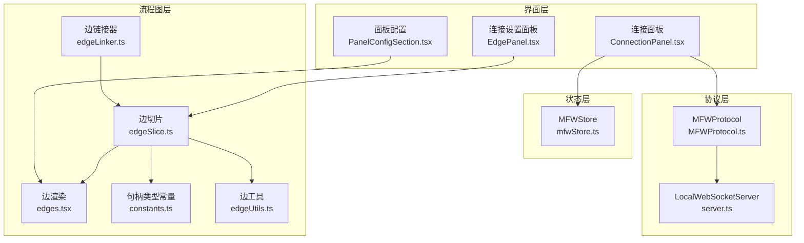
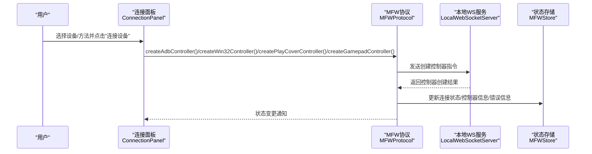
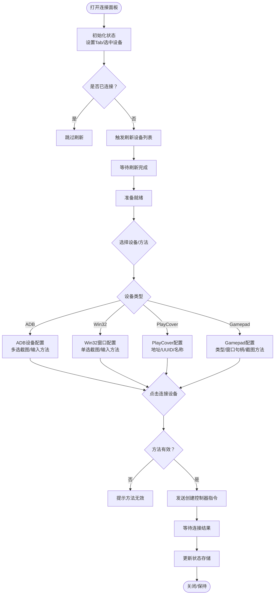
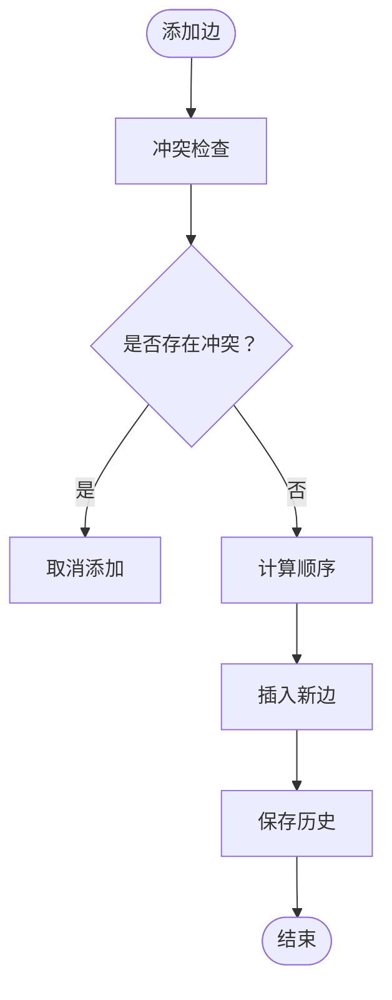
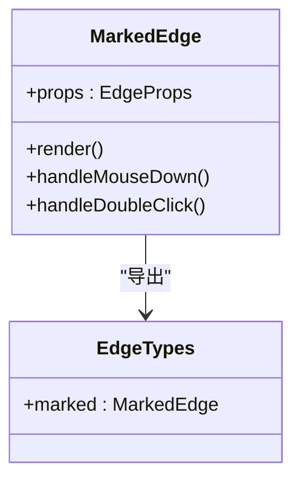
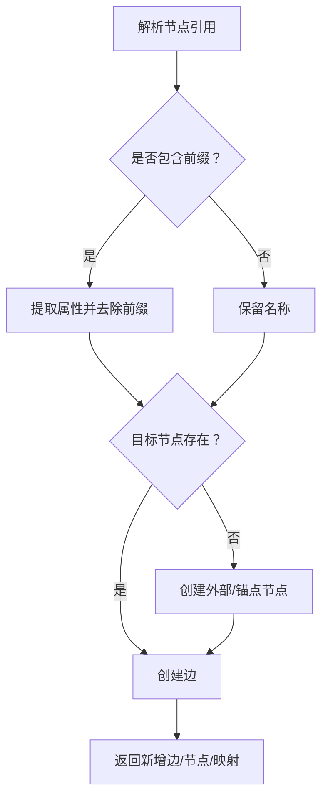
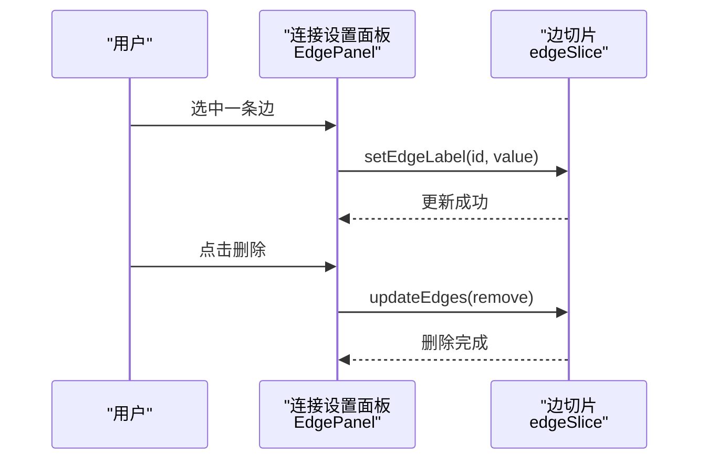
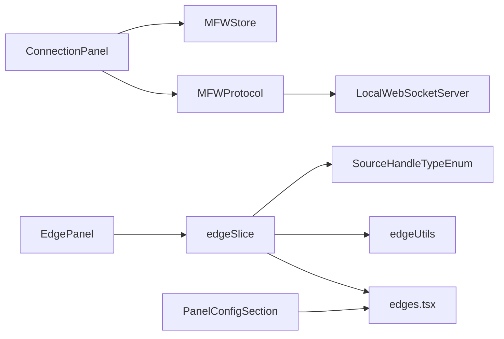

# 连接面板

<cite>
**本文档引用的文件**
- [ConnectionPanel.tsx](file://src/components/panels/main/ConnectionPanel.tsx)
- [mfwStore.ts](file://src/stores/mfwStore.ts)
- [MFWProtocol.ts](file://src/services/protocols/MFWProtocol.ts)
- [server.ts](file://src/services/server.ts)
- [edgeSlice.ts](file://src/stores/flow/slices/edgeSlice.ts)
- [edgeLinker.ts](file://src/core/parser/edgeLinker.ts)
- [edges.tsx](file://src/components/flow/edges.tsx)
- [constants.ts](file://src/components/flow/nodes/constants.ts)
- [edgeUtils.ts](file://src/stores/flow/utils/edgeUtils.ts)
- [EdgePanel.tsx](file://src/components/panels/main/EdgePanel.tsx)
- [PanelConfigSection.tsx](file://src/components/panels/config/PanelConfigSection.tsx)
</cite>

## 更新摘要
**变更内容**
- 新增 PlayCover 和 Gamepad 设备类型支持
- 优化设备列表刷新机制和用户体验
- 增强截图和输入方法的配置灵活性
- 改进连接状态管理和错误处理
- 优化边标签显示性能配置

## 目录
1. [简介](#简介)
2. [项目结构](#项目结构)
3. [核心组件](#核心组件)
4. [架构总览](#架构总览)
5. [详细组件分析](#详细组件分析)
6. [依赖分析](#依赖分析)
7. [性能考虑](#性能考虑)
8. [故障排查指南](#故障排查指南)
9. [结论](#结论)

## 简介
连接面板用于在可视化编辑器中选择并连接各种类型的设备，包括 ADB 设备、Win32 窗口、PlayCover iOS 应用和 Gamepad 手柄。它通过协议层与本地服务进行交互，实现设备发现、连接建立、断开以及状态反馈；同时支持在流程图中对"连接"（边）进行顺序与属性配置，确保流程控制语义清晰、可维护性强。

**更新** 新增对 PlayCover 和 Gamepad 设备类型的支持，提供更丰富的设备连接选项。

## 项目结构
连接面板位于组件层，配合状态存储、协议层与流程图渲染共同工作：
- 组件层：连接面板负责用户交互与设备选择
- 状态层：MFWStore 维护连接状态、设备列表与错误信息
- 协议层：MFWProtocol 通过 WebSocket 与本地服务通信，下发设备刷新、创建控制器、断开等指令，并接收设备列表与连接结果
- 流程图层：边的添加、删除、顺序调整与样式渲染

**图表来源**
- [ConnectionPanel.tsx](file://src/components/panels/main/ConnectionPanel.tsx#L1-L993)
- [mfwStore.ts](file://src/stores/mfwStore.ts#L1-L158)
- [MFWProtocol.ts](file://src/services/protocols/MFWProtocol.ts#L1-L574)
- [server.ts](file://src/services/server.ts#L1-L374)
- [edgeSlice.ts](file://src/stores/flow/slices/edgeSlice.ts#L1-L221)
- [edgeLinker.ts](file://src/core/parser/edgeLinker.ts#L1-L159)
- [edges.tsx](file://src/components/flow/edges.tsx#L1-L530)
- [constants.ts](file://src/components/flow/nodes/constants.ts#L1-L47)
- [edgeUtils.ts](file://src/stores/flow/utils/edgeUtils.ts#L1-L32)
- [EdgePanel.tsx](file://src/components/panels/main/EdgePanel.tsx#L1-L281)
- [PanelConfigSection.tsx](file://src/components/panels/config/PanelConfigSection.tsx#L1-L459)

**章节来源**
- [ConnectionPanel.tsx](file://src/components/panels/main/ConnectionPanel.tsx#L1-L993)
- [mfwStore.ts](file://src/stores/mfwStore.ts#L1-L158)
- [MFWProtocol.ts](file://src/services/protocols/MFWProtocol.ts#L1-L574)
- [server.ts](file://src/services/server.ts#L1-L374)
- [edgeSlice.ts](file://src/stores/flow/slices/edgeSlice.ts#L1-L221)
- [edgeLinker.ts](file://src/core/parser/edgeLinker.ts#L1-L159)
- [edges.tsx](file://src/components/flow/edges.tsx#L1-L530)
- [constants.ts](file://src/components/flow/nodes/constants.ts#L1-L47)
- [edgeUtils.ts](file://src/stores/flow/utils/edgeUtils.ts#L1-L32)
- [EdgePanel.tsx](file://src/components/panels/main/EdgePanel.tsx#L1-L281)
- [PanelConfigSection.tsx](file://src/components/panels/config/PanelConfigSection.tsx#L1-L459)

## 核心组件
- 连接面板（ConnectionPanel）
  - 提供 ADB 设备、Win32 窗口、PlayCover 和 Gamepad 四类设备的选择与连接入口
  - 支持截图方法与输入方法的自定义选择，ADB 设备支持多选，Win32 窗口支持单选
  - 提供刷新、连接、断开、切换连接等操作
  - 展示连接状态徽章与错误提示
  - 新增 PlayCover iOS 应用连接和 Gamepad 手柄连接功能
- MFWStore（mfwStore）
  - 维护连接状态、控制器类型与 ID、设备信息、设备列表与错误信息
  - 支持四种设备类型的设备信息结构
  - 提供更新设备列表、设置连接状态、清除连接等接口
- MFWProtocol（MFWProtocol）
  - 注册设备列表与控制器状态路由
  - 下发刷新设备列表、创建控制器、断开控制器等指令
  - 接收设备列表与连接结果，更新状态存储
  - 支持四种设备类型的控制器创建
- 边切片（edgeSlice）
  - 管理边集合、边顺序、边属性
  - 在添加边时进行冲突检查与顺序计算
  - 在删除边时维护同源同类型边的顺序一致性
- 边渲染（edges.tsx）
  - 根据源句柄类型渲染不同样式的边与标签
  - 支持边控制点拖拽和路径调整
  - 优化边标签显示性能配置
- 边工具（edgeUtils）
  - 提供查找边、筛选选中边、计算链接顺序等工具
- 连接设置面板（EdgePanel）
  - 展示当前选中边的源/目标节点、连接类型与顺序
  - 支持修改边顺序与删除边
- 面板配置（PanelConfigSection）
  - 提供边标签显示开关和刷新间隔配置
  - 支持实时画面预览功能配置

**章节来源**
- [ConnectionPanel.tsx](file://src/components/panels/main/ConnectionPanel.tsx#L1-L993)
- [mfwStore.ts](file://src/stores/mfwStore.ts#L1-L158)
- [MFWProtocol.ts](file://src/services/protocols/MFWProtocol.ts#L1-L574)
- [edgeSlice.ts](file://src/stores/flow/slices/edgeSlice.ts#L1-L221)
- [edgeLinker.ts](file://src/core/parser/edgeLinker.ts#L1-L159)
- [edges.tsx](file://src/components/flow/edges.tsx#L1-L530)
- [edgeUtils.ts](file://src/stores/flow/utils/edgeUtils.ts#L1-L32)
- [EdgePanel.tsx](file://src/components/panels/main/EdgePanel.tsx#L1-L281)
- [PanelConfigSection.tsx](file://src/components/panels/config/PanelConfigSection.tsx#L1-L459)

## 架构总览
连接面板与流程图的交互路径如下：
- 用户在连接面板选择设备并配置方法后，点击"连接设备"，触发协议层发送创建控制器指令
- 协议层接收设备列表与连接结果，更新状态存储
- 用户在流程图中拖拽边时，边切片根据句柄类型与现有边集合进行冲突检查与顺序计算
- 边渲染根据句柄类型与选中状态渲染不同样式与标签
- 面板配置影响边标签显示和实时画面预览性能

**图表来源**
- [ConnectionPanel.tsx](file://src/components/panels/main/ConnectionPanel.tsx#L240-L324)
- [MFWProtocol.ts](file://src/services/protocols/MFWProtocol.ts#L300-L417)
- [server.ts](file://src/services/server.ts#L105-L252)
- [mfwStore.ts](file://src/stores/mfwStore.ts#L102-L158)

**章节来源**
- [ConnectionPanel.tsx](file://src/components/panels/main/ConnectionPanel.tsx#L1-L993)
- [MFWProtocol.ts](file://src/services/protocols/MFWProtocol.ts#L1-L574)
- [server.ts](file://src/services/server.ts#L1-L374)
- [mfwStore.ts](file://src/stores/mfwStore.ts#L1-L158)

## 详细组件分析

### 连接面板（ConnectionPanel）
- 设备选择与方法配置
  - ADB 设备列表与 Win32 窗口列表分别渲染，支持点击选择
  - PlayCover 和 Gamepad 提供专用表单配置
  - 截图方法与输入方法下拉框支持"自动选择"或手动指定
  - ADB 设备支持多选截图和输入方法，Win32 窗口支持单选
  - 当切换设备或首次打开面板时，自动刷新对应设备列表
- 连接控制
  - "连接设备"按钮在满足条件时启用（已选中设备且方法有效）
  - "断开连接"按钮在已连接时可用
  - "连接新设备"在当前设备非已连接设备时可用
- 状态展示
  - 连接状态徽章随状态变化
  - 已连接时展示当前设备信息
  - 出错时展示错误提示
- 新增功能
  - PlayCover 连接：支持 iOS 应用连接，需要地址、UUID 和可选名称
  - Gamepad 连接：支持 Xbox360 和 DualShock4 手柄，可配置窗口句柄和截图方法

**图表来源**
- [ConnectionPanel.tsx](file://src/components/panels/main/ConnectionPanel.tsx#L167-L324)
- [MFWProtocol.ts](file://src/services/protocols/MFWProtocol.ts#L300-L417)
- [mfwStore.ts](file://src/stores/mfwStore.ts#L102-L158)

**章节来源**
- [ConnectionPanel.tsx](file://src/components/panels/main/ConnectionPanel.tsx#L1-L993)

### 边添加与顺序管理（edgeSlice）
- 冲突检查
  - 对 next、jump_back、on_error 三类句柄在同一源节点上的组合进行互斥检查
  - on_error 自环（源=目标）直接拒绝
- 顺序计算
  - 根据现有边集合与句柄类型计算新边的 label
  - next 与 jump_back 共享同一组顺序
- 删除处理
  - 删除边后，同源同类型边 label 递减，保证连续性

**图表来源**
- [edgeSlice.ts](file://src/stores/flow/slices/edgeSlice.ts#L150-L209)
- [edgeUtils.ts](file://src/stores/flow/utils/edgeUtils.ts#L17-L32)
- [constants.ts](file://src/components/flow/nodes/constants.ts#L1-L11)

**章节来源**
- [edgeSlice.ts](file://src/stores/flow/slices/edgeSlice.ts#L1-L221)
- [edgeUtils.ts](file://src/stores/flow/utils/edgeUtils.ts#L1-L32)
- [constants.ts](file://src/components/flow/nodes/constants.ts#L1-L47)

### 边渲染与样式（edges.tsx）
- 根据源句柄类型渲染不同样式类
- 支持边控制点拖拽和路径调整
- 选中状态与标签显示受配置影响
- 使用贝塞尔曲线绘制路径与标签定位
- 优化边标签显示性能配置

**图表来源**
- [edges.tsx](file://src/components/flow/edges.tsx#L188-L530)

**章节来源**
- [edges.tsx](file://src/components/flow/edges.tsx#L1-L530)

### 节点引用与外部节点（edgeLinker）
- 支持字符串与对象两种节点引用格式
- 字符串前缀支持 [Anchor] 与 [JumpBack]
- 不存在的目标节点会创建外部节点或锚点节点，并返回新增边与节点

**图表来源**
- [edgeLinker.ts](file://src/core/parser/edgeLinker.ts#L37-L159)

**章节来源**
- [edgeLinker.ts](file://src/core/parser/edgeLinker.ts#L1-L159)

### 连接设置面板（EdgePanel）
- 展示当前选中边的源/目标节点名称、连接类型与顺序
- 提供顺序输入框与最大值限制
- 支持删除当前边
- 支持 JumpBack 属性开关

**图表来源**
- [EdgePanel.tsx](file://src/components/panels/main/EdgePanel.tsx#L130-L281)
- [edgeSlice.ts](file://src/stores/flow/slices/edgeSlice.ts#L101-L147)

**章节来源**
- [EdgePanel.tsx](file://src/components/panels/main/EdgePanel.tsx#L1-L281)
- [edgeSlice.ts](file://src/stores/flow/slices/edgeSlice.ts#L101-L147)

### 面板配置（PanelConfigSection）
- 提供边标签显示开关配置
- 支持实时画面预览功能配置
- 提供画面刷新间隔设置（200-5000ms）
- 优化边标签显示对性能的影响

**章节来源**
- [PanelConfigSection.tsx](file://src/components/panels/config/PanelConfigSection.tsx#L1-L459)

## 依赖分析
- 组件与状态
  - ConnectionPanel 依赖 MFWStore 的连接状态、设备列表与错误信息
  - EdgePanel 依赖 FlowStore 的边集合与节点集合
- 协议与服务
  - MFWProtocol 依赖 LocalWebSocketServer 发送/接收消息
  - MFWProtocol 注册设备列表与控制器状态路由，更新 MFWStore
  - 支持四种设备类型的控制器创建
- 流程图与边
  - edgeSlice 依赖 constants 中的句柄类型与 edgeUtils 的顺序计算
  - edges.tsx 依赖配置存储决定标签显示
  - PanelConfigSection 影响边渲染性能

**图表来源**
- [ConnectionPanel.tsx](file://src/components/panels/main/ConnectionPanel.tsx#L1-L993)
- [mfwStore.ts](file://src/stores/mfwStore.ts#L1-L158)
- [MFWProtocol.ts](file://src/services/protocols/MFWProtocol.ts#L1-L574)
- [server.ts](file://src/services/server.ts#L1-L374)
- [EdgePanel.tsx](file://src/components/panels/main/EdgePanel.tsx#L1-L281)
- [edgeSlice.ts](file://src/stores/flow/slices/edgeSlice.ts#L1-L221)
- [constants.ts](file://src/components/flow/nodes/constants.ts#L1-L47)
- [edgeUtils.ts](file://src/stores/flow/utils/edgeUtils.ts#L1-L32)
- [edges.tsx](file://src/components/flow/edges.tsx#L1-L530)
- [PanelConfigSection.tsx](file://src/components/panels/config/PanelConfigSection.tsx#L1-L459)

**章节来源**
- [ConnectionPanel.tsx](file://src/components/panels/main/ConnectionPanel.tsx#L1-L993)
- [MFWProtocol.ts](file://src/services/protocols/MFWProtocol.ts#L1-L574)
- [server.ts](file://src/services/server.ts#L1-L374)
- [edgeSlice.ts](file://src/stores/flow/slices/edgeSlice.ts#L1-L221)
- [edges.tsx](file://src/components/flow/edges.tsx#L1-L530)
- [constants.ts](file://src/components/flow/nodes/constants.ts#L1-L47)
- [edgeUtils.ts](file://src/stores/flow/utils/edgeUtils.ts#L1-L32)
- [EdgePanel.tsx](file://src/components/panels/main/EdgePanel.tsx#L1-L281)
- [PanelConfigSection.tsx](file://src/components/panels/config/PanelConfigSection.tsx#L1-L459)

## 性能考虑
- 设备列表刷新
  - 刷新操作仅在面板打开且未连接时触发，避免不必要的网络请求
  - 刷新完成后延迟关闭加载状态，减少频繁刷新
  - 新增访问记录机制，避免重复刷新相同设备类型
- 边顺序计算
  - 顺序计算基于现有边集合遍历，复杂度与边数量线性相关
  - 删除边时仅对同源同类型边进行 label 调整，避免全量重排
  - 边标签显示可通过配置开关优化性能
- 渲染优化
  - 连接面板使用记忆化与条件渲染，减少不必要的重绘
  - 边渲染根据选中状态与句柄类型动态选择样式类，避免冗余 DOM 操作
  - 实时画面预览支持可调节刷新间隔，平衡性能与体验
- 新增设备类型优化
  - PlayCover 和 Gamepad 连接采用表单配置，减少设备发现开销
  - 手柄连接支持可选参数，避免不必要的截图方法配置

**章节来源**
- [ConnectionPanel.tsx](file://src/components/panels/main/ConnectionPanel.tsx#L209-L238)
- [edgeSlice.ts](file://src/stores/flow/slices/edgeSlice.ts#L150-L209)
- [edges.tsx](file://src/components/flow/edges.tsx#L472-L496)
- [PanelConfigSection.tsx](file://src/components/panels/config/PanelConfigSection.tsx#L425-L453)

## 故障排查指南
- 无法连接设备
  - 检查本地服务是否运行且端口可用
  - 确认协议版本匹配，不匹配会导致握手失败
  - 查看错误提示，确认设备方法是否有效
  - 对于 PlayCover，确认 iOS 应用已正确配置地址和 UUID
  - 对于 Gamepad，确认已安装 ViGEm Bus Driver
- 设备列表为空
  - 点击"刷新"重新获取设备列表
  - 确认设备驱动/权限正确（ADB/Win32）
  - 检查防火墙设置是否阻止本地连接
- 连接后断开
  - 检查控制器状态路由是否收到断开通知
  - 确认控制器 ID 与设备信息一致
  - 验证设备连接稳定性
- 边顺序异常
  - 删除边后顺序可能发生变化，重新设置顺序
  - 确认 next/jump_back 共享顺序规则
- 性能问题
  - 关闭边标签显示以提升拖拽性能
  - 调整实时画面刷新间隔
  - 检查系统资源使用情况

**章节来源**
- [server.ts](file://src/services/server.ts#L105-L252)
- [MFWProtocol.ts](file://src/services/protocols/MFWProtocol.ts#L38-L97)
- [edgeSlice.ts](file://src/stores/flow/slices/edgeSlice.ts#L150-L209)
- [PanelConfigSection.tsx](file://src/components/panels/config/PanelConfigSection.tsx#L127-L152)

## 结论
连接面板通过清晰的设备选择与方法配置，结合协议层与状态层的协作，实现了稳定的多设备连接体验；同时，流程图中的边管理与渲染确保了连接语义的直观表达与可控性。新增的 PlayCover 和 Gamepad 支持进一步扩展了应用的设备兼容性，而面板配置选项则为用户提供了灵活的性能优化手段。整体设计在易用性、扩展性和性能之间取得良好平衡，便于后续增加新的设备类型与连接能力。