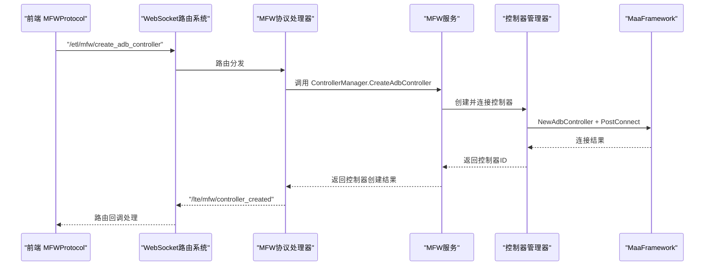
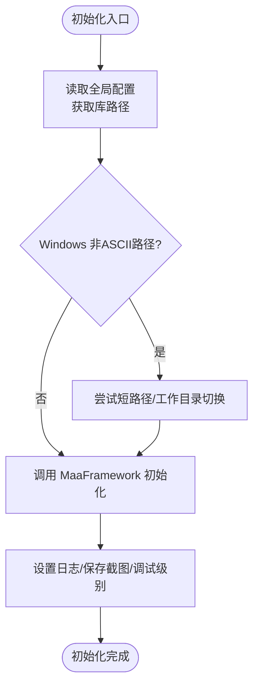
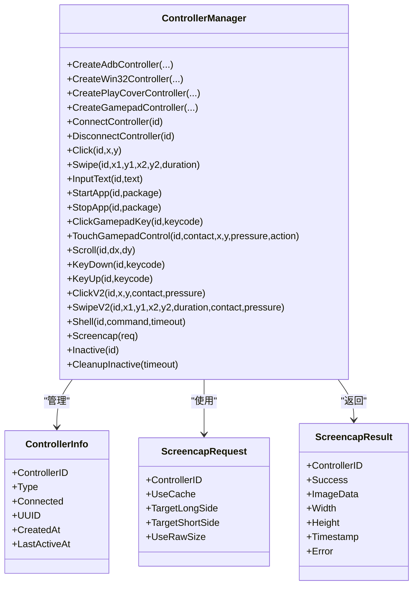
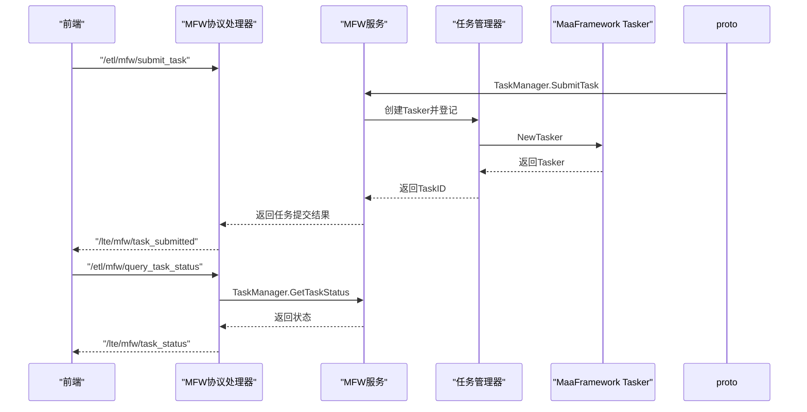
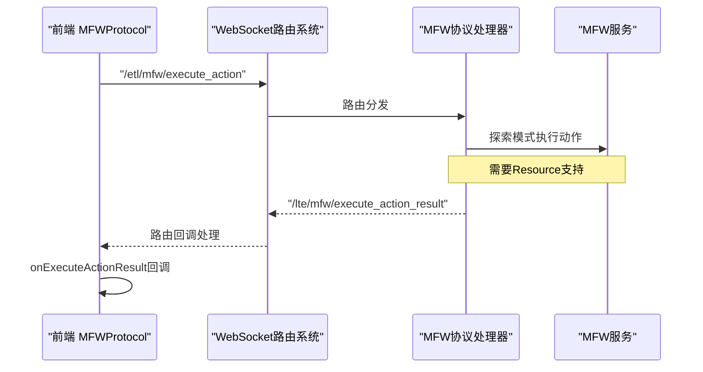
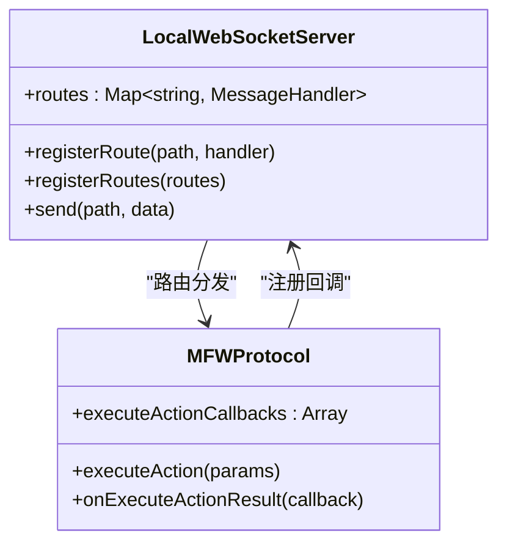
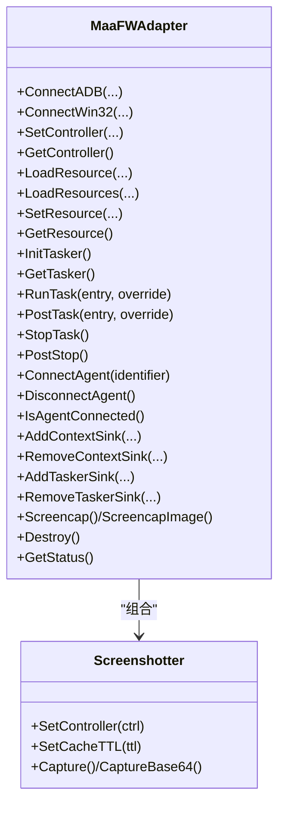
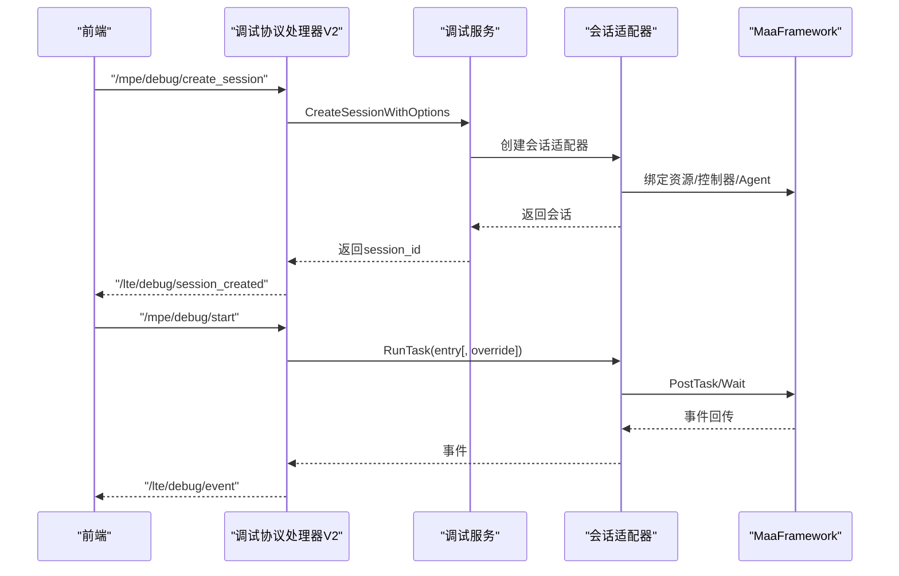
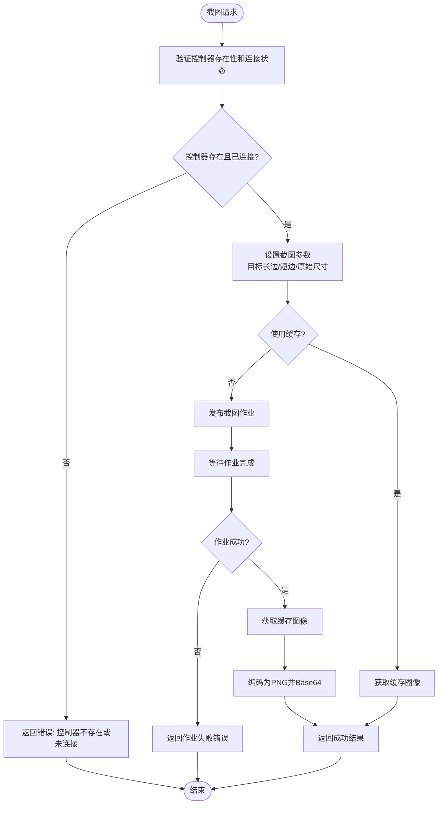
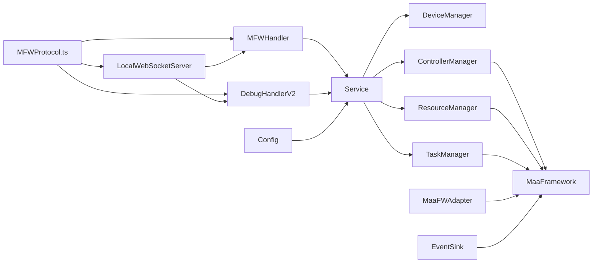

# MFW协议

<cite>
**本文引用的文件**
- [LocalBridge/internal/mfw/service.go](file://LocalBridge/internal/mfw/service.go)
- [LocalBridge/internal/mfw/controller_manager.go](file://LocalBridge/internal/mfw/controller_manager.go)
- [LocalBridge/internal/mfw/device_manager.go](file://LocalBridge/internal/mfw/device_manager.go)
- [LocalBridge/internal/mfw/resource_manager.go](file://LocalBridge/internal/mfw/resource_manager.go)
- [LocalBridge/internal/mfw/task_manager.go](file://LocalBridge/internal/mfw/task_manager.go)
- [LocalBridge/internal/mfw/types.go](file://LocalBridge/internal/mfw/types.go)
- [LocalBridge/internal/mfw/error.go](file://LocalBridge/internal/mfw/error.go)
- [LocalBridge/internal/mfw/adapter.go](file://LocalBridge/internal/mfw/adapter.go)
- [LocalBridge/internal/mfw/reco_detail_helper.go](file://LocalBridge/internal/mfw/reco_detail_helper.go)
- [LocalBridge/internal/mfw/event_sink.go](file://LocalBridge/internal/mfw/event_sink.go)
- [LocalBridge/internal/protocol/mfw/handler.go](file://LocalBridge/internal/protocol/mfw/handler.go)
- [LocalBridge/internal/protocol/debug/handler_v2.go](file://LocalBridge/internal/protocol/debug/handler_v2.go)
- [LocalBridge/internal/config/config.go](file://LocalBridge/internal/config/config.go)
- [src/services/protocols/MFWProtocol.ts](file://src/services/protocols/MFWProtocol.ts)
- [src/stores/mfwStore.ts](file://src/stores/mfwStore.ts)
- [src/services/server.ts](file://src/services/server.ts)
</cite>

## 更新摘要
**所做更改**
- 新增直接动作执行支持，支持探索模式下的单节点动作执行
- 增强WebSocket路由系统，完善回调管理基础设施
- 扩展控制器操作集，新增滚动、按键按下/释放、Shell命令等操作
- 完善前端协议处理，增强execute_action结果回调机制

## 目录
1. [简介](#简介)
2. [项目结构](#项目结构)
3. [核心组件](#核心组件)
4. [架构总览](#架构总览)
5. [详细组件分析](#详细组件分析)
6. [依赖关系分析](#依赖关系分析)
7. [性能考虑](#性能考虑)
8. [故障排查指南](#故障排查指南)
9. [结论](#结论)
10. [附录](#附录)

## 简介
本文件面向MFW协议（MaaFramework协议）的技术文档，系统阐述其与MaaFramework的集成机制、通信协议、设备控制、OCR识别、图像处理、控制器生命周期管理、任务调度与执行、结果返回、服务初始化与运行时管理策略，以及与前端的API对接与数据交换格式。文档同时覆盖错误处理、超时控制与重试机制的实现要点。

**更新** 本次更新重点增强了直接动作执行支持和WebSocket路由系统，新增探索模式下的单节点动作执行能力，扩展了控制器操作集，并完善了回调管理基础设施。

## 项目结构
MFW协议涉及前后端协作：前端通过WebSocket协议向本地桥接服务发送请求，后端解析路由并调用MFW服务层（设备、控制器、资源、任务管理器），最终与MaaFramework交互完成操作；调试协议提供流程级调试能力。

```mermaid
graph TB
subgraph "前端"
FE["MFWProtocol.ts<br/>WebSocket客户端"]
Store["mfwStore.ts<br/>状态管理"]
WS["LocalWebSocketServer<br/>路由系统"]
End
subgraph "本地桥接服务"
Proto["MFW协议处理器<br/>/etl/mfw/*"]
DebugV2["调试协议处理器V2<br/>/mpe/debug/*"]
Service["MFW服务<br/>Service"]
DevMgr["设备管理器<br/>DeviceManager"]
CtrlMgr["控制器管理器<br/>ControllerManager"]
ResMgr["资源管理器<br/>ResourceManager"]
TaskMgr["任务管理器<br/>TaskManager"]
Adapter["MaaFW适配器<br/>MaaFWAdapter"]
EventSink["事件Sink<br/>SimpleContextSink/SimpleTaskerSink"]
end
subgraph "MaaFramework"
FW["MaaFramework<br/>Controller/Resource/Tasker"]
end
FE --> WS
WS --> Proto
FE --> DebugV2
Proto --> Service
DebugV2 --> Service
Service --> DevMgr
Service --> CtrlMgr
Service --> ResMgr
Service --> TaskMgr
CtrlMgr --> FW
ResMgr --> FW
TaskMgr --> FW
Adapter --> FW
EventSink --> FW
Store -.-> FE
```

**图表来源**
- [src/services/protocols/MFWProtocol.ts:16-97](file://src/services/protocols/MFWProtocol.ts#L16-L97)
- [src/services/server.ts:20-100](file://src/services/server.ts#L20-L100)
- [LocalBridge/internal/protocol/mfw/handler.go:24-117](file://LocalBridge/internal/protocol/mfw/handler.go#L24-L117)
- [LocalBridge/internal/protocol/debug/handler_v2.go:30-79](file://LocalBridge/internal/protocol/debug/handler_v2.go#L30-L79)
- [LocalBridge/internal/mfw/service.go:15-23](file://LocalBridge/internal/mfw/service.go#L15-L23)
- [LocalBridge/internal/mfw/controller_manager.go:20-31](file://LocalBridge/internal/mfw/controller_manager.go#L20-L31)
- [LocalBridge/internal/mfw/device_manager.go:11-24](file://LocalBridge/internal/mfw/device_manager.go#L11-L24)
- [LocalBridge/internal/mfw/resource_manager.go:13-24](file://LocalBridge/internal/mfw/resource_manager.go#L13-L24)
- [LocalBridge/internal/mfw/task_manager.go:11-22](file://LocalBridge/internal/mfw/task_manager.go#L11-L22)
- [LocalBridge/internal/mfw/adapter.go:23-50](file://LocalBridge/internal/mfw/adapter.go#L23-L50)
- [LocalBridge/internal/mfw/event_sink.go:61-71](file://LocalBridge/internal/mfw/event_sink.go#L61-L71)

**章节来源**
- [src/services/protocols/MFWProtocol.ts:16-97](file://src/services/protocols/MFWProtocol.ts#L16-L97)
- [src/services/server.ts:20-100](file://src/services/server.ts#L20-L100)
- [LocalBridge/internal/protocol/mfw/handler.go:24-117](file://LocalBridge/internal/protocol/mfw/handler.go#L24-L117)
- [LocalBridge/internal/protocol/debug/handler_v2.go:30-79](file://LocalBridge/internal/protocol/debug/handler_v2.go#L30-L79)
- [LocalBridge/internal/mfw/service.go:15-23](file://LocalBridge/internal/mfw/service.go#L15-L23)

## 核心组件
- MFW服务（Service）：统一管理设备、控制器、资源、任务管理器，负责初始化与释放。
- 设备管理器（DeviceManager）：枚举ADB设备与Win32窗口，提供可用截图/输入方法列表。
- 控制器管理器（ControllerManager）：创建/连接/断开控制器，执行点击、滑动、输入、应用启停、手柄操作、滚动、Shell等操作，并支持截图。
- 资源管理器（ResourceManager）：加载/卸载资源包，支持多路径叠加加载。
- 任务管理器（TaskManager）：提交/查询/停止任务。
- MaaFW适配器（MaaFWAdapter）：封装Controller/Resource/Tasker/Agent生命周期与事件回调，提供统一接口。
- 事件Sink（SimpleContextSink/SimpleTaskerSink）：简化并过滤关键事件，上报节点/识别/动作/任务/资源事件。
- 协议处理器（MFWHandler/DebugHandlerV2）：解析前端WebSocket路由，调用对应服务层方法。
- 前端协议（MFWProtocol）：封装WebSocket消息路由与回调，提供设备刷新、控制器创建、操作下发、截图/OCR回调等。
- WebSocket路由系统：基于LocalWebSocketServer的路由注册机制，支持动态路由管理和回调管理。
- 配置（Config）：MaaFramework库路径、资源目录等全局配置。

**更新** 新增直接动作执行支持和增强的WebSocket路由系统，扩展了控制器操作集，完善了回调管理基础设施。

**章节来源**
- [LocalBridge/internal/mfw/service.go:15-23](file://LocalBridge/internal/mfw/service.go#L15-L23)
- [LocalBridge/internal/mfw/device_manager.go:11-24](file://LocalBridge/internal/mfw/device_manager.go#L11-L24)
- [LocalBridge/internal/mfw/controller_manager.go:20-31](file://LocalBridge/internal/mfw/controller_manager.go#L20-L31)
- [LocalBridge/internal/mfw/resource_manager.go:13-24](file://LocalBridge/internal/mfw/resource_manager.go#L13-L24)
- [LocalBridge/internal/mfw/task_manager.go:11-22](file://LocalBridge/internal/mfw/task_manager.go#L11-L22)
- [LocalBridge/internal/mfw/adapter.go:23-50](file://LocalBridge/internal/mfw/adapter.go#L23-L50)
- [LocalBridge/internal/mfw/event_sink.go:61-71](file://LocalBridge/internal/mfw/event_sink.go#L61-L71)
- [LocalBridge/internal/protocol/mfw/handler.go:11-21](file://LocalBridge/internal/protocol/mfw/handler.go#L11-L21)
- [LocalBridge/internal/protocol/debug/handler_v2.go:16-28](file://LocalBridge/internal/protocol/debug/handler_v2.go#L16-L28)
- [src/services/protocols/MFWProtocol.ts:16-97](file://src/services/protocols/MFWProtocol.ts#L16-L97)
- [src/services/server.ts:20-100](file://src/services/server.ts#L20-L100)
- [LocalBridge/internal/config/config.go:35-48](file://LocalBridge/internal/config/config.go#L35-L48)

## 架构总览
MFW协议采用"前端WebSocket协议 + 后端协议处理器 + 服务层管理器 + MaaFramework"的分层设计。前端通过MFWProtocol封装的路由向后端发送请求，后端MFWHandler根据路由分发到具体服务层方法，服务层再调用MaaFramework完成设备/控制器/资源/任务的实际操作。调试协议提供会话级控制与事件回传。



**图表来源**
- [src/services/protocols/MFWProtocol.ts:299-330](file://src/services/protocols/MFWProtocol.ts#L299-L330)
- [src/services/server.ts:93-102](file://src/services/server.ts#L93-L102)
- [LocalBridge/internal/protocol/mfw/handler.go:158-203](file://LocalBridge/internal/protocol/mfw/handler.go#L158-L203)
- [LocalBridge/internal/mfw/controller_manager.go:33-75](file://LocalBridge/internal/mfw/controller_manager.go#L33-L75)

## 详细组件分析

### MFW服务与生命周期管理
- 初始化：读取配置库路径，处理Windows非ASCII路径问题，设置日志目录，调用MaaFramework初始化并设置相关行为（如SaveOnError）。
- 关闭：停止所有任务、断开所有控制器、卸载所有资源、释放框架。
- 重载：先Shutdown再Initialize，用于配置变更后的热重载。



**图表来源**
- [LocalBridge/internal/mfw/service.go:36-138](file://LocalBridge/internal/mfw/service.go#L36-L138)

**章节来源**
- [LocalBridge/internal/mfw/service.go:36-138](file://LocalBridge/internal/mfw/service.go#L36-L138)

### 设备管理与发现
- ADB设备：调用FindAdbDevices，返回设备列表与可用截图/输入方法集合。
- Win32窗口：调用FindDesktopWindows，返回窗口列表与可用截图/输入方法集合。
- 方法列表用于前端选择，提升兼容性与成功率。

**章节来源**
- [LocalBridge/internal/mfw/device_manager.go:26-95](file://LocalBridge/internal/mfw/device_manager.go#L26-L95)

### 控制器管理与设备控制
- 支持类型：ADB、Win32、PlayCover、Gamepad。
- 创建与连接：自动连接，超时控制（连接等待通道+10秒超时）。
- 操作集：点击、滑动、输入文本、启动/停止应用、手柄按键/触摸、滚动、按键按下/释放、Shell命令、恢复状态等。
- 截图：支持目标长边/短边、原始尺寸、缓存策略；返回Base64 PNG。
- 清理：非活跃控制器定时清理，避免资源泄露。

**更新** 新增滚动、按键按下/释放、Shell命令等操作，扩展了控制器操作集。



**图表来源**
- [LocalBridge/internal/mfw/controller_manager.go:20-31](file://LocalBridge/internal/mfw/controller_manager.go#L20-L31)
- [LocalBridge/internal/mfw/types.go:40-49](file://LocalBridge/internal/mfw/types.go#L40-L49)
- [LocalBridge/internal/mfw/types.go:72-90](file://LocalBridge/internal/mfw/types.go#L72-L90)

**章节来源**
- [LocalBridge/internal/mfw/controller_manager.go:249-593](file://LocalBridge/internal/mfw/controller_manager.go#L249-L593)
- [LocalBridge/internal/mfw/types.go:40-90](file://LocalBridge/internal/mfw/types.go#L40-L90)

### 资源管理与OCR识别
- 资源加载：支持多路径叠加加载，加载完成后计算哈希；支持Windows非ASCII路径处理与工作目录切换。
- 资源卸载：销毁资源实例并清空列表。
- OCR识别：前端通过"/etl/utility/ocr_recognize"发起请求，后端在MFWHandler中转发至工具链（此处为协议层定义，具体OCR实现由工具链或MaaFramework资源提供）。

**章节来源**
- [LocalBridge/internal/mfw/resource_manager.go:26-105](file://LocalBridge/internal/mfw/resource_manager.go#L26-L105)
- [LocalBridge/internal/protocol/mfw/handler.go:773-800](file://LocalBridge/internal/protocol/mfw/handler.go#L773-L800)

### 任务管理与执行
- 提交任务：创建Tasker，填充TaskInfo并登记状态。
- 查询状态：按TaskID查询状态。
- 停止任务：PostStop并等待，更新状态。
- 停止所有任务：遍历并销毁Tasker，清空列表。



**图表来源**
- [LocalBridge/internal/protocol/mfw/handler.go:684-743](file://LocalBridge/internal/protocol/mfw/handler.go#L684-L743)
- [LocalBridge/internal/mfw/task_manager.go:24-66](file://LocalBridge/internal/mfw/task_manager.go#L24-L66)

**章节来源**
- [LocalBridge/internal/mfw/task_manager.go:24-114](file://LocalBridge/internal/mfw/task_manager.go#L24-L114)
- [LocalBridge/internal/protocol/mfw/handler.go:684-771](file://LocalBridge/internal/protocol/mfw/handler.go#L684-L771)

### 直接动作执行支持
**新增功能** 探索模式下的直接动作执行能力：

- **探索模式执行**：支持在探索模式下执行单个Pipeline节点的动作
- **参数结构**：包含识别类型、动作类型及其参数
- **回调机制**：提供execute_action_result路由和onExecuteActionResult回调
- **当前限制**：需要Resource支持，暂未完全实现



**图表来源**
- [LocalBridge/internal/protocol/mfw/handler.go:695-719](file://LocalBridge/internal/protocol/mfw/handler.go#L695-L719)
- [src/services/protocols/MFWProtocol.ts:802-837](file://src/services/protocols/MFWProtocol.ts#L802-L837)

**章节来源**
- [LocalBridge/internal/protocol/mfw/handler.go:695-719](file://LocalBridge/internal/protocol/mfw/handler.go#L695-L719)
- [src/services/protocols/MFWProtocol.ts:802-837](file://src/services/protocols/MFWProtocol.ts#L802-L837)

### WebSocket路由系统与回调管理
**新增功能** 增强的路由系统和回调管理：

- **路由注册**：基于LocalWebSocketServer的registerRoute方法
- **动态路由**：支持运行时注册和注销路由处理器
- **回调管理**：维护executeActionCallbacks数组管理回调函数
- **错误处理**：统一的回调异常捕获和错误处理



**图表来源**
- [src/services/server.ts:93-102](file://src/services/server.ts#L93-L102)
- [src/services/protocols/MFWProtocol.ts:25-26](file://src/services/protocols/MFWProtocol.ts#L25-L26)
- [src/services/protocols/MFWProtocol.ts:821-837](file://src/services/protocols/MFWProtocol.ts#L821-L837)

**章节来源**
- [src/services/server.ts:93-102](file://src/services/server.ts#L93-L102)
- [src/services/protocols/MFWProtocol.ts:25-26](file://src/services/protocols/MFWProtocol.ts#L25-L26)
- [src/services/protocols/MFWProtocol.ts:821-837](file://src/services/protocols/MFWProtocol.ts#L821-L837)

### MaaFW适配器与事件回传
- 适配器职责：统一管理Controller/Resource/Tasker/Agent生命周期，提供RunTask/PostTask/StopTask等接口，内置截图缓存器。
- 事件回传：注册SimpleContextSink/SimpleTaskerSink，过滤关键事件并上报节点/识别/动作/任务/资源事件。
- 识别详情：通过原生API辅助函数获取识别算法、框选区域、原始图像与绘制图像列表，便于调试与可视化。



**图表来源**
- [LocalBridge/internal/mfw/adapter.go:23-50](file://LocalBridge/internal/mfw/adapter.go#L23-L50)
- [LocalBridge/internal/mfw/adapter.go:723-731](file://LocalBridge/internal/mfw/adapter.go#L723-L731)

**章节来源**
- [LocalBridge/internal/mfw/adapter.go:52-703](file://LocalBridge/internal/mfw/adapter.go#L52-L703)
- [LocalBridge/internal/mfw/reco_detail_helper.go:168-267](file://LocalBridge/internal/mfw/reco_detail_helper.go#L168-L267)
- [LocalBridge/internal/mfw/event_sink.go:61-71](file://LocalBridge/internal/mfw/event_sink.go#L61-L71)

### 调试协议与流程级控制
- 会话管理：创建/销毁/列出/获取会话，支持资源路径、控制器ID、Agent标识与事件回调。
- 调试控制：启动/运行/停止任务，支持入口节点与可选pipeline覆盖。
- 数据查询：获取节点JSON、截图（Base64）。
- 事件回传：统一事件格式，包含节点名、ID、任务ID、识别ID、动作ID、时间戳、延迟等。



**图表来源**
- [LocalBridge/internal/protocol/debug/handler_v2.go:85-137](file://LocalBridge/internal/protocol/debug/handler_v2.go#L85-L137)
- [LocalBridge/internal/protocol/debug/handler_v2.go:227-294](file://LocalBridge/internal/protocol/debug/handler_v2.go#L227-L294)
- [LocalBridge/internal/protocol/debug/handler_v2.go:407-445](file://LocalBridge/internal/protocol/debug/handler_v2.go#L407-L445)

**章节来源**
- [LocalBridge/internal/protocol/debug/handler_v2.go:85-366](file://LocalBridge/internal/protocol/debug/handler_v2.go#L85-L366)

### 前端协议与数据交换
- 路由封装：提供设备刷新、控制器创建、操作下发、截图/OCR回调注册等方法。
- 状态管理：mfwStore维护连接状态、控制器类型与ID、设备列表、错误信息。
- 回调机制：对截图结果、OCR结果、图片路径解析、日志打开等事件注册回调，统一处理。
- **新增**：executeActionCallbacks数组管理直接动作执行回调。

**更新** 前端协议现在包含增强的execute_action结果处理，能够接收和处理直接动作执行结果。

**章节来源**
- [src/services/protocols/MFWProtocol.ts:273-773](file://src/services/protocols/MFWProtocol.ts#L273-L773)
- [src/stores/mfwStore.ts:70-157](file://src/stores/mfwStore.ts#L70-L157)
- [src/services/protocols/MFWProtocol.ts:25-26](file://src/services/protocols/MFWProtocol.ts#L25-L26)

### 截图结果处理增强
**新增功能** 控制器管理器现在提供增强的截图结果处理机制：

- **详细错误反馈**：当截图作业失败时，返回包含具体错误信息的结果对象
- **作业验证机制**：在执行截图前验证作业状态，确保截图操作的有效性
- **完整结果结构**：包含控制器ID、成功标志、Base64图像数据、尺寸信息、时间戳和错误信息



**图表来源**
- [LocalBridge/internal/mfw/controller_manager.go:517-593](file://LocalBridge/internal/mfw/controller_manager.go#L517-L593)

**章节来源**
- [LocalBridge/internal/mfw/controller_manager.go:517-593](file://LocalBridge/internal/mfw/controller_manager.go#L517-L593)
- [LocalBridge/internal/mfw/types.go:72-90](file://LocalBridge/internal/mfw/types.go#L72-L90)
- [LocalBridge/internal/protocol/mfw/handler.go:360-382](file://LocalBridge/internal/protocol/mfw/handler.go#L360-L382)
- [src/services/protocols/MFWProtocol.ts:208-220](file://src/services/protocols/MFWProtocol.ts#L208-L220)

## 依赖关系分析
- 前端MFWProtocol依赖后端协议处理器与WebSocket连接；后端MFWHandler依赖MFW服务层；MFW服务层依赖各管理器与MaaFramework。
- 事件Sink与适配器配合，形成从MaaFramework到前端的事件回传闭环。
- 配置模块提供MaaFramework库路径与资源目录，影响初始化与资源加载。
- **新增** WebSocket路由系统提供动态路由管理和回调管理能力。



**图表来源**
- [src/services/protocols/MFWProtocol.ts:16-97](file://src/services/protocols/MFWProtocol.ts#L16-L97)
- [src/services/server.ts:20-100](file://src/services/server.ts#L20-L100)
- [LocalBridge/internal/protocol/mfw/handler.go:11-21](file://LocalBridge/internal/protocol/mfw/handler.go#L11-L21)
- [LocalBridge/internal/protocol/debug/handler_v2.go:16-28](file://LocalBridge/internal/protocol/debug/handler_v2.go#L16-L28)
- [LocalBridge/internal/mfw/service.go:15-23](file://LocalBridge/internal/mfw/service.go#L15-L23)
- [LocalBridge/internal/config/config.go:35-48](file://LocalBridge/internal/config/config.go#L35-L48)

**章节来源**
- [LocalBridge/internal/mfw/service.go:15-23](file://LocalBridge/internal/mfw/service.go#L15-L23)
- [LocalBridge/internal/config/config.go:35-48](file://LocalBridge/internal/config/config.go#L35-L48)

## 性能考虑
- 截图缓存：适配器与截图器均提供缓存策略（默认100ms），降低频繁截图带来的性能损耗。
- 连接超时：控制器连接采用异步等待+10秒超时，避免阻塞。
- 非活跃清理：定期清理长时间未活跃的控制器，释放资源。
- 多路径资源加载：支持多资源包叠加加载，按需加载以减少内存占用。
- 事件过滤：SimpleContextSink/SimpleTaskerSink仅上报关键事件，降低前端渲染与网络压力。
- **新增** WebSocket路由系统优化：基于Map的路由查找，O(1)时间复杂度，支持动态路由管理。

**更新** 增强的截图错误处理机制不会显著影响性能，但提供了更好的错误诊断能力。WebSocket路由系统优化提升了消息处理效率。

## 故障排查指南
- 未初始化：若未设置MaaFramework库路径，后端会拒绝请求并返回"未初始化"错误，需通过配置命令设置库路径并重启服务。
- 控制器创建/连接失败：检查设备/窗口参数、方法列表、ADB代理与权限；查看连接超时与UUID获取失败。
- 截图失败：检查截图参数（目标长/短边、原始尺寸、缓存）、控制器连接状态与MaaFramework截图能力。现在可以查看详细的错误信息来诊断问题。
- 任务提交/停止失败：确认Tasker已初始化、控制器与资源已绑定；检查任务状态与是否存在。
- 资源加载失败：检查资源路径、Windows非ASCII路径处理与工作目录切换逻辑。
- 事件缺失：确认已注册事件Sink并处于启用状态；检查事件过滤逻辑与前端回调订阅。
- **新增** 直接动作执行失败：检查资源是否已加载，当前实现需要Resource支持，暂未完全实现。
- **新增** WebSocket路由错误：检查路由注册是否正确，回调函数是否正确注销。

**更新** 截图故障排查现在包含详细的错误信息反馈，有助于快速定位问题原因。新增直接动作执行和WebSocket路由相关的故障排查指导。

**章节来源**
- [LocalBridge/internal/protocol/mfw/handler.go:33-41](file://LocalBridge/internal/protocol/mfw/handler.go#L33-L41)
- [LocalBridge/internal/mfw/error.go:5-31](file://LocalBridge/internal/mfw/error.go#L5-L31)
- [LocalBridge/internal/mfw/controller_manager.go:249-300](file://LocalBridge/internal/mfw/controller_manager.go#L249-L300)
- [LocalBridge/internal/mfw/resource_manager.go:26-105](file://LocalBridge/internal/mfw/resource_manager.go#L26-L105)
- [LocalBridge/internal/mfw/task_manager.go:68-90](file://LocalBridge/internal/mfw/task_manager.go#L68-L90)

## 结论
MFW协议通过清晰的分层设计与严格的生命周期管理，实现了与MaaFramework的稳定集成。前端通过WebSocket协议与后端交互，后端以协议处理器为核心，串联服务层与MaaFramework，提供设备发现、控制器操作、资源加载、任务执行与调试回传等能力。结合事件过滤、缓存策略与超时控制，整体具备良好的稳定性与可维护性。

**更新** 最新更新增强了直接动作执行支持和WebSocket路由系统，新增探索模式下的单节点动作执行能力，扩展了控制器操作集，完善了回调管理基础设施，进一步提升了系统的功能完整性与用户体验。

## 附录

### 通信协议与数据交换格式
- 路由前缀
  - MFW协议：/etl/mfw/*
  - 调试协议V2：/mpe/debug/*
- 常用消息
  - 设备列表：/etl/mfw/refresh_adb_devices → /lte/mfw/adb_devices
  - 控制器创建：/etl/mfw/create_*_controller → /lte/mfw/controller_created
  - 控制器状态：/lte/mfw/controller_status
  - 截图：/etl/mfw/request_screencap → /lte/mfw/screencap_result
  - OCR：/etl/utility/ocr_recognize → /lte/utility/ocr_result
  - 资源加载：/etl/mfw/load_resource → /lte/mfw/resource_loaded
  - 任务：/etl/mfw/submit_task → /lte/mfw/task_submitted；/etl/mfw/query_task_status → /lte/mfw/task_status
  - **新增** 直接动作执行：/etl/mfw/execute_action → /lte/mfw/execute_action_result
- 数据结构要点
  - 控制器操作结果：包含控制器ID、操作类型、成功标志、状态与可选错误。
  - 截图结果：包含控制器ID、成功标志、Base64 PNG、宽高、时间戳和错误信息。
  - 设备信息：包含方法列表（截图/输入），供前端选择。
  - 任务信息：包含任务ID、控制器ID、资源ID、入口、覆盖参数与状态。
  - **新增** 直接动作执行结果：包含成功标志、错误信息和可选结果数据。

**更新** 截图结果现在包含完整的错误信息字段，提供更详细的故障诊断能力。新增直接动作执行的路由和数据结构支持。

**章节来源**
- [LocalBridge/internal/protocol/mfw/handler.go:24-117](file://LocalBridge/internal/protocol/mfw/handler.go#L24-L117)
- [LocalBridge/internal/mfw/types.go:72-124](file://LocalBridge/internal/mfw/types.go#L72-L124)
- [src/services/protocols/MFWProtocol.ts:105-141](file://src/services/protocols/MFWProtocol.ts#L105-L141)
- [src/services/protocols/MFWProtocol.ts:802-837](file://src/services/protocols/MFWProtocol.ts#L802-L837)