# WebSocket基础协议

<cite>
**本文档引用的文件**
- [BaseProtocol.ts](file://src/services/protocols/BaseProtocol.ts)
- [server.ts](file://src/services/server.ts)
- [wsStore.ts](file://src/stores/wsStore.ts)
- [websocket.go](file://LocalBridge/internal/server/websocket.go)
- [connection.go](file://LocalBridge/internal/server/connection.go)
- [router.go](file://LocalBridge/internal/router/router.go)
- [message.go](file://LocalBridge/pkg/models/message.go)
- [FileProtocol.ts](file://src/services/protocols/FileProtocol.ts)
- [MFWProtocol.ts](file://src/services/protocols/MFWProtocol.ts)
- [ConfigProtocol.ts](file://src/services/protocols/ConfigProtocol.ts)
- [DebugProtocol.ts](file://src/services/protocols/DebugProtocol.ts)
- [file_handler.go](file://LocalBridge/internal/protocol/file/file_handler.go)
- [mfw_handler.go](file://LocalBridge/internal/protocol/mfw/handler.go)
- [config_handler.go](file://LocalBridge/internal/protocol/config/handler.go)
- [eventbus.go](file://LocalBridge/internal/eventbus/eventbus.go)
</cite>

## 目录
1. [引言](#引言)
2. [项目结构](#项目结构)
3. [核心组件](#核心组件)
4. [架构概览](#架构概览)
5. [详细组件分析](#详细组件分析)
6. [依赖关系分析](#依赖关系分析)
7. [性能考虑](#性能考虑)
8. [故障排除指南](#故障排除指南)
9. [结论](#结论)

## 引言

WebSocket基础协议是MaaPipelineEditor项目中实现前后端实时通信的核心基础设施。该协议基于标准WebSocket协议，通过自定义的消息路由机制实现了高效的双向通信。本文档将深入分析WebSocket连接建立过程、消息传输机制、连接管理策略以及协议设计原理。

该项目采用前后端分离的架构设计，前端使用TypeScript和React构建用户界面，后端使用Go语言实现高性能的服务端逻辑。WebSocket协议作为两者之间的桥梁，提供了低延迟、全双工的通信能力。

## 项目结构

项目采用模块化的组织方式，主要分为以下几个层次：

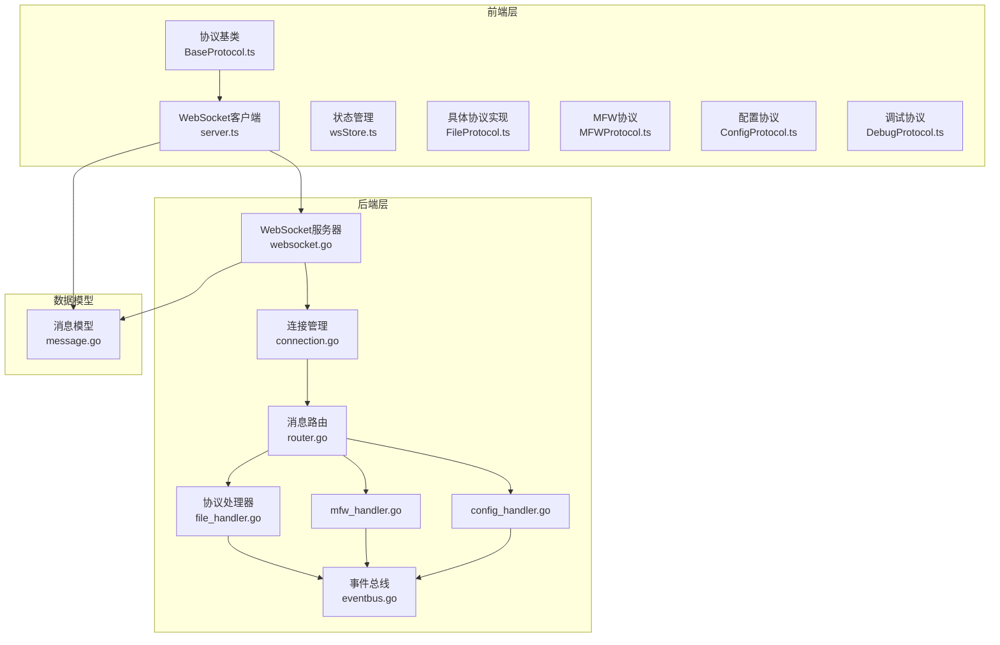

**图表来源**
- [BaseProtocol.ts:1-40](file://src/services/protocols/BaseProtocol.ts#L1-L40)
- [server.ts:1-373](file://src/services/server.ts#L1-L373)
- [websocket.go:1-179](file://LocalBridge/internal/server/websocket.go#L1-L179)

**章节来源**
- [BaseProtocol.ts:1-40](file://src/services/protocols/BaseProtocol.ts#L1-L40)
- [server.ts:1-373](file://src/services/server.ts#L1-L373)
- [websocket.go:1-179](file://LocalBridge/internal/server/websocket.go#L1-L179)

## 核心组件

### BaseProtocol基类设计

BaseProtocol是所有协议模块的抽象基类，定义了协议的基本接口和生命周期管理机制。

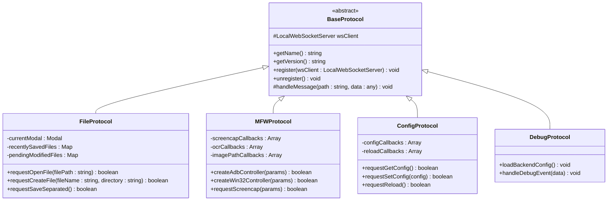

**图表来源**
- [BaseProtocol.ts:7-39](file://src/services/protocols/BaseProtocol.ts#L7-L39)
- [FileProtocol.ts:16-68](file://src/services/protocols/FileProtocol.ts#L16-L68)
- [MFWProtocol.ts:16-97](file://src/services/protocols/MFWProtocol.ts#L16-L97)
- [ConfigProtocol.ts:46-70](file://src/services/protocols/ConfigProtocol.ts#L46-L70)
- [DebugProtocol.ts:16-75](file://src/services/protocols/DebugProtocol.ts#L16-L75)

### WebSocket服务器架构

后端WebSocket服务器采用gorilla/websocket库实现，提供了完整的连接管理、消息路由和事件分发功能。

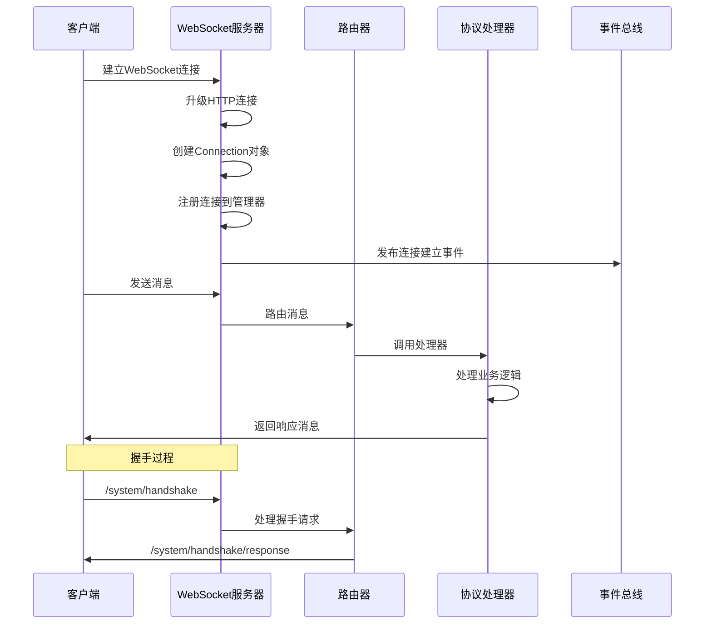

**图表来源**
- [websocket.go:145-161](file://LocalBridge/internal/server/websocket.go#L145-L161)
- [router.go:108-133](file://LocalBridge/internal/router/router.go#L108-L133)
- [connection.go:32-59](file://LocalBridge/internal/server/connection.go#L32-L59)

**章节来源**
- [BaseProtocol.ts:7-39](file://src/services/protocols/BaseProtocol.ts#L7-L39)
- [websocket.go:36-46](file://LocalBridge/internal/server/websocket.go#L36-L46)
- [connection.go:13-29](file://LocalBridge/internal/server/connection.go#L13-L29)

## 架构概览

### 消息传输机制

WebSocket协议采用统一的消息格式，通过path字段标识消息类型，data字段承载具体数据内容。

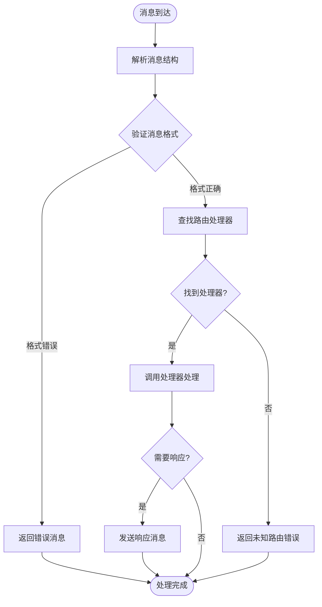

**图表来源**
- [router.go:49-76](file://LocalBridge/internal/router/router.go#L49-L76)
- [message.go:4-7](file://LocalBridge/pkg/models/message.go#L4-L7)

### 连接管理策略

系统实现了完善的连接生命周期管理，包括连接建立、维护和断开的完整流程。

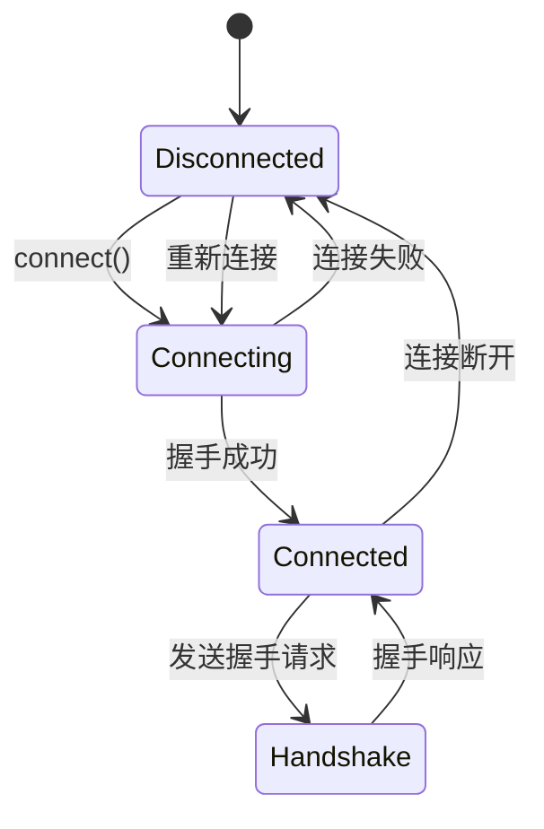

**图表来源**
- [server.ts:105-251](file://src/services/server.ts#L105-L251)
- [websocket.go:115-142](file://LocalBridge/internal/server/websocket.go#L115-L142)

**章节来源**
- [message.go:1-126](file://LocalBridge/pkg/models/message.go#L1-L126)
- [server.ts:20-331](file://src/services/server.ts#L20-L331)

## 详细组件分析

### 协议处理器实现

每个协议处理器都实现了特定领域的业务逻辑，通过统一的接口与WebSocket服务器集成。

#### 文件协议处理器

文件协议负责处理所有文件相关的操作，包括文件读取、保存、创建和监控。

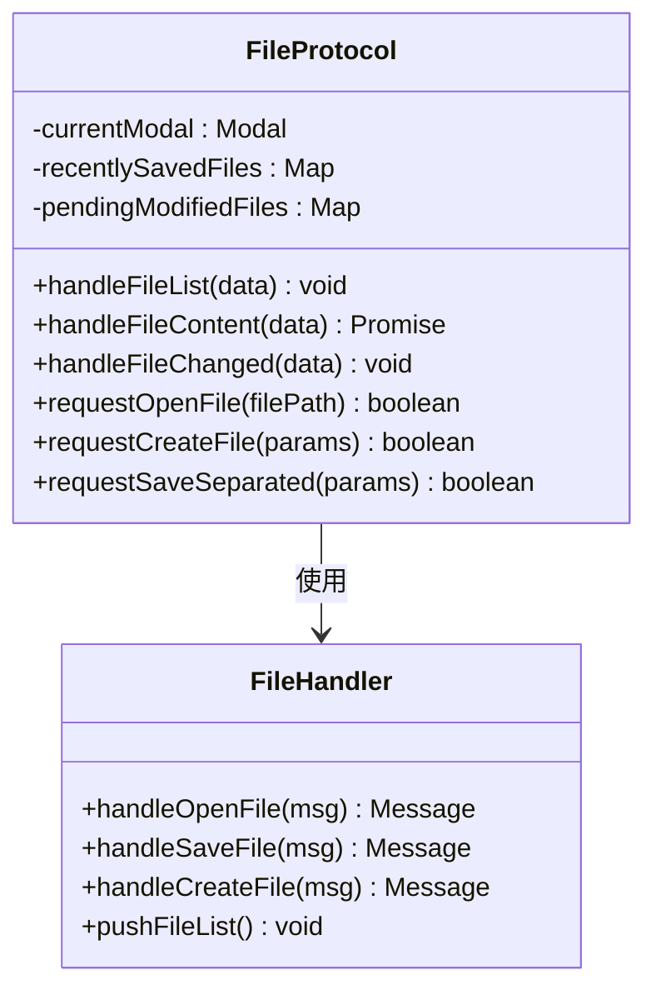

**图表来源**
- [FileProtocol.ts:16-68](file://src/services/protocols/FileProtocol.ts#L16-L68)
- [file_handler.go:15-64](file://LocalBridge/internal/protocol/file/file_handler.go#L15-L64)

文件协议的关键特性包括：

1. **文件变更监控**：通过事件总线监听文件系统变化，实时推送变更通知
2. **保存确认机制**：实现可靠的文件保存确认，支持超时处理
3. **自动重载功能**：支持配置自动重载和手动重载两种模式
4. **多文件处理**：支持批量文件操作和复杂文件结构

#### MFW协议处理器

MFW协议处理MaaFramework相关的设备控制和图像识别功能。

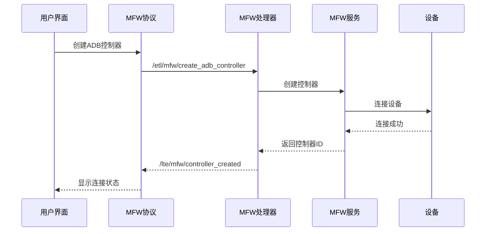

**图表来源**
- [MFWProtocol.ts:302-330](file://src/services/protocols/MFWProtocol.ts#L302-L330)
- [mfw_handler.go:159-203](file://LocalBridge/internal/protocol/mfw/handler.go#L159-L203)

MFW协议的核心功能包括：

1. **多设备支持**：支持ADB设备、Win32窗口、PlayCover和手柄设备
2. **实时控制**：提供点击、滑动、输入等基础操作
3. **高级功能**：支持截图、OCR识别、资源管理等高级功能
4. **状态管理**：完整的控制器生命周期管理

#### 配置协议处理器

配置协议负责管理系统配置的获取、设置和重载功能。

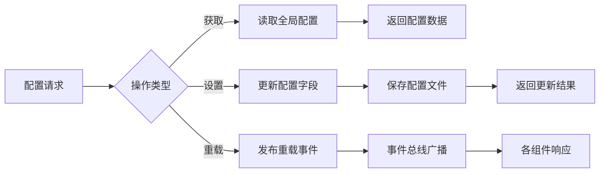

**图表来源**
- [ConfigProtocol.ts:128-161](file://src/services/protocols/ConfigProtocol.ts#L128-L161)
- [config_handler.go:50-68](file://LocalBridge/internal/protocol/config/handler.go#L50-L68)

**章节来源**
- [FileProtocol.ts:16-607](file://src/services/protocols/FileProtocol.ts#L16-L607)
- [MFWProtocol.ts:16-774](file://src/services/protocols/MFWProtocol.ts#L16-L774)
- [ConfigProtocol.ts:46-197](file://src/services/protocols/ConfigProtocol.ts#L46-L197)
- [DebugProtocol.ts:16-800](file://src/services/protocols/DebugProtocol.ts#L16-L800)

### 消息路由机制

系统采用基于前缀匹配的路由机制，支持精确匹配和前缀匹配两种模式。

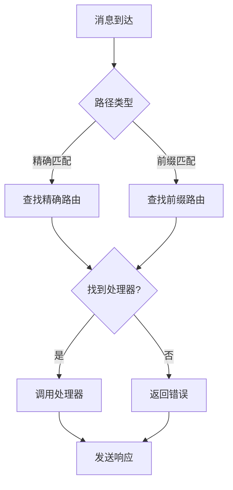

**图表来源**
- [router.go:79-93](file://LocalBridge/internal/router/router.go#L79-L93)
- [router.go:41-47](file://LocalBridge/internal/router/router.go#L41-L47)

**章节来源**
- [router.go:29-76](file://LocalBridge/internal/router/router.go#L29-L76)

## 依赖关系分析

### 组件耦合度分析

系统采用松耦合的设计原则，各个组件之间通过清晰的接口进行交互。

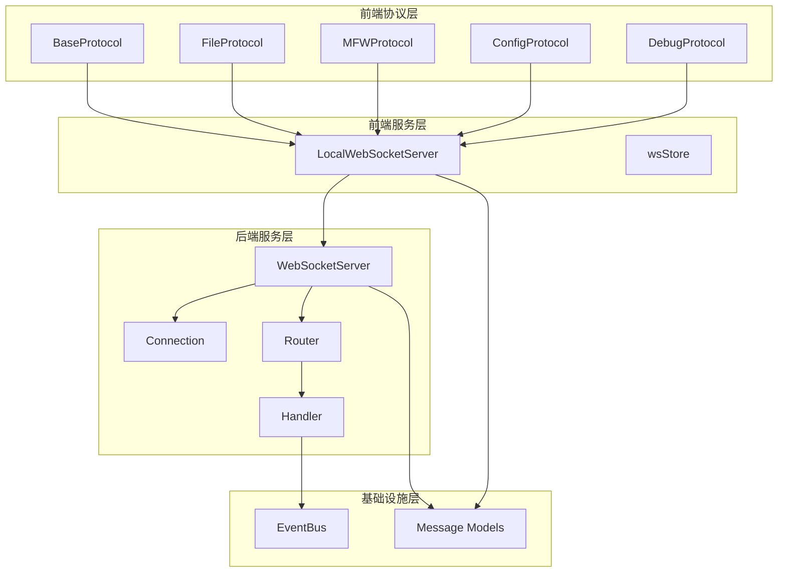

**图表来源**
- [server.ts:20-331](file://src/services/server.ts#L20-L331)
- [websocket.go:36-46](file://LocalBridge/internal/server/websocket.go#L36-L46)
- [router.go:29-38](file://LocalBridge/internal/router/router.go#L29-L38)

### 数据流分析

系统实现了完整的数据流管道，从消息接收到底层处理的全过程。

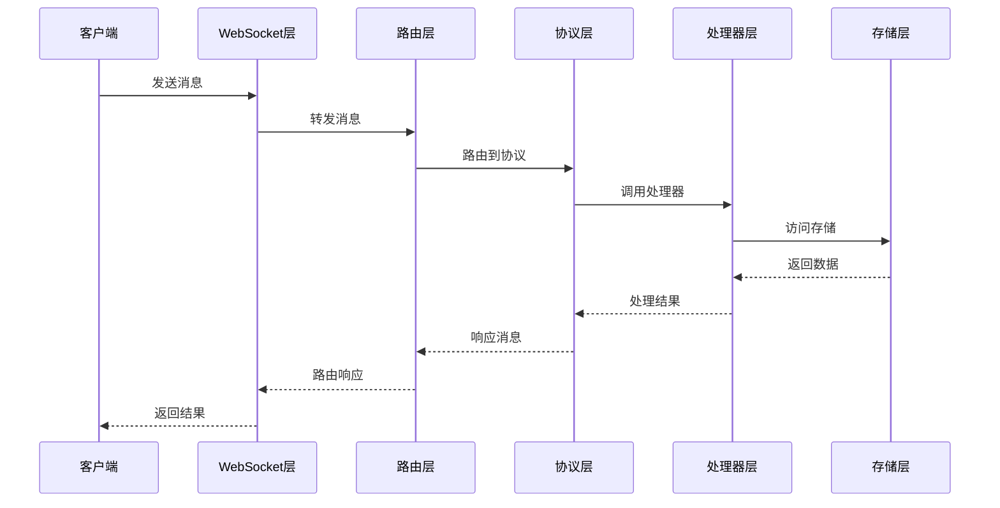

**图表来源**
- [connection.go:32-59](file://LocalBridge/internal/server/connection.go#L32-L59)
- [router.go:49-76](file://LocalBridge/internal/router/router.go#L49-L76)

**章节来源**
- [eventbus.go:17-51](file://LocalBridge/internal/eventbus/eventbus.go#L17-L51)
- [file_handler.go:249-284](file://LocalBridge/internal/protocol/file/file_handler.go#L249-L284)

## 性能考虑

### 连接池管理

系统实现了高效的连接池管理机制，通过以下方式优化性能：

1. **连接复用**：单个WebSocket连接支持多个协议同时使用
2. **消息队列**：每个连接维护独立的消息发送队列，避免阻塞
3. **背压处理**：当发送队列满时，系统会优雅地丢弃消息而非崩溃
4. **连接清理**：及时清理断开的连接，防止内存泄漏

### 并发处理优化

后端采用goroutine实现高并发处理：

1. **读写分离**：每个连接独立的读写goroutine，避免相互影响
2. **异步事件**：事件总线采用异步发布机制，提高响应速度
3. **缓冲区优化**：合理的缓冲区大小平衡内存使用和性能
4. **超时控制**：为长时间操作设置超时，防止资源占用

### 消息处理优化

1. **零拷贝设计**：尽量减少数据复制操作
2. **批量处理**：支持批量文件操作，提高效率
3. **增量更新**：文件变更采用增量更新，减少传输数据量
4. **压缩传输**：对大文件内容进行压缩传输

## 故障排除指南

### 常见连接问题

| 问题类型 | 症状 | 解决方案 |
|---------|------|----------|
| 连接超时 | 连接3秒后失败 | 检查本地服务端口是否正确，确认服务已启动 |
| 握手失败 | 协议版本不匹配 | 确保前端和后端版本一致，重新安装服务 |
| 连接断开 | 偶尔自动断开 | 检查网络稳定性，调整超时设置 |
| 消息丢失 | 部分消息未收到 | 检查发送队列是否溢出，增加队列容量 |

### 错误处理机制

系统实现了多层次的错误处理机制：

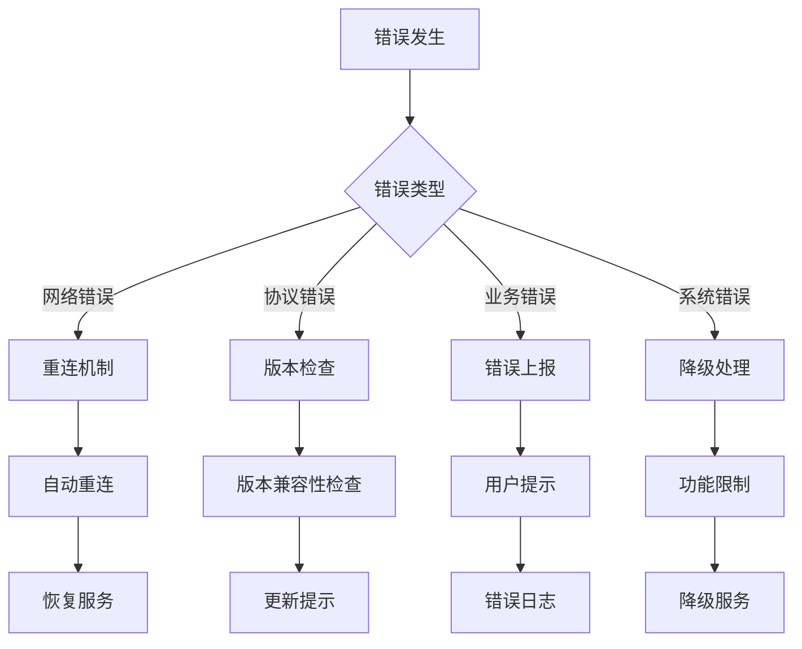

**图表来源**
- [server.ts:182-250](file://src/services/server.ts#L182-L250)
- [router.go:95-105](file://LocalBridge/internal/router/router.go#L95-L105)

### 调试技巧

1. **启用详细日志**：通过配置日志级别查看详细的连接和消息信息
2. **监控连接状态**：使用wsStore监控连接状态变化
3. **消息追踪**：记录关键消息的发送和接收时间
4. **性能分析**：监控消息处理延迟和队列长度

**章节来源**
- [server.ts:182-331](file://src/services/server.ts#L182-L331)
- [router.go:95-151](file://LocalBridge/internal/router/router.go#L95-L151)

## 结论

WebSocket基础协议为MaaPipelineEditor项目提供了稳定、高效的实时通信能力。通过精心设计的架构和完善的错误处理机制，系统能够可靠地处理各种复杂的通信场景。

协议的主要优势包括：

1. **模块化设计**：清晰的协议抽象和实现分离，便于扩展新功能
2. **强健的错误处理**：完善的异常捕获和恢复机制
3. **高性能实现**：优化的并发处理和内存管理
4. **灵活的路由机制**：支持多种消息路由策略
5. **完整的生命周期管理**：从连接建立到断开的全流程管理

未来可以进一步优化的方向包括：

1. **心跳机制**：实现定期的心跳检测，提高连接可靠性
2. **断线重连**：增强自动重连策略，支持指数退避算法
3. **消息持久化**：为重要消息提供持久化保证
4. **性能监控**：增加更详细的性能指标收集和分析
5. **安全增强**：添加消息签名和加密功能

通过持续的优化和完善，WebSocket基础协议将继续为项目的稳定运行提供强有力的支持。