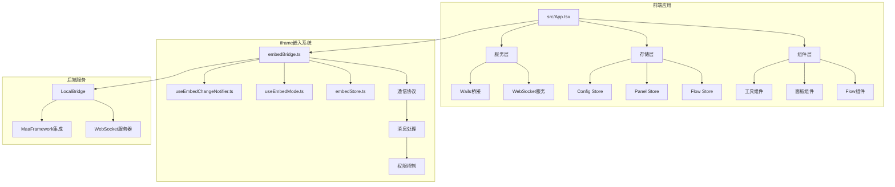
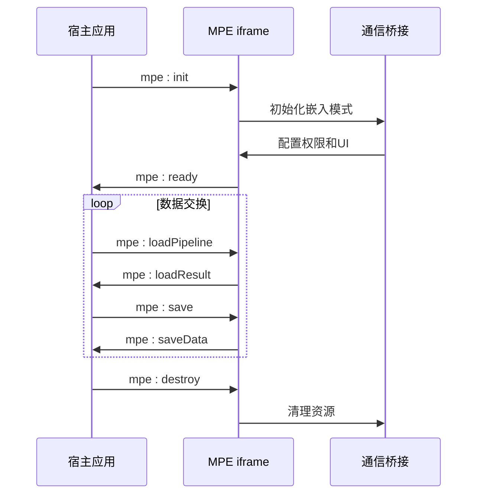
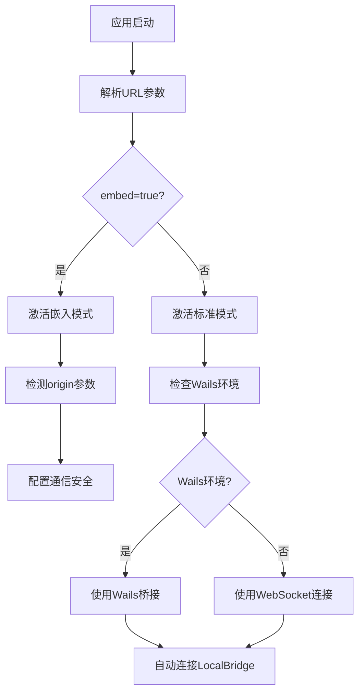
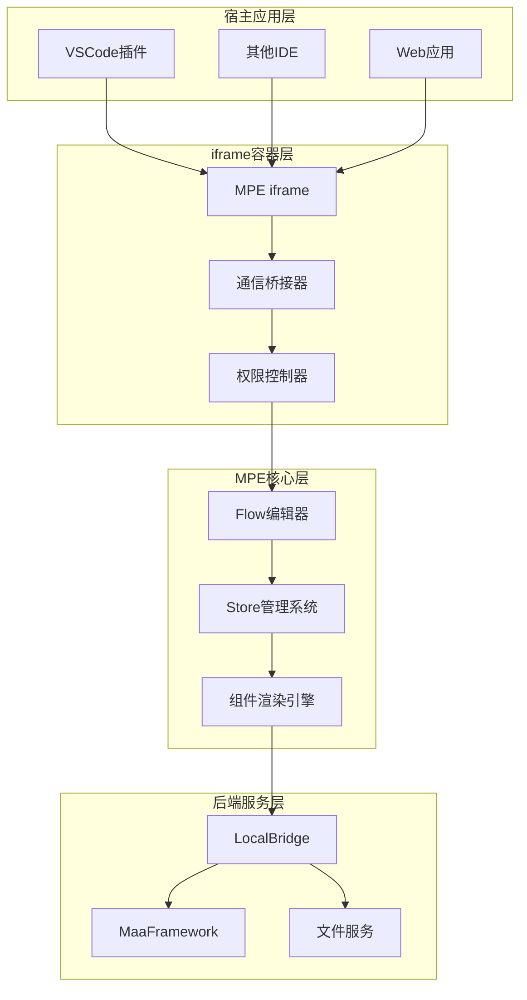
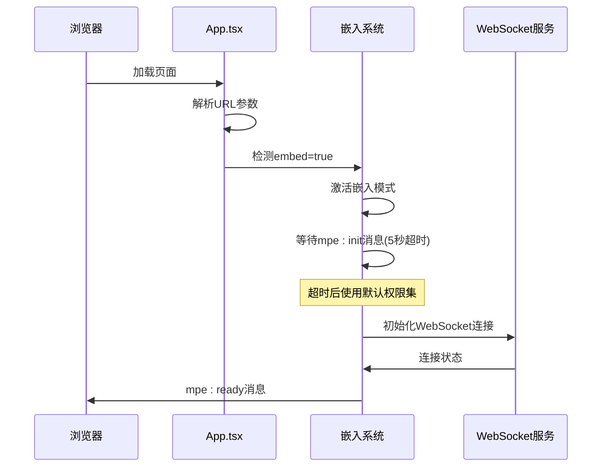
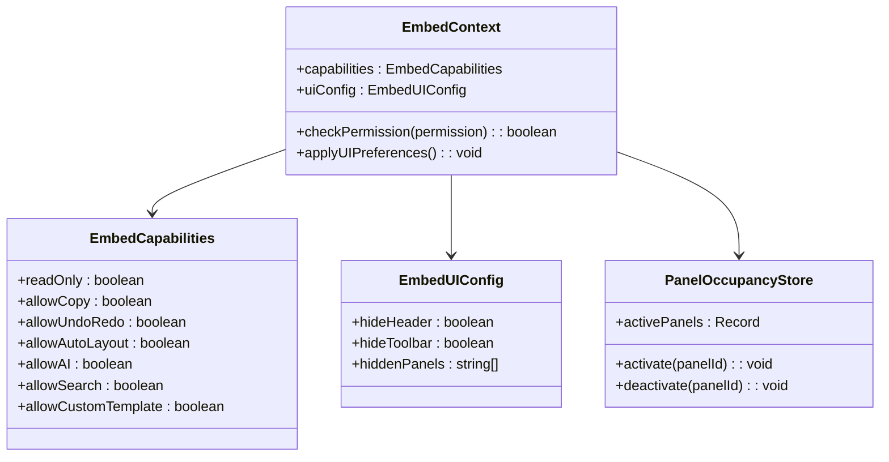
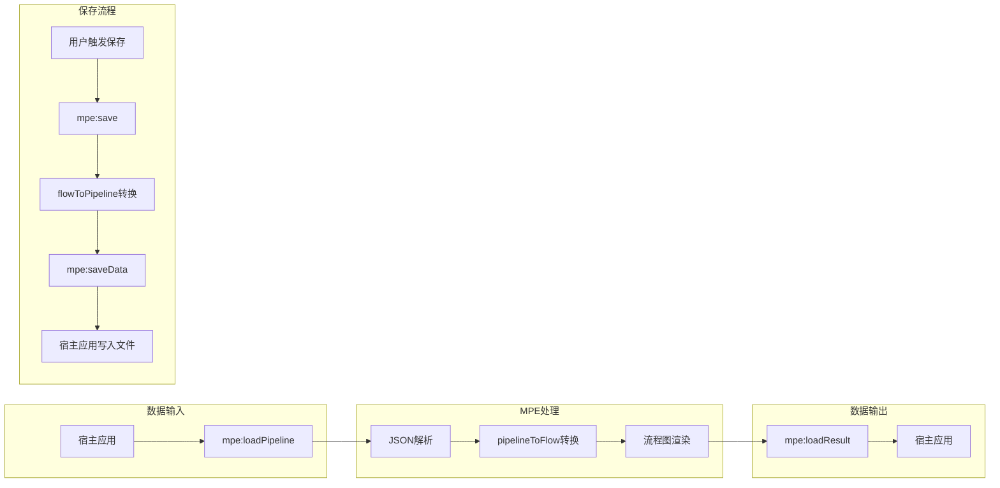
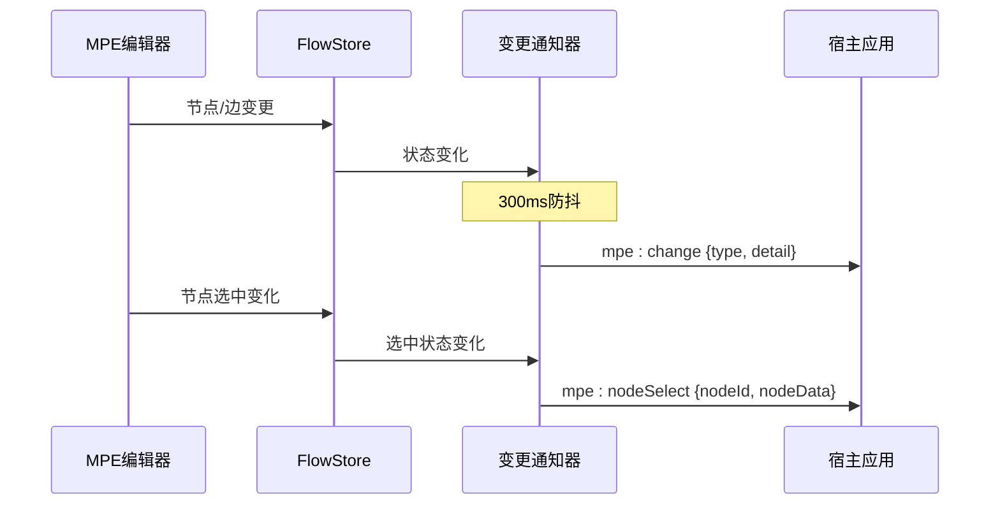
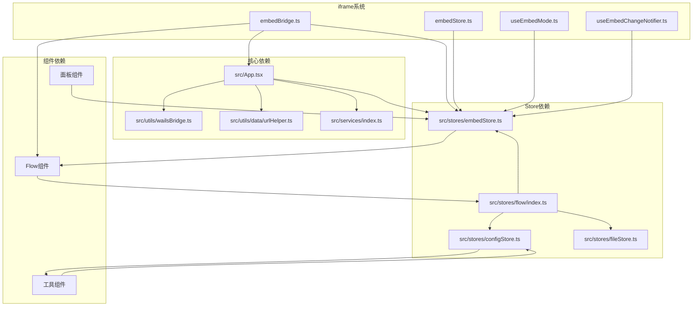

# iframe嵌入系统

<cite>
**本文档引用的文件**
- [src/App.tsx](file://src/App.tsx)
- [src/utils/embedBridge.ts](file://src/utils/embedBridge.ts)
- [src/stores/embedStore.ts](file://src/stores/embedStore.ts)
- [src/hooks/useEmbedMode.ts](file://src/hooks/useEmbedMode.ts)
- [src/hooks/useEmbedChangeNotifier.ts](file://src/hooks/useEmbedChangeNotifier.ts)
- [src/utils/data/urlHelper.ts](file://src/utils/data/urlHelper.ts)
- [src/utils/wailsBridge.ts](file://src/utils/wailsBridge.ts)
- [src/components/panels/main/ToolbarPanel.tsx](file://src/components/panels/main/ToolbarPanel.tsx)
- [docsite/docs/01.指南/100.其他/15.嵌入通信协议.md](file://docsite/docs/01.指南/100.其他/15.嵌入通信协议.md)
- [Iframe/index.html](file://Iframe/index.html)
- [Iframe/test-host.js](file://Iframe/test-host.js)
- [Iframe/test-host.css](file://Iframe/test-host.css)
</cite>

## 更新摘要
**所做更改**
- 新增了完整的嵌入通信协议文档章节，包含详细的协议规范、消息格式和握手流程
- 更新了权限控制系统和UI配置的实现细节
- 增加了变更通知机制和状态查询功能的详细说明
- 完善了测试环境和集成示例的文档
- 更新了架构图和组件关系图以反映新的协议实现

## 目录
1. [简介](#简介)
2. [项目结构](#项目结构)
3. [核心组件](#核心组件)
4. [架构概览](#架构概览)
5. [详细组件分析](#详细组件分析)
6. [依赖关系分析](#依赖关系分析)
7. [性能考虑](#性能考虑)
8. [故障排除指南](#故障排除指南)
9. [结论](#结论)

## 简介

MaaPipelineEditor（MPE）是一个基于React和TypeScript的可视化MaaFramework Pipeline工作流编辑器。该项目的核心创新之一是其iframe嵌入系统，允许在第三方应用（特别是VSCode插件）中无缝集成MPE编辑器。

iframe嵌入系统通过纯postMessage通信协议实现，无需依赖LocalBridge服务，为宿主应用提供了灵活的集成方案。该系统支持完整的Pipeline编辑功能，同时保持与MPE核心功能的一致性。

**更新** 新增了完整的嵌入通信协议文档，详细描述了消息格式、握手流程、能力声明和UI控制等规范

## 项目结构

MPE项目采用现代化的前端架构，主要包含以下关键模块：

**图表来源**
- [src/App.tsx:129-561](file://src/App.tsx#L129-L561)
- [src/utils/embedBridge.ts:1-282](file://src/utils/embedBridge.ts#L1-L282)
- [src/stores/embedStore.ts:1-60](file://src/stores/embedStore.ts#L1-L60)

**章节来源**
- [src/App.tsx:129-561](file://src/App.tsx#L129-L561)
- [src/utils/embedBridge.ts:1-282](file://src/utils/embedBridge.ts#L1-L282)

## 核心组件

### iframe嵌入协议

iframe嵌入系统的核心是基于postMessage的轻量级通信协议，该协议具有以下特点：

#### 协议规范
- **协议标识**: `mpe-embed` - 防止消息串扰
- **版本管理**: 支持语义化版本控制
- **双向通信**: 宿主与MPE之间双向消息传递
- **请求-响应模式**: 支持带requestId的异步通信

#### 消息类型
系统定义了完整的消息类型体系，包括握手、数据传输、状态查询等：

**图表来源**
- [docsite/docs/01.指南/100.其他/15.嵌入通信协议.md:63-77](file://docsite/docs/01.指南/100.其他/15.嵌入通信协议.md#L63-L77)

#### 权限控制系统
嵌入模式实现了细粒度的权限控制机制：

| 权限类别 | 权限项 | 默认值 | 功能影响 |
|---------|--------|--------|----------|
| 编辑权限 | readOnly | false | 禁止编辑流程图 |
| 操作权限 | allowCopy | true | 允许复制节点/边 |
| 历史记录 | allowUndoRedo | true | 允许撤销/重做 |
| 自动化 | allowAutoLayout | true | 允许自动布局 |
| AI功能 | allowAI | false | 允许AI辅助功能 |
| 搜索功能 | allowSearch | true | 允许搜索节点 |
| 模板功能 | allowCustomTemplate | true | 允许自定义模板 |

**章节来源**
- [docsite/docs/01.指南/100.其他/15.嵌入通信协议.md:219-261](file://docsite/docs/01.指南/100.其他/15.嵌入通信协议.md#L219-L261)

### URL参数处理系统

MPE实现了统一的URL参数处理机制，支持多种运行模式的配置：

**图表来源**
- [src/App.tsx:180-501](file://src/App.tsx#L180-L501)
- [src/utils/data/urlHelper.ts:40-48](file://src/utils/data/urlHelper.ts#L40-L48)

**章节来源**
- [src/App.tsx:180-501](file://src/App.tsx#L180-L501)
- [src/utils/data/urlHelper.ts:40-109](file://src/utils/data/urlHelper.ts#L40-L109)

## 架构概览

MPE的iframe嵌入系统采用了模块化的架构设计，确保了系统的可扩展性和维护性：

**图表来源**
- [docsite/docs/01.指南/100.其他/15.嵌入通信协议.md:12-24](file://docsite/docs/01.指南/100.其他/15.嵌入通信协议.md#L12-L24)
- [src/App.tsx:129-561](file://src/App.tsx#L129-L561)

### 通信安全机制

系统实现了多层次的安全防护机制：

1. **origin验证**: 通过URL参数的origin字段验证消息来源
2. **协议标识**: 所有消息必须包含`mpe-embed`协议标识
3. **版本协商**: 支持协议版本的自动协商和降级
4. **权限控制**: 基于capabilities的细粒度权限管理

**章节来源**
- [docsite/docs/01.指南/100.其他/15.嵌入通信协议.md:334-351](file://docsite/docs/01.指南/100.其他/15.嵌入通信协议.md#L334-L351)

## 详细组件分析

### 嵌入模式初始化流程

嵌入模式的初始化过程是一个精心设计的握手协议：

**图表来源**
- [src/App.tsx:180-348](file://src/App.tsx#L180-L348)
- [docsite/docs/01.指南/100.其他/15.嵌入通信协议.md:63-86](file://docsite/docs/01.指南/100.其他/15.嵌入通信协议.md#L63-L86)

#### 权限控制实现

权限控制系统通过嵌套的条件渲染和状态管理实现：

**图表来源**
- [docsite/docs/01.指南/100.其他/15.嵌入通信协议.md:219-303](file://docsite/docs/01.指南/100.其他/15.嵌入通信协议.md#L219-L303)
- [src/stores/embedStore.ts:31-59](file://src/stores/embedStore.ts#L31-L59)

**章节来源**
- [docsite/docs/01.指南/100.其他/15.嵌入通信协议.md:219-303](file://docsite/docs/01.指南/100.其他/15.嵌入通信协议.md#L219-L303)
- [src/stores/embedStore.ts:1-60](file://src/stores/embedStore.ts#L1-L60)

### 数据流处理机制

嵌入模式的数据流处理实现了完整的Pipeline生命周期管理：

**图表来源**
- [docsite/docs/01.指南/100.其他/15.嵌入通信协议.md:88-141](file://docsite/docs/01.指南/100.其他/15.嵌入通信协议.md#L88-L141)

#### 快捷键系统

全局快捷键系统在嵌入模式下进行了特殊处理：

| 快捷键 | 功能 | 嵌入模式行为 |
|--------|------|-------------|
| Ctrl+Z | 撤销 | 仅在非嵌入模式下可用 |
| Ctrl+Y | 重做 | 仅在非嵌入模式下可用 |
| Delete | 删除 | 在嵌入模式下重定向为Backspace |
| Ctrl+S | 保存 | 触发mpe:saveRequest消息 |

**章节来源**
- [src/App.tsx:171-174](file://src/App.tsx#L171-L174)
- [docsite/docs/01.指南/100.其他/15.嵌入通信协议.md:206-218](file://docsite/docs/01.指南/100.其他/15.嵌入通信协议.md#L206-L218)

### 变更通知机制

MPE实现了智能的变更通知系统，能够实时向宿主应用报告流程图的任何变化：

**图表来源**
- [src/hooks/useEmbedChangeNotifier.ts:18-135](file://src/hooks/useEmbedChangeNotifier.ts#L18-L135)

**章节来源**
- [src/hooks/useEmbedChangeNotifier.ts:1-136](file://src/hooks/useEmbedChangeNotifier.ts#L1-L136)

## 依赖关系分析

MPE的iframe嵌入系统展现了良好的模块化设计，各组件之间的依赖关系清晰明确：

**图表来源**
- [src/App.tsx:15-60](file://src/App.tsx#L15-L60)
- [src/stores/flow/index.ts:1-28](file://src/stores/flow/index.ts#L1-L28)

### 第三方依赖

系统使用了现代化的前端技术栈：

- **React 19**: 现代化的React版本，提供更好的性能和开发体验
- **TypeScript 5.8**: 强类型支持，提高代码质量和开发效率
- **Ant Design**: 企业级UI组件库，提供丰富的交互组件
- **React Flow**: 专业的流程图绘制库
- **Zustand**: 轻量级状态管理库

**章节来源**
- [src/App.tsx:1-564](file://src/App.tsx#L1-L564)

## 性能考虑

iframe嵌入系统在设计时充分考虑了性能优化：

### 内存管理
- **懒加载策略**: 非必要的组件按需加载
- **资源清理**: 嵌入模式销毁时清理所有事件监听器
- **内存泄漏防护**: 使用React的生命周期管理组件

### 网络优化
- **消息压缩**: 大数据量传输时进行压缩处理
- **批量处理**: 高频变更事件进行防抖处理
- **连接池**: WebSocket连接的复用和管理

### 用户体验
- **渐进式加载**: 重要功能优先加载
- **错误边界**: 提供友好的错误提示
- **离线支持**: 基础功能的离线可用性

## 故障排除指南

### 常见问题及解决方案

#### 通信协议问题
**问题**: iframe无法与宿主建立通信
**解决方案**:
1. 检查URL参数中embed=true是否正确设置
2. 验证origin参数配置是否匹配
3. 确认postMessage消息格式正确

#### 权限控制问题
**问题**: 功能按钮不可用或出现权限错误
**解决方案**:
1. 检查capabilities配置是否正确
2. 验证权限声明是否符合预期
3. 确认嵌入模式下的权限继承

#### 性能问题
**问题**: 页面响应缓慢或内存占用过高
**解决方案**:
1. 检查是否有过多的事件监听器
2. 验证组件的重新渲染频率
3. 优化大数据量的处理逻辑

**章节来源**
- [docsite/docs/01.指南/100.其他/15.嵌入通信协议.md:334-351](file://docsite/docs/01.指南/100.其他/15.嵌入通信协议.md#L334-L351)

## 结论

MaaPipelineEditor的iframe嵌入系统代表了现代Web应用集成的最佳实践。通过精心设计的通信协议、完善的权限控制系统和优雅的架构设计，该系统成功地将复杂的Pipeline编辑功能封装为可嵌入的组件。

### 主要优势

1. **完全解耦**: 通过postMessage实现真正的前后端分离
2. **灵活集成**: 支持多种宿主环境和集成场景
3. **安全可靠**: 多层次的安全防护机制
4. **性能优秀**: 优化的内存管理和网络通信
5. **易于维护**: 清晰的模块化架构和完善的文档

### 技术创新

- **协议标准化**: 定义了完整的通信协议规范
- **权限抽象化**: 通过capabilities实现灵活的权限控制
- **生命周期管理**: 完善的资源管理和清理机制
- **错误处理**: 友好的错误提示和恢复机制

该iframe嵌入系统不仅满足了VSCode插件集成的需求，更为其他应用的深度集成提供了可靠的基础设施，展现了MPE项目在技术创新方面的卓越能力。

**新增** 完整的嵌入通信协议文档为开发者提供了详细的集成指南，包括消息格式、握手流程、能力声明和UI控制等规范，大大降低了集成难度并提高了系统的可维护性。