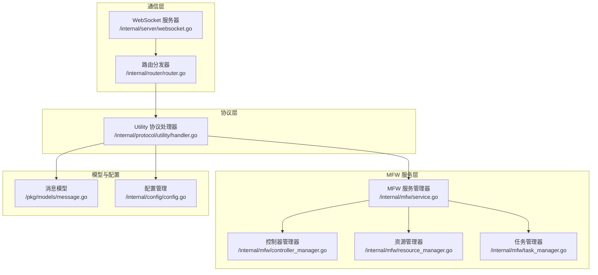
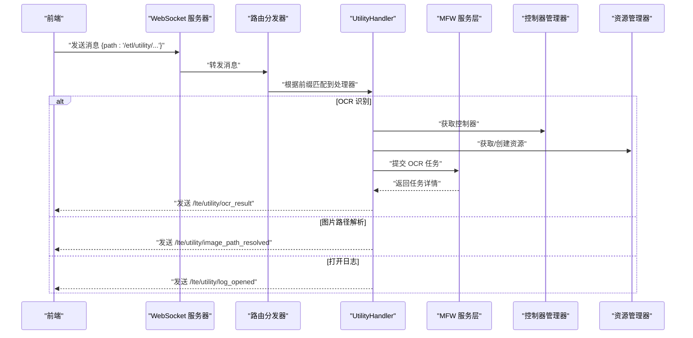
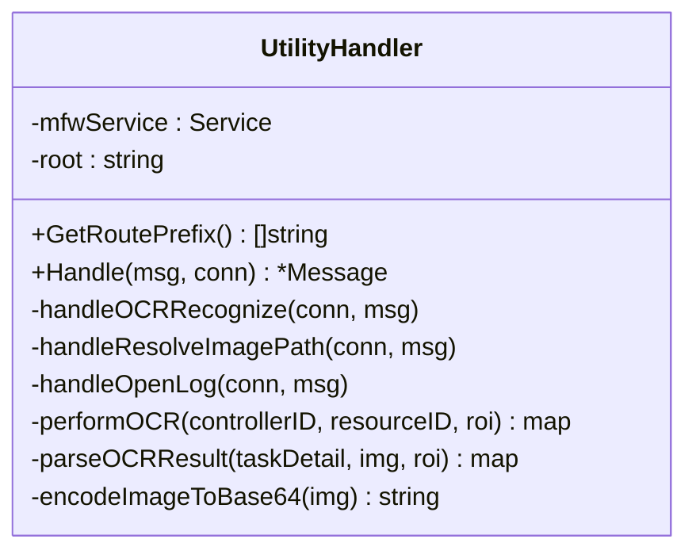
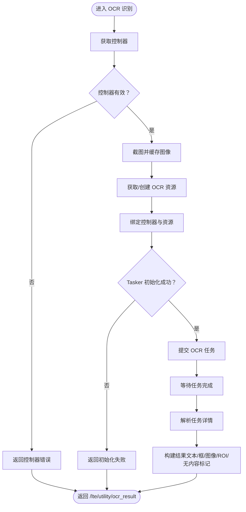
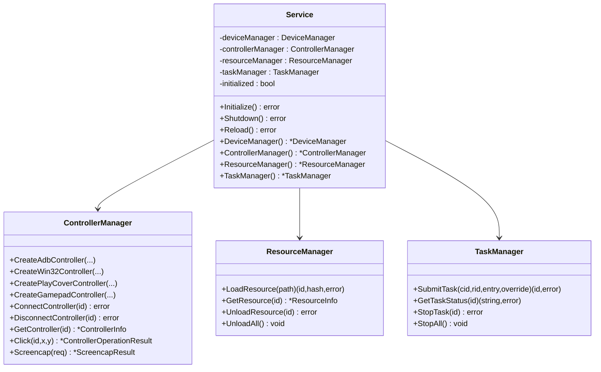
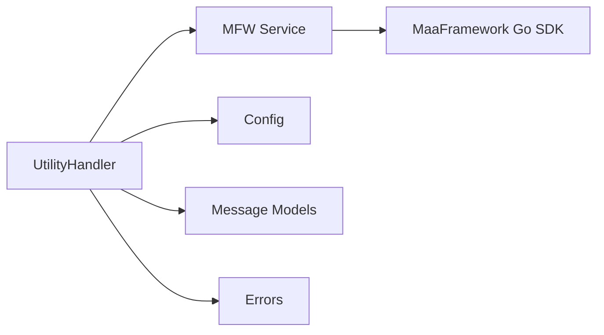

# 工具协议

<cite>
**本文引用的文件**
- [LocalBridge/internal/protocol/utility/handler.go](file://LocalBridge/internal/protocol/utility/handler.go)
- [LocalBridge/internal/mfw/service.go](file://LocalBridge/internal/mfw/service.go)
- [LocalBridge/internal/mfw/controller_manager.go](file://LocalBridge/internal/mfw/controller_manager.go)
- [LocalBridge/internal/mfw/resource_manager.go](file://LocalBridge/internal/mfw/resource_manager.go)
- [LocalBridge/internal/mfw/task_manager.go](file://LocalBridge/internal/mfw/task_manager.go)
- [LocalBridge/internal/mfw/types.go](file://LocalBridge/internal/mfw/types.go)
- [LocalBridge/internal/mfw/error.go](file://LocalBridge/internal/mfw/error.go)
- [LocalBridge/pkg/models/message.go](file://LocalBridge/pkg/models/message.go)
- [LocalBridge/internal/router/router.go](file://LocalBridge/internal/router/router.go)
- [LocalBridge/internal/server/websocket.go](file://LocalBridge/internal/server/websocket.go)
- [LocalBridge/internal/config/config.go](file://LocalBridge/internal/config/config.go)
- [LocalBridge/internal/errors/errors.go](file://LocalBridge/internal/errors/errors.go)
</cite>

## 目录
1. [简介](#简介)
2. [项目结构](#项目结构)
3. [核心组件](#核心组件)
4. [架构总览](#架构总览)
5. [详细组件分析](#详细组件分析)
6. [依赖分析](#依赖分析)
7. [性能考虑](#性能考虑)
8. [故障排查指南](#故障排查指南)
9. [结论](#结论)
10. [附录](#附录)

## 简介
本文件面向“工具协议”（UtilityProtocol），系统性阐述 LocalBridge 中与系统工具、实用工具及辅助服务相关的协议实现与工作机制。重点覆盖以下方面：
- Utility 协议提供的辅助能力与实现机制
- 工具命令的执行流程与结果处理
- 工具调用的安全控制与权限管理策略
- 工具接口的扩展机制与自定义工具的添加方法
- 工具执行的异步处理与进度反馈机制
- 工具性能监控、资源消耗统计与执行效率优化

## 项目结构
Utility 协议位于 LocalBridge 子模块中，通过 WebSocket 与前端交互，路由前缀为 “/etl/utility/”。其核心处理逻辑集中在 UtilityHandler，配合 MaaFramework 服务层（MFW）完成控制器、资源与任务的生命周期管理。

**图表来源**
- [LocalBridge/internal/server/websocket.go:1-179](file://LocalBridge/internal/server/websocket.go#L1-L179)
- [LocalBridge/internal/router/router.go:1-151](file://LocalBridge/internal/router/router.go#L1-L151)
- [LocalBridge/internal/protocol/utility/handler.go:1-694](file://LocalBridge/internal/protocol/utility/handler.go#L1-L694)
- [LocalBridge/internal/mfw/service.go:1-218](file://LocalBridge/internal/mfw/service.go#L1-L218)
- [LocalBridge/internal/mfw/controller_manager.go:1-800](file://LocalBridge/internal/mfw/controller_manager.go#L1-L800)
- [LocalBridge/internal/mfw/resource_manager.go:1-158](file://LocalBridge/internal/mfw/resource_manager.go#L1-L158)
- [LocalBridge/internal/mfw/task_manager.go:1-114](file://LocalBridge/internal/mfw/task_manager.go#L1-L114)
- [LocalBridge/pkg/models/message.go:1-126](file://LocalBridge/pkg/models/message.go#L1-L126)
- [LocalBridge/internal/config/config.go:1-339](file://LocalBridge/internal/config/config.go#L1-L339)

**章节来源**
- [LocalBridge/internal/server/websocket.go:1-179](file://LocalBridge/internal/server/websocket.go#L1-L179)
- [LocalBridge/internal/router/router.go:1-151](file://LocalBridge/internal/router/router.go#L1-L151)
- [LocalBridge/internal/protocol/utility/handler.go:1-694](file://LocalBridge/internal/protocol/utility/handler.go#L1-L694)
- [LocalBridge/internal/mfw/service.go:1-218](file://LocalBridge/internal/mfw/service.go#L1-L218)
- [LocalBridge/internal/mfw/controller_manager.go:1-800](file://LocalBridge/internal/mfw/controller_manager.go#L1-L800)
- [LocalBridge/internal/mfw/resource_manager.go:1-158](file://LocalBridge/internal/mfw/resource_manager.go#L1-L158)
- [LocalBridge/internal/mfw/task_manager.go:1-114](file://LocalBridge/internal/mfw/task_manager.go#L1-L114)
- [LocalBridge/pkg/models/message.go:1-126](file://LocalBridge/pkg/models/message.go#L1-L126)
- [LocalBridge/internal/config/config.go:1-339](file://LocalBridge/internal/config/config.go#L1-L339)

## 核心组件
- UtilityHandler：负责处理 /etl/utility/ 前缀下的工具类请求，包括 OCR 识别、图片路径解析、日志目录打开等。
- MFW 服务层：封装 MaaFramework 的控制器、资源与任务管理，提供统一初始化、重载与释放。
- 路由与通信：Router 将消息分发至对应处理器；WebSocketServer 提供连接管理与消息广播。
- 模型与配置：Message 定义通用消息结构；Config 提供全局配置读取与校验。

**章节来源**
- [LocalBridge/internal/protocol/utility/handler.go:24-65](file://LocalBridge/internal/protocol/utility/handler.go#L24-L65)
- [LocalBridge/internal/mfw/service.go:15-218](file://LocalBridge/internal/mfw/service.go#L15-L218)
- [LocalBridge/internal/router/router.go:19-76](file://LocalBridge/internal/router/router.go#L19-L76)
- [LocalBridge/internal/server/websocket.go:35-93](file://LocalBridge/internal/server/websocket.go#L35-L93)
- [LocalBridge/pkg/models/message.go:3-7](file://LocalBridge/pkg/models/message.go#L3-L7)
- [LocalBridge/internal/config/config.go:42-48](file://LocalBridge/internal/config/config.go#L42-L48)

## 架构总览
Utility 协议的调用链路如下：前端通过 WebSocket 发送 /etl/utility/* 路由消息，Router 根据前缀匹配到 UtilityHandler，后者根据具体路径分派到相应工具处理函数，并通过 MFW 服务层与底层 MaaFramework 交互，最终将结果以 /lte/utility/* 路由返回前端。

**图表来源**
- [LocalBridge/internal/server/websocket.go:144-161](file://LocalBridge/internal/server/websocket.go#L144-L161)
- [LocalBridge/internal/router/router.go:49-76](file://LocalBridge/internal/router/router.go#L49-L76)
- [LocalBridge/internal/protocol/utility/handler.go:44-65](file://LocalBridge/internal/protocol/utility/handler.go#L44-L65)
- [LocalBridge/internal/mfw/controller_manager.go:249-300](file://LocalBridge/internal/mfw/controller_manager.go#L249-L300)
- [LocalBridge/internal/mfw/resource_manager.go:26-105](file://LocalBridge/internal/mfw/resource_manager.go#L26-L105)

## 详细组件分析

### UtilityHandler：工具协议处理器
- 路由前缀：/etl/utility/
- 支持的工具路径：
  - /etl/utility/ocr_recognize：OCR 识别
  - /etl/utility/resolve_image_path：解析图片路径
  - /etl/utility/open_log：打开日志目录
- 错误处理：统一通过 sendError/sendUtilityError 发送 /error 或特定结果路由，便于前端一致处理。

**图表来源**
- [LocalBridge/internal/protocol/utility/handler.go:24-65](file://LocalBridge/internal/protocol/utility/handler.go#L24-L65)
- [LocalBridge/internal/protocol/utility/handler.go:67-119](file://LocalBridge/internal/protocol/utility/handler.go#L67-L119)
- [LocalBridge/internal/protocol/utility/handler.go:452-514](file://LocalBridge/internal/protocol/utility/handler.go#L452-L514)
- [LocalBridge/internal/protocol/utility/handler.go:597-693](file://LocalBridge/internal/protocol/utility/handler.go#L597-L693)

**章节来源**
- [LocalBridge/internal/protocol/utility/handler.go:24-65](file://LocalBridge/internal/protocol/utility/handler.go#L24-L65)
- [LocalBridge/internal/protocol/utility/handler.go:44-65](file://LocalBridge/internal/protocol/utility/handler.go#L44-L65)

### OCR 识别流程
- 输入参数：controller_id、resource_id、roi（[x, y, w, h]）、可选 resource_dir 配置
- 执行步骤：
  1) 获取控制器并截图
  2) 获取或创建资源（OCR 模型）
  3) 绑定控制器与资源，创建临时 Tasker
  4) 提交 OCR 任务并等待完成
  5) 解析任务详情，构造结果（文本、框、图像 Base64、ROI、是否无内容）
- 异常处理：捕获 MFW 错误码并映射为前端可读错误

**图表来源**
- [LocalBridge/internal/protocol/utility/handler.go:121-287](file://LocalBridge/internal/protocol/utility/handler.go#L121-L287)
- [LocalBridge/internal/mfw/controller_manager.go:516-585](file://LocalBridge/internal/mfw/controller_manager.go#L516-L585)
- [LocalBridge/internal/mfw/resource_manager.go:26-105](file://LocalBridge/internal/mfw/resource_manager.go#L26-L105)

**章节来源**
- [LocalBridge/internal/protocol/utility/handler.go:67-119](file://LocalBridge/internal/protocol/utility/handler.go#L67-L119)
- [LocalBridge/internal/protocol/utility/handler.go:121-287](file://LocalBridge/internal/protocol/utility/handler.go#L121-L287)
- [LocalBridge/internal/mfw/controller_manager.go:516-585](file://LocalBridge/internal/mfw/controller_manager.go#L516-L585)
- [LocalBridge/internal/mfw/resource_manager.go:26-105](file://LocalBridge/internal/mfw/resource_manager.go#L26-L105)

### 图片路径解析
- 功能：在根目录下递归查找名为 “image” 的目录，匹配目标文件名，返回最新修改时间的文件路径（相对与绝对），并统一路径分隔符为正斜杠。
- 输出：/lte/utility/image_path_resolved，包含 success、relative_path、absolute_path、message。

**章节来源**
- [LocalBridge/internal/protocol/utility/handler.go:452-514](file://LocalBridge/internal/protocol/utility/handler.go#L452-L514)
- [LocalBridge/internal/protocol/utility/handler.go:523-595](file://LocalBridge/internal/protocol/utility/handler.go#L523-L595)

### 打开日志目录
- 功能：根据平台选择合适的打开命令（Windows: explorer /select, macOS: open -R, Linux: xdg-open），并尝试选中 maa.log 文件。
- 输出：/lte/utility/log_opened，包含 success、message、path。

**章节来源**
- [LocalBridge/internal/protocol/utility/handler.go:597-693](file://LocalBridge/internal/protocol/utility/handler.go#L597-L693)

### MFW 服务层与资源管理
- Service：统一初始化/重载/关闭 MaaFramework，处理 Windows 下中文路径问题（短路径转换或工作目录切换），并管理设备、控制器、资源、任务。
- ControllerManager：创建/连接/断开控制器，执行点击、滑动、输入文本、启动/停止应用、截图等操作。
- ResourceManager：加载/卸载资源，处理路径与工作目录切换。
- TaskManager：提交/停止任务，维护任务状态。

**图表来源**
- [LocalBridge/internal/mfw/service.go:15-218](file://LocalBridge/internal/mfw/service.go#L15-L218)
- [LocalBridge/internal/mfw/controller_manager.go:20-800](file://LocalBridge/internal/mfw/controller_manager.go#L20-L800)
- [LocalBridge/internal/mfw/resource_manager.go:13-158](file://LocalBridge/internal/mfw/resource_manager.go#L13-L158)
- [LocalBridge/internal/mfw/task_manager.go:11-114](file://LocalBridge/internal/mfw/task_manager.go#L11-L114)

**章节来源**
- [LocalBridge/internal/mfw/service.go:36-138](file://LocalBridge/internal/mfw/service.go#L36-L138)
- [LocalBridge/internal/mfw/controller_manager.go:249-300](file://LocalBridge/internal/mfw/controller_manager.go#L249-L300)
- [LocalBridge/internal/mfw/resource_manager.go:26-105](file://LocalBridge/internal/mfw/resource_manager.go#L26-L105)
- [LocalBridge/internal/mfw/task_manager.go:24-53](file://LocalBridge/internal/mfw/task_manager.go#L24-L53)

### 路由与通信
- Router：支持精确匹配与前缀匹配，统一错误返回 /error。
- WebSocketServer：升级 HTTP 连接为 WebSocket，管理连接注册/注销与消息广播。

**章节来源**
- [LocalBridge/internal/router/router.go:19-151](file://LocalBridge/internal/router/router.go#L19-L151)
- [LocalBridge/internal/server/websocket.go:35-179](file://LocalBridge/internal/server/websocket.go#L35-L179)

## 依赖分析
- UtilityHandler 依赖：
  - MFW 服务层（控制器/资源/任务）
  - 配置模块（读取 OCR 资源路径、日志目录）
  - 消息模型（统一消息结构）
  - 错误模块（LBError、MFWError）
- MFW 服务层内部依赖 MaaFramework Go SDK，负责控制器、资源与任务的生命周期管理。
- 路由与通信层解耦协议处理逻辑，便于扩展新工具。

**图表来源**
- [LocalBridge/internal/protocol/utility/handler.go:3-22](file://LocalBridge/internal/protocol/utility/handler.go#L3-L22)
- [LocalBridge/internal/mfw/service.go:3-13](file://LocalBridge/internal/mfw/service.go#L3-L13)
- [LocalBridge/internal/config/config.go:1-11](file://LocalBridge/internal/config/config.go#L1-L11)
- [LocalBridge/pkg/models/message.go:1-7](file://LocalBridge/pkg/models/message.go#L1-L7)
- [LocalBridge/internal/errors/errors.go:1-28](file://LocalBridge/internal/errors/errors.go#L1-L28)
- [LocalBridge/internal/mfw/error.go:33-53](file://LocalBridge/internal/mfw/error.go#L33-L53)

**章节来源**
- [LocalBridge/internal/protocol/utility/handler.go:3-22](file://LocalBridge/internal/protocol/utility/handler.go#L3-L22)
- [LocalBridge/internal/mfw/service.go:3-13](file://LocalBridge/internal/mfw/service.go#L3-L13)
- [LocalBridge/internal/config/config.go:1-11](file://LocalBridge/internal/config/config.go#L1-L11)
- [LocalBridge/pkg/models/message.go:1-7](file://LocalBridge/pkg/models/message.go#L1-L7)
- [LocalBridge/internal/errors/errors.go:1-28](file://LocalBridge/internal/errors/errors.go#L1-L28)
- [LocalBridge/internal/mfw/error.go:33-53](file://LocalBridge/internal/mfw/error.go#L33-L53)

## 性能考虑
- 截图与图像处理：
  - 截图采用缓存图像，避免重复 IO；编码为 PNG 并 Base64，注意内存占用。
  - Windows 下对 OCR 资源路径进行短路径转换或工作目录切换，减少非 ASCII 路径带来的兼容性问题与潜在性能损耗。
- 任务执行：
  - Tasker 初始化失败时尽早返回，避免无效计算。
  - 任务提交与等待采用 Job 等待模式，避免阻塞主线程。
- 资源管理：
  - 资源加载后记录 Hash，便于后续校验与去重。
  - 提供卸载与清空机制，防止资源泄漏。
- 路由与通信：
  - Router 支持前缀匹配，便于扩展新工具而无需修改既有路由。
  - WebSocket 服务器设置读写超时，避免连接挂起。

**章节来源**
- [LocalBridge/internal/mfw/controller_manager.go:516-585](file://LocalBridge/internal/mfw/controller_manager.go#L516-L585)
- [LocalBridge/internal/mfw/resource_manager.go:26-105](file://LocalBridge/internal/mfw/resource_manager.go#L26-L105)
- [LocalBridge/internal/mfw/service.go:67-122](file://LocalBridge/internal/mfw/service.go#L67-L122)
- [LocalBridge/internal/router/router.go:78-93](file://LocalBridge/internal/router/router.go#L78-L93)
- [LocalBridge/internal/server/websocket.go:74-93](file://LocalBridge/internal/server/websocket.go#L74-L93)

## 故障排查指南
- 常见错误码与定位：
  - MFW_OCR_RESOURCE_NOT_CONFIGURED：未配置 OCR 资源目录，需通过配置设置 maafw.resource_dir 并确保模型文件存在。
  - MFW_TASK_SUBMIT_FAILED：Tasker 未初始化或绑定失败，检查资源目录结构与模型文件完整性。
  - MFW_CONTROLLER_NOT_CONNECTED：控制器未连接或实例无效，先执行连接流程。
  - INVALID_ROI：ROI 参数格式错误，应为 [x, y, w, h] 数组。
- 路径与权限：
  - Windows 非 ASCII 路径可能导致加载失败，优先使用短路径或切换工作目录。
  - 根目录扫描存在安全风险，建议限制扫描深度与文件数量。
- 日志与诊断：
  - 使用 open_log 工具打开日志目录，查看 maa.log 以定位问题。
  - 配置 push_to_client 可将日志推送至前端，便于联调。

**章节来源**
- [LocalBridge/internal/mfw/error.go:5-21](file://LocalBridge/internal/mfw/error.go#L5-L21)
- [LocalBridge/internal/protocol/utility/handler.go:86-89](file://LocalBridge/internal/protocol/utility/handler.go#L86-L89)
- [LocalBridge/internal/mfw/service.go:67-122](file://LocalBridge/internal/mfw/service.go#L67-L122)
- [LocalBridge/internal/config/config.go:234-296](file://LocalBridge/internal/config/config.go#L234-L296)
- [LocalBridge/internal/protocol/utility/handler.go:597-693](file://LocalBridge/internal/protocol/utility/handler.go#L597-L693)

## 结论
Utility 协议通过清晰的路由前缀与统一的消息模型，将系统工具、实用工具与辅助服务整合到 LocalBridge 中。结合 MFW 服务层的控制器、资源与任务管理，实现了稳定可靠的 OCR 识别、图片路径解析与日志目录打开等能力。通过错误码体系与路径兼容策略，提升了跨平台与复杂环境下的可用性。未来可通过扩展 Router 前缀与新增工具处理函数的方式平滑扩展新工具。

## 附录

### 工具调用的安全控制与权限管理
- 路径安全检查：根目录扫描存在高风险，建议限制扫描深度与文件数量，并避免扫描系统关键目录。
- 权限与路径：Windows 非 ASCII 路径处理采用短路径转换或工作目录切换，降低权限与兼容性问题。
- 配置校验：OCR 资源目录与库目录必须正确配置，否则直接返回错误，避免无效执行。

**章节来源**
- [LocalBridge/internal/config/config.go:234-296](file://LocalBridge/internal/config/config.go#L234-L296)
- [LocalBridge/internal/mfw/service.go:67-122](file://LocalBridge/internal/mfw/service.go#L67-L122)
- [LocalBridge/internal/protocol/utility/handler.go:164-227](file://LocalBridge/internal/protocol/utility/handler.go#L164-L227)

### 工具接口的扩展机制与自定义工具添加方法
- 扩展步骤：
  1) 在 UtilityHandler 中新增路由前缀与处理函数（参考 handleResolveImagePath/handleOpenLog）。
  2) 在 Router 中注册处理器（已支持前缀匹配，无需修改）。
  3) 定义消息模型（如需），并在前端约定对应 /lte/utility/* 响应路径。
  4) 如需底层能力，通过 MFW 服务层调用控制器/资源/任务管理器。
- 注意事项：
  - 保持错误处理一致性，优先使用 sendError/sendUtilityError。
  - 对外部命令或系统调用（如 open_log）需区分平台并做好异常捕获。

**章节来源**
- [LocalBridge/internal/protocol/utility/handler.go:38-65](file://LocalBridge/internal/protocol/utility/handler.go#L38-L65)
- [LocalBridge/internal/router/router.go:40-47](file://LocalBridge/internal/router/router.go#L40-L47)
- [LocalBridge/pkg/models/message.go:114-126](file://LocalBridge/pkg/models/message.go#L114-L126)

### 工具执行的异步处理与进度反馈机制
- 异步执行：
  - 控制器操作与任务提交均采用 Job 等待模式，避免阻塞。
  - WebSocket 服务器支持并发连接与广播。
- 进度反馈：
  - OCR 识别完成后立即返回结果；图片路径解析与打开日志为同步操作，完成后即刻返回。
  - 建议在前端对长时间任务增加轮询或事件订阅以提升用户体验。

**章节来源**
- [LocalBridge/internal/mfw/controller_manager.go:265-284](file://LocalBridge/internal/mfw/controller_manager.go#L265-L284)
- [LocalBridge/internal/mfw/task_manager.go:24-53](file://LocalBridge/internal/mfw/task_manager.go#L24-L53)
- [LocalBridge/internal/server/websocket.go:114-179](file://LocalBridge/internal/server/websocket.go#L114-L179)

### 工具性能监控、资源消耗统计与执行效率优化
- 性能监控建议：
  - 在 UtilityHandler 中对关键步骤（截图、资源加载、任务提交/等待）埋点计时。
  - 对图像编码与 Base64 传输进行大小统计，必要时启用压缩或分块传输。
- 资源消耗：
  - 控制器与资源实例在使用后及时销毁与卸载，避免内存泄漏。
  - 任务管理器提供 StopAll 能力，用于紧急回收资源。
- 执行效率优化：
  - 优先使用短路径或工作目录切换，减少非 ASCII 路径导致的性能损耗。
  - 合理设置截图尺寸参数，降低图像体积与传输成本。

**章节来源**
- [LocalBridge/internal/mfw/controller_manager.go:631-647](file://LocalBridge/internal/mfw/controller_manager.go#L631-L647)
- [LocalBridge/internal/mfw/resource_manager.go:141-158](file://LocalBridge/internal/mfw/resource_manager.go#L141-L158)
- [LocalBridge/internal/mfw/service.go:140-170](file://LocalBridge/internal/mfw/service.go#L140-L170)
- [LocalBridge/internal/mfw/service.go:67-122](file://LocalBridge/internal/mfw/service.go#L67-L122)