# 文件协议

<cite>
**本文引用的文件**
- [FileProtocol.ts](file://src/services/protocols/FileProtocol.ts)
- [file_handler.go](file://LocalBridge/internal/protocol/file/file_handler.go)
- [file_service.go](file://LocalBridge/internal/service/file/file_service.go)
- [scanner.go](file://LocalBridge/internal/service/file/scanner.go)
- [watcher.go](file://LocalBridge/internal/service/file/watcher.go)
- [localFileStore.ts](file://src/stores/localFileStore.ts)
- [fileStore.ts](file://src/stores/fileStore.ts)
- [websocket.go](file://LocalBridge/internal/server/websocket.go)
- [router.go](file://LocalBridge/internal/router/router.go)
- [config.go](file://LocalBridge/internal/config/config.go)
- [message.go](file://LocalBridge/pkg/models/message.go)
- [server.ts](file://src/services/server.ts)
</cite>

## 目录
1. [简介](#简介)
2. [项目结构](#项目结构)
3. [核心组件](#核心组件)
4. [架构总览](#架构总览)
5. [详细组件分析](#详细组件分析)
6. [依赖分析](#依赖分析)
7. [性能考虑](#性能考虑)
8. [故障排查指南](#故障排查指南)
9. [结论](#结论)
10. [附录](#附录)

## 简介
本文档围绕“文件协议”展开，系统性阐述文件管理功能与实现机制，涵盖文件扫描、监控、读写、事件捕获与处理、路径与权限控制、安全机制、上传下载实现细节与性能优化策略、缓存与增量同步、格式验证与编码处理、以及错误恢复机制。文档同时给出关键流程的可视化图示，帮助读者快速理解前后端协作与事件流转。

## 项目结构
文件协议涉及前端协议层、本地服务协议层、文件服务层、扫描与监听层、以及状态存储层。整体采用“前端协议 -> 本地协议 -> 文件服务 -> 扫描/监听 -> 文件系统”的分层设计，配合 WebSocket 实现双向通信。

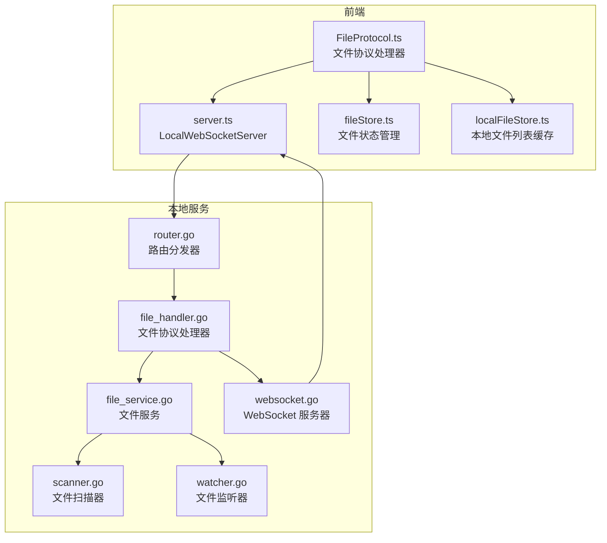

**图表来源**
- [FileProtocol.ts:16-68](file://src/services/protocols/FileProtocol.ts#L16-L68)
- [file_handler.go:14-46](file://LocalBridge/internal/protocol/file/file_handler.go#L14-L46)
- [file_service.go:19-62](file://LocalBridge/internal/service/file/file_service.go#L19-L62)
- [scanner.go:20-38](file://LocalBridge/internal/service/file/scanner.go#L20-L38)
- [watcher.go:34-59](file://LocalBridge/internal/service/file/watcher.go#L34-L59)
- [server.ts:20-35](file://src/services/server.ts#L20-L35)
- [websocket.go:35-58](file://LocalBridge/internal/server/websocket.go#L35-L58)
- [router.go:28-47](file://LocalBridge/internal/router/router.go#L28-L47)

**章节来源**
- [FileProtocol.ts:16-68](file://src/services/protocols/FileProtocol.ts#L16-L68)
- [file_handler.go:14-46](file://LocalBridge/internal/protocol/file/file_handler.go#L14-L46)
- [file_service.go:19-62](file://LocalBridge/internal/service/file/file_service.go#L19-L62)
- [scanner.go:20-38](file://LocalBridge/internal/service/file/scanner.go#L20-L38)
- [watcher.go:34-59](file://LocalBridge/internal/service/file/watcher.go#L34-L59)
- [server.ts:20-35](file://src/services/server.ts#L20-L35)
- [websocket.go:35-58](file://LocalBridge/internal/server/websocket.go#L35-L58)
- [router.go:28-47](file://LocalBridge/internal/router/router.go#L28-L47)

## 核心组件
- 前端协议处理器：负责注册/处理文件相关路由、接收文件列表/内容/变更通知、发起打开/创建/保存请求，并管理保存确认回调与自动重载逻辑。
- 本地协议处理器：负责解析前端请求、调用文件服务执行读写/创建/刷新、向前端广播文件列表与变更通知。
- 文件服务：封装扫描、监听、读写、创建、路径校验、事件发布等能力。
- 扫描器：按扩展名与深度/数量限制扫描文件，构建索引。
- 监听器：基于 fsnotify 监控文件系统事件，进行防抖与过滤。
- 状态存储：前端维护本地文件列表缓存与当前文件状态，支持增量更新与图片缓存。

**章节来源**
- [FileProtocol.ts:16-68](file://src/services/protocols/FileProtocol.ts#L16-L68)
- [file_handler.go:14-46](file://LocalBridge/internal/protocol/file/file_handler.go#L14-L46)
- [file_service.go:19-62](file://LocalBridge/internal/service/file/file_service.go#L19-L62)
- [scanner.go:20-38](file://LocalBridge/internal/service/file/scanner.go#L20-L38)
- [watcher.go:34-59](file://LocalBridge/internal/service/file/watcher.go#L34-L59)
- [localFileStore.ts:60-122](file://src/stores/localFileStore.ts#L60-L122)
- [fileStore.ts:299-328](file://src/stores/fileStore.ts#L299-L328)

## 架构总览
文件协议的端到端流程如下：
- 前端通过 WebSocket 连接本地服务，完成协议版本握手。
- 本地服务启动后推送文件列表；前端本地缓存并展示。
- 用户操作触发前端协议处理器发送请求（打开/创建/保存），本地协议处理器解析并调用文件服务。
- 文件服务执行具体 IO 操作，必要时触发扫描/监听，发布事件。
- 本地协议处理器将结果或确认消息回推前端；前端更新状态与 UI。

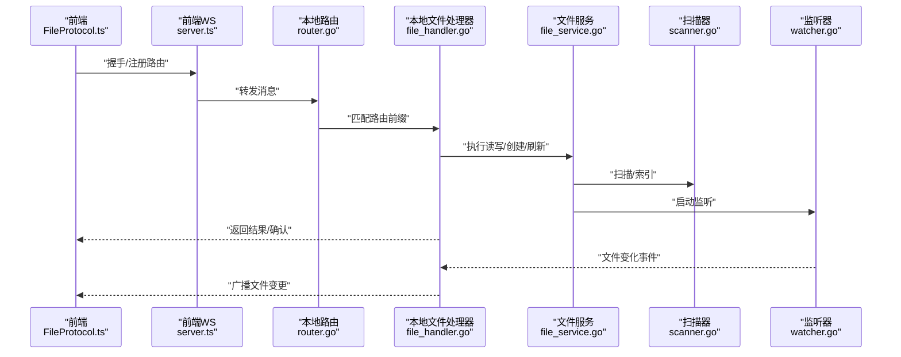

**图表来源**
- [server.ts:104-121](file://src/services/server.ts#L104-L121)
- [router.go:49-76](file://LocalBridge/internal/router/router.go#L49-L76)
- [file_handler.go:48-64](file://LocalBridge/internal/protocol/file/file_handler.go#L48-L64)
- [file_service.go:64-95](file://LocalBridge/internal/service/file/file_service.go#L64-L95)
- [scanner.go:58-62](file://LocalBridge/internal/service/file/scanner.go#L58-L62)
- [watcher.go:61-83](file://LocalBridge/internal/service/file/watcher.go#L61-L83)

**章节来源**
- [server.ts:104-121](file://src/services/server.ts#L104-L121)
- [router.go:49-76](file://LocalBridge/internal/router/router.go#L49-L76)
- [file_handler.go:48-64](file://LocalBridge/internal/protocol/file/file_handler.go#L48-L64)
- [file_service.go:64-95](file://LocalBridge/internal/service/file/file_service.go#L64-L95)
- [scanner.go:58-62](file://LocalBridge/internal/service/file/scanner.go#L58-L62)
- [watcher.go:61-83](file://LocalBridge/internal/service/file/watcher.go#L61-L83)

## 详细组件分析

### 前端文件协议处理器（FileProtocol）
职责与要点：
- 注册接收路由：/lte/file_list、/lte/file_content、/lte/file_changed。
- 注册确认路由：/ack/save_file、/ack/save_separated、/ack/create_file。
- 处理文件列表：更新本地文件缓存并提示刷新完成。
- 处理文件内容：调用 fileStore 打开文件，合并 MPE 配置，更新 UI。
- 处理文件变更：根据类型（created/modified/deleted/renamed）更新本地缓存与已打开文件状态；对“最近保存”文件做去抖；支持自动重载或弹窗选择。
- 保存确认机制：静态 Map 存储等待中的保存回调，统一超时与解析；断开连接时清理。
- 发起请求：打开文件、创建文件、分离保存、重新加载。

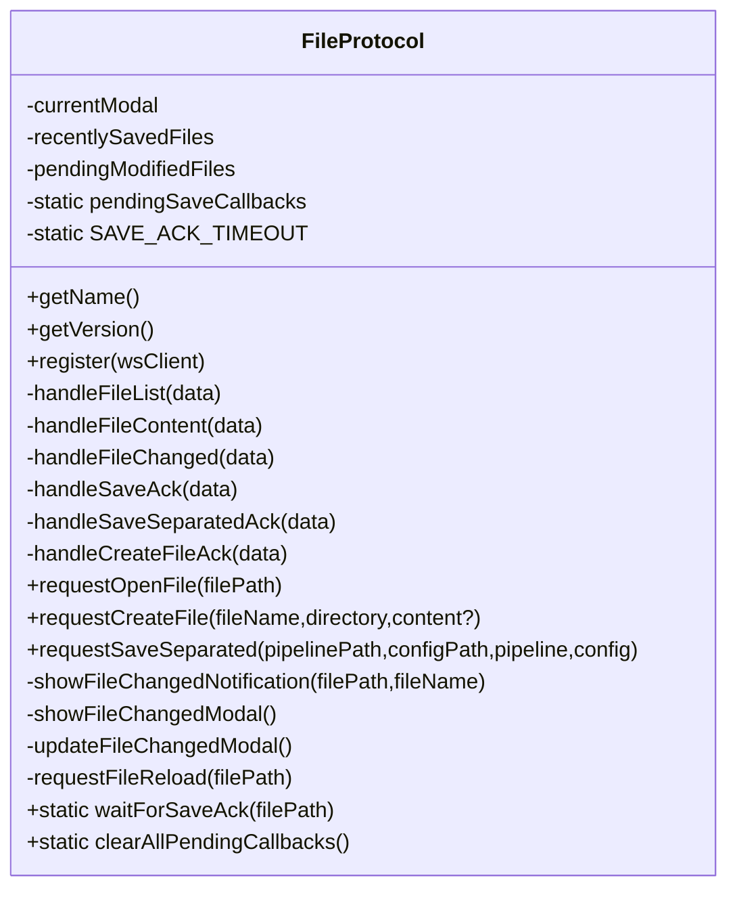

**图表来源**
- [FileProtocol.ts:16-68](file://src/services/protocols/FileProtocol.ts#L16-L68)
- [FileProtocol.ts:78-103](file://src/services/protocols/FileProtocol.ts#L78-L103)
- [FileProtocol.ts:109-141](file://src/services/protocols/FileProtocol.ts#L109-L141)
- [FileProtocol.ts:147-231](file://src/services/protocols/FileProtocol.ts#L147-L231)
- [FileProtocol.ts:237-358](file://src/services/protocols/FileProtocol.ts#L237-L358)
- [FileProtocol.ts:364-429](file://src/services/protocols/FileProtocol.ts#L364-L429)
- [FileProtocol.ts:434-558](file://src/services/protocols/FileProtocol.ts#L434-L558)
- [FileProtocol.ts:567-605](file://src/services/protocols/FileProtocol.ts#L567-L605)

**章节来源**
- [FileProtocol.ts:16-68](file://src/services/protocols/FileProtocol.ts#L16-L68)
- [FileProtocol.ts:78-103](file://src/services/protocols/FileProtocol.ts#L78-L103)
- [FileProtocol.ts:109-141](file://src/services/protocols/FileProtocol.ts#L109-L141)
- [FileProtocol.ts:147-231](file://src/services/protocols/FileProtocol.ts#L147-L231)
- [FileProtocol.ts:237-358](file://src/services/protocols/FileProtocol.ts#L237-L358)
- [FileProtocol.ts:364-429](file://src/services/protocols/FileProtocol.ts#L364-L429)
- [FileProtocol.ts:434-558](file://src/services/protocols/FileProtocol.ts#L434-L558)
- [FileProtocol.ts:567-605](file://src/services/protocols/FileProtocol.ts#L567-L605)

### 本地文件协议处理器（file_handler.go）
职责与要点：
- 路由前缀：/etl/open_file、/etl/save_file、/etl/save_separated、/etl/create_file、/etl/refresh_file_list。
- 处理打开文件：读取 Pipeline 文件，尝试读取同目录下的 .mpe.json 配置文件，返回 /lte/file_content。
- 处理保存文件：保存单文件，返回 /ack/save_file。
- 处理分离保存：分别保存 Pipeline 与配置文件，返回 /ack/save_separated。
- 处理创建文件：创建文件并推送最新文件列表，返回 /ack/create_file。
- 订阅事件：连接建立时推送文件列表；文件变化时广播 /lte/file_changed，并在结构变化时推送最新列表。
- 错误处理：统一包装错误并通过 /error 返回。

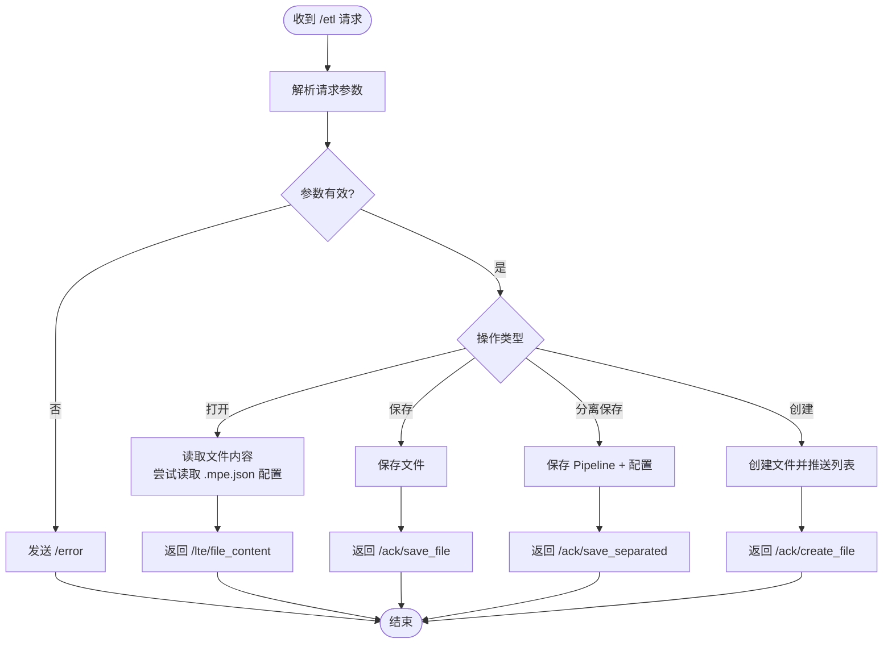

**图表来源**
- [file_handler.go:48-64](file://LocalBridge/internal/protocol/file/file_handler.go#L48-L64)
- [file_handler.go:66-137](file://LocalBridge/internal/protocol/file/file_handler.go#L66-L137)
- [file_handler.go:139-166](file://LocalBridge/internal/protocol/file/file_handler.go#L139-L166)
- [file_handler.go:168-208](file://LocalBridge/internal/protocol/file/file_handler.go#L168-L208)
- [file_handler.go:210-241](file://LocalBridge/internal/protocol/file/file_handler.go#L210-L241)
- [file_handler.go:249-285](file://LocalBridge/internal/protocol/file/file_handler.go#L249-L285)

**章节来源**
- [file_handler.go:37-46](file://LocalBridge/internal/protocol/file/file_handler.go#L37-L46)
- [file_handler.go:48-64](file://LocalBridge/internal/protocol/file/file_handler.go#L48-L64)
- [file_handler.go:66-137](file://LocalBridge/internal/protocol/file/file_handler.go#L66-L137)
- [file_handler.go:139-166](file://LocalBridge/internal/protocol/file/file_handler.go#L139-L166)
- [file_handler.go:168-208](file://LocalBridge/internal/protocol/file/file_handler.go#L168-L208)
- [file_handler.go:210-241](file://LocalBridge/internal/protocol/file/file_handler.go#L210-L241)
- [file_handler.go:249-285](file://LocalBridge/internal/protocol/file/file_handler.go#L249-L285)

### 文件服务（file_service.go）
职责与要点：
- 启动流程：初始扫描、构建索引、发布扫描完成事件、启动监听。
- 读取文件：路径安全校验、索引存在性检查、JSONC 解析。
- 保存文件：路径安全校验、JSON 序列化、写入文件、清除自身写入防抖记录。
- 创建文件：路径安全校验、文件名合法性检查、写入默认内容、加入索引。
- 文件变化处理：创建/修改/删除/重命名，更新索引并发布事件；对自身写入在窗口期内忽略。
- 路径校验：绝对路径转换、根目录范围检查。

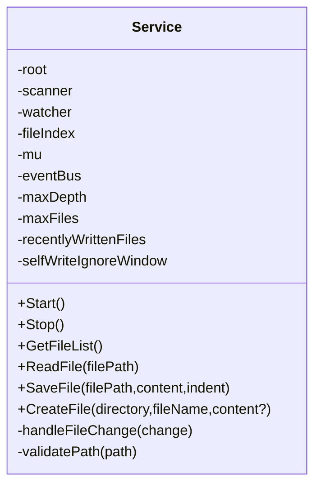

**图表来源**
- [file_service.go:19-62](file://LocalBridge/internal/service/file/file_service.go#L19-L62)
- [file_service.go:64-95](file://LocalBridge/internal/service/file/file_service.go#L64-L95)
- [file_service.go:122-156](file://LocalBridge/internal/service/file/file_service.go#L122-L156)
- [file_service.go:158-201](file://LocalBridge/internal/service/file/file_service.go#L158-L201)
- [file_service.go:203-251](file://LocalBridge/internal/service/file/file_service.go#L203-L251)
- [file_service.go:253-343](file://LocalBridge/internal/service/file/file_service.go#L253-L343)
- [file_service.go:345-359](file://LocalBridge/internal/service/file/file_service.go#L345-L359)

**章节来源**
- [file_service.go:19-62](file://LocalBridge/internal/service/file/file_service.go#L19-L62)
- [file_service.go:64-95](file://LocalBridge/internal/service/file/file_service.go#L64-L95)
- [file_service.go:122-156](file://LocalBridge/internal/service/file/file_service.go#L122-L156)
- [file_service.go:158-201](file://LocalBridge/internal/service/file/file_service.go#L158-L201)
- [file_service.go:203-251](file://LocalBridge/internal/service/file/file_service.go#L203-L251)
- [file_service.go:253-343](file://LocalBridge/internal/service/file/file_service.go#L253-L343)
- [file_service.go:345-359](file://LocalBridge/internal/service/file/file_service.go#L345-L359)

### 扫描器（scanner.go）
职责与要点：
- 限制：最大深度、最大文件数，超过则截断。
- 过滤：排除目录、文件扩展名过滤（排除 .mpe.json）。
- 单文件扫描：计算相对路径、解析节点与前缀。
- 节点解析：读取 JSONC，提取顶层键作为节点，$mpe.prefix 作为前缀。

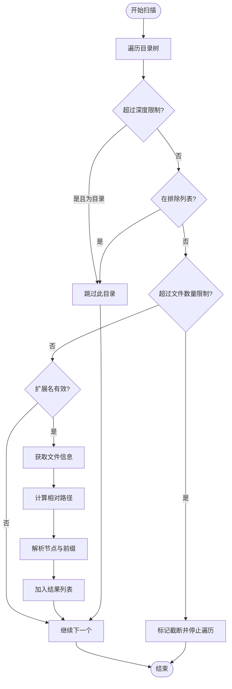

**图表来源**
- [scanner.go:58-147](file://LocalBridge/internal/service/file/scanner.go#L58-L147)
- [scanner.go:176-210](file://LocalBridge/internal/service/file/scanner.go#L176-L210)
- [scanner.go:212-249](file://LocalBridge/internal/service/file/scanner.go#L212-L249)

**章节来源**
- [scanner.go:58-147](file://LocalBridge/internal/service/file/scanner.go#L58-L147)
- [scanner.go:176-210](file://LocalBridge/internal/service/file/scanner.go#L176-L210)
- [scanner.go:212-249](file://LocalBridge/internal/service/file/scanner.go#L212-L249)

### 监听器（watcher.go）
职责与要点：
- 事件类型：created、modified、deleted、renamed。
- 目录监听：新增目录自动加入监听。
- 防抖：统一防抖器，避免频繁触发；重命名事件使用特殊键。
- 扩展名过滤：仅对指定扩展名文件发出事件。

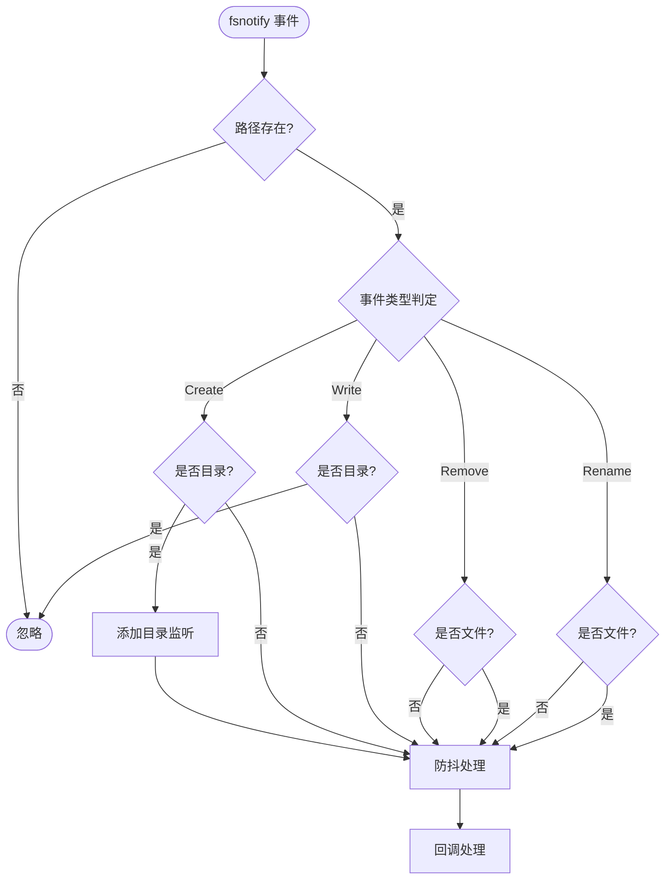

**图表来源**
- [watcher.go:94-111](file://LocalBridge/internal/service/file/watcher.go#L94-L111)
- [watcher.go:113-188](file://LocalBridge/internal/service/file/watcher.go#L113-L188)
- [watcher.go:201-257](file://LocalBridge/internal/service/file/watcher.go#L201-L257)

**章节来源**
- [watcher.go:94-111](file://LocalBridge/internal/service/file/watcher.go#L94-L111)
- [watcher.go:113-188](file://LocalBridge/internal/service/file/watcher.go#L113-L188)
- [watcher.go:201-257](file://LocalBridge/internal/service/file/watcher.go#L201-L257)

### 前端状态存储（localFileStore.ts / fileStore.ts）
职责与要点：
- localFileStore：维护本地文件列表、资源包信息、图片缓存与请求状态，支持全量替换与增量更新。
- fileStore：维护当前文件与多文件集合，支持打开/保存/切换/拖拽排序/本地持久化，以及与 FlowStore 的同步。

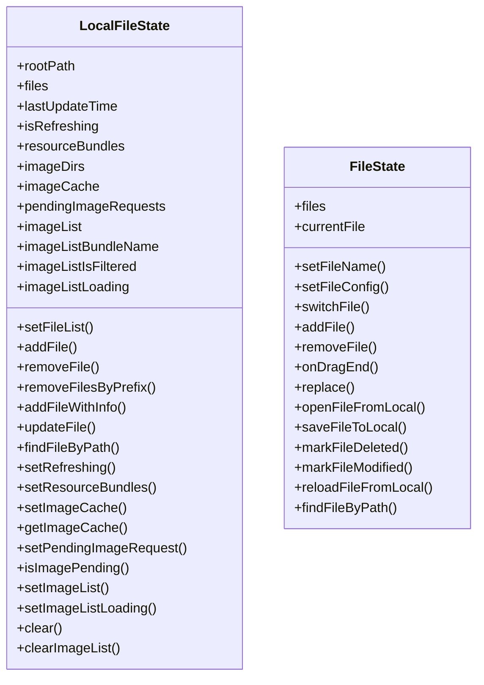

**图表来源**
- [localFileStore.ts:60-122](file://src/stores/localFileStore.ts#L60-L122)
- [fileStore.ts:299-328](file://src/stores/fileStore.ts#L299-L328)
- [fileStore.ts:329-328](file://src/stores/fileStore.ts#L329-L328)

**章节来源**
- [localFileStore.ts:60-122](file://src/stores/localFileStore.ts#L60-L122)
- [fileStore.ts:299-328](file://src/stores/fileStore.ts#L299-L328)
- [fileStore.ts:329-328](file://src/stores/fileStore.ts#L329-L328)

## 依赖分析
- 路由与协议版本：前端通过 server.ts 发送握手请求，本地路由 router.go 校验协议版本，不匹配则拒绝连接。
- WebSocket 服务器：websocket.go 提供连接管理、广播与连接事件发布。
- 模型定义：message.go 定义消息结构、文件数据、确认数据等，前后端一致。
- 配置：config.go 提供文件根目录、排除目录、扩展名、扫描限制等配置项，影响扫描与监听行为。

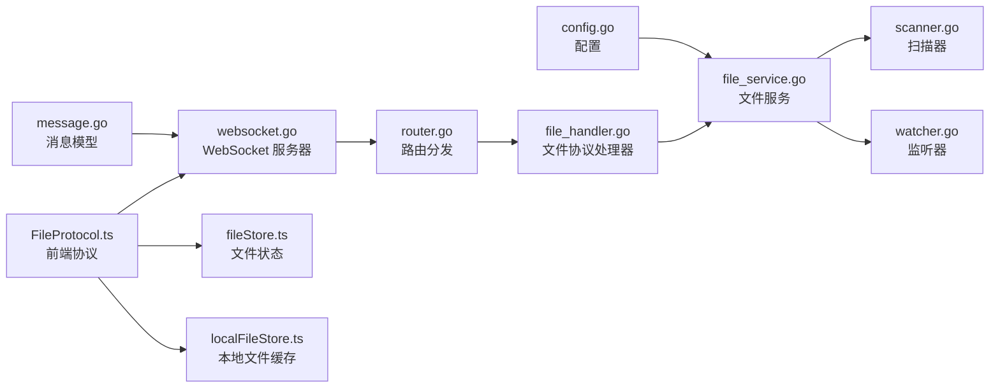

**图表来源**
- [config.go:13-48](file://LocalBridge/internal/config/config.go#L13-L48)
- [file_service.go:19-62](file://LocalBridge/internal/service/file/file_service.go#L19-L62)
- [scanner.go:20-38](file://LocalBridge/internal/service/file/scanner.go#L20-L38)
- [watcher.go:34-59](file://LocalBridge/internal/service/file/watcher.go#L34-L59)
- [message.go:3-7](file://LocalBridge/pkg/models/message.go#L3-L7)
- [websocket.go:35-58](file://LocalBridge/internal/server/websocket.go#L35-L58)
- [router.go:28-47](file://LocalBridge/internal/router/router.go#L28-L47)
- [file_handler.go:14-46](file://LocalBridge/internal/protocol/file/file_handler.go#L14-L46)
- [server.ts:20-35](file://src/services/server.ts#L20-L35)
- [FileProtocol.ts:16-68](file://src/services/protocols/FileProtocol.ts#L16-L68)
- [fileStore.ts:299-328](file://src/stores/fileStore.ts#L299-L328)
- [localFileStore.ts:60-122](file://src/stores/localFileStore.ts#L60-L122)

**章节来源**
- [config.go:13-48](file://LocalBridge/internal/config/config.go#L13-L48)
- [file_service.go:19-62](file://LocalBridge/internal/service/file/file_service.go#L19-L62)
- [scanner.go:20-38](file://LocalBridge/internal/service/file/scanner.go#L20-L38)
- [watcher.go:34-59](file://LocalBridge/internal/service/file/watcher.go#L34-L59)
- [message.go:3-7](file://LocalBridge/pkg/models/message.go#L3-L7)
- [websocket.go:35-58](file://LocalBridge/internal/server/websocket.go#L35-L58)
- [router.go:28-47](file://LocalBridge/internal/router/router.go#L28-L47)
- [file_handler.go:14-46](file://LocalBridge/internal/protocol/file/file_handler.go#L14-L46)
- [server.ts:20-35](file://src/services/server.ts#L20-L35)
- [FileProtocol.ts:16-68](file://src/services/protocols/FileProtocol.ts#L16-L68)
- [fileStore.ts:299-328](file://src/stores/fileStore.ts#L299-L328)
- [localFileStore.ts:60-122](file://src/stores/localFileStore.ts#L60-L122)

## 性能考虑
- 扫描限制：通过最大深度与最大文件数限制，避免大规模目录扫描导致性能问题；超出时截断并记录原因。
- 防抖与忽略窗口：监听器对同一路径事件进行防抖；文件服务对自身写入在短时间窗口内忽略，减少重复事件与广播。
- 增量更新：前端本地文件列表支持全量替换与增量更新，降低 UI 抖动与渲染压力。
- JSONC 解析：读取时解析 JSONC，保存时序列化为 JSON，避免额外转换成本。
- 广播与连接：WebSocket 服务器广播消息时锁定连接集合，注意在大量连接场景下的内存与吞吐权衡。

[本节为通用指导，无需特定文件分析]

## 故障排查指南
- 协议版本不匹配：前端与本地服务协议版本不一致时，握手失败并提示更新；检查前端协议版本与本地服务版本。
- 连接失败/超时：前端连接超时或错误时，会弹出提示并引导查看部署文档；检查本地服务是否启动及端口占用。
- 文件读取失败：本地文件服务读取文件失败时，返回错误消息；检查路径合法性与根目录范围。
- 保存失败：保存文件或分离保存失败时，前端收到失败提示；检查磁盘权限与文件锁。
- 文件变更风暴：大量文件变更导致 UI 卡顿，可通过调整扫描限制与监听扩展名过滤缓解。
- 自动重载冲突：当启用自动重载时，外部修改会自动应用；如需手动控制，可关闭自动重载并使用弹窗选择。

**章节来源**
- [server.ts:104-121](file://src/services/server.ts#L104-L121)
- [router.go:107-133](file://LocalBridge/internal/router/router.go#L107-L133)
- [file_handler.go:317-327](file://LocalBridge/internal/protocol/file/file_handler.go#L317-L327)
- [file_service.go:122-156](file://LocalBridge/internal/service/file/file_service.go#L122-L156)
- [FileProtocol.ts:237-358](file://src/services/protocols/FileProtocol.ts#L237-L358)

## 结论
文件协议通过清晰的分层设计与严格的事件驱动机制，实现了从文件扫描、监控到读写、确认与 UI 同步的完整闭环。前端协议处理器负责交互与状态管理，本地协议处理器负责业务编排与错误处理，文件服务负责底层 IO 与一致性保障。结合扫描限制、防抖与增量更新等机制，系统在保证可靠性的同时兼顾了性能与用户体验。

[本节为总结性内容，无需特定文件分析]

## 附录

### 文件系统事件处理流程（序列图）
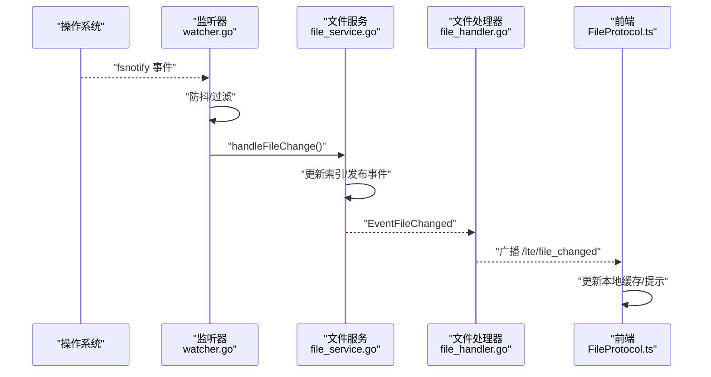

**图表来源**
- [watcher.go:94-111](file://LocalBridge/internal/service/file/watcher.go#L94-L111)
- [watcher.go:113-188](file://LocalBridge/internal/service/file/watcher.go#L113-L188)
- [file_service.go:253-343](file://LocalBridge/internal/service/file/file_service.go#L253-L343)
- [file_handler.go:249-285](file://LocalBridge/internal/protocol/file/file_handler.go#L249-L285)
- [FileProtocol.ts:147-231](file://src/services/protocols/FileProtocol.ts#L147-L231)

### 上传/下载（保存/打开）流程（序列图）
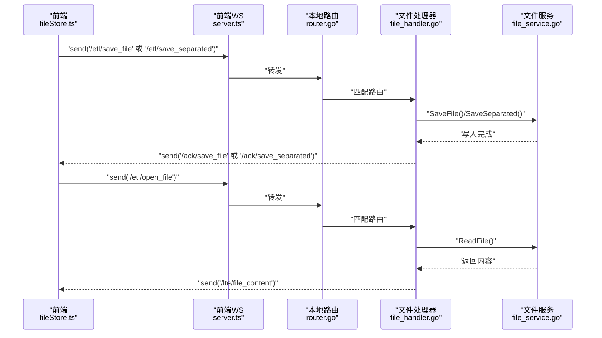

**图表来源**
- [fileStore.ts:605-778](file://src/stores/fileStore.ts#L605-L778)
- [server.ts:285-300](file://src/services/server.ts#L285-L300)
- [router.go:49-76](file://LocalBridge/internal/router/router.go#L49-L76)
- [file_handler.go:48-64](file://LocalBridge/internal/protocol/file/file_handler.go#L48-L64)
- [file_handler.go:139-166](file://LocalBridge/internal/protocol/file/file_handler.go#L139-L166)
- [file_handler.go:168-208](file://LocalBridge/internal/protocol/file/file_handler.go#L168-L208)
- [file_handler.go:210-241](file://LocalBridge/internal/protocol/file/file_handler.go#L210-L241)