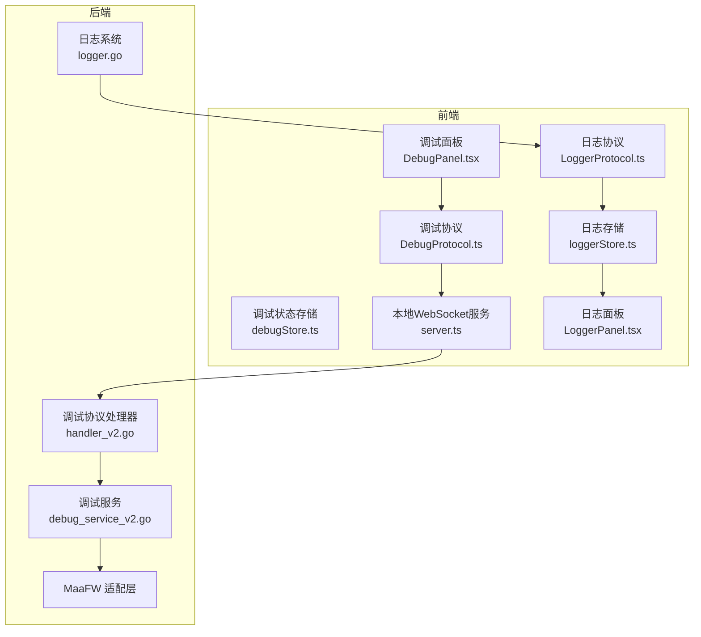
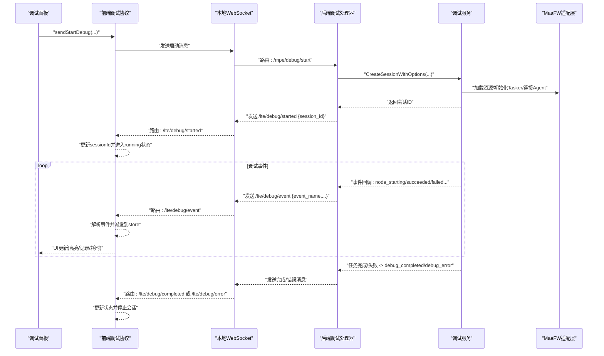
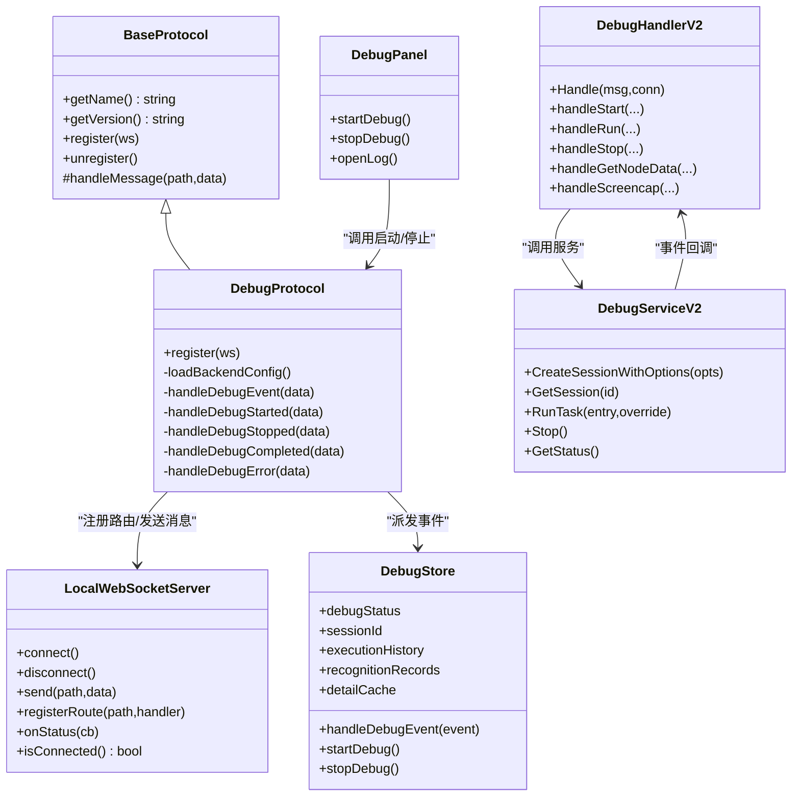

# 调试协议

<cite>
**本文档引用的文件**
- [DebugProtocol.ts](file://src/services/protocols/DebugProtocol.ts)
- [BaseProtocol.ts](file://src/services/protocols/BaseProtocol.ts)
- [server.ts](file://src/services/server.ts)
- [debugStore.ts](file://src/stores/debugStore.ts)
- [DebugPanel.tsx](file://src/components/panels/tools/DebugPanel.tsx)
- [debug_service_v2.go](file://LocalBridge/internal/mfw/debug_service_v2.go)
- [handler_v2.go](file://LocalBridge/internal/protocol/debug/handler_v2.go)
- [logger.go](file://LocalBridge/internal/logger/logger.go)
- [LoggerProtocol.ts](file://src/services/protocols/LoggerProtocol.ts)
- [loggerStore.ts](file://src/stores/loggerStore.ts)
- [LoggerPanel.tsx](file://src/components/panels/tools/LoggerPanel.tsx)
</cite>

## 目录
1. [简介](#简介)
2. [项目结构](#项目结构)
3. [核心组件](#核心组件)
4. [架构总览](#架构总览)
5. [详细组件分析](#详细组件分析)
6. [依赖关系分析](#依赖关系分析)
7. [性能考虑](#性能考虑)
8. [故障排查指南](#故障排查指南)
9. [结论](#结论)

## 简介
本文件面向“调试协议”主题，系统性阐述前端调试协议的实现机制与后端调试服务的协作方式，涵盖调试信息的采集、传输、展示与持久化；调试状态管理与会话生命周期控制；调试数据的格式化、过滤与聚合；调试面板与后端服务的交互与数据同步策略；以及调试日志的生成、存储与查询能力。同时给出性能优化建议与常见问题排查指引。

## 项目结构
调试协议涉及前后端协同：前端通过 WebSocket 与本地服务通信，后端基于 Go 语言实现调试服务与协议处理器，二者通过统一的消息路由进行交互。

图表来源
- [DebugPanel.tsx](file://src/components/panels/tools/DebugPanel.tsx)
- [DebugProtocol.ts](file://src/services/protocols/DebugProtocol.ts)
- [server.ts](file://src/services/server.ts)
- [debugStore.ts](file://src/stores/debugStore.ts)
- [handler_v2.go](file://LocalBridge/internal/protocol/debug/handler_v2.go)
- [debug_service_v2.go](file://LocalBridge/internal/mfw/debug_service_v2.go)
- [logger.go](file://LocalBridge/internal/logger/logger.go)
- [LoggerProtocol.ts](file://src/services/protocols/LoggerProtocol.ts)
- [loggerStore.ts](file://src/stores/loggerStore.ts)
- [LoggerPanel.tsx](file://src/components/panels/tools/LoggerPanel.tsx)

章节来源
- [DebugProtocol.ts](file://src/services/protocols/DebugProtocol.ts)
- [server.ts](file://src/services/server.ts)
- [debugStore.ts](file://src/stores/debugStore.ts)
- [DebugPanel.tsx](file://src/components/panels/tools/DebugPanel.tsx)
- [handler_v2.go](file://LocalBridge/internal/protocol/debug/handler_v2.go)
- [debug_service_v2.go](file://LocalBridge/internal/mfw/debug_service_v2.go)
- [logger.go](file://LocalBridge/internal/logger/logger.go)
- [LoggerProtocol.ts](file://src/services/protocols/LoggerProtocol.ts)
- [loggerStore.ts](file://src/stores/loggerStore.ts)
- [LoggerPanel.tsx](file://src/components/panels/tools/LoggerPanel.tsx)

## 核心组件
- 前端协议层
  - 调试协议处理器：负责注册路由、接收后端事件、解析事件并派发到调试状态存储。
  - 本地 WebSocket 服务：封装连接、握手、消息路由与状态回调。
  - 调试状态存储：维护调试状态、会话 ID、执行历史、识别记录、详情缓存等。
  - 调试面板：提供启动/停止调试、配置资源路径、显示状态与耗时、打开日志等功能。
- 后端服务层
  - 调试协议处理器：根据路由分发到会话管理、调试控制、数据查询等处理函数。
  - 调试服务：管理会话生命周期、事件回调、任务提交与等待、状态查询与资源加载。
  - 日志系统：提供控制台与文件日志输出，并支持向客户端推送日志。

章节来源
- [DebugProtocol.ts](file://src/services/protocols/DebugProtocol.ts)
- [BaseProtocol.ts](file://src/services/protocols/BaseProtocol.ts)
- [server.ts](file://src/services/server.ts)
- [debugStore.ts](file://src/stores/debugStore.ts)
- [DebugPanel.tsx](file://src/components/panels/tools/DebugPanel.tsx)
- [handler_v2.go](file://LocalBridge/internal/protocol/debug/handler_v2.go)
- [debug_service_v2.go](file://LocalBridge/internal/mfw/debug_service_v2.go)
- [logger.go](file://LocalBridge/internal/logger/logger.go)

## 架构总览
调试协议采用“前端协议处理器 + 本地 WebSocket + 后端协议处理器 + 调试服务”的分层架构。前端通过调试面板发起调试请求，后端创建会话并注册事件回调，事件通过 WebSocket 推送至前端，前端更新调试状态与 UI；同时后端日志系统将 INFO/WARN/ERROR 级别日志推送到前端日志面板。

图表来源
- [DebugPanel.tsx](file://src/components/panels/tools/DebugPanel.tsx)
- [DebugProtocol.ts](file://src/services/protocols/DebugProtocol.ts)
- [server.ts](file://src/services/server.ts)
- [handler_v2.go](file://LocalBridge/internal/protocol/debug/handler_v2.go)
- [debug_service_v2.go](file://LocalBridge/internal/mfw/debug_service_v2.go)

## 详细组件分析

### 前端调试协议处理器（DebugProtocol）
职责
- 注册调试相关路由：事件、错误、完成、启动、停止、运行中等。
- 在连接建立时加载后端配置并自动填充资源路径。
- 将后端事件映射为前端可消费的事件并派发到调试状态存储。
- 对会话 ID 进行一致性校验，避免跨会话事件污染。
- 对识别事件进行“父节点”与“标签”的区分，保证记录准确性。

关键行为
- 事件映射：将后端事件名转换为前端事件类型，注入节点 ID、时间戳、延迟、详情等。
- 会话管理：启动成功后设置 sessionId，停止时清理状态。
- 错误处理：对资源加载失败等特定错误弹窗提示并引导用户修正配置。

章节来源
- [DebugProtocol.ts](file://src/services/protocols/DebugProtocol.ts)

### 本地 WebSocket 服务（LocalWebSocketServer）
职责
- 管理 WebSocket 连接生命周期：连接、握手、超时、断开。
- 注册系统与业务路由，分发消息到对应处理器。
- 提供连接状态回调，驱动协议注册与 UI 更新。

关键行为
- 版本握手：发送协议版本，若不匹配则断开并提示升级。
- 路由分发：根据 path 查找处理器并调用。
- 连接状态：提供 onStatus/onConnecting 回调，供协议与 UI 使用。

章节来源
- [server.ts](file://src/services/server.ts)

### 调试状态存储（debugStore）
职责
- 维护调试状态机：idle、preparing、running、paused、completed。
- 记录执行历史与识别记录，支持上限与清理策略。
- 维护详情缓存（含 base64 图像），防止内存膨胀。
- 提供单节点测试模式与结果生成。

关键数据结构
- 执行历史：按节点维度记录开始/结束时间、耗时、状态与错误。
- 识别记录：按识别维度记录命中、父节点、运行次数、时间戳。
- 详情缓存：按 recoId 缓存识别详情，支持懒加载与清理。

事件处理要点
- 节点级事件只更新执行历史，识别事件只更新识别记录，二者解耦。
- 超限清理：超过阈值时按比例清理最旧记录与对应缓存。
- 完成/错误事件：自动重置状态并清理会话上下文。

章节来源
- [debugStore.ts](file://src/stores/debugStore.ts)

### 调试面板（DebugPanel）
职责
- 提供调试配置：资源路径、Agent 标识符、入口节点、保存文件策略。
- 控制调试生命周期：开始/停止调试、打开日志、切换识别记录面板。
- 展示调试状态与耗时：根据当前阶段与目标节点动态更新标签文本。

关键流程
- 启动调试：校验资源路径、入口节点、控制器；转换节点 ID 为全名；发送启动消息。
- 停止调试：发送停止消息并回滚前端状态。
- 打开日志：请求后端打开 maa.log 并提示结果。

章节来源
- [DebugPanel.tsx](file://src/components/panels/tools/DebugPanel.tsx)

### 后端调试协议处理器（handler_v2.go）
职责
- 路由分发：会话管理（创建/销毁/列表/查询）、调试控制（启动/运行/停止）、数据查询（节点数据/截图）。
- 事件回调：将调试事件转换为前端可消费的消息并发送。
- 错误处理：参数校验、会话存在性检查、适配器初始化状态检查。

关键流程
- 创建会话：解析资源路径、控制器 ID、Agent 标识符，创建会话并注册事件回调。
- 启动调试：创建会话并运行任务，返回 session_id。
- 运行任务：在指定会话中运行指定入口节点的任务。
- 停止调试：停止当前任务并清理 Agent 连接。

章节来源
- [handler_v2.go](file://LocalBridge/internal/protocol/debug/handler_v2.go)

### 后端调试服务（debug_service_v2.go）
职责
- 会话生命周期管理：创建、销毁、列举、查询。
- 任务执行：提交任务、等待完成、状态判断、错误上报。
- 事件处理：记录节点执行状态、计算耗时、转发事件给前端。
- 资源管理：加载资源、初始化 Tasker、连接 Agent、截图器设置。

关键状态
- 会话状态：idle、preparing、running、paused、completed、error。
- 执行状态：当前节点、上一节点、已执行节点计数、节点开始时间映射。

章节来源
- [debug_service_v2.go](file://LocalBridge/internal/mfw/debug_service_v2.go)

### 日志系统与日志协议
职责
- 后端日志：控制台与文件双通道，INFO/WARN/ERROR 级别推送。
- 前端日志：LoggerProtocol 接收并标准化，loggerStore 限长缓存，LoggerPanel 展示与交互。

章节来源
- [logger.go](file://LocalBridge/internal/logger/logger.go)
- [LoggerProtocol.ts](file://src/services/protocols/LoggerProtocol.ts)
- [loggerStore.ts](file://src/stores/loggerStore.ts)
- [LoggerPanel.tsx](file://src/components/panels/tools/LoggerPanel.tsx)

## 依赖关系分析

图表来源
- [BaseProtocol.ts](file://src/services/protocols/BaseProtocol.ts)
- [DebugProtocol.ts](file://src/services/protocols/DebugProtocol.ts)
- [server.ts](file://src/services/server.ts)
- [debugStore.ts](file://src/stores/debugStore.ts)
- [DebugPanel.tsx](file://src/components/panels/tools/DebugPanel.tsx)
- [handler_v2.go](file://LocalBridge/internal/protocol/debug/handler_v2.go)
- [debug_service_v2.go](file://LocalBridge/internal/mfw/debug_service_v2.go)

章节来源
- [BaseProtocol.ts](file://src/services/protocols/BaseProtocol.ts)
- [DebugProtocol.ts](file://src/services/protocols/DebugProtocol.ts)
- [server.ts](file://src/services/server.ts)
- [debugStore.ts](file://src/stores/debugStore.ts)
- [DebugPanel.tsx](file://src/components/panels/tools/DebugPanel.tsx)
- [handler_v2.go](file://LocalBridge/internal/protocol/debug/handler_v2.go)
- [debug_service_v2.go](file://LocalBridge/internal/mfw/debug_service_v2.go)

## 性能考虑
- 内存与缓存
  - 识别记录与执行历史上限控制与比例清理，避免无限增长。
  - 详情缓存按条目数量限制，超出时按比例清理最旧项，降低内存占用。
- 事件处理
  - 事件解析与派发在前端 store 中进行，避免重复渲染与状态抖动。
  - 会话 ID 校验与状态机约束，减少无效事件对 UI 的影响。
- 后端任务
  - 任务异步等待与运行 ID 匹配，避免回调错乱。
  - 适配器资源在销毁时释放，减少资源泄漏风险。
- 日志
  - 历史日志缓冲与限长，避免前端日志过多导致卡顿。

章节来源
- [debugStore.ts](file://src/stores/debugStore.ts)
- [debug_service_v2.go](file://LocalBridge/internal/mfw/debug_service_v2.go)
- [logger.go](file://LocalBridge/internal/logger/logger.go)

## 故障排查指南
- 连接与握手
  - 若握手失败或协议版本不匹配，前端会提示并断开连接。请确认本地服务版本与前端协议版本一致。
- 调试启动失败
  - 检查资源路径、控制器 ID、入口节点是否配置正确；若提示资源加载失败，按弹窗提示检查资源路径与文件格式。
- 调试无事件
  - 确认会话 ID 一致且前端处于 running 状态；检查后端日志面板是否存在错误。
- 识别记录缺失
  - 确认识别事件来自“父节点发起”的识别，自我识别不会产生记录卡片。
- 日志无法查看
  - 使用“打开日志”按钮请求后端打开 maa.log；若失败，检查本地服务是否正常运行。

章节来源
- [server.ts](file://src/services/server.ts)
- [DebugProtocol.ts](file://src/services/protocols/DebugProtocol.ts)
- [DebugPanel.tsx](file://src/components/panels/tools/DebugPanel.tsx)
- [LoggerPanel.tsx](file://src/components/panels/tools/LoggerPanel.tsx)

## 结论
调试协议通过前后端清晰的职责划分与严格的事件/状态管理，实现了从资源加载、任务执行、事件推送、UI 展示到日志采集的完整闭环。前端通过状态存储与面板组件提供直观的调试体验，后端通过会话与服务抽象保障稳定性与可扩展性。配合内存与缓存策略，系统在复杂场景下仍能保持良好的性能与可用性。