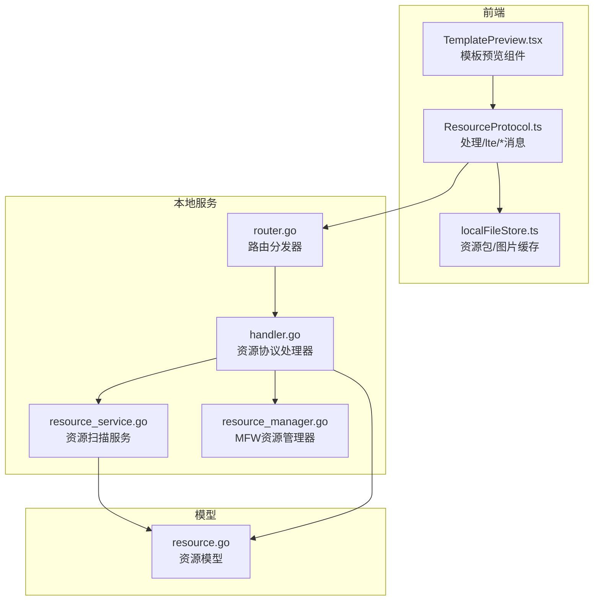
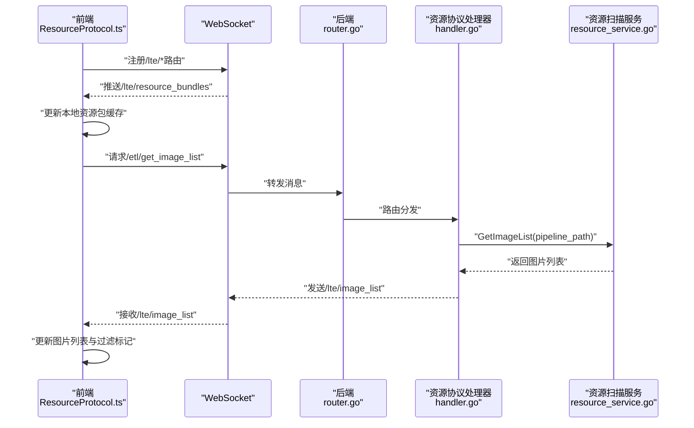
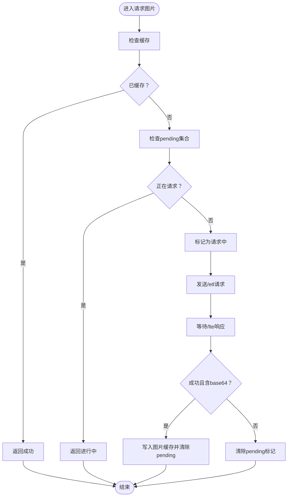
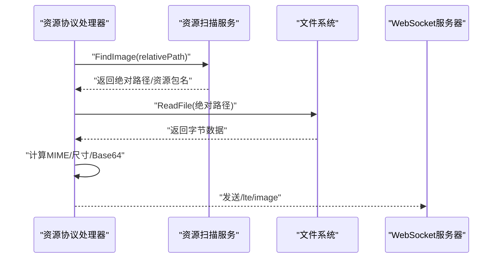
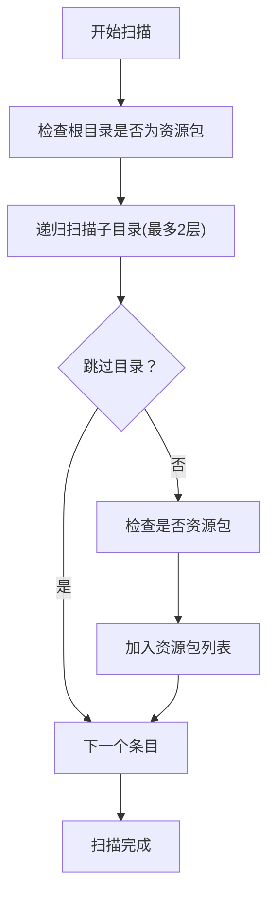
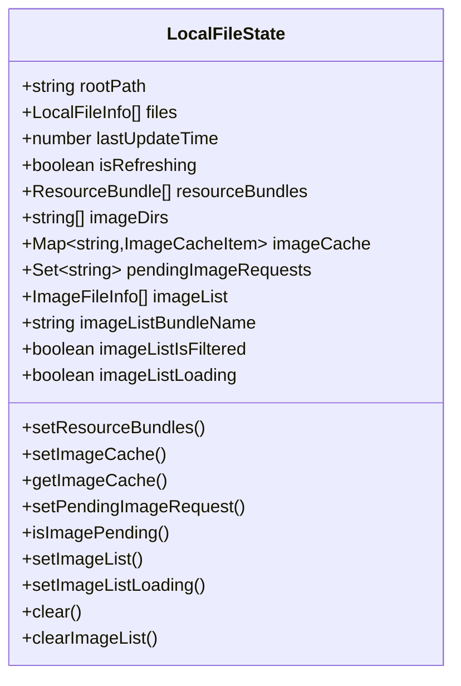
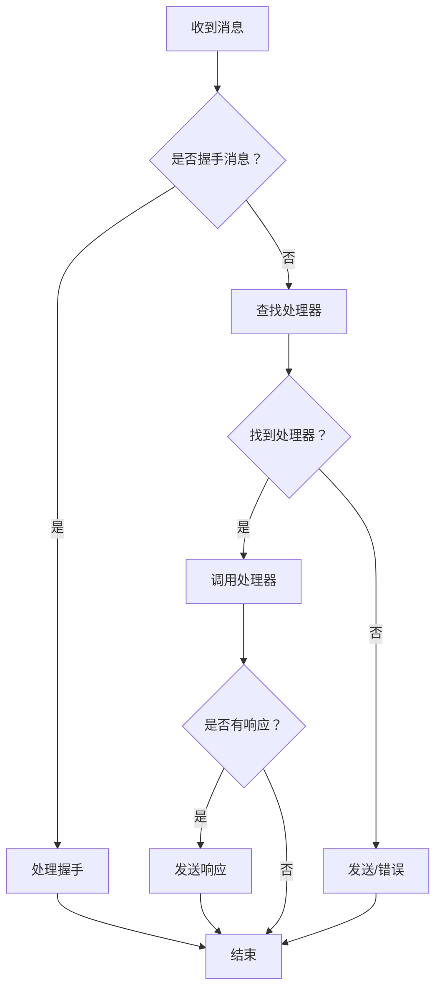
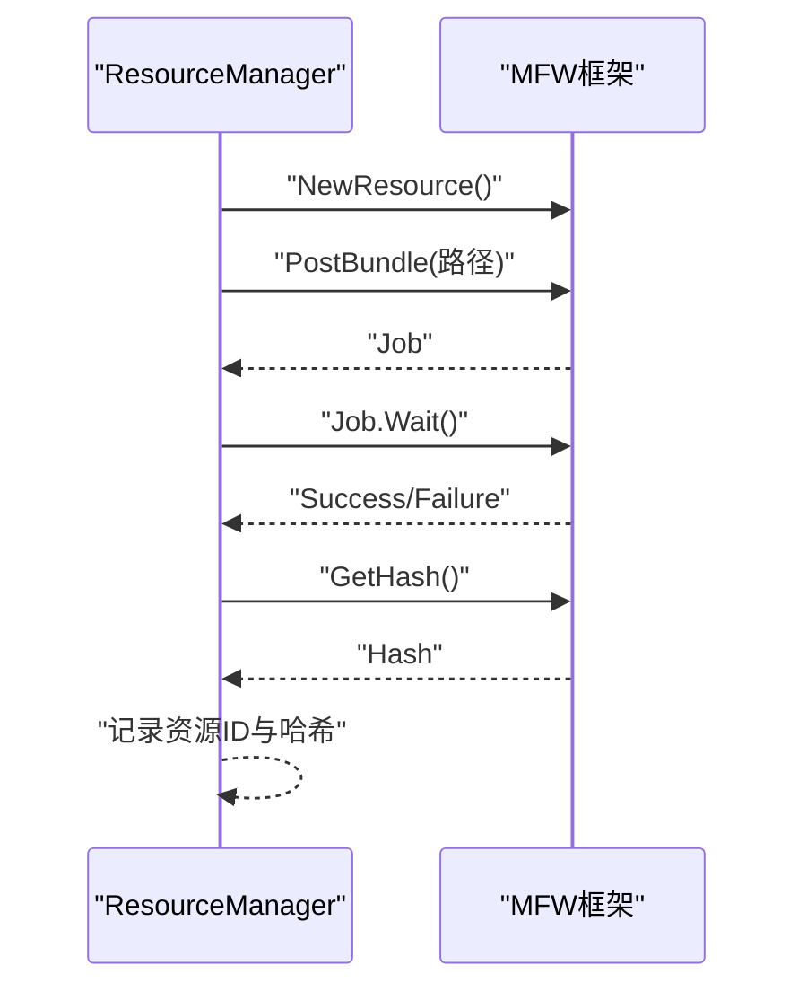
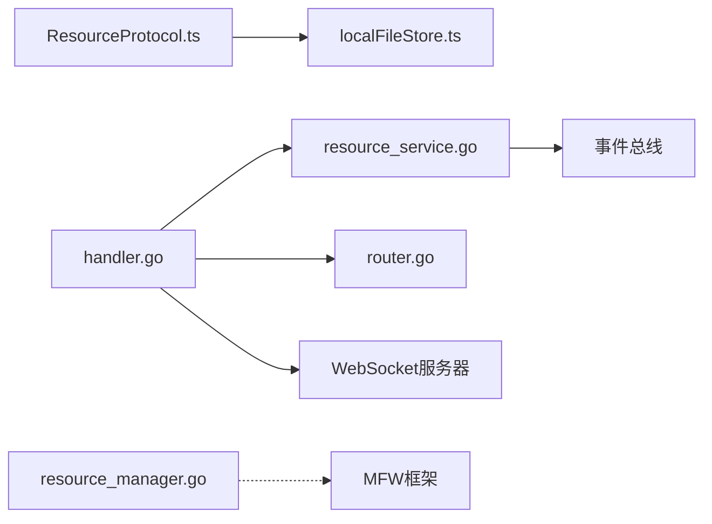

# 资源协议

<cite>
**本文引用的文件**
- [ResourceProtocol.ts](file://src/services/protocols/ResourceProtocol.ts)
- [handler.go](file://LocalBridge/internal/protocol/resource/handler.go)
- [resource_service.go](file://LocalBridge/internal/service/resource/resource_service.go)
- [resource.go](file://LocalBridge/pkg/models/resource.go)
- [localFileStore.ts](file://src/stores/localFileStore.ts)
- [router.go](file://LocalBridge/internal/router/router.go)
- [resource_manager.go](file://LocalBridge/internal/mfw/resource_manager.go)
- [TemplatePreview.tsx](file://src/components/panels/field/items/TemplatePreview.tsx)
</cite>

## 目录
1. [简介](#简介)
2. [项目结构](#项目结构)
3. [核心组件](#核心组件)
4. [架构总览](#架构总览)
5. [详细组件分析](#详细组件分析)
6. [依赖分析](#依赖分析)
7. [性能考虑](#性能考虑)
8. [故障排查指南](#故障排查指南)
9. [结论](#结论)
10. [附录](#附录)

## 简介
本技术文档围绕“资源协议”展开，系统性阐述资源管理功能与实现机制，覆盖图像资源、模板资源、配置资源等的加载、缓存、更新与清理策略；详解资源路径解析、依赖关系管理与版本控制机制；提供资源服务的API接口与使用示例；解释资源压缩、加密与安全保护现状；并给出资源监控、统计与性能优化的实现细节。

## 项目结构
资源协议涉及前后端协同：
- 前端通过 WebSocket 与本地服务通信，使用 ResourceProtocol 处理资源相关消息。
- 后端通过路由分发器将请求交由资源协议处理器，资源协议处理器调用资源扫描服务，最终返回图片数据或列表。
- 资源扫描服务负责扫描资源包、构建资源包与 image 目录索引，并提供图片查找与列表生成能力。
- 前端使用本地文件缓存 Store 管理资源包列表、图片缓存与请求去重。

**图表来源**
- [ResourceProtocol.ts:13-36](file://src/services/protocols/ResourceProtocol.ts#L13-L36)
- [localFileStore.ts:60-122](file://src/stores/localFileStore.ts#L60-L122)
- [router.go:28-76](file://LocalBridge/internal/router/router.go#L28-L76)
- [handler.go:22-53](file://LocalBridge/internal/protocol/resource/handler.go#L22-L53)
- [resource_service.go:14-31](file://LocalBridge/internal/service/resource/resource_service.go#L14-L31)
- [resource_manager.go:13-24](file://LocalBridge/internal/mfw/resource_manager.go#L13-L24)
- [resource.go:3-67](file://LocalBridge/pkg/models/resource.go#L3-L67)

**章节来源**
- [ResourceProtocol.ts:13-36](file://src/services/protocols/ResourceProtocol.ts#L13-L36)
- [localFileStore.ts:60-122](file://src/stores/localFileStore.ts#L60-L122)
- [router.go:28-76](file://LocalBridge/internal/router/router.go#L28-L76)
- [handler.go:22-53](file://LocalBridge/internal/protocol/resource/handler.go#L22-L53)
- [resource_service.go:14-31](file://LocalBridge/internal/service/resource/resource_service.go#L14-L31)
- [resource_manager.go:13-24](file://LocalBridge/internal/mfw/resource_manager.go#L13-L24)
- [resource.go:3-67](file://LocalBridge/pkg/models/resource.go#L3-L67)

## 核心组件
- 资源协议处理器（前端）：负责注册与处理 /lte/* 推送消息，维护图片缓存与请求去重，发起 /etl/* 请求。
- 资源协议处理器（后端）：负责处理 /etl/* 请求，调用资源扫描服务，组装图片数据与列表，推送资源包列表。
- 资源扫描服务：扫描资源包、构建资源包与 image 目录索引，提供图片查找与列表生成。
- 本地文件缓存 Store：前端状态管理，保存资源包、图片缓存、请求去重集合与图片列表。
- 路由分发器：根据消息路径精确或前缀匹配路由处理器。
- MFW 资源管理器：封装 MFW 资源加载、查询与卸载，提供资源哈希与生命周期管理。

**章节来源**
- [ResourceProtocol.ts:13-36](file://src/services/protocols/ResourceProtocol.ts#L13-L36)
- [handler.go:22-53](file://LocalBridge/internal/protocol/resource/handler.go#L22-L53)
- [resource_service.go:14-31](file://LocalBridge/internal/service/resource/resource_service.go#L14-L31)
- [localFileStore.ts:60-122](file://src/stores/localFileStore.ts#L60-L122)
- [router.go:28-76](file://LocalBridge/internal/router/router.go#L28-L76)
- [resource_manager.go:13-24](file://LocalBridge/internal/mfw/resource_manager.go#L13-L24)

## 架构总览
资源协议采用“前端协议处理器 + 后端协议处理器 + 资源扫描服务”的三层协作架构：
- 前端通过 ResourceProtocol 注册 /lte/* 路由，接收资源包列表与图片数据，同时向后端发送 /etl/* 请求。
- 后端路由分发器将 /etl/* 请求分发至资源协议处理器，后者调用资源扫描服务执行具体逻辑。
- 资源扫描服务扫描资源包，构建索引，提供图片查找与列表生成能力。
- 前端本地文件缓存 Store 负责缓存与去重，避免重复请求与重复渲染。

**图表来源**
- [ResourceProtocol.ts:22-36](file://src/services/protocols/ResourceProtocol.ts#L22-L36)
- [router.go:49-76](file://LocalBridge/internal/router/router.go#L49-L76)
- [handler.go:56-69](file://LocalBridge/internal/protocol/resource/handler.go#L56-L69)
- [resource_service.go:240-272](file://LocalBridge/internal/service/resource/resource_service.go#L240-L272)

**章节来源**
- [ResourceProtocol.ts:22-36](file://src/services/protocols/ResourceProtocol.ts#L22-L36)
- [router.go:49-76](file://LocalBridge/internal/router/router.go#L49-L76)
- [handler.go:56-69](file://LocalBridge/internal/protocol/resource/handler.go#L56-L69)
- [resource_service.go:240-272](file://LocalBridge/internal/service/resource/resource_service.go#L240-L272)

## 详细组件分析

### 前端资源协议处理器（ResourceProtocol）
职责与行为：
- 注册 /lte/* 路由：资源包列表推送、单张/批量图片推送、图片列表推送。
- 处理资源包列表：更新本地资源包与 image 目录缓存。
- 处理图片数据：将 base64、MIME、尺寸、bundle 名称等写入图片缓存；失败时清除请求去重标记。
- 处理图片列表：更新图片列表、当前资源包名称与过滤标记。
- 发起请求：请求单张/批量图片、刷新资源列表、请求图片列表。

关键实现要点：
- 请求去重：在请求前检查缓存与 pending 集合，避免重复请求。
- 成功缓存：将图片数据写入 Map，同时移除 pending 标记。
- 失败处理：记录警告并清除 pending 标记，便于后续重试。
- 列表加载状态：请求图片列表时设置 loading 标记，接收响应后清除。

**图表来源**
- [ResourceProtocol.ts:149-207](file://src/services/protocols/ResourceProtocol.ts#L149-L207)
- [ResourceProtocol.ts:76-121](file://src/services/protocols/ResourceProtocol.ts#L76-L121)

**章节来源**
- [ResourceProtocol.ts:22-36](file://src/services/protocols/ResourceProtocol.ts#L22-L36)
- [ResourceProtocol.ts:46-70](file://src/services/protocols/ResourceProtocol.ts#L46-L70)
- [ResourceProtocol.ts:76-121](file://src/services/protocols/ResourceProtocol.ts#L76-L121)
- [ResourceProtocol.ts:127-143](file://src/services/protocols/ResourceProtocol.ts#L127-L143)
- [ResourceProtocol.ts:149-207](file://src/services/protocols/ResourceProtocol.ts#L149-L207)
- [ResourceProtocol.ts:213-240](file://src/services/protocols/ResourceProtocol.ts#L213-L240)
- [ResourceProtocol.ts:246-269](file://src/services/protocols/ResourceProtocol.ts#L246-L269)

### 后端资源协议处理器（handler.go）
职责与行为：
- 路由前缀：/etl/get_image、/etl/get_images、/etl/get_image_list、/etl/refresh_resources。
- 处理单张/批量图片：查找图片、读取文件、计算 MIME 与尺寸、Base64 编码，组装响应。
- 处理刷新资源：触发资源扫描，推送资源包列表。
- 处理图片列表：调用资源扫描服务，返回图片列表与过滤标记。
- 事件订阅：连接建立与资源扫描完成事件触发资源包列表推送。

**图表来源**
- [handler.go:56-69](file://LocalBridge/internal/protocol/resource/handler.go#L56-L69)
- [handler.go:72-84](file://LocalBridge/internal/protocol/resource/handler.go#L72-L84)
- [handler.go:140-182](file://LocalBridge/internal/protocol/resource/handler.go#L140-L182)
- [resource_service.go:175-193](file://LocalBridge/internal/service/resource/resource_service.go#L175-L193)

**章节来源**
- [handler.go:46-53](file://LocalBridge/internal/protocol/resource/handler.go#L46-L53)
- [handler.go:56-69](file://LocalBridge/internal/protocol/resource/handler.go#L56-L69)
- [handler.go:72-84](file://LocalBridge/internal/protocol/resource/handler.go#L72-L84)
- [handler.go:86-105](file://LocalBridge/internal/protocol/resource/handler.go#L86-L105)
- [handler.go:108-114](file://LocalBridge/internal/protocol/resource/handler.go#L108-L114)
- [handler.go:117-137](file://LocalBridge/internal/protocol/resource/handler.go#L117-L137)
- [handler.go:140-182](file://LocalBridge/internal/protocol/resource/handler.go#L140-L182)
- [handler.go:220-245](file://LocalBridge/internal/protocol/resource/handler.go#L220-L245)

### 资源扫描服务（resource_service.go）
职责与行为：
- 扫描资源包：检查 pipeline、image、model、default_pipeline.json 标志性目录与文件，判定资源包。
- 构建索引：记录资源包列表与 image 目录列表。
- 图片查找：按顺序在各 image 目录中查找相对路径对应的图片。
- 图片列表：支持按 pipeline 路径定位资源包，返回过滤标记与当前资源包名称。
- 目录扫描：递归扫描子目录，限制最大深度，跳过常见非资源目录。
- 扩展名过滤：仅支持 PNG/JPG/JPEG/GIF/WEBP/BMP。

**图表来源**
- [resource_service.go:49-68](file://LocalBridge/internal/service/resource/resource_service.go#L49-L68)
- [resource_service.go:71-119](file://LocalBridge/internal/service/resource/resource_service.go#L71-L119)
- [resource_service.go:122-153](file://LocalBridge/internal/service/resource/resource_service.go#L122-L153)

**章节来源**
- [resource_service.go:49-68](file://LocalBridge/internal/service/resource/resource_service.go#L49-L68)
- [resource_service.go:71-119](file://LocalBridge/internal/service/resource/resource_service.go#L71-L119)
- [resource_service.go:122-153](file://LocalBridge/internal/service/resource/resource_service.go#L122-L153)
- [resource_service.go:175-193](file://LocalBridge/internal/service/resource/resource_service.go#L175-L193)
- [resource_service.go:240-272](file://LocalBridge/internal/service/resource/resource_service.go#L240-L272)
- [resource_service.go:274-295](file://LocalBridge/internal/service/resource/resource_service.go#L274-L295)
- [resource_service.go:297-334](file://LocalBridge/internal/service/resource/resource_service.go#L297-L334)

### 前端本地文件缓存 Store（localFileStore.ts）
职责与行为：
- 资源包缓存：保存资源包列表与 image 目录列表。
- 图片缓存：Map 结构保存 base64、MIME、尺寸、bundle 名称、绝对路径与时间戳。
- 请求去重：Set 结构记录正在请求的相对路径。
- 图片列表：保存图片文件列表、当前资源包名称与过滤标记，以及加载状态。
- 清理与重置：提供清空缓存、清空图片列表的方法。

**图表来源**
- [localFileStore.ts:60-122](file://src/stores/localFileStore.ts#L60-L122)
- [localFileStore.ts:250-337](file://src/stores/localFileStore.ts#L250-L337)

**章节来源**
- [localFileStore.ts:60-122](file://src/stores/localFileStore.ts#L60-L122)
- [localFileStore.ts:250-337](file://src/stores/localFileStore.ts#L250-L337)

### 路由分发器（router.go）
职责与行为：
- 精确匹配与前缀匹配：根据消息路径选择处理器。
- 握手处理：校验前端协议版本，确保兼容性。
- 错误处理：未知路由时发送 /error 消息。

**图表来源**
- [router.go:49-76](file://LocalBridge/internal/router/router.go#L49-L76)
- [router.go:107-133](file://LocalBridge/internal/router/router.go#L107-L133)

**章节来源**
- [router.go:49-76](file://LocalBridge/internal/router/router.go#L49-L76)
- [router.go:107-133](file://LocalBridge/internal/router/router.go#L107-L133)

### MFW 资源管理器（resource_manager.go）
职责与行为：
- 资源加载：创建 MFW 资源对象，提交资源包，等待加载完成，获取资源哈希。
- 资源查询：根据资源 ID 查询资源对象。
- 资源卸载：销毁资源实例并从内存中移除。
- 资源清理：支持卸载全部资源。

**图表来源**
- [resource_manager.go:27-105](file://LocalBridge/internal/mfw/resource_manager.go#L27-L105)

**章节来源**
- [resource_manager.go:13-24](file://LocalBridge/internal/mfw/resource_manager.go#L13-L24)
- [resource_manager.go:27-105](file://LocalBridge/internal/mfw/resource_manager.go#L27-L105)
- [resource_manager.go:107-139](file://LocalBridge/internal/mfw/resource_manager.go#L107-L139)
- [resource_manager.go:141-158](file://LocalBridge/internal/mfw/resource_manager.go#L141-L158)

### 模板预览组件（TemplatePreview.tsx）
职责与行为：
- 在 hover 时请求模板图片数据，利用前端缓存与 pending 状态决定渲染与加载。
- 支持多资源目录区分，通过资源包名称标注来源。

**章节来源**
- [TemplatePreview.tsx:18-34](file://src/components/panels/field/items/TemplatePreview.tsx#L18-L34)

## 依赖分析
- 前端 ResourceProtocol 依赖本地文件缓存 Store 与 WebSocket 客户端。
- 后端路由分发器依赖资源协议处理器。
- 资源协议处理器依赖资源扫描服务与 WebSocket 服务器。
- 资源扫描服务依赖事件总线与文件系统。
- MFW 资源管理器独立于资源协议，但可被上层业务调用。

**图表来源**
- [ResourceProtocol.ts:1-7](file://src/services/protocols/ResourceProtocol.ts#L1-L7)
- [handler.go:14-20](file://LocalBridge/internal/protocol/resource/handler.go#L14-L20)
- [resource_service.go:9-12](file://LocalBridge/internal/service/resource/resource_service.go#L9-L12)
- [router.go:6-11](file://LocalBridge/internal/router/router.go#L6-L11)
- [resource_manager.go:8-11](file://LocalBridge/internal/mfw/resource_manager.go#L8-L11)

**章节来源**
- [ResourceProtocol.ts:1-7](file://src/services/protocols/ResourceProtocol.ts#L1-L7)
- [handler.go:14-20](file://LocalBridge/internal/protocol/resource/handler.go#L14-L20)
- [resource_service.go:9-12](file://LocalBridge/internal/service/resource/resource_service.go#L9-L12)
- [router.go:6-11](file://LocalBridge/internal/router/router.go#L6-L11)
- [resource_manager.go:8-11](file://LocalBridge/internal/mfw/resource_manager.go#L8-L11)

## 性能考虑
- 请求去重：前端在请求前检查缓存与 pending 集合，避免重复网络请求与重复渲染。
- 批量请求：支持批量图片请求，减少往返次数。
- 图片缓存：base64 缓存与尺寸元数据减少重复解码与尺寸计算。
- 扫描限制：资源扫描限制最大深度与跳过常见非资源目录，降低 IO 压力。
- MIME/尺寸计算：后端在响应中直接提供 MIME 与尺寸，前端无需二次解析。
- 资源包推送：连接建立与扫描完成后推送资源包列表，保证前端及时获知最新资源。

[本节为通用性能讨论，不直接分析具体文件]

## 故障排查指南
- 资源包列表未更新：确认后端事件总线是否发布扫描完成事件，以及前端是否正确接收 /lte/resource_bundles。
- 图片请求无响应：检查前端 pending 标记是否被清除，后端是否返回成功且包含 base64 数据。
- 图片列表为空：确认资源扫描是否成功，以及是否传入了正确的 pipeline 路径以触发过滤。
- 版本不匹配：前端握手时若版本不一致，后端会拒绝连接并输出提示信息。

**章节来源**
- [handler.go:220-245](file://LocalBridge/internal/protocol/resource/handler.go#L220-L245)
- [ResourceProtocol.ts:118-121](file://src/services/protocols/ResourceProtocol.ts#L118-L121)
- [router.go:120-128](file://LocalBridge/internal/router/router.go#L120-L128)

## 结论
资源协议通过前后端协同实现了资源包与图片资源的高效管理：前端负责缓存与去重、后端负责扫描与数据组装；路由分发器保障消息正确到达；MFW 资源管理器提供资源生命周期管理。整体设计具备良好的扩展性与可维护性，满足多资源目录与模板预览场景的需求。

[本节为总结性内容，不直接分析具体文件]

## 附录

### API 接口与使用示例

- 路由前缀与消息路径
  - 前端接收：/lte/resource_bundles、/lte/image、/lte/images、/lte/image_list
  - 后端请求：/etl/get_image、/etl/get_images、/etl/get_image_list、/etl/refresh_resources

- 前端调用示例（路径）
  - 请求单张图片：[ResourceProtocol.ts:149-173](file://src/services/protocols/ResourceProtocol.ts#L149-L173)
  - 请求批量图片：[ResourceProtocol.ts:179-207](file://src/services/protocols/ResourceProtocol.ts#L179-L207)
  - 刷新资源列表：[ResourceProtocol.ts:213-220](file://src/services/protocols/ResourceProtocol.ts#L213-L220)
  - 请求图片列表：[ResourceProtocol.ts:227-240](file://src/services/protocols/ResourceProtocol.ts#L227-L240)

- 后端处理示例（路径）
  - 处理单张图片：[handler.go:72-84](file://LocalBridge/internal/protocol/resource/handler.go#L72-L84)
  - 处理批量图片：[handler.go:86-105](file://LocalBridge/internal/protocol/resource/handler.go#L86-L105)
  - 处理刷新资源：[handler.go:108-114](file://LocalBridge/internal/protocol/resource/handler.go#L108-L114)
  - 处理图片列表：[handler.go:117-137](file://LocalBridge/internal/protocol/resource/handler.go#L117-L137)

- 模型定义（路径）
  - 资源包与图片信息：[resource.go:3-67](file://LocalBridge/pkg/models/resource.go#L3-L67)

**章节来源**
- [ResourceProtocol.ts:22-36](file://src/services/protocols/ResourceProtocol.ts#L22-L36)
- [ResourceProtocol.ts:149-240](file://src/services/protocols/ResourceProtocol.ts#L149-L240)
- [handler.go:46-53](file://LocalBridge/internal/protocol/resource/handler.go#L46-L53)
- [handler.go:72-137](file://LocalBridge/internal/protocol/resource/handler.go#L72-L137)
- [resource.go:3-67](file://LocalBridge/pkg/models/resource.go#L3-L67)

### 资源路径解析与依赖关系管理
- 资源包识别：依据 pipeline、image、model、default_pipeline.json 等标志性目录与文件判断。
- 路径解析：图片相对路径在各资源包的 image 目录中查找，返回绝对路径与资源包名称。
- 依赖关系：图片列表可按 pipeline 路径定位资源包，形成“当前资源包 → 所有图片”的依赖关系。

**章节来源**
- [resource_service.go:122-153](file://LocalBridge/internal/service/resource/resource_service.go#L122-L153)
- [resource_service.go:175-193](file://LocalBridge/internal/service/resource/resource_service.go#L175-L193)
- [resource_service.go:240-272](file://LocalBridge/internal/service/resource/resource_service.go#L240-L272)

### 版本控制机制
- 协议版本：后端在握手阶段校验前端协议版本，不匹配则拒绝连接并提示更新方式。
- 资源哈希：MFW 资源加载成功后获取资源哈希，可用于资源一致性校验与变更追踪。

**章节来源**
- [router.go:120-128](file://LocalBridge/internal/router/router.go#L120-L128)
- [resource_manager.go:85-97](file://LocalBridge/internal/mfw/resource_manager.go#L85-L97)

### 资源压缩、加密与安全保护
- 压缩：后端在响应中直接返回 Base64 编码的图片数据，未见专用压缩策略。
- 加密：未检测到传输或存储层面的加密实现。
- 安全：后端对 JSON 解析与错误进行包装，前端对非法数据进行校验与告警。

**章节来源**
- [handler.go:140-182](file://LocalBridge/internal/protocol/resource/handler.go#L140-L182)
- [ResourceProtocol.ts:76-93](file://src/services/protocols/ResourceProtocol.ts#L76-L93)

### 监控、统计与性能优化
- 监控：后端在关键路径打印调试与错误日志，前端在异常路径输出控制台警告。
- 统计：资源扫描完成后发布事件，前端据此更新 UI。
- 性能：请求去重、批量请求、缓存与尺寸元数据、扫描限制与目录跳过共同提升性能。

**章节来源**
- [handler.go:117-127](file://LocalBridge/internal/protocol/resource/handler.go#L117-L127)
- [ResourceProtocol.ts:149-207](file://src/services/protocols/ResourceProtocol.ts#L149-L207)
- [resource_service.go:49-68](file://LocalBridge/internal/service/resource/resource_service.go#L49-L68)