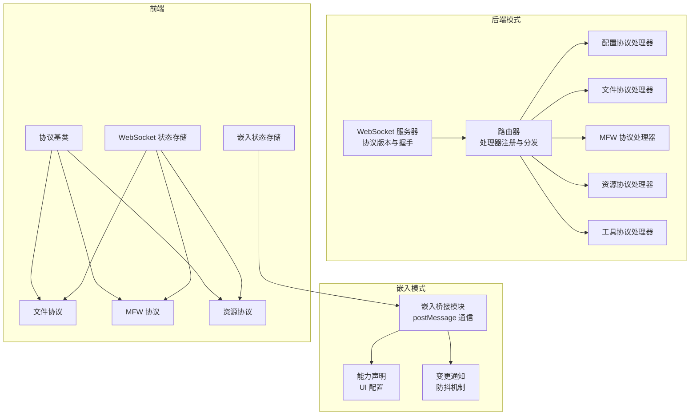
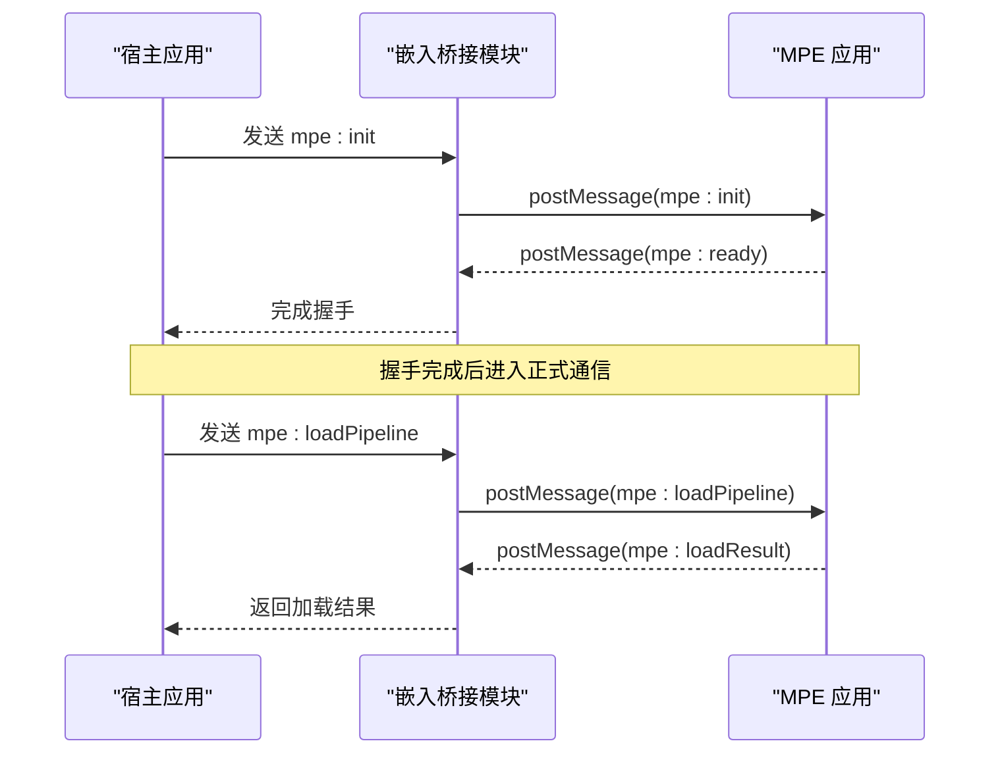
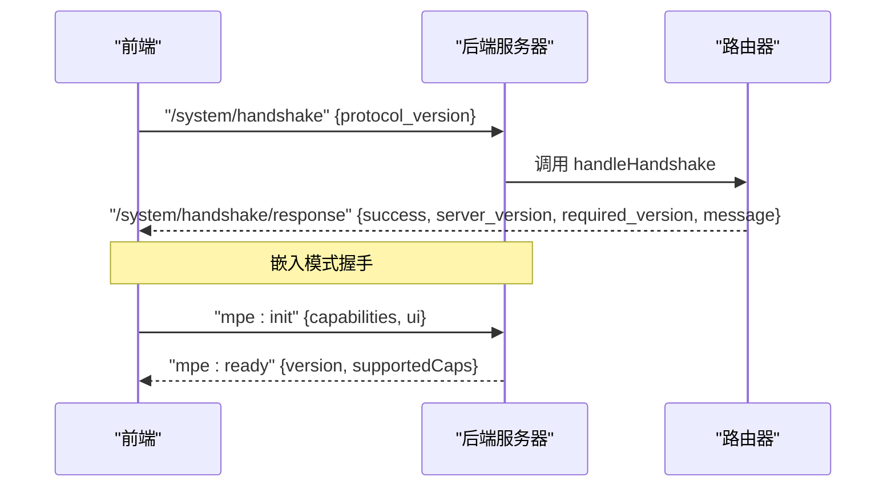
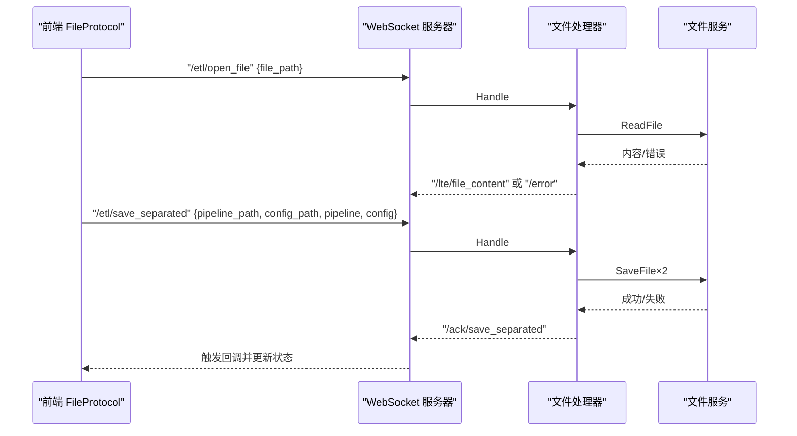
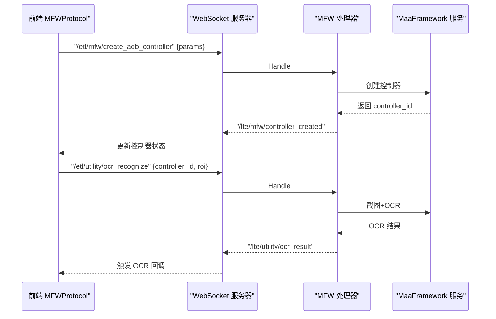
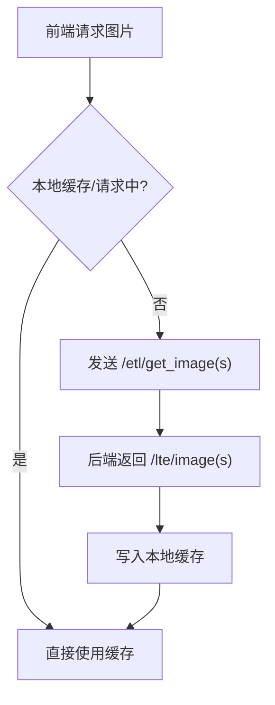
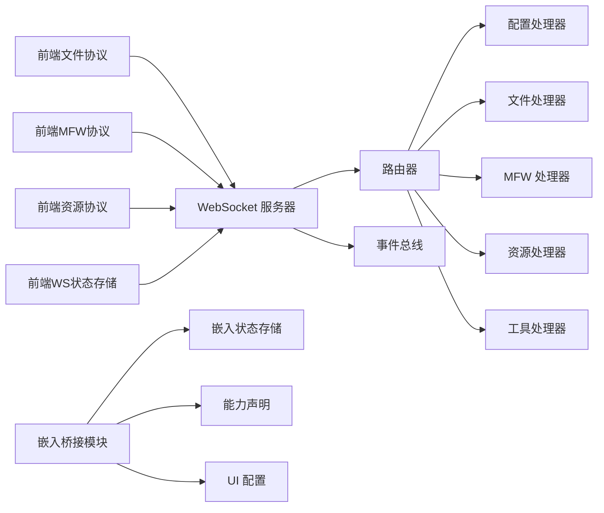

# 通信协议

<cite>
**本文引用的文件**
- [LocalBridge 内部协议配置处理器](file://LocalBridge/internal/protocol/config/handler.go)
- [LocalBridge 内部协议文件处理器](file://LocalBridge/internal/protocol/file/file_handler.go)
- [LocalBridge 内部协议 MFW 处理器](file://LocalBridge/internal/protocol/mfw/handler.go)
- [LocalBridge 内部协议资源处理器](file://LocalBridge/internal/protocol/resource/handler.go)
- [LocalBridge 内部协议工具处理器](file://LocalBridge/internal/protocol/utility/handler.go)
- [LocalBridge 路由器](file://LocalBridge/internal/router/router.go)
- [LocalBridge WebSocket 服务器](file://LocalBridge/internal/server/websocket.go)
- [LocalBridge 消息模型](file://LocalBridge/pkg/models/message.go)
- [前端协议索引](file://src/services/protocols/index.ts)
- [前端协议基类](file://src/services/protocols/BaseProtocol.ts)
- [前端文件协议](file://src/services/protocols/FileProtocol.ts)
- [前端 MFW 协议](file://src/services/protocols/MFWProtocol.ts)
- [前端资源协议](file://src/services/protocols/ResourceProtocol.ts)
- [前端 WebSocket 状态存储](file://src/stores/wsStore.ts)
- [嵌入通信协议文档](file://docsite/docs/01.指南/100.其他/15.嵌入通信协议.md)
- [嵌入桥接模块](file://src/utils/embedBridge.ts)
- [嵌入模式状态存储](file://src/stores/embedStore.ts)
- [嵌入模式变更通知 Hook](file://src/hooks/useEmbedChangeNotifier.ts)
- [嵌入模式 Hook](file://src/hooks/useEmbedMode.ts)
- [Wails 桥接模块](file://src/utils/wailsBridge.ts)
- [应用入口](file://src/App.tsx)
</cite>

## 更新摘要
**所做更改**
- 新增嵌入通信协议章节，详细介绍 iframe 嵌入模式的完整通信机制
- 更新架构总览，增加嵌入模式与在线模式的对比分析
- 新增嵌入模式下的消息格式、握手流程、能力声明等核心概念
- 补充嵌入模式下的状态管理与安全考量
- 更新故障排查指南，增加嵌入模式特有的问题诊断

## 目录
1. [简介](#简介)
2. [项目结构](#项目结构)
3. [核心组件](#核心组件)
4. [架构总览](#架构总览)
5. [详细组件分析](#详细组件分析)
6. [嵌入通信协议](#嵌入通信协议)
7. [依赖关系分析](#依赖关系分析)
8. [性能考虑](#性能考虑)
9. [故障排查指南](#故障排查指南)
10. [结论](#结论)
11. [附录](#附录)

## 简介
本文件系统性梳理了基于 WebSocket 的通信协议设计与实现，涵盖消息格式、路由机制、错误处理、连接管理、协议处理器（Config、File、MFW、Resource、Utility）以及前端状态同步与性能优化策略。文档同时提供协议扩展开发指南，帮助开发者快速创建并集成新的协议类型。**更新** 新增嵌入通信协议章节，详细介绍了 iframe 嵌入模式的完整通信机制，包括消息格式、握手流程、能力声明和安全考量。

## 项目结构
整体采用"后端 Go + 前端 TypeScript"的双端架构：
- 后端负责协议路由、消息分发、业务处理与事件广播
- 前端负责协议封装、状态同步、UI 交互与用户反馈
- **新增** 嵌入模式通过 postMessage 实现宿主与 MPE 的双向通信



**图表来源**
- [LocalBridge WebSocket 服务器:15-179](file://LocalBridge/internal/server/websocket.go#L15-L179)
- [LocalBridge 路由器:13-151](file://LocalBridge/internal/router/router.go#L13-L151)
- [嵌入桥接模块:1-282](file://src/utils/embedBridge.ts#L1-L282)
- [嵌入模式状态存储:1-60](file://src/stores/embedStore.ts#L1-L60)

**章节来源**
- [LocalBridge WebSocket 服务器:15-179](file://LocalBridge/internal/server/websocket.go#L15-L179)
- [LocalBridge 路由器:13-151](file://LocalBridge/internal/router/router.go#L13-L151)
- [嵌入桥接模块:1-282](file://src/utils/embedBridge.ts#L1-L282)
- [嵌入模式状态存储:1-60](file://src/stores/embedStore.ts#L1-L60)

## 核心组件
- 协议版本与握手
  - 后端声明协议版本常量，前端通过握手消息校验版本一致性，不一致时输出安装指引并拒绝连接。
  - **新增** 嵌入模式使用 mpe-embed 协议标识，支持 5 秒握手超时和默认权限集。
- 路由器
  - 维护处理器映射表，支持精确匹配与前缀匹配；未匹配路由时统一返回错误消息。
- WebSocket 服务器
  - 管理连接生命周期、广播消息、事件发布（连接建立/断开），提供连接数统计。
- 消息模型
  - 统一的 Message 结构，包含 path 与 data；错误消息包含 code、message、detail。
- 协议处理器
  - 各协议处理器实现统一接口，返回处理的路由前缀与 Handle 方法；错误通过 /error 路由返回。
- **新增** 嵌入桥接模块
  - 提供 postMessage 双向通信，支持消息格式校验、origin 校验和请求-响应模式。

**章节来源**
- [LocalBridge WebSocket 服务器:15-179](file://LocalBridge/internal/server/websocket.go#L15-L179)
- [LocalBridge 路由器:13-151](file://LocalBridge/internal/router/router.go#L13-L151)
- [LocalBridge 消息模型:3-126](file://LocalBridge/pkg/models/message.go#L3-L126)
- [嵌入桥接模块:1-282](file://src/utils/embedBridge.ts#L1-L282)

## 架构总览
后端通过路由器将消息分发至对应协议处理器，处理器完成业务处理后向客户端发送响应或推送事件；前端协议模块订阅后端推送并同步到状态存储，驱动 UI 更新。**更新** 嵌入模式通过 postMessage 实现宿主与 MPE 的双向通信，支持能力声明、UI 配置和实时变更通知。



**图表来源**
- [嵌入通信协议文档:63-86](file://docsite/docs/01.指南/100.其他/15.嵌入通信协议.md#L63-L86)
- [嵌入桥接模块:179-244](file://src/utils/embedBridge.ts#L179-L244)

## 详细组件分析

### 路由与握手机制
- 握手流程
  - 前端发送包含 protocol_version 的握手消息；后端校验版本，成功则返回包含 server_version 与 required_version 的响应；失败则返回错误消息。
  - **新增** 嵌入模式握手流程：宿主发送 mpe:init，MPE 完成能力配置后回复 mpe:ready，支持 5 秒超时和默认权限集。
- 路由查找
  - 精确匹配优先；若未命中，按前缀匹配处理器；均未命中则返回错误。



**图表来源**
- [LocalBridge 路由器:107-150](file://LocalBridge/internal/router/router.go#L107-L150)
- [LocalBridge WebSocket 服务器:15-22](file://LocalBridge/internal/server/websocket.go#L15-L22)
- [嵌入通信协议文档:63-86](file://docsite/docs/01.指南/100.其他/15.嵌入通信协议.md#L63-L86)

**章节来源**
- [LocalBridge 路由器:107-150](file://LocalBridge/internal/router/router.go#L107-L150)
- [LocalBridge WebSocket 服务器:15-22](file://LocalBridge/internal/server/websocket.go#L15-L22)
- [嵌入通信协议文档:63-86](file://docsite/docs/01.指南/100.其他/15.嵌入通信协议.md#L63-L86)

### 配置协议（ConfigProtocol）
- 路由前缀：/etl/config/*
- 主要能力
  - 获取配置：返回当前全局配置与配置文件路径
  - 设置配置：按字段更新配置并持久化，返回更新后的配置
  - 内部重载：触发配置重载事件并返回结果
- 错误处理：未知路由、数据格式错误、保存失败等通过 /error 返回


**图表来源**
- [LocalBridge 内部协议配置处理器:25-204](file://LocalBridge/internal/protocol/config/handler.go#L25-L204)

**章节来源**
- [LocalBridge 内部协议配置处理器:25-204](file://LocalBridge/internal/protocol/config/handler.go#L25-L204)

### 文件协议（FileProtocol）
- 路由前缀：/etl/open_file、/etl/save_file、/etl/save_separated、/etl/create_file、/etl/refresh_file_list
- 主要能力
  - 打开文件：读取文件内容与关联配置，返回文件内容与配置路径
  - 保存文件：支持合并与分离两种模式，返回确认消息
  - 创建文件：创建新文件并推送文件列表
  - 文件变更：订阅文件系统事件，推送 /lte/file_changed 与 /lte/file_list
- 前端同步
  - 订阅 /lte/* 与 /ack/* 路由，更新本地文件列表、打开/保存状态与变更通知



**图表来源**
- [LocalBridge 内部协议文件处理器:48-208](file://LocalBridge/internal/protocol/file/file_handler.go#L48-L208)
- [LocalBridge 内部协议文件处理器:249-284](file://LocalBridge/internal/protocol/file/file_handler.go#L249-L284)

**章节来源**
- [LocalBridge 内部协议文件处理器:48-208](file://LocalBridge/internal/protocol/file/file_handler.go#L48-L208)
- [LocalBridge 内部协议文件处理器:249-284](file://LocalBridge/internal/protocol/file/file_handler.go#L249-L284)

### MFW 协议（MaaFramework）
- 路由前缀：/etl/mfw/* 与 /etl/utility/*
- 主要能力
  - 设备管理：刷新 ADB 设备与 Win32 窗口列表
  - 控制器管理：创建/断开控制器，执行点击、滑动、输入、按键、手柄控制、Shell 等操作
  - 任务管理：提交任务、查询状态、停止任务
  - 资源管理：加载资源、注册自定义识别/动作
  - 工具能力：OCR 识别、图片路径解析、打开日志
- 前端同步
  - 订阅设备、控制器、截图、OCR、图片路径解析、打开日志等推送消息，维护控制器状态与 UI 交互



**图表来源**
- [LocalBridge 内部协议 MFW 处理器:28-117](file://LocalBridge/internal/protocol/mfw/handler.go#L28-L117)
- [LocalBridge 内部协议工具处理器:44-65](file://LocalBridge/internal/protocol/utility/handler.go#L44-L65)

**章节来源**
- [LocalBridge 内部协议 MFW 处理器:28-117](file://LocalBridge/internal/protocol/mfw/handler.go#L28-L117)
- [LocalBridge 内部协议工具处理器:44-65](file://LocalBridge/internal/protocol/utility/handler.go#L44-L65)

### 资源协议（ResourceProtocol）
- 路由前缀：/etl/get_image、/etl/get_images、/etl/get_image_list、/etl/refresh_resources
- 主要能力
  - 获取单张/批量图片：返回 Base64、MIME、尺寸等
  - 获取图片列表：根据 pipeline 路径筛选资源包内的图片
  - 刷新资源：触发资源扫描并推送资源包列表
- 前端同步
  - 订阅 /lte/resource_bundles、/lte/image*、/lte/image_list，缓存图片并更新 UI



**图表来源**
- [LocalBridge 内部协议资源处理器:55-137](file://LocalBridge/internal/protocol/resource/handler.go#L55-L137)

**章节来源**
- [LocalBridge 内部协议资源处理器:55-137](file://LocalBridge/internal/protocol/resource/handler.go#L55-L137)

### 工具协议（UtilityProtocol）
- 路由前缀：/etl/utility/*
- 主要能力
  - OCR 识别：基于控制器截图与资源执行 OCR，返回文本、框与图像
  - 图片路径解析：在 image 目录中搜索文件并返回相对/绝对路径
  - 打开日志：跨平台打开日志目录或文件
- 错误处理：统一通过 /error 或专用错误消息返回

**章节来源**
- [LocalBridge 内部协议工具处理器:44-65](file://LocalBridge/internal/protocol/utility/handler.go#L44-L65)

## 嵌入通信协议

### 概述与激活方式
嵌入通信协议专为 iframe 嵌入模式设计，使宿主应用可以在不依赖 LocalBridge 后端服务的情况下，将流程编辑器集成到自有界面中。MPE 通过 window.postMessage 进行双向通信，所有文件操作由宿主代理完成。

| 维度     | 嵌入模式      | 在线/独立模式 |
| -------- | ------------- | ------------- |
| 通信方式 | `postMessage` | WebSocket     |
| 后端依赖 | 无            | LocalBridge   |
| 文件访问 | 宿主代理      | LB 文件服务   |
| 设备连接 | 不提供        | 通过 LB       |
| 调试功能 | 不提供        | 通过 LB       |
| UI 定制  | 宿主可配置    | 不可配置      |

激活方式：在 iframe 的 src 中添加 URL 参数即可激活嵌入模式：
```
https://mpe.codax.site/stable/?embed=true&origin=vscode-maa
```

**章节来源**
- [嵌入通信协议文档:10-36](file://docsite/docs/01.指南/100.其他/15.嵌入通信协议.md#L10-L36)

### 消息格式与安全考量
所有 postMessage 消息使用统一的信封格式：

```typescript
interface EmbedMessage {
  protocol: "mpe-embed"; // 协议标识，防止消息串扰
  version: string; // 协议版本，如 "1.0.0"
  type: string; // 消息类型
  requestId?: string; // 请求 ID，用于请求-响应模式匹配
  payload: any; // 消息体
}
```

MPE 仅处理 `protocol` 为 `"mpe-embed"` 的消息，其余 postMessage 消息会被静默忽略。

**安全考量**：
1. 所有消息必须携带 `protocol: "mpe-embed"`
2. 若 URL `origin` 参数以 `http` 开头，则要求 `event.origin` 严格匹配
3. 若 `origin` 参数为标识符形式（如 `vscode-maa`），仅记录日志，不阻断消息

**章节来源**
- [嵌入通信协议文档:47-61](file://docsite/docs/01.指南/100.其他/15.嵌入通信协议.md#L47-L61)
- [嵌入通信协议文档:334-343](file://docsite/docs/01.指南/100.其他/15.嵌入通信协议.md#L334-L343)

### 握手流程与生命周期
iframe 加载完成后，宿主需主动发起握手：

```
宿主                              MPE (iframe)
  │                                  │
  │  ─── mpe:init ──────────────►    │
  │      { capabilities, ui }        │
  │                                  │
  │  ◄──── mpe:ready ─────────────   │
  │      { version, supportedCaps }  │
  │                                  │
  │    (握手完成，正式通信)           │
```

1. iframe 加载完成后，宿主发送 `mpe:init`，携带能力声明与 UI 配置
2. MPE 根据声明配置自身，回复 `mpe:ready`
3. **握手完成前，MPE 忽略所有非 `mpe:init` 消息**
4. 若 **5 秒**内未收到 `mpe:init`，MPE 会使用默认权限集自动完成握手并继续运行

**注意**：`mpe:init` 消息中的 `requestId` 必须原样回填到 `mpe:ready` 中，否则宿主的请求会超时。建议宿主侧设置 **10 秒**超时。

**章节来源**
- [嵌入通信协议文档:63-86](file://docsite/docs/01.指南/100.其他/15.嵌入通信协议.md#L63-L86)

### 宿主 → MPE 消息
| 类型               | 说明                      | payload                | 响应              |
| ------------------ | ------------------------- | ---------------------- | ----------------- |
| `mpe:init`         | 握手 + 权限/UI 声明       | `EmbedInitConfig`      | `mpe:ready`       |
| `mpe:loadPipeline` | 加载 pipeline JSON 数据   | `{ fileName?, data }`  | `mpe:loadResult`  |
| `mpe:save`         | 请求 MPE 回传当前流程数据 | `{}`                   | `mpe:saveData`    |
| `mpe:selectNode`   | 选中指定节点              | `{ nodeId }`           | —                 |
| `mpe:focusNode`    | 聚焦并视口定位到指定节点  | `{ nodeId }`           | —                 |
| `mpe:state`        | 查询 MPE 当前状态         | `{ fields: string[] }` | `mpe:stateResult` |

**加载流程数据**：`mpe:loadPipeline` 的 `data` 字段为标准 MaaFramework pipeline JSON 对象。MPE 收到后会调用内部解析器将其转换为流程图渲染。

**保存流程数据**：宿主发送 `mpe:save` 后，MPE 将当前流程图序列化为 pipeline JSON 并回传。

**节点选中与聚焦**：`mpe:selectNode` 和 `mpe:focusNode` 都通过 `nodeId` 定位节点。MPE 的实现支持两种查找方式：
1. 按节点内部 ID（ReactFlow 的 `node.id`）精确匹配
2. 按节点标签回退（`node.data.label`，即节点显示名称）——当按 ID 找不到时自动尝试按标签匹配

如果两种方式都找不到节点，MPE 会发送 `mpe:error`。

**状态查询**：`mpe:state` 通过 `fields` 数组查询 MPE 的当前状态。目前支持的字段：
- `version`: 嵌入协议版本，如 `"1.0.0"`
- `nodesCount`: 当前节点数量
- `edgesCount`: 当前边数量
- `fileName`: 当前文件名
- `readOnly`: 是否处于只读模式

**章节来源**
- [嵌入通信协议文档:88-186](file://docsite/docs/01.指南/100.其他/15.嵌入通信协议.md#L88-L186)

### MPE → 宿主消息
| 类型              | 说明                          | payload                          |
| ----------------- | ----------------------------- | -------------------------------- |
| `mpe:ready`       | 初始化完成，握手响应          | `{ version, supportedCaps }`     |
| `mpe:loadResult`  | 加载结果                      | `{ success, fileName?, error? }` |
| `mpe:saveData`    | 回传流程数据                  | `{ fileName, data }`             |
| `mpe:change`      | 流程图变更通知                | `{ type, detail }`               |
| `mpe:nodeSelect`  | 用户选中节点                  | `{ nodeId, nodeData? }`          |
| `mpe:saveRequest` | MPE 主动请求保存（如 Ctrl+S） | `{ hint }`                       |
| `mpe:stateResult` | 状态查询结果                  | `{ [field]: value }`             |
| `mpe:error`       | 错误通知                      | `{ code, message, detail? }`     |

**变更通知**：MPE 在流程图发生变更时，会向宿主推送 `mpe:change` 消息。变更类型包括：
- `node.add`: 添加节点
- `node.delete`: 删除节点  
- `node.update`: 节点数据变更
- `edge.add`: 添加边
- `edge.delete`: 删除边

变更通知为**尽力交付**（best-effort），不做消息确认，宿主不应依赖其做精确的状态同步。需要精确状态时应使用 `mpe:save` 获取全量数据。

变更通知内置 **300ms 防抖**：在防抖窗口内发生多次变更时，仅发送最后一次的通知（detail 取最终值）。

**保存请求**：当用户在 MPE 内按下 `Ctrl+S`（或 `Cmd+S`）时，MPE 会发送 `mpe:saveRequest` 通知宿主。

**章节来源**
- [嵌入通信协议文档:175-218](file://docsite/docs/01.指南/100.其他/15.嵌入通信协议.md#L175-L218)

### 能力声明与 UI 控制
宿主在 `mpe:init` 中通过 `capabilities` 字段声明期望的能力集合，MPE 会据此限制对应功能：

```typescript
interface EmbedCapabilities {
  readOnly: boolean; // 只读模式，禁止编辑流程图
  allowCopy: boolean; // 允许复制/粘贴节点
  allowUndoRedo: boolean; // 允许撤销/重做
  allowAutoLayout: boolean; // 允许自动布局
  allowAI: boolean; // 允许 AI 辅助功能
  allowSearch: boolean; // 允许搜索面板
  allowCustomTemplate: boolean; // 允许自定义模板
}
```

**默认权限集**：若宿主未在 5 秒内发送 `mpe:init`，MPE 使用以下默认值自动完成握手：
- `readOnly`: `false`
- `allowCopy`: `true`
- `allowUndoRedo`: `true`
- `allowAutoLayout`: `true`
- `allowAI`: `false`
- `allowSearch`: `true`
- `allowCustomTemplate`: `true`

UI 控制：宿主在 `mpe:init` 中通过 `ui` 字段控制 MPE 的界面元素：

```typescript
interface EmbedUIConfig {
  hideHeader: boolean; // 隐藏顶部导航栏
  hideToolbar: boolean; // 隐藏左侧工具栏
  hiddenPanels: string[]; // 隐藏的面板 ID 列表
}
```

**可隐藏的面板 ID**：
- `field`: 字段面板
- `edge`: 边面板
- `search`: 搜索面板
- `file`: 文件面板
- `config`: 配置面板
- `ai-history`: AI 历史面板
- `local-file`: 本地文件面板
- `error`: 错误面板
- `recognition-history`: 识别历史面板
- `toolbar`: 工具栏面板
- `logger`: 日志面板
- `exploration`: 流程探索面板

**章节来源**
- [嵌入通信协议文档:219-294](file://docsite/docs/01.指南/100.其他/15.嵌入通信协议.md#L219-L294)

### 生命周期与状态管理
```
宿主创建 iframe
      │
      ▼
MPE 加载，检测 embed=true
      │
      ▼
MPE 进入嵌入模式，等待 mpe:init
      │
      ├──── 超时 5s ──► 使用默认权限集自动完成握手
      │
      ▼
收到 mpe:init，配置权限与 UI
      │
      ▼
回复 mpe:ready，握手完成
      │
      ▼
正常通信（loadPipeline / change / save ...）
      │
      ▼
宿主销毁 iframe（可选发送 mpe:destroy）
      │
      ▼
MPE 清理资源
```

**嵌入状态存储**：MPE 使用 `embedStore` 集中管理嵌入模式的全局状态，包括：
- `isReady`: 握手完成状态
- `capabilities`: 能力声明
- `ui`: UI 配置
- `currentFileName`: 当前文件名

**嵌入模式 Hook**：`useEmbedMode` 提供便捷的嵌入模式状态读取，包括能力检查和面板隐藏状态。

**变更通知 Hook**：`useEmbedChangeNotifier` 订阅 FlowStore 的节点/边/选中状态变化，向宿主发送通知。支持 300ms 防抖和即时节点选择通知。

**章节来源**
- [嵌入通信协议文档:305-332](file://docsite/docs/01.指南/100.其他/15.嵌入通信协议.md#L305-L332)
- [嵌入模式状态存储:1-60](file://src/stores/embedStore.ts#L1-L60)
- [嵌入模式 Hook:1-29](file://src/hooks/useEmbedMode.ts#L1-L29)
- [嵌入模式变更通知 Hook:1-136](file://src/hooks/useEmbedChangeNotifier.ts#L1-L136)

## 依赖关系分析
- 后端依赖
  - 路由器依赖各协议处理器接口；处理器依赖服务层（文件、资源、MFW 等）与事件总线
  - WebSocket 服务器依赖事件总线进行连接事件广播
- 前端依赖
  - 协议模块依赖 WebSocket 客户端与状态存储；状态存储依赖协议推送消息
  - **新增** 嵌入模式依赖嵌入桥接模块和状态存储，支持能力声明和 UI 配置



**图表来源**
- [LocalBridge 路由器:29-47](file://LocalBridge/internal/router/router.go#L29-L47)
- [LocalBridge WebSocket 服务器:36-58](file://LocalBridge/internal/server/websocket.go#L36-L58)
- [嵌入桥接模块:1-282](file://src/utils/embedBridge.ts#L1-L282)
- [嵌入模式状态存储:1-60](file://src/stores/embedStore.ts#L1-L60)

**章节来源**
- [LocalBridge 路由器:29-47](file://LocalBridge/internal/router/router.go#L29-L47)
- [LocalBridge WebSocket 服务器:36-58](file://LocalBridge/internal/server/websocket.go#L36-L58)
- [嵌入桥接模块:1-282](file://src/utils/embedBridge.ts#L1-L282)
- [嵌入模式状态存储:1-60](file://src/stores/embedStore.ts#L1-L60)

## 性能考虑
- 连接管理
  - 使用 goroutine 管理连接注册/注销与读写循环，避免阻塞；广播消息时加读锁提升并发读性能
- 消息处理
  - 路由器采用精确匹配优先策略，减少不必要的前缀匹配开销
- 文件与资源
  - 文件处理器在创建/保存后主动推送文件列表，避免前端轮询
  - 资源处理器对图片请求进行去重与缓存，降低网络与解码开销
- 前端状态
  - 使用状态存储集中管理连接状态与协议数据，减少重复渲染
- **新增** 嵌入模式性能优化
  - 变更通知内置 300ms 防抖，减少频繁更新
  - 支持请求-响应模式，避免消息丢失
  - 能力声明和 UI 配置预处理，减少运行时计算

**章节来源**
- [LocalBridge WebSocket 服务器:114-171](file://LocalBridge/internal/server/websocket.go#L114-L171)
- [LocalBridge 内部协议文件处理器:287-300](file://LocalBridge/internal/protocol/file/file_handler.go#L287-L300)
- [LocalBridge 内部协议资源处理器:149-207](file://LocalBridge/internal/protocol/resource/handler.go#L149-L207)
- [嵌入模式变更通知 Hook:42-59](file://src/hooks/useEmbedChangeNotifier.ts#L42-L59)

## 故障排查指南
- 握手失败
  - 现象：/system/handshake/response 中 success=false
  - 原因：前端协议版本与后端不一致
  - 处理：按后端提示更新前端版本
- 未知路由
  - 现象：收到 /error，code=未知的路由
  - 原因：前端发送了后端未注册的 path
  - 处理：检查前端协议路由与后端处理器注册
- 文件操作失败
  - 现象：/ack/save_file 或 /ack/save_separated 返回失败
  - 原因：文件写入异常或权限不足
  - 处理：检查目标路径与权限，查看后端日志
- MFW 控制器连接失败
  - 现象：/lte/mfw/controller_created 返回失败
  - 原因：设备不可用或参数错误
  - 处理：确认设备状态与参数，必要时重新刷新设备列表
- 资源加载失败
  - 现象：/lte/image 返回失败或为空
  - 原因：资源路径错误或文件不存在
  - 处理：检查资源包配置与文件路径
- **新增** 嵌入模式故障排查
  - 握手超时：检查宿主是否在 5 秒内发送 `mpe:init`，确认 `requestId` 正确回填
  - 消息被忽略：确认 `protocol` 字段为 `"mpe-embed"`，检查 `origin` 校验
  - 能力受限：检查 `supportedCaps` 返回值，确认能力声明正确
  - UI 配置无效：确认 `hiddenPanels` 中的面板 ID 正确

**章节来源**
- [LocalBridge 路由器:95-105](file://LocalBridge/internal/router/router.go#L95-L105)
- [LocalBridge 内部协议文件处理器:148-156](file://LocalBridge/internal/protocol/file/file_handler.go#L148-L156)
- [LocalBridge 内部协议 MFW 处理器:33-41](file://LocalBridge/internal/protocol/mfw/handler.go#L33-L41)
- [LocalBridge 内部协议资源处理器:140-182](file://LocalBridge/internal/protocol/resource/handler.go#L140-L182)
- [嵌入通信协议文档:334-351](file://docsite/docs/01.指南/100.其他/15.嵌入通信协议.md#L334-L351)

## 结论
该通信协议以清晰的路由与处理器分层、统一的消息模型与错误处理机制为基础，结合前后端状态同步与性能优化策略，实现了稳定高效的本地服务与前端交互。**更新** 新增的嵌入通信协议进一步扩展了 MPE 的集成能力，通过 iframe 嵌入模式支持多种宿主应用场景。通过本文档提供的扩展指南，开发者可快速新增协议类型并集成到现有框架中，无论是传统的在线模式还是现代的嵌入模式都能获得一致的开发体验。

## 附录

### 协议扩展开发指南
- 实现处理器接口
  - 实现 GetRoutePrefix 返回路由前缀集合
  - 实现 Handle(msg, conn) 处理消息并可返回响应消息
- 注册处理器
  - 在路由器中注册处理器，确保前缀唯一
- 前端协议封装
  - 继承 BaseProtocol，实现 register 注册路由与回调
  - 在回调中更新状态存储并驱动 UI
- 错误处理
  - 使用 /error 或协议专用错误消息返回错误码与详细信息
- **新增** 嵌入模式扩展
  - 实现嵌入桥接模块，支持 postMessage 通信
  - 定义消息格式和握手流程
  - 实现能力声明和 UI 配置支持
  - 处理 origin 校验和安全考量

**章节来源**
- [LocalBridge 路由器:40-47](file://LocalBridge/internal/router/router.go#L40-L47)
- [LocalBridge 内部协议配置处理器:20-23](file://LocalBridge/internal/protocol/config/handler.go#L20-L23)
- [前端协议基类:7-39](file://src/services/protocols/BaseProtocol.ts#L7-L39)
- [嵌入桥接模块:1-282](file://src/utils/embedBridge.ts#L1-L282)
- [嵌入通信协议文档:352-530](file://docsite/docs/01.指南/100.其他/15.嵌入通信协议.md#L352-L530)