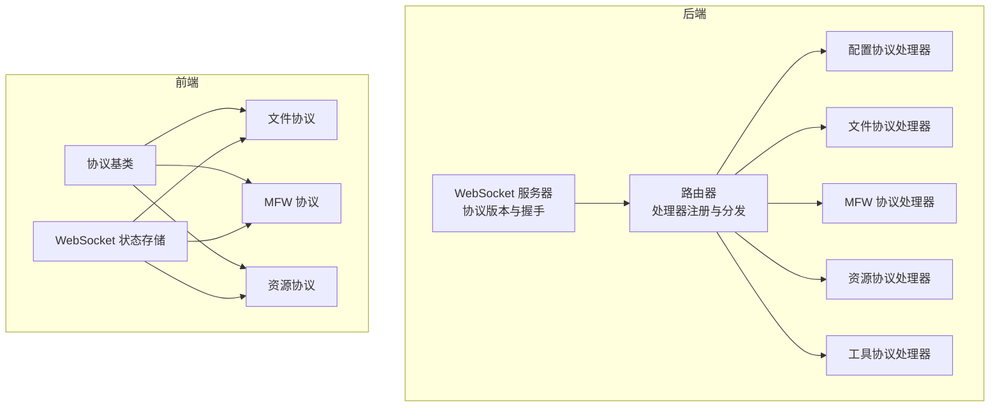
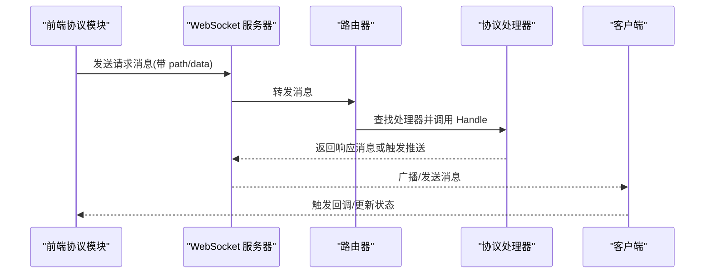
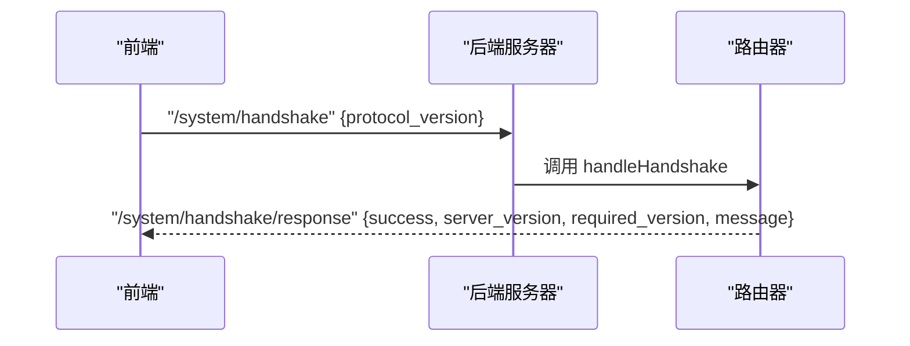
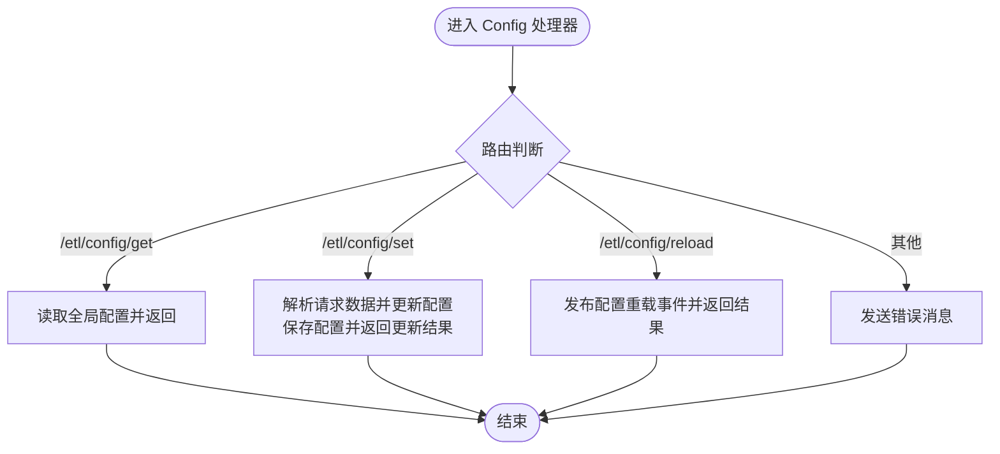
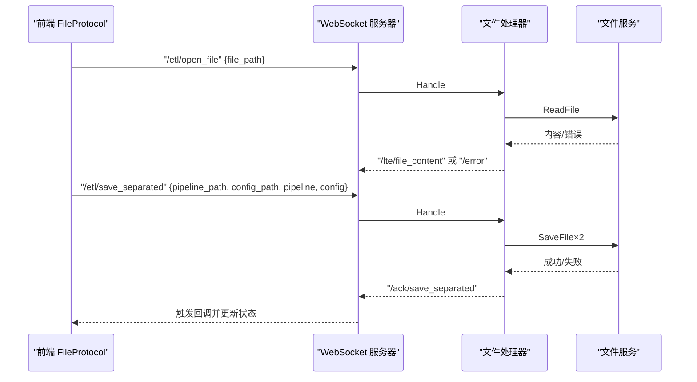
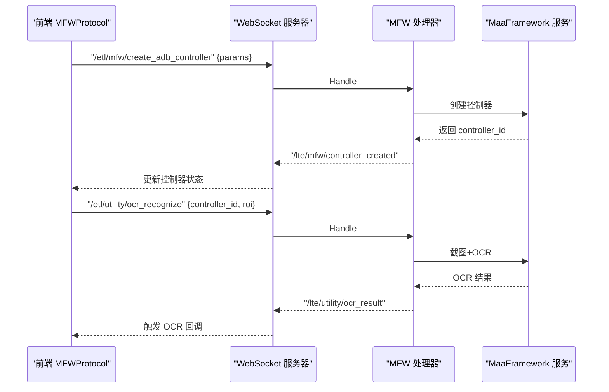
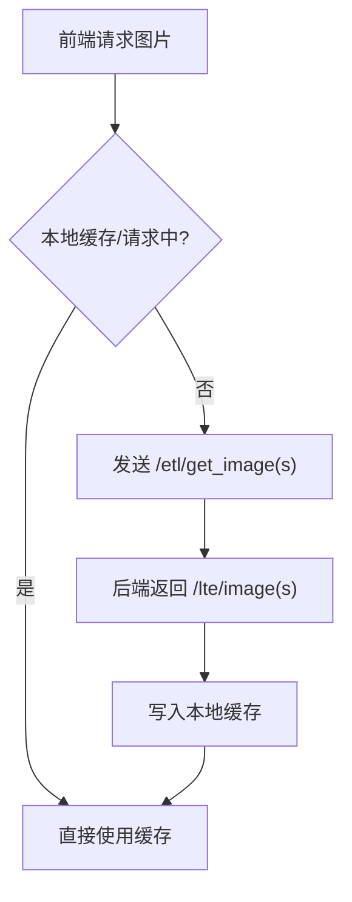
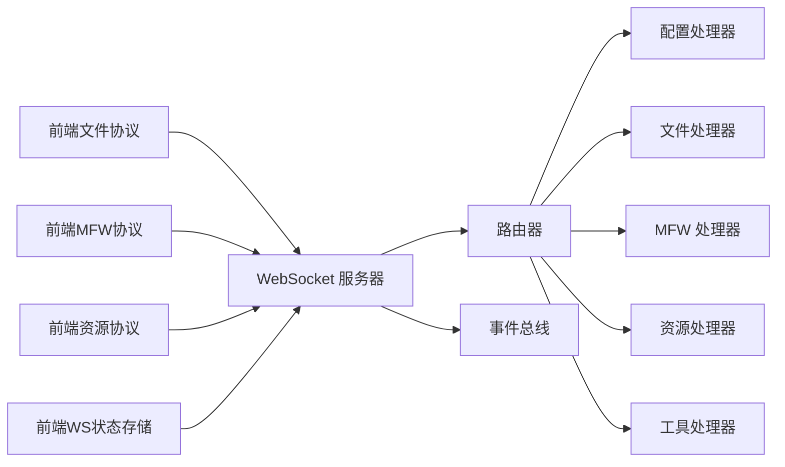

# 通信协议

<cite>
**本文引用的文件**
- [LocalBridge 内部协议配置处理器](file://LocalBridge/internal/protocol/config/handler.go)
- [LocalBridge 内部协议文件处理器](file://LocalBridge/internal/protocol/file/file_handler.go)
- [LocalBridge 内部协议 MFW 处理器](file://LocalBridge/internal/protocol/mfw/handler.go)
- [LocalBridge 内部协议资源处理器](file://LocalBridge/internal/protocol/resource/handler.go)
- [LocalBridge 内部协议工具处理器](file://LocalBridge/internal/protocol/utility/handler.go)
- [LocalBridge 路由器](file://LocalBridge/internal/router/router.go)
- [LocalBridge WebSocket 服务器](file://LocalBridge/internal/server/websocket.go)
- [LocalBridge 消息模型](file://LocalBridge/pkg/models/message.go)
- [前端协议索引](file://src/services/protocols/index.ts)
- [前端协议基类](file://src/services/protocols/BaseProtocol.ts)
- [前端文件协议](file://src/services/protocols/FileProtocol.ts)
- [前端 MFW 协议](file://src/services/protocols/MFWProtocol.ts)
- [前端资源协议](file://src/services/protocols/ResourceProtocol.ts)
- [前端 WebSocket 状态存储](file://src/stores/wsStore.ts)
</cite>

## 目录
1. [简介](#简介)
2. [项目结构](#项目结构)
3. [核心组件](#核心组件)
4. [架构总览](#架构总览)
5. [详细组件分析](#详细组件分析)
6. [依赖关系分析](#依赖关系分析)
7. [性能考虑](#性能考虑)
8. [故障排查指南](#故障排查指南)
9. [结论](#结论)
10. [附录](#附录)

## 简介
本文件系统性梳理了基于 WebSocket 的通信协议设计与实现，涵盖消息格式、路由机制、错误处理、连接管理、协议处理器（Config、File、MFW、Resource、Utility）以及前端状态同步与性能优化策略。文档同时提供协议扩展开发指南，帮助开发者快速创建并集成新的协议类型。

## 项目结构
整体采用“后端 Go + 前端 TypeScript”的双端架构：
- 后端负责协议路由、消息分发、业务处理与事件广播
- 前端负责协议封装、状态同步、UI 交互与用户反馈

图表来源
- [LocalBridge WebSocket 服务器:15-179](file://LocalBridge/internal/server/websocket.go#L15-L179)
- [LocalBridge 路由器:13-151](file://LocalBridge/internal/router/router.go#L13-L151)
- [LocalBridge 内部协议配置处理器:12-47](file://LocalBridge/internal/protocol/config/handler.go#L12-L47)
- [LocalBridge 内部协议文件处理器:14-64](file://LocalBridge/internal/protocol/file/file_handler.go#L14-L64)
- [LocalBridge 内部协议 MFW 处理器:11-117](file://LocalBridge/internal/protocol/mfw/handler.go#L11-L117)
- [LocalBridge 内部协议资源处理器:22-69](file://LocalBridge/internal/protocol/resource/handler.go#L22-L69)
- [LocalBridge 内部协议工具处理器:24-65](file://LocalBridge/internal/protocol/utility/handler.go#L24-L65)
- [前端协议基类:7-39](file://src/services/protocols/BaseProtocol.ts#L7-L39)
- [前端文件协议:16-68](file://src/services/protocols/FileProtocol.ts#L16-L68)
- [前端 MFW 协议:16-97](file://src/services/protocols/MFWProtocol.ts#L16-L97)
- [前端资源协议:13-36](file://src/services/protocols/ResourceProtocol.ts#L13-L36)

章节来源
- [LocalBridge WebSocket 服务器:15-179](file://LocalBridge/internal/server/websocket.go#L15-L179)
- [LocalBridge 路由器:13-151](file://LocalBridge/internal/router/router.go#L13-L151)
- [LocalBridge 内部协议配置处理器:12-47](file://LocalBridge/internal/protocol/config/handler.go#L12-L47)
- [LocalBridge 内部协议文件处理器:14-64](file://LocalBridge/internal/protocol/file/file_handler.go#L14-L64)
- [LocalBridge 内部协议 MFW 处理器:11-117](file://LocalBridge/internal/protocol/mfw/handler.go#L11-L117)
- [LocalBridge 内部协议资源处理器:22-69](file://LocalBridge/internal/protocol/resource/handler.go#L22-L69)
- [LocalBridge 内部协议工具处理器:24-65](file://LocalBridge/internal/protocol/utility/handler.go#L24-L65)
- [前端协议基类:7-39](file://src/services/protocols/BaseProtocol.ts#L7-L39)
- [前端文件协议:16-68](file://src/services/protocols/FileProtocol.ts#L16-L68)
- [前端 MFW 协议:16-97](file://src/services/protocols/MFWProtocol.ts#L16-L97)
- [前端资源协议:13-36](file://src/services/protocols/ResourceProtocol.ts#L13-L36)

## 核心组件
- 协议版本与握手
  - 后端声明协议版本常量，前端通过握手消息校验版本一致性，不一致时输出安装指引并拒绝连接。
- 路由器
  - 维护处理器映射表，支持精确匹配与前缀匹配；未匹配路由时统一返回错误消息。
- WebSocket 服务器
  - 管理连接生命周期、广播消息、事件发布（连接建立/断开），提供连接数统计。
- 消息模型
  - 统一的 Message 结构，包含 path 与 data；错误消息包含 code、message、detail。
- 协议处理器
  - 各协议处理器实现统一接口，返回处理的路由前缀与 Handle 方法；错误通过 /error 路由返回。

章节来源
- [LocalBridge WebSocket 服务器:15-179](file://LocalBridge/internal/server/websocket.go#L15-L179)
- [LocalBridge 路由器:13-151](file://LocalBridge/internal/router/router.go#L13-L151)
- [LocalBridge 消息模型:3-126](file://LocalBridge/pkg/models/message.go#L3-L126)

## 架构总览
后端通过路由器将消息分发至对应协议处理器，处理器完成业务处理后向客户端发送响应或推送事件；前端协议模块订阅后端推送并同步到状态存储，驱动 UI 更新。

图表来源
- [LocalBridge 路由器:49-76](file://LocalBridge/internal/router/router.go#L49-L76)
- [LocalBridge WebSocket 服务器:163-171](file://LocalBridge/internal/server/websocket.go#L163-L171)
- [LocalBridge 内部协议配置处理器:25-47](file://LocalBridge/internal/protocol/config/handler.go#L25-L47)
- [LocalBridge 内部协议文件处理器:48-64](file://LocalBridge/internal/protocol/file/file_handler.go#L48-L64)
- [LocalBridge 内部协议 MFW 处理器:28-117](file://LocalBridge/internal/protocol/mfw/handler.go#L28-L117)
- [LocalBridge 内部协议资源处理器:55-69](file://LocalBridge/internal/protocol/resource/handler.go#L55-L69)

## 详细组件分析

### 路由与握手机制
- 握手流程
  - 前端发送包含 protocol_version 的握手消息；后端校验版本，成功则返回包含 server_version 与 required_version 的响应；失败则返回错误消息。
- 路由查找
  - 精确匹配优先；若未命中，按前缀匹配处理器；均未命中则返回错误。

图表来源
- [LocalBridge 路由器:107-150](file://LocalBridge/internal/router/router.go#L107-L150)
- [LocalBridge WebSocket 服务器:15-22](file://LocalBridge/internal/server/websocket.go#L15-L22)

章节来源
- [LocalBridge 路由器:107-150](file://LocalBridge/internal/router/router.go#L107-L150)
- [LocalBridge WebSocket 服务器:15-22](file://LocalBridge/internal/server/websocket.go#L15-L22)

### 配置协议（ConfigProtocol）
- 路由前缀：/etl/config/*
- 主要能力
  - 获取配置：返回当前全局配置与配置文件路径
  - 设置配置：按字段更新配置并持久化，返回更新后的配置
  - 内部重载：触发配置重载事件并返回结果
- 错误处理：未知路由、数据格式错误、保存失败等通过 /error 返回

图表来源
- [LocalBridge 内部协议配置处理器:25-204](file://LocalBridge/internal/protocol/config/handler.go#L25-L204)

章节来源
- [LocalBridge 内部协议配置处理器:25-204](file://LocalBridge/internal/protocol/config/handler.go#L25-L204)

### 文件协议（FileProtocol）
- 路由前缀：/etl/open_file、/etl/save_file、/etl/save_separated、/etl/create_file、/etl/refresh_file_list
- 主要能力
  - 打开文件：读取文件内容与关联配置，返回文件内容与配置路径
  - 保存文件：支持合并与分离两种模式，返回确认消息
  - 创建文件：创建新文件并推送文件列表
  - 文件变更：订阅文件系统事件，推送 /lte/file_changed 与 /lte/file_list
- 前端同步
  - 订阅 /lte/* 与 /ack/* 路由，更新本地文件列表、打开/保存状态与变更通知

图表来源
- [LocalBridge 内部协议文件处理器:48-208](file://LocalBridge/internal/protocol/file/file_handler.go#L48-L208)
- [LocalBridge 内部协议文件处理器:249-284](file://LocalBridge/internal/protocol/file/file_handler.go#L249-L284)
- [前端文件协议:44-68](file://src/services/protocols/FileProtocol.ts#L44-L68)

章节来源
- [LocalBridge 内部协议文件处理器:48-208](file://LocalBridge/internal/protocol/file/file_handler.go#L48-L208)
- [LocalBridge 内部协议文件处理器:249-284](file://LocalBridge/internal/protocol/file/file_handler.go#L249-L284)
- [前端文件协议:44-68](file://src/services/protocols/FileProtocol.ts#L44-L68)

### MFW 协议（MaaFramework）
- 路由前缀：/etl/mfw/* 与 /etl/utility/*
- 主要能力
  - 设备管理：刷新 ADB 设备与 Win32 窗口列表
  - 控制器管理：创建/断开控制器，执行点击、滑动、输入、按键、手柄控制、Shell 等操作
  - 任务管理：提交任务、查询状态、停止任务
  - 资源管理：加载资源、注册自定义识别/动作
  - 工具能力：OCR 识别、图片路径解析、打开日志
- 前端同步
  - 订阅设备、控制器、截图、OCR、图片路径解析、打开日志等推送消息，维护控制器状态与 UI 交互

图表来源
- [LocalBridge 内部协议 MFW 处理器:28-117](file://LocalBridge/internal/protocol/mfw/handler.go#L28-L117)
- [LocalBridge 内部协议工具处理器:44-65](file://LocalBridge/internal/protocol/utility/handler.go#L44-L65)
- [前端 MFW 协议:38-97](file://src/services/protocols/MFWProtocol.ts#L38-L97)

章节来源
- [LocalBridge 内部协议 MFW 处理器:28-117](file://LocalBridge/internal/protocol/mfw/handler.go#L28-L117)
- [LocalBridge 内部协议工具处理器:44-65](file://LocalBridge/internal/protocol/utility/handler.go#L44-L65)
- [前端 MFW 协议:38-97](file://src/services/protocols/MFWProtocol.ts#L38-L97)

### 资源协议（ResourceProtocol）
- 路由前缀：/etl/get_image、/etl/get_images、/etl/get_image_list、/etl/refresh_resources
- 主要能力
  - 获取单张/批量图片：返回 Base64、MIME、尺寸等
  - 获取图片列表：根据 pipeline 路径筛选资源包内的图片
  - 刷新资源：触发资源扫描并推送资源包列表
- 前端同步
  - 订阅 /lte/resource_bundles、/lte/image*、/lte/image_list，缓存图片并更新 UI

图表来源
- [LocalBridge 内部协议资源处理器:55-137](file://LocalBridge/internal/protocol/resource/handler.go#L55-L137)
- [前端资源协议:149-207](file://src/services/protocols/ResourceProtocol.ts#L149-L207)

章节来源
- [LocalBridge 内部协议资源处理器:55-137](file://LocalBridge/internal/protocol/resource/handler.go#L55-L137)
- [前端资源协议:149-207](file://src/services/protocols/ResourceProtocol.ts#L149-L207)

### 工具协议（UtilityProtocol）
- 路由前缀：/etl/utility/*
- 主要能力
  - OCR 识别：基于控制器截图与资源执行 OCR，返回文本、框与图像
  - 图片路径解析：在 image 目录中搜索文件并返回相对/绝对路径
  - 打开日志：跨平台打开日志目录或文件
- 错误处理：统一通过 /error 或专用错误消息返回

章节来源
- [LocalBridge 内部协议工具处理器:44-65](file://LocalBridge/internal/protocol/utility/handler.go#L44-L65)

## 依赖关系分析
- 后端依赖
  - 路由器依赖各协议处理器接口；处理器依赖服务层（文件、资源、MFW 等）与事件总线
  - WebSocket 服务器依赖事件总线进行连接事件广播
- 前端依赖
  - 协议模块依赖 WebSocket 客户端与状态存储；状态存储依赖协议推送消息

图表来源
- [LocalBridge 路由器:29-47](file://LocalBridge/internal/router/router.go#L29-L47)
- [LocalBridge WebSocket 服务器:36-58](file://LocalBridge/internal/server/websocket.go#L36-L58)
- [前端协议索引:1-6](file://src/services/protocols/index.ts#L1-L6)
- [前端协议基类:7-39](file://src/services/protocols/BaseProtocol.ts#L7-L39)
- [前端 WebSocket 状态存储:7-23](file://src/stores/wsStore.ts#L7-L23)

章节来源
- [LocalBridge 路由器:29-47](file://LocalBridge/internal/router/router.go#L29-L47)
- [LocalBridge WebSocket 服务器:36-58](file://LocalBridge/internal/server/websocket.go#L36-L58)
- [前端协议索引:1-6](file://src/services/protocols/index.ts#L1-L6)
- [前端协议基类:7-39](file://src/services/protocols/BaseProtocol.ts#L7-L39)
- [前端 WebSocket 状态存储:7-23](file://src/stores/wsStore.ts#L7-L23)

## 性能考虑
- 连接管理
  - 使用 goroutine 管理连接注册/注销与读写循环，避免阻塞；广播消息时加读锁提升并发读性能
- 消息处理
  - 路由器采用精确匹配优先策略，减少不必要的前缀匹配开销
- 文件与资源
  - 文件处理器在创建/保存后主动推送文件列表，避免前端轮询
  - 资源处理器对图片请求进行去重与缓存，降低网络与解码开销
- 前端状态
  - 使用状态存储集中管理连接状态与协议数据，减少重复渲染

章节来源
- [LocalBridge WebSocket 服务器:114-171](file://LocalBridge/internal/server/websocket.go#L114-L171)
- [LocalBridge 内部协议文件处理器:287-300](file://LocalBridge/internal/protocol/file/file_handler.go#L287-L300)
- [LocalBridge 内部协议资源处理器:149-207](file://LocalBridge/internal/protocol/resource/handler.go#L149-L207)
- [前端 WebSocket 状态存储:7-23](file://src/stores/wsStore.ts#L7-L23)

## 故障排查指南
- 握手失败
  - 现象：/system/handshake/response 中 success=false
  - 原因：前端协议版本与后端不一致
  - 处理：按后端提示更新前端版本
- 未知路由
  - 现象：收到 /error，code=未知的路由
  - 原因：前端发送了后端未注册的 path
  - 处理：检查前端协议路由与后端处理器注册
- 文件操作失败
  - 现象：/ack/save_file 或 /ack/save_separated 返回失败
  - 原因：文件写入异常或权限不足
  - 处理：检查目标路径与权限，查看后端日志
- MFW 控制器连接失败
  - 现象：/lte/mfw/controller_created 返回失败
  - 原因：设备不可用或参数错误
  - 处理：确认设备状态与参数，必要时重新刷新设备列表
- 资源加载失败
  - 现象：/lte/image 返回失败或为空
  - 原因：资源路径错误或文件不存在
  - 处理：检查资源包配置与文件路径

章节来源
- [LocalBridge 路由器:95-105](file://LocalBridge/internal/router/router.go#L95-L105)
- [LocalBridge 内部协议文件处理器:148-156](file://LocalBridge/internal/protocol/file/file_handler.go#L148-L156)
- [LocalBridge 内部协议 MFW 处理器:33-41](file://LocalBridge/internal/protocol/mfw/handler.go#L33-L41)
- [LocalBridge 内部协议资源处理器:140-182](file://LocalBridge/internal/protocol/resource/handler.go#L140-L182)

## 结论
该通信协议以清晰的路由与处理器分层、统一的消息模型与错误处理机制为基础，结合前后端状态同步与性能优化策略，实现了稳定高效的本地服务与前端交互。通过本文档提供的扩展指南，开发者可快速新增协议类型并集成到现有框架中。

## 附录

### 协议扩展开发指南
- 实现处理器接口
  - 实现 GetRoutePrefix 返回路由前缀集合
  - 实现 Handle(msg, conn) 处理消息并可返回响应消息
- 注册处理器
  - 在路由器中注册处理器，确保前缀唯一
- 前端协议封装
  - 继承 BaseProtocol，实现 register 注册路由与回调
  - 在回调中更新状态存储并驱动 UI
- 错误处理
  - 使用 /error 或协议专用错误消息返回错误码与详细信息

章节来源
- [LocalBridge 路由器:40-47](file://LocalBridge/internal/router/router.go#L40-L47)
- [LocalBridge 内部协议配置处理器:20-23](file://LocalBridge/internal/protocol/config/handler.go#L20-L23)
- [前端协议基类:7-39](file://src/services/protocols/BaseProtocol.ts#L7-L39)
- [前端协议索引:1-6](file://src/services/protocols/index.ts#L1-L6)