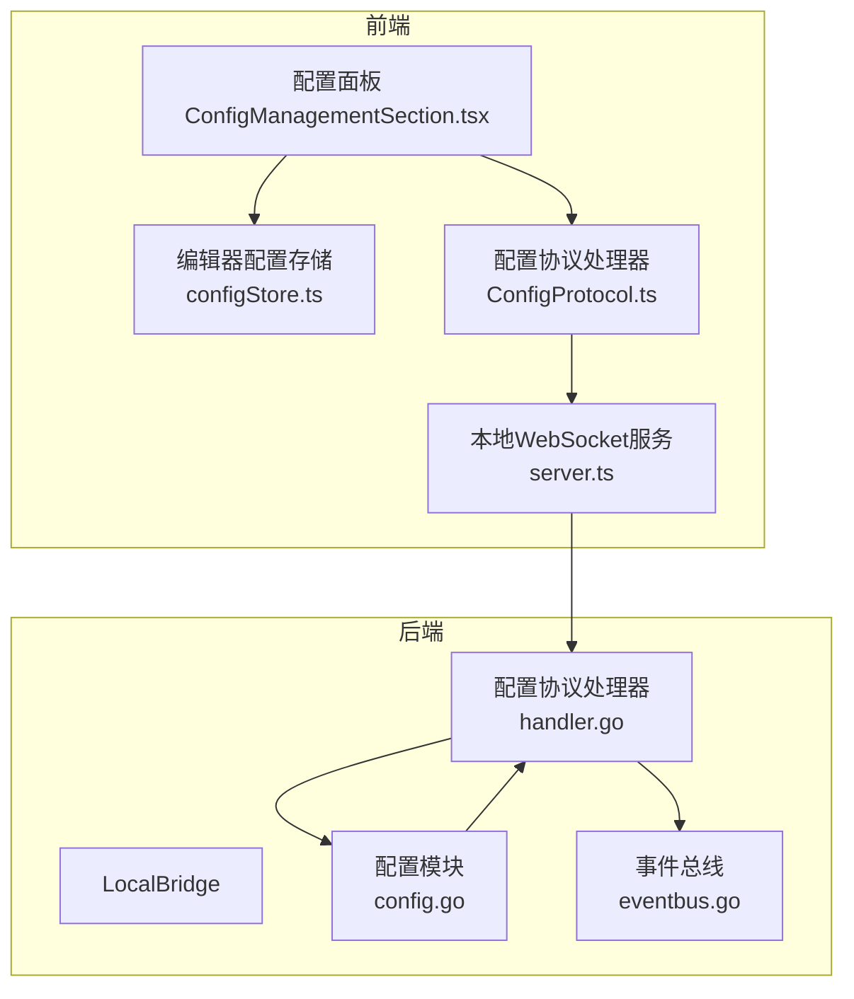
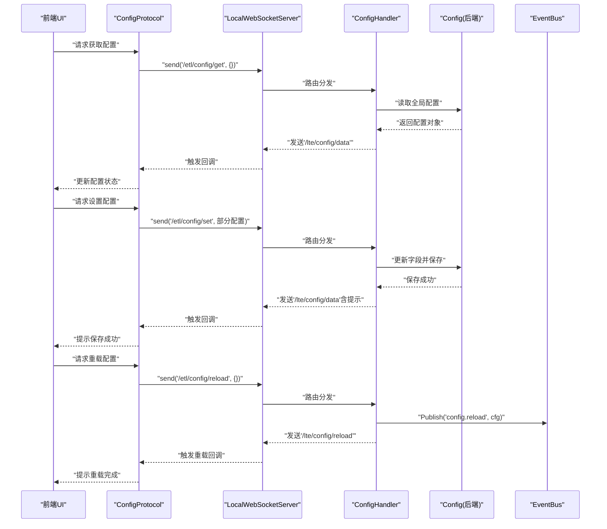
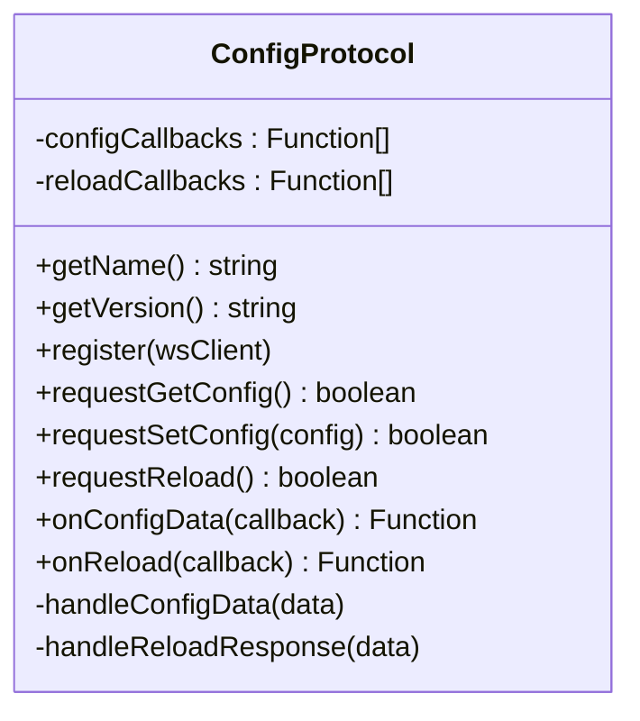
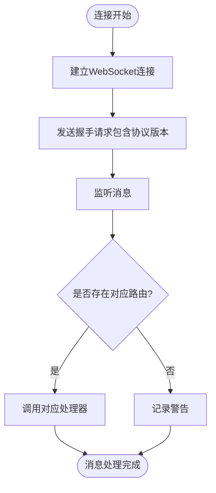
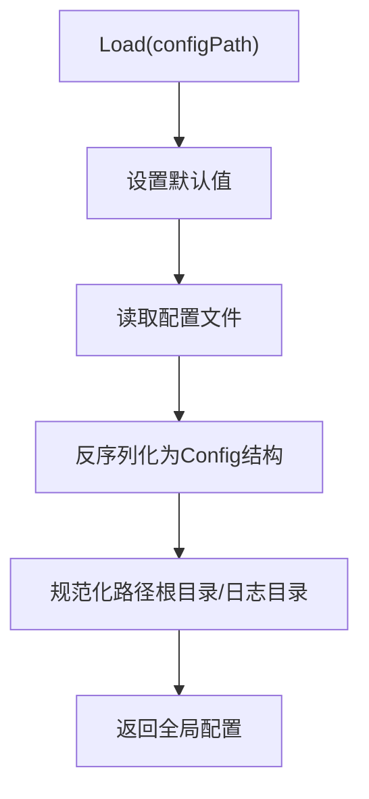
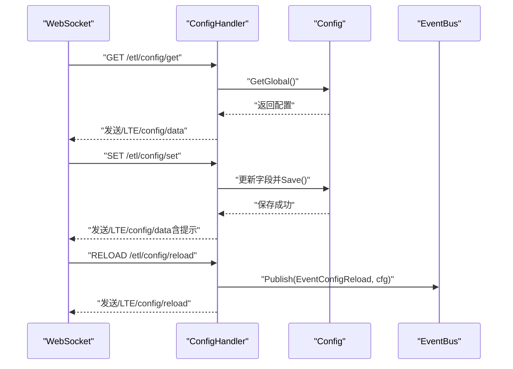
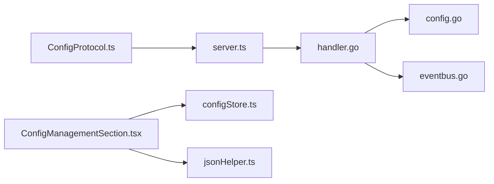

# 配置协议

<cite>
**本文引用的文件**
- [ConfigProtocol.ts](file://src/services/protocols/ConfigProtocol.ts)
- [server.ts](file://src/services/server.ts)
- [configStore.ts](file://src/stores/configStore.ts)
- [ConfigManagementSection.tsx](file://src/components/panels/config/ConfigManagementSection.tsx)
- [config.go](file://LocalBridge/internal/config/config.go)
- [handler.go](file://LocalBridge/internal/protocol/config/handler.go)
- [eventbus.go](file://LocalBridge/internal/eventbus/eventbus.go)
- [default.json（Extremer）](file://Extremer/config/default.json)
- [default.json（LocalBridge）](file://LocalBridge/config/default.json)
- [jsonHelper.ts](file://src/utils/jsonHelper.ts)
</cite>

## 目录
1. [简介](#简介)
2. [项目结构](#项目结构)
3. [核心组件](#核心组件)
4. [架构总览](#架构总览)
5. [详细组件分析](#详细组件分析)
6. [依赖关系分析](#依赖关系分析)
7. [性能考量](#性能考量)
8. [故障排查指南](#故障排查指南)
9. [结论](#结论)
10. [附录](#附录)

## 简介
本文件围绕“配置协议”展开，系统性阐述后端配置数据结构、读取/解析/验证/存储流程，以及前端配置面板与后端的双向绑定机制；同时覆盖配置变更通知、状态同步策略、热重载与版本兼容处理、备份恢复与导入导出实现细节。目标读者既包括需要快速上手的使用者，也包括希望深入理解实现细节的开发者。

## 项目结构
配置协议涉及前后端协同：
- 前端通过 WebSocket 与本地服务通信，使用统一的协议处理器进行配置读取、设置与重载。
- 后端以 Viper 作为配置读取与默认值注入引擎，结合事件总线实现配置变更广播。
- 前端提供配置导出/导入能力，并与编辑器运行态配置（非后端配置）协同工作。

图表来源
- [server.ts:1-373](file://src/services/server.ts#L1-L373)
- [ConfigProtocol.ts:1-197](file://src/services/protocols/ConfigProtocol.ts#L1-L197)
- [config.go:1-339](file://LocalBridge/internal/config/config.go#L1-L339)
- [handler.go:1-237](file://LocalBridge/internal/protocol/config/handler.go#L1-L237)
- [eventbus.go:1-83](file://LocalBridge/internal/eventbus/eventbus.go#L1-L83)

章节来源
- [server.ts:1-373](file://src/services/server.ts#L1-L373)
- [ConfigProtocol.ts:1-197](file://src/services/protocols/ConfigProtocol.ts#L1-L197)
- [config.go:1-339](file://LocalBridge/internal/config/config.go#L1-L339)
- [handler.go:1-237](file://LocalBridge/internal/protocol/config/handler.go#L1-L237)
- [eventbus.go:1-83](file://LocalBridge/internal/eventbus/eventbus.go#L1-L83)

## 核心组件
- 前端配置协议处理器：负责注册路由、发送/接收配置消息、回调管理与错误提示。
- 本地 WebSocket 服务：负责连接建立、握手、消息分发与连接状态管理。
- 后端配置模块：负责默认值注入、配置文件读取/解析、路径规范化、保存与安全检查。
- 后端配置协议处理器：负责路由分发、配置更新、持久化与重载事件发布。
- 事件总线：用于配置重载事件的广播，供后端各子系统同步状态。
- 前端配置存储与面板：负责编辑器运行态配置的持久化与导入导出。

章节来源
- [ConfigProtocol.ts:46-196](file://src/services/protocols/ConfigProtocol.ts#L46-L196)
- [server.ts:20-331](file://src/services/server.ts#L20-L331)
- [config.go:54-95](file://LocalBridge/internal/config/config.go#L54-L95)
- [handler.go:26-47](file://LocalBridge/internal/protocol/config/handler.go#L26-L47)
- [eventbus.go:66-82](file://LocalBridge/internal/eventbus/eventbus.go#L66-L82)
- [configStore.ts:163-267](file://src/stores/configStore.ts#L163-L267)

## 架构总览
配置协议采用“前端协议处理器 + 本地 WebSocket + 后端协议处理器 + 配置模块”的分层设计。前端通过统一的协议接口与后端交互，后端负责实际的配置读写与事件广播。

图表来源
- [ConfigProtocol.ts:128-161](file://src/services/protocols/ConfigProtocol.ts#L128-L161)
- [server.ts:166-179](file://src/services/server.ts#L166-L179)
- [handler.go:50-68](file://LocalBridge/internal/protocol/config/handler.go#L50-L68)
- [handler.go:70-171](file://LocalBridge/internal/protocol/config/handler.go#L70-L171)
- [handler.go:173-204](file://LocalBridge/internal/protocol/config/handler.go#L173-L204)
- [eventbus.go:38-51](file://LocalBridge/internal/eventbus/eventbus.go#L38-L51)

## 详细组件分析

### 前端配置协议处理器（ConfigProtocol）
- 负责注册两条后端推送路由：配置数据推送与重载响应。
- 提供请求获取/设置/重载配置的方法，封装消息发送。
- 维护两类回调数组，分别处理配置数据与重载事件，并提供注销函数。
- 对错误进行统一处理与用户提示。

图表来源
- [ConfigProtocol.ts:46-196](file://src/services/protocols/ConfigProtocol.ts#L46-L196)

章节来源
- [ConfigProtocol.ts:46-196](file://src/services/protocols/ConfigProtocol.ts#L46-L196)

### 本地WebSocket服务（LocalWebSocketServer）
- 负责连接生命周期管理、握手、消息分发与错误处理。
- 在握手阶段校验协议版本，避免前后端不兼容导致的异常行为。
- 提供统一的 send 接口与路由注册机制，供各协议处理器使用。

图表来源
- [server.ts:105-251](file://src/services/server.ts#L105-L251)
- [server.ts:268-283](file://src/services/server.ts#L268-L283)

章节来源
- [server.ts:20-331](file://src/services/server.ts#L20-L331)

### 后端配置模块（Config）
- 使用 Viper 读取配置文件并注入默认值。
- 提供路径规范化与相对路径转绝对路径的处理。
- 提供安全检查（高风险目录、驱动器根目录、扫描限制）。
- 提供保存配置到文件的能力。

图表来源
- [config.go:54-95](file://LocalBridge/internal/config/config.go#L54-L95)
- [config.go:126-153](file://LocalBridge/internal/config/config.go#L126-L153)

章节来源
- [config.go:54-95](file://LocalBridge/internal/config/config.go#L54-L95)
- [config.go:103-123](file://LocalBridge/internal/config/config.go#L103-L123)
- [config.go:126-153](file://LocalBridge/internal/config/config.go#L126-L153)
- [config.go:234-296](file://LocalBridge/internal/config/config.go#L234-L296)

### 后端配置协议处理器（ConfigHandler）
- 路由前缀统一为“/etl/config/”，支持 get、set、reload 三类消息。
- get：返回当前配置与配置文件路径。
- set：根据传入的增量配置更新字段，保存并返回最新配置，附带提示信息。
- reload：发布“config.reload”事件，通知后端各子系统重载配置。

图表来源
- [handler.go:26-47](file://LocalBridge/internal/protocol/config/handler.go#L26-L47)
- [handler.go:49-68](file://LocalBridge/internal/protocol/config/handler.go#L49-L68)
- [handler.go:70-171](file://LocalBridge/internal/protocol/config/handler.go#L70-L171)
- [handler.go:173-204](file://LocalBridge/internal/protocol/config/handler.go#L173-L204)
- [eventbus.go:74-82](file://LocalBridge/internal/eventbus/eventbus.go#L74-L82)

章节来源
- [handler.go:26-47](file://LocalBridge/internal/protocol/config/handler.go#L26-L47)
- [handler.go:49-68](file://LocalBridge/internal/protocol/config/handler.go#L49-L68)
- [handler.go:70-171](file://LocalBridge/internal/protocol/config/handler.go#L70-L171)
- [handler.go:173-204](file://LocalBridge/internal/protocol/config/handler.go#L173-L204)

### 配置数据结构与默认值
- 后端配置结构包含 server、file、log、maafw 四个域，字段涵盖端口、主机、根目录、排除列表、扩展名、最大深度/文件数、日志级别/目录/推送开关、MaaFW启用状态与库/资源目录。
- 默认值通过 Viper 注入，确保首次运行时具备合理配置。
- 前端配置存储包含编辑器运行态配置（如主题、面板布局、网络端口、自动重载等），与后端配置域不同，二者通过各自的协议与存储独立管理。

章节来源
- [ConfigProtocol.ts:8-40](file://src/services/protocols/ConfigProtocol.ts#L8-L40)
- [config.go:13-48](file://LocalBridge/internal/config/config.go#L13-L48)
- [config.go:103-123](file://LocalBridge/internal/config/config.go#L103-L123)
- [configStore.ts:95-144](file://src/stores/configStore.ts#L95-L144)

### 配置变更通知与状态同步
- 后端通过事件总线发布“config.reload”事件，供各子系统订阅并同步状态。
- 前端通过 ConfigProtocol 的 onReload 回调接收重载完成通知，用于刷新 UI 或触发后续动作。
- 前端编辑器配置变更通过 zustand 存储直接生效，必要时可导出/导入以保持一致性。

章节来源
- [eventbus.go:38-51](file://LocalBridge/internal/eventbus/eventbus.go#L38-L51)
- [handler.go:191-204](file://LocalBridge/internal/protocol/config/handler.go#L191-L204)
- [ConfigProtocol.ts:185-195](file://src/services/protocols/ConfigProtocol.ts#L185-L195)

### 前端配置面板与后端配置系统的双向绑定
- 前端通过 ConfigProtocol 请求后端配置并接收推送，实现“后端配置 -> 前端展示”的单向绑定。
- 前端通过 ConfigProtocol 的 requestSetConfig 将增量配置发送至后端，实现“前端修改 -> 后端持久化”的单向绑定。
- 前端编辑器配置（非后端配置）通过 configStore 管理，支持导出/导入，与后端配置解耦。

章节来源
- [ConfigProtocol.ts:128-161](file://src/services/protocols/ConfigProtocol.ts#L128-L161)
- [ConfigProtocol.ts:80-98](file://src/services/protocols/ConfigProtocol.ts#L80-L98)
- [configStore.ts:163-267](file://src/stores/configStore.ts#L163-L267)

### 配置热重载机制与版本兼容处理
- 热重载：后端在收到重载请求后，发布“config.reload”事件，订阅者自行拉取最新配置并更新内部状态。
- 版本兼容：前端在握手阶段携带协议版本，若与后端要求版本不一致，将拒绝连接并提示升级，避免因协议差异导致的异常。

章节来源
- [handler.go:173-204](file://LocalBridge/internal/protocol/config/handler.go#L173-L204)
- [eventbus.go:74-82](file://LocalBridge/internal/eventbus/eventbus.go#L74-L82)
- [server.ts:38-64](file://src/services/server.ts#L38-L64)

### 配置备份恢复与导入导出
- 导出：前端将可导出配置与自定义模板打包为 JSON，支持指定缩进并下载。
- 导入：前端解析 JSON，校验结构，合并到当前配置存储；同时尝试导入自定义模板。
- 注意：该流程针对“编辑器运行态配置”，与后端配置文件的导入/导出不同，后者由后端配置模块负责。

章节来源
- [ConfigManagementSection.tsx:28-58](file://src/components/panels/config/ConfigManagementSection.tsx#L28-L58)
- [ConfigManagementSection.tsx:60-102](file://src/components/panels/config/ConfigManagementSection.tsx#L60-L102)
- [configStore.ts:64-77](file://src/stores/configStore.ts#L64-L77)

### 配置校验规则与安全检查
- 路径合法性：后端对根目录与日志目录进行绝对路径规范化与存在性检查。
- 安全性检查：识别高风险目录（系统关键目录、驱动器根、用户主目录）、扫描深度/文件数限制缺失等风险项，并给出建议。
- 前端提示：后端保存配置成功后会携带提示信息，前端收到后进行用户提示。

章节来源
- [config.go:126-153](file://LocalBridge/internal/config/config.go#L126-L153)
- [config.go:234-296](file://LocalBridge/internal/config/config.go#L234-L296)
- [handler.go:161-171](file://LocalBridge/internal/protocol/config/handler.go#L161-L171)

## 依赖关系分析
- 前端依赖关系：ConfigProtocol 依赖 LocalWebSocketServer；LocalWebSocketServer 依赖系统路由与握手协议；配置面板依赖 zustand 存储与导入导出工具。
- 后端依赖关系：ConfigHandler 依赖 Config 模块与事件总线；Config 模块依赖 Viper 与路径工具；默认配置来自各自模块的默认文件。

图表来源
- [ConfigProtocol.ts:1-197](file://src/services/protocols/ConfigProtocol.ts#L1-L197)
- [server.ts:1-373](file://src/services/server.ts#L1-L373)
- [handler.go:1-237](file://LocalBridge/internal/protocol/config/handler.go#L1-L237)
- [config.go:1-339](file://LocalBridge/internal/config/config.go#L1-L339)
- [eventbus.go:1-83](file://LocalBridge/internal/eventbus/eventbus.go#L1-L83)
- [ConfigManagementSection.tsx:1-138](file://src/components/panels/config/ConfigManagementSection.tsx#L1-L138)
- [configStore.ts:1-268](file://src/stores/configStore.ts#L1-L268)
- [jsonHelper.ts:1-28](file://src/utils/jsonHelper.ts#L1-L28)

章节来源
- [ConfigProtocol.ts:1-197](file://src/services/protocols/ConfigProtocol.ts#L1-L197)
- [server.ts:1-373](file://src/services/server.ts#L1-L373)
- [handler.go:1-237](file://LocalBridge/internal/protocol/config/handler.go#L1-L237)
- [config.go:1-339](file://LocalBridge/internal/config/config.go#L1-L339)
- [eventbus.go:1-83](file://LocalBridge/internal/eventbus/eventbus.go#L1-L83)
- [ConfigManagementSection.tsx:1-138](file://src/components/panels/config/ConfigManagementSection.tsx#L1-L138)
- [configStore.ts:1-268](file://src/stores/configStore.ts#L1-L268)
- [jsonHelper.ts:1-28](file://src/utils/jsonHelper.ts#L1-L28)

## 性能考量
- 配置读取：Viper 读取与反序列化为 O(n) 操作，n 为配置键数量；建议避免频繁重载。
- 路径规范化：仅在必要时进行绝对路径转换与存在性检查，减少 IO。
- 事件广播：事件总线为同步发布，订阅者应避免在回调中执行阻塞操作。
- 前端渲染：编辑器配置变更通过 zustand 精准更新，避免全量重渲染。

## 故障排查指南
- 连接失败/超时：检查本地服务是否启动、端口是否正确、防火墙设置。
- 协议版本不匹配：前端与后端协议版本需一致，否则握手失败。
- 配置保存失败：检查配置文件路径权限、磁盘空间与写入权限。
- 配置重载无效：确认订阅者是否正确处理“config.reload”事件并拉取最新配置。
- 导入失败：确认 JSON 结构合法且包含 configs 字段；自定义模板导入失败不影响基础配置导入。

章节来源
- [server.ts:105-251](file://src/services/server.ts#L105-L251)
- [server.ts:38-64](file://src/services/server.ts#L38-L64)
- [handler.go:152-157](file://LocalBridge/internal/protocol/config/handler.go#L152-L157)
- [handler.go:191-204](file://LocalBridge/internal/protocol/config/handler.go#L191-L204)
- [ConfigManagementSection.tsx:69-102](file://src/components/panels/config/ConfigManagementSection.tsx#L69-L102)

## 结论
配置协议通过前后端清晰的职责划分与统一的协议接口，实现了配置的读取、设置、重载与事件广播。后端以 Viper 为核心保障配置的可靠性与可维护性，前端通过协议处理器与存储实现直观的配置管理体验。配合热重载与版本兼容机制，系统在功能与稳定性之间取得良好平衡。

## 附录
- 默认配置参考
  - [default.json（Extremer）:1-34](file://Extremer/config/default.json#L1-L34)
  - [default.json（LocalBridge）:1-29](file://LocalBridge/config/default.json#L1-L29)
- JSON 工具
  - [jsonHelper.ts:1-28](file://src/utils/jsonHelper.ts#L1-L28)