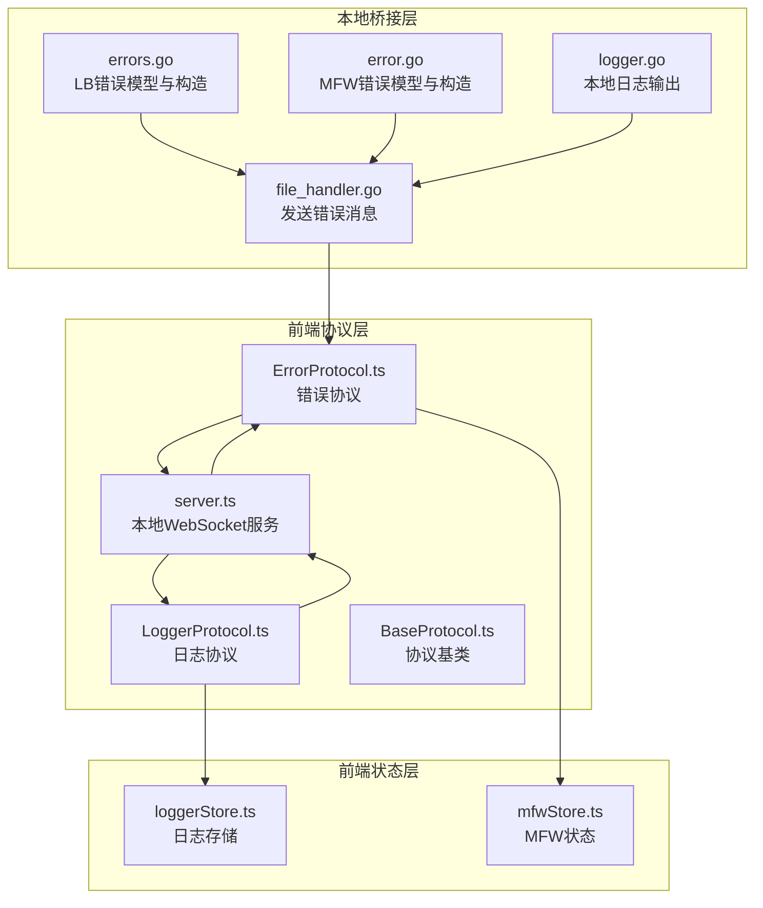
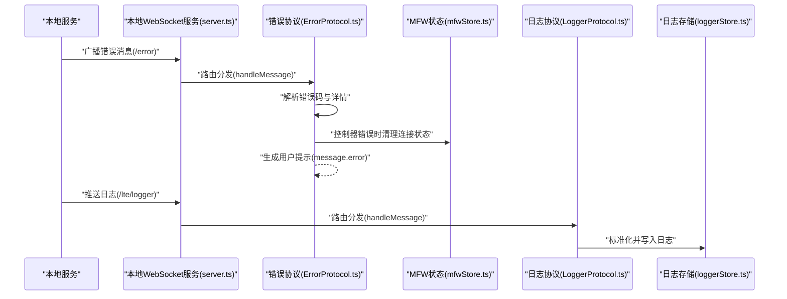
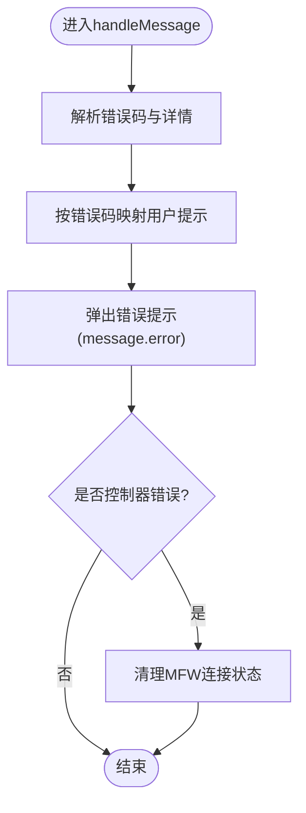
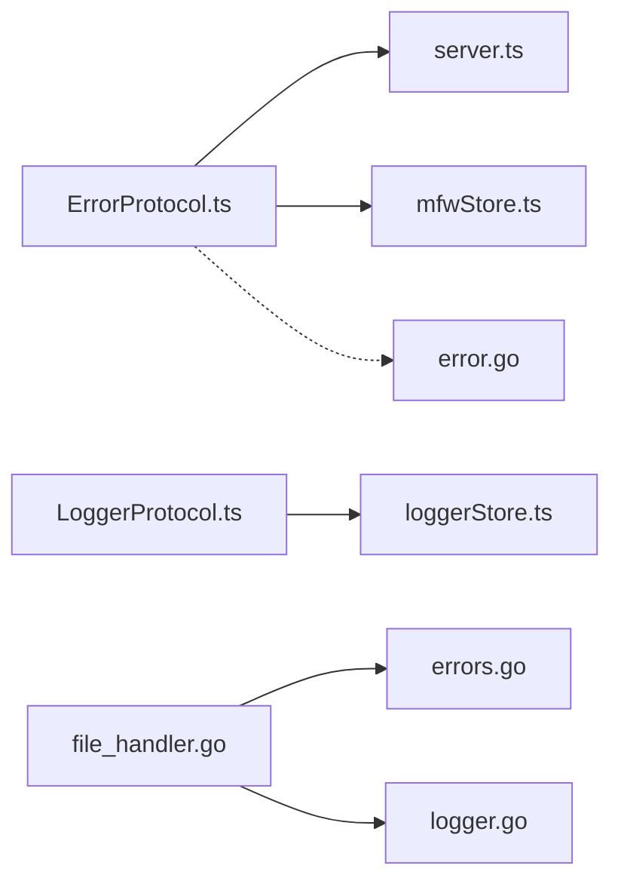

# 错误协议

<cite>
**本文档引用的文件**
- [ErrorProtocol.ts](file://src/services/protocols/ErrorProtocol.ts)
- [BaseProtocol.ts](file://src/services/protocols/BaseProtocol.ts)
- [server.ts](file://src/services/server.ts)
- [errors.go](file://LocalBridge/internal/errors/errors.go)
- [error.go](file://LocalBridge/internal/mfw/error.go)
- [loggerStore.ts](file://src/stores/loggerStore.ts)
- [logger.go](file://LocalBridge/internal/logger/logger.go)
- [file_handler.go](file://LocalBridge/internal/protocol/file/file_handler.go)
- [MFWProtocol.ts](file://src/services/protocols/MFWProtocol.ts)
- [mfwStore.ts](file://src/stores/mfwStore.ts)
- [LoggerProtocol.ts](file://src/services/protocols/LoggerProtocol.ts)
</cite>

## 目录
1. [简介](#简介)
2. [项目结构](#项目结构)
3. [核心组件](#核心组件)
4. [架构总览](#架构总览)
5. [详细组件分析](#详细组件分析)
6. [依赖关系分析](#依赖关系分析)
7. [性能考量](#性能考量)
8. [故障排查指南](#故障排查指南)
9. [结论](#结论)
10. [附录](#附录)

## 简介
本文件围绕“错误协议”展开，系统性阐述错误处理机制与实现原理，覆盖错误分类、错误码定义、错误信息格式化、错误传播与恢复、错误上报、全局错误处理器、错误状态管理、错误日志记录与查询、错误通知与用户提示策略，以及错误统计分析与故障预警的实现思路。目标是帮助开发者与使用者全面理解错误体系的设计与落地。

## 项目结构
错误协议位于前端协议层，负责统一接收来自本地服务的错误消息，并进行用户可见的提示与状态联动；同时配合日志协议与本地桥接错误模型，形成完整的错误闭环。

**图表来源**
- [ErrorProtocol.ts:1-68](file://src/services/protocols/ErrorProtocol.ts#L1-L68)
- [LoggerProtocol.ts:1-58](file://src/services/protocols/LoggerProtocol.ts#L1-L58)
- [server.ts:1-373](file://src/services/server.ts#L1-L373)
- [BaseProtocol.ts:1-40](file://src/services/protocols/BaseProtocol.ts#L1-L40)
- [loggerStore.ts:1-46](file://src/stores/loggerStore.ts#L1-L46)
- [mfwStore.ts:1-158](file://src/stores/mfwStore.ts#L1-L158)
- [errors.go:1-141](file://LocalBridge/internal/errors/errors.go#L1-L141)
- [error.go:1-53](file://LocalBridge/internal/mfw/error.go#L1-L53)
- [file_handler.go:291-327](file://LocalBridge/internal/protocol/file/file_handler.go#L291-L327)
- [logger.go:1-200](file://LocalBridge/internal/logger/logger.go#L1-L200)

**章节来源**
- [ErrorProtocol.ts:1-68](file://src/services/protocols/ErrorProtocol.ts#L1-L68)
- [server.ts:348-373](file://src/services/server.ts#L348-L373)

## 核心组件
- 错误协议(ErrorProtocol)
  - 负责注册"/error"路由，解析错误码与详情，进行用户提示与状态联动。
  - 对特定MFW控制器错误触发状态清理，避免后续误判。
- 协议基类(BaseProtocol)
  - 定义协议的抽象接口：getName、getVersion、register、unregister、handleMessage。
- 本地WebSocket服务(server.ts)
  - 统一连接、握手、消息分发与错误上报；初始化时注册错误协议。
- 本地桥接错误模型(errors.go)
  - 定义通用错误码与LBError结构，提供构造、包装、转为ErrorData等能力。
- MFW错误模型(error.go)
  - 定义MFW错误码与MFWError结构，便于跨语言传递一致的错误载体。
- 日志协议(LoggerProtocol)与日志存储(loggerStore.ts)
  - 接收后端日志推送，标准化级别并写入前端日志存储，支持查询与展示。
- MFW状态(mfwStore.ts)
  - 维护控制器连接状态、设备信息与错误提示，供错误协议联动清理。

**章节来源**
- [ErrorProtocol.ts:10-66](file://src/services/protocols/ErrorProtocol.ts#L10-L66)
- [BaseProtocol.ts:7-39](file://src/services/protocols/BaseProtocol.ts#L7-L39)
- [server.ts:335-373](file://src/services/server.ts#L335-L373)
- [errors.go:9-74](file://LocalBridge/internal/errors/errors.go#L9-L74)
- [error.go:5-53](file://LocalBridge/internal/mfw/error.go#L5-L53)
- [LoggerProtocol.ts:16-57](file://src/services/protocols/LoggerProtocol.ts#L16-L57)
- [loggerStore.ts:21-45](file://src/stores/loggerStore.ts#L21-L45)
- [mfwStore.ts:102-157](file://src/stores/mfwStore.ts#L102-L157)

## 架构总览
错误协议的端到端流程如下：本地服务通过WebSocket向前端广播错误消息；前端错误协议解析并根据错误码生成用户提示；对部分控制器错误自动清理连接状态；同时日志协议接收并持久化日志，形成可观测性闭环。

**图表来源**
- [server.ts:166-180](file://src/services/server.ts#L166-L180)
- [ErrorProtocol.ts:26-66](file://src/services/protocols/ErrorProtocol.ts#L26-L66)
- [mfwStore.ts:148-156](file://src/stores/mfwStore.ts#L148-L156)
- [LoggerProtocol.ts:32-56](file://src/services/protocols/LoggerProtocol.ts#L32-L56)
- [loggerStore.ts:26-38](file://src/stores/loggerStore.ts#L26-L38)

## 详细组件分析

### 错误协议(ErrorProtocol)
- 路由注册与消息入口
  - 在构造时注册"/error"路由，交由handleMessage统一处理。
- 错误分类与提示映射
  - 针对文件类与MFW类错误码，提供中文提示模板；优先使用detail中的字符串内容，否则回退到message字段。
- 用户提示与状态联动
  - 使用UI库的消息组件弹出错误提示；对控制器相关错误触发mfwStore.clearConnection，清空连接状态。
- 错误传播与恢复
  - 通过统一路由对外暴露，确保所有错误以一致格式到达前端；控制器错误触发状态清理，有助于后续重连与恢复。

**图表来源**
- [ErrorProtocol.ts:26-66](file://src/services/protocols/ErrorProtocol.ts#L26-L66)
- [mfwStore.ts:148-156](file://src/stores/mfwStore.ts#L148-L156)

**章节来源**
- [ErrorProtocol.ts:19-66](file://src/services/protocols/ErrorProtocol.ts#L19-L66)

### 协议基类(BaseProtocol)
- 抽象职责
  - 定义协议名称、版本、路由注册与注销、消息处理入口等规范，保证各协议行为一致性。
- 与WebSocket服务协作
  - 通过wsClient注册路由，由server.ts集中分发消息。

**章节来源**
- [BaseProtocol.ts:7-39](file://src/services/protocols/BaseProtocol.ts#L7-L39)
- [server.ts:93-102](file://src/services/server.ts#L93-L102)

### 本地WebSocket服务(server.ts)
- 连接与握手
  - 负责建立WebSocket连接、发送握手请求、处理握手响应与超时。
- 路由分发
  - 将收到的消息按path分发给已注册的协议处理器；对未知路由发出告警。
- 错误上报与用户提示
  - 对连接失败、超时等场景弹出通知；对协议版本不匹配给出明确提示。

**章节来源**
- [server.ts:104-251](file://src/services/server.ts#L104-L251)
- [server.ts:348-373](file://src/services/server.ts#L348-L373)

### 本地桥接错误模型(errors.go)
- 错误码定义
  - 统一的通用错误码集合，涵盖文件、请求、内部错误等类别。
- 错误结构与转换
  - LBError包含Code、Message、Detail、Err字段；提供New、Wrap、WithDetail与ToErrorData等方法，便于跨层传递与序列化。
- 文件协议中的使用
  - 文件协议在解析失败时构造LBError并通过sendError广播至前端。

**章节来源**
- [errors.go:9-74](file://LocalBridge/internal/errors/errors.go#L9-L74)
- [file_handler.go:303-327](file://LocalBridge/internal/protocol/file/file_handler.go#L303-L327)

### MFW错误模型(error.go)
- 错误码与结构
  - 定义MFW相关错误码集合与MFWError结构，便于本地服务向前端传递一致的错误载体。
- 与前端联动
  - 前端错误协议对MFW错误码进行友好提示；MFW协议在控制器状态异常时联动清理状态。

**章节来源**
- [error.go:5-53](file://LocalBridge/internal/mfw/error.go#L5-L53)
- [ErrorProtocol.ts:38-50](file://src/services/protocols/ErrorProtocol.ts#L38-L50)
- [MFWProtocol.ts:191-205](file://src/services/protocols/MFWProtocol.ts#L191-L205)

### 日志协议与日志存储(LoggerProtocol.ts 与 loggerStore.ts)
- 日志接收与标准化
  - LoggerProtocol接收/lte/logger消息，标准化level为INFO/WARN/ERROR，补充module、message、timestamp。
- 存储与容量控制
  - loggerStore维护固定容量的日志队列，超过上限时仅保留最近记录，支持展开/收起与清空。
- 与错误协议的协同
  - 错误发生时既弹出提示，也写入日志，便于后续查询与分析。

**章节来源**
- [LoggerProtocol.ts:25-56](file://src/services/protocols/LoggerProtocol.ts#L25-L56)
- [loggerStore.ts:21-45](file://src/stores/loggerStore.ts#L21-L45)

### MFW状态管理(mfwStore.ts)
- 状态字段
  - connectionStatus、controllerType、controllerId、deviceInfo、errorMessage等。
- 行为方法
  - setConnectionStatus、setControllerInfo、updateAdbDevices、updateWin32Windows、setErrorMessage、clearConnection等。
- 与错误协议联动
  - 错误协议在检测到控制器相关错误时调用clearConnection，使状态回到断开，避免误导性提示。

**章节来源**
- [mfwStore.ts:102-157](file://src/stores/mfwStore.ts#L102-L157)
- [ErrorProtocol.ts:63-65](file://src/services/protocols/ErrorProtocol.ts#L63-L65)

## 依赖关系分析
- 前端协议层依赖
  - ErrorProtocol依赖server.ts提供的路由注册与消息分发；依赖mfwStore进行状态联动。
  - LoggerProtocol依赖loggerStore进行日志持久化。
- 本地桥接层依赖
  - file_handler.go依赖errors.go构造LBError并通过WebSocket发送；依赖logger.go进行本地日志输出。
- 错误码与模型
  - 通用错误码与MFW错误码分别定义于errors.go与error.go，确保前后端一致的错误载体。

**图表来源**
- [ErrorProtocol.ts:19-24](file://src/services/protocols/ErrorProtocol.ts#L19-L24)
- [server.ts:93-102](file://src/services/server.ts#L93-L102)
- [LoggerProtocol.ts:25-30](file://src/services/protocols/LoggerProtocol.ts#L25-L30)
- [loggerStore.ts:21-29](file://src/stores/loggerStore.ts#L21-L29)
- [file_handler.go:317-327](file://LocalBridge/internal/protocol/file/file_handler.go#L317-L327)
- [errors.go:44-50](file://LocalBridge/internal/errors/errors.go#L44-L50)
- [logger.go:1-200](file://LocalBridge/internal/logger/logger.go#L1-L200)
- [error.go:34-52](file://LocalBridge/internal/mfw/error.go#L34-L52)

**章节来源**
- [server.ts:348-373](file://src/services/server.ts#L348-L373)
- [file_handler.go:303-327](file://LocalBridge/internal/protocol/file/file_handler.go#L303-L327)

## 性能考量
- 错误消息处理
  - 错误协议仅做轻量映射与提示，避免复杂计算；控制器错误清理为同步状态变更，影响面有限。
- 日志存储
  - loggerStore采用固定容量队列，超出上限丢弃最旧条目，降低内存压力。
- WebSocket分发
  - server.ts按path分发，未命中路由仅告警不阻塞，保障整体吞吐。

[本节为通用指导，无需列出具体文件来源]

## 故障排查指南
- 无法收到错误提示
  - 检查server.ts是否正确注册错误协议；确认"/error"路由是否被调用。
  - 确认前端是否处于连接状态且握手已完成。
- 提示内容不符合预期
  - 检查错误码是否在错误映射表中；若缺失，将回退到message或默认提示。
- 控制器错误后仍显示连接
  - 确认错误协议是否正确调用mfwStore.clearConnection；检查MFW协议是否在状态异常时清理。
- 日志未显示
  - 检查"/lte/logger"路由是否被注册；确认LoggerProtocol是否正确解析level与时间戳。

**章节来源**
- [server.ts:348-373](file://src/services/server.ts#L348-L373)
- [ErrorProtocol.ts:57-66](file://src/services/protocols/ErrorProtocol.ts#L57-L66)
- [LoggerProtocol.ts:32-56](file://src/services/protocols/LoggerProtocol.ts#L32-L56)

## 结论
错误协议通过统一的错误码与消息格式，实现了从前端到后端的一致性错误体验；结合日志协议与状态管理，形成了可观测、可恢复、可提示的完整闭环。未来可在现有基础上扩展错误统计与趋势分析能力，以支撑更高级别的故障预警与运维决策。

[本节为总结性内容，无需列出具体文件来源]

## 附录

### 错误分类与错误码定义
- 通用错误码(本地桥接)
  - 文件类：FILE_NOT_FOUND、FILE_READ_ERROR、FILE_WRITE_ERROR、FILE_NAME_CONFLICT、INVALID_JSON、PERMISSION_DENIED
  - 通用类：INVALID_REQUEST、CONNECTION_FAILED、INTERNAL_ERROR
- MFW错误码(本地服务)
  - 控制器类：MFW_CONTROLLER_CREATE_FAIL、MFW_CONTROLLER_NOT_FOUND、MFW_CONTROLLER_CONNECT_FAIL、MFW_CONTROLLER_NOT_CONNECTED
  - 资源类：MFW_OCR_RESOURCE_NOT_CONFIGURED、MFW_RESOURCE_LOAD_FAILED
  - 其他：MFW_NOT_INITIALIZED、MFW_DEVICE_NOT_FOUND、MFW_CONNECTION_FAILED、MFW_SCREENCAP_FAILED、MFW_OPERATION_FAILED/FAIL、MFW_TASK_SUBMIT_FAILED、MFW_INVALID_PARAMETER

**章节来源**
- [errors.go:10-20](file://LocalBridge/internal/errors/errors.go#L10-L20)
- [error.go:6-21](file://LocalBridge/internal/mfw/error.go#L6-L21)

### 错误信息格式化
- 错误载体
  - 通用：包含code、message、detail
  - MFW：包含code、message、detail(map)
- 前端映射
  - 根据错误码选择预设提示；对MFW错误优先使用detail中的字符串，否则回退message

**章节来源**
- [errors.go:44-50](file://LocalBridge/internal/errors/errors.go#L44-L50)
- [error.go:34-52](file://LocalBridge/internal/mfw/error.go#L34-L52)
- [ErrorProtocol.ts:29-55](file://src/services/protocols/ErrorProtocol.ts#L29-L55)

### 错误传播与恢复
- 传播路径
  - 本地服务 -> WebSocket -> server.ts -> 错误协议 -> 用户提示/状态联动
- 恢复策略
  - 控制器错误触发状态清理，引导用户重新连接
  - 日志持久化便于事后分析与定位

**章节来源**
- [file_handler.go:317-327](file://LocalBridge/internal/protocol/file/file_handler.go#L317-L327)
- [ErrorProtocol.ts:57-66](file://src/services/protocols/ErrorProtocol.ts#L57-L66)
- [MFWProtocol.ts:191-205](file://src/services/protocols/MFWProtocol.ts#L191-L205)

### 全局错误处理器与错误状态管理
- 全局处理器
  - server.ts作为WebSocket服务的全局入口，负责握手、连接状态与消息分发
- 状态管理
  - mfwStore维护控制器连接状态与错误提示；错误协议在必要时调用清理方法

**章节来源**
- [server.ts:20-35](file://src/services/server.ts#L20-L35)
- [mfwStore.ts:102-157](file://src/stores/mfwStore.ts#L102-L157)

### 错误日志的记录、存储与查询
- 记录
  - LoggerProtocol接收/lte/logger消息并标准化
- 存储
  - loggerStore以固定容量队列保存日志，支持展开/收起/清空
- 查询
  - 前端日志面板基于loggerStore渲染与过滤

**章节来源**
- [LoggerProtocol.ts:32-56](file://src/services/protocols/LoggerProtocol.ts#L32-L56)
- [loggerStore.ts:21-45](file://src/stores/loggerStore.ts#L21-L45)

### 错误通知机制与用户友好提示策略
- 通知方式
  - 错误协议使用UI消息组件弹出错误提示；server.ts在连接失败/超时时使用通知组件
- 提示策略
  - 优先使用错误码映射的中文提示；对MFW错误优先展示detail中的字符串

**章节来源**
- [ErrorProtocol.ts:54-55](file://src/services/protocols/ErrorProtocol.ts#L54-L55)
- [server.ts:131-152](file://src/services/server.ts#L131-L152)

### 错误统计分析、趋势预测与故障预警
- 统计分析
  - 基于loggerStore中的日志条目，可按错误码、模块、时间维度进行聚合统计
- 趋势预测
  - 建议按小时/天粒度统计错误频次，观察峰值与波动趋势
- 故障预警
  - 当某类错误出现异常增长或持续高发时，触发阈值告警并联动通知

[本节为概念性建议，无需列出具体文件来源]