# 避让路由工具

<cite>
**本文档引用的文件**
- [avoidanceUtils.ts](file://src/core/avoidanceUtils.ts)
- [edges.tsx](file://src/components/flow/edges.tsx)
- [Flow.tsx](file://src/components/Flow.tsx)
- [snapUtils.ts](file://src/core/snapUtils.ts)
- [configStore.ts](file://src/stores/configStore.ts)
- [graphSlice.ts](file://src/stores/flow/slices/graphSlice.ts)
- [nodeOperations.tsx](file://src/components/flow/nodes/utils/nodeOperations.tsx)
- [layout.ts](file://src/core/layout.ts)
- [GroupNode.tsx](file://src/components/flow/nodes/GroupNode.tsx)
- [constants.ts](file://src/components/flow/nodes/constants.ts)
- [types.ts](file://src/stores/flow/types.ts)
</cite>

## 更新摘要
**变更内容**
- 修复了分组内边避让模式行为异常的问题
- 在edges.tsx中新增Group节点避让计算过滤逻辑
- 增强avoidanceUtils.ts中分组内子节点坐标转换逻辑
- 改进了相对定位子节点的避让算法处理
- 修复了嵌套组结构坐标转换问题
- 改进了组节点避让计算过滤逻辑

## 目录
1. [简介](#简介)
2. [项目结构](#项目结构)
3. [核心组件](#核心组件)
4. [架构概览](#架构概览)
5. [详细组件分析](#详细组件分析)
6. [分组内避让功能增强](#分组内避让功能增强)
7. [依赖关系分析](#依赖关系分析)
8. [性能考虑](#性能考虑)
9. [故障排除指南](#故障排除指南)
10. [结论](#结论)

## 简介

避让路由工具是 MAA Pipeline Editor 中的一个重要功能模块，专门用于解决流程图中节点连接线相互遮挡的问题。该工具通过智能的路径规划算法，确保节点之间的连接线能够优雅地避开其他节点，提供清晰美观的视觉效果。

**更新** 本次更新重点修复了分组内边避让模式的行为异常问题，确保分组节点不会干扰避让算法的正常计算，同时增强了对分组内相对定位子节点的坐标转换处理，并修复了嵌套组结构的坐标转换问题。

该工具主要包含两个核心功能：
- **边避让算法**：智能计算连接线路径，避免与其他节点发生冲突
- **节点磁吸对齐**：提供节点拖拽时的磁吸对齐功能，提升用户体验

## 项目结构

避让路由工具在整个项目中的组织结构如下：

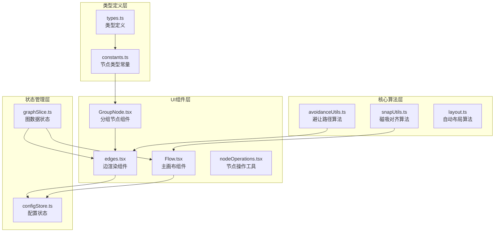

**图表来源**
- [avoidanceUtils.ts:1-790](file://src/core/avoidanceUtils.ts#L1-L790)
- [edges.tsx:1-706](file://src/components/flow/edges.tsx#L1-L706)
- [Flow.tsx:300-499](file://src/components/Flow.tsx#L300-L499)
- [GroupNode.tsx:1-173](file://src/components/flow/nodes/GroupNode.tsx#L1-L173)
- [constants.ts:1-47](file://src/components/flow/nodes/constants.ts#L1-L47)
- [types.ts:1-437](file://src/stores/flow/types.ts#L1-L437)

**章节来源**
- [avoidanceUtils.ts:1-790](file://src/core/avoidanceUtils.ts#L1-L790)
- [edges.tsx:1-706](file://src/components/flow/edges.tsx#L1-L706)
- [Flow.tsx:300-499](file://src/components/Flow.tsx#L300-L499)
- [GroupNode.tsx:1-173](file://src/components/flow/nodes/GroupNode.tsx#L1-L173)
- [constants.ts:1-47](file://src/components/flow/nodes/constants.ts#L1-L47)
- [types.ts:1-437](file://src/stores/flow/types.ts#L1-L437)

## 核心组件

### 避让路径算法核心类

避让路径算法是整个工具的核心，提供了完整的路径规划解决方案：

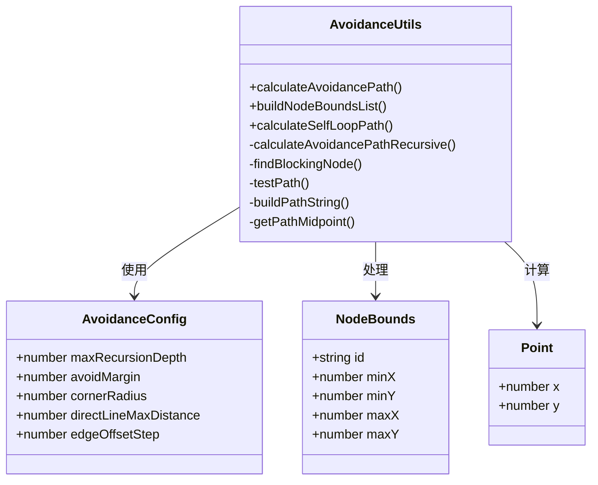

**图表来源**
- [avoidanceUtils.ts:19-35](file://src/core/avoidanceUtils.ts#L19-L35)
- [avoidanceUtils.ts:10-17](file://src/core/avoidanceUtils.ts#L10-L17)
- [avoidanceUtils.ts:7-8](file://src/core/avoidanceUtils.ts#L7-L8)

### 边渲染组件

边渲染组件负责将计算出的避让路径应用到实际的图形界面中：

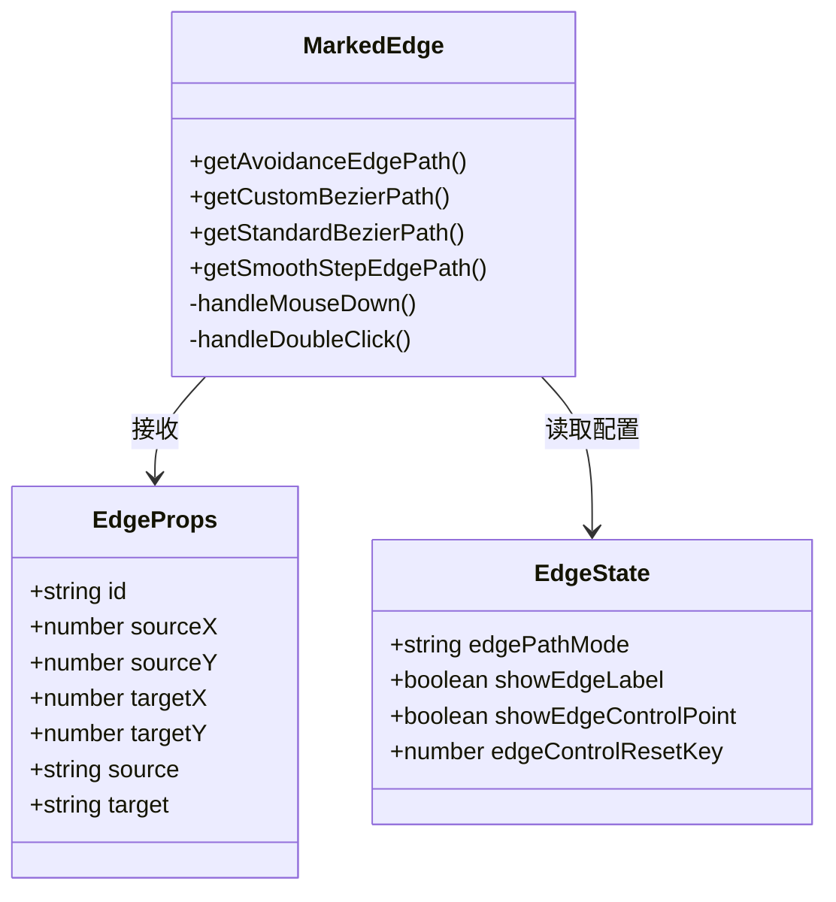

**图表来源**
- [edges.tsx:22-38](file://src/components/flow/edges.tsx#L22-L38)
- [edges.tsx:296-706](file://src/components/flow/edges.tsx#L296-L706)

**章节来源**
- [avoidanceUtils.ts:689-790](file://src/core/avoidanceUtils.ts#L689-L790)
- [edges.tsx:241-294](file://src/components/flow/edges.tsx#L241-L294)

## 架构概览

避让路由工具采用分层架构设计，各层职责明确，耦合度低：

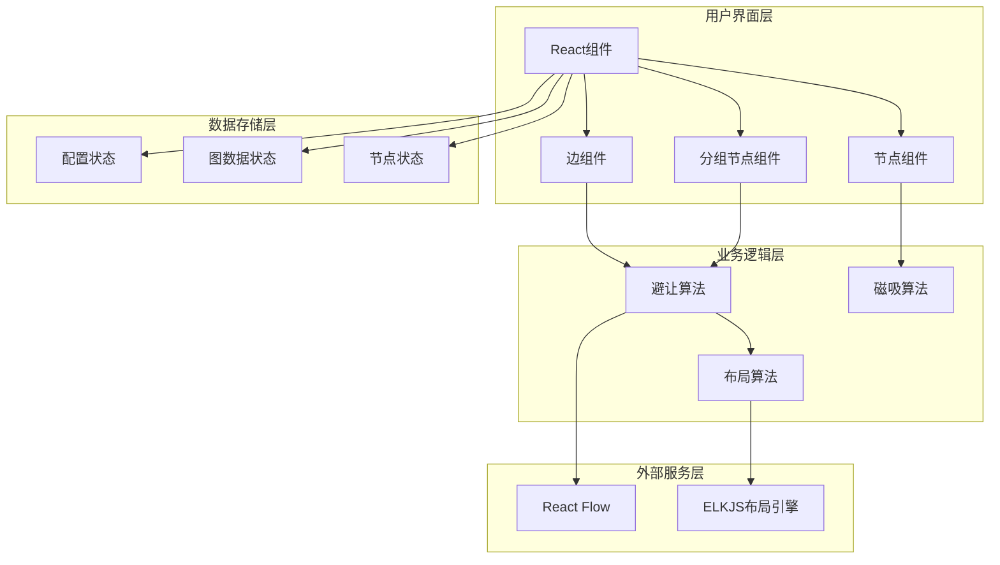

**图表来源**
- [edges.tsx:1-706](file://src/components/flow/edges.tsx#L1-L706)
- [avoidanceUtils.ts:1-790](file://src/core/avoidanceUtils.ts#L1-L790)
- [layout.ts:39-142](file://src/core/layout.ts#L39-L142)
- [GroupNode.tsx:1-173](file://src/components/flow/nodes/GroupNode.tsx#L1-L173)

## 详细组件分析

### 避让路径算法实现

避让路径算法是整个系统的核心，实现了复杂的几何计算和路径优化：

#### 核心算法流程

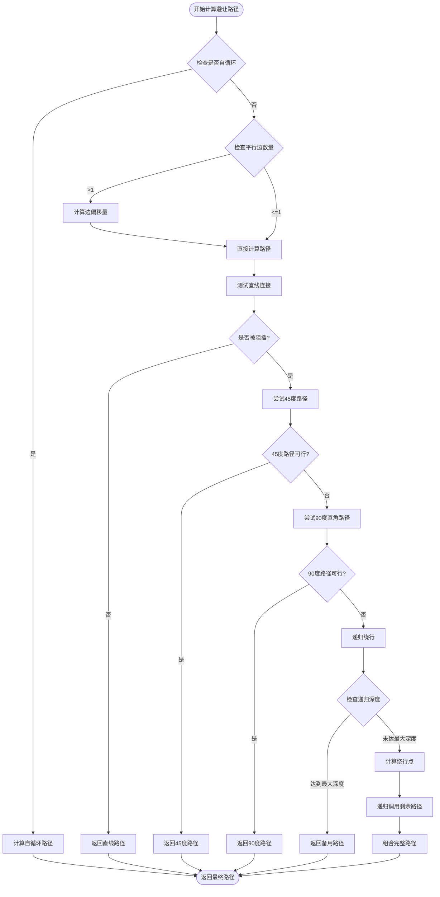

**图表来源**
- [avoidanceUtils.ts:379-576](file://src/core/avoidanceUtils.ts#L379-L576)

#### 几何计算核心

算法使用了多种几何计算技术：

1. **线段相交检测**：使用向量叉积法判断线段是否相交
2. **矩形碰撞检测**：基于包围盒检测和精确碰撞检测
3. **路径优化**：计算最短绕行路径，避免重复绕行同一节点

**章节来源**
- [avoidanceUtils.ts:379-576](file://src/core/avoidanceUtils.ts#L379-L576)
- [avoidanceUtils.ts:150-192](file://src/core/avoidanceUtils.ts#L150-L192)

### 边渲染组件实现

边渲染组件负责将避让算法计算出的路径应用到实际的图形界面中：

#### 路径模式切换机制

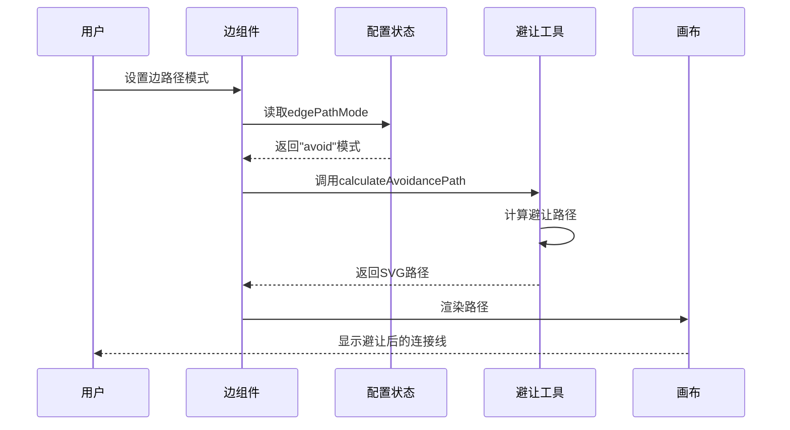

**图表来源**
- [edges.tsx:362-427](file://src/components/flow/edges.tsx#L362-L427)

#### 控制点拖拽功能

边组件还提供了贝塞尔曲线控制点的拖拽功能：

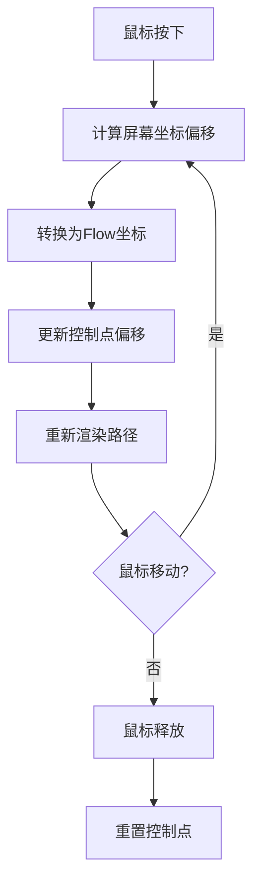

**图表来源**
- [edges.tsx:442-484](file://src/components/flow/edges.tsx#L442-L484)

**章节来源**
- [edges.tsx:241-294](file://src/components/flow/edges.tsx#L241-L294)
- [edges.tsx:362-427](file://src/components/flow/edges.tsx#L362-L427)

### 节点磁吸对齐算法

节点磁吸对齐算法提供了直观的节点拖拽体验：

#### 磁吸对齐计算流程

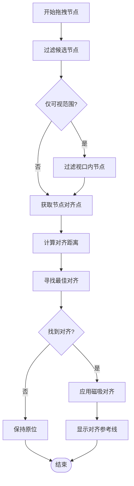

**图表来源**
- [snapUtils.ts:100-161](file://src/core/snapUtils.ts#L100-L161)

**章节来源**
- [snapUtils.ts:38-78](file://src/core/snapUtils.ts#L38-L78)
- [snapUtils.ts:100-161](file://src/core/snapUtils.ts#L100-L161)

### 自动布局算法

自动布局算法基于 ELKJS 引擎，提供了专业的图布局功能：

#### 布局配置参数

| 参数名称 | 默认值 | 说明 |
|---------|--------|------|
| elk.algorithm | "layered" | 分层布局算法 |
| elk.direction | "RIGHT" | 布局方向从左到右 |
| elk.layered.spacing.nodeNodeBetweenLayers | "100" | 层间节点间距 |
| elk.spacing.nodeNode | "80" | 同层节点间距 |
| elk.edgeRouting | "ORTHOGONAL" | 边路由为正交线 |

**章节来源**
- [layout.ts:16-37](file://src/core/layout.ts#L16-L37)

## 分组内避让功能增强

### Group节点避让计算过滤

**更新** 为了解决分组内边避让模式行为异常的问题，在edges.tsx中新增了对Group节点的避让计算过滤逻辑：

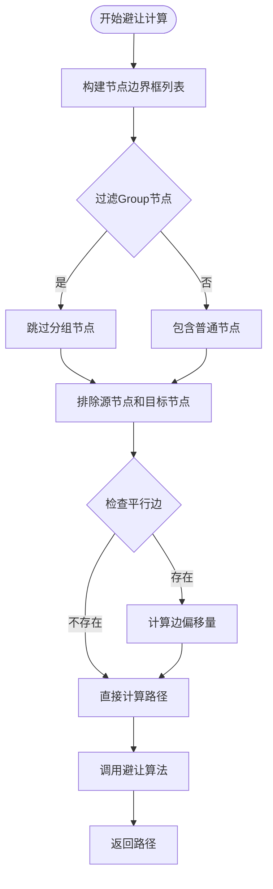

**图表来源**
- [edges.tsx:282-311](file://src/components/flow/edges.tsx#L282-L311)

#### 坐标转换增强

**更新** 在avoidanceUtils.ts中增强了分组内子节点的坐标转换逻辑，确保避让算法能够正确处理相对定位的子节点：

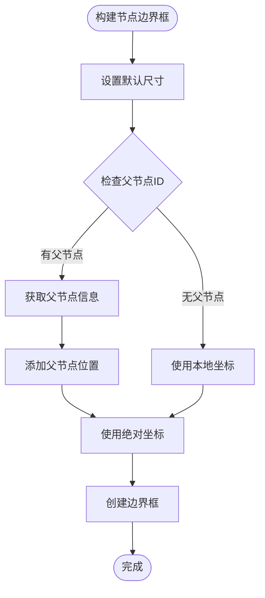

**图表来源**
- [avoidanceUtils.ts:665-694](file://src/core/avoidanceUtils.ts#L665-L694)

**章节来源**
- [edges.tsx:282-311](file://src/components/flow/edges.tsx#L282-L311)
- [avoidanceUtils.ts:665-694](file://src/core/avoidanceUtils.ts#L665-L694)

### 分组节点类型定义

分组节点在系统中的类型定义和处理方式：

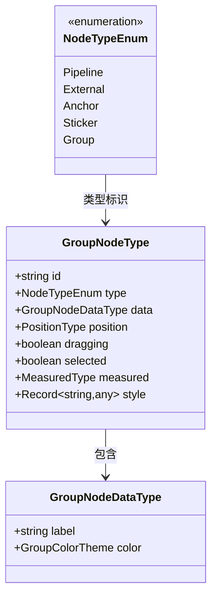

**图表来源**
- [types.ts:212-225](file://src/stores/flow/types.ts#L212-L225)
- [constants.ts:14-20](file://src/components/flow/nodes/constants.ts#L14-L20)

**章节来源**
- [types.ts:212-225](file://src/stores/flow/types.ts#L212-L225)
- [constants.ts:14-20](file://src/components/flow/nodes/constants.ts#L14-L20)

### 嵌套组结构坐标转换修复

**更新** 修复了嵌套组结构的坐标转换问题，通过改进的buildNodeBoundsList函数处理多层嵌套的分组节点：

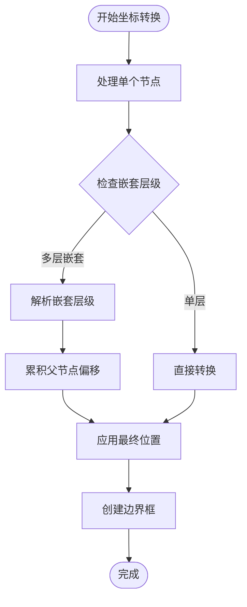

**图表来源**
- [avoidanceUtils.ts:674-684](file://src/core/avoidanceUtils.ts#L674-L684)

**章节来源**
- [avoidanceUtils.ts:674-684](file://src/core/avoidanceUtils.ts#L674-L684)

## 依赖关系分析

避让路由工具的依赖关系呈现清晰的层次结构：

```mermaid
graph TB
subgraph "外部依赖"
XYF[@xyflow/react<br/>React Flow框架]
ELK[elkjs<br/>ELKJS布局引擎]
ZUSTAND[zustand<br/>状态管理]
end
subgraph "核心模块"
AUCORE[src/core/avoidanceUtils.ts]
SNAPCORE[src/core/snapUtils.ts]
LAYOUTCORE[src/core/layout.ts]
ENDGECORE[src/components/flow/edges.tsx]
GROUPCORE[src/components/flow/nodes/GroupNode.tsx]
end
subgraph "UI组件"
EDGEUI[src/components/flow/edges.tsx]
FLOWUI[src/components/Flow.tsx]
NODEOPS[src/components/flow/nodes/utils/nodeOperations.tsx]
GROUPUI[src/components/flow/nodes/GroupNode.tsx]
end
subgraph "状态管理"
CONFIGSTORE[src/stores/configStore.ts]
GRAPHSLICE[src/stores/flow/slices/graphSlice.ts]
end
subgraph "类型定义"
CONSTANTS[src/components/flow/nodes/constants.ts]
TYPES[src/stores/flow/types.ts]
end
XYF --> EDGEUI
XYF --> FLOWUI
ELK --> LAYOUTCORE
ZUSTAND --> CONFIGSTORE
ZUSTAND --> GRAPHSLICE
AUCORE --> ENDGECORE
SNAPCORE --> FLOWUI
LAYOUTCORE --> GROUPCORE
CONFIGSTORE --> EDGEUI
CONFIGSTORE --> FLOWUI
GRAPHSLICE --> EDGEUI
GRAPHSLICE --> FLOWUI
GROUPUI --> ENDGECORE
CONSTANTS --> GROUPUI
TYPES --> CONSTANTS
```

**图表来源**
- [edges.tsx:1-26](file://src/components/flow/edges.tsx#L1-L26)
- [avoidanceUtils.ts:5](file://src/core/avoidanceUtils.ts#L5)
- [configStore.ts:1-276](file://src/stores/configStore.ts#L1-L276)
- [GroupNode.tsx:1-173](file://src/components/flow/nodes/GroupNode.tsx#L1-L173)
- [constants.ts:1-47](file://src/components/flow/nodes/constants.ts#L1-L47)
- [types.ts:1-437](file://src/stores/flow/types.ts#L1-L437)

**章节来源**
- [edges.tsx:1-26](file://src/components/flow/edges.tsx#L1-L26)
- [avoidanceUtils.ts:5](file://src/core/avoidanceUtils.ts#L5)
- [configStore.ts:1-276](file://src/stores/configStore.ts#L1-L276)
- [GroupNode.tsx:1-173](file://src/components/flow/nodes/GroupNode.tsx#L1-L173)
- [constants.ts:1-47](file://src/components/flow/nodes/constants.ts#L1-L47)
- [types.ts:1-437](file://src/stores/flow/types.ts#L1-L437)

## 性能考虑

避让路由工具在设计时充分考虑了性能优化：

### 算法复杂度分析

1. **避让路径算法**：时间复杂度 O(n²)，其中 n 为节点数量
2. **磁吸对齐算法**：时间复杂度 O(n)，n 为候选节点数量
3. **路径渲染**：实时渲染，使用 SVG 路径优化

### 性能优化策略

1. **缓存机制**：避免重复计算相同的路径
2. **视口过滤**：仅对可见节点进行磁吸计算
3. **递归深度限制**：防止无限递归导致的性能问题
4. **增量更新**：只更新发生变化的边和节点
5. **Group节点过滤**：避免对分组节点进行不必要的避让计算
6. **坐标转换优化**：通过改进的算法减少嵌套组的计算开销

**更新** 新增的Group节点过滤机制和嵌套组坐标转换优化显著减少了避让算法的计算量，特别是在包含大量分组节点的复杂流程图中。

## 故障排除指南

### 常见问题及解决方案

#### 问题1：避让路径计算缓慢
**症状**：大量节点时路径计算明显变慢
**解决方案**：
- 调整 `maxRecursionDepth` 参数（默认值为3）
- 启用 `snapOnlyInViewport` 选项减少计算节点数量
- 优化节点布局，减少节点重叠
- **更新** 确保Group节点被正确过滤，避免不必要的避让计算
- **更新** 检查嵌套组坐标转换是否正确，避免重复计算

#### 问题2：磁吸对齐不生效
**症状**：拖拽节点时无法与其他节点对齐
**解决方案**：
- 检查 `enableNodeSnap` 配置项
- 确认节点尺寸信息正确（measured.width/height）
- 验证视口过滤设置是否过于严格

#### 问题3：边路径显示异常
**症状**：连接线出现奇怪的弯曲或交叉
**解决方案**：
- 检查 `edgePathMode` 配置（"avoid"、"smoothstep"、"bezier"）
- 调整 `avoidMargin` 和 `cornerRadius` 参数
- 确认节点位置和尺寸数据的准确性
- **更新** 检查分组内子节点的坐标转换是否正确

#### 问题4：分组内边避让异常
**症状**：分组内的连接线避让行为不符合预期
**解决方案**：
- **更新** 确认edges.tsx中的Group节点过滤逻辑正常工作
- **更新** 验证avoidanceUtils.ts中的坐标转换逻辑
- **更新** 检查分组节点的parentId属性是否正确设置
- **更新** 确认分组内子节点的相对坐标转换是否准确
- **更新** 检查嵌套组结构的坐标转换是否正确处理

#### 问题5：嵌套组结构显示错误
**症状**：嵌套的分组节点显示位置不正确
**解决方案**：
- **更新** 检查buildNodeBoundsList函数中的嵌套坐标转换逻辑
- **更新** 确认父节点位置信息的正确传递
- **更新** 验证多层嵌套时的坐标累积计算

**章节来源**
- [configStore.ts:142-145](file://src/stores/configStore.ts#L142-L145)
- [avoidanceUtils.ts:29-35](file://src/core/avoidanceUtils.ts#L29-L35)
- [edges.tsx:282-311](file://src/components/flow/edges.tsx#L282-L311)
- [avoidanceUtils.ts:665-694](file://src/core/avoidanceUtils.ts#L665-L694)

## 结论

避让路由工具通过精心设计的算法和优雅的用户界面，为 MAA Pipeline Editor 提供了专业级的流程图连接线避让功能。该工具的主要优势包括：

1. **智能算法**：基于几何计算的智能避让路径规划
2. **灵活配置**：丰富的配置选项满足不同使用场景
3. **良好性能**：优化的算法实现确保流畅的用户体验
4. **易于集成**：清晰的接口设计便于与其他组件协作
5. **分组支持**：完善的分组节点避让支持，处理相对定位的子节点
6. **嵌套支持**：支持多层嵌套分组结构的坐标转换

**更新** 本次更新重点解决了分组内边避让模式的行为异常问题，通过在edges.tsx中新增Group节点过滤逻辑和在avoidanceUtils.ts中增强坐标转换处理，确保分组节点不会干扰避让算法的正常计算，同时提高了对分组内相对定位子节点的处理准确性。新增的嵌套组结构坐标转换修复进一步增强了工具对复杂分组场景的支持能力。

该工具不仅提升了软件的专业性和易用性，也为用户创建清晰美观的流程图提供了强有力的技术支撑。通过持续的优化和改进，避让路由工具将继续为用户提供卓越的使用体验。