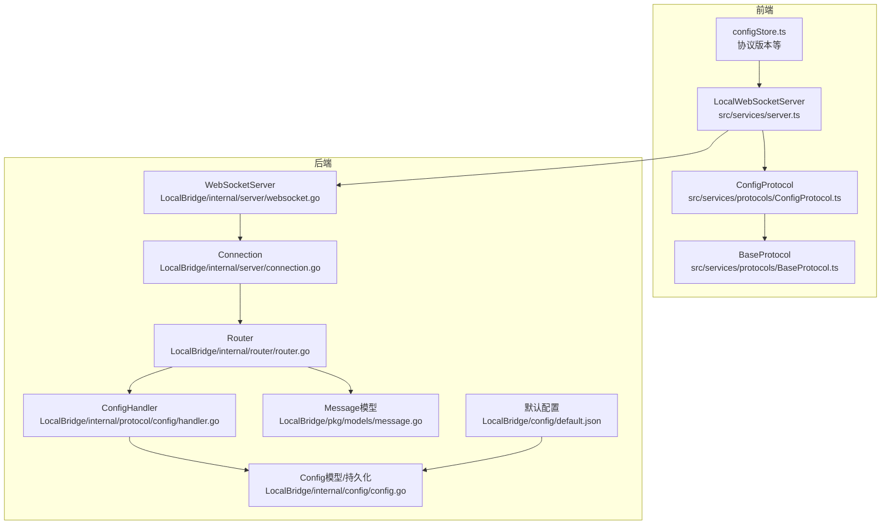
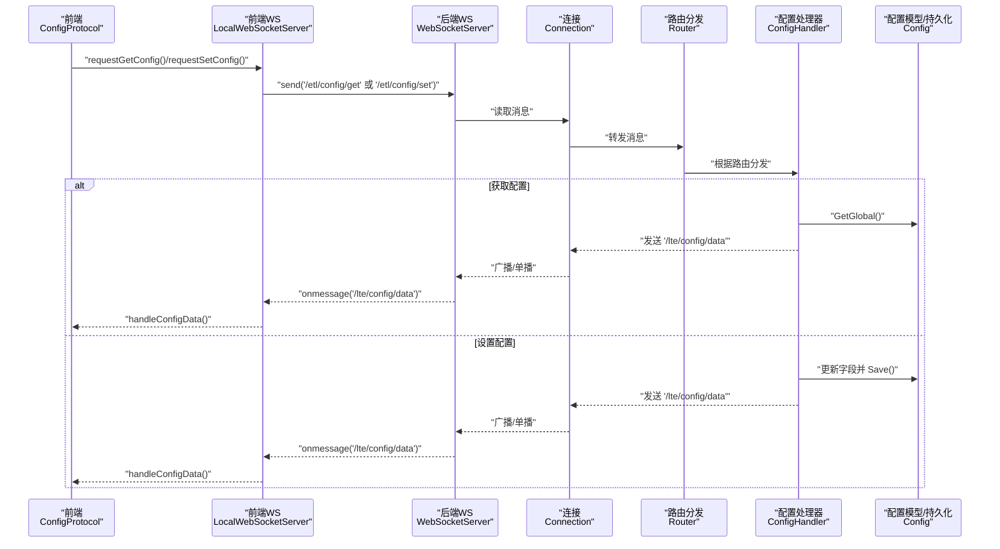
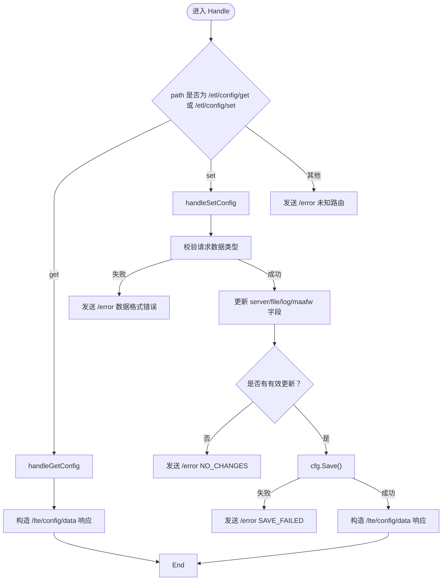
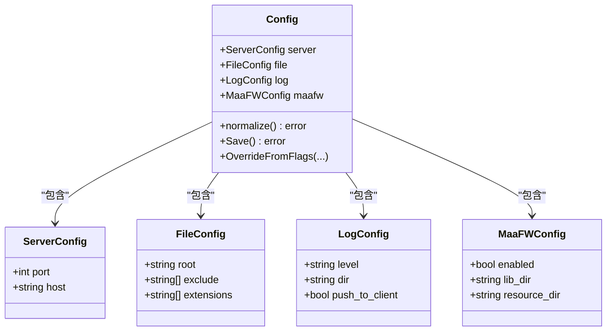
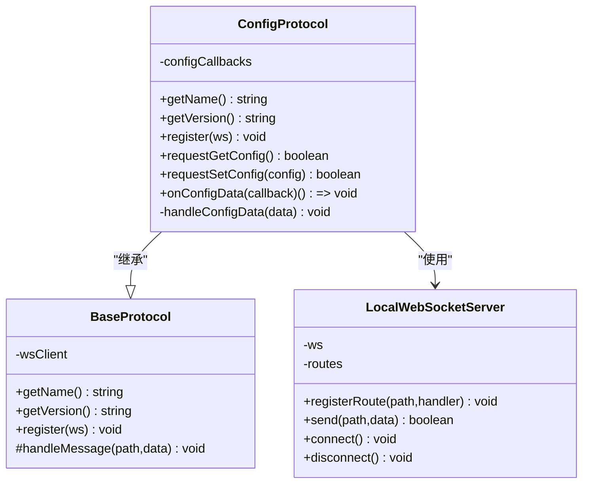
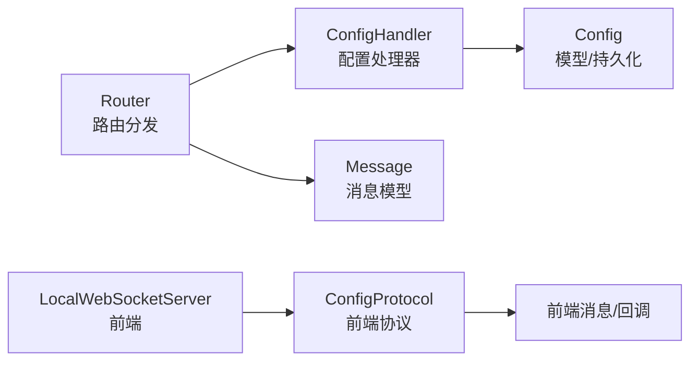

# 配置协议处理器

<cite>
**本文引用的文件**
- [LocalBridge/internal/protocol/config/handler.go](file://LocalBridge/internal/protocol/config/handler.go)
- [LocalBridge/internal/config/config.go](file://LocalBridge/internal/config/config.go)
- [LocalBridge/internal/router/router.go](file://LocalBridge/internal/router/router.go)
- [LocalBridge/internal/server/websocket.go](file://LocalBridge/internal/server/websocket.go)
- [LocalBridge/internal/server/connection.go](file://LocalBridge/internal/server/connection.go)
- [LocalBridge/pkg/models/message.go](file://LocalBridge/pkg/models/message.go)
- [src/services/protocols/ConfigProtocol.ts](file://src/services/protocols/ConfigProtocol.ts)
- [src/services/protocols/BaseProtocol.ts](file://src/services/protocols/BaseProtocol.ts)
- [src/services/server.ts](file://src/services/server.ts)
- [src/stores/configStore.ts](file://src/stores/configStore.ts)
- [LocalBridge/config/default.json](file://LocalBridge/config/default.json)
</cite>

## 目录
1. [简介](#简介)
2. [项目结构](#项目结构)
3. [核心组件](#核心组件)
4. [架构总览](#架构总览)
5. [详细组件分析](#详细组件分析)
6. [依赖关系分析](#依赖关系分析)
7. [性能考量](#性能考量)
8. [故障排查指南](#故障排查指南)
9. [结论](#结论)
10. [附录](#附录)

## 简介
本文件聚焦“配置协议处理器”，系统性阐述后端 Go 侧的配置协议处理器、前端 TypeScript 侧的配置协议封装，以及二者通过 WebSocket 的交互流程。目标是帮助读者理解：
- 配置协议的路由设计与消息结构
- 后端如何解析与持久化配置变更
- 前端如何发起配置读取与设置请求，并接收推送结果
- 版本握手与错误处理机制
- 常见问题定位与优化建议

## 项目结构
围绕“配置协议”的相关代码分布在以下位置：
- 后端 Go
  - 协议处理器：LocalBridge/internal/protocol/config/handler.go
  - 配置模型与持久化：LocalBridge/internal/config/config.go
  - 路由分发与握手：LocalBridge/internal/router/router.go
  - WebSocket 服务与连接：LocalBridge/internal/server/websocket.go、LocalBridge/internal/server/connection.go
  - 消息模型：LocalBridge/pkg/models/message.go
  - 默认配置：LocalBridge/config/default.json
- 前端 TypeScript
  - 配置协议封装：src/services/protocols/ConfigProtocol.ts
  - 协议基类：src/services/protocols/BaseProtocol.ts
  - WebSocket 客户端与全局协议注册：src/services/server.ts
  - 前端配置常量与协议版本：src/stores/configStore.ts

图表来源
- [src/services/server.ts](file://src/services/server.ts#L1-L295)
- [src/services/protocols/ConfigProtocol.ts](file://src/services/protocols/ConfigProtocol.ts#L1-L136)
- [src/services/protocols/BaseProtocol.ts](file://src/services/protocols/BaseProtocol.ts#L1-L40)
- [src/stores/configStore.ts](file://src/stores/configStore.ts#L1-L115)
- [LocalBridge/internal/server/websocket.go](file://LocalBridge/internal/server/websocket.go#L1-L177)
- [LocalBridge/internal/server/connection.go](file://LocalBridge/internal/server/connection.go#L1-L96)
- [LocalBridge/internal/router/router.go](file://LocalBridge/internal/router/router.go#L1-L151)
- [LocalBridge/internal/protocol/config/handler.go](file://LocalBridge/internal/protocol/config/handler.go#L1-L200)
- [LocalBridge/internal/config/config.go](file://LocalBridge/internal/config/config.go#L1-L221)
- [LocalBridge/pkg/models/message.go](file://LocalBridge/pkg/models/message.go#L1-L98)
- [LocalBridge/config/default.json](file://LocalBridge/config/default.json#L1-L29)

章节来源
- [src/services/server.ts](file://src/services/server.ts#L1-L295)
- [src/services/protocols/ConfigProtocol.ts](file://src/services/protocols/ConfigProtocol.ts#L1-L136)
- [LocalBridge/internal/protocol/config/handler.go](file://LocalBridge/internal/protocol/config/handler.go#L1-L200)
- [LocalBridge/internal/config/config.go](file://LocalBridge/internal/config/config.go#L1-L221)

## 核心组件
- 后端配置处理器（Go）
  - 路由前缀：/etl/config/
  - 支持路由：
    - /etl/config/get：获取当前配置
    - /etl/config/set：设置配置并持久化
  - 错误处理：统一通过 /error 路由返回错误码与消息
- 前端配置协议封装（TypeScript）
  - 接收路由：/lte/config/data（推送最新配置）
  - 发送路由：
    - /etl/config/get：请求获取配置
    - /etl/config/set：请求设置配置
  - 回调机制：onConfigData 注册回调，接收配置推送
- WebSocket 与握手
  - 前端使用 LocalWebSocketServer 进行连接、路由注册、消息发送
  - 版本握手：前端发送协议版本，后端校验并返回握手结果
- 配置模型与持久化
  - 后端提供 Config 结构体，包含 server、file、log、maafw 字段
  - 提供 Load、Save、OverrideFromFlags 等方法，支持默认值、路径规范化与保存

章节来源
- [LocalBridge/internal/protocol/config/handler.go](file://LocalBridge/internal/protocol/config/handler.go#L1-L200)
- [src/services/protocols/ConfigProtocol.ts](file://src/services/protocols/ConfigProtocol.ts#L1-L136)
- [LocalBridge/internal/server/websocket.go](file://LocalBridge/internal/server/websocket.go#L1-L177)
- [LocalBridge/internal/config/config.go](file://LocalBridge/internal/config/config.go#L1-L221)

## 架构总览
下图展示从前端发起配置请求到后端处理与持久化的完整链路，以及后端向客户端推送配置更新的流程。

图表来源
- [src/services/protocols/ConfigProtocol.ts](file://src/services/protocols/ConfigProtocol.ts#L1-L136)
- [src/services/server.ts](file://src/services/server.ts#L1-L295)
- [LocalBridge/internal/server/websocket.go](file://LocalBridge/internal/server/websocket.go#L1-L177)
- [LocalBridge/internal/server/connection.go](file://LocalBridge/internal/server/connection.go#L1-L96)
- [LocalBridge/internal/router/router.go](file://LocalBridge/internal/router/router.go#L1-L151)
- [LocalBridge/internal/protocol/config/handler.go](file://LocalBridge/internal/protocol/config/handler.go#L1-L200)
- [LocalBridge/internal/config/config.go](file://LocalBridge/internal/config/config.go#L1-L221)

## 详细组件分析

### 后端配置处理器（Go）
- 路由前缀与消息分发
  - GetRoutePrefix 返回 /etl/config/ 前缀，用于自动注册到 Router
  - Handle 根据 path 分发到 handleGetConfig 或 handleSetConfig；未知路由返回 /error
- 获取配置
  - 读取全局配置，构造 /lte/config/data 消息返回
  - 包含 success、config、config_path 与可选 message
- 设置配置
  - 校验请求数据类型
  - 逐项更新 server、file、log、maafw 字段
  - 若无有效更新则返回 NO_CHANGES 错误
  - Save 成功后返回更新后的配置，并提示部分配置需重启生效
- 错误处理
  - sendError/sendConfigError 统一发送 /error 消息
  - 未知路由、数据格式错误、保存失败等均有明确错误码与消息

图表来源
- [LocalBridge/internal/protocol/config/handler.go](file://LocalBridge/internal/protocol/config/handler.go#L1-L200)

章节来源
- [LocalBridge/internal/protocol/config/handler.go](file://LocalBridge/internal/protocol/config/handler.go#L1-L200)

### 配置模型与持久化（Go）
- 配置结构
  - ServerConfig：host、port
  - FileConfig：root、exclude、extensions
  - LogConfig：level、dir、push_to_client
  - MaaFWConfig：enabled、lib_dir、resource_dir
  - Config：聚合上述字段
- 加载与默认值
  - Load 使用 Viper 读取配置文件，默认值通过 setDefaults 设置
  - EnsureConfigFile 保证默认配置文件存在
- 路径规范化
  - normalize 将相对路径转绝对路径，并校验根目录存在性
- 保存与覆盖
  - Save 将当前配置写回原配置文件
  - OverrideFromFlags 支持从命令行覆盖部分字段

图表来源
- [LocalBridge/internal/config/config.go](file://LocalBridge/internal/config/config.go#L1-L221)

章节来源
- [LocalBridge/internal/config/config.go](file://LocalBridge/internal/config/config.go#L1-L221)
- [LocalBridge/config/default.json](file://LocalBridge/config/default.json#L1-L29)

### 前端配置协议封装（TypeScript）
- 协议基类
  - BaseProtocol 定义协议名称、版本、注册与消息处理入口
- ConfigProtocol
  - 注册接收 /lte/config/data 路由，处理配置推送
  - requestGetConfig 发送 /etl/config/get
  - requestSetConfig 发送 /etl/config/set
  - onConfigData 注册回调，支持注销
- LocalWebSocketServer
  - 统一管理连接、路由注册、消息发送与握手
  - 初始化时注册各协议（包括 ConfigProtocol）

图表来源
- [src/services/protocols/BaseProtocol.ts](file://src/services/protocols/BaseProtocol.ts#L1-L40)
- [src/services/protocols/ConfigProtocol.ts](file://src/services/protocols/ConfigProtocol.ts#L1-L136)
- [src/services/server.ts](file://src/services/server.ts#L1-L295)

章节来源
- [src/services/protocols/BaseProtocol.ts](file://src/services/protocols/BaseProtocol.ts#L1-L40)
- [src/services/protocols/ConfigProtocol.ts](file://src/services/protocols/ConfigProtocol.ts#L1-L136)
- [src/services/server.ts](file://src/services/server.ts#L1-L295)

### WebSocket 与握手（Go/TS）
- Go 侧
  - WebSocketServer 提供 Start/Stop、连接管理、广播与握手常量
  - Connection 负责读写泵与消息发送队列
  - Router 实现版本握手、路由分发与错误消息发送
- TS 侧
  - LocalWebSocketServer 负责连接、超时、握手、路由注册与消息发送
  - 初始化时注册各协议，确保握手完成后才进行业务路由

章节来源
- [LocalBridge/internal/server/websocket.go](file://LocalBridge/internal/server/websocket.go#L1-L177)
- [LocalBridge/internal/server/connection.go](file://LocalBridge/internal/server/connection.go#L1-L96)
- [LocalBridge/internal/router/router.go](file://LocalBridge/internal/router/router.go#L1-L151)
- [src/services/server.ts](file://src/services/server.ts#L1-L295)

## 依赖关系分析
- 耦合与内聚
  - ConfigHandler 对 Config 模型强依赖，负责配置读取与持久化
  - Router 作为统一入口，与各 Handler 解耦，通过前缀匹配分发
  - 前端 ConfigProtocol 仅依赖 LocalWebSocketServer 的路由能力
- 外部依赖
  - Go 使用 gorilla/websocket、spf13/viper、自定义 eventbus/logger
  - TS 使用浏览器 WebSocket、antd message 提示
- 循环依赖
  - 未发现循环依赖迹象；各模块职责清晰

图表来源
- [LocalBridge/internal/router/router.go](file://LocalBridge/internal/router/router.go#L1-L151)
- [LocalBridge/internal/protocol/config/handler.go](file://LocalBridge/internal/protocol/config/handler.go#L1-L200)
- [LocalBridge/internal/config/config.go](file://LocalBridge/internal/config/config.go#L1-L221)
- [LocalBridge/pkg/models/message.go](file://LocalBridge/pkg/models/message.go#L1-L98)
- [src/services/server.ts](file://src/services/server.ts#L1-L295)
- [src/services/protocols/ConfigProtocol.ts](file://src/services/protocols/ConfigProtocol.ts#L1-L136)

章节来源
- [LocalBridge/internal/router/router.go](file://LocalBridge/internal/router/router.go#L1-L151)
- [LocalBridge/internal/protocol/config/handler.go](file://LocalBridge/internal/protocol/config/handler.go#L1-L200)
- [src/services/protocols/ConfigProtocol.ts](file://src/services/protocols/ConfigProtocol.ts#L1-L136)

## 性能考量
- 消息队列与背压
  - Connection 的发送通道长度固定，避免阻塞；当队列满时会丢弃消息并记录警告
- 路由查找
  - Router 采用前缀匹配，复杂度与处理器数量线性相关；建议保持处理器数量合理
- 配置保存
  - Save 会重写整个配置文件，频繁保存可能带来 IO 压力；建议合并多次设置后再保存
- 路径规范化
  - normalize 在设置配置时进行路径解析与校验，避免后续运行期异常

章节来源
- [LocalBridge/internal/server/connection.go](file://LocalBridge/internal/server/connection.go#L1-L96)
- [LocalBridge/internal/router/router.go](file://LocalBridge/internal/router/router.go#L1-L151)
- [LocalBridge/internal/config/config.go](file://LocalBridge/internal/config/config.go#L1-L221)

## 故障排查指南
- 协议版本不匹配
  - 现象：前端提示协议版本不匹配并断开连接
  - 原因：前端 protocolVersion 与后端 server.ProtocolVersion 不一致
  - 处理：确保前后端协议版本一致，或按后端提示更新
- 未知路由
  - 现象：后端返回 /error，code 为“未知的路由”
  - 原因：前端发送了未注册的 /etl/config/* 子路径
  - 处理：确认前端发送的路由是否为 /etl/config/get 或 /etl/config/set
- 数据格式错误
  - 现象：后端返回 /error，code 为“请求数据格式错误”
  - 原因：请求数据非 map[string]interface{}
  - 处理：确保 requestSetConfig 的参数结构正确
- 保存失败
  - 现象：后端返回 /error，code 为“SAVE_FAILED”
  - 原因：配置文件写入失败或路径未知
  - 处理：检查配置文件路径与权限，确保可写
- 配置未加载
  - 现象：后端返回 “CONFIG_NOT_LOADED”
  - 原因：未完成配置加载或加载失败
  - 处理：确认默认配置文件存在且可读

章节来源
- [LocalBridge/internal/router/router.go](file://LocalBridge/internal/router/router.go#L1-L151)
- [LocalBridge/internal/protocol/config/handler.go](file://LocalBridge/internal/protocol/config/handler.go#L1-L200)
- [src/services/server.ts](file://src/services/server.ts#L1-L295)
- [src/stores/configStore.ts](file://src/stores/configStore.ts#L1-L115)

## 结论
配置协议处理器通过清晰的路由设计与消息模型，实现了前后端对配置的读取与设置。后端以 ConfigHandler 为核心，结合 Router 的统一分发与 Connection 的消息传输，提供了稳定可靠的配置管理能力；前端通过 ConfigProtocol 封装，简化了配置读写与回调订阅。配合版本握手与错误处理机制，整体具备良好的可维护性与扩展性。

## 附录
- 配置字段说明（来自 Config 模型）
  - server.host/port：服务监听地址与端口
  - file.root/exclude/extensions：文件扫描根目录、排除规则与扩展名过滤
  - log.level/dir/push_to_client：日志级别、输出目录与是否推送至客户端
  - maafw.enabled/lib_dir/resource_dir：MaaFramework 开关与库/资源目录
- 默认配置
  - 默认配置文件位于 LocalBridge/config/default.json，包含上述字段的默认值

章节来源
- [LocalBridge/internal/config/config.go](file://LocalBridge/internal/config/config.go#L1-L221)
- [LocalBridge/config/default.json](file://LocalBridge/config/default.json#L1-L29)