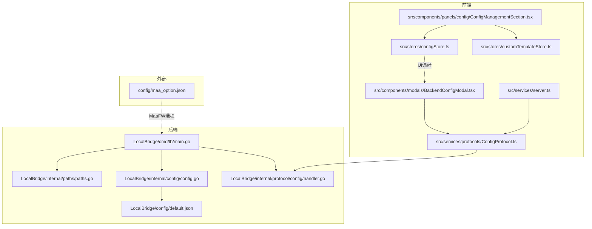
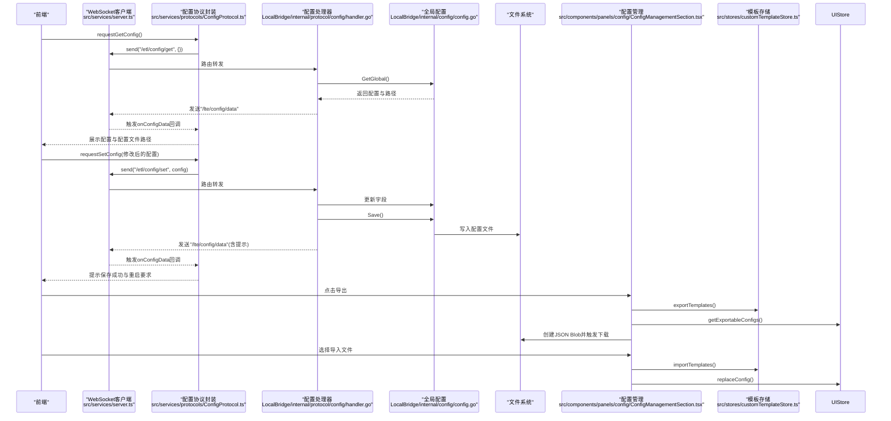
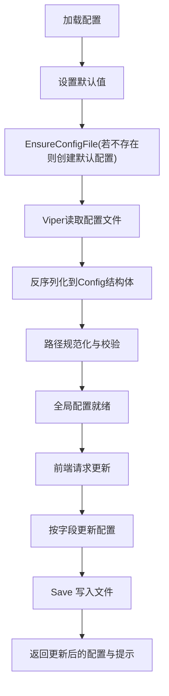
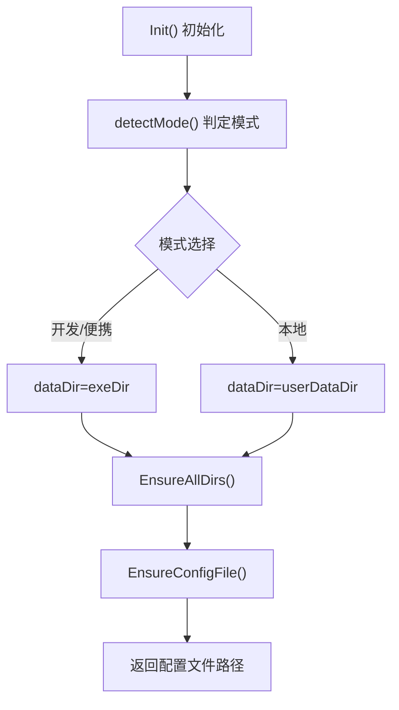
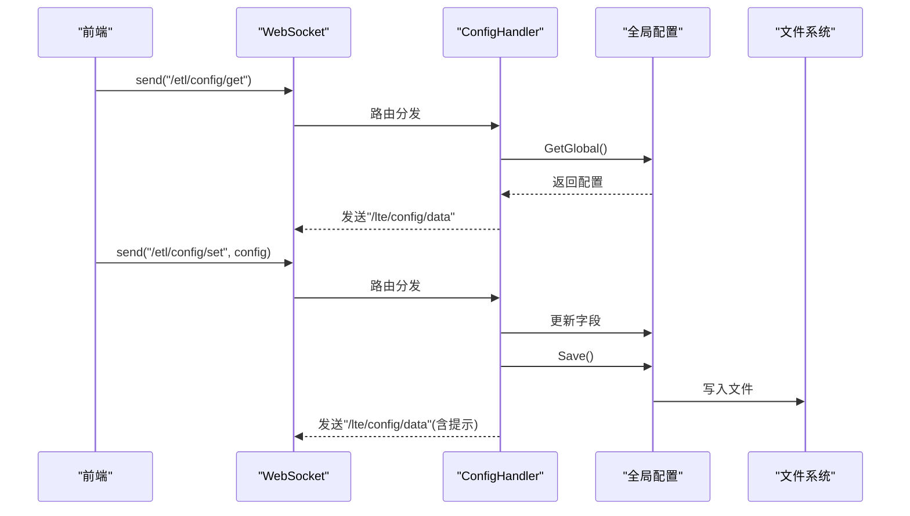
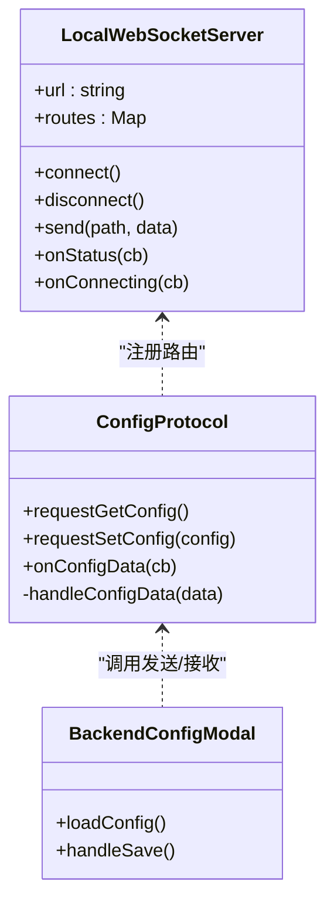
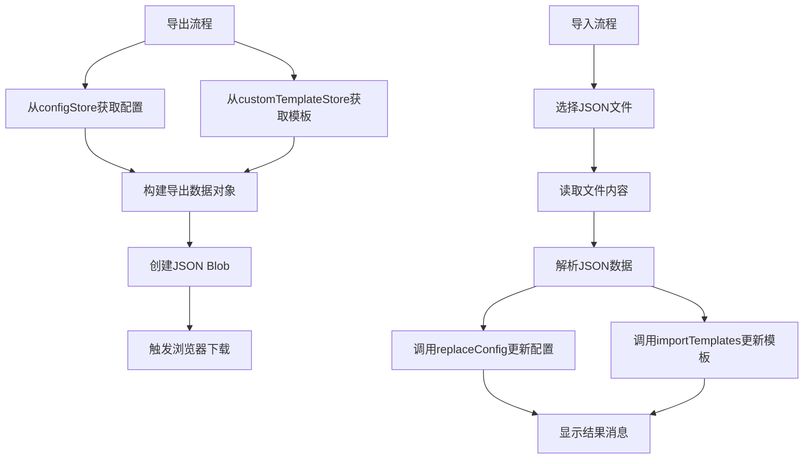
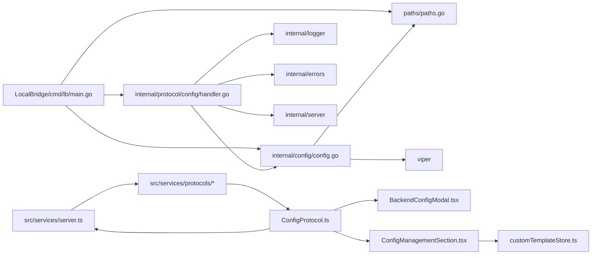

# 配置持久化

<cite>
**本文引用的文件**
- [LocalBridge/cmd/lb/main.go](file://LocalBridge/cmd/lb/main.go)
- [LocalBridge/internal/config/config.go](file://LocalBridge/internal/config/config.go)
- [LocalBridge/internal/paths/paths.go](file://LocalBridge/internal/paths/paths.go)
- [LocalBridge/internal/protocol/config/handler.go](file://LocalBridge/internal/protocol/config/handler.go)
- [LocalBridge/config/default.json](file://LocalBridge/config/default.json)
- [config/maa_option.json](file://config/maa_option.json)
- [src/services/server.ts](file://src/services/server.ts)
- [src/services/protocols/ConfigProtocol.ts](file://src/services/protocols/ConfigProtocol.ts)
- [src/components/modals/BackendConfigModal.tsx](file://src/components/modals/BackendConfigModal.tsx)
- [src/stores/configStore.ts](file://src/stores/configStore.ts)
- [src/components/panels/config/ConfigManagementSection.tsx](file://src/components/panels/config/ConfigManagementSection.tsx)
- [src/stores/customTemplateStore.ts](file://src/stores/customTemplateStore.ts)
</cite>

## 更新摘要
**变更内容**
- 新增了完整的配置与自定义模板导入导出功能
- 在配置面板中添加了“导出/导入”管理区域
- 支持将所有设置和自定义模板导出为JSON文件，并可从文件导入
- 更新了相关架构流程图以反映新的导入导出机制

## 目录
1. [简介](#简介)
2. [项目结构](#项目结构)
3. [核心组件](#核心组件)
4. [架构总览](#架构总览)
5. [详细组件分析](#详细组件分析)
6. [依赖关系分析](#依赖关系分析)
7. [性能考量](#性能考量)
8. [故障排查指南](#故障排查指南)
9. [结论](#结论)

## 简介
本文件聚焦于“配置持久化”的主题，围绕本地桥接服务（LocalBridge）与前端之间的配置读取、写入与持久化流程展开，涵盖：
- 后端配置文件的加载、默认值、路径规范与保存
- 前端通过 WebSocket 与后端交互，拉取/提交配置
- 本地运行模式与便携模式下的配置文件位置策略
- 与 MaaFramework 相关的选项文件（非持久化配置）
- **新增的完整导入导出功能，支持将所有设置和自定义模板导出为JSON文件，并可从文件导入**

章节来源
- [LocalBridge/cmd/lb/main.go](file://LocalBridge/cmd/lb/main.go#L169-L306)
- [LocalBridge/internal/config/config.go](file://LocalBridge/internal/config/config.go#L1-L120)
- [LocalBridge/internal/paths/paths.go](file://LocalBridge/internal/paths/paths.go#L1-L120)
- [src/services/server.ts](file://src/services/server.ts#L1-L120)

## 项目结构
与“配置持久化”直接相关的关键模块分布如下：
- 后端（Go）
  - 命令行入口与服务启动：LocalBridge/cmd/lb/main.go
  - 配置模型与持久化：LocalBridge/internal/config/config.go
  - 路径策略与默认配置生成：LocalBridge/internal/paths/paths.go
  - 配置协议处理器：LocalBridge/internal/protocol/config/handler.go
  - 默认配置文件：LocalBridge/config/default.json
- 前端（TypeScript/React）
  - WebSocket 客户端与协议注册：src/services/server.ts
  - 配置协议封装：src/services/protocols/ConfigProtocol.ts
  - 配置弹窗与表单交互：src/components/modals/BackendConfigModal.tsx
  - 前端通用配置（UI/行为偏好）：src/stores/configStore.ts
  - 配置管理区域（新增导入导出功能）：src/components/panels/config/ConfigManagementSection.tsx
  - 自定义模板存储：src/stores/customTemplateStore.ts
- 其他
  - MaaFramework 选项文件：config/maa_option.json

图表来源
- [LocalBridge/cmd/lb/main.go](file://LocalBridge/cmd/lb/main.go#L169-L306)
- [LocalBridge/internal/paths/paths.go](file://LocalBridge/internal/paths/paths.go#L1-L120)
- [LocalBridge/internal/config/config.go](file://LocalBridge/internal/config/config.go#L1-L120)
- [LocalBridge/internal/protocol/config/handler.go](file://LocalBridge/internal/protocol/config/handler.go#L1-L60)
- [LocalBridge/config/default.json](file://LocalBridge/config/default.json#L1-L29)
- [src/services/server.ts](file://src/services/server.ts#L1-L120)
- [src/services/protocols/ConfigProtocol.ts](file://src/services/protocols/ConfigProtocol.ts#L1-L60)
- [src/components/modals/BackendConfigModal.tsx](file://src/components/modals/BackendConfigModal.tsx#L1-L60)
- [src/stores/configStore.ts](file://src/stores/configStore.ts#L1-L60)
- [src/components/panels/config/ConfigManagementSection.tsx](file://src/components/panels/config/ConfigManagementSection.tsx#L1-L136)
- [src/stores/customTemplateStore.ts](file://src/stores/customTemplateStore.ts#L40-L292)
- [config/maa_option.json](file://config/maa_option.json#L1-L6)

## 核心组件
- 后端配置模型与持久化
  - 配置结构体包含 server、file、log、maafw 字段，并提供 Save、OverrideFromFlags、SetMaaFWLibDir、SetMaaFWResourceDir 等方法。
  - 默认值通过 Viper 设置；首次运行会在数据目录生成默认配置文件。
- 路径策略
  - 支持三种运行模式：开发模式、便携模式、本地模式；根据模式确定数据目录与配置文件路径。
  - EnsureAllDirs、EnsureConfigFile 确保目录与默认配置存在。
- 配置协议处理器
  - 提供 /etl/config/get 与 /etl/config/set 路由，负责从全局配置对象读取与写回，并将变更保存到磁盘。
- 前端配置协议
  - 通过 WebSocket 与后端通信，提供 requestGetConfig/requestSetConfig 与 onConfigData 回调。
- 前端 UI 配置
  - UI 偏好（如主题、面板宽度、自动连接等）通过 Zustand store 管理，不与后端配置持久化耦合。
- **配置管理与导入导出（新增）**
  - ConfigManagementSection 提供导出/导入按钮，可将所有配置和自定义模板导出为JSON文件
  - 支持从JSON文件导入配置和模板，实现完整的配置迁移能力

章节来源
- [LocalBridge/internal/config/config.go](file://LocalBridge/internal/config/config.go#L1-L120)
- [LocalBridge/internal/paths/paths.go](file://LocalBridge/internal/paths/paths.go#L1-L120)
- [LocalBridge/internal/protocol/config/handler.go](file://LocalBridge/internal/protocol/config/handler.go#L1-L60)
- [src/services/protocols/ConfigProtocol.ts](file://src/services/protocols/ConfigProtocol.ts#L1-L60)
- [src/stores/configStore.ts](file://src/stores/configStore.ts#L1-L60)
- [src/components/panels/config/ConfigManagementSection.tsx](file://src/components/panels/config/ConfigManagementSection.tsx#L1-L136)
- [src/stores/customTemplateStore.ts](file://src/stores/customTemplateStore.ts#L40-L292)

## 架构总览
后端启动时加载配置，前端通过 WebSocket 握手后发起配置请求，后端返回当前配置与配置文件路径；前端表单修改后提交，后端写入磁盘并返回结果。**新增的导入导出功能允许用户将所有配置和自定义模板导出为JSON文件，并可从文件导入，实现配置的完整迁移。**

图表来源
- [src/services/server.ts](file://src/services/server.ts#L1-L120)
- [src/services/protocols/ConfigProtocol.ts](file://src/services/protocols/ConfigProtocol.ts#L60-L136)
- [LocalBridge/internal/protocol/config/handler.go](file://LocalBridge/internal/protocol/config/handler.go#L45-L167)
- [LocalBridge/internal/config/config.go](file://LocalBridge/internal/config/config.go#L191-L221)
- [src/components/panels/config/ConfigManagementSection.tsx](file://src/components/panels/config/ConfigManagementSection.tsx#L28-L130)
- [src/stores/customTemplateStore.ts](file://src/stores/customTemplateStore.ts#L238-L247)

## 详细组件分析

### 后端配置模型与持久化（Go）
- 结构体字段
  - server：host、port
  - file：root、exclude、extensions
  - log：level、dir、push_to_client
  - maafw：enabled、lib_dir、resource_dir
- 默认值与加载
  - setDefaults 为各字段设置默认值；Load 通过 Viper 读取配置文件，若不存在则通过 paths.EnsureConfigFile 创建默认配置。
- 路径规范化
  - OverrideFromFlags 与 normalize 对相对路径进行绝对化与校验。
- 保存与更新
  - Save 将结构体序列化为缩进 JSON 并写入文件；SetMaaFWLibDir/SetMaaFWResourceDir 在更新后立即保存。

图表来源
- [LocalBridge/internal/config/config.go](file://LocalBridge/internal/config/config.go#L52-L120)
- [LocalBridge/internal/config/config.go](file://LocalBridge/internal/config/config.go#L121-L178)
- [LocalBridge/internal/config/config.go](file://LocalBridge/internal/config/config.go#L191-L221)

章节来源
- [LocalBridge/internal/config/config.go](file://LocalBridge/internal/config/config.go#L1-L221)

### 路径策略与默认配置生成（Go）
- 运行模式
  - detectMode 优先判断便携模式，其次检测可执行目录旁是否存在 config 目录决定开发模式，否则为本地模式。
- 数据目录与配置文件
  - GetDataDir、GetConfigDir、GetConfigFile 根据模式返回实际路径；EnsureAllDirs 确保 logs 与 config 目录存在；EnsureConfigFile 在不存在时写入默认内容。
- 默认配置
  - LocalBridge/config/default.json 提供 server、file、log、maafw 的默认值。

图表来源
- [LocalBridge/internal/paths/paths.go](file://LocalBridge/internal/paths/paths.go#L46-L120)
- [LocalBridge/internal/paths/paths.go](file://LocalBridge/internal/paths/paths.go#L151-L170)
- [LocalBridge/internal/paths/paths.go](file://LocalBridge/internal/paths/paths.go#L178-L236)
- [LocalBridge/config/default.json](file://LocalBridge/config/default.json#L1-L29)

章节来源
- [LocalBridge/internal/paths/paths.go](file://LocalBridge/internal/paths/paths.go#L1-L236)
- [LocalBridge/config/default.json](file://LocalBridge/config/default.json#L1-L29)

### 配置协议处理器（Go）
- 路由
  - /etl/config/get：返回当前配置与配置文件路径
  - /etl/config/set：根据传入字段更新配置并保存，返回更新后的配置与提示
- 错误处理
  - 对未知路由与无效请求返回统一错误结构

图表来源
- [LocalBridge/internal/protocol/config/handler.go](file://LocalBridge/internal/protocol/config/handler.go#L24-L60)
- [LocalBridge/internal/protocol/config/handler.go](file://LocalBridge/internal/protocol/config/handler.go#L66-L167)
- [LocalBridge/internal/config/config.go](file://LocalBridge/internal/config/config.go#L191-L221)

章节来源
- [LocalBridge/internal/protocol/config/handler.go](file://LocalBridge/internal/protocol/config/handler.go#L1-L200)
- [LocalBridge/internal/config/config.go](file://LocalBridge/internal/config/config.go#L191-L221)

### 前端配置协议与交互（TypeScript/React）
- WebSocket 客户端
  - LocalWebSocketServer 负责连接、握手、消息路由与状态管理；提供 setPort、registerRoute、send 等能力。
- 配置协议封装
  - ConfigProtocol 提供 requestGetConfig/requestSetConfig 与 onConfigData 回调；收到后端推送后触发 UI 提示。
- 配置弹窗
  - BackendConfigModal 通过表单收集配置，提交后调用 configProtocol.requestSetConfig；保存成功后提示“请重启后端服务以使配置生效”。

图表来源
- [src/services/server.ts](file://src/services/server.ts#L1-L120)
- [src/services/protocols/ConfigProtocol.ts](file://src/services/protocols/ConfigProtocol.ts#L60-L136)
- [src/components/modals/BackendConfigModal.tsx](file://src/components/modals/BackendConfigModal.tsx#L1-L120)

章节来源
- [src/services/server.ts](file://src/services/server.ts#L1-L200)
- [src/services/protocols/ConfigProtocol.ts](file://src/services/protocols/ConfigProtocol.ts#L1-L136)
- [src/components/modals/BackendConfigModal.tsx](file://src/components/modals/BackendConfigModal.tsx#L1-L200)

### 前端 UI 配置（非持久化）
- UI 偏好（如主题、面板宽度、自动连接等）通过 useConfigStore 管理，属于前端运行时状态，不与后端配置持久化耦合。
- 该 store 与后端配置文件无关，仅影响界面行为。

章节来源
- [src/stores/configStore.ts](file://src/stores/configStore.ts#L1-L148)

### 配置管理与导入导出（新增功能）
- **导出功能**
  - handleExportConfig 函数从 configStore 获取可导出配置，从 customTemplateStore 获取自定义模板
  - 构建包含版本、导出时间、配置和模板的导出数据对象
  - 创建 JSON Blob 并触发浏览器下载
- **导入功能**
  - handleImportConfig 函数通过文件输入元素选择JSON文件
  - 读取文件内容并解析为导出数据格式
  - 调用 replaceConfig 和 importTemplates 分别更新配置和模板
  - 提供成功/失败消息提示
- **数据结构**
  - 导出数据包含 version、exportTime、configs、customTemplates 字段
  - 支持完整的配置迁移和备份

图表来源
- [src/components/panels/config/ConfigManagementSection.tsx](file://src/components/panels/config/ConfigManagementSection.tsx#L28-L130)
- [src/stores/configStore.ts](file://src/stores/configStore.ts#L9-L11)
- [src/stores/customTemplateStore.ts](file://src/stores/customTemplateStore.ts#L40-L292)

章节来源
- [src/components/panels/config/ConfigManagementSection.tsx](file://src/components/panels/config/ConfigManagementSection.tsx#L1-L136)
- [src/stores/customTemplateStore.ts](file://src/stores/customTemplateStore.ts#L40-L292)

### MaaFramework 选项文件（非持久化配置）
- config/maa_option.json 提供 MaaFramework 的运行选项（如 logging、stdout_level 等），与 LocalBridge 的配置持久化无直接关联。
- LocalBridge 启动时不会读取该文件，但命令行工具支持设置 MaaFramework 路径与资源目录。

章节来源
- [config/maa_option.json](file://config/maa_option.json#L1-L6)
- [LocalBridge/cmd/lb/main.go](file://LocalBridge/cmd/lb/main.go#L360-L467)

## 依赖关系分析
- 后端
  - main.go 依赖 paths、config、logger、router、server、protocol 等模块；启动时加载配置并注册协议处理器。
  - config.go 依赖 viper、paths；提供 Save、OverrideFromFlags 等能力。
  - protocol/config/handler.go 依赖 config、errors、logger、server、models。
- 前端
  - server.ts 依赖 protocols/* 与 stores/*；initializeWebSocket 注册各协议。
  - ConfigProtocol.ts 依赖 BaseProtocol 与 LocalWebSocketServer。
  - BackendConfigModal.tsx 依赖 configProtocol 与 localServer。
  - **ConfigManagementSection.tsx 依赖 configStore 和 customTemplateStore，实现导入导出功能**

图表来源
- [LocalBridge/cmd/lb/main.go](file://LocalBridge/cmd/lb/main.go#L169-L306)
- [LocalBridge/internal/config/config.go](file://LocalBridge/internal/config/config.go#L1-L120)
- [LocalBridge/internal/protocol/config/handler.go](file://LocalBridge/internal/protocol/config/handler.go#L1-L60)
- [src/services/server.ts](file://src/services/server.ts#L270-L300)
- [src/services/protocols/ConfigProtocol.ts](file://src/services/protocols/ConfigProtocol.ts#L1-L60)
- [src/components/modals/BackendConfigModal.tsx](file://src/components/modals/BackendConfigModal.tsx#L1-L60)
- [src/components/panels/config/ConfigManagementSection.tsx](file://src/components/panels/config/ConfigManagementSection.tsx#L1-L136)
- [src/stores/customTemplateStore.ts](file://src/stores/customTemplateStore.ts#L40-L292)

章节来源
- [LocalBridge/cmd/lb/main.go](file://LocalBridge/cmd/lb/main.go#L169-L306)
- [LocalBridge/internal/config/config.go](file://LocalBridge/internal/config/config.go#L1-L120)
- [LocalBridge/internal/protocol/config/handler.go](file://LocalBridge/internal/protocol/config/handler.go#L1-L60)
- [src/services/server.ts](file://src/services/server.ts#L270-L300)
- [src/services/protocols/ConfigProtocol.ts](file://src/services/protocols/ConfigProtocol.ts#L1-L60)
- [src/components/modals/BackendConfigModal.tsx](file://src/components/modals/BackendConfigModal.tsx#L1-L60)
- [src/components/panels/config/ConfigManagementSection.tsx](file://src/components/panels/config/ConfigManagementSection.tsx#L1-L136)
- [src/stores/customTemplateStore.ts](file://src/stores/customTemplateStore.ts#L40-L292)

## 性能考量
- 配置读取
  - Viper 读取与反序列化配置为轻量操作，通常毫秒级；建议避免频繁重复读取，可通过全局单例复用。
- 配置写入
  - Save 使用 JSON 缩进写入，I/O 成本低；建议合并多次更新后再一次性保存，减少磁盘写入次数。
- WebSocket 传输
  - 配置体量较小，传输与解析成本低；前端可缓存当前配置，避免不必要的重复请求。
- **导入导出性能**
  - 导出操作涉及序列化所有配置和模板，数据量较大时可能影响性能
  - 建议在空闲时段执行大规模导出操作
  - 导入操作需要解析JSON并更新状态，应提供进度提示

[本节为通用指导，不涉及具体文件分析]

## 故障排查指南
- 配置文件未找到或无法保存
  - 确认运行模式与数据目录：开发/便携模式下数据目录为可执行文件同目录；本地模式为用户数据目录。
  - 检查 EnsureConfigFile 是否成功创建默认配置；确认写权限。
- 路径异常
  - 若 file.root 或 log.dir 为相对路径，normalize 会尝试绝对化；若目标目录不存在，将报错。
- WebSocket 连接问题
  - 前端连接超时或握手失败：检查端口、协议版本、本地服务是否启动。
- 配置更新未生效
  - 部分配置（如端口）需要重启后端服务才能生效；后端返回消息会提示“请重启后端服务”。
- **导入导出问题**
  - 导出失败：检查浏览器是否阻止了自动下载，尝试手动保存
  - 导入失败：确认文件格式正确，检查JSON文件是否损坏
  - 模板导入失败：检查模板数据结构是否符合预期格式

章节来源
- [LocalBridge/internal/paths/paths.go](file://LocalBridge/internal/paths/paths.go#L151-L170)
- [LocalBridge/internal/paths/paths.go](file://LocalBridge/internal/paths/paths.go#L178-L236)
- [LocalBridge/internal/config/config.go](file://LocalBridge/internal/config/config.go#L121-L178)
- [src/services/server.ts](file://src/services/server.ts#L100-L180)
- [LocalBridge/internal/protocol/config/handler.go](file://LocalBridge/internal/protocol/config/handler.go#L143-L167)
- [src/components/panels/config/ConfigManagementSection.tsx](file://src/components/panels/config/ConfigManagementSection.tsx#L28-L130)
- [src/stores/customTemplateStore.ts](file://src/stores/customTemplateStore.ts#L40-L292)

## 结论
- 后端通过 Viper 与文件系统实现配置的加载、默认值注入与持久化保存；路径策略支持多种运行模式。
- 前端通过 WebSocket 与后端配置协议交互，完成配置的拉取与提交；保存后端会提示重启以使某些配置生效。
- UI 偏好与 MaaFramework 选项分别属于前端运行时状态与独立选项文件，与后端配置持久化无直接耦合。
- **新增了完整的导入导出功能，支持将所有设置和自定义模板导出为JSON文件，并可从文件导入，实现了配置的完整迁移和备份能力。**
- 导入导出功能通过 ConfigManagementSection 组件实现，整合了 configStore 和 customTemplateStore 的数据，提供了用户友好的界面操作。