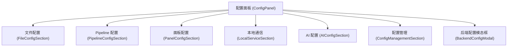
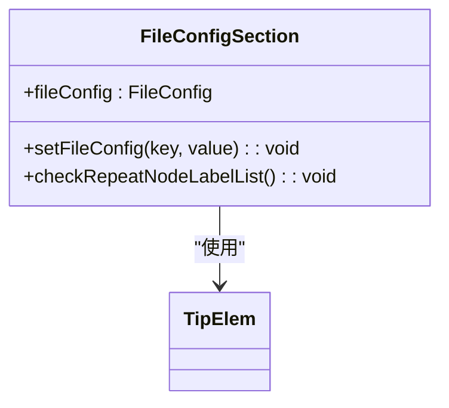
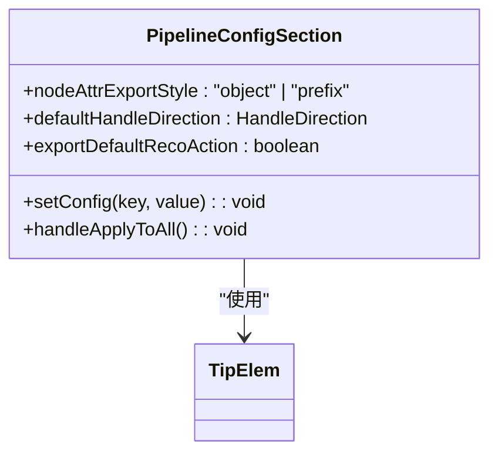
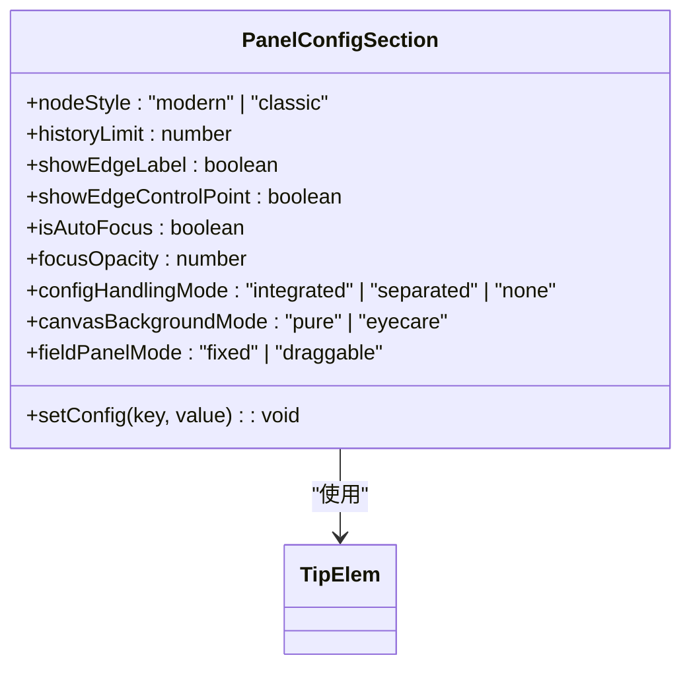
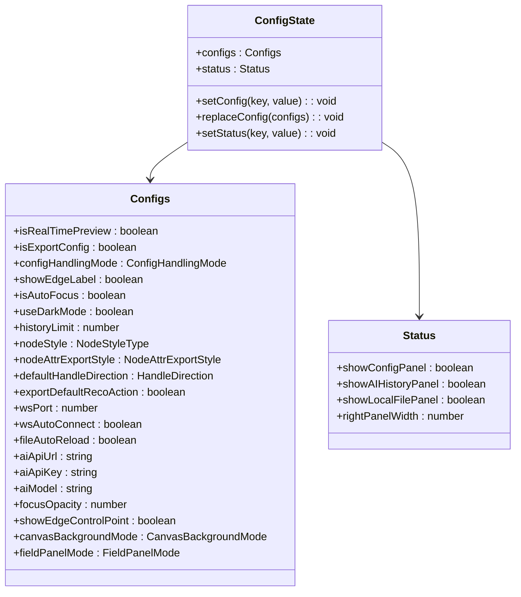
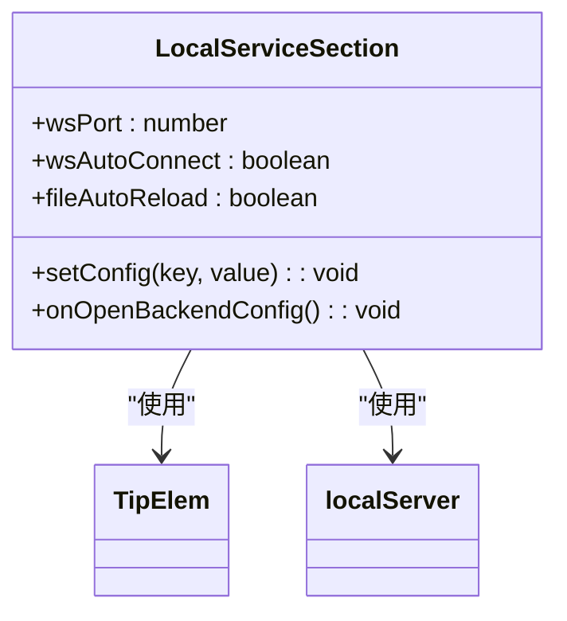
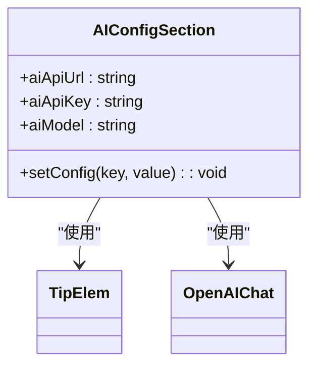
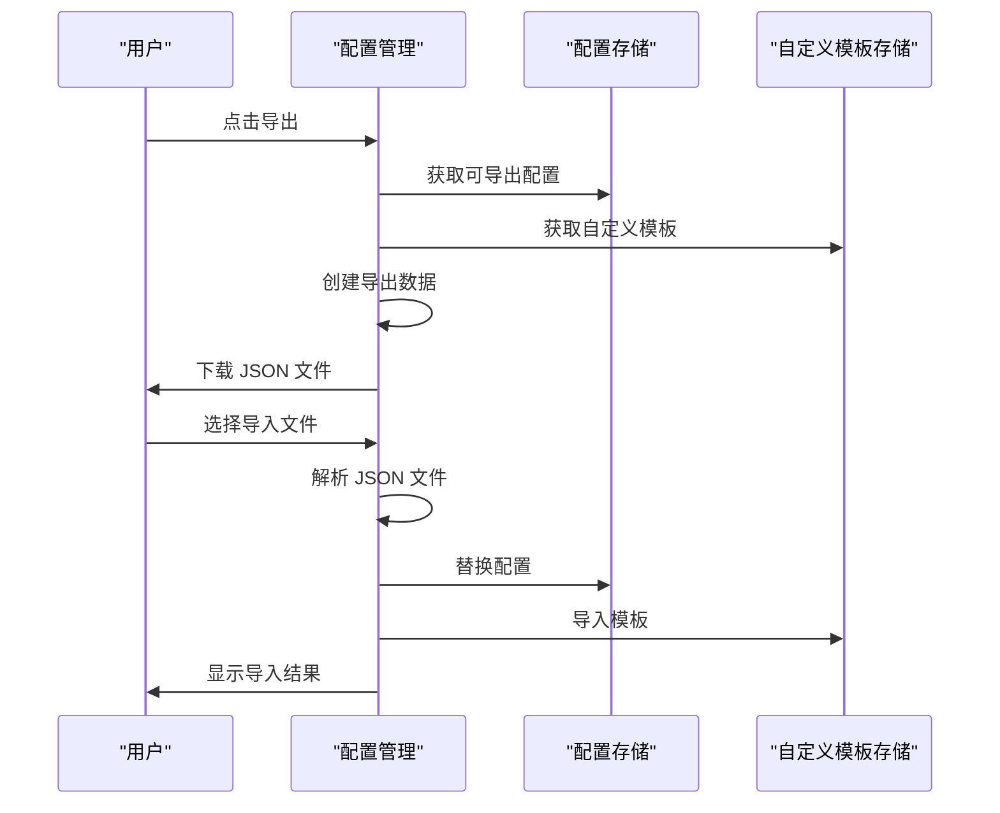
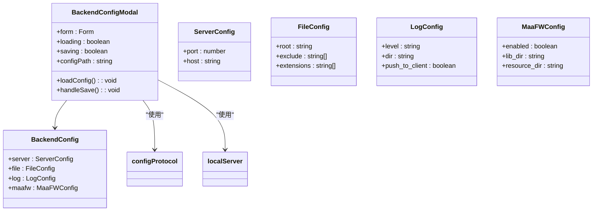
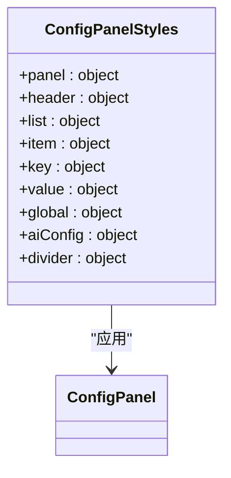

# 配置面板

<cite>
**本文档中引用的文件**
- [ConfigPanel.tsx](file://src/components/panels/main/ConfigPanel.tsx)
- [FileConfigSection.tsx](file://src/components/panels/config/FileConfigSection.tsx)
- [PipelineConfigSection.tsx](file://src/components/panels/config/PipelineConfigSection.tsx)
- [PanelConfigSection.tsx](file://src/components/panels/config/PanelConfigSection.tsx)
- [LocalServiceSection.tsx](file://src/components/panels/config/LocalServiceSection.tsx)
- [AIConfigSection.tsx](file://src/components/panels/config/AIConfigSection.tsx)
- [ConfigManagementSection.tsx](file://src/components/panels/config/ConfigManagementSection.tsx)
- [configStore.ts](file://src/stores/configStore.ts)
- [server.ts](file://src/services/server.ts)
- [ConfigProtocol.ts](file://src/services/protocols/ConfigProtocol.ts)
- [BackendConfigModal.tsx](file://src/components/modals/BackendConfigModal.tsx)
- [ConfigPanel.module.less](file://src/styles/ConfigPanel.module.less)
- [TipElem.tsx](file://src/components/panels/config/TipElem.tsx)
- [exporter.ts](file://src/core/parser/exporter.ts)
- [nodeParser.ts](file://src/core/parser/nodeParser.ts)
</cite>

## 更新摘要
**所做更改**
- 新增导出默认识别/动作配置选项章节
- 更新配置状态管理部分以包含新的导出配置选项
- 更新管道配置模块描述以反映新增的功能
- 更新配置面板结构图以包含新的导出配置选项

## 目录
1. [简介](#简介)
2. [配置面板结构](#配置面板结构)
3. [核心配置模块](#核心配置模块)
4. [配置状态管理](#配置状态管理)
5. [本地通信配置](#本地通信配置)
6. [AI 配置](#ai-配置)
7. [配置导出与导入](#配置导出与导入)
8. [后端服务配置](#后端服务配置)
9. [样式与布局](#样式与布局)
10. [总结](#总结)

## 简介

配置面板是 MaaPipelineEditor 的核心设置界面，提供对编辑器各项功能的集中配置。该面板允许用户自定义编辑器行为、管理本地通信设置、配置 AI 服务以及导出/导入配置。配置面板采用模块化设计，将不同类型的配置分组展示，便于用户快速找到所需设置。

**Section sources**
- [ConfigPanel.tsx](file://src/components/panels/main/ConfigPanel.tsx)

## 配置面板结构

配置面板采用垂直布局，包含多个配置模块，每个模块负责特定功能的设置。面板通过 `ConfigPanel` 组件实现，该组件整合了多个子配置模块。

**Diagram sources**
- [ConfigPanel.tsx](file://src/components/panels/main/ConfigPanel.tsx)

**Section sources**
- [ConfigPanel.tsx](file://src/components/panels/main/ConfigPanel.tsx)

## 核心配置模块

配置面板包含多个核心配置模块，每个模块负责特定功能的设置。

### 文件配置

文件配置模块允许用户设置当前文件的特定配置，包括节点前缀和文件路径。

**Diagram sources**
- [FileConfigSection.tsx](file://src/components/panels/config/FileConfigSection.tsx)
- [TipElem.tsx](file://src/components/panels/config/TipElem.tsx)

**Section sources**
- [FileConfigSection.tsx](file://src/components/panels/config/FileConfigSection.tsx)

### Pipeline 配置

Pipeline 配置模块提供对 Pipeline 相关设置的控制，主要涉及节点属性的导出形式和默认识别/动作的导出控制。

**更新** 新增导出默认识别/动作配置选项，允许用户控制导出时是否包含默认识别和动作字段，默认值为false（省略）。

**Diagram sources**
- [PipelineConfigSection.tsx](file://src/components/panels/config/PipelineConfigSection.tsx)
- [TipElem.tsx](file://src/components/panels/config/TipElem.tsx)

**Section sources**
- [PipelineConfigSection.tsx](file://src/components/panels/config/PipelineConfigSection.tsx)

### 面板配置

面板配置模块提供对编辑器界面行为的全面控制，包括节点风格、历史记录限制、显示选项等。

**Diagram sources**
- [PanelConfigSection.tsx](file://src/components/panels/config/PanelConfigSection.tsx)
- [TipElem.tsx](file://src/components/panels/config/TipElem.tsx)

**Section sources**
- [PanelConfigSection.tsx](file://src/components/panels/config/PanelConfigSection.tsx)

## 配置状态管理

配置状态通过 `configStore` 进行集中管理，使用 Zustand 库实现状态管理。

**更新** 新增 `exportDefaultRecoAction` 配置项，用于控制导出默认识别/动作的行为。

**Diagram sources**
- [configStore.ts](file://src/stores/configStore.ts)

**Section sources**
- [configStore.ts](file://src/stores/configStore.ts)

## 本地通信配置

本地通信配置模块管理与后端服务的连接设置，包括 WebSocket 端口、自动连接和文件自动重载等功能。

**Diagram sources**
- [LocalServiceSection.tsx](file://src/components/panels/config/LocalServiceSection.tsx)
- [TipElem.tsx](file://src/components/panels/config/TipElem.tsx)
- [server.ts](file://src/services/server.ts)

**Section sources**
- [LocalServiceSection.tsx](file://src/components/panels/config/LocalServiceSection.tsx)

## AI 配置

AI 配置模块允许用户设置 AI 服务的相关参数，包括 API 地址、密钥和模型名称。

**Diagram sources**
- [AIConfigSection.tsx](file://src/components/panels/config/AIConfigSection.tsx)
- [TipElem.tsx](file://src/components/panels/config/TipElem.tsx)
- [openai.ts](file://src/utils/openai.ts)

**Section sources**
- [AIConfigSection.tsx](file://src/components/panels/config/AIConfigSection.tsx)

## 配置导出与导入

配置管理模块提供配置的导出和导入功能，支持将编辑器配置和自定义模板保存为 JSON 文件或从 JSON 文件恢复。

**Diagram sources**
- [ConfigManagementSection.tsx](file://src/components/panels/config/ConfigManagementSection.tsx)
- [configStore.ts](file://src/stores/configStore.ts)
- [customTemplateStore.ts](file://src/stores/customTemplateStore.ts)

**Section sources**
- [ConfigManagementSection.tsx](file://src/components/panels/config/ConfigManagementSection.tsx)

## 后端服务配置

后端服务配置通过模态框实现，允许用户查看和修改后端服务的详细设置。

**Diagram sources**
- [BackendConfigModal.tsx](file://src/components/modals/BackendConfigModal.tsx)
- [ConfigProtocol.ts](file://src/services/protocols/ConfigProtocol.ts)
- [server.ts](file://src/services/server.ts)

**Section sources**
- [BackendConfigModal.tsx](file://src/components/modals/BackendConfigModal.tsx)

## 样式与布局

配置面板的样式通过 CSS Modules 实现，确保样式的模块化和避免命名冲突。

**Diagram sources**
- [ConfigPanel.module.less](file://src/styles/ConfigPanel.module.less)
- [ConfigPanel.tsx](file://src/components/panels/main/ConfigPanel.tsx)

**Section sources**
- [ConfigPanel.module.less](file://src/styles/ConfigPanel.module.less)

## 总结

配置面板是 MaaPipelineEditor 的核心设置界面，通过模块化设计提供了全面的配置选项。面板采用 Zustand 进行状态管理，确保配置的集中管理和响应式更新。通过 WebSocket 与后端服务通信，实现了本地服务配置的实时查看和修改。配置的导出/导入功能支持用户在不同环境间迁移设置，提高了使用灵活性。

**更新** 新增的导出默认识别/动作配置选项为用户提供了更精细的导出控制能力。该选项默认关闭（省略），当启用时会导出所有节点的识别和动作字段，即使它们是默认值且没有额外参数。这使得导出的流水线更加完整和明确，但可能会增加文件大小。用户可以根据具体需求选择是否启用此功能。

整体设计注重用户体验，通过清晰的分组和提示信息帮助用户快速完成配置。

**Section sources**
- [ConfigPanel.tsx](file://src/components/panels/main/ConfigPanel.tsx)
- [configStore.ts](file://src/stores/configStore.ts)
- [server.ts](file://src/services/server.ts)
- [exporter.ts](file://src/core/parser/exporter.ts)
- [nodeParser.ts](file://src/core/parser/nodeParser.ts)