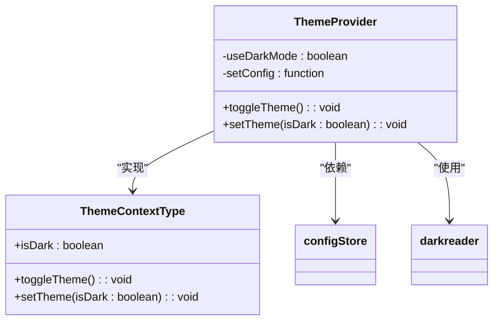
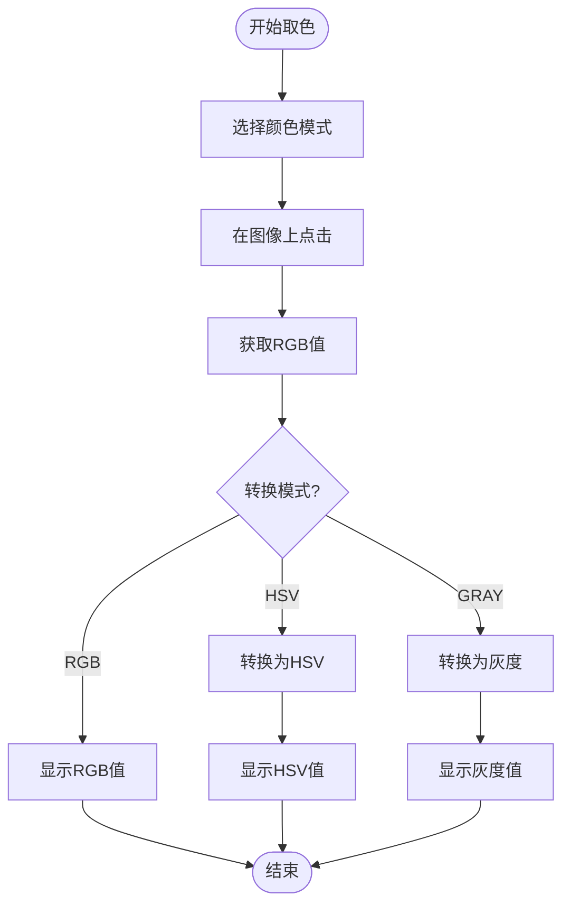
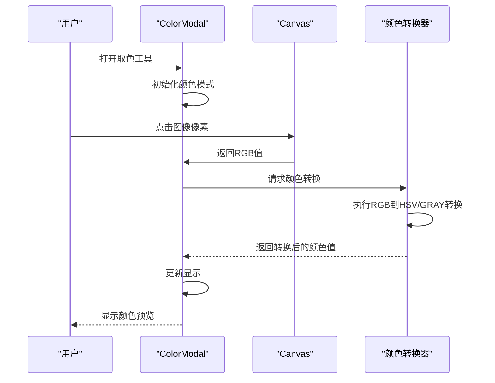
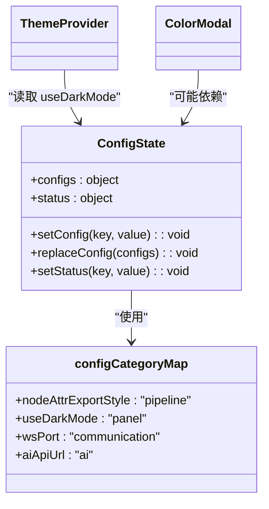

# 颜色模式

<cite>
**本文档中引用的文件**   
- [ThemeContext.tsx](file://src/contexts/ThemeContext.tsx)
- [ColorModal.tsx](file://src/components/modals/ColorModal.tsx)
- [configStore.ts](file://src/stores/configStore.ts)
- [App.tsx](file://src/App.tsx)
- [global.less](file://src/styles/global.less)
- [antd.less](file://src/styles/antd.less)
</cite>

## 目录
1. [简介](#简介)
2. [主题模式](#主题模式)
3. [颜色取样模式](#颜色取样模式)
4. [实现原理](#实现原理)
5. [配置管理](#配置管理)

## 简介
本项目中的"颜色模式"包含两个主要方面：全局主题模式和颜色取样模式。全局主题模式控制整个应用的明暗主题，而颜色取样模式则用于在图像处理和识别过程中选择和转换颜色空间。

**Section sources**
- [ThemeContext.tsx](file://src/contexts/ThemeContext.tsx#L1-L67)
- [ColorModal.tsx](file://src/components/modals/ColorModal.tsx#L1-L509)

## 主题模式
主题模式允许用户在明亮和暗黑主题之间切换，以适应不同的使用环境和偏好。该功能通过`ThemeProvider`组件实现，利用`darkreader`库动态调整页面样式。

主题模式的切换会持久化存储在应用配置中，确保用户下次打开应用时保持之前的设置。暗黑模式的配置包括亮度、对比度和棕褐色调等参数，以提供舒适的视觉体验。

**Diagram sources**
- [ThemeContext.tsx](file://src/contexts/ThemeContext.tsx#L11-L56)

**Section sources**
- [ThemeContext.tsx](file://src/contexts/ThemeContext.tsx#L1-L67)
- [App.tsx](file://src/App.tsx#L37-L258)

## 颜色取样模式
颜色取样模式是用于图像处理和识别的重要功能，支持三种颜色空间模式：RGB、HSV和灰度。用户可以通过取色工具从截图中选择特定像素的颜色，并在不同颜色空间之间进行转换。

### RGB模式
RGB模式使用红、绿、蓝三个通道来表示颜色，每个通道的值范围为0-255。这是最常用的颜色表示方法，直接对应显示器的像素值。

### HSV模式
HSV模式使用色相(Hue)、饱和度(Saturation)和明度(Value)来表示颜色。这种模式更符合人类对颜色的感知方式，特别适合颜色识别和过滤操作。在本实现中，HSV值的范围为H:0-180, S:0-255, V:0-255，符合OpenCV的标准。

### 灰度模式
灰度模式将颜色转换为单通道的亮度值，范围为0-255。这种模式通过加权平均RGB值计算得出，公式为：0.299×R + 0.587×G + 0.114×B，符合人眼对不同颜色的敏感度。

**Diagram sources**
- [ColorModal.tsx](file://src/components/modals/ColorModal.tsx#L8-L509)

**Section sources**
- [ColorModal.tsx](file://src/components/modals/ColorModal.tsx#L1-L509)

## 实现原理
颜色模式的实现基于React的上下文(Context)机制和状态管理。主题模式通过`ThemeContext`提供全局状态，而颜色取样模式则通过独立的模态组件实现。

颜色空间转换算法是颜色取样模式的核心，实现了RGB与HSV之间的双向转换，以及RGB到灰度的转换。这些转换算法确保了在不同颜色空间中选择的颜色能够正确对应。

**Diagram sources**
- [ColorModal.tsx](file://src/components/modals/ColorModal.tsx#L1-L509)

**Section sources**
- [ColorModal.tsx](file://src/components/modals/ColorModal.tsx#L50-L396)
- [ThemeContext.tsx](file://src/contexts/ThemeContext.tsx#L26-L37)

## 配置管理
颜色模式的配置通过`configStore`进行集中管理，使用Zustand库实现状态管理。所有配置项都被分类管理，主题相关的配置属于"panel"类别。

配置的持久化通过`replaceConfig`方法实现，支持配置的导入和导出。当配置发生变化时，相关组件会自动重新渲染，确保UI与状态同步。

**Diagram sources**
- [configStore.ts](file://src/stores/configStore.ts#L77-L206)

**Section sources**
- [configStore.ts](file://src/stores/configStore.ts#L1-L207)
- [ThemeContext.tsx](file://src/contexts/ThemeContext.tsx#L23-L24)