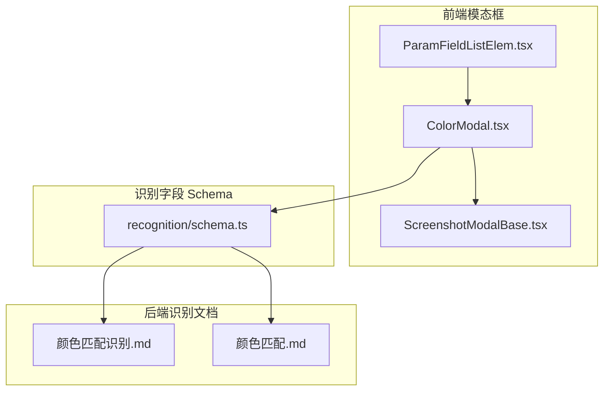
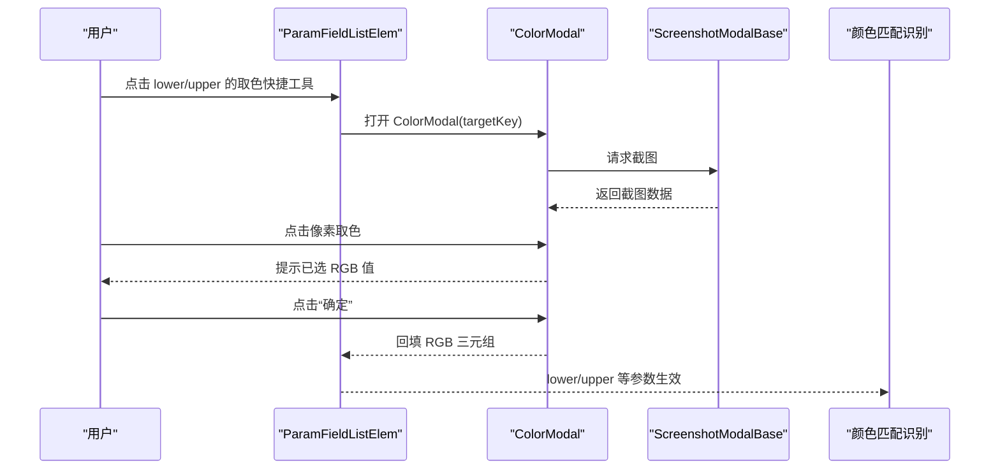
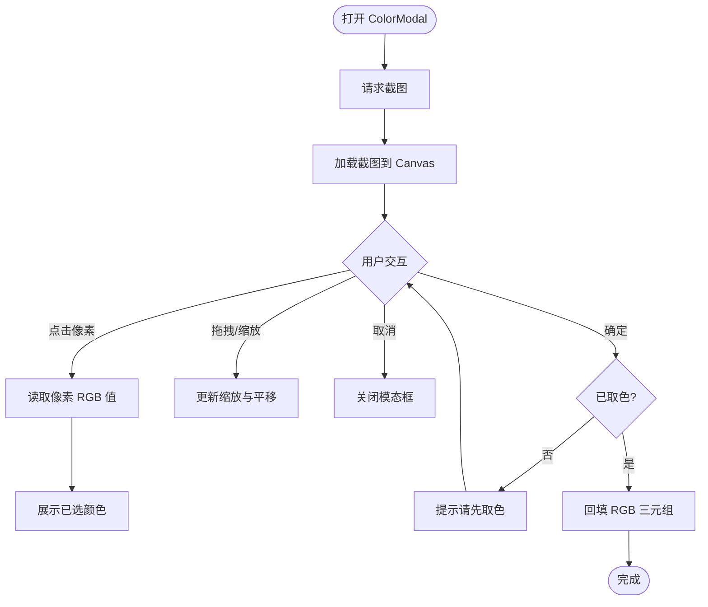
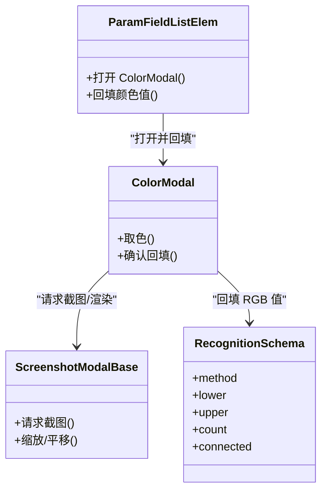

# 颜色识别模态框

<cite>
**本文引用的文件列表**
- [ColorModal.tsx](file://src/components/modals/ColorModal.tsx)
- [ScreenshotModalBase.tsx](file://src/components/modals/ScreenshotModalBase.tsx)
- [ParamFieldListElem.tsx](file://src/components/panels/field-items/ParamFieldListElem.tsx)
- [schema.ts](file://src/core/fields/recognition/schema.ts)
- [颜色匹配识别.md](file://instructions/maafw-golang/高级功能/流水线配置/节点结构详解/识别配置详解/颜色匹配识别.md)
- [颜色匹配.md](file://instructions/maafw-golang/高级功能/流水线配置/识别系统配置/颜色匹配.md)
</cite>

## 目录
1. [简介](#简介)
2. [项目结构](#项目结构)
3. [核心组件](#核心组件)
4. [架构总览](#架构总览)
5. [详细组件分析](#详细组件分析)
6. [依赖关系分析](#依赖关系分析)
7. [性能与鲁棒性考量](#性能与鲁棒性考量)
8. [故障排查指南](#故障排查指南)
9. [结论](#结论)
10. [附录](#附录)

## 简介
本文件面向“颜色识别模态框”（ColorModal）的前端实现与后端识别配置，帮助用户通过可视化取色工具快速获取颜色下界与上界参数，用于颜色匹配识别节点的配置。模态框基于截图交互，支持滚轮缩放、空格/中键拖拽平移、点击取色，并将取到的 RGB 三通道值回填至字段面板对应字段（lower/upper）。同时，文档梳理了颜色匹配识别在后端的参数体系（颜色空间、阈值范围、连通域分析等），并给出最佳实践与排障建议。

## 项目结构
颜色识别模态框由以下模块协同构成：
- ColorModal：颜色取色模态框，负责截图加载、Canvas 交互、取色与回填。
- ScreenshotModalBase：截图模态框基座，提供截图请求、缩放/平移、工具栏与底部操作按钮。
- ParamFieldListElem：字段面板元素，负责渲染字段输入项与快捷工具，触发 ColorModal 打开并回填颜色值。
- recognition/schema.ts：识别字段 Schema，定义颜色匹配相关字段（method、lower、upper、count、connected 等）。
- 颜色匹配识别文档：后端颜色匹配识别的参数说明、流程与最佳实践。

图表来源
- [ColorModal.tsx](file://src/components/modals/ColorModal.tsx#L1-L233)
- [ScreenshotModalBase.tsx](file://src/components/modals/ScreenshotModalBase.tsx#L1-L293)
- [ParamFieldListElem.tsx](file://src/components/panels/field-items/ParamFieldListElem.tsx#L1-L478)
- [schema.ts](file://src/core/fields/recognition/schema.ts#L116-L148)
- [颜色匹配识别.md](file://instructions/maafw-golang/高级功能/流水线配置/节点结构详解/识别配置详解/颜色匹配识别.md#L94-L121)
- [颜色匹配.md](file://instructions/maafw-golang/高级功能/流水线配置/识别系统配置/颜色匹配.md#L88-L112)

章节来源
- [ColorModal.tsx](file://src/components/modals/ColorModal.tsx#L1-L233)
- [ScreenshotModalBase.tsx](file://src/components/modals/ScreenshotModalBase.tsx#L1-L293)
- [ParamFieldListElem.tsx](file://src/components/panels/field-items/ParamFieldListElem.tsx#L1-L478)
- [schema.ts](file://src/core/fields/recognition/schema.ts#L116-L148)
- [颜色匹配识别.md](file://instructions/maafw-golang/高级功能/流水线配置/节点结构详解/识别配置详解/颜色匹配识别.md#L94-L121)
- [颜色匹配.md](file://instructions/maafw-golang/高级功能/流水线配置/识别系统配置/颜色匹配.md#L88-L112)

## 核心组件
- ColorModal：提供“取色”能力，支持点击像素点读取 RGB 值，提示已选颜色并允许确认回填。
- ScreenshotModalBase：提供截图请求、缩放/平移、工具栏与底部操作按钮，作为所有“基于截图”的模态框基座。
- ParamFieldListElem：在字段面板中为 lower/upper 字段提供快捷取色入口，打开 ColorModal 并将取到的颜色值规范化后回填。
- recognition/schema.ts：定义颜色匹配识别的关键字段，包括颜色空间（method）、颜色下限/上限（lower/upper）、像素计数阈值（count）、连通域分析（connected）等。

章节来源
- [ColorModal.tsx](file://src/components/modals/ColorModal.tsx#L1-L233)
- [ScreenshotModalBase.tsx](file://src/components/modals/ScreenshotModalBase.tsx#L1-L293)
- [ParamFieldListElem.tsx](file://src/components/panels/field-items/ParamFieldListElem.tsx#L1-L478)
- [schema.ts](file://src/core/fields/recognition/schema.ts#L116-L148)

## 架构总览
颜色识别模态框从前端到后端的交互流程如下：
- 用户在字段面板点击“取色”快捷工具，打开 ColorModal。
- ColorModal 通过 ScreenshotModalBase 请求截图并在 Canvas 上渲染。
- 用户点击屏幕像素取色，ColorModal 读取该像素 RGB 值并提示。
- 用户确认后，ColorModal 将 RGB 三元组回填至字段面板对应字段（lower/upper）。
- 后端识别节点使用 lower/upper、method、count、connected 等参数进行颜色匹配与连通域分析。

图表来源
- [ParamFieldListElem.tsx](file://src/components/panels/field-items/ParamFieldListElem.tsx#L244-L257)
- [ColorModal.tsx](file://src/components/modals/ColorModal.tsx#L176-L182)
- [ScreenshotModalBase.tsx](file://src/components/modals/ScreenshotModalBase.tsx#L107-L149)
- [schema.ts](file://src/core/fields/recognition/schema.ts#L116-L148)

## 详细组件分析

### ColorModal 组件
- 截图加载与 Canvas 渲染
  - 通过 ScreenshotModalBase 的 onScreenshotChange 回调接收截图数据，使用 Image 对象加载并绘制到 Canvas。
  - 支持缩放与平移（滚轮缩放、空格/中键拖拽），取色时根据 scale 将屏幕坐标映射到画布像素坐标。
- 取色逻辑
  - 点击 Canvas 像素点，读取该点的 ImageData，提取 RGB 三通道值，保存到 pickedColor 并提示。
- 确认回填
  - 点击“确定”按钮时，若未取色则提示“请先在截图上点击取色”；否则调用 onConfirm 回传 RGB 三元组并关闭模态框。
- 标题与目标字段
  - 根据 targetKey 生成标题，区分“下界颜色”“上界颜色”等场景。

图表来源
- [ColorModal.tsx](file://src/components/modals/ColorModal.tsx#L28-L64)
- [ColorModal.tsx](file://src/components/modals/ColorModal.tsx#L66-L91)
- [ColorModal.tsx](file://src/components/modals/ColorModal.tsx#L102-L174)
- [ColorModal.tsx](file://src/components/modals/ColorModal.tsx#L176-L182)

章节来源
- [ColorModal.tsx](file://src/components/modals/ColorModal.tsx#L1-L233)

### ScreenshotModalBase 组件
- 截图请求与监听
  - 通过 mfwProtocol.requestScreencap 请求截图，监听 onScreencapResult 回调，成功后设置 screenshot 并通知子组件。
- 视口控制
  - 提供缩放、平移、重置等能力，供子组件渲染 Canvas 时使用。
- 模态框布局
  - 提供工具栏、截图显示区、子内容区与底部操作按钮（重新截图、取消、确定）。

章节来源
- [ScreenshotModalBase.tsx](file://src/components/modals/ScreenshotModalBase.tsx#L1-L293)

### ParamFieldListElem 组件
- 快捷工具
  - 为 roi/expected/template/lower/upper 等字段提供快捷工具图标，点击后打开对应模态框。
- 打开 ColorModal
  - 当 key 为 lower 或 upper 时，打开 ColorModal，并将当前字段 key 与列表索引传递给 ColorModal。
- 回填逻辑
  - ColorModal 确认后，ParamFieldListElem 将 RGB 三元组规范化为二维数组（若为单个 lower/upper 值则转为 [[r,g,b]]），并调用 onChange 更新字段值。

章节来源
- [ParamFieldListElem.tsx](file://src/components/panels/field-items/ParamFieldListElem.tsx#L1-L478)

### 识别字段 Schema（颜色匹配）
- 关键字段
  - method：颜色空间（RGB/HSV/GRAY），默认 RGB。
  - lower/upper：颜色下限/上限，最内层数组长度需与 method 通道数一致（RGB/HSV 为 3，GRAY 为 1）。
  - count：最小像素计数阈值，默认 1。
  - connected：是否进行连通域分析，默认 false。
- 用途
  - 作为颜色匹配识别节点的参数来源，与后端识别流程对接。

章节来源
- [schema.ts](file://src/core/fields/recognition/schema.ts#L116-L148)

### 后端颜色匹配识别（文档要点）
- 参数与流程
  - 方法：RGB（默认）、HSV、GRAY。
  - Lower/Upper：每组边界长度需与 Method 通道数一致；可提供多组边界实现“或”组合。
  - Count：仅在 Connected 为真时作为最小连通区域像素数门槛。
  - Connected：启用后对颜色区域进行连通分量标记，再按阈值与排序策略输出。
- 最佳实践
  - RGB 适合明亮、无阴影场景；HSV 更稳定，适合光照变化。
  - Lower/Upper 应覆盖目标颜色的容差范围，避免误判。
  - Connected 打开后能过滤分散噪点，但会增加计算成本。

章节来源
- [颜色匹配识别.md](file://instructions/maafw-golang/高级功能/流水线配置/节点结构详解/识别配置详解/颜色匹配识别.md#L94-L121)
- [颜色匹配识别.md](file://instructions/maafw-golang/高级功能/流水线配置/节点结构详解/识别配置详解/颜色匹配识别.md#L147-L156)
- [颜色匹配识别.md](file://instructions/maafw-golang/高级功能/流水线配置/节点结构详解/识别配置详解/颜色匹配识别.md#L203-L212)
- [颜色匹配.md](file://instructions/maafw-golang/高级功能/流水线配置/识别系统配置/颜色匹配.md#L88-L112)
- [颜色匹配.md](file://instructions/maafw-golang/高级功能/流水线配置/识别系统配置/颜色匹配.md#L117-L126)

## 依赖关系分析
- ColorModal 依赖 ScreenshotModalBase 提供截图与视口控制。
- ParamFieldListElem 依赖 ColorModal 打开取色并回填字段值。
- recognition/schema.ts 定义颜色匹配字段，为 ColorModal 回填的 RGB 值提供规范化的存储结构。
- 后端颜色匹配识别文档定义 lower/upper、method、count、connected 等参数的语义与使用方式。

图表来源
- [ParamFieldListElem.tsx](file://src/components/panels/field-items/ParamFieldListElem.tsx#L244-L257)
- [ColorModal.tsx](file://src/components/modals/ColorModal.tsx#L176-L182)
- [ScreenshotModalBase.tsx](file://src/components/modals/ScreenshotModalBase.tsx#L107-L149)
- [schema.ts](file://src/core/fields/recognition/schema.ts#L116-L148)

章节来源
- [ParamFieldListElem.tsx](file://src/components/panels/field-items/ParamFieldListElem.tsx#L1-L478)
- [ColorModal.tsx](file://src/components/modals/ColorModal.tsx#L1-L233)
- [ScreenshotModalBase.tsx](file://src/components/modals/ScreenshotModalBase.tsx#L1-L293)
- [schema.ts](file://src/core/fields/recognition/schema.ts#L116-L148)

## 性能与鲁棒性考量
- 颜色空间选择
  - RGB：计算量较小，但易受光照影响；适合高对比度、色彩明确的场景。
  - HSV：对光照变化更稳健，适合明暗变化大但颜色稳定的场景。
  - GRAY：单通道灰度匹配，适合灰度特征或已转换为灰度的场景。
- Lower/Upper 设定
  - 建议先粗后细，逐步收紧；过窄会漏检，过宽会引入噪声。
- Count 与 Connected
  - Count 作为像素计数阈值，过滤掉面积过小的噪声区域；Connected 启用后对颜色区域进行连通分量标记，有助于识别不规则色块。
- ROI/ROIOffset
  - 缩小识别区域可显著降低计算量，建议在保证精度的前提下尽量限定范围。

章节来源
- [颜色匹配识别.md](file://instructions/maafw-golang/高级功能/流水线配置/节点结构详解/识别配置详解/颜色匹配识别.md#L244-L255)
- [颜色匹配.md](file://instructions/maafw-golang/高级功能/流水线配置/识别系统配置/颜色匹配.md#L201-L212)

## 故障排查指南
- 未取色就点击“确定”
  - 现象：弹出提示“请先在截图上点击取色”。
  - 处理：先点击像素取色，再确认。
- 回填值格式不正确
  - 现象：lower/upper 字段值不是二维数组。
  - 处理：ParamFieldListElem 会将单个 RGB 三元组规范化为二维数组；检查字段类型与 Schema 定义。
- 颜色空间与边界长度不匹配
  - 现象：参数解析失败或识别结果异常。
  - 处理：确保 method 的通道数与 lower/upper 每组长度一致（RGB/HSV 为 3，GRAY 为 1）。
- Count 过小导致误检
  - 现象：出现大量小面积伪阳性。
  - 处理：适当提高 count，或开启 connected 并结合 area 排序。
- Connected 未开启导致碎片化
  - 现象：目标被拆分为多个小区域。
  - 处理：开启 connected，并结合 count 过滤。
- 多组范围未覆盖全场景
  - 现象：不同光照下识别不稳定。
  - 处理：增加多组 lower/upper，覆盖典型光照区间。

章节来源
- [ParamFieldListElem.tsx](file://src/components/panels/field-items/ParamFieldListElem.tsx#L204-L233)
- [schema.ts](file://src/core/fields/recognition/schema.ts#L116-L148)
- [颜色匹配识别.md](file://instructions/maafw-golang/高级功能/流水线配置/节点结构详解/识别配置详解/颜色匹配识别.md#L259-L271)
- [颜色匹配.md](file://instructions/maafw-golang/高级功能/流水线配置/识别系统配置/颜色匹配.md#L213-L230)

## 结论
颜色识别模态框通过“取色—回填—识别”的闭环，简化了颜色匹配识别节点的参数配置过程。前端提供直观的截图交互与取色体验，后端通过 method、lower/upper、count、connected 等参数实现稳健的颜色匹配与连通域分析。结合最佳实践与排障建议，用户可以在不同光照与复杂背景下获得稳定可靠的识别效果。

## 附录
- 使用建议
  - 先用 HSV 适配光照变化，再用 RGB 精细定位；必要时开启 connected 并设置合理的 count。
  - lower/upper 建议采用多组范围覆盖不同场景，避免单一阈值导致误判或漏检。
- 相关实现参考
  - 颜色匹配识别参数与工厂函数：见后端文档与测试用例路径。

章节来源
- [颜色匹配识别.md](file://instructions/maafw-golang/高级功能/流水线配置/节点结构详解/识别配置详解/颜色匹配识别.md#L188-L198)
- [颜色匹配.md](file://instructions/maafw-golang/高级功能/流水线配置/识别系统配置/颜色匹配.md#L145-L165)