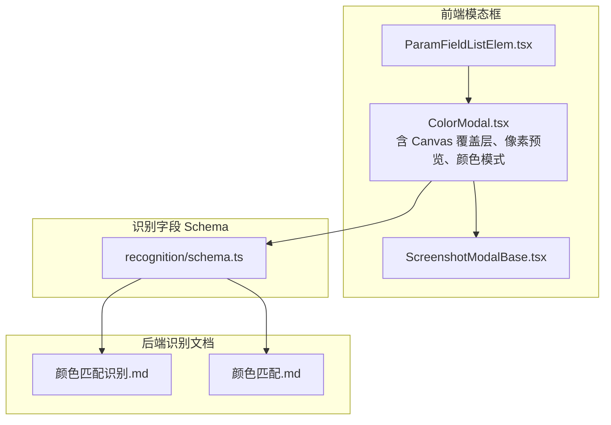
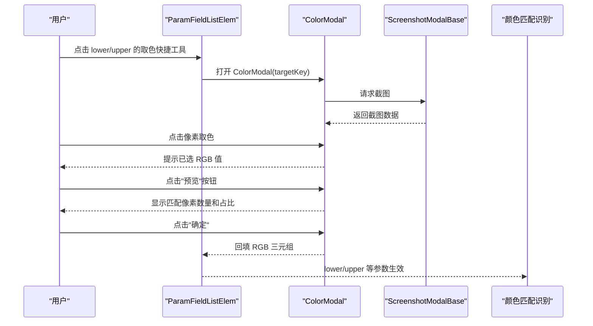
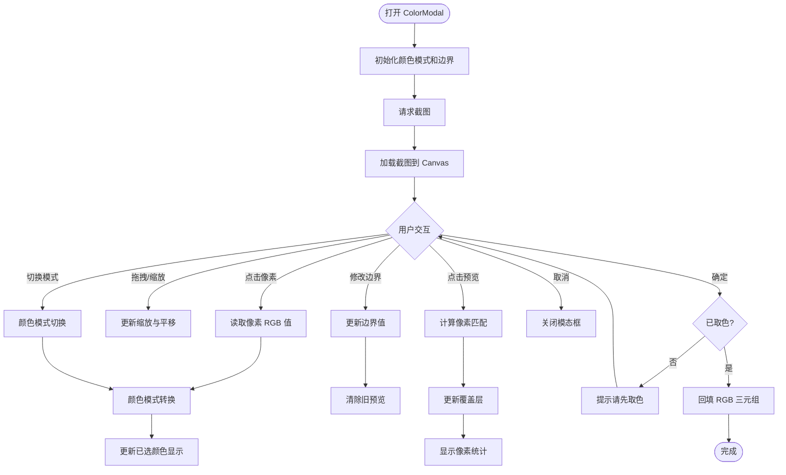
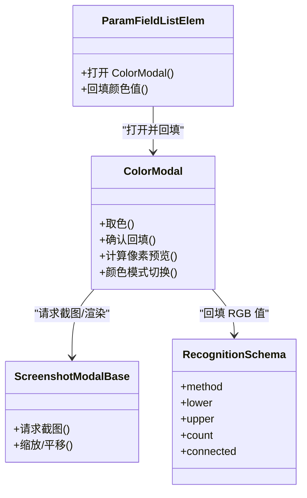

# 颜色识别模态框

<cite>
**本文档引用的文件**
- [ColorModal.tsx](file://src/components/modals/ColorModal.tsx)
- [ScreenshotModalBase.tsx](file://src/components/modals/ScreenshotModalBase.tsx)
- [ParamFieldListElem.tsx](file://src/components/panels/field/items/ParamFieldListElem.tsx)
- [schema.ts](file://src/core/fields/recognition/schema.ts)
- [颜色匹配.md](file://instructions/maafw-golang-binding/高级功能/流水线配置/颜色匹配.md)
- [颜色匹配识别.md](file://instructions/maafw-golang-binding/高级功能/流水线配置/节点结构详解/识别配置详解/颜色匹配识别.md)
</cite>

## 更新摘要
**变更内容**
- 新增 Canvas 覆盖层功能，支持半透明绿色高亮命中像素和半透明黑色遮罩非命中像素
- 新增像素匹配预览功能，实时计算并显示颜色范围内的像素数量和占比
- 新增颜色模式支持，包括 RGB、HSV、GRAY 三种颜色空间的切换和转换
- 新增颜色范围边界输入控件，支持动态调整下界和上界的通道值
- 新增颜色模式检测和自动初始化功能
- 新增取色后自动填入对应边界的功能

## 目录
1. [简介](#简介)
2. [项目结构](#项目结构)
3. [核心组件](#核心组件)
4. [架构总览](#架构总览)
5. [详细组件分析](#详细组件分析)
6. [依赖关系分析](#依赖关系分析)
7. [性能与鲁棒性考量](#性能与鲁棒性考量)
8. [故障排查指南](#故障排查指南)
9. [结论](#结论)
10. [附录](#附录)

## 简介
本文件面向"颜色识别模态框"（ColorModal）的前端实现与后端识别配置，经过重大增强后，现支持 Canvas 覆盖层、像素匹配预览、颜色模式支持等新功能。用户可以通过可视化取色工具快速获取颜色下界与上界参数，模态框基于截图交互，支持滚轮缩放、空格/中键拖拽平移、点击取色，并将取到的 RGB 三通道值回填至字段面板对应字段（lower/upper）。同时，新增的颜色范围预览功能可以实时显示颜色匹配的像素统计信息，帮助用户优化颜色阈值设置。

## 项目结构
颜色识别模态框由以下模块协同构成：
- ColorModal：颜色取色模态框，负责截图加载、Canvas 交互、取色与回填，现支持 Canvas 覆盖层和像素预览功能。
- ScreenshotModalBase：截图模态框基座，提供截图请求、缩放/平移、工具栏与底部操作按钮。
- ParamFieldListElem：字段面板元素，负责渲染字段输入项与快捷工具，触发 ColorModal 打开并回填颜色值。
- recognition/schema.ts：识别字段 Schema，定义颜色匹配相关字段（method、lower、upper、count、connected 等）。
- 颜色匹配识别文档：后端颜色匹配识别的参数说明、流程与最佳实践。

**图表来源**
- [ColorModal.tsx](file://src/components/modals/ColorModal.tsx#L1-L972)
- [ScreenshotModalBase.tsx](file://src/components/modals/ScreenshotModalBase.tsx#L1-L405)
- [ParamFieldListElem.tsx](file://src/components/panels/field/items/ParamFieldListElem.tsx#L1-L760)
- [schema.ts](file://src/core/fields/recognition/schema.ts#L116-L148)

**章节来源**
- [ColorModal.tsx](file://src/components/modals/ColorModal.tsx#L1-L972)
- [ScreenshotModalBase.tsx](file://src/components/modals/ScreenshotModalBase.tsx#L1-L405)
- [ParamFieldListElem.tsx](file://src/components/panels/field/items/ParamFieldListElem.tsx#L1-L760)
- [schema.ts](file://src/core/fields/recognition/schema.ts#L116-L148)

## 核心组件
- **ColorModal**：提供"取色"能力，支持点击像素点读取 RGB 值，提示已选颜色并允许确认回填。现已增强支持 Canvas 覆盖层、像素匹配预览、颜色模式切换等功能。
- **ScreenshotModalBase**：提供截图请求、缩放/平移、工具栏与底部操作按钮，作为所有"基于截图"的模态框基座。
- **ParamFieldListElem**：在字段面板中为 lower/upper 字段提供快捷取色入口，打开 ColorModal 并将取到的颜色值规范化后回填。
- **recognition/schema.ts**：定义颜色匹配识别的关键字段，包括颜色空间（method）、颜色下限/上限（lower/upper）、像素计数阈值（count）、连通域分析（connected）等。

**章节来源**
- [ColorModal.tsx](file://src/components/modals/ColorModal.tsx#L1-L972)
- [ScreenshotModalBase.tsx](file://src/components/modals/ScreenshotModalBase.tsx#L1-L405)
- [ParamFieldListElem.tsx](file://src/components/panels/field/items/ParamFieldListElem.tsx#L1-L760)
- [schema.ts](file://src/core/fields/recognition/schema.ts#L116-L148)

## 架构总览
颜色识别模态框从前端到后端的交互流程如下：
- 用户在字段面板点击"取色"快捷工具，打开 ColorModal。
- ColorModal 通过 ScreenshotModalBase 请求截图并在 Canvas 上渲染。
- 用户点击屏幕像素取色，ColorModal 读取该像素 RGB 值并提示。
- 用户确认后，ColorModal 将 RGB 三元组回填至字段面板对应字段（lower/upper）。
- 新增的颜色范围预览功能可以实时计算并显示匹配像素数量和占比。
- 后端识别节点使用 lower/upper、method、count、connected 等参数进行颜色匹配与连通域分析。

**图表来源**
- [ParamFieldListElem.tsx](file://src/components/panels/field/items/ParamFieldListElem.tsx#L281-L310)
- [ColorModal.tsx](file://src/components/modals/ColorModal.tsx#L396-L405)
- [ScreenshotModalBase.tsx](file://src/components/modals/ScreenshotModalBase.tsx#L124-L144)
- [schema.ts](file://src/core/fields/recognition/schema.ts#L116-L148)

## 详细组件分析

### ColorModal 组件（重大增强）

#### Canvas 覆盖层功能
- **覆盖层 Canvas**：新增 overlayCanvasRef 引用，用于在主 Canvas 上层绘制覆盖效果。
- **命中像素高亮**：当像素匹配成功时，使用半透明绿色（RGBA: 0, 255, 0, 100）高亮显示。
- **非命中像素遮罩**：当像素不匹配时，使用半透明黑色（RGBA: 0, 0, 0, 120）遮罩显示。
- **实时预览**：computePreview 函数遍历所有像素，计算匹配结果并更新覆盖层。

#### 像素匹配预览功能
- **像素统计**：computePreview 函数计算匹配到的像素数量和占总像素的比例。
- **实时反馈**：预览完成后通过消息提示显示匹配结果，包括像素数量和百分比。
- **预览状态管理**：使用 previewActive 和 matchedPixelCount 状态跟踪预览状态和结果。

#### 颜色模式支持
- **颜色模式类型**：支持 RGB、HSV、GRAY 三种颜色空间，通过 ColorMode 类型定义。
- **模式切换**：handleColorModeChange 函数支持在不同颜色模式间切换，并自动转换颜色值。
- **通道信息**：getChannelInfo 函数根据当前颜色模式返回通道数量、标签和最大值。
- **颜色转换**：提供 rgbToHsv、hsvToRgb、rgbToGray 等转换函数。

#### 颜色范围边界管理
- **边界状态**：使用 lowerBound 和 upperBound 状态管理颜色范围的下界和上界。
- **动态输入**：handleBoundChange 函数处理边界值的动态修改，支持 RGB/HSV/GRAY 通道。
- **自动填入**：取色后自动填入对应边界（targetKey 为 lower 或 upper 时）。

**图表来源**
- [ColorModal.tsx](file://src/components/modals/ColorModal.tsx#L47-L92)
- [ColorModal.tsx](file://src/components/modals/ColorModal.tsx#L232-L331)
- [ColorModal.tsx](file://src/components/modals/ColorModal.tsx#L426-L475)
- [ColorModal.tsx](file://src/components/modals/ColorModal.tsx#L209-L230)

**章节来源**
- [ColorModal.tsx](file://src/components/modals/ColorModal.tsx#L1-L972)

### ScreenshotModalBase 组件
- **截图请求与监听**：通过 mfwProtocol.requestScreencap 请求截图，监听 onScreencapResult 回调，成功后设置 screenshot 并通知子组件。
- **视口控制**：提供缩放、平移、重置等能力，供子组件渲染 Canvas 时使用。
- **模态框布局**：提供工具栏、截图显示区、子内容区与底部操作按钮（重新截图、取消、确定）。

**章节来源**
- [ScreenshotModalBase.tsx](file://src/components/modals/ScreenshotModalBase.tsx#L1-L405)

### ParamFieldListElem 组件
- **快捷工具**：为 roi/expected/template/lower/upper 等字段提供快捷工具图标，点击后打开对应模态框。
- **打开 ColorModal**：当 key 为 lower 或 upper 时，打开 ColorModal，并将当前字段 key 与列表索引传递给 ColorModal。
- **回填逻辑**：ColorModal 确认后，ParamFieldListElem 将 RGB 三元组规范化为二维数组（若为单个 lower/upper 值则转为 [[r,g,b]]），并调用 onChange 更新字段值。

**章节来源**
- [ParamFieldListElem.tsx](file://src/components/panels/field/items/ParamFieldListElem.tsx#L1-L760)

### 识别字段 Schema（颜色匹配）
- **关键字段**
  - method：颜色空间（RGB/HSV/GRAY），默认 RGB。
  - lower/upper：颜色下限/上限，最内层数组长度需与 method 通道数一致（RGB/HSV 为 3，GRAY 为 1）。
  - count：最小像素计数阈值，默认 1。
  - connected：是否进行连通域分析，默认 false。
- **用途**：作为颜色匹配识别节点的参数来源，与后端识别流程对接。

**章节来源**
- [schema.ts](file://src/core/fields/recognition/schema.ts#L116-L148)

### 后端颜色匹配识别（文档要点）
- **参数与流程**
  - 方法：RGB（默认）、HSV、GRAY。
  - Lower/Upper：每组边界长度需与 Method 通道数一致；可提供多组边界实现"或"组合。
  - Count：仅在 Connected 为真时作为最小连通区域像素数门槛。
  - Connected：启用后对颜色区域进行连通分量标记，再按阈值与排序策略输出。
- **最佳实践**
  - RGB 适合明亮、无阴影场景；HSV 更稳定，适合光照变化。
  - Lower/Upper 应覆盖目标颜色的容差范围，避免误判。
  - Connected 打开后能过滤分散噪点，但会增加计算成本。

**章节来源**
- [颜色匹配识别.md](file://instructions/maafw-golang-binding/高级功能/流水线配置/节点结构详解/识别配置详解/颜色匹配识别.md#L94-L121)
- [颜色匹配识别.md](file://instructions/maafw-golang-binding/高级功能/流水线配置/节点结构详解/识别配置详解/颜色匹配识别.md#L147-L156)
- [颜色匹配识别.md](file://instructions/maafw-golang-binding/高级功能/流水线配置/节点结构详解/识别配置详解/颜色匹配识别.md#L203-L212)
- [颜色匹配.md](file://instructions/maafw-golang-binding/高级功能/流水线配置/颜色匹配.md#L88-L112)
- [颜色匹配.md](file://instructions/maafw-golang-binding/高级功能/流水线配置/颜色匹配.md#L117-L126)

## 依赖关系分析
- **ColorModal 依赖** ScreenshotModalBase 提供截图与视口控制。
- **ParamFieldListElem 依赖** ColorModal 打开取色并回填字段值。
- **recognition/schema.ts 定义** 颜色匹配字段，为 ColorModal 回填的 RGB 值提供规范化的存储结构。
- **后端颜色匹配识别文档** 定义 lower/upper、method、count、connected 等参数的语义与使用方式。

**图表来源**
- [ParamFieldListElem.tsx](file://src/components/panels/field/items/ParamFieldListElem.tsx#L281-L310)
- [ColorModal.tsx](file://src/components/modals/ColorModal.tsx#L396-L405)
- [ScreenshotModalBase.tsx](file://src/components/modals/ScreenshotModalBase.tsx#L124-L144)
- [schema.ts](file://src/core/fields/recognition/schema.ts#L116-L148)

**章节来源**
- [ParamFieldListElem.tsx](file://src/components/panels/field/items/ParamFieldListElem.tsx#L1-L760)
- [ColorModal.tsx](file://src/components/modals/ColorModal.tsx#L1-L972)
- [ScreenshotModalBase.tsx](file://src/components/modals/ScreenshotModalBase.tsx#L1-L405)
- [schema.ts](file://src/core/fields/recognition/schema.ts#L116-L148)

## 性能与鲁棒性考量
- **颜色空间选择**
  - RGB：计算量较小，但易受光照影响；适合高对比度、色彩明确的场景。
  - HSV：对光照变化更稳健，适合明暗变化大但颜色稳定的场景。
  - GRAY：单通道灰度匹配，适合灰度特征或已转换为灰度的场景。
- **Lower/Upper 设定**
  - 建议先粗后细，逐步收紧；过窄会漏检，过宽会引入噪声。
- **Count 与 Connected**
  - Count 作为像素计数阈值，过滤掉面积过小的噪声区域；Connected 启用后对颜色区域进行连通分量标记，有助于识别不规则色块。
- **ROI/ROIOffset**
  - 缩小识别区域可显著降低计算量，建议在保证精度的前提下尽量限定范围。
- **Canvas 性能优化**
  - 覆盖层使用 ImageData 直接操作像素，避免逐像素 DOM 操作的性能损耗。
  - 预览计算使用 requestAnimationFrame 异步处理，避免阻塞主线程。

**章节来源**
- [颜色匹配识别.md](file://instructions/maafw-golang-binding/高级功能/流水线配置/节点结构详解/识别配置详解/颜色匹配识别.md#L244-L255)
- [颜色匹配.md](file://instructions/maafw-golang-binding/高级功能/流水线配置/颜色匹配.md#L201-L212)

## 故障排查指南
- **未取色就点击"确定"**
  - 现象：弹出提示"请先在截图上点击取色"。
  - 处理：先点击像素取色，再确认。
- **回填值格式不正确**
  - 现象：lower/upper 字段值不是二维数组。
  - 处理：ParamFieldListElem 会将单个 RGB 三元组规范化为二维数组；检查字段类型与 Schema 定义。
- **颜色空间与边界长度不匹配**
  - 现象：参数解析失败或识别结果异常。
  - 处理：确保 method 的通道数与 lower/upper 每组长度一致（RGB/HSV 为 3，GRAY 为 1）。
- **预览计算失败**
  - 现象：点击预览按钮无响应或报错。
  - 处理：检查截图是否加载完成，确保 Canvas 和 ImageData 正常；确认颜色模式与边界值有效。
- **颜色模式切换异常**
  - 现象：切换颜色模式后颜色值显示错误。
  - 处理：检查颜色转换函数是否正常工作，确认 RGB、HSV、GRAY 之间的转换逻辑。
- **Count 过小导致误检**
  - 现象：出现大量小面积伪阳性。
  - 处理：适当提高 count，或开启 connected 并结合 area 排序。
- **Connected 未开启导致碎片化**
  - 现象：目标被拆分为多个小区域。
  - 处理：开启 connected，并结合 count 过滤。
- **多组范围未覆盖全场景**
  - 现象：不同光照下识别不稳定。
  - 处理：增加多组 lower/upper，覆盖典型光照区间。

**章节来源**
- [ParamFieldListElem.tsx](file://src/components/panels/field/items/ParamFieldListElem.tsx#L281-L310)
- [schema.ts](file://src/core/fields/recognition/schema.ts#L116-L148)
- [ColorModal.tsx](file://src/components/modals/ColorModal.tsx#L232-L331)
- [颜色匹配识别.md](file://instructions/maafw-golang-binding/高级功能/流水线配置/节点结构详解/识别配置详解/颜色匹配识别.md#L259-L271)
- [颜色匹配.md](file://instructions/maafw-golang-binding/高级功能/流水线配置/颜色匹配.md#L213-L230)

## 结论
颜色识别模态框经过重大增强后，通过"取色—预览—回填—识别"的完整闭环，大幅提升了颜色匹配识别节点的参数配置效率和准确性。新增的 Canvas 覆盖层功能提供了直观的视觉反馈，像素匹配预览功能帮助用户实时了解颜色阈值的效果，颜色模式支持使得用户可以在不同颜色空间间灵活切换。前端提供直观的截图交互与取色体验，后端通过 method、lower/upper、count、connected 等参数实现稳健的颜色匹配与连通域分析。结合最佳实践与排障建议，用户可以在不同光照与复杂背景下获得稳定可靠的识别效果。

## 附录
- **使用建议**
  - 先用 HSV 适配光照变化，再用 RGB 精细定位；必要时开启 connected 并设置合理的 count。
  - lower/upper 建议采用多组范围覆盖不同场景，避免单一阈值导致误判或漏检。
  - 利用预览功能实时查看像素匹配效果，快速调整颜色阈值。
- **相关实现参考**
  - 颜色匹配识别参数与工厂函数：见后端文档与测试用例路径。
- **技术特性**
  - Canvas 覆盖层：半透明绿色高亮命中像素，半透明黑色遮罩非命中像素。
  - 像素统计：实时计算并显示匹配像素数量和占比。
  - 颜色转换：RGB、HSV、GRAY 三种颜色空间间的双向转换。
  - 动态预览：异步计算像素匹配结果，避免阻塞用户交互。

**章节来源**
- [颜色匹配识别.md](file://instructions/maafw-golang-binding/高级功能/流水线配置/节点结构详解/识别配置详解/颜色匹配识别.md#L188-L198)
- [颜色匹配.md](file://instructions/maafw-golang-binding/高级功能/流水线配置/颜色匹配.md#L145-L165)
- [ColorModal.tsx](file://src/components/modals/ColorModal.tsx#L232-L331)