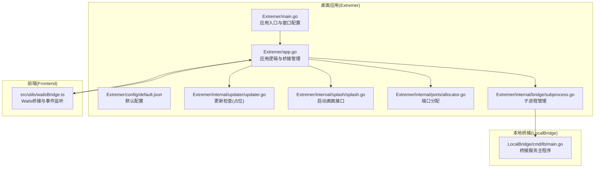
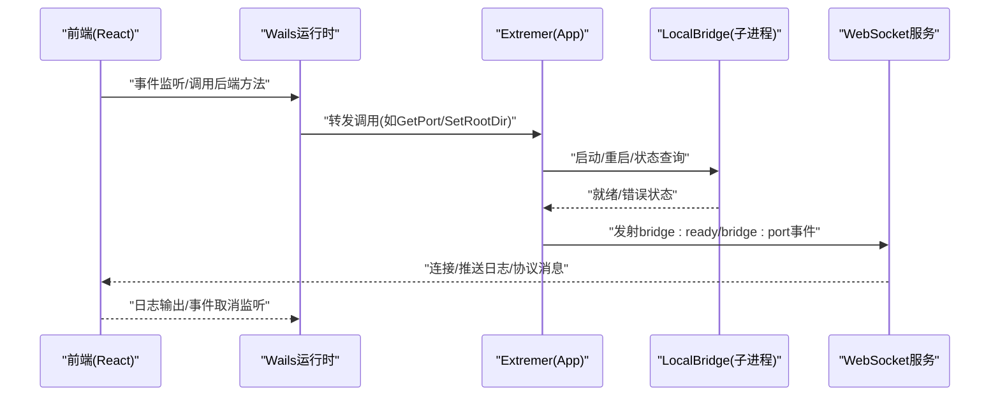
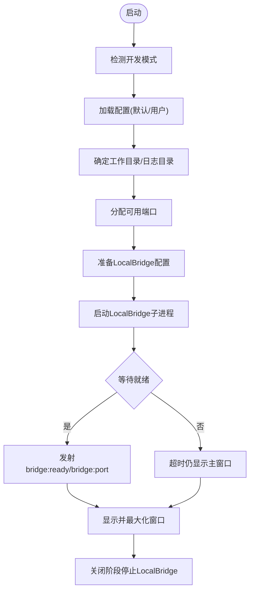
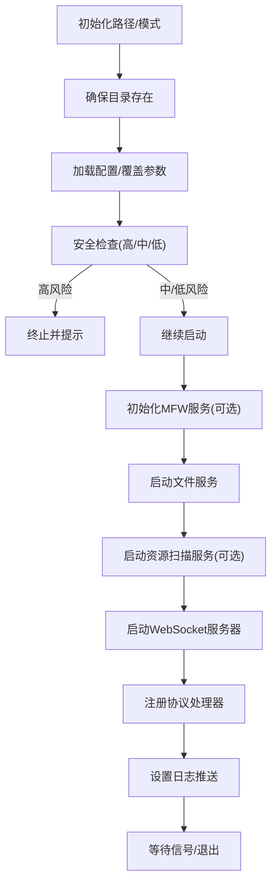
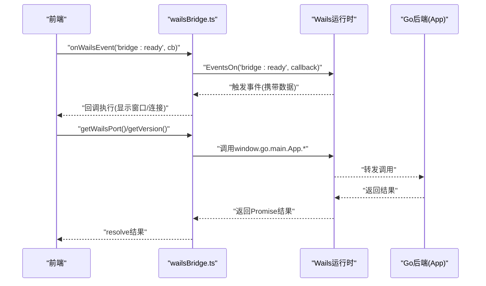
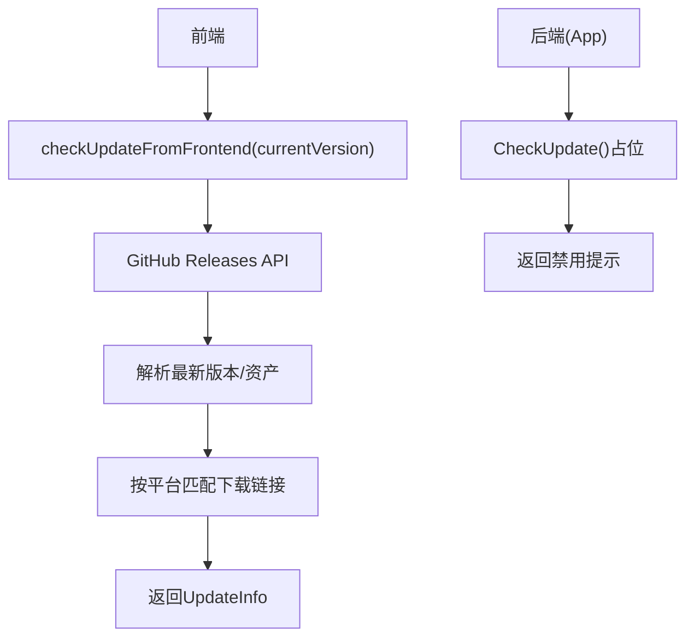
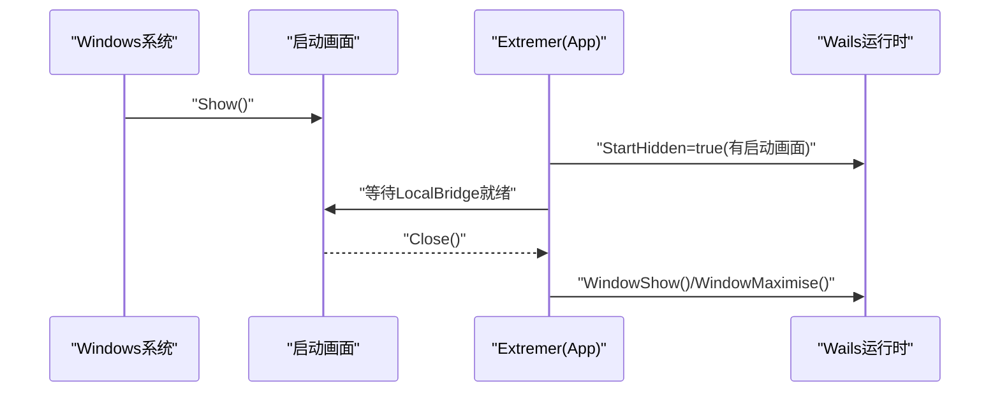
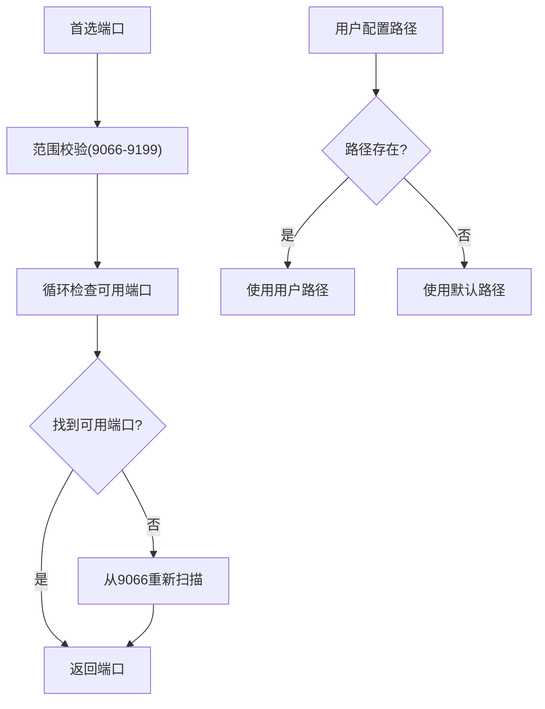
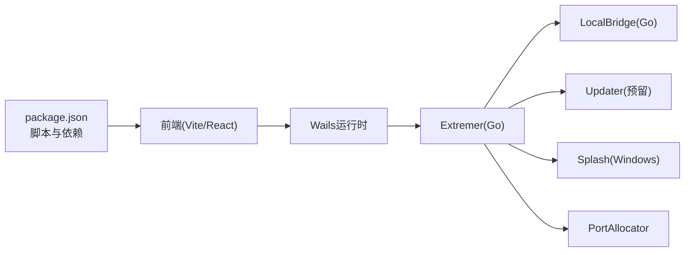

# 桌面应用

<cite>
**本文引用的文件**
- [Extremer/main.go](file://Extremer/main.go)
- [Extremer/app.go](file://Extremer/app.go)
- [Extremer/wails.json](file://Extremer/wails.json)
- [Extremer/go.mod](file://Extremer/go.mod)
- [Extremer/config/default.json](file://Extremer/config/default.json)
- [Extremer/internal/updater/updater.go](file://Extremer/internal/updater/updater.go)
- [Extremer/internal/splash/splash.go](file://Extremer/internal/splash/splash.go)
- [Extremer/internal/bridge/subprocess.go](file://Extremer/internal/bridge/subprocess.go)
- [Extremer/internal/ports/allocator.go](file://Extremer/internal/ports/allocator.go)
- [LocalBridge/cmd/lb/main.go](file://LocalBridge/cmd/lb/main.go)
- [src/utils/wailsBridge.ts](file://src/utils/wailsBridge.ts)
- [package.json](file://package.json)
- [vite.config.ts](file://vite.config.ts)
- [README.md](file://README.md)
</cite>

## 更新摘要
**所做更改**
- 更新了Go后端版本号从1.6.0升级到1.7.0
- 更新了Wails框架产品版本到v2.11.0
- 更新了go-version依赖到v1.7.0
- 更新了项目历史和发展路线图中的相关信息
- 更新了版本管理和发布流程

## 目录
1. [简介](#简介)
2. [项目结构](#项目结构)
3. [核心组件](#核心组件)
4. [架构总览](#架构总览)
5. [详细组件分析](#详细组件分析)
6. [依赖分析](#依赖分析)
7. [性能考虑](#性能考虑)
8. [故障排查指南](#故障排查指南)
9. [结论](#结论)
10. [附录](#附录)

## 简介
本项目是一个基于 Wails v2 的桌面应用，采用前后端分离架构：前端使用 React + TypeScript + Vite，后端使用 Go（Extremer）与本地桥接服务（LocalBridge）。应用通过 Wails 运行时桥接前端与 Go 后端，提供窗口控制、事件通信、文件系统访问、本地服务启动与管理、日志推送、版本与更新检查等功能。应用支持 Windows、macOS 和 Linux 平台，并提供启动画面、端口分配、配置持久化、资源目录管理、桥接服务重启等能力。

**重要更新**：项目已升级到 Go 1.26.1，Wails 框架版本更新至 v2.11.0，go-version 依赖升级到 v1.7.0，产品版本同步更新为 1.7.0。

## 项目结构
项目采用多模块组织方式：
- Extremer：Wails 应用主模块，负责窗口生命周期、配置加载、本地桥接服务启动与管理、事件通信、更新检查占位等。
- LocalBridge：本地桥接服务，以独立可执行文件形式随应用分发，提供文件扫描、资源扫描、MaaFramework 集成、WebSocket 服务、日志推送、协议处理等。
- Frontend：React/Vite 前端，通过 Wails 运行时与 Go 交互，负责 UI、事件监听、桥接服务状态管理、更新检查等。
- 工具与脚本：构建脚本、图标生成、文档站点、测试等。

**图表来源**
- [Extremer/main.go:26-84](file://Extremer/main.go#L26-L84)
- [Extremer/app.go:181-304](file://Extremer/app.go#L181-L304)
- [Extremer/internal/bridge/subprocess.go:35-105](file://Extremer/internal/bridge/subprocess.go#L35-L105)
- [LocalBridge/cmd/lb/main.go:184-468](file://LocalBridge/cmd/lb/main.go#L184-L468)
- [src/utils/wailsBridge.ts:54-269](file://src/utils/wailsBridge.ts#L54-L269)

**章节来源**
- [Extremer/main.go:1-90](file://Extremer/main.go#L1-L90)
- [Extremer/app.go:1-620](file://Extremer/app.go#L1-L620)
- [Extremer/config/default.json:1-34](file://Extremer/config/default.json#L1-L34)
- [LocalBridge/cmd/lb/main.go:1-924](file://LocalBridge/cmd/lb/main.go#L1-L924)
- [src/utils/wailsBridge.ts:1-387](file://src/utils/wailsBridge.ts#L1-L387)

## 核心组件
- 应用入口与窗口配置：负责窗口尺寸、启动状态、背景色、平台特定选项、资产嵌入与生命周期回调绑定。
- 应用逻辑与桥接管理：负责配置加载与持久化、工作目录与日志目录确定、端口分配、LocalBridge 子进程启动与状态管理、事件发射与窗口显示控制。
- 本地桥接服务：负责文件与资源扫描、MaaFramework 集成、WebSocket 服务、日志推送、协议处理、安全检查与更新提示。
- 前端桥接：负责检测 Wails 环境、事件监听、调用后端方法、更新检查（前端直连 GitHub API）。
- 更新检查：后端预留更新检查接口，当前实现为占位（禁用），前端可直接调用 GitHub API 进行更新检查。
- 启动画面：Windows 平台提供启动画面显示与关闭，提升用户体验。
- 端口分配：在固定范围内分配可用端口，避免冲突。

**章节来源**
- [Extremer/main.go:49-84](file://Extremer/main.go#L49-L84)
- [Extremer/app.go:181-475](file://Extremer/app.go#L181-L475)
- [LocalBridge/cmd/lb/main.go:184-468](file://LocalBridge/cmd/lb/main.go#L184-L468)
- [src/utils/wailsBridge.ts:54-386](file://src/utils/wailsBridge.ts#L54-L386)
- [Extremer/internal/updater/updater.go:43-99](file://Extremer/internal/updater/updater.go#L43-L99)
- [Extremer/internal/splash/splash.go:3-34](file://Extremer/internal/splash/splash.go#L3-L34)
- [Extremer/internal/ports/allocator.go:15-40](file://Extremer/internal/ports/allocator.go#L15-L40)

## 架构总览
应用采用"桌面壳 + 本地桥接服务"的双进程架构：
- Extremer（Go）：Wails 应用壳，负责 UI 生命周期、窗口控制、事件通信、配置与资源管理、子进程管理。
- LocalBridge（Go）：本地服务，随应用分发，提供文件与资源扫描、MaaFramework 集成、WebSocket 服务、日志推送、协议处理。
- 前端（React/Vite）：通过 Wails 运行时与 Go 交互，负责 UI、事件监听、桥接服务状态管理、更新检查。

**图表来源**
- [Extremer/app.go:415-444](file://Extremer/app.go#L415-L444)
- [Extremer/internal/bridge/subprocess.go:35-105](file://Extremer/internal/bridge/subprocess.go#L35-L105)
- [LocalBridge/cmd/lb/main.go:319-440](file://LocalBridge/cmd/lb/main.go#L319-L440)
- [src/utils/wailsBridge.ts:64-86](file://src/utils/wailsBridge.ts#L64-L86)

## 详细组件分析

### 组件A：Extremer 应用主流程
- 启动阶段：检测开发模式、加载配置、确定工作目录与日志目录、分配端口、准备 LocalBridge 配置、启动子进程。
- DOM 就绪阶段：等待 LocalBridge 就绪，关闭启动画面并显示主窗口，发射 bridge:ready 与 bridge:port 事件。
- 关闭阶段：停止 LocalBridge 子进程。
- 配置管理：支持默认配置与用户配置合并，路径解析与默认路径回退。
- 更新检查：后端预留接口，当前为占位（禁用）。

**图表来源**
- [Extremer/app.go:181-304](file://Extremer/app.go#L181-L304)
- [Extremer/app.go:415-444](file://Extremer/app.go#L415-L444)
- [Extremer/app.go:466-475](file://Extremer/app.go#L466-L475)

**章节来源**
- [Extremer/app.go:70-179](file://Extremer/app.go#L70-L179)
- [Extremer/app.go:181-304](file://Extremer/app.go#L181-L304)
- [Extremer/app.go:415-475](file://Extremer/app.go#L415-L475)

### 组件B：LocalBridge 本地桥接服务
- 路径与模式：支持便携模式与常规模式，初始化数据目录与日志目录。
- 安全检查：对根目录进行安全评估，高风险直接终止，中风险警告继续。
- MaaFramework 集成：初始化与重载，检查库版本一致性，提示资源路径配置。
- 服务启动：文件服务、资源扫描服务、WebSocket 服务器、事件总线。
- 协议处理：注册文件、MFW、Utility、AI、Config、Debug、Resource 等协议处理器。
- 日志推送：将日志推送到前端 WebSocket 连接。
- 更新提示：开发版本跳过，生产版本比较并提示更新。

**图表来源**
- [LocalBridge/cmd/lb/main.go:192-385](file://LocalBridge/cmd/lb/main.go#L192-L385)
- [LocalBridge/cmd/lb/main.go:319-440](file://LocalBridge/cmd/lb/main.go#L319-L440)

**章节来源**
- [LocalBridge/cmd/lb/main.go:184-468](file://LocalBridge/cmd/lb/main.go#L184-L468)

### 组件C：前端桥接与事件通信
- 环境检测：判断是否在 Wails 环境中运行。
- 事件监听：统一的事件订阅与取消机制，支持任意事件名。
- 后端调用：封装 GetPort、IsBridgeRunning、GetWorkDir、SetRootDir、RestartBridge、GetVersion、CheckUpdate、GetUpdateDownloadURL 等方法。
- 更新检查：前端可直接调用 GitHub API 获取最新版本信息，按平台匹配下载链接。

**图表来源**
- [src/utils/wailsBridge.ts:64-144](file://src/utils/wailsBridge.ts#L64-L144)
- [Extremer/app.go:415-444](file://Extremer/app.go#L415-L444)

**章节来源**
- [src/utils/wailsBridge.ts:54-386](file://src/utils/wailsBridge.ts#L54-L386)

### 组件D：更新机制与版本管理
- 后端更新检查：预留接口，当前实现为占位（禁用），返回错误提示。
- 前端更新检查：直接调用 GitHub API，解析最新版本、发布说明、发布时间与平台匹配的下载链接。
- 版本策略：产品版本在 Wails 配置中维护，GitHub 标签与发布页用于分发。

**图表来源**
- [src/utils/wailsBridge.ts:292-331](file://src/utils/wailsBridge.ts#L292-L331)
- [Extremer/internal/updater/updater.go:43-99](file://Extremer/internal/updater/updater.go#L43-L99)

**章节来源**
- [src/utils/wailsBridge.ts:235-269](file://src/utils/wailsBridge.ts#L235-L269)
- [Extremer/app.go:561-577](file://Extremer/app.go#L561-L577)
- [Extremer/internal/updater/updater.go:43-151](file://Extremer/internal/updater/updater.go#L43-L151)

### 组件E：启动画面与窗口控制
- Windows 平台：在启动时显示启动画面，等待 LocalBridge 就绪后关闭启动画面并显示主窗口。
- 窗口状态：支持最大化、隐藏与显示控制，背景色与平台特定选项配置。

**图表来源**
- [Extremer/main.go:34-43](file://Extremer/main.go#L34-L43)
- [Extremer/app.go:446-464](file://Extremer/app.go#L446-L464)

**章节来源**
- [Extremer/main.go:34-43](file://Extremer/main.go#L34-L43)
- [Extremer/app.go:446-464](file://Extremer/app.go#L446-L464)
- [Extremer/internal/splash/splash.go:3-34](file://Extremer/internal/splash/splash.go#L3-L34)

### 组件F：端口分配与资源路径
- 端口分配：在固定范围内（9066-9199）分配可用端口，避免冲突。
- 资源路径：支持用户自定义 MaaFramework 库目录与资源目录，若未配置则回退到默认路径。

**图表来源**
- [Extremer/internal/ports/allocator.go:15-40](file://Extremer/internal/ports/allocator.go#L15-L40)
- [Extremer/app.go:354-413](file://Extremer/app.go#L354-L413)

**章节来源**
- [Extremer/internal/ports/allocator.go:15-62](file://Extremer/internal/ports/allocator.go#L15-L62)
- [Extremer/app.go:354-413](file://Extremer/app.go#L354-L413)
- [Extremer/config/default.json:22-32](file://Extremer/config/default.json#L22-L32)

## 依赖分析
- Extremer 依赖 Wails v2 作为应用框架，使用 go-version v1.7.0 进行版本比较。
- LocalBridge 依赖 Cobra 进行命令行解析，内部模块化提供配置、事件总线、日志、文件服务、资源服务、MFW 服务、路由与 WebSocket 服务器。
- 前端依赖 React、Ant Design、React Flow、Monaco Editor、Tesseract.js 等生态库，Vite 提供构建与开发服务器。
- 构建脚本通过 package.json 的 scripts 管理，支持开发、构建、文档站点、本地服务等任务。

**图表来源**
- [package.json:6-23](file://package.json#L6-L23)
- [Extremer/go.mod:5-8](file://Extremer/go.mod#L5-L8)
- [Extremer/internal/updater/updater.go:1-151](file://Extremer/internal/updater/updater.go#L1-L151)
- [Extremer/internal/splash/splash.go:1-35](file://Extremer/internal/splash/splash.go#L1-L35)
- [Extremer/internal/ports/allocator.go:1-62](file://Extremer/internal/ports/allocator.go#L1-L62)

**章节来源**
- [package.json:1-75](file://package.json#L1-L75)
- [Extremer/go.mod:1-39](file://Extremer/go.mod#L1-L39)
- [Extremer/internal/updater/updater.go:1-151](file://Extremer/internal/updater/updater.go#L1-L151)
- [Extremer/internal/splash/splash.go:1-35](file://Extremer/internal/splash/splash.go#L1-L35)
- [Extremer/internal/ports/allocator.go:1-62](file://Extremer/internal/ports/allocator.go#L1-L62)

## 性能考虑
- 前端资源分包：Vite 配置将 Monaco Editor、Tesseract.js、JSON View 等大体积依赖拆分为独立 chunk，提升缓存与加载效率。
- 端口分配：固定范围内的端口分配避免频繁端口冲突，减少重试成本。
- 启动画面：Windows 平台启动画面减少用户感知到的空白等待时间。
- 日志推送：后端将日志推送到前端，避免前端轮询带来的性能损耗。
- 资源路径回退：默认路径与用户路径结合，减少因路径错误导致的资源缺失与二次尝试。

**章节来源**
- [vite.config.ts:21-41](file://vite.config.ts#L21-L41)
- [Extremer/internal/ports/allocator.go:15-40](file://Extremer/internal/ports/allocator.go#L15-L40)
- [LocalBridge/cmd/lb/main.go:322-354](file://LocalBridge/cmd/lb/main.go#L322-L354)
- [Extremer/app.go:354-413](file://Extremer/app.go#L354-L413)

## 故障排查指南
- 启动失败：检查 LocalBridge 可执行文件是否存在、端口是否被占用、工作目录权限是否正确。
- 桥接未就绪：确认 LocalBridge 已启动并监听端口，前端会等待一段时间后仍显示主窗口。
- 配置路径无效：若用户配置的 MaaFramework 路径不存在，将回退到默认路径；若默认路径也不存在，需安装相应资源。
- 更新检查失败：后端接口当前为占位，可使用前端直连 GitHub API 的方式检查更新。
- 日志定位：通过前端打开日志目录或后端日志推送功能查看详细日志。

**章节来源**
- [Extremer/internal/bridge/subprocess.go:53-56](file://Extremer/internal/bridge/subprocess.go#L53-L56)
- [Extremer/app.go:415-444](file://Extremer/app.go#L415-L444)
- [Extremer/app.go:306-351](file://Extremer/app.go#L306-L351)
- [src/utils/wailsBridge.ts:292-331](file://src/utils/wailsBridge.ts#L292-L331)
- [LocalBridge/cmd/lb/main.go:322-354](file://LocalBridge/cmd/lb/main.go#L322-L354)

## 结论
本项目通过 Wails v2 将 Go 的高性能与 React 的前端生态有机结合，形成"桌面壳 + 本地桥接服务"的稳定架构。Extremer 负责窗口与事件管理、配置与资源管理、子进程管理；LocalBridge 提供文件与资源扫描、MaaFramework 集成、WebSocket 服务与协议处理；前端通过桥接模块实现与后端的无缝通信。当前更新检查后端接口为占位，前端可直接对接 GitHub API；后续可替换为后端实现。整体架构清晰、模块职责明确、具备良好的扩展性与跨平台能力。

**重要更新**：随着 Go 版本升级到 1.26.1 和 Wails 框架更新至 v2.11.0，项目现在使用最新的 go-version v1.7.0 进行版本比较，产品版本同步更新为 1.7.0，提供了更好的版本管理和兼容性支持。

## 附录
- 平台特定配置与构建脚本：Wails 配置文件定义产品信息与输出文件名；Vite 配置支持多模式构建与资源分包；package.json 提供开发、构建、文档站点与本地服务脚本。
- 自动更新与版本管理：产品版本在 Wails 配置中维护，GitHub 发布页用于分发；前端可直接检查最新版本与下载链接。
- 签名与发布：仓库未包含签名与发布脚本，建议在 CI/CD 流程中集成平台签名与发布步骤。

**章节来源**
- [Extremer/wails.json:1-18](file://Extremer/wails.json#L1-L18)
- [vite.config.ts:1-66](file://vite.config.ts#L1-L66)
- [package.json:6-23](file://package.json#L6-L23)
- [README.md:1-161](file://README.md#L1-L161)