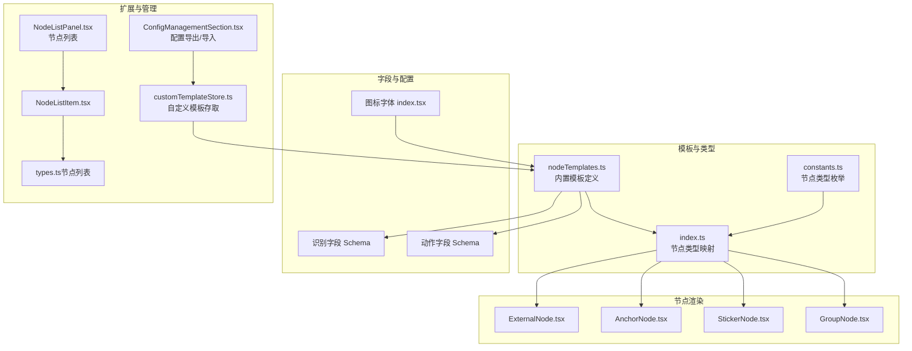
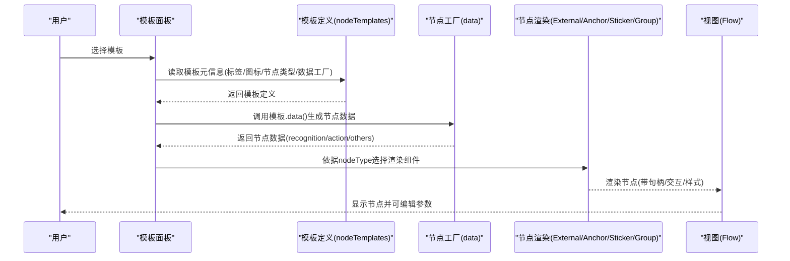
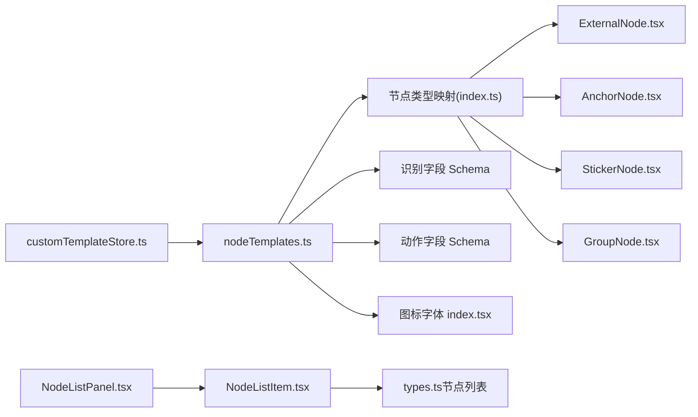

# 内置模板

<cite>
**本文引用的文件**
- [nodeTemplates.ts](file://src/data/nodeTemplates.ts)
- [constants.ts](file://src/components/flow/nodes/constants.ts)
- [index.ts](file://src/components/flow/nodes/index.ts)
- [ExternalNode.tsx](file://src/components/flow/nodes/ExternalNode.tsx)
- [AnchorNode.tsx](file://src/components/flow/nodes/AnchorNode.tsx)
- [StickerNode.tsx](file://src/components/flow/nodes/StickerNode.tsx)
- [GroupNode.tsx](file://src/components/flow/nodes/GroupNode.tsx)
- [schema.ts（识别）](file://src/core/fields/recognition/schema.ts)
- [schema.ts（动作）](file://src/core/fields/action/schema.ts)
- [index.tsx（图标字体）](file://src/components/iconfonts/index.tsx)
- [customTemplateStore.ts](file://src/stores/customTemplateStore.ts)
- [NodeListPanel.tsx](file://src/components/panels/main/node-list/NodeListPanel.tsx)
- [NodeListItem.tsx](file://src/components/panels/main/node-list/NodeListItem.tsx)
- [types.ts（节点列表）](file://src/components/panels/main/node-list/types.ts)
- [ConfigManagementSection.tsx](file://src/components/panels/config/ConfigManagementSection.tsx)
</cite>

## 目录
1. [简介](#简介)
2. [项目结构](#项目结构)
3. [核心组件](#核心组件)
4. [架构总览](#架构总览)
5. [详细组件分析](#详细组件分析)
6. [依赖分析](#依赖分析)
7. [性能考量](#性能考量)
8. [故障排查指南](#故障排查指南)
9. [结论](#结论)
10. [附录](#附录)

## 简介
本文件面向 MaaPipelineEditor 的“内置模板系统”，系统性梳理所有内置模板的类型、用途、数据结构、图标与视觉标识、组织分类与扩展机制，并提供最佳实践与常见配置示例。读者无需深入前端代码即可理解模板如何在编辑器中呈现、如何被用户选择与使用，以及如何基于现有机制进行扩展与自定义。

## 项目结构
内置模板系统由“模板定义”“节点类型与渲染”“字段 Schema（识别/动作）”“图标系统”“自定义模板存储与导入导出”“节点列表展示”等模块协同组成。下图给出与模板系统直接相关的结构关系：

**图表来源**
- [nodeTemplates.ts:1-108](file://src/data/nodeTemplates.ts#L1-L108)
- [constants.ts:14-20](file://src/components/flow/nodes/constants.ts#L14-L20)
- [index.ts:8-14](file://src/components/flow/nodes/index.ts#L8-L14)
- [ExternalNode.tsx:28-145](file://src/components/flow/nodes/ExternalNode.tsx#L28-L145)
- [AnchorNode.tsx:30-147](file://src/components/flow/nodes/AnchorNode.tsx#L30-L147)
- [StickerNode.tsx:164-213](file://src/components/flow/nodes/StickerNode.tsx#L164-L213)
- [GroupNode.tsx:111-161](file://src/components/flow/nodes/GroupNode.tsx#L111-L161)
- [schema.ts（识别）:7-276](file://src/core/fields/recognition/schema.ts#L7-L276)
- [schema.ts（动作）:7-299](file://src/core/fields/action/schema.ts#L7-L299)
- [index.tsx（图标字体）:198-204](file://src/components/iconfonts/index.tsx#L198-L204)
- [customTemplateStore.ts:45-309](file://src/stores/customTemplateStore.ts#L45-L309)
- [NodeListPanel.tsx:112-191](file://src/components/panels/main/node-list/NodeListPanel.tsx#L112-L191)
- [NodeListItem.tsx:43-61](file://src/components/panels/main/node-list/NodeListItem.tsx#L43-L61)
- [types.ts（节点列表）:54-63](file://src/components/panels/main/node-list/types.ts#L54-L63)
- [ConfigManagementSection.tsx:15-39](file://src/components/panels/config/ConfigManagementSection.tsx#L15-L39)

**章节来源**
- [nodeTemplates.ts:1-108](file://src/data/nodeTemplates.ts#L1-L108)
- [constants.ts:14-20](file://src/components/flow/nodes/constants.ts#L14-L20)
- [index.ts:8-14](file://src/components/flow/nodes/index.ts#L8-L14)

## 核心组件
- 内置模板定义：集中于模板清单，包含模板标签、图标名、可选图标尺寸、节点类型、初始数据工厂函数等。
- 节点类型与渲染：通过节点类型枚举与映射，将模板与具体节点组件绑定，实现不同模板的可视化呈现。
- 字段 Schema：为识别与动作提供参数定义、默认值、取值范围与说明，确保模板生成的节点具备可配置的参数结构。
- 图标系统：通过统一的图标字体入口，将模板的图标名解析为实际 SVG 组件，保证视觉一致性。
- 自定义模板：提供本地存储、导入导出、命名校验与数量限制，便于用户扩展与复用。
- 节点列表：提供节点统计、分组、搜索与高亮，帮助用户快速定位与操作节点。

**章节来源**
- [nodeTemplates.ts:3-11](file://src/data/nodeTemplates.ts#L3-L11)
- [index.ts:1-26](file://src/components/flow/nodes/index.ts#L1-L26)
- [schema.ts（识别）:7-276](file://src/core/fields/recognition/schema.ts#L7-L276)
- [schema.ts（动作）:7-299](file://src/core/fields/action/schema.ts#L7-L299)
- [index.tsx（图标字体）:198-204](file://src/components/iconfonts/index.tsx#L198-L204)
- [customTemplateStore.ts:7-43](file://src/stores/customTemplateStore.ts#L7-L43)
- [NodeListPanel.tsx:112-191](file://src/components/panels/main/node-list/NodeListPanel.tsx#L112-L191)

## 架构总览
以下序列图展示“从模板到节点”的典型流程：用户在模板面板选择一个模板，编辑器根据模板定义生成节点数据（含识别/动作/其他配置），并渲染为对应节点组件。

**图表来源**
- [nodeTemplates.ts:13-107](file://src/data/nodeTemplates.ts#L13-L107)
- [index.ts:8-14](file://src/components/flow/nodes/index.ts#L8-L14)
- [ExternalNode.tsx:28-145](file://src/components/flow/nodes/ExternalNode.tsx#L28-L145)
- [AnchorNode.tsx:30-147](file://src/components/flow/nodes/AnchorNode.tsx#L30-L147)
- [StickerNode.tsx:164-213](file://src/components/flow/nodes/StickerNode.tsx#L164-L213)
- [GroupNode.tsx:111-161](file://src/components/flow/nodes/GroupNode.tsx#L111-L161)

## 详细组件分析

### 模板类型与用途
- 空节点
  - 用途：占位、作为流程起点/终点或中间连接点；适合在未确定具体识别/动作时临时放置。
  - 数据结构：通常不包含识别/动作参数，可直接渲染为普通管道节点。
  - 图标与视觉：图标名“icon-kongjiedian”，尺寸可配置。
  - 适用场景：流程草稿、占位、连接锚点。
  - 章节来源
    - [nodeTemplates.ts:13-18](file://src/data/nodeTemplates.ts#L13-L18)

- 文字识别（OCR）
  - 用途：基于 OCR 检测屏幕文字，常用于点击按钮、确认对话框、文本提示等。
  - 数据结构：识别类型为 OCR，期望字符串列表；动作类型为 Click，可直接点击识别结果。
  - 参数要点：期望值支持正则；可设置阈值、替换规则、仅识别模式、模型路径等。
  - 适用场景：UI 文本识别、按钮点击、弹窗确认。
  - 章节来源
    - [nodeTemplates.ts:19-32](file://src/data/nodeTemplates.ts#L19-L32)
    - [schema.ts（识别）:150-188](file://src/core/fields/recognition/schema.ts#L150-L188)
    - [schema.ts（动作）:9-25](file://src/core/fields/action/schema.ts#L9-L25)

- 图像识别（TemplateMatch）
  - 用途：基于模板图像匹配定位目标，适合稳定 UI 元素或图标。
  - 数据结构：识别类型为 TemplateMatch，模板路径列表；动作类型为 Click。
  - 参数要点：阈值、匹配算法、绿色掩码、排序与索引策略。
  - 适用场景：图标点击、固定 UI 元素定位。
  - 章节来源
    - [nodeTemplates.ts:33-46](file://src/data/nodeTemplates.ts#L33-L46)
    - [schema.ts（识别）:28-55](file://src/core/fields/recognition/schema.ts#L28-L55)
    - [schema.ts（动作）:9-25](file://src/core/fields/action/schema.ts#L9-L25)

- 无延迟节点
  - 用途：在流程中插入延时控制，避免连续动作过快导致误判或不稳定。
  - 数据结构：others.pre_delay 与 post_delay 默认为 0，可直接修改。
  - 适用场景：等待动画结束、切换页面、资源加载。
  - 章节来源
    - [nodeTemplates.ts:47-57](file://src/data/nodeTemplates.ts#L47-L57)
    - [schema.ts（其他）:1-200](file://src/core/fields/other/schema.ts#L1-L200)

- 直接点击
  - 用途：在固定坐标或区域内随机点击，适合无法通过识别定位的场景。
  - 数据结构：动作类型为 Click，target 为坐标或区域。
  - 适用场景：快速点击、坐标点击、区域点击。
  - 章节来源
    - [nodeTemplates.ts:58-67](file://src/data/nodeTemplates.ts#L58-L67)
    - [schema.ts（动作）:9-25](file://src/core/fields/action/schema.ts#L9-L25)

- 外部节点（External）
  - 用途：引用外部流程或子任务，作为流程拆分与复用的手段。
  - 数据结构：nodeType 为 external，渲染为外部节点组件。
  - 适用场景：模块化流程、跨文件/跨任务调用。
  - 章节来源
    - [nodeTemplates.ts:83-88](file://src/data/nodeTemplates.ts#L83-L88)
    - [constants.ts:14-20](file://src/components/flow/nodes/constants.ts#L14-L20)
    - [index.ts:9-10](file://src/components/flow/nodes/index.ts#L9-L10)
    - [ExternalNode.tsx:28-145](file://src/components/flow/nodes/ExternalNode.tsx#L28-L145)

- 锚点节点（Anchor）
  - 用途：作为跳转锚点，配合“重定向”语义实现流程跳转。
  - 数据结构：nodeType 为 anchor，渲染为锚点组件。
  - 适用场景：条件跳转、循环、分支合并。
  - 章节来源
    - [nodeTemplates.ts:83-94](file://src/data/nodeTemplates.ts#L83-L94)
    - [constants.ts:14-20](file://src/components/flow/nodes/constants.ts#L14-L20)
    - [index.ts:10-11](file://src/components/flow/nodes/index.ts#L10-L11)
    - [AnchorNode.tsx:30-147](file://src/components/flow/nodes/AnchorNode.tsx#L30-L147)

- 便签贴纸（Sticker）
  - 用途：在画布上添加注释、说明、提醒等非执行节点。
  - 数据结构：nodeType 为 sticker，支持标题、内容、颜色主题、可调整尺寸。
  - 适用场景：流程说明、备注、临时标记。
  - 章节来源
    - [nodeTemplates.ts:95-100](file://src/data/nodeTemplates.ts#L95-L100)
    - [constants.ts:14-20](file://src/components/flow/nodes/constants.ts#L14-L20)
    - [index.ts:11-12](file://src/components/flow/nodes/index.ts#L11-L12)
    - [StickerNode.tsx:164-213](file://src/components/flow/nodes/StickerNode.tsx#L164-L213)

- 分组框（Group）
  - 用途：对节点进行分组，便于组织复杂流程。
  - 数据结构：nodeType 为 group，支持标题、颜色主题、可调整尺寸。
  - 适用场景：功能分组、逻辑分组、布局整理。
  - 章节来源
    - [nodeTemplates.ts:101-106](file://src/data/nodeTemplates.ts#L101-L106)
    - [constants.ts:14-20](file://src/components/flow/nodes/constants.ts#L14-L20)
    - [index.ts:12-13](file://src/components/flow/nodes/index.ts#L12-L13)
    - [GroupNode.tsx:111-161](file://src/components/flow/nodes/GroupNode.tsx#L111-L161)

### 模板数据结构定义
- 通用字段
  - label：模板标签，用于显示与检索。
  - iconName：图标名，与图标字体映射。
  - iconSize：图标尺寸（可选）。
  - nodeType：节点类型（可选），用于区分外部、锚点、贴纸、分组等。
  - data：数据工厂函数，返回节点的初始数据（识别/动作/其他/扩展）。
  - isCustom/createTime：自定义模板附加字段（见扩展章节）。
- 典型数据工厂返回结构
  - recognition：识别类型与参数（如 OCR、TemplateMatch、颜色匹配等）。
  - action：动作类型与参数（如 Click、Swipe、Key 等）。
  - others：延时、优先级等其他配置。
  - extras：扩展字段（自定义模板可用）。
- 章节来源
  - [nodeTemplates.ts:3-11](file://src/data/nodeTemplates.ts#L3-L11)
  - [schema.ts（识别）:7-276](file://src/core/fields/recognition/schema.ts#L7-L276)
  - [schema.ts（动作）:7-299](file://src/core/fields/action/schema.ts#L7-L299)

### 模板图标系统与视觉标识
- 图标字体入口：通过统一的图标组件，将模板的 iconName 解析为对应 SVG。
- 常用图标名
  - 空节点：icon-kongjiedian
  - 文字识别：icon-ocr
  - 图像识别：icon-tuxiang
  - 无延迟：icon-weizhihang
  - 直接点击：icon-dianji
  - 外部节点：icon-xiaofangtongdao
  - 锚点节点：icon-ziyuan
  - 便签贴纸：icon-bianqian1
  - 分组框：icon-kuangxuanzhong
- 章节来源
  - [index.tsx（图标字体）:198-204](file://src/components/iconfonts/index.tsx#L198-L204)
  - [nodeTemplates.ts:13-106](file://src/data/nodeTemplates.ts#L13-L106)

### 内置模板的组织结构与分类逻辑
- 按节点类型分类：Pipeline（普通流程节点）、External（外部）、Anchor（锚点）、Sticker（便签）、Group（分组）。
- 按用途分类：识别型（OCR、TemplateMatch）、动作型（Click、Swipe、Key）、控制型（延时、跳转、外部引用）。
- 节点列表分组：在节点列表面板中按类型分组展示，支持搜索与统计。
- 章节来源
  - [constants.ts:14-20](file://src/components/flow/nodes/constants.ts#L14-L20)
  - [types.ts（节点列表）:54-63](file://src/components/panels/main/node-list/types.ts#L54-L63)
  - [NodeListPanel.tsx:166-191](file://src/components/panels/main/node-list/NodeListPanel.tsx#L166-L191)

### 模板使用的最佳实践
- 识别优先：优先使用 OCR/TemplateMatch 等识别型节点，减少硬编码坐标。
- 参数最小化：仅设置必要的识别参数（如 ROI、阈值、排序），避免过度复杂。
- 延时合理：在页面切换、动画播放后加入适当延时，提升稳定性。
- 跳转清晰：使用锚点节点明确流程分支与循环，避免混乱的连接。
- 注释规范：使用便签贴纸标注关键步骤与注意事项，便于协作与维护。
- 分组有序：将相关节点放入分组框，保持画布整洁。
- 章节来源
  - [schema.ts（识别）:7-276](file://src/core/fields/recognition/schema.ts#L7-L276)
  - [schema.ts（动作）:7-299](file://src/core/fields/action/schema.ts#L7-L299)
  - [StickerNode.tsx:164-213](file://src/components/flow/nodes/StickerNode.tsx#L164-L213)
  - [GroupNode.tsx:111-161](file://src/components/flow/nodes/GroupNode.tsx#L111-L161)

### 模板扩展与自定义
- 自定义模板存储
  - 结构：包含标签、节点类型、节点数据（去除 label）、创建时间。
  - 本地存储：localStorage，版本号管理，上限 50 个。
  - 章节来源
    - [customTemplateStore.ts:7-43](file://src/stores/customTemplateStore.ts#L7-L43)
    - [customTemplateStore.ts:45-309](file://src/stores/customTemplateStore.ts#L45-L309)

- 导入导出
  - 导出：导出自定义模板与配置，便于分享与备份。
  - 导入：校验格式并恢复到本地存储。
  - 章节来源
    - [ConfigManagementSection.tsx:15-39](file://src/components/panels/config/ConfigManagementSection.tsx#L15-L39)
    - [customTemplateStore.ts:255-307](file://src/stores/customTemplateStore.ts#L255-L307)

- 扩展流程
  1) 生成节点数据：基于现有模板的 data 工厂思路，构造 recognition/action/others/extras。
  2) 保存模板：调用 addTemplate，自动序列化并写入 localStorage。
  3) 使用模板：在模板面板中可见，拖拽生成节点。
  4) 迁移与备份：通过导出/导入功能在不同环境间共享。
- 章节来源
  - [customTemplateStore.ts:96-170](file://src/stores/customTemplateStore.ts#L96-L170)
  - [customTemplateStore.ts:255-307](file://src/stores/customTemplateStore.ts#L255-L307)

## 依赖分析
- 模板到节点渲染
  - 模板定义通过 nodeType 与节点组件映射，决定最终渲染行为。
- 模板到字段 Schema
  - 模板生成的节点数据遵循识别/动作字段 Schema，确保参数合法性与一致性。
- 模板到图标系统
  - 模板的 iconName 与图标字体映射，保证视觉统一。
- 模板到自定义存储
  - 自定义模板继承内置模板的结构，复用数据工厂与渲染逻辑。
- 章节来源
  - [index.ts:8-14](file://src/components/flow/nodes/index.ts#L8-L14)
  - [schema.ts（识别）:7-276](file://src/core/fields/recognition/schema.ts#L7-L276)
  - [schema.ts（动作）:7-299](file://src/core/fields/action/schema.ts#L7-L299)
  - [index.tsx（图标字体）:198-204](file://src/components/iconfonts/index.tsx#L198-L204)
  - [customTemplateStore.ts:72-82](file://src/stores/customTemplateStore.ts#L72-L82)

**图表来源**
- [index.ts:8-14](file://src/components/flow/nodes/index.ts#L8-L14)
- [nodeTemplates.ts:13-107](file://src/data/nodeTemplates.ts#L13-L107)
- [schema.ts（识别）:7-276](file://src/core/fields/recognition/schema.ts#L7-L276)
- [schema.ts（动作）:7-299](file://src/core/fields/action/schema.ts#L7-L299)
- [index.tsx（图标字体）:198-204](file://src/components/iconfonts/index.tsx#L198-L204)
- [customTemplateStore.ts:45-309](file://src/stores/customTemplateStore.ts#L45-L309)
- [NodeListPanel.tsx:112-191](file://src/components/panels/main/node-list/NodeListPanel.tsx#L112-L191)
- [NodeListItem.tsx:43-61](file://src/components/panels/main/node-list/NodeListItem.tsx#L43-L61)
- [types.ts（节点列表）:54-63](file://src/components/panels/main/node-list/types.ts#L54-L63)

## 性能考量
- 模板数量与渲染：自定义模板上限为 50，避免过多模板导致面板加载与渲染压力。
- 图标加载：图标字体集中管理，减少重复 SVG 体积与请求次数。
- 字段校验：识别/动作字段 Schema 提供默认值与取值范围，降低无效参数带来的运行时开销。
- 延时控制：合理设置 others.pre_delay/post_delay，避免频繁重试与无效等待。
- 章节来源
  - [customTemplateStore.ts:20-22](file://src/stores/customTemplateStore.ts#L20-L22)
  - [schema.ts（识别）:7-276](file://src/core/fields/recognition/schema.ts#L7-L276)
  - [schema.ts（动作）:7-299](file://src/core/fields/action/schema.ts#L7-L299)

## 故障排查指南
- 模板加载失败
  - 现象：自定义模板未显示或报错。
  - 排查：检查 localStorage 是否存在、版本号是否匹配、数据格式是否正确。
  - 章节来源
    - [customTemplateStore.ts:50-94](file://src/stores/customTemplateStore.ts#L50-L94)
    - [customTemplateStore.ts:266-307](file://src/stores/customTemplateStore.ts#L266-L307)

- 模板导入失败
  - 现象：导入后无变化或提示错误。
  - 排查：确认导入数据为数组格式、字段完整、未超过上限。
  - 章节来源
    - [customTemplateStore.ts:266-307](file://src/stores/customTemplateStore.ts#L266-L307)

- 节点列表为空或统计异常
  - 现象：节点列表显示“暂无节点”或统计不准确。
  - 排查：检查节点数量、类型过滤、关键词搜索条件。
  - 章节来源
    - [NodeListPanel.tsx:352-358](file://src/components/panels/main/node-list/NodeListPanel.tsx#L352-L358)
    - [NodeListPanel.tsx:280-291](file://src/components/panels/main/node-list/NodeListPanel.tsx#L280-L291)

- 图标不显示
  - 现象：模板图标缺失或显示异常。
  - 排查：确认 iconName 是否存在于图标字体映射中。
  - 章节来源
    - [index.tsx（图标字体）:198-204](file://src/components/iconfonts/index.tsx#L198-L204)

## 结论
MaaPipelineEditor 的内置模板系统以“模板定义 + 节点类型映射 + 字段 Schema + 图标系统 + 自定义存储 + 节点列表展示”为核心，既保证了模板的标准化与可扩展性，又提供了良好的用户体验。通过合理使用内置模板与自定义模板，用户可以在保证参数合法性的同时，高效构建与维护复杂的自动化流程。

## 附录
- 常用模板与字段速查
  - 文字识别（OCR）：期望值、阈值、替换、仅识别、模型路径等。
  - 图像识别（TemplateMatch）：模板路径、阈值、算法、绿色掩码、排序与索引。
  - 动作（Click/Swipe/Key）：目标位置、偏移、时长、滚动距离、多触点等。
- 章节来源
  - [schema.ts（识别）:7-276](file://src/core/fields/recognition/schema.ts#L7-L276)
  - [schema.ts（动作）:7-299](file://src/core/fields/action/schema.ts#L7-L299)