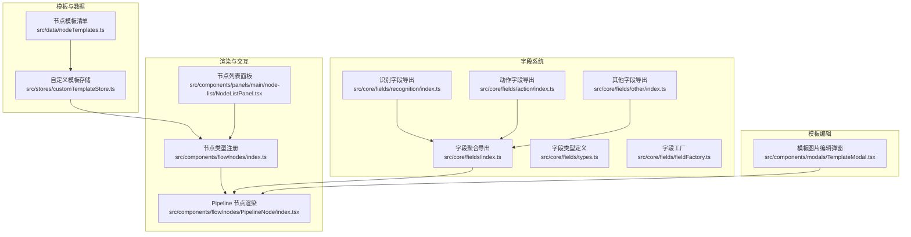
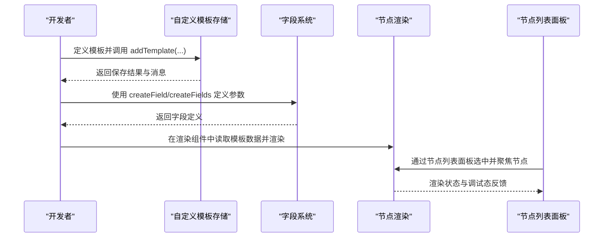
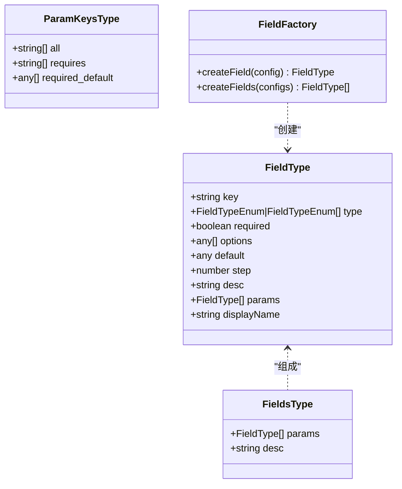
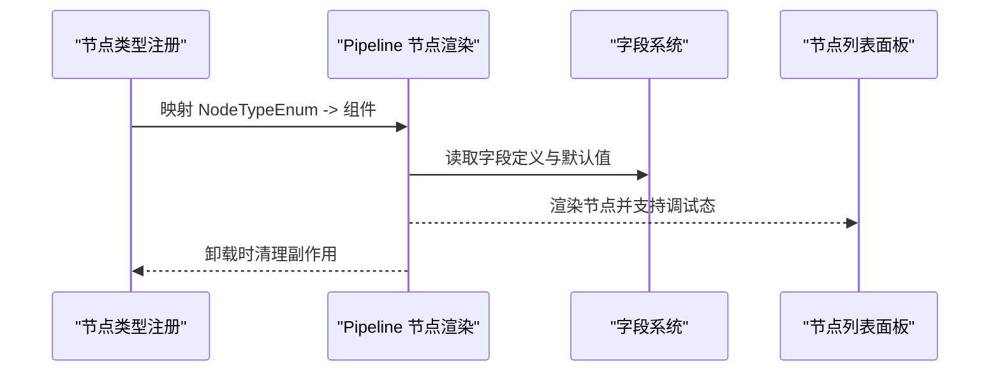
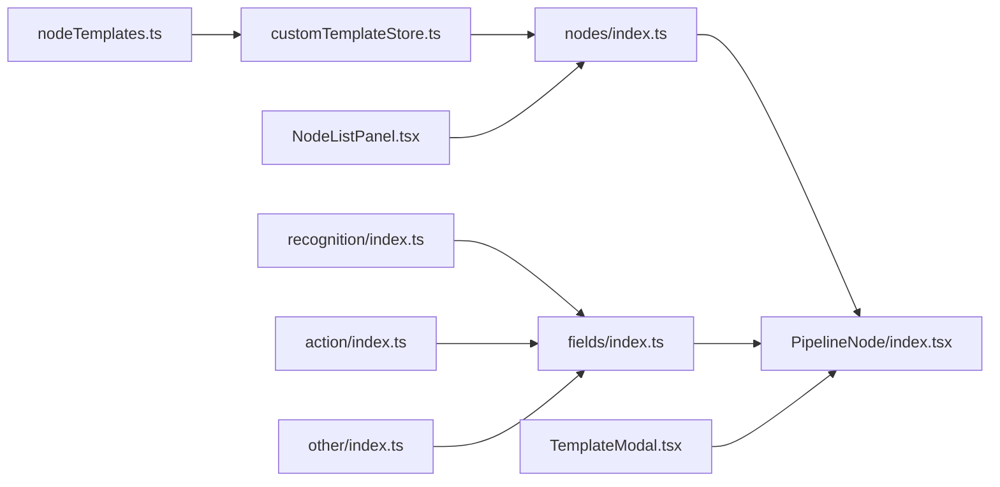

# 模板开发

<cite>
**本文引用的文件**
- [nodeTemplates.ts](file://src/data/nodeTemplates.ts)
- [customTemplateStore.ts](file://src/stores/customTemplateStore.ts)
- [index.ts](file://src/core/fields/index.ts)
- [types.ts](file://src/core/fields/types.ts)
- [fieldFactory.ts](file://src/core/fields/fieldFactory.ts)
- [index.ts](file://src/core/fields/action/index.ts)
- [index.ts](file://src/core/fields/recognition/index.ts)
- [index.ts](file://src/core/fields/other/index.ts)
- [types.ts](file://src/stores/flow/types.ts)
- [index.ts](file://src/components/flow/nodes/index.ts)
- [PipelineNode/index.tsx](file://src/components/flow/nodes/PipelineNode/index.tsx)
- [NodeListPanel.tsx](file://src/components/panels/main/node-list/NodeListPanel.tsx)
- [TemplateModal.tsx](file://src/components/modals/TemplateModal.tsx)
</cite>

## 目录
1. [简介](#简介)
2. [项目结构](#项目结构)
3. [核心组件](#核心组件)
4. [架构总览](#架构总览)
5. [详细组件分析](#详细组件分析)
6. [依赖分析](#依赖分析)
7. [性能考虑](#性能考虑)
8. [故障排查指南](#故障排查指南)
9. [结论](#结论)
10. [附录](#附录)

## 简介
本文面向希望为 MaaPipelineEditor 开发“模板”的工程师，系统讲解如何新增模板类型、定义模板接口、设计数据结构、开发渲染组件、实现模板工厂模式与扩展机制、管理模板生命周期（注册/初始化/销毁）、与字段系统集成（参数校验、默认值、动态配置）、利用扩展点与钩子机制、给出完整开发示例与代码模板、制定测试策略与调试技巧，以及性能优化与内存管理最佳实践。

## 项目结构
围绕模板开发的关键模块与职责如下：
- 数据与模板定义：通过节点模板清单与自定义模板存储，统一管理模板元数据与持久化。
- 字段系统：提供识别、动作、其他三类字段的定义、校验与默认值生成，支撑模板参数体系。
- 渲染与交互：基于 ReactFlow 的节点渲染组件，按主题风格切换内容组件；节点列表面板提供模板检索与导航。
- 模板编辑：模板图片采集与遮罩编辑能力，辅助模板参数的可视化配置。

图表来源
- [nodeTemplates.ts:1-108](file://src/data/nodeTemplates.ts#L1-L108)
- [customTemplateStore.ts:1-310](file://src/stores/customTemplateStore.ts#L1-L310)
- [index.ts:1-45](file://src/core/fields/index.ts#L1-L45)
- [types.ts:1-34](file://src/core/fields/types.ts#L1-L34)
- [fieldFactory.ts:1-16](file://src/core/fields/fieldFactory.ts#L1-L16)
- [index.ts:1-3](file://src/core/fields/recognition/index.ts#L1-L3)
- [index.ts:1-3](file://src/core/fields/action/index.ts#L1-L3)
- [index.ts:1-8](file://src/core/fields/other/index.ts#L1-L8)
- [index.ts:1-26](file://src/components/flow/nodes/index.ts#L1-L26)
- [PipelineNode/index.tsx:1-255](file://src/components/flow/nodes/PipelineNode/index.tsx#L1-L255)
- [NodeListPanel.tsx:1-396](file://src/components/panels/main/node-list/NodeListPanel.tsx#L1-L396)
- [TemplateModal.tsx:1-800](file://src/components/modals/TemplateModal.tsx#L1-L800)

章节来源
- [nodeTemplates.ts:1-108](file://src/data/nodeTemplates.ts#L1-L108)
- [customTemplateStore.ts:1-310](file://src/stores/customTemplateStore.ts#L1-L310)
- [index.ts:1-45](file://src/core/fields/index.ts#L1-L45)
- [types.ts:1-34](file://src/core/fields/types.ts#L1-L34)
- [fieldFactory.ts:1-16](file://src/core/fields/fieldFactory.ts#L1-L16)
- [index.ts:1-3](file://src/core/fields/recognition/index.ts#L1-L3)
- [index.ts:1-3](file://src/core/fields/action/index.ts#L1-L3)
- [index.ts:1-8](file://src/core/fields/other/index.ts#L1-L8)
- [index.ts:1-26](file://src/components/flow/nodes/index.ts#L1-L26)
- [PipelineNode/index.tsx:1-255](file://src/components/flow/nodes/PipelineNode/index.tsx#L1-L255)
- [NodeListPanel.tsx:1-396](file://src/components/panels/main/node-list/NodeListPanel.tsx#L1-L396)
- [TemplateModal.tsx:1-800](file://src/components/modals/TemplateModal.tsx#L1-L800)

## 核心组件
- 模板接口与数据结构
  - 节点模板类型：包含标签、图标、节点类型、初始数据工厂、自定义标记与创建时间等字段。
  - 自定义模板存储：负责模板的加载、增删改查、导入导出、本地持久化与版本迁移。
- 字段系统
  - 字段类型定义：统一描述字段键、类型、是否必填、可选值、默认值、步长、描述、子参数、显示名等。
  - 字段工厂：提供便捷的字段创建与批量创建方法。
  - 识别/动作/其他字段：分别导出字段定义与校验模式，供模板参数使用。
- 渲染与交互
  - 节点类型注册：将不同节点类型映射到对应的渲染组件。
  - Pipeline 节点渲染：根据主题风格切换内容组件，支持调试态样式与上下文菜单。
  - 节点列表面板：提供节点搜索、类型筛选、分组展示与高亮聚焦。
- 模板编辑
  - 模板图片编辑弹窗：支持截图、框选、画笔/橡皮擦遮罩、坐标输入、保存与路径解析。

章节来源
- [nodeTemplates.ts:3-11](file://src/data/nodeTemplates.ts#L3-L11)
- [customTemplateStore.ts:8-43](file://src/stores/customTemplateStore.ts#L8-L43)
- [types.ts:6-24](file://src/core/fields/types.ts#L6-L24)
- [fieldFactory.ts:6-15](file://src/core/fields/fieldFactory.ts#L6-L15)
- [index.ts:8-28](file://src/core/fields/index.ts#L8-L28)
- [index.ts:8-22](file://src/core/fields/index.ts#L8-L22)
- [index.ts:1-26](file://src/components/flow/nodes/index.ts#L1-L26)
- [PipelineNode/index.tsx:164-173](file://src/components/flow/nodes/PipelineNode/index.tsx#L164-L173)
- [NodeListPanel.tsx:113-141](file://src/components/panels/main/node-list/NodeListPanel.tsx#L113-L141)
- [TemplateModal.tsx:380-496](file://src/components/modals/TemplateModal.tsx#L380-L496)

## 架构总览
模板开发涉及“模板定义—字段系统—渲染组件—交互面板—编辑工具”的协同：

图表来源
- [customTemplateStore.ts:96-170](file://src/stores/customTemplateStore.ts#L96-L170)
- [fieldFactory.ts:6-15](file://src/core/fields/fieldFactory.ts#L6-L15)
- [PipelineNode/index.tsx:164-173](file://src/components/flow/nodes/PipelineNode/index.tsx#L164-L173)
- [NodeListPanel.tsx:207-232](file://src/components/panels/main/node-list/NodeListPanel.tsx#L207-L232)

## 详细组件分析

### 模板接口与数据结构设计
- 模板接口 NodeTemplateType
  - 字段含义：标签、图标名、图标尺寸、节点类型枚举、初始数据工厂、是否自定义、创建时间。
  - 设计要点：通过 data 工厂函数返回深拷贝的初始数据，避免引用污染；isCustom 与 createTime 支持自定义模板的识别与排序。
- 自定义模板存储 CustomTemplateState
  - 生命周期：loadTemplates（加载并迁移版本）、addTemplate（新增并持久化）、removeTemplate（删除并同步持久化）、updateTemplate（更新）、getAllTemplates（合并预设与自定义模板）、hasTemplate、exportTemplates/importTemplates。
  - 约束与校验：数量上限、名称长度与非空校验、序列化与回滚。
  - 持久化：localStorage，带版本号，支持导入导出。

章节来源
- [nodeTemplates.ts:3-11](file://src/data/nodeTemplates.ts#L3-L11)
- [customTemplateStore.ts:24-43](file://src/stores/customTemplateStore.ts#L24-L43)
- [customTemplateStore.ts:50-94](file://src/stores/customTemplateStore.ts#L50-L94)
- [customTemplateStore.ts:96-170](file://src/stores/customTemplateStore.ts#L96-L170)
- [customTemplateStore.ts:172-210](file://src/stores/customTemplateStore.ts#L172-L210)
- [customTemplateStore.ts:212-248](file://src/stores/customTemplateStore.ts#L212-L248)
- [customTemplateStore.ts:255-307](file://src/stores/customTemplateStore.ts#L255-L307)

### 字段系统与模板参数集成
- 字段类型定义 FieldType
  - 支持必填、可选值、默认值、步长、子参数（params）等，便于复杂参数结构化。
- 字段工厂 createField/createFields
  - 简化字段声明，减少样板代码。
- 识别/动作/其他字段导出
  - 通过 index 聚合导出字段定义与校验键列表，供模板参数使用。
- 模板数据结构 PipelineNodeDataType
  - 包含 recognition/action/others/extras/type/handleDirection 等字段，与字段系统参数类型一一对应。

图表来源
- [types.ts:6-24](file://src/core/fields/types.ts#L6-L24)
- [fieldFactory.ts:6-15](file://src/core/fields/fieldFactory.ts#L6-L15)

章节来源
- [types.ts:6-24](file://src/core/fields/types.ts#L6-L24)
- [fieldFactory.ts:6-15](file://src/core/fields/fieldFactory.ts#L6-L15)
- [index.ts:8-28](file://src/core/fields/index.ts#L8-L28)
- [types.ts:108-122](file://src/stores/flow/types.ts#L108-L122)

### 渲染组件与模板生命周期
- 节点类型注册
  - 将 NodeTypeEnum 与具体渲染组件关联，形成“类型 -> 组件”的映射表。
- Pipeline 节点渲染
  - 根据主题风格（classic/modern/minimal）切换内容组件；支持调试态样式与上下文菜单；memo 化以减少重渲染。
- 生命周期建议
  - 注册：在节点类型注册处完成映射。
  - 初始化：在渲染组件中读取模板数据并进行参数校验与默认值填充。
  - 销毁：依赖 React 的卸载机制；若存在副作用（如订阅、定时器），应在组件卸载时清理。

图表来源
- [index.ts:8-14](file://src/components/flow/nodes/index.ts#L8-L14)
- [PipelineNode/index.tsx:164-173](file://src/components/flow/nodes/PipelineNode/index.tsx#L164-L173)
- [index.ts:31-34](file://src/core/fields/index.ts#L31-L34)

章节来源
- [index.ts:8-14](file://src/components/flow/nodes/index.ts#L8-L14)
- [PipelineNode/index.tsx:164-173](file://src/components/flow/nodes/PipelineNode/index.tsx#L164-L173)
- [NodeListPanel.tsx:207-232](file://src/components/panels/main/node-list/NodeListPanel.tsx#L207-L232)

### 模板工厂模式与扩展机制
- 工厂函数
  - createField/createFields 提供标准化的字段定义方式，便于扩展新模板参数。
- 扩展机制
  - 新增模板类型：在节点模板清单中添加条目，或通过自定义模板存储动态注入。
  - 新增字段：在识别/动作/其他字段目录下扩展 schema 与 fields，再通过 index 聚合导出。
  - 渲染扩展：在节点类型注册中增加映射，或在现有渲染组件中增加分支逻辑。

章节来源
- [fieldFactory.ts:6-15](file://src/core/fields/fieldFactory.ts#L6-L15)
- [nodeTemplates.ts:13-107](file://src/data/nodeTemplates.ts#L13-L107)
- [index.ts:8-28](file://src/core/fields/index.ts#L8-L28)
- [index.ts:8-14](file://src/components/flow/nodes/index.ts#L8-L14)

### 模板与字段系统的集成
- 参数验证与默认值
  - 使用字段系统提供的 schema 与键列表，结合 createField/createFields 定义默认值与必填项。
- 动态配置
  - 通过模板数据工厂返回的初始数据，结合字段系统生成的参数键与大写值映射，实现动态参数配置。
- 实际应用
  - 节点列表面板从节点数据中提取识别/动作参数与模板图片路径，用于展示与导航。

章节来源
- [index.ts:31-44](file://src/core/fields/index.ts#L31-L44)
- [NodeListPanel.tsx:124-137](file://src/components/panels/main/node-list/NodeListPanel.tsx#L124-L137)

### 模板扩展点与钩子机制
- 渲染扩展点
  - 主题风格切换：在 Pipeline 节点渲染中通过分支选择内容组件。
- 交互扩展点
  - 上下文菜单：在节点渲染组件中封装上下文菜单，支持模板操作入口。
- 数据扩展点
  - 模板数据工厂：通过 data 工厂返回结构化初始数据，便于后续扩展。
- 钩子建议
  - 初始化钩子：在渲染组件挂载时读取模板数据并进行参数校验。
  - 更新钩子：在模板数据变更时触发字段系统重新校验与渲染。
  - 销毁钩子：在组件卸载时清理订阅与定时器。

章节来源
- [PipelineNode/index.tsx:164-173](file://src/components/flow/nodes/PipelineNode/index.tsx#L164-L173)
- [PipelineNode/index.tsx:184-193](file://src/components/flow/nodes/PipelineNode/index.tsx#L184-L193)
- [nodeTemplates.ts:8](file://src/data/nodeTemplates.ts#L8)

### 模板开发完整示例与代码模板
以下为“开发新模板类型”的步骤与参考路径（不直接粘贴代码）：
- 定义模板接口与数据结构
  - 参考：[nodeTemplates.ts:3-11](file://src/data/nodeTemplates.ts#L3-L11)
- 编写模板数据工厂
  - 参考：[nodeTemplates.ts:22-31](file://src/data/nodeTemplates.ts#L22-L31)
- 扩展字段系统
  - 定义字段：[fieldFactory.ts:6-15](file://src/core/fields/fieldFactory.ts#L6-L15)
  - 导出字段：[index.ts:8-28](file://src/core/fields/index.ts#L8-L28)
- 渲染组件扩展
  - 节点类型注册：[index.ts:8-14](file://src/components/flow/nodes/index.ts#L8-L14)
  - 内容组件切换：[PipelineNode/index.tsx:164-173](file://src/components/flow/nodes/PipelineNode/index.tsx#L164-L173)
- 与字段系统集成
  - 参数键与默认值：[index.ts:41-44](file://src/core/fields/index.ts#L41-L44)
  - 节点数据结构：[types.ts:108-122](file://src/stores/flow/types.ts#L108-L122)
- 自定义模板持久化
  - 存储与导入导出：[customTemplateStore.ts:24-43](file://src/stores/customTemplateStore.ts#L24-L43)
  - 保存与回滚：[customTemplateStore.ts:146-170](file://src/stores/customTemplateStore.ts#L146-L170)
- 模板编辑与参数可视化
  - 模板图片编辑弹窗：[TemplateModal.tsx:380-496](file://src/components/modals/TemplateModal.tsx#L380-L496)

章节来源
- [nodeTemplates.ts:3-11](file://src/data/nodeTemplates.ts#L3-L11)
- [fieldFactory.ts:6-15](file://src/core/fields/fieldFactory.ts#L6-L15)
- [index.ts:8-28](file://src/core/fields/index.ts#L8-L28)
- [index.ts:8-14](file://src/components/flow/nodes/index.ts#L8-L14)
- [PipelineNode/index.tsx:164-173](file://src/components/flow/nodes/PipelineNode/index.tsx#L164-L173)
- [index.ts:41-44](file://src/core/fields/index.ts#L41-L44)
- [types.ts:108-122](file://src/stores/flow/types.ts#L108-L122)
- [customTemplateStore.ts:24-43](file://src/stores/customTemplateStore.ts#L24-L43)
- [customTemplateStore.ts:146-170](file://src/stores/customTemplateStore.ts#L146-L170)
- [TemplateModal.tsx:380-496](file://src/components/modals/TemplateModal.tsx#L380-L496)

### 模板测试策略与调试技巧
- 单元测试
  - 字段定义：验证 createField/createFields 的输出结构与默认值。
  - 模板存储：覆盖 add/remove/update/getAll/export/import 的边界条件与错误场景。
- 集成测试
  - 渲染组件：验证不同主题风格下的渲染一致性与调试态样式。
  - 节点列表：验证搜索、筛选、分组与高亮聚焦行为。
- 调试技巧
  - 使用调试态样式区分“已执行”“正在执行”“正在识别”“失败”等状态。
  - 在节点列表面板中通过点击与键盘事件进行交互验证。
  - 模板图片编辑：通过遮罩与坐标输入验证 ROI 与路径解析。

章节来源
- [PipelineNode/index.tsx:126-144](file://src/components/flow/nodes/PipelineNode/index.tsx#L126-L144)
- [NodeListPanel.tsx:207-232](file://src/components/panels/main/node-list/NodeListPanel.tsx#L207-L232)
- [TemplateModal.tsx:80-101](file://src/components/modals/TemplateModal.tsx#L80-L101)

## 依赖分析
模板开发涉及的依赖关系如下：

图表来源
- [nodeTemplates.ts:1-108](file://src/data/nodeTemplates.ts#L1-L108)
- [customTemplateStore.ts:1-310](file://src/stores/customTemplateStore.ts#L1-L310)
- [index.ts:1-26](file://src/components/flow/nodes/index.ts#L1-L26)
- [PipelineNode/index.tsx:1-255](file://src/components/flow/nodes/PipelineNode/index.tsx#L1-L255)
- [index.ts:1-45](file://src/core/fields/index.ts#L1-L45)
- [NodeListPanel.tsx:1-396](file://src/components/panels/main/node-list/NodeListPanel.tsx#L1-L396)
- [TemplateModal.tsx:1-800](file://src/components/modals/TemplateModal.tsx#L1-L800)

章节来源
- [nodeTemplates.ts:1-108](file://src/data/nodeTemplates.ts#L1-L108)
- [customTemplateStore.ts:1-310](file://src/stores/customTemplateStore.ts#L1-L310)
- [index.ts:1-26](file://src/components/flow/nodes/index.ts#L1-L26)
- [PipelineNode/index.tsx:1-255](file://src/components/flow/nodes/PipelineNode/index.tsx#L1-L255)
- [index.ts:1-45](file://src/core/fields/index.ts#L1-L45)
- [NodeListPanel.tsx:1-396](file://src/components/panels/main/node-list/NodeListPanel.tsx#L1-L396)
- [TemplateModal.tsx:1-800](file://src/components/modals/TemplateModal.tsx#L1-L800)

## 性能考虑
- 渲染性能
  - 使用 memo 包裹节点组件，避免不必要的重渲染。
  - 在渲染组件中对数据进行浅比较，减少依赖变更导致的更新。
- 存储与序列化
  - 自定义模板采用 JSON 深拷贝与序列化，注意大模板的内存占用与序列化开销。
  - 控制模板数量上限，防止过度增长影响性能。
- 交互体验
  - 节点列表面板的过滤与分组应使用 useMemo 优化计算。
  - 模板图片编辑弹窗的画布重绘应按需触发，避免频繁重绘。

章节来源
- [PipelineNode/index.tsx:196-254](file://src/components/flow/nodes/PipelineNode/index.tsx#L196-L254)
- [customTemplateStore.ts:96-170](file://src/stores/customTemplateStore.ts#L96-L170)
- [NodeListPanel.tsx:144-164](file://src/components/panels/main/node-list/NodeListPanel.tsx#L144-L164)
- [TemplateModal.tsx:104-199](file://src/components/modals/TemplateModal.tsx#L104-L199)

## 故障排查指南
- 模板加载失败
  - 检查存储版本是否匹配，必要时清空并重新导入。
  - 关注控制台错误与消息提示，确认回滚逻辑是否生效。
- 模板保存失败
  - 检查浏览器存储空间与权限，确保序列化成功。
  - 若失败，回滚状态并提示用户。
- 渲染异常
  - 检查 memo 比较逻辑与数据结构，确保浅比较有效。
  - 确认字段系统导出与渲染组件读取一致。
- 调试态不显示
  - 检查调试状态与节点 ID 匹配，确认样式类是否正确应用。

章节来源
- [customTemplateStore.ts:50-94](file://src/stores/customTemplateStore.ts#L50-L94)
- [customTemplateStore.ts:163-169](file://src/stores/customTemplateStore.ts#L163-L169)
- [PipelineNode/index.tsx:126-144](file://src/components/flow/nodes/PipelineNode/index.tsx#L126-L144)

## 结论
通过统一的模板接口、完善的字段系统、可扩展的渲染与交互组件，以及可靠的存储与编辑工具，MaaPipelineEditor 为模板开发提供了清晰的架构与强大的扩展能力。遵循本文的接口定义、数据结构设计、生命周期管理与性能优化建议，可高效地开发高质量的模板类型，并与现有系统无缝集成。

## 附录
- 相关类型与接口参考
  - 字段类型定义：[types.ts:6-24](file://src/core/fields/types.ts#L6-L24)
  - 节点数据结构：[types.ts:108-122](file://src/stores/flow/types.ts#L108-L122)
- 关键导出与工厂
  - 字段系统导出：[index.ts:1-45](file://src/core/fields/index.ts#L1-L45)
  - 字段工厂：[fieldFactory.ts:1-16](file://src/core/fields/fieldFactory.ts#L1-L16)
- 模板与存储
  - 模板清单：[nodeTemplates.ts:1-108](file://src/data/nodeTemplates.ts#L1-L108)
  - 自定义模板存储：[customTemplateStore.ts:1-310](file://src/stores/customTemplateStore.ts#L1-L310)
- 渲染与交互
  - 节点类型注册：[index.ts:1-26](file://src/components/flow/nodes/index.ts#L1-L26)
  - Pipeline 节点渲染：[PipelineNode/index.tsx:1-255](file://src/components/flow/nodes/PipelineNode/index.tsx#L1-L255)
  - 节点列表面板：[NodeListPanel.tsx:1-396](file://src/components/panels/main/node-list/NodeListPanel.tsx#L1-L396)
  - 模板图片编辑弹窗：[TemplateModal.tsx:1-800](file://src/components/modals/TemplateModal.tsx#L1-L800)