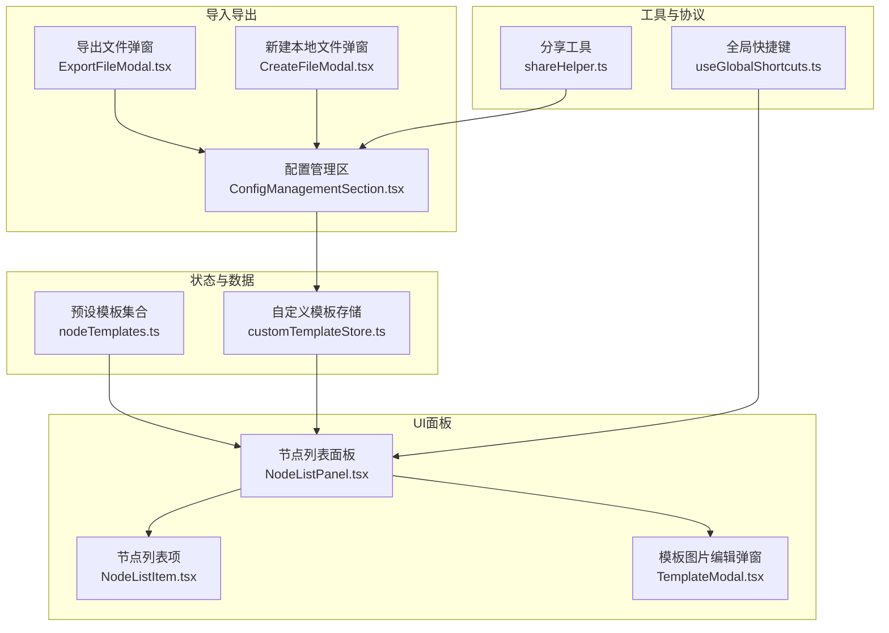
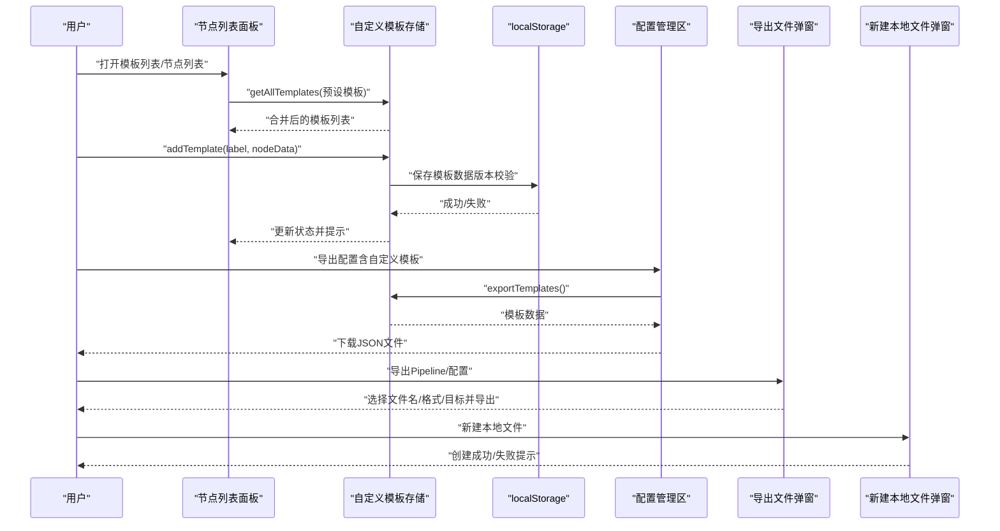
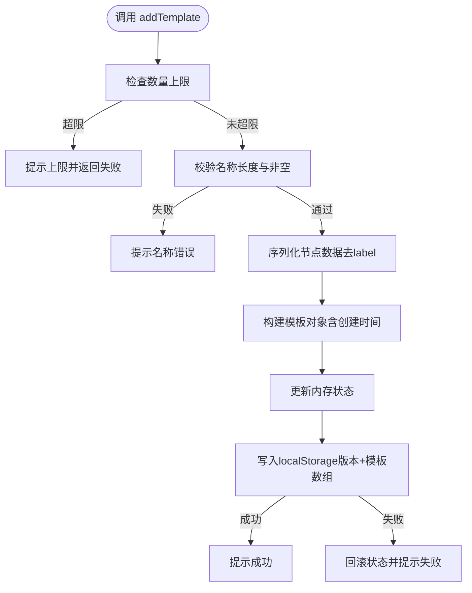
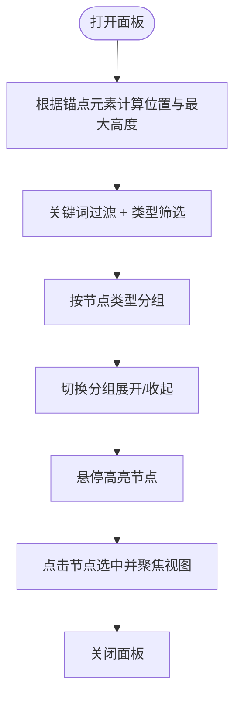
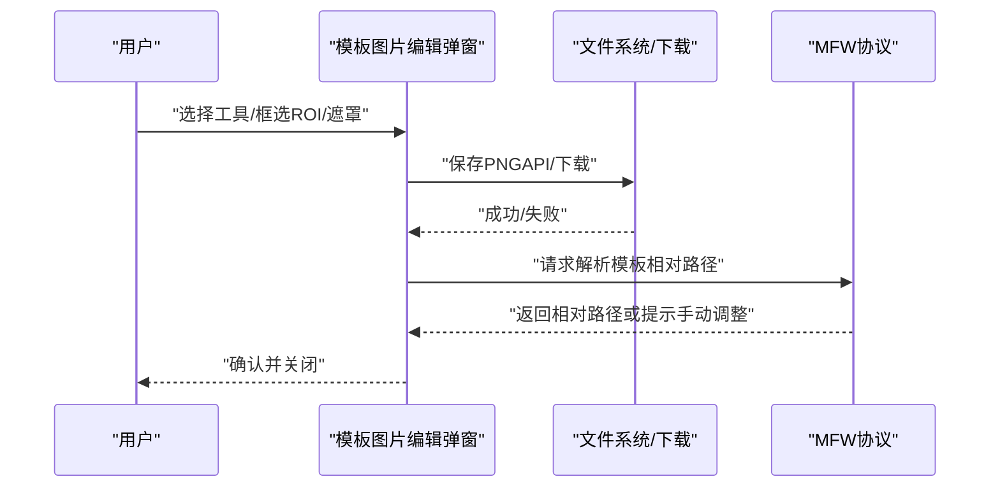
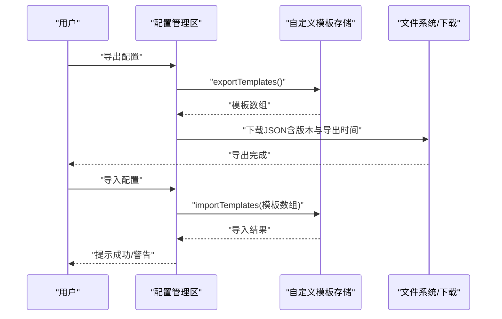
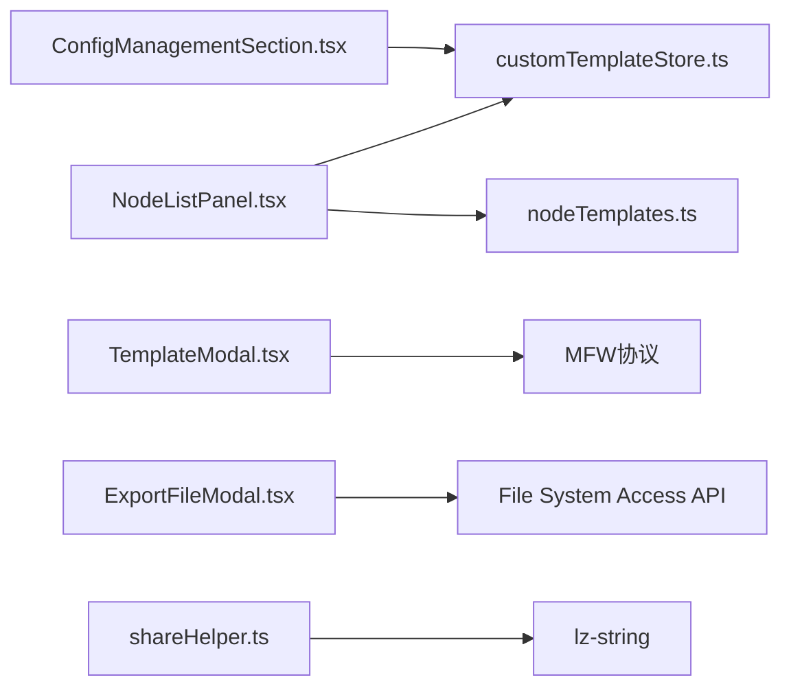

# 模板管理

<cite>
**本文档引用的文件**
- [customTemplateStore.ts](file://src/stores/customTemplateStore.ts)
- [nodeTemplates.ts](file://src/data/nodeTemplates.ts)
- [NodeListPanel.tsx](file://src/components/panels/main/node-list/NodeListPanel.tsx)
- [NodeListItem.tsx](file://src/components/panels/main/node-list/NodeListItem.tsx)
- [NodeAddPanel.module.less](file://src/styles/NodeAddPanel.module.less)
- [ConfigManagementSection.tsx](file://src/components/panels/config/ConfigManagementSection.tsx)
- [ExportFileModal.tsx](file://src/components/modals/ExportFileModal.tsx)
- [CreateFileModal.tsx](file://src/components/modals/CreateFileModal.tsx)
- [TemplateModal.tsx](file://src/components/modals/TemplateModal.tsx)
- [useGlobalShortcuts.ts](file://src/hooks/useGlobalShortcuts.ts)
- [shareHelper.ts](file://src/utils/shareHelper.ts)
</cite>

## 目录
1. [简介](#简介)
2. [项目结构](#项目结构)
3. [核心组件](#核心组件)
4. [架构总览](#架构总览)
5. [详细组件分析](#详细组件分析)
6. [依赖关系分析](#依赖关系分析)
7. [性能考虑](#性能考虑)
8. [故障排查指南](#故障排查指南)
9. [结论](#结论)
10. [附录](#附录)

## 简介
本章节面向MaaPipelineEditor的“模板管理”能力，系统性说明模板列表的展示与组织、搜索过滤与排序策略；模板的增删改查与批量操作；模板的导入导出机制与兼容性处理；备份与恢复、版本管理；权限与共享机制；以及用户界面操作与快捷键说明，并提供性能优化与大数据量处理建议。

## 项目结构
围绕模板管理的关键代码分布在以下模块：
- 状态与数据层：自定义模板存储（localStorage）、预设模板集合
- UI面板层：节点列表面板、节点列表项、模板编辑弹窗
- 导入导出层：配置导出/导入、文件导出弹窗、本地文件创建
- 工具与协议层：分享工具、全局快捷键钩子

图表来源
- [customTemplateStore.ts:1-310](file://src/stores/customTemplateStore.ts#L1-L310)
- [nodeTemplates.ts:1-108](file://src/data/nodeTemplates.ts#L1-L108)
- [NodeListPanel.tsx:1-396](file://src/components/panels/main/node-list/NodeListPanel.tsx#L1-L396)
- [NodeListItem.tsx:1-109](file://src/components/panels/main/node-list/NodeListItem.tsx#L1-L109)
- [TemplateModal.tsx:1-991](file://src/components/modals/TemplateModal.tsx#L1-L991)
- [ConfigManagementSection.tsx:1-138](file://src/components/panels/config/ConfigManagementSection.tsx#L1-L138)
- [ExportFileModal.tsx:1-302](file://src/components/modals/ExportFileModal.tsx#L1-L302)
- [CreateFileModal.tsx:1-450](file://src/components/modals/CreateFileModal.tsx#L1-L450)
- [shareHelper.ts:1-55](file://src/utils/shareHelper.ts#L1-L55)
- [useGlobalShortcuts.ts:1-147](file://src/hooks/useGlobalShortcuts.ts#L1-L147)

章节来源
- [customTemplateStore.ts:1-310](file://src/stores/customTemplateStore.ts#L1-L310)
- [nodeTemplates.ts:1-108](file://src/data/nodeTemplates.ts#L1-L108)
- [NodeListPanel.tsx:1-396](file://src/components/panels/main/node-list/NodeListPanel.tsx#L1-L396)
- [NodeListItem.tsx:1-109](file://src/components/panels/main/node-list/NodeListItem.tsx#L1-L109)
- [TemplateModal.tsx:1-991](file://src/components/modals/TemplateModal.tsx#L1-L991)
- [ConfigManagementSection.tsx:1-138](file://src/components/panels/config/ConfigManagementSection.tsx#L1-L138)
- [ExportFileModal.tsx:1-302](file://src/components/modals/ExportFileModal.tsx#L1-L302)
- [CreateFileModal.tsx:1-450](file://src/components/modals/CreateFileModal.tsx#L1-L450)
- [shareHelper.ts:1-55](file://src/utils/shareHelper.ts#L1-L55)
- [useGlobalShortcuts.ts:1-147](file://src/hooks/useGlobalShortcuts.ts#L1-L147)

## 核心组件
- 自定义模板存储（customTemplateStore）
  - 负责模板的持久化（localStorage）、版本校验与迁移、增删改查、导入导出、数量限制与名称校验
  - 数据结构：模板版本号、模板数组（含标签、节点类型、序列化数据、创建时间）
- 预设模板集合（nodeTemplates）
  - 内置常用模板（如空节点、文字识别、图像识别、外部节点、锚点、便签、分组等）
- 节点列表面板（NodeListPanel）
  - 展示节点列表，支持关键词过滤、类型筛选、分组折叠、统计信息、快捷键关闭
- 节点列表项（NodeListItem）
  - 单项展示节点标签、识别/动作类型、入出边数、悬停预览
- 模板图片编辑弹窗（TemplateModal）
  - 截图绘制、ROI框选、遮罩叠加、模板导出、路径解析
- 配置管理区（ConfigManagementSection）
  - 导出/导入配置，包含自定义模板数据
- 导出文件弹窗（ExportFileModal）
  - 导出Pipeline与配置（分离/集成模式），支持File System Access API与传统下载
- 新建本地文件弹窗（CreateFileModal）
  - 在本地服务中创建新文件，写入当前画布内容
- 分享工具（shareHelper）
  - 压缩分享内容，生成/解析分享链接
- 全局快捷键（useGlobalShortcuts）
  - Delete键重定向、撤销/重做快捷键

章节来源
- [customTemplateStore.ts:1-310](file://src/stores/customTemplateStore.ts#L1-L310)
- [nodeTemplates.ts:1-108](file://src/data/nodeTemplates.ts#L1-L108)
- [NodeListPanel.tsx:1-396](file://src/components/panels/main/node-list/NodeListPanel.tsx#L1-L396)
- [NodeListItem.tsx:1-109](file://src/components/panels/main/node-list/NodeListItem.tsx#L1-L109)
- [TemplateModal.tsx:1-991](file://src/components/modals/TemplateModal.tsx#L1-L991)
- [ConfigManagementSection.tsx:1-138](file://src/components/panels/config/ConfigManagementSection.tsx#L1-L138)
- [ExportFileModal.tsx:1-302](file://src/components/modals/ExportFileModal.tsx#L1-L302)
- [CreateFileModal.tsx:1-450](file://src/components/modals/CreateFileModal.tsx#L1-L450)
- [shareHelper.ts:1-55](file://src/utils/shareHelper.ts#L1-L55)
- [useGlobalShortcuts.ts:1-147](file://src/hooks/useGlobalShortcuts.ts#L1-L147)

## 架构总览
模板管理贯穿“状态存储—UI展示—导入导出—协议交互”的完整链路，采用Zustand状态管理，UI组件通过store暴露的方法进行读写，同时与本地服务协议（文件、资源、MFW）协作完成模板的创建、导出与路径解析。

图表来源
- [customTemplateStore.ts:1-310](file://src/stores/customTemplateStore.ts#L1-L310)
- [NodeListPanel.tsx:1-396](file://src/components/panels/main/node-list/NodeListPanel.tsx#L1-L396)
- [ConfigManagementSection.tsx:1-138](file://src/components/panels/config/ConfigManagementSection.tsx#L1-L138)
- [ExportFileModal.tsx:1-302](file://src/components/modals/ExportFileModal.tsx#L1-L302)
- [CreateFileModal.tsx:1-450](file://src/components/modals/CreateFileModal.tsx#L1-L450)

## 详细组件分析

### 自定义模板存储（customTemplateStore）
- 功能要点
  - 加载：从localStorage读取，版本校验与迁移，转换为NodeTemplateType并按创建时间倒序
  - 新增：名称长度与字符校验、数量上限（默认50）、序列化节点数据（去除label）
  - 删除：按标签过滤，回写localStorage
  - 更新：基于remove+add的组合
  - 查询：getAllTemplates合并预设模板与自定义模板，保证空节点、贴纸、分组等特殊模板的固定顺序
  - 导出/导入：exportTemplates返回可序列化模板数组；importTemplates进行格式校验与转换
- 性能与可靠性
  - localStorage写入失败时回滚状态并提示
  - 模板数量上限防止过度膨胀
  - 版本不匹配时清空并提示迁移

图表来源
- [customTemplateStore.ts:96-170](file://src/stores/customTemplateStore.ts#L96-L170)

章节来源
- [customTemplateStore.ts:1-310](file://src/stores/customTemplateStore.ts#L1-L310)

### 预设模板集合（nodeTemplates）
- 作用：提供内置模板，覆盖常见节点类型（空节点、文字识别、图像识别、外部节点、锚点、便签、分组等）
- 与自定义模板合并：在getAllTemplates中优先放置特殊模板，然后是自定义模板，最后是其他预设模板

章节来源
- [nodeTemplates.ts:1-108](file://src/data/nodeTemplates.ts#L1-L108)
- [customTemplateStore.ts:212-248](file://src/stores/customTemplateStore.ts#L212-L248)

### 节点列表面板（NodeListPanel）
- 展示与组织
  - 支持关键词过滤（标签、识别类型、动作类型）
  - 类型筛选（Pipeline/External/Anchor/Sticker/Group）
  - 分组折叠（按节点类型分组，支持展开/收起）
  - 统计信息（总数与各类型数量）
- 交互与快捷键
  - ESC键关闭
  - 点击面板外部关闭（排除Ant Design弹出层）
  - 窗口尺寸变化时动态定位与高度适配

图表来源
- [NodeListPanel.tsx:48-396](file://src/components/panels/main/node-list/NodeListPanel.tsx#L48-L396)

章节来源
- [NodeListPanel.tsx:1-396](file://src/components/panels/main/node-list/NodeListPanel.tsx#L1-L396)
- [NodeListItem.tsx:1-109](file://src/components/panels/main/node-list/NodeListItem.tsx#L1-L109)
- [NodeAddPanel.module.less:139-251](file://src/styles/NodeAddPanel.module.less#L139-L251)

### 模板图片编辑弹窗（TemplateModal）
- 功能
  - 截图绘制、ROI框选、遮罩叠加（画笔/橡皮擦）
  - 导出PNG模板，支持File System Access API与传统下载
  - 请求后端解析模板相对路径，兼容负数坐标与分割区域
- 交互
  - 工具切换、画笔大小调节、坐标手动输入、清除遮罩
  - 鼠标拖拽绘制、滚轮缩放禁用、光标样式切换

图表来源
- [TemplateModal.tsx:380-496](file://src/components/modals/TemplateModal.tsx#L380-L496)
- [TemplateModal.tsx:80-101](file://src/components/modals/TemplateModal.tsx#L80-L101)

章节来源
- [TemplateModal.tsx:1-991](file://src/components/modals/TemplateModal.tsx#L1-L991)

### 导入导出与备份恢复
- 配置导出/导入（ConfigManagementSection）
  - 导出：合并当前配置与自定义模板，生成JSON文件
  - 导入：替换配置，尝试导入自定义模板，分别提示成功/警告
- 文件导出（ExportFileModal）
  - 支持JSON/JSONC格式，分离/集成两种模式
  - 优先使用File System Access API，失败回退传统下载
- 新建本地文件（CreateFileModal）
  - 通过协议在本地服务创建文件，写入当前画布内容
- 版本管理与兼容性
  - 自定义模板存储具备版本号与迁移逻辑，版本不匹配时清空并提示
  - 导入模板前进行数组格式校验与转换

图表来源
- [ConfigManagementSection.tsx:27-102](file://src/components/panels/config/ConfigManagementSection.tsx#L27-L102)
- [customTemplateStore.ts:255-307](file://src/stores/customTemplateStore.ts#L255-L307)
- [ExportFileModal.tsx:102-188](file://src/components/modals/ExportFileModal.tsx#L102-L188)
- [CreateFileModal.tsx:218-262](file://src/components/modals/CreateFileModal.tsx#L218-L262)

章节来源
- [ConfigManagementSection.tsx:1-138](file://src/components/panels/config/ConfigManagementSection.tsx#L1-L138)
- [customTemplateStore.ts:1-310](file://src/stores/customTemplateStore.ts#L1-L310)
- [ExportFileModal.tsx:1-302](file://src/components/modals/ExportFileModal.tsx#L1-L302)
- [CreateFileModal.tsx:1-450](file://src/components/modals/CreateFileModal.tsx#L1-L450)

### 权限控制与共享机制
- 权限控制
  - 浏览器剪贴板权限查询与读写状态跟踪（用于复制/粘贴场景）
- 共享机制
  - 使用lz-string压缩pipeline JSON，通过URL参数分享
  - 支持版本号包装与解码，便于未来升级

章节来源
- [shareHelper.ts:1-55](file://src/utils/shareHelper.ts#L1-L55)

### 用户界面操作指南与快捷键
- 模板列表
  - 打开：在节点列表面板中查看与筛选
  - 搜索：支持标签、识别类型、动作类型的关键词过滤
  - 分类：按节点类型分组，支持展开/收起
  - 快捷键：ESC关闭面板
- 模板编辑
  - 模板图片编辑弹窗：工具切换、坐标输入、遮罩绘制、导出PNG
- 全局快捷键
  - Delete键重定向为Backspace
  - Ctrl/Cmd+Z撤销，Ctrl/Cmd+Y或Ctrl+Shift+Z重做

章节来源
- [NodeListPanel.tsx:294-305](file://src/components/panels/main/node-list/NodeListPanel.tsx#L294-L305)
- [TemplateModal.tsx:515-540](file://src/components/modals/TemplateModal.tsx#L515-L540)
- [useGlobalShortcuts.ts:121-126](file://src/hooks/useGlobalShortcuts.ts#L121-L126)
- [useGlobalShortcuts.ts:60-116](file://src/hooks/useGlobalShortcuts.ts#L60-L116)

## 依赖关系分析
- 组件耦合
  - NodeListPanel依赖NodeTemplateType与预设模板集合，通过customTemplateStore获取/更新模板
  - TemplateModal依赖MFW协议进行路径解析，依赖Canvas绘制ROI与遮罩
  - ConfigManagementSection依赖customTemplateStore进行模板导入导出
- 外部依赖
  - localStorage用于模板持久化
  - File System Access API用于现代浏览器的文件保存体验
  - lz-string用于分享内容压缩

图表来源
- [NodeListPanel.tsx:1-396](file://src/components/panels/main/node-list/NodeListPanel.tsx#L1-L396)
- [customTemplateStore.ts:1-310](file://src/stores/customTemplateStore.ts#L1-L310)
- [nodeTemplates.ts:1-108](file://src/data/nodeTemplates.ts#L1-L108)
- [TemplateModal.tsx:1-991](file://src/components/modals/TemplateModal.tsx#L1-L991)
- [ConfigManagementSection.tsx:1-138](file://src/components/panels/config/ConfigManagementSection.tsx#L1-L138)
- [ExportFileModal.tsx:1-302](file://src/components/modals/ExportFileModal.tsx#L1-L302)
- [shareHelper.ts:1-55](file://src/utils/shareHelper.ts#L1-L55)

章节来源
- [NodeListPanel.tsx:1-396](file://src/components/panels/main/node-list/NodeListPanel.tsx#L1-L396)
- [customTemplateStore.ts:1-310](file://src/stores/customTemplateStore.ts#L1-L310)
- [TemplateModal.tsx:1-991](file://src/components/modals/TemplateModal.tsx#L1-L991)
- [ConfigManagementSection.tsx:1-138](file://src/components/panels/config/ConfigManagementSection.tsx#L1-L138)
- [ExportFileModal.tsx:1-302](file://src/components/modals/ExportFileModal.tsx#L1-L302)
- [shareHelper.ts:1-55](file://src/utils/shareHelper.ts#L1-L55)

## 性能考虑
- 模板数量限制
  - 默认上限50，避免localStorage膨胀与渲染卡顿
- 渲染优化
  - NodeListPanel使用memo与useMemo减少重复渲染
  - 过滤与分组在内存中一次性计算，避免频繁DOM操作
- I/O优化
  - 导出优先使用File System Access API，失败回退传统下载，兼顾用户体验与兼容性
  - 模板序列化采用深拷贝与JSON.parse(JSON.stringify(...))，确保独立副本
- 大数据量处理
  - 建议：分批导入、限制同时打开的模板数量、定期清理无用模板
  - 前端：使用虚拟滚动（如需扩展）与懒加载策略

## 故障排查指南
- 模板导入失败
  - 检查JSON格式是否正确、customTemplates字段是否为数组
  - 若版本不匹配，系统会清空旧数据并提示迁移
- 模板保存失败
  - 检查浏览器存储空间与localStorage写入权限
  - 发生异常时会自动回滚状态并提示失败
- 导出文件失败
  - 现代浏览器优先使用File System Access API，若用户取消或抛出AbortError，将回退到传统下载
- 路径解析问题
  - TemplateModal在无法自动解析时会提示手动调整文件名并继续流程

章节来源
- [customTemplateStore.ts:88-94](file://src/stores/customTemplateStore.ts#L88-L94)
- [customTemplateStore.ts:303-306](file://src/stores/customTemplateStore.ts#L303-L306)
- [ExportFileModal.tsx:147-178](file://src/components/modals/ExportFileModal.tsx#L147-L178)
- [TemplateModal.tsx:80-101](file://src/components/modals/TemplateModal.tsx#L80-L101)

## 结论
MaaPipelineEditor的模板管理以Zustand状态管理为核心，结合本地存储与UI面板，实现了模板的增删改查、导入导出、备份恢复与版本兼容。通过节点列表的搜索与分类、模板图片编辑的ROI与遮罩、以及分享与快捷键的支持，提供了完整的模板生命周期管理体验。建议在实际使用中关注模板数量上限、大文件导出的兼容性与路径解析问题，并定期清理冗余模板以维持最佳性能。

## 附录
- 模板数据结构
  - label：模板标签
  - nodeType：节点类型（如Pipeline/External/Anchor/Sticker/Group）
  - data：模板数据工厂（返回序列化后的节点数据）
  - isCustom：是否为自定义模板
  - createTime：创建时间戳
- 常用操作清单
  - 新增模板：通过节点列表面板触发模板保存流程
  - 删除模板：在模板列表中执行删除操作
  - 更新模板：先删除再新增同名模板
  - 导出模板：在配置管理区导出包含自定义模板的JSON
  - 导入模板：在配置管理区导入JSON文件
  - 导出文件：在导出文件弹窗中选择文件名、格式与导出目标
  - 新建本地文件：在新建本地文件弹窗中选择目录与文件名并创建