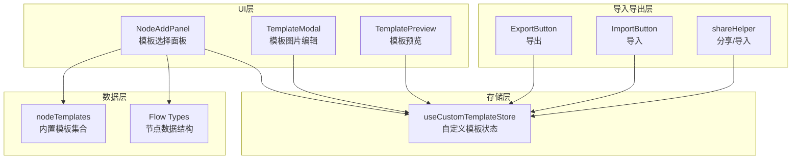
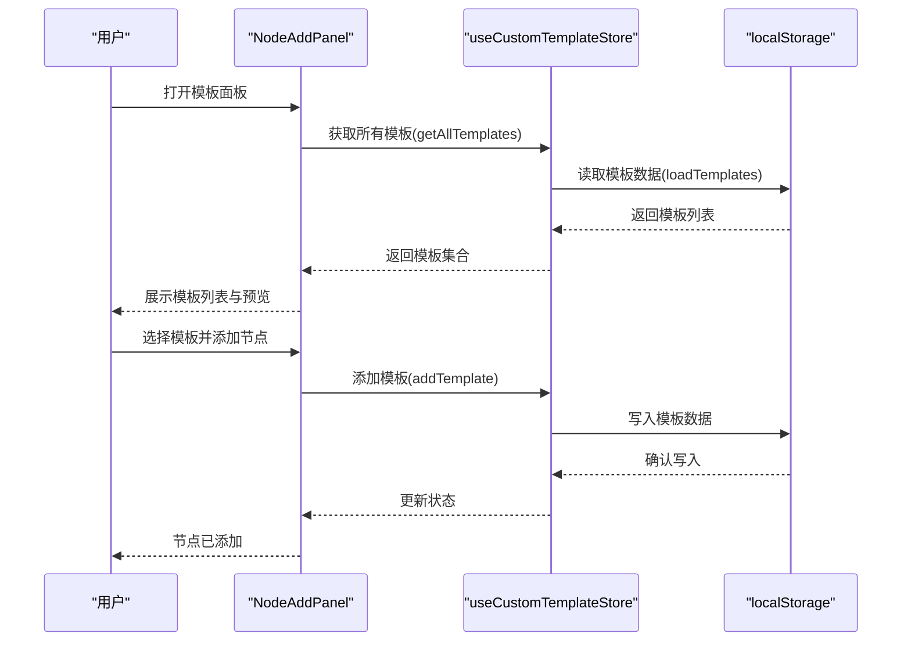
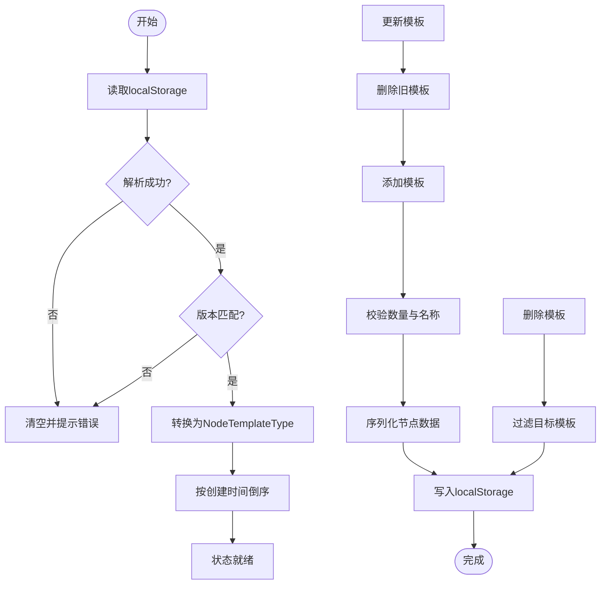
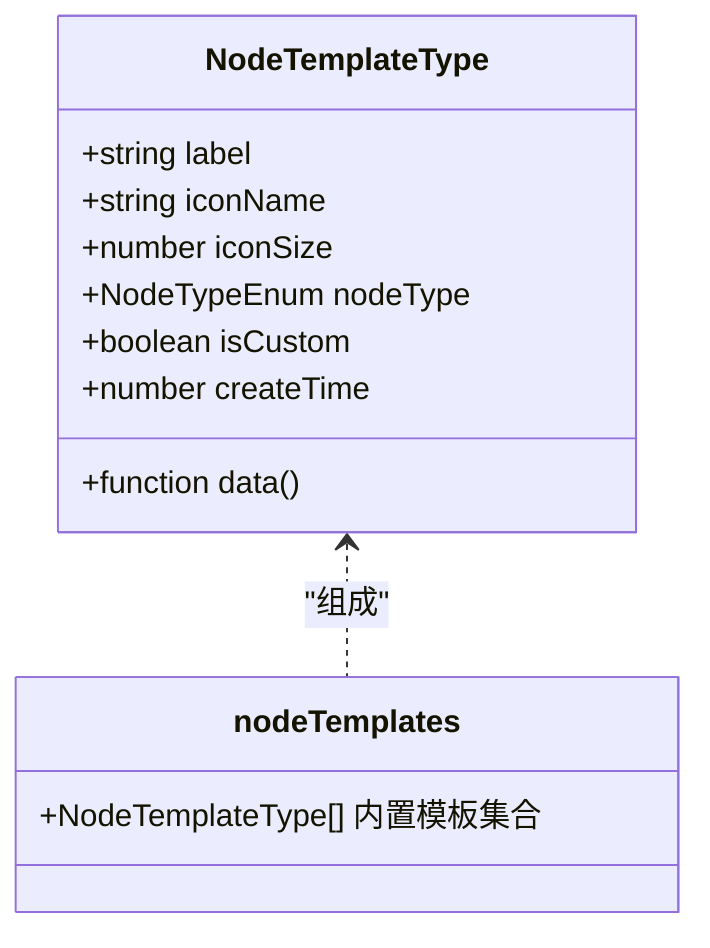
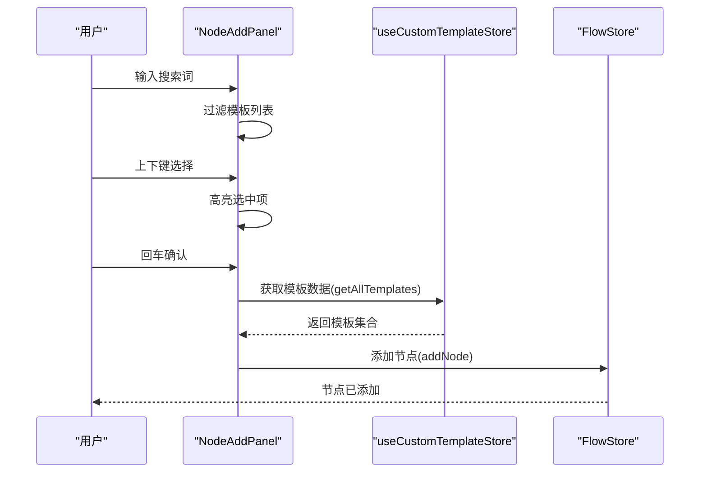
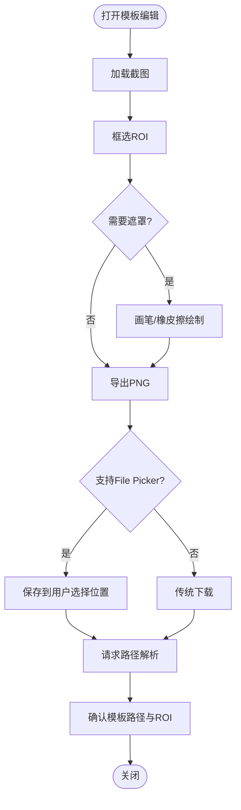
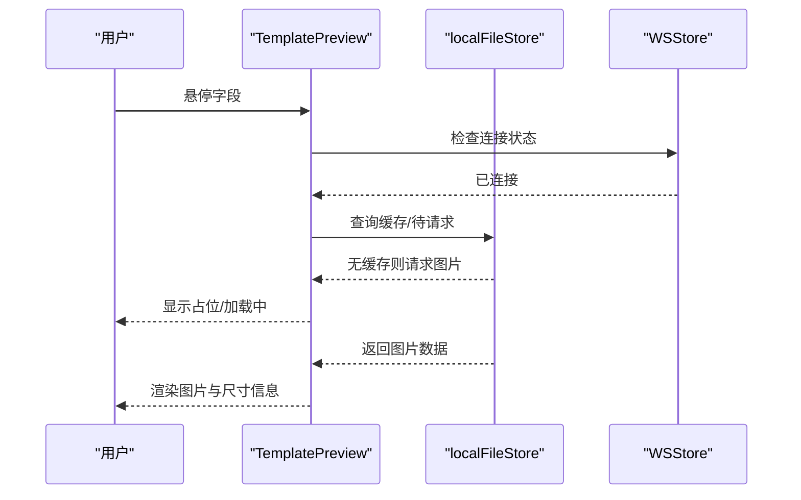
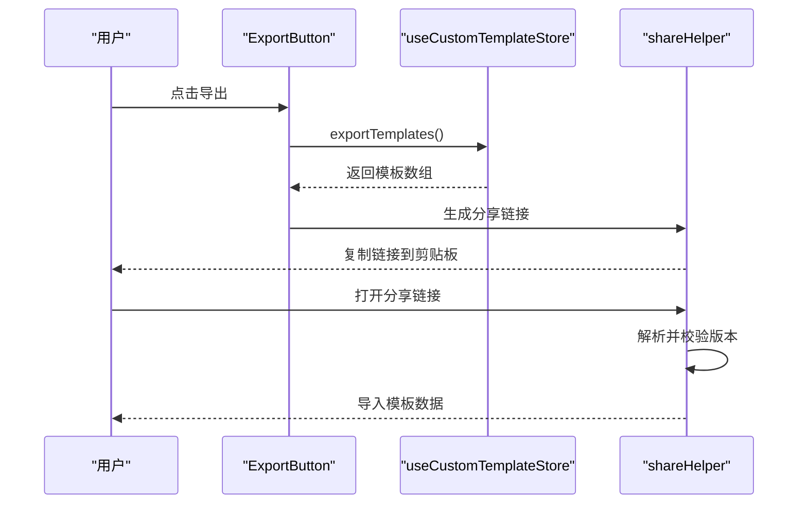
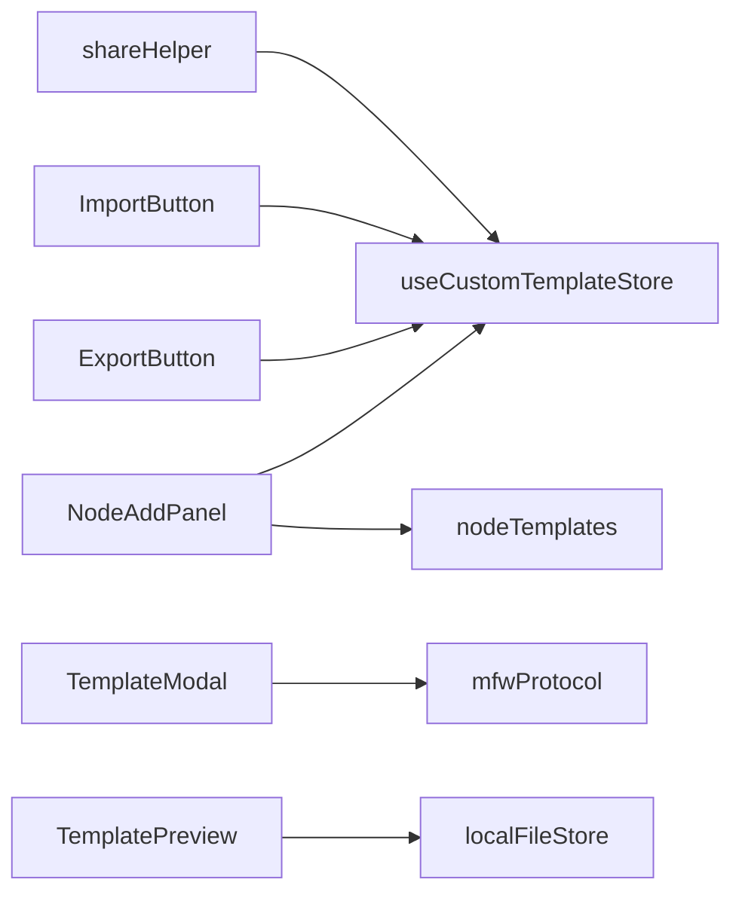

# 模板系统

<cite>
**本文档引用的文件**
- [customTemplateStore.ts](file://src/stores/customTemplateStore.ts)
- [nodeTemplates.ts](file://src/data/nodeTemplates.ts)
- [NodeAddPanel.tsx](file://src/components/panels/main/NodeAddPanel.tsx)
- [TemplateModal.tsx](file://src/components/modals/TemplateModal.tsx)
- [TemplatePreview.tsx](file://src/components/panels/field/items/TemplatePreview.tsx)
- [types.ts](file://src/stores/flow/types.ts)
- [ExportButton.tsx](file://src/components/panels/toolbar/ExportButton.tsx)
- [ImportButton.tsx](file://src/components/panels/toolbar/ImportButton.tsx)
- [shareHelper.ts](file://src/utils/shareHelper.ts)
</cite>

## 目录
1. [简介](#简介)
2. [项目结构](#项目结构)
3. [核心组件](#核心组件)
4. [架构总览](#架构总览)
5. [详细组件分析](#详细组件分析)
6. [依赖关系分析](#依赖关系分析)
7. [性能考量](#性能考量)
8. [故障排查指南](#故障排查指南)
9. [结论](#结论)
10. [附录](#附录)

## 简介
本文件面向MaaPipelineEditor的模板系统，系统性阐述内置模板的设计理念与分类体系，自定义模板的创建与管理流程，模板导入导出机制与版本兼容策略，并提供扩展开发指南与最佳实践。模板系统围绕“节点模板”展开，既支持内置模板（识别、动作、组合等），也支持用户自定义模板的持久化与分享。

## 项目结构
模板系统主要由以下层次构成：
- 数据模型层：定义节点模板与节点数据结构
- 存储层：自定义模板的本地持久化与版本控制
- UI交互层：模板选择面板、模板编辑弹窗、字段预览组件
- 导入导出层：与全局导入导出工具协作，支持模板数据的导入导出

**图表来源**
- [NodeAddPanel.tsx:1-583](file://src/components/panels/main/NodeAddPanel.tsx#L1-583)
- [customTemplateStore.ts:1-310](file://src/stores/customTemplateStore.ts#L1-310)
- [nodeTemplates.ts:1-108](file://src/data/nodeTemplates.ts#L1-108)
- [types.ts:108-122](file://src/stores/flow/types.ts#L108-L122)
- [ExportButton.tsx:1-316](file://src/components/panels/toolbar/ExportButton.tsx#L1-316)
- [ImportButton.tsx:1-235](file://src/components/panels/toolbar/ImportButton.tsx#L1-235)
- [shareHelper.ts:1-287](file://src/utils/shareHelper.ts#L1-L287)

**章节来源**
- [NodeAddPanel.tsx:1-583](file://src/components/panels/main/NodeAddPanel.tsx#L1-583)
- [customTemplateStore.ts:1-310](file://src/stores/customTemplateStore.ts#L1-310)
- [nodeTemplates.ts:1-108](file://src/data/nodeTemplates.ts#L1-108)
- [types.ts:108-122](file://src/stores/flow/types.ts#L108-L122)

## 核心组件
- 自定义模板存储（useCustomTemplateStore）：负责模板的增删改查、导入导出、版本校验与本地持久化。
- 内置模板集合（nodeTemplates）：提供基础模板库，覆盖识别、动作、组合等场景。
- 模板选择面板（NodeAddPanel）：提供模板搜索、键盘导航、预览与添加节点的能力。
- 模板图片编辑（TemplateModal）：支持截图、框选、遮罩绘制与模板图片导出。
- 模板字段预览（TemplatePreview）：在字段面板中展示模板图片，支持多图预览与懒加载。
- 导入导出工具（ExportButton/ImportButton）：与全局导入导出协作，支持模板数据的导出与导入。
- 分享/导入工具（shareHelper）：提供分享链接生成与解析，便于跨设备/跨环境传递模板数据。

**章节来源**
- [customTemplateStore.ts:1-310](file://src/stores/customTemplateStore.ts#L1-310)
- [nodeTemplates.ts:1-108](file://src/data/nodeTemplates.ts#L1-108)
- [NodeAddPanel.tsx:1-583](file://src/components/panels/main/NodeAddPanel.tsx#L1-583)
- [TemplateModal.tsx:1-800](file://src/components/modals/TemplateModal.tsx#L1-800)
- [TemplatePreview.tsx:1-185](file://src/components/panels/field/items/TemplatePreview.tsx#L1-185)
- [ExportButton.tsx:1-316](file://src/components/panels/toolbar/ExportButton.tsx#L1-316)
- [ImportButton.tsx:1-235](file://src/components/panels/toolbar/ImportButton.tsx#L1-235)
- [shareHelper.ts:1-287](file://src/utils/shareHelper.ts#L1-L287)

## 架构总览
模板系统采用“状态驱动 + 本地持久化 + UI交互”的架构：
- 状态驱动：通过Zustand状态管理实现模板数据的集中管理与响应式更新。
- 本地持久化：模板数据以JSON形式存储于localStorage，带版本号与迁移策略。
- UI交互：模板选择面板提供搜索、预览与键盘操作；模板编辑弹窗提供截图与遮罩绘制；字段预览组件提供图片懒加载与多图展示。
- 导入导出：与全局导入导出工具协作，支持模板数据的批量导出与导入。

**图表来源**
- [NodeAddPanel.tsx:300-330](file://src/components/panels/main/NodeAddPanel.tsx#L300-L330)
- [customTemplateStore.ts:50-94](file://src/stores/customTemplateStore.ts#L50-L94)
- [customTemplateStore.ts:96-170](file://src/stores/customTemplateStore.ts#L96-L170)

**章节来源**
- [NodeAddPanel.tsx:300-330](file://src/components/panels/main/NodeAddPanel.tsx#L300-L330)
- [customTemplateStore.ts:50-94](file://src/stores/customTemplateStore.ts#L50-L94)
- [customTemplateStore.ts:96-170](file://src/stores/customTemplateStore.ts#L96-L170)

## 详细组件分析

### 自定义模板存储（useCustomTemplateStore）
- 数据结构与版本控制
  - 存储键名与版本号：通过统一的存储键与版本号实现版本校验与迁移。
  - 存储格式：模板数组包含标签、节点类型、序列化后的节点数据、创建时间等字段。
- 模板生命周期
  - 加载：解析localStorage，若版本不匹配则清空并提示迁移；转换为NodeTemplateType并按创建时间倒序排列。
  - 添加：校验数量上限与名称合法性，序列化节点数据（去除label），写入localStorage并提示成功。
  - 删除：过滤掉目标模板，更新localStorage。
  - 更新：基于删除+添加实现原子性更新。
  - 导出：将当前模板列表转换为可导入格式。
  - 导入：校验数据格式，转换并排序，更新状态与localStorage。
- 错误处理
  - 解析失败时清空损坏数据并提示；写入失败时回滚并提示。

**图表来源**
- [customTemplateStore.ts:50-94](file://src/stores/customTemplateStore.ts#L50-L94)
- [customTemplateStore.ts:96-170](file://src/stores/customTemplateStore.ts#L96-L170)
- [customTemplateStore.ts:172-210](file://src/stores/customTemplateStore.ts#L172-L210)
- [customTemplateStore.ts:255-307](file://src/stores/customTemplateStore.ts#L255-L307)

**章节来源**
- [customTemplateStore.ts:1-310](file://src/stores/customTemplateStore.ts#L1-310)

### 内置模板集合（nodeTemplates）
- 设计理念
  - 覆盖常见节点类型：空节点、文字识别、图像识别、无延迟节点、直接点击、自定义动作、外部节点、锚点、便签、分组等。
  - 参数最小化：内置模板提供典型参数骨架，便于用户快速修改与扩展。
- 分类体系
  - 识别模板：OCR、TemplateMatch等，配合点击动作形成“识别-点击”链路。
  - 动作模板：直接点击、自定义动作等，强调动作执行。
  - 组合模板：外部节点、锚点、便签、分组等，强调流程组织与复用。

**图表来源**
- [nodeTemplates.ts:3-11](file://src/data/nodeTemplates.ts#L3-L11)
- [nodeTemplates.ts:13-107](file://src/data/nodeTemplates.ts#L13-L107)

**章节来源**
- [nodeTemplates.ts:1-108](file://src/data/nodeTemplates.ts#L1-108)

### 模板选择面板（NodeAddPanel）
- 搜索与筛选
  - 支持按模板标签关键词搜索，实时过滤模板列表。
- 预览与交互
  - 提供模板预览区域，展示识别类型、动作类型与参数摘要。
  - 支持键盘上下移动、回车添加、ESC关闭。
  - 自定义模板显示删除按钮，删除前弹出确认对话框。
- 模板合并
  - 通过getAllTemplates将内置模板、自定义模板与其他特殊节点（空节点、便签、分组）有序合并。

**图表来源**
- [NodeAddPanel.tsx:306-330](file://src/components/panels/main/NodeAddPanel.tsx#L306-L330)
- [NodeAddPanel.tsx:317-330](file://src/components/panels/main/NodeAddPanel.tsx#L317-L330)
- [customTemplateStore.ts:212-248](file://src/stores/customTemplateStore.ts#L212-L248)

**章节来源**
- [NodeAddPanel.tsx:283-414](file://src/components/panels/main/NodeAddPanel.tsx#L283-L414)
- [NodeAddPanel.tsx:306-330](file://src/components/panels/main/NodeAddPanel.tsx#L306-L330)
- [customTemplateStore.ts:212-248](file://src/stores/customTemplateStore.ts#L212-L248)

### 模板图片编辑（TemplateModal）
- 截图与框选
  - 支持截图加载、鼠标拖拽框选ROI区域、负数坐标解析与分割显示。
- 遮罩绘制
  - 提供画笔与橡皮擦工具，支持遮罩层叠加与清除。
- 导出与路径解析
  - 导出PNG模板图片，尝试使用File System Access API保存，否则回退到传统下载。
  - 通过后端协议请求相对路径解析，完成后回调确认。

**图表来源**
- [TemplateModal.tsx:380-496](file://src/components/modals/TemplateModal.tsx#L380-L496)
- [TemplateModal.tsx:442-495](file://src/components/modals/TemplateModal.tsx#L442-L495)

**章节来源**
- [TemplateModal.tsx:1-800](file://src/components/modals/TemplateModal.tsx#L1-L800)

### 模板字段预览（TemplatePreview）
- 多图预览
  - 支持同一字段下的多个模板图片路径，懒加载与占位显示。
- 状态管理
  - 基于本地文件缓存与请求队列，避免重复请求与闪烁。
- 显示优化
  - 自适应图片尺寸，最大不超过设定阈值，保证预览清晰与性能。

**图表来源**
- [TemplatePreview.tsx:34-50](file://src/components/panels/field/items/TemplatePreview.tsx#L34-L50)
- [TemplatePreview.tsx:62-137](file://src/components/panels/field/items/TemplatePreview.tsx#L62-L137)

**章节来源**
- [TemplatePreview.tsx:1-185](file://src/components/panels/field/items/TemplatePreview.tsx#L1-L185)

### 导入导出与分享
- 导出
  - 支持导出到剪贴板、导出为文件、保存到本地、部分导出、分离导出（Pipeline/配置）等。
  - 自定义模板可通过导出接口获取模板数据，便于备份与分享。
- 导入
  - 支持从剪贴板与文件导入Pipeline/配置，分离模式下可单独导入配置。
  - 自定义模板可通过导入接口恢复历史模板。
- 分享
  - 通过shareHelper生成压缩的分享链接，支持版本兼容与参数清理。

**图表来源**
- [ExportButton.tsx:46-89](file://src/components/panels/toolbar/ExportButton.tsx#L46-L89)
- [customTemplateStore.ts:255-264](file://src/stores/customTemplateStore.ts#L255-L264)
- [shareHelper.ts:79-115](file://src/utils/shareHelper.ts#L79-L115)
- [shareHelper.ts:206-254](file://src/utils/shareHelper.ts#L206-L254)

**章节来源**
- [ExportButton.tsx:1-316](file://src/components/panels/toolbar/ExportButton.tsx#L1-L316)
- [ImportButton.tsx:1-235](file://src/components/panels/toolbar/ImportButton.tsx#L1-L235)
- [customTemplateStore.ts:255-307](file://src/stores/customTemplateStore.ts#L255-L307)
- [shareHelper.ts:1-287](file://src/utils/shareHelper.ts#L1-L287)

## 依赖关系分析
- 组件耦合
  - NodeAddPanel依赖useCustomTemplateStore与nodeTemplates，负责模板展示与添加。
  - TemplateModal依赖mfwProtocol与截图协议，负责模板图片生成与路径解析。
  - TemplatePreview依赖localFileStore与resourceProtocol，负责图片懒加载与预览。
- 状态与数据
  - 自定义模板状态与Flow节点数据结构解耦，通过data函数延迟解析，降低内存占用。
- 外部依赖
  - localStorage用于模板持久化；浏览器API（File System Access、Clipboard）用于导入导出与剪贴板交互。

**图表来源**
- [NodeAddPanel.tsx:10-13](file://src/components/panels/main/NodeAddPanel.tsx#L10-L13)
- [TemplateModal.tsx:21-25](file://src/components/modals/TemplateModal.tsx#L21-L25)
- [TemplatePreview.tsx:3-5](file://src/components/panels/field/items/TemplatePreview.tsx#L3-L5)
- [ExportButton.tsx:14-17](file://src/components/panels/toolbar/ExportButton.tsx#L14-L17)
- [ImportButton.tsx:10-13](file://src/components/panels/toolbar/ImportButton.tsx#L10-L13)
- [shareHelper.ts:7-9](file://src/utils/shareHelper.ts#L7-L9)

**章节来源**
- [NodeAddPanel.tsx:10-13](file://src/components/panels/main/NodeAddPanel.tsx#L10-L13)
- [TemplateModal.tsx:21-25](file://src/components/modals/TemplateModal.tsx#L21-L25)
- [TemplatePreview.tsx:3-5](file://src/components/panels/field/items/TemplatePreview.tsx#L3-L5)
- [ExportButton.tsx:14-17](file://src/components/panels/toolbar/ExportButton.tsx#L14-L17)
- [ImportButton.tsx:10-13](file://src/components/panels/toolbar/ImportButton.tsx#L10-L13)
- [shareHelper.ts:7-9](file://src/utils/shareHelper.ts#L7-L9)

## 性能考量
- 模板加载
  - 采用版本校验与一次性读取策略，避免频繁解析与异常回退。
- 模板渲染
  - 模板列表使用虚拟滚动与按需渲染，减少DOM压力。
- 图片预览
  - TemplatePreview采用懒加载与尺寸自适应，避免大图阻塞UI。
- 导入导出
  - 导出前统一序列化，导入时批量校验，减少错误传播。

## 故障排查指南
- 自定义模板无法加载
  - 检查localStorage中存储键是否存在，版本号是否匹配；若不匹配会自动清空并提示迁移。
- 模板保存失败
  - 检查浏览器存储空间与写入权限；失败时会回滚并提示错误。
- 模板导入失败
  - 确认导入数据格式为数组；导入后会进行格式转换与排序。
- 模板图片导出异常
  - 检查截图是否加载成功；若使用File System Access API失败会回退到传统下载。
- 分享链接无效
  - 检查分享版本号与当前版本是否一致；过长链接可能在某些浏览器中受限。

**章节来源**
- [customTemplateStore.ts:88-93](file://src/stores/customTemplateStore.ts#L88-L93)
- [customTemplateStore.ts:163-169](file://src/stores/customTemplateStore.ts#L163-L169)
- [customTemplateStore.ts:266-307](file://src/stores/customTemplateStore.ts#L266-L307)
- [TemplateModal.tsx:442-496](file://src/components/modals/TemplateModal.tsx#L442-L496)
- [shareHelper.ts:61-73](file://src/utils/shareHelper.ts#L61-L73)

## 结论
MaaPipelineEditor的模板系统以“内置模板 + 自定义模板”的双轨设计为核心，结合本地持久化与UI交互，提供了高效、易用的节点模板管理能力。通过清晰的版本控制、完善的导入导出与分享机制，以及可扩展的字段预览组件，模板系统能够满足从新手到高级用户的多样化需求。

## 附录

### 模板类型与数据结构
- 节点模板类型（NodeTemplateType）
  - 字段：标签、图标名、图标尺寸、节点类型、数据工厂函数、是否自定义、创建时间。
- 节点数据类型（PipelineNodeDataType）
  - 字段：识别参数、动作参数、其他参数、额外数据、类型、句柄方向等。

**章节来源**
- [nodeTemplates.ts:3-11](file://src/data/nodeTemplates.ts#L3-L11)
- [types.ts:108-122](file://src/stores/flow/types.ts#L108-L122)

### 模板创建流程（自定义模板）
- 步骤
  - 在模板选择面板中选择合适的内置模板作为起点。
  - 在画布中调整识别区域、动作参数与延时等细节。
  - 点击“保存为模板”，填写模板名称并确认。
  - 模板将保存至localStorage，可在模板面板中查看与删除。

**章节来源**
- [NodeAddPanel.tsx:317-330](file://src/components/panels/main/NodeAddPanel.tsx#L317-L330)
- [customTemplateStore.ts:96-170](file://src/stores/customTemplateStore.ts#L96-L170)

### 模板管理功能
- 编辑：通过更新模板实现，内部基于删除+添加。
- 删除：支持一键删除自定义模板，删除前弹出确认。
- 排序：按创建时间倒序排列，确保最新模板优先显示。
- 搜索：支持按模板标签关键词搜索，快速定位模板。

**章节来源**
- [customTemplateStore.ts:202-210](file://src/stores/customTemplateStore.ts#L202-L210)
- [NodeAddPanel.tsx:332-350](file://src/components/panels/main/NodeAddPanel.tsx#L332-L350)
- [customTemplateStore.ts:84-85](file://src/stores/customTemplateStore.ts#L84-L85)

### 模板导入导出机制
- 导出格式
  - 模板数组包含标签、节点类型、序列化数据、创建时间等字段。
- 导入兼容性
  - 导入时进行格式校验与版本兼容处理，失败时提示并回滚。
- 批量操作
  - 支持一次性导出所有自定义模板，便于备份与迁移。

**章节来源**
- [customTemplateStore.ts:255-307](file://src/stores/customTemplateStore.ts#L255-L307)
- [ExportButton.tsx:46-89](file://src/components/panels/toolbar/ExportButton.tsx#L46-L89)

### 模板版本管理与共享
- 版本管理
  - 通过存储版本号与迁移策略，确保不同版本间的兼容性。
- 共享机制
  - 通过分享链接生成与解析，实现模板数据的跨设备传输。

**章节来源**
- [customTemplateStore.ts:60-69](file://src/stores/customTemplateStore.ts#L60-L69)
- [shareHelper.ts:79-115](file://src/utils/shareHelper.ts#L79-L115)
- [shareHelper.ts:206-254](file://src/utils/shareHelper.ts#L206-L254)

### 模板开发最佳实践与设计原则
- 最佳实践
  - 模板命名简洁明确，便于搜索与识别。
  - 参数尽量最小化，避免冗余配置。
  - 使用负数坐标与遮罩绘制提升模板鲁棒性。
  - 定期导出模板备份，防止意外丢失。
- 设计原则
  - 可复用性：模板应尽量抽象通用场景。
  - 可维护性：保持模板结构清晰，参数命名规范。
  - 可扩展性：预留参数扩展点，便于后续增强。

### 模板系统扩展开发指南
- 新增模板类型
  - 在nodeTemplates中新增内置模板条目，定义图标、节点类型与初始数据。
  - 在Flow类型定义中补充对应节点数据结构，确保类型安全。
- 新增模板功能
  - 在TemplateModal中扩展工具与参数，如新增遮罩算法或ROI优化策略。
  - 在TemplatePreview中增强图片处理逻辑，如支持动态尺寸与格式转换。
- 新增导入导出格式
  - 在导入导出组件中扩展解析与序列化逻辑，确保向后兼容与错误处理。

**章节来源**
- [nodeTemplates.ts:13-107](file://src/data/nodeTemplates.ts#L13-L107)
- [types.ts:108-122](file://src/stores/flow/types.ts#L108-L122)
- [TemplateModal.tsx:1-800](file://src/components/modals/TemplateModal.tsx#L1-L800)
- [TemplatePreview.tsx:1-185](file://src/components/panels/field/items/TemplatePreview.tsx#L1-L185)
- [ExportButton.tsx:1-316](file://src/components/panels/toolbar/ExportButton.tsx#L1-L316)
- [ImportButton.tsx:1-235](file://src/components/panels/toolbar/ImportButton.tsx#L1-L235)