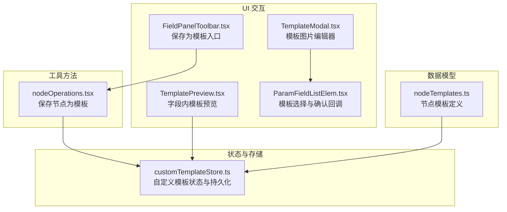
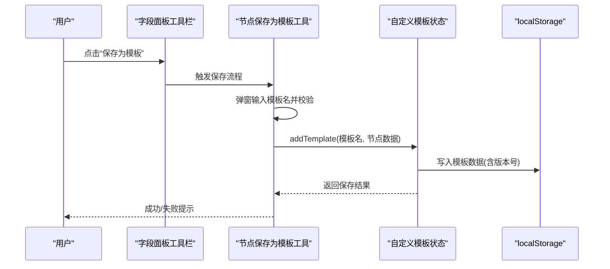
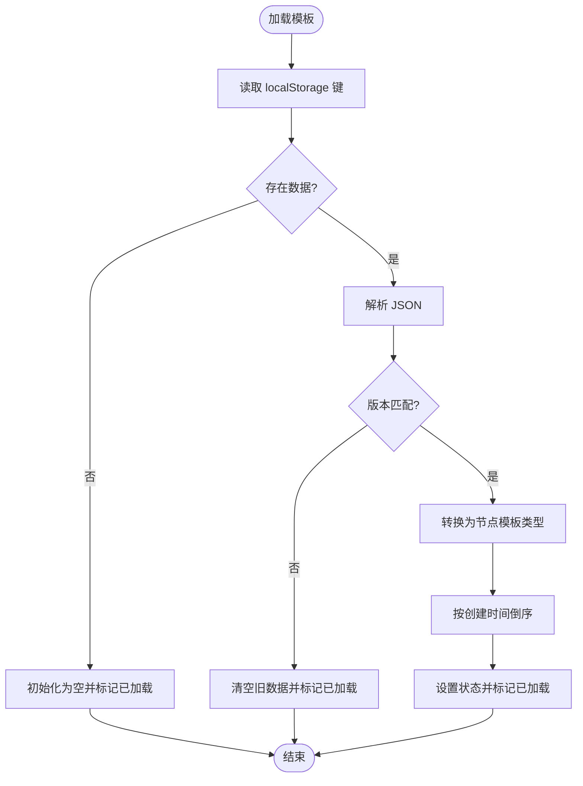
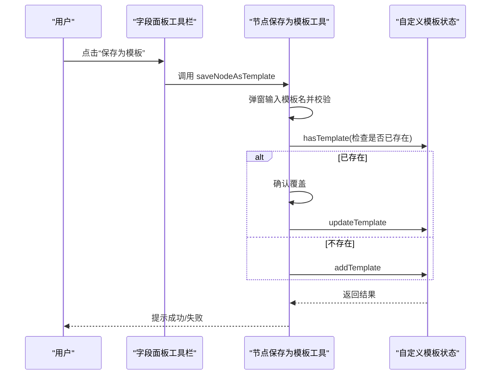
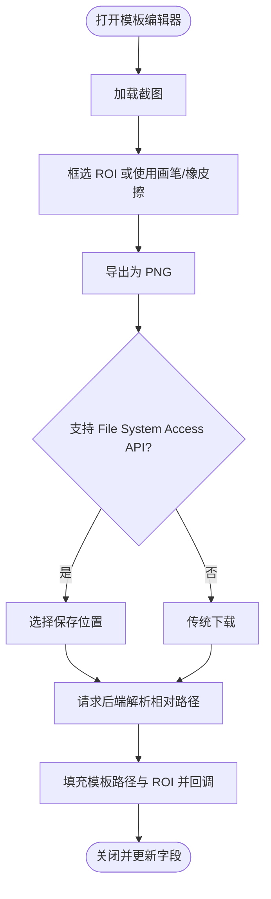
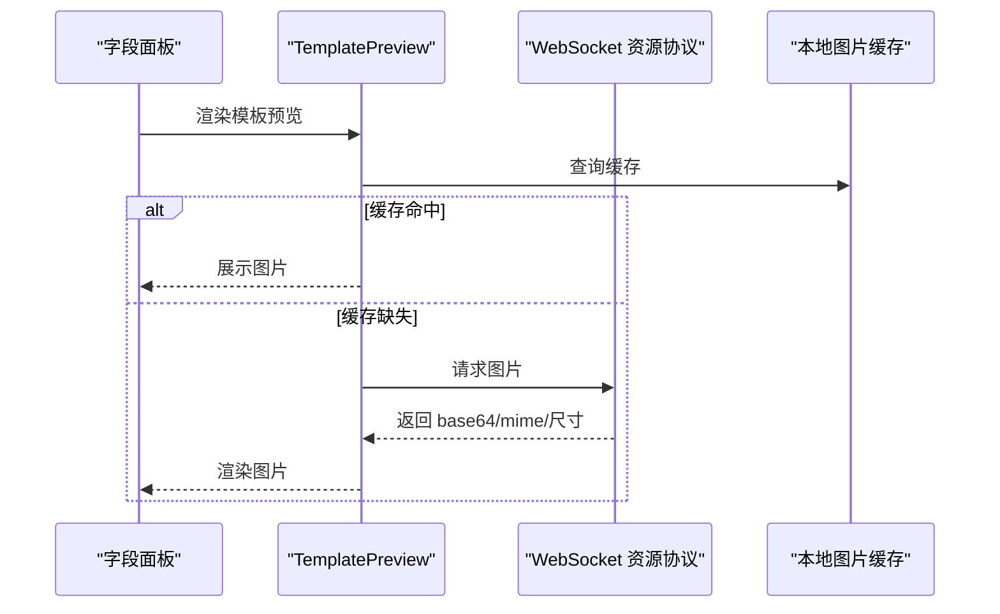
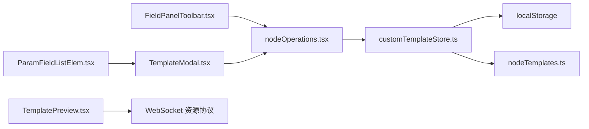

# 自定义模板

<cite>
**本文档引用的文件**
- [customTemplateStore.ts](file://src/stores/customTemplateStore.ts)
- [TemplateModal.tsx](file://src/components/modals/TemplateModal.tsx)
- [TemplatePreview.tsx](file://src/components/panels/field/items/TemplatePreview.tsx)
- [nodeTemplates.ts](file://src/data/nodeTemplates.ts)
- [FieldPanelToolbar.tsx](file://src/components/panels/field/tools/FieldPanelToolbar.tsx)
- [nodeOperations.tsx](file://src/components/flow/nodes/utils/nodeOperations.tsx)
- [ParamFieldListElem.tsx](file://src/components/panels/field/items/ParamFieldListElem.tsx)
- [NodeListPanel.tsx](file://src/components/panels/main/node-list/NodeListPanel.tsx)
- [ExportFileModal.tsx](file://src/components/modals/ExportFileModal.tsx)
</cite>

## 目录
1. [简介](#简介)
2. [项目结构](#项目结构)
3. [核心组件](#核心组件)
4. [架构总览](#架构总览)
5. [详细组件分析](#详细组件分析)
6. [依赖关系分析](#依赖关系分析)
7. [性能考量](#性能考量)
8. [故障排查指南](#故障排查指南)
9. [结论](#结论)
10. [附录](#附录)

## 简介
本章节面向希望使用与扩展 MaaPipelineEditor 自定义模板能力的开发者与使用者，系统讲解自定义模板的创建流程、参数配置、样式设置、数据结构与存储机制、模板编辑器功能（字段配置、预览、验证）、命名规范与分类管理、导入导出格式与兼容性处理、完整开发示例与最佳实践，以及版本管理与冲突解决机制。

## 项目结构
围绕“自定义模板”的关键代码分布在以下模块：
- 状态与存储：自定义模板的增删改查、版本控制、本地持久化
- UI 交互：模板保存入口、模板图片编辑与确认、字段面板中的模板预览
- 数据模型：节点模板与节点数据的结构定义
- 工具方法：节点保存为模板的通用逻辑

**图表来源**
- [customTemplateStore.ts:1-310](file://src/stores/customTemplateStore.ts#L1-L310)
- [FieldPanelToolbar.tsx:88-93](file://src/components/panels/field/tools/FieldPanelToolbar.tsx#L88-L93)
- [TemplateModal.tsx:380-496](file://src/components/modals/TemplateModal.tsx#L380-L496)
- [TemplatePreview.tsx:18-185](file://src/components/panels/field/items/TemplatePreview.tsx#L18-L185)
- [ParamFieldListElem.tsx:249-279](file://src/components/panels/field/items/ParamFieldListElem.tsx#L249-L279)
- [nodeTemplates.ts:3-11](file://src/data/nodeTemplates.ts#L3-L11)
- [nodeOperations.tsx:35-140](file://src/components/flow/nodes/utils/nodeOperations.tsx#L35-L140)

**章节来源**
- [customTemplateStore.ts:1-310](file://src/stores/customTemplateStore.ts#L1-L310)
- [FieldPanelToolbar.tsx:88-93](file://src/components/panels/field/tools/FieldPanelToolbar.tsx#L88-L93)
- [TemplateModal.tsx:380-496](file://src/components/modals/TemplateModal.tsx#L380-L496)
- [TemplatePreview.tsx:18-185](file://src/components/panels/field/items/TemplatePreview.tsx#L18-L185)
- [ParamFieldListElem.tsx:249-279](file://src/components/panels/field/items/ParamFieldListElem.tsx#L249-L279)
- [nodeTemplates.ts:3-11](file://src/data/nodeTemplates.ts#L3-L11)
- [nodeOperations.tsx:35-140](file://src/components/flow/nodes/utils/nodeOperations.tsx#L35-L140)

## 核心组件
- 自定义模板状态与持久化
  - 存储键与版本：localStorage 中以固定键名保存，采用版本号进行兼容性校验
  - 数据结构：模板列表包含标签、节点类型、序列化后的节点数据、创建时间；对外暴露为节点模板对象
  - 功能接口：加载、新增、删除、更新、导出、导入、查询是否存在、合并预设模板
- 模板保存入口
  - 通过字段面板工具栏触发“保存为模板”，弹窗输入模板名并调用状态层保存
- 模板图片编辑器
  - 截图选择区域、画笔/橡皮擦遮罩、负数坐标解析、保存为 PNG 并请求后端解析相对路径
- 字段面板中的模板预览
  - 基于 WebSocket 资源协议请求图片，支持多路径与尺寸适配，悬停展示
- 节点模板定义
  - 预设模板与自定义模板统一的数据结构，便于在节点列表与模板面板中一致呈现

**章节来源**
- [customTemplateStore.ts:7-43](file://src/stores/customTemplateStore.ts#L7-L43)
- [customTemplateStore.ts:50-94](file://src/stores/customTemplateStore.ts#L50-L94)
- [customTemplateStore.ts:96-170](file://src/stores/customTemplateStore.ts#L96-L170)
- [customTemplateStore.ts:172-210](file://src/stores/customTemplateStore.ts#L172-L210)
- [customTemplateStore.ts:212-248](file://src/stores/customTemplateStore.ts#L212-L248)
- [customTemplateStore.ts:255-307](file://src/stores/customTemplateStore.ts#L255-L307)
- [FieldPanelToolbar.tsx:88-93](file://src/components/panels/field/tools/FieldPanelToolbar.tsx#L88-L93)
- [nodeOperations.tsx:35-140](file://src/components/flow/nodes/utils/nodeOperations.tsx#L35-L140)
- [TemplateModal.tsx:380-496](file://src/components/modals/TemplateModal.tsx#L380-L496)
- [TemplatePreview.tsx:18-185](file://src/components/panels/field/items/TemplatePreview.tsx#L18-L185)
- [nodeTemplates.ts:3-11](file://src/data/nodeTemplates.ts#L3-L11)

## 架构总览
自定义模板的端到端流程如下：

**图表来源**
- [FieldPanelToolbar.tsx:88-93](file://src/components/panels/field/tools/FieldPanelToolbar.tsx#L88-L93)
- [nodeOperations.tsx:35-140](file://src/components/flow/nodes/utils/nodeOperations.tsx#L35-L140)
- [customTemplateStore.ts:96-170](file://src/stores/customTemplateStore.ts#L96-L170)

## 详细组件分析

### 自定义模板状态与持久化（customTemplateStore）
- 数据结构
  - 存储结构：包含版本号与模板数组
  - 模板条目：标签、节点类型、序列化后的节点数据、创建时间
  - 对外模板：统一为节点模板类型，包含图标、标签、节点类型、数据工厂函数、是否自定义、创建时间
- 版本与兼容性
  - 加载时校验版本，不匹配则清空并提示
- 操作接口
  - 新增：名称长度限制、数量上限、去重校验、序列化存储
  - 删除：按标签过滤并回写
  - 更新：删除后新增
  - 导出：返回可序列化的模板数组
  - 导入：校验格式、转换、排序、回写
  - 查询：按标签判断是否存在
  - 合并：与预设模板合并，保持空节点、贴纸、分组等特殊模板优先

**图表来源**
- [customTemplateStore.ts:50-94](file://src/stores/customTemplateStore.ts#L50-L94)

**章节来源**
- [customTemplateStore.ts:7-18](file://src/stores/customTemplateStore.ts#L7-L18)
- [customTemplateStore.ts:50-94](file://src/stores/customTemplateStore.ts#L50-L94)
- [customTemplateStore.ts:96-170](file://src/stores/customTemplateStore.ts#L96-L170)
- [customTemplateStore.ts:172-210](file://src/stores/customTemplateStore.ts#L172-L210)
- [customTemplateStore.ts:212-248](file://src/stores/customTemplateStore.ts#L212-L248)
- [customTemplateStore.ts:255-307](file://src/stores/customTemplateStore.ts#L255-L307)

### 模板保存入口（FieldPanelToolbar + nodeOperations）
- 触发方式：点击工具栏“保存为模板”图标
- 交互流程：弹窗输入模板名，校验长度与重复，调用状态层保存
- 重复处理：若同名模板存在，二次确认覆盖

**图表来源**
- [FieldPanelToolbar.tsx:88-93](file://src/components/panels/field/tools/FieldPanelToolbar.tsx#L88-L93)
- [nodeOperations.tsx:35-140](file://src/components/flow/nodes/utils/nodeOperations.tsx#L35-L140)
- [customTemplateStore.ts:202-210](file://src/stores/customTemplateStore.ts#L202-L210)

**章节来源**
- [FieldPanelToolbar.tsx:88-93](file://src/components/panels/field/tools/FieldPanelToolbar.tsx#L88-L93)
- [nodeOperations.tsx:35-140](file://src/components/flow/nodes/utils/nodeOperations.tsx#L35-L140)
- [customTemplateStore.ts:202-210](file://src/stores/customTemplateStore.ts#L202-L210)

### 模板图片编辑器（TemplateModal）
- 功能要点
  - 截图加载与画布渲染
  - 框选 ROI、画笔/橡皮擦遮罩、负数坐标解析与分割显示
  - 保存为 PNG 并请求后端解析相对路径，支持 File System Access API 与传统下载
- 交互细节
  - 工具切换、画笔大小、遮罩清除
  - 坐标输入与实时预览
  - 待确认状态与回调处理

**图表来源**
- [TemplateModal.tsx:380-496](file://src/components/modals/TemplateModal.tsx#L380-L496)
- [TemplateModal.tsx:515-603](file://src/components/modals/TemplateModal.tsx#L515-L603)
- [TemplateModal.tsx:606-625](file://src/components/modals/TemplateModal.tsx#L606-L625)

**章节来源**
- [TemplateModal.tsx:380-496](file://src/components/modals/TemplateModal.tsx#L380-L496)
- [TemplateModal.tsx:515-603](file://src/components/modals/TemplateModal.tsx#L515-L603)
- [TemplateModal.tsx:606-625](file://src/components/modals/TemplateModal.tsx#L606-L625)

### 字段面板中的模板预览（TemplatePreview）
- 功能要点
  - 基于 WebSocket 资源协议请求图片，避免阻塞 UI
  - 支持多路径与尺寸自适应，悬停展示
  - 显示路径与分辨率信息
- 性能与体验
  - 未连接或缓存缺失时提供占位与加载态
  - 仅在 hover 时请求，减少网络压力

**图表来源**
- [TemplatePreview.tsx:18-185](file://src/components/panels/field/items/TemplatePreview.tsx#L18-L185)

**章节来源**
- [TemplatePreview.tsx:18-185](file://src/components/panels/field/items/TemplatePreview.tsx#L18-L185)

### 节点模板定义（nodeTemplates）
- 统一结构：标签、图标、节点类型、数据工厂函数、是否自定义、创建时间
- 预设模板：包含常用节点类型与默认参数
- 自定义模板：与预设模板结构一致，便于统一渲染与管理

**章节来源**
- [nodeTemplates.ts:3-11](file://src/data/nodeTemplates.ts#L3-L11)
- [nodeTemplates.ts:13-107](file://src/data/nodeTemplates.ts#L13-L107)

### 字段面板中的模板选择（ParamFieldListElem）
- 功能要点
  - 在字段编辑中打开模板选择弹窗
  - 支持列表类型字段的逐项替换
  - 自动设置绿色遮罩标志位（如需要）

**章节来源**
- [ParamFieldListElem.tsx:249-279](file://src/components/panels/field/items/ParamFieldListElem.tsx#L249-L279)

### 节点列表与模板展示（NodeListPanel）
- 功能要点
  - 节点列表支持模板路径提取与预览
  - 支持按类型与关键词过滤
  - 统计信息与高亮聚焦

**章节来源**
- [NodeListPanel.tsx:132-136](file://src/components/panels/main/node-list/NodeListPanel.tsx#L132-L136)

## 依赖关系分析
- 状态依赖
  - 自定义模板状态依赖 localStorage 进行持久化
  - 与节点模板定义共享统一的数据结构
- UI 依赖
  - 工具栏依赖状态层进行保存与覆盖确认
  - 模板编辑器依赖后端协议解析相对路径
  - 字段面板依赖 WebSocket 协议与本地缓存
- 数据依赖
  - 节点数据在保存为模板时进行序列化与去标签处理
  - 导入时进行格式校验与转换

**图表来源**
- [customTemplateStore.ts:1-310](file://src/stores/customTemplateStore.ts#L1-L310)
- [nodeTemplates.ts:3-11](file://src/data/nodeTemplates.ts#L3-L11)
- [FieldPanelToolbar.tsx:88-93](file://src/components/panels/field/tools/FieldPanelToolbar.tsx#L88-L93)
- [nodeOperations.tsx:35-140](file://src/components/flow/nodes/utils/nodeOperations.tsx#L35-L140)
- [TemplateModal.tsx:380-496](file://src/components/modals/TemplateModal.tsx#L380-L496)
- [ParamFieldListElem.tsx:249-279](file://src/components/panels/field/items/ParamFieldListElem.tsx#L249-L279)
- [TemplatePreview.tsx:18-185](file://src/components/panels/field/items/TemplatePreview.tsx#L18-L185)

**章节来源**
- [customTemplateStore.ts:1-310](file://src/stores/customTemplateStore.ts#L1-L310)
- [nodeTemplates.ts:3-11](file://src/data/nodeTemplates.ts#L3-L11)
- [FieldPanelToolbar.tsx:88-93](file://src/components/panels/field/tools/FieldPanelToolbar.tsx#L88-L93)
- [nodeOperations.tsx:35-140](file://src/components/flow/nodes/utils/nodeOperations.tsx#L35-L140)
- [TemplateModal.tsx:380-496](file://src/components/modals/TemplateModal.tsx#L380-L496)
- [ParamFieldListElem.tsx:249-279](file://src/components/panels/field/items/ParamFieldListElem.tsx#L249-L279)
- [TemplatePreview.tsx:18-185](file://src/components/panels/field/items/TemplatePreview.tsx#L18-L185)

## 性能考量
- 模板加载与渲染
  - 仅在首次加载时解析 localStorage，版本不匹配时清空，避免脏数据影响
  - 模板按创建时间倒序，保证最近使用的模板优先展示
- 图片预览
  - 仅在 hover 时请求图片，减少网络与渲染压力
  - 多路径场景下按需渲染，尺寸自适应，避免大图阻塞
- 模板编辑
  - 画布与遮罩分离，减少重绘成本
  - 负数坐标解析提前计算，避免重复运算

[本节为通用指导，无需特定文件分析]

## 故障排查指南
- 模板加载失败或为空
  - 检查 localStorage 中对应键是否存在与 JSON 是否合法
  - 若版本不匹配，系统会自动清空并提示，重新保存即可
- 模板保存失败
  - 检查浏览器存储空间与权限
  - 确认模板名非空且长度不超过限制
- 模板导入失败
  - 确认导入数据为数组且每项包含必要字段
  - 导入后会重新写入 localStorage，若失败将返回 false
- 模板图片保存与解析
  - 若使用 File System Access API 失败，将回退到传统下载
  - 若后端无法解析相对路径，前端会提示并允许手动调整

**章节来源**
- [customTemplateStore.ts:88-93](file://src/stores/customTemplateStore.ts#L88-L93)
- [customTemplateStore.ts:163-169](file://src/stores/customTemplateStore.ts#L163-L169)
- [customTemplateStore.ts:266-307](file://src/stores/customTemplateStore.ts#L266-L307)
- [TemplateModal.tsx:442-495](file://src/components/modals/TemplateModal.tsx#L442-L495)

## 结论
MaaPipelineEditor 的自定义模板体系以统一的数据结构与状态层为核心，结合 UI 交互与资源协议，实现了从“保存为模板”到“模板预览”的完整闭环。通过版本控制与兼容性处理，保障了模板数据的稳定性；通过字段面板与节点列表的集成，提升了模板的可用性与可发现性。遵循命名规范与导入导出约定，可实现跨设备与团队的模板共享与协作。

[本节为总结性内容，无需特定文件分析]

## 附录

### 自定义模板创建流程（步骤详解）
- 步骤一：在字段面板中选择“保存为模板”
  - 触发工具栏图标，弹窗输入模板名
  - 系统进行长度与重复性校验
- 步骤二：模板保存
  - 将当前节点数据序列化并写入 localStorage
  - 模板按创建时间倒序排列
- 步骤三：模板使用
  - 在字段面板中选择模板，支持列表类型逐项替换
  - 模板图片可通过编辑器生成并预览

**章节来源**
- [FieldPanelToolbar.tsx:88-93](file://src/components/panels/field/tools/FieldPanelToolbar.tsx#L88-L93)
- [nodeOperations.tsx:35-140](file://src/components/flow/nodes/utils/nodeOperations.tsx#L35-L140)
- [customTemplateStore.ts:96-170](file://src/stores/customTemplateStore.ts#L96-L170)
- [ParamFieldListElem.tsx:249-279](file://src/components/panels/field/items/ParamFieldListElem.tsx#L249-L279)

### 参数配置与样式设置
- 参数配置
  - 模板字段支持列表类型与单值类型，编辑器提供逐项替换与快捷工具
  - ROI、颜色、OCR 等参数均可在字段面板中配置
- 样式设置
  - 模板在节点列表与模板面板中统一以图标与标签呈现
  - 预览组件支持多路径与尺寸自适应

**章节来源**
- [ParamFieldListElem.tsx:249-279](file://src/components/panels/field/items/ParamFieldListElem.tsx#L249-L279)
- [TemplatePreview.tsx:18-185](file://src/components/panels/field/items/TemplatePreview.tsx#L18-L185)
- [NodeListPanel.tsx:132-136](file://src/components/panels/main/node-list/NodeListPanel.tsx#L132-L136)

### 数据结构与存储机制
- 存储键与版本
  - 键名固定，版本号用于兼容性校验
- 模板条目
  - 包含标签、节点类型、序列化数据、创建时间
- 本地持久化
  - 使用 localStorage 存储，异常时自动清空并提示

**章节来源**
- [customTemplateStore.ts:20-22](file://src/stores/customTemplateStore.ts#L20-L22)
- [customTemplateStore.ts:7-18](file://src/stores/customTemplateStore.ts#L7-L18)
- [customTemplateStore.ts:50-94](file://src/stores/customTemplateStore.ts#L50-L94)

### 模板编辑器功能
- 字段配置
  - ROI、颜色、OCR、模板路径等字段均可在编辑器中配置
- 预览功能
  - 悬停展示图片预览，支持多路径与尺寸自适应
- 验证机制
  - 文件名与路径合法性校验，模板名长度与重复性校验

**章节来源**
- [TemplateModal.tsx:380-496](file://src/components/modals/TemplateModal.tsx#L380-L496)
- [TemplatePreview.tsx:18-185](file://src/components/panels/field/items/TemplatePreview.tsx#L18-L185)
- [nodeOperations.tsx:102-137](file://src/components/flow/nodes/utils/nodeOperations.tsx#L102-L137)

### 命名规范与分类管理
- 命名规范
  - 模板名非空，长度不超过限制
  - 重复模板会触发覆盖确认
- 分类管理
  - 自定义模板与预设模板统一结构，便于在节点列表与模板面板中一致呈现

**章节来源**
- [nodeOperations.tsx:102-137](file://src/components/flow/nodes/utils/nodeOperations.tsx#L102-L137)
- [customTemplateStore.ts:212-248](file://src/stores/customTemplateStore.ts#L212-L248)

### 模板导入导出
- 导出
  - 导出为可序列化的模板数组，包含标签、节点类型、数据与创建时间
- 导入
  - 校验数据格式，转换为节点模板类型，排序并回写
- 兼容性
  - 版本不匹配时清空旧数据，避免损坏

**章节来源**
- [customTemplateStore.ts:255-307](file://src/stores/customTemplateStore.ts#L255-L307)
- [customTemplateStore.ts:60-69](file://src/stores/customTemplateStore.ts#L60-L69)

### 完整示例与最佳实践
- 示例：保存一个“直接点击”节点为模板
  - 在字段面板点击“保存为模板”，输入模板名
  - 系统自动序列化节点数据并写入 localStorage
  - 在其他节点中选择该模板，即可复用配置
- 最佳实践
  - 为模板起清晰易懂的名称，避免过长
  - 合理使用模板图片遮罩，提升识别精度
  - 定期清理不再使用的模板，避免超出数量上限

**章节来源**
- [nodeOperations.tsx:35-140](file://src/components/flow/nodes/utils/nodeOperations.tsx#L35-L140)
- [customTemplateStore.ts:99-105](file://src/stores/customTemplateStore.ts#L99-L105)

### 版本管理与冲突解决
- 版本管理
  - 通过版本号进行兼容性校验，不匹配时清空旧数据
- 冲突解决
  - 同名模板覆盖前二次确认
  - 导入失败时返回 false，避免污染现有数据

**章节来源**
- [customTemplateStore.ts:60-69](file://src/stores/customTemplateStore.ts#L60-L69)
- [customTemplateStore.ts:114-131](file://src/stores/customTemplateStore.ts#L114-L131)
- [customTemplateStore.ts:266-307](file://src/stores/customTemplateStore.ts#L266-L307)