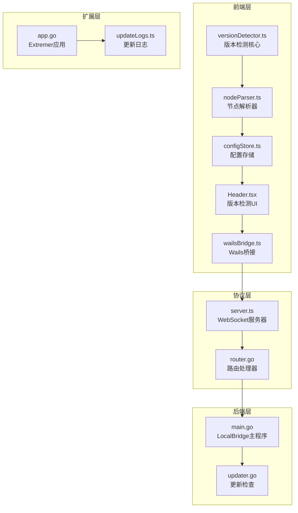
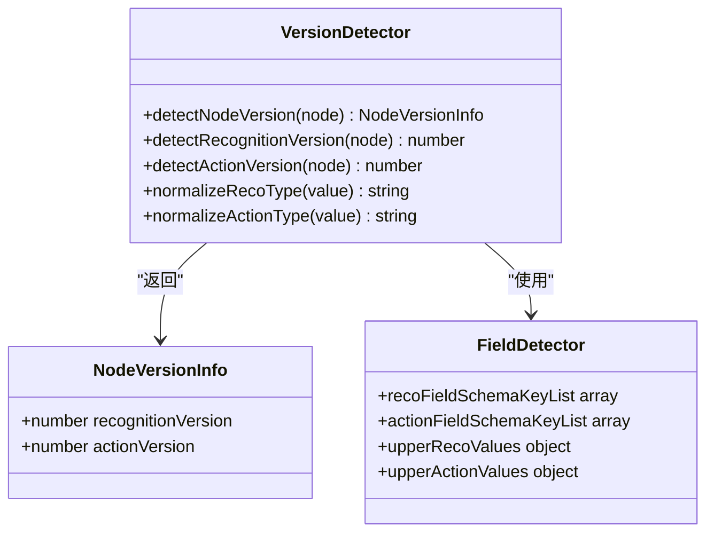
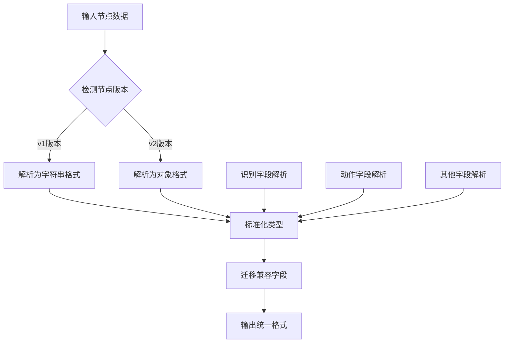
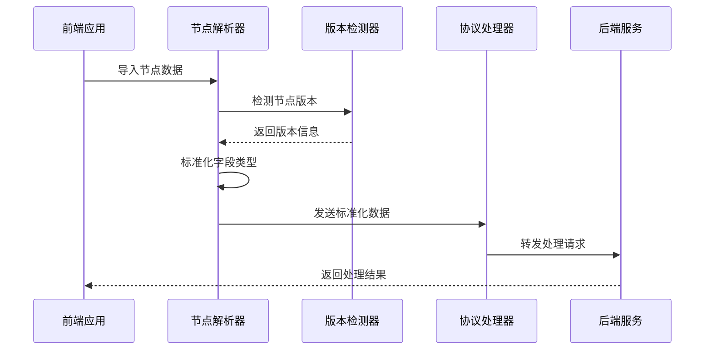
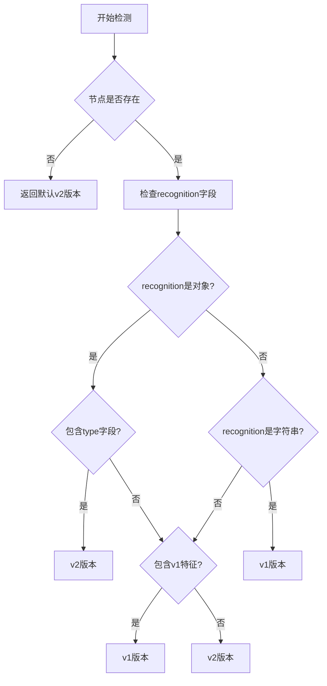
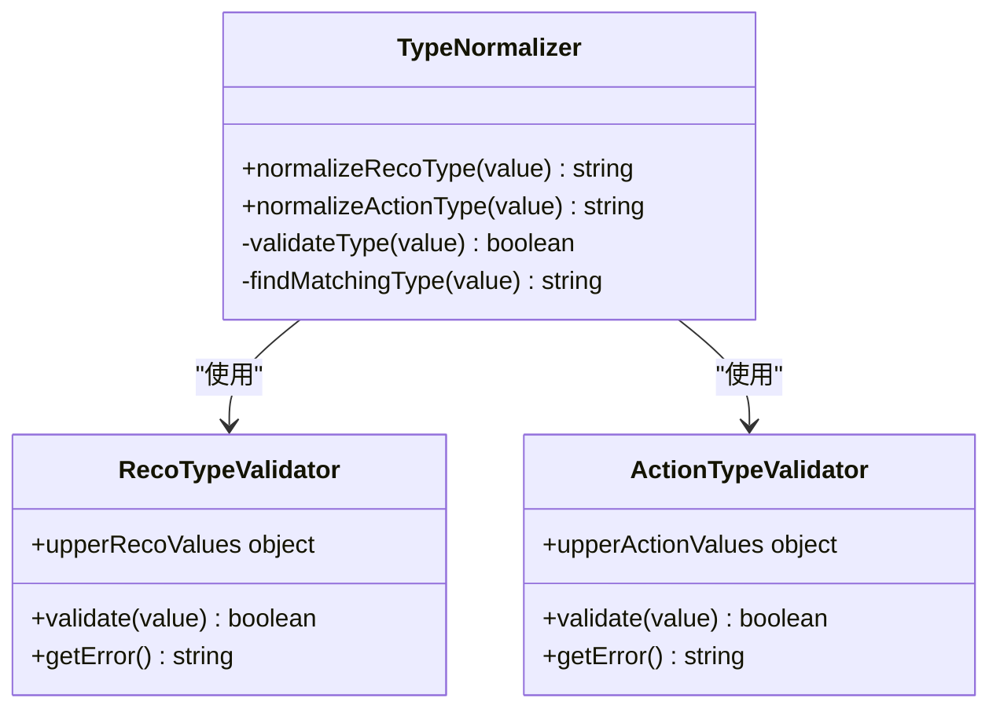
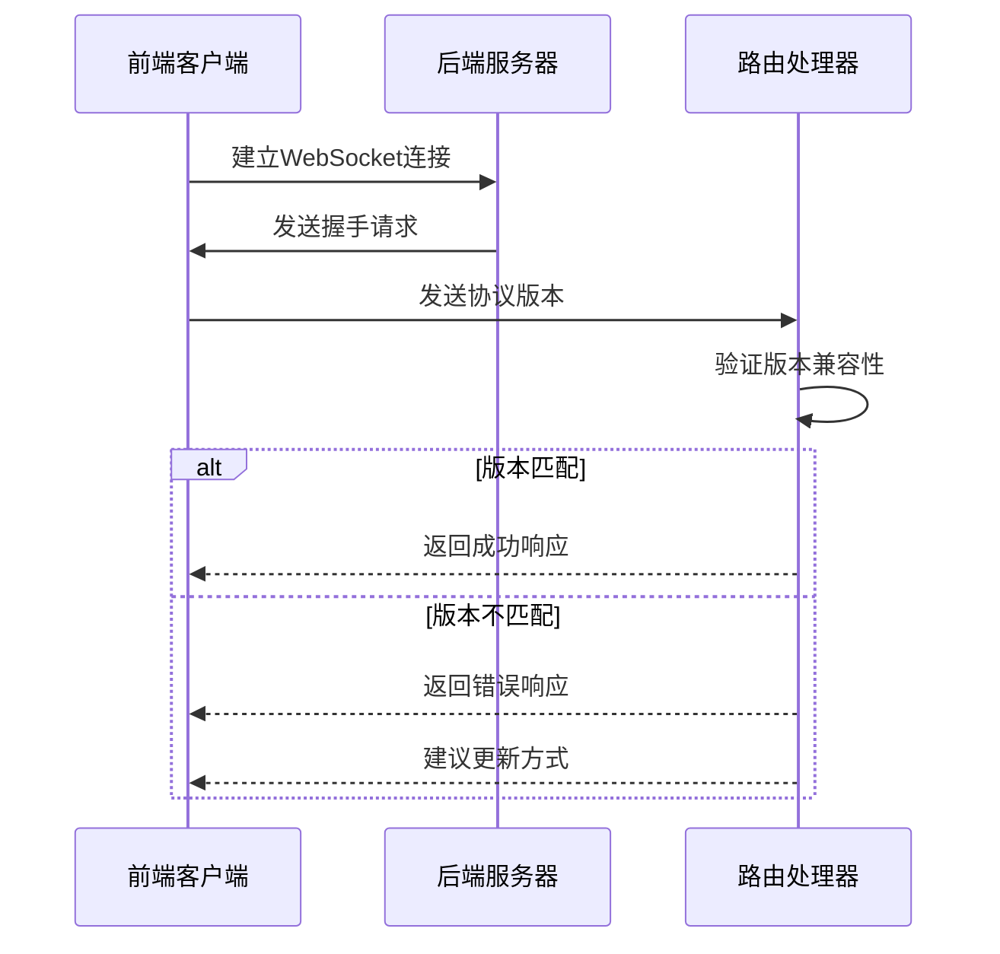
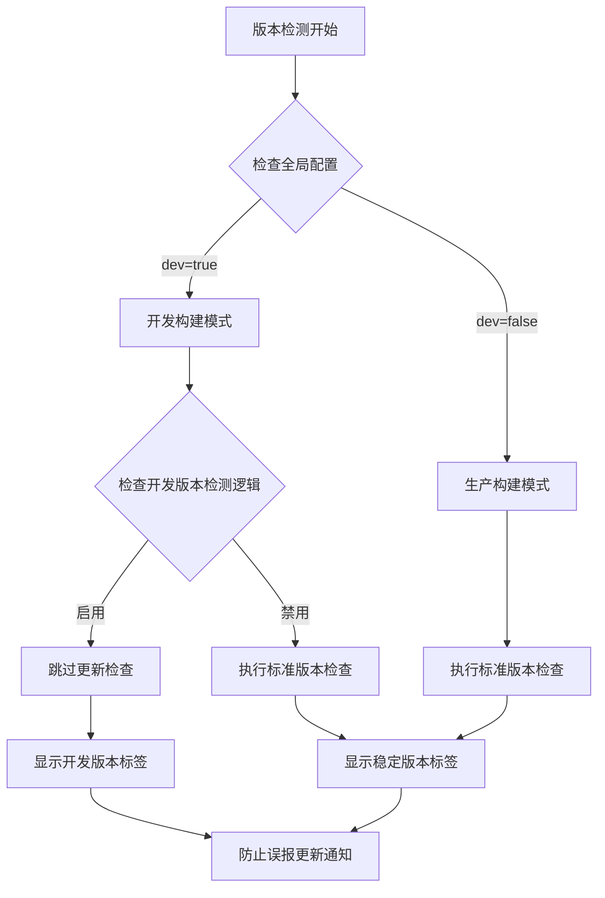
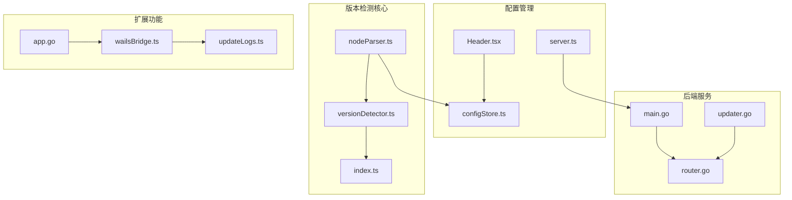

# 版本检测系统

<cite>
**本文档引用的文件**
- [versionDetector.ts](file://src/core/parser/versionDetector.ts)
- [nodeParser.ts](file://src/core/parser/nodeParser.ts)
- [index.ts](file://src/core/fields/index.ts)
- [configStore.ts](file://src/stores/configStore.ts)
- [server.ts](file://src/services/server.ts)
- [Header.tsx](file://src/components/Header.tsx)
- [wailsBridge.ts](file://src/utils/wailsBridge.ts)
- [router.go](file://LocalBridge/internal/router/router.go)
- [main.go](file://LocalBridge/cmd/lb/main.go)
- [updater.go](file://Extremer/internal/updater/updater.go)
- [app.go](file://Extremer/app.go)
- [updateLogs.ts](file://src/data/updateLogs.ts)
</cite>

## 更新摘要
**变更内容**
- 更新了版本检测系统的架构描述，特别关注开发构建版本检测的修复
- 新增了开发构建版本检测问题的专门章节
- 更新了版本检测流程图，反映最新的修复逻辑
- 增强了开发环境与生产环境的版本检测差异说明
- 修复了开发模式下版本检查机制的误报问题

## 目录
1. [简介](#简介)
2. [项目结构](#项目结构)
3. [核心组件](#核心组件)
4. [架构概览](#架构概览)
5. [详细组件分析](#详细组件分析)
6. [开发构建版本检测修复](#开发构建版本检测修复)
7. [依赖关系分析](#依赖关系分析)
8. [性能考虑](#性能考虑)
9. [故障排除指南](#故障排除指南)
10. [结论](#结论)

## 简介

版本检测系统是 MaaPipelineEditor 项目中的一个关键组件，负责检测和管理不同版本的 Pipeline 节点数据格式。该系统主要处理两种版本：Pipeline 节点的识别算法版本（recognition）和动作版本（action），以及前端和后端之间的协议版本兼容性。

**最新修复**：系统现已修复开发构建版本检测问题，防止开发版本被错误标记为过时，确保开发者能够正常工作而不受误导性更新通知影响。修复的核心在于 `src/components/Header.tsx` 中的版本检查机制，通过 `globalConfig.dev` 标志来区分开发模式和生产模式，避免在开发环境下显示过时版本警告。

系统的核心功能包括：
- 自动检测 Pipeline 节点的版本信息
- 标准化识别算法和动作类型
- 管理前端与后端的协议版本兼容性
- 支持版本迁移和向后兼容
- 区分开发构建与生产构建的版本检测逻辑

## 项目结构

版本检测系统分布在项目的多个层次中：



**图表来源**
- [versionDetector.ts:1-149](file://src/core/parser/versionDetector.ts#L1-L149)
- [server.ts:1-373](file://src/services/server.ts#L1-L373)
- [router.go:1-150](file://LocalBridge/internal/router/router.go#L1-L150)
- [Header.tsx:292-312](file://src/components/Header.tsx#L292-L312)

**章节来源**
- [versionDetector.ts:1-149](file://src/core/parser/versionDetector.ts#L1-L149)
- [nodeParser.ts:1-468](file://src/core/parser/nodeParser.ts#L1-L468)
- [configStore.ts:1-276](file://src/stores/configStore.ts#L1-L276)

## 核心组件

### 版本检测器 (Version Detector)

版本检测器是系统的核心组件，负责检测和标准化 Pipeline 节点的版本信息。



**图表来源**
- [versionDetector.ts:11-149](file://src/core/parser/versionDetector.ts#L11-L149)
- [index.ts:41-45](file://src/core/fields/index.ts#L41-L45)

### 节点解析器 (Node Parser)

节点解析器负责将不同版本的节点数据转换为统一的内部格式。



**图表来源**
- [nodeParser.ts:276-320](file://src/core/parser/nodeParser.ts#L276-L320)
- [nodeParser.ts:331-380](file://src/core/parser/nodeParser.ts#L331-L380)

**章节来源**
- [versionDetector.ts:23-110](file://src/core/parser/versionDetector.ts#L23-L110)
- [nodeParser.ts:276-380](file://src/core/parser/nodeParser.ts#L276-L380)

## 架构概览

版本检测系统采用分层架构设计，确保版本兼容性和数据完整性：



**图表来源**
- [nodeParser.ts:421-423](file://src/core/parser/nodeParser.ts#L421-L423)
- [server.ts:268-283](file://src/services/server.ts#L268-L283)
- [router.go:107-133](file://LocalBridge/internal/router/router.go#L107-L133)

系统的关键特性包括：

1. **自动版本检测**：根据节点结构自动判断 v1 或 v2 版本
2. **类型标准化**：统一识别算法和动作类型的大小写
3. **协议兼容性**：管理前端和后端的协议版本匹配
4. **向后兼容**：支持旧版本数据格式的迁移
5. **开发构建隔离**：区分开发构建与生产构建的版本检测逻辑

## 详细组件分析

### 版本检测算法

版本检测算法基于节点的结构特征进行判断：



**图表来源**
- [versionDetector.ts:39-71](file://src/core/parser/versionDetector.ts#L39-L71)
- [versionDetector.ts:78-110](file://src/core/parser/versionDetector.ts#L78-L110)

### 类型标准化机制

系统实现了完整的类型标准化机制，确保识别算法和动作类型的统一：



**图表来源**
- [versionDetector.ts:118-148](file://src/core/parser/versionDetector.ts#L118-L148)
- [index.ts:43-44](file://src/core/fields/index.ts#L43-L44)

### 协议版本管理

前端和后端通过握手机制确保协议版本兼容性：



**图表来源**
- [server.ts:162-164](file://src/services/server.ts#L162-L164)
- [router.go:107-133](file://LocalBridge/internal/router/router.go#L107-L133)

**章节来源**
- [versionDetector.ts:118-148](file://src/core/parser/versionDetector.ts#L118-L148)
- [server.ts:18-65](file://src/services/server.ts#L18-L65)
- [router.go:107-133](file://LocalBridge/internal/router/router.go#L107-L133)

## 开发构建版本检测修复

**重要更新**：系统已修复开发构建版本检测问题，防止开发版本被错误标记为过时。

### 问题背景

在开发环境中，版本检测系统存在以下问题：
- 开发构建版本被错误地标记为过时
- 开发者收到误导性的更新通知
- 影响开发体验和工作效率

### 修复机制

系统通过以下机制区分开发构建与生产构建：



**图表来源**
- [Header.tsx:304-312](file://src/components/Header.tsx#L304-L312)
- [configStore.ts:7-16](file://src/stores/configStore.ts#L7-L16)

### 开发构建检测逻辑

开发构建版本检测通过以下步骤实现：

1. **开发模式检测**：检查 `globalConfig.dev` 标志
2. **版本标识**：开发版本显示 "Preview Version" 标签
3. **更新检查绕过**：开发模式下跳过在线更新检查
4. **版本标签显示**：显示绿色 "Stable Version" 或粉色 "Preview Version" 标签

### 版本标签系统

系统提供清晰的版本标识：

```mermaid
graph LR
subgraph "版本标签"
A[开发版本] --> B[粉色标签<br/>Preview Version]
C[生产版本] --> D[绿色标签<br/>Stable Version]
E[MFW版本] --> F[紫色标签<br/>MFW v{version}]
end
```

**图表来源**
- [Header.tsx:344-352](file://src/components/Header.tsx#L344-L352)

**章节来源**
- [Header.tsx:292-312](file://src/components/Header.tsx#L292-L312)
- [configStore.ts:7-16](file://src/stores/configStore.ts#L7-L16)

## 依赖关系分析

版本检测系统与其他组件的依赖关系如下：



**图表来源**
- [versionDetector.ts:1-6](file://src/core/parser/versionDetector.ts#L1-L6)
- [nodeParser.ts:1-24](file://src/core/parser/nodeParser.ts#L1-L24)
- [configStore.ts:1-11](file://src/stores/configStore.ts#L1-L11)

系统的主要依赖关系特点：

1. **低耦合设计**：版本检测器独立于其他组件
2. **向上依赖**：解析器依赖检测器，配置依赖解析器
3. **双向通信**：前端和后端通过协议处理器通信
4. **扩展性**：支持新的版本和类型扩展
5. **开发构建隔离**：开发构建与生产构建逻辑分离

**章节来源**
- [nodeParser.ts:1-24](file://src/core/parser/nodeParser.ts#L1-L24)
- [configStore.ts:1-11](file://src/stores/configStore.ts#L1-L11)
- [router.go:13-17](file://LocalBridge/internal/router/router.go#L13-L17)

## 性能考虑

版本检测系统在设计时充分考虑了性能优化：

### 时间复杂度优化
- 版本检测：O(n) 时间复杂度，其中 n 是节点字段数量
- 类型标准化：O(1) 平均时间复杂度
- 协议版本检查：O(1) 时间复杂度
- 开发构建检测：O(1) 时间复杂度

### 内存使用优化
- 使用对象池避免频繁内存分配
- 缓存标准化结果减少重复计算
- 按需加载字段定义
- 开发构建版本检测无额外内存开销

### 并发处理
- 支持多线程并发处理不同节点
- 使用读写锁保护共享资源
- 异步处理协议版本检查
- 开发构建版本检测异步执行

## 故障排除指南

### 常见问题及解决方案

#### 版本检测失败
**症状**：节点版本检测返回默认值
**原因**：节点数据格式不正确
**解决**：
1. 检查节点数据结构完整性
2. 验证字段名称和类型
3. 确认数据格式符合预期

#### 类型标准化错误
**症状**：抛出"类型错误"异常
**原因**：识别算法或动作类型不在预定义列表中
**解决**：
1. 检查类型名称的大小写
2. 验证类型是否在支持列表中
3. 使用标准化函数进行转换

#### 协议版本不匹配
**症状**：连接被拒绝或出现版本错误
**原因**：前端和后端协议版本不兼容
**解决**：
1. 检查前端协议版本配置
2. 更新后端服务到兼容版本
3. 遵循版本升级指导

#### 开发构建版本误报
**症状**：开发版本显示过时警告
**原因**：开发构建版本检测逻辑错误
**解决**：
1. 检查 `globalConfig.dev` 配置
2. 确认开发构建版本检测逻辑
3. 验证版本标签显示逻辑

**章节来源**
- [versionDetector.ts:118-148](file://src/core/parser/versionDetector.ts#L118-L148)
- [server.ts:50-63](file://src/services/server.ts#L50-L63)
- [router.go:120-128](file://LocalBridge/internal/router/router.go#L120-L128)
- [Header.tsx:304-312](file://src/components/Header.tsx#L304-L312)

## 结论

版本检测系统通过精心设计的架构和算法，成功解决了 Pipeline 节点版本兼容性的复杂问题。系统的主要优势包括：

1. **自动化程度高**：能够自动检测和处理不同版本的数据
2. **向后兼容性强**：支持从旧版本到新版本的平滑迁移
3. **扩展性良好**：易于添加新的版本和类型支持
4. **性能优化到位**：在保证功能的同时注重性能表现
5. **开发体验优化**：通过修复开发构建版本检测问题，显著改善了开发者的使用体验

**最新改进**：系统现已修复开发构建版本检测问题，防止开发版本被错误标记为过时，确保开发者能够正常工作而不受误导性更新通知影响。这一修复体现了系统对开发者体验的重视，通过区分开发构建与生产构建的版本检测逻辑，为不同使用场景提供了更加精准的服务。

该系统为 MaaPipelineEditor 提供了稳定可靠的数据处理基础，确保用户能够在不同版本间无缝切换，同时保持数据的完整性和一致性。随着项目的不断发展，版本检测系统将继续演进，为用户提供更好的版本管理体验。