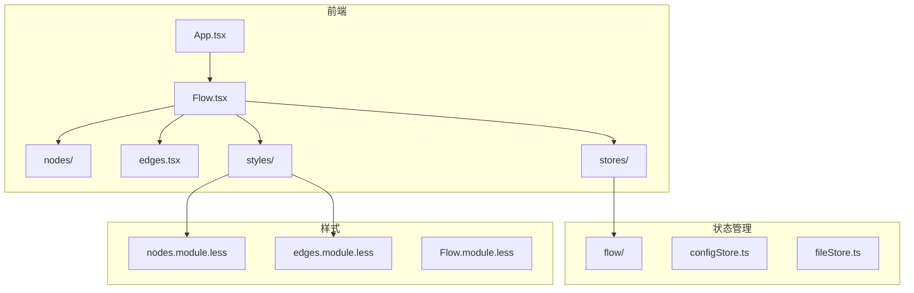
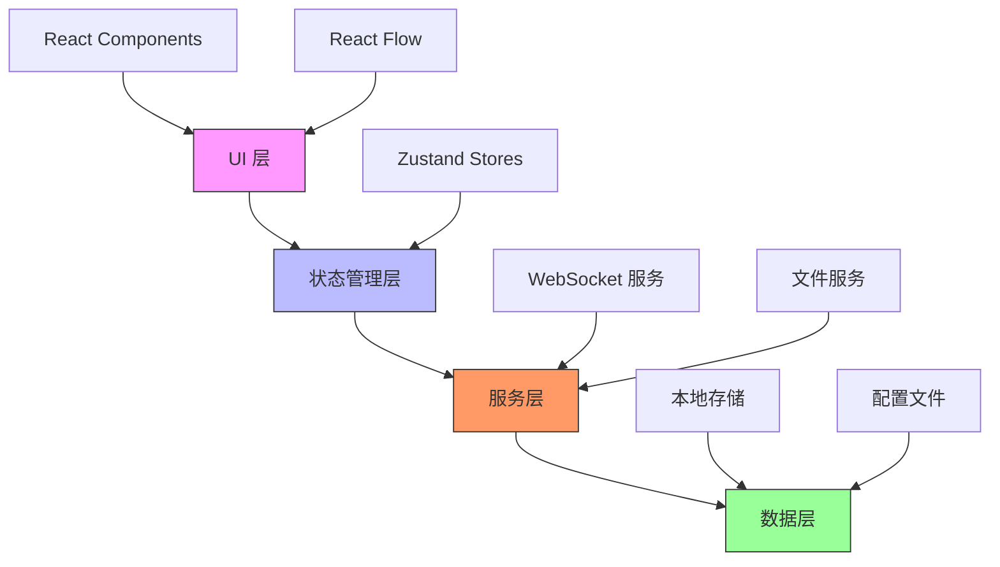
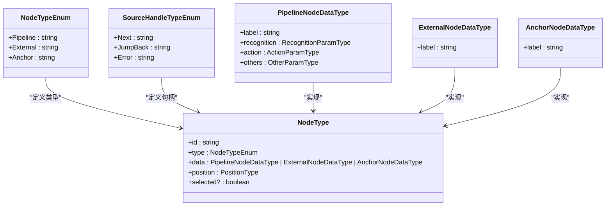
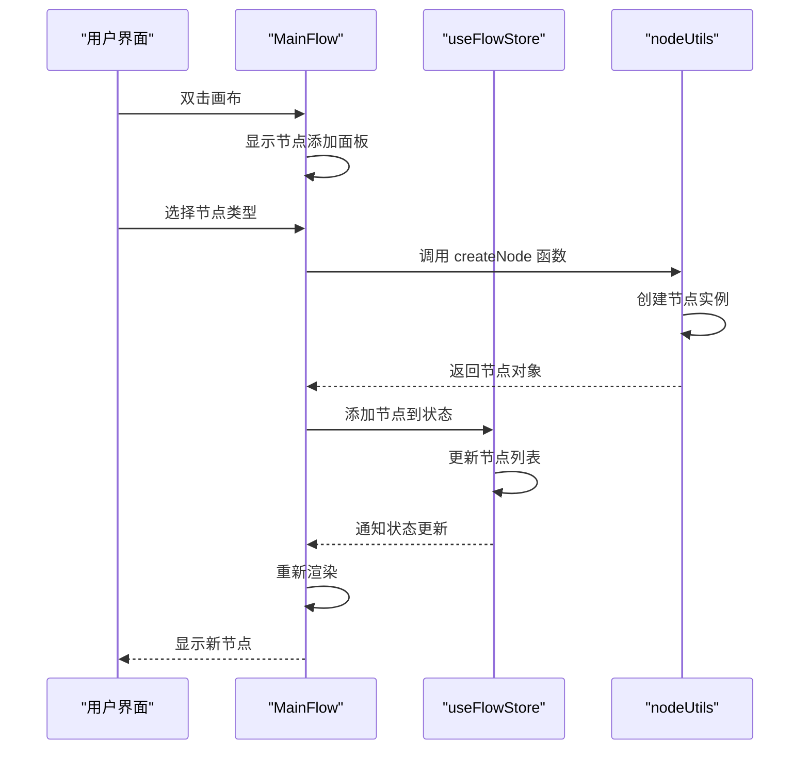
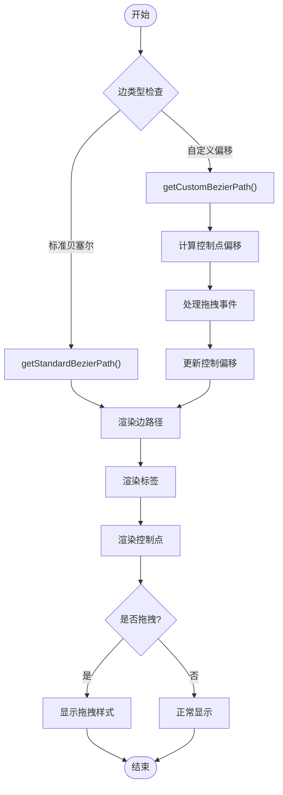
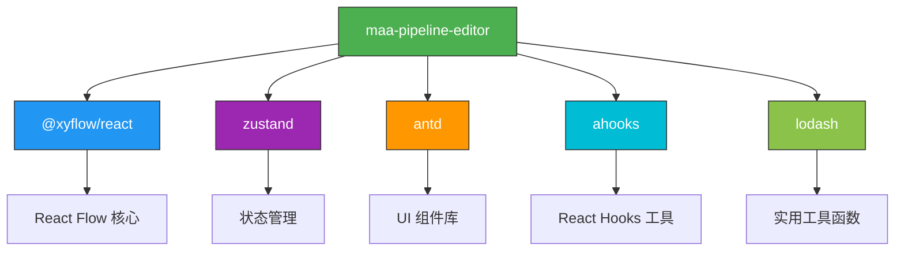

# React Flow UI 组件

<cite>
**本文档引用的文件**   
- [App.tsx](file://src/App.tsx)
- [main.tsx](file://src/main.tsx)
- [Flow.tsx](file://src/components/Flow.tsx)
- [nodes/index.ts](file://src/components/flow/nodes/index.ts)
- [edges.tsx](file://src/components/flow/edges.tsx)
- [types.ts](file://src/stores/flow/types.ts)
- [index.ts](file://src/stores/flow/index.ts)
- [nodes.module.less](file://src/styles/nodes.module.less)
- [edges.module.less](file://src/styles/edges.module.less)
- [nodeUtils.ts](file://src/stores/flow/utils/nodeUtils.ts)
- [edgeUtils.ts](file://src/stores/flow/utils/edgeUtils.ts)
- [package.json](file://package.json)
- [vite.config.ts](file://vite.config.ts)
</cite>

## 目录
1. [简介](#简介)
2. [项目结构](#项目结构)
3. [核心组件](#核心组件)
4. [架构概述](#架构概述)
5. [详细组件分析](#详细组件分析)
6. [依赖分析](#依赖分析)
7. [性能考虑](#性能考虑)
8. [故障排除指南](#故障排除指南)
9. [结论](#结论)

## 简介
MaaPipelineEditor 是一个基于 React Flow 构建的可视化工作流编辑器，用于创建和管理自动化任务流水线。该系统提供了一个直观的图形界面，允许用户通过拖拽节点和连接边来构建复杂的自动化流程。编辑器支持多种节点类型，包括管道节点、外部节点和锚点节点，并提供了丰富的配置选项和调试功能。

## 项目结构
该项目采用典型的 React 应用程序结构，主要分为以下几个部分：
- `src/`：源代码目录，包含所有前端组件、状态管理和样式
- `LocalBridge/`：后端服务目录，包含 Go 语言编写的本地桥接服务
- `docsite/`：文档站点目录，包含项目文档
- `instructions/`：使用说明和 API 参考文档
- `tools/`：工具脚本

前端代码组织遵循功能模块化原则，主要组件包括：
- `components/`：UI 组件
- `stores/`：Zustand 状态管理
- `styles/`：样式文件
- `hooks/`：自定义 Hook
- `services/`：服务层



**Diagram sources**
- [App.tsx](file://src/App.tsx)
- [Flow.tsx](file://src/components/Flow.tsx)
- [nodes/index.ts](file://src/components/flow/nodes/index.ts)
- [edges.tsx](file://src/components/flow/edges.tsx)
- [index.ts](file://src/stores/flow/index.ts)
- [nodes.module.less](file://src/styles/nodes.module.less)
- [edges.module.less](file://src/styles/edges.module.less)

**Section sources**
- [App.tsx](file://src/App.tsx)
- [main.tsx](file://src/main.tsx)
- [vite.config.ts](file://vite.config.ts)

## 核心组件

MaaPipelineEditor 的核心是基于 React Flow 构建的可视化工作流编辑器。系统通过组合 React Flow 的基础组件和自定义组件，创建了一个功能丰富的流水线编辑环境。主要核心组件包括：

1. **ReactFlow 组件**：作为基础画布，提供节点和边的渲染、交互和布局功能
2. **节点系统**：支持多种类型的节点，每种节点代表不同的自动化任务
3. **边系统**：定义节点之间的连接关系和数据流
4. **状态管理系统**：使用 Zustand 管理应用状态
5. **样式系统**：基于 Less 的样式管理，支持主题切换

这些组件协同工作，为用户提供了一个直观、高效的流水线编辑体验。

**Section sources**
- [App.tsx](file://src/App.tsx)
- [Flow.tsx](file://src/components/Flow.tsx)
- [package.json](file://package.json)

## 架构概述

MaaPipelineEditor 采用分层架构设计，将应用程序分为多个职责明确的层次。这种架构有助于代码的维护和扩展，同时也提高了系统的可测试性。



**Diagram sources**
- [App.tsx](file://src/App.tsx)
- [Flow.tsx](file://src/components/Flow.tsx)
- [index.ts](file://src/stores/flow/index.ts)
- [server.ts](file://src/services/server.ts)

**Section sources**
- [App.tsx](file://src/App.tsx)
- [main.tsx](file://src/main.tsx)
- [Flow.tsx](file://src/components/Flow.tsx)
- [index.ts](file://src/stores/flow/index.ts)

## 详细组件分析

### 节点组件分析
节点是 MaaPipelineEditor 中的基本构建单元，代表自动化流程中的单个任务或操作。系统支持三种主要节点类型：管道节点、外部节点和锚点节点。



**Diagram sources**
- [constants.ts](file://src/components/flow/nodes/constants.ts)
- [types.ts](file://src/stores/flow/types.ts)
- [PipelineNode/index.tsx](file://src/components/flow/nodes/PipelineNode/index.tsx)

#### 节点创建与管理
系统提供了一套完整的节点创建和管理工具函数，支持不同类型节点的实例化和操作。



**Diagram sources**
- [Flow.tsx](file://src/components/Flow.tsx)
- [index.ts](file://src/stores/flow/index.ts)
- [nodeUtils.ts](file://src/stores/flow/utils/nodeUtils.ts)

### 边组件分析
边组件负责定义节点之间的连接关系，是工作流逻辑的重要组成部分。MaaPipelineEditor 实现了自定义的边类型，支持路径控制点和多种连接类型。

```mermaid
classDiagram
class EdgeAttributesType {
+jump_back? : boolean
+anchor? : boolean
}
class EdgeType {
+id : string
+source : string
+sourceHandle : SourceHandleTypeEnum
+target : string
+targetHandle : "target"
+label : number
+type : "marked"
+selected? : boolean
+attributes? : EdgeAttributesType
}
class MarkedEdge {
+getStandardBezierPath()
+getCustomBezierPath()
+handleMouseDown()
+handleDoubleClick()
}
EdgeAttributesType --> EdgeType : "包含"
EdgeType --> MarkedEdge : "实现"
note right of MarkedEdge
自定义边组件，支持拖拽
控制点和双击重置功能
end note
```

**Diagram sources**
- [types.ts](file://src/stores/flow/types.ts)
- [edges.tsx](file://src/components/flow/edges.tsx)

#### 边的交互流程
边组件实现了复杂的交互逻辑，包括控制点拖拽、路径调整和双击重置等功能。



**Diagram sources**
- [edges.tsx](file://src/components/flow/edges.tsx)

### 状态管理分析
MaaPipelineEditor 使用 Zustand 进行状态管理，将复杂的画布状态分解为多个可组合的 Slice。

```mermaid
classDiagram
class FlowStore {
+instance : ReactFlowInstance
+viewport : Viewport
+nodes : NodeType[]
+edges : EdgeType[]
+selectedNodes : NodeType[]
+selectedEdges : EdgeType[]
+historyStack : Array
+pathMode : boolean
}
class FlowViewState {
+updateInstance()
+updateViewport()
+updateSize()
}
class FlowSelectionState {
+updateSelection()
+setTargetNode()
+clearSelection()
}
class FlowHistoryState {
+saveHistory()
+undo()
+redo()
}
class FlowNodeState {
+updateNodes()
+addNode()
+setNodeData()
}
class FlowEdgeState {
+updateEdges()
+addEdge()
+setEdgeData()
}
class FlowGraphState {
+replace()
+paste()
+shiftNodes()
}
class FlowPathState {
+setPathMode()
+setPathStartNode()
+calculatePath()
}
FlowViewState --> FlowStore : "组合"
FlowSelectionState --> FlowStore : "组合"
FlowHistoryState --> FlowStore : "组合"
FlowNodeState --> FlowStore : "组合"
FlowEdgeState --> FlowStore : "组合"
FlowGraphState --> FlowStore : "组合"
FlowPathState --> FlowStore : "组合"
note right of FlowStore
使用 create() 函数组合
所有 Slice 创建全局状态
end note
```

**Diagram sources**
- [index.ts](file://src/stores/flow/index.ts)
- [types.ts](file://src/stores/flow/types.ts)

#### 状态更新流程
状态管理系统的更新流程设计精巧，确保了性能和响应性。

```mermaid
sequenceDiagram
participant UI as "用户界面"
participant Flow as "ReactFlow"
participant Store as "useFlowStore"
participant Debounce as "useDebounceEffect"
participant Save as "localSave"
UI->>Flow : 节点移动
Flow->>Store : onNodesChange()
Store->>Store : 处理节点变更
Store->>Debounce : 触发防抖
Debounce->>Debounce : 等待500ms
alt 500ms内无新变更
Debounce->>Save : 执行保存
Save->>Save : 持久化到本地存储
Save-->>UI : 保存完成
else 500ms内有新变更
Debounce->>Debounce : 重置计时器
Deactivate : 取消上次保存
end
```

**Diagram sources**
- [Flow.tsx](file://src/components/Flow.tsx)
- [index.ts](file://src/stores/flow/index.ts)

## 依赖分析

MaaPipelineEditor 依赖于多个第三方库和内部模块，这些依赖关系构成了系统的功能基础。



**Diagram sources**
- [package.json](file://package.json)

**Section sources**
- [package.json](file://package.json)
- [vite.config.ts](file://vite.config.ts)

## 性能考虑

MaaPipelineEditor 在设计时充分考虑了性能优化，采用了多种技术来确保流畅的用户体验。

1. **组件记忆化**：使用 React.memo 对节点和边组件进行记忆化，避免不必要的重新渲染
2. **状态防抖**：对频繁的状态更新操作使用防抖技术，减少持久化操作的频率
3. **虚拟滚动**：虽然未在代码中直接体现，但 React Flow 本身支持大规模节点的高效渲染
4. **选择性渲染**：根据焦点透明度设置，对非相关元素进行透明度调整，减少视觉干扰

这些优化措施共同作用，确保了即使在处理复杂工作流时，编辑器也能保持良好的响应性能。

## 故障排除指南

当遇到 MaaPipelineEditor 使用问题时，可以参考以下常见问题的解决方案：

1. **节点无法拖拽**：检查浏览器控制台是否有 JavaScript 错误，确保所有依赖已正确加载
2. **连接线不显示**：确认边类型配置正确，检查 CSS 样式是否被正确应用
3. **状态未保存**：检查本地存储权限，确认文件存储路径可写
4. **性能下降**：对于大型工作流，尝试关闭不必要的面板和调试功能
5. **导入文件失败**：验证 JSON 文件格式正确，检查文件扩展名是否为 .json 或 .jsonc

如果问题仍然存在，建议查看项目文档或联系开发者社区寻求帮助。

**Section sources**
- [App.tsx](file://src/App.tsx)
- [Flow.tsx](file://src/components/Flow.tsx)
- [edges.tsx](file://src/components/flow/edges.tsx)

## 结论

MaaPipelineEditor 是一个功能强大且设计精良的可视化工作流编辑器。通过基于 React Flow 构建，系统提供了一个灵活且可扩展的架构，支持复杂的自动化任务编排。项目采用现代化的前端技术栈，包括 React 19、Zustand 状态管理和 TypeScript 类型系统，确保了代码的质量和可维护性。

核心优势包括：
- 直观的图形化界面，降低自动化流程创建的门槛
- 模块化的架构设计，便于功能扩展和维护
- 完善的状态管理，支持撤销/重做和持久化
- 丰富的节点类型和连接选项，满足多样化的自动化需求

未来可以考虑的改进方向包括：
- 增强协作功能，支持多用户实时编辑
- 添加更多预设节点模板，提高创建效率
- 实现更智能的布局算法，自动优化工作流排列
- 集成版本控制，支持工作流的历史管理和比较

总体而言，MaaPipelineEditor 为自动化任务的可视化编排提供了一个优秀的解决方案，具有很高的实用价值和扩展潜力。