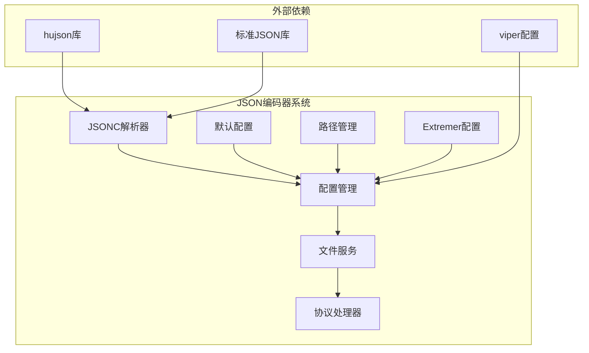
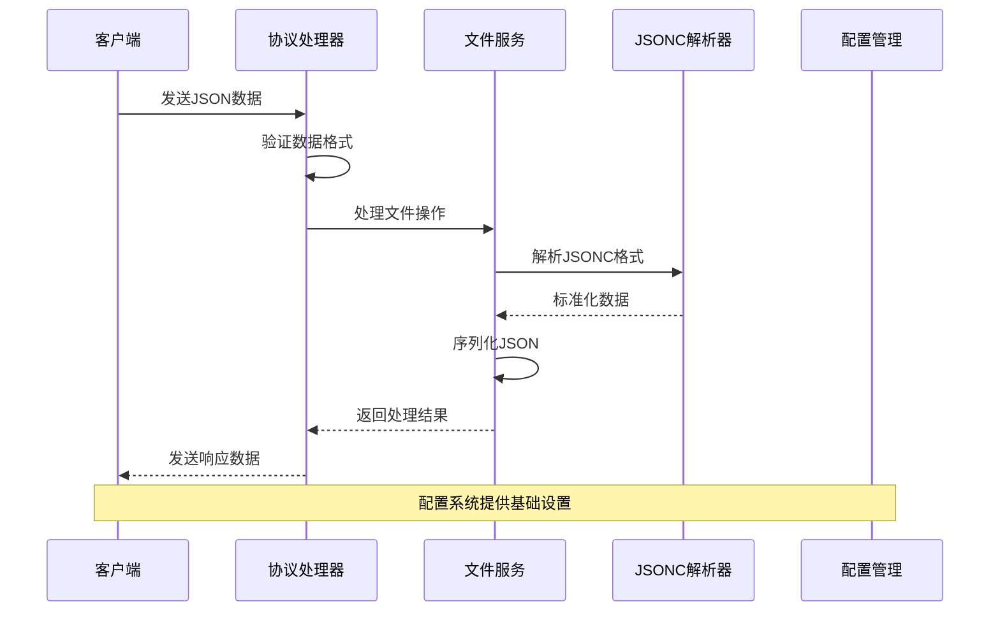
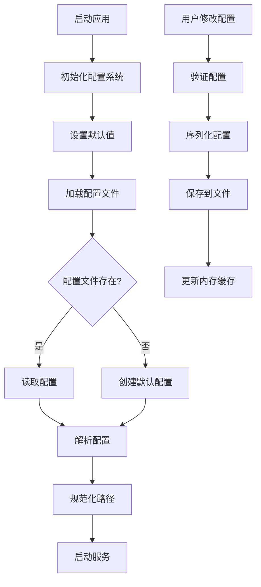
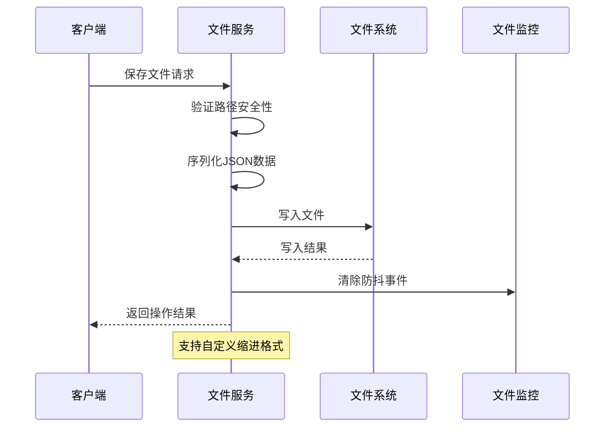
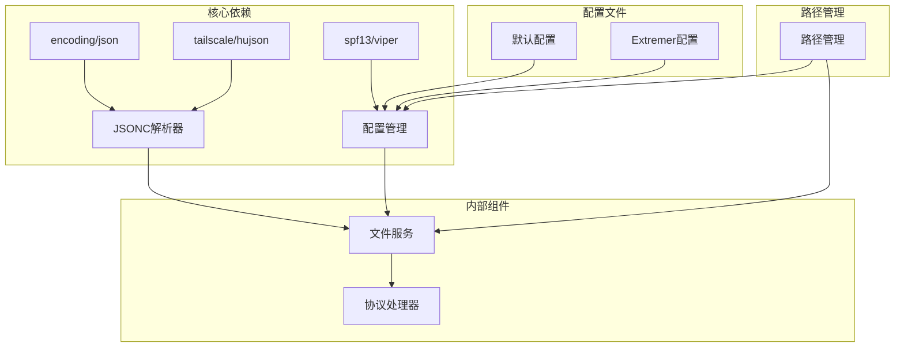

# 可配置JSON编码器

<cite>
**本文档引用的文件**
- [jsonc.go](file://LocalBridge/internal/utils/jsonc.go)
- [config.go](file://LocalBridge/internal/config/config.go)
- [default.json](file://LocalBridge/config/default.json)
- [paths.go](file://LocalBridge/internal/paths/paths.go)
- [file_service.go](file://LocalBridge/internal/service/file/file_service.go)
- [file_handler.go](file://LocalBridge/internal/protocol/file/file_handler.go)
- [default.json](file://Extremer/config/default.json)
</cite>

## 目录
1. [简介](#简介)
2. [项目结构](#项目结构)
3. [核心组件](#核心组件)
4. [架构概览](#架构概览)
5. [详细组件分析](#详细组件分析)
6. [依赖关系分析](#依赖关系分析)
7. [性能考虑](#性能考虑)
8. [故障排除指南](#故障排除指南)
9. [结论](#结论)

## 简介

本文档详细介绍MaaPipelineEditor项目中的可配置JSON编码器系统。该系统提供了灵活的JSON处理能力，支持标准JSON格式以及扩展的JSONC格式（带注释的JSON），并允许用户自定义序列化选项。

该可配置JSON编码器系统主要由以下核心组件构成：
- JSONC解析器：支持行注释、块注释和尾随逗号
- 配置管理系统：提供灵活的配置加载和保存机制
- 文件服务：负责JSON文件的读写操作
- 协议处理器：处理网络传输中的JSON数据

## 项目结构

可配置JSON编码器系统在项目中的组织结构如下：



**图表来源**
- [jsonc.go](file://LocalBridge/internal/utils/jsonc.go#L1-L30)
- [config.go](file://LocalBridge/internal/config/config.go#L1-L339)
- [paths.go](file://LocalBridge/internal/paths/paths.go#L1-L238)

**章节来源**
- [jsonc.go](file://LocalBridge/internal/utils/jsonc.go#L1-L30)
- [config.go](file://LocalBridge/internal/config/config.go#L1-L339)
- [paths.go](file://LocalBridge/internal/paths/paths.go#L1-L238)

## 核心组件

### JSONC解析器

JSONC解析器是整个可配置JSON编码器系统的核心组件，它提供了对带注释JSON格式的完整支持。

**主要功能：**
- 解析带注释的JSON (JSONC) 格式
- 支持行注释（// ...）
- 支持块注释（/* ... */）
- 支持尾随逗号
- 标准化JSON格式

**技术实现：**
- 使用hujson库进行JSONC格式的标准化
- 通过标准JSON解析器处理标准化后的数据
- 提供错误处理和验证机制

**章节来源**
- [jsonc.go](file://LocalBridge/internal/utils/jsonc.go#L9-L29)

### 配置管理系统

配置管理系统负责管理应用程序的各种配置选项，并提供灵活的配置加载和保存机制。

**配置类型：**
- 服务器配置：端口、主机地址
- 文件配置：根目录、排除列表、文件扩展名、扫描限制
- 日志配置：日志级别、输出目录、客户端推送
- MaaFramework配置：启用状态、库目录、资源目录

**配置加载机制：**
- 支持多种配置文件格式
- 提供默认值设置
- 支持命令行参数覆盖
- 自动路径规范化

**章节来源**
- [config.go](file://LocalBridge/internal/config/config.go#L13-L48)
- [config.go](file://LocalBridge/internal/config/config.go#L102-L123)

### 文件服务

文件服务组件负责处理JSON文件的读写操作，提供了灵活的序列化选项。

**主要功能：**
- JSON文件的创建和保存
- 自定义缩进格式化
- 错误处理和文件监控
- 路径安全验证

**序列化选项：**
- 可配置的缩进字符串
- 标准化的JSON格式化
- 错误恢复机制

**章节来源**
- [file_service.go](file://LocalBridge/internal/service/file/file_service.go#L170-L201)
- [file_service.go](file://LocalBridge/internal/service/file/file_service.go#L204-L251)

### 协议处理器

协议处理器负责在网络通信中处理JSON数据，确保数据的正确传输和解析。

**功能特性：**
- JSON数据的序列化和反序列化
- 错误消息的格式化
- 数据验证和转换
- 统一的错误处理机制

**章节来源**
- [file_handler.go](file://LocalBridge/internal/protocol/file/file_handler.go#L303-L315)

## 架构概览

可配置JSON编码器系统的整体架构采用分层设计，各组件之间通过清晰的接口进行交互。



**图表来源**
- [file_handler.go](file://LocalBridge/internal/protocol/file/file_handler.go#L303-L315)
- [file_service.go](file://LocalBridge/internal/service/file/file_service.go#L170-L201)
- [jsonc.go](file://LocalBridge/internal/utils/jsonc.go#L14-L23)

## 详细组件分析

### JSONC解析器详细分析

JSONC解析器实现了对现代JSON格式扩展的支持，通过hujson库提供了强大的解析能力。

```mermaid
classDiagram
class JSONCParser {
+ParseJSONC(data, v) error
+IsValidJSONC(data) bool
-standardizeJSON(data) []byte
-parseStandardJSON(data, v) error
}
class HuJSON {
+Standardize(data) []byte
+Parse(data) interface{}
}
class StandardJSON {
+Unmarshal(data, v) error
+Marshal(v) []byte
}
JSONCParser --> HuJSON : 使用
JSONCParser --> StandardJSON : 依赖
```

**图表来源**
- [jsonc.go](file://LocalBridge/internal/utils/jsonc.go#L14-L23)

**解析流程：**
1. 输入数据接收
2. 使用hujson进行标准化处理
3. 标准化后的数据通过JSON解析器处理
4. 返回解析结果或错误信息

**章节来源**
- [jsonc.go](file://LocalBridge/internal/utils/jsonc.go#L1-L30)

### 配置管理系统详细分析

配置管理系统提供了完整的配置生命周期管理，包括加载、验证、保存等功能。



**图表来源**
- [config.go](file://LocalBridge/internal/config/config.go#L54-L95)
- [paths.go](file://LocalBridge/internal/paths/paths.go#L219-L237)

**配置加载流程：**
1. 初始化Viper配置管理器
2. 设置默认配置值
3. 查找并读取配置文件
4. 解析配置到结构体
5. 规范化路径和验证配置

**章节来源**
- [config.go](file://LocalBridge/internal/config/config.go#L54-L95)
- [paths.go](file://LocalBridge/internal/paths/paths.go#L219-L237)

### 文件服务详细分析

文件服务组件提供了完整的JSON文件管理功能，支持灵活的序列化选项。



**图表来源**
- [file_service.go](file://LocalBridge/internal/service/file/file_service.go#L170-L201)

**文件操作流程：**
1. 路径安全性验证
2. JSON数据序列化（支持自定义缩进）
3. 文件写入操作
4. 防抖事件清除
5. 变更事件发布

**章节来源**
- [file_service.go](file://LocalBridge/internal/service/file/file_service.go#L170-L201)
- [file_service.go](file://LocalBridge/internal/service/file/file_service.go#L204-L251)

## 依赖关系分析

可配置JSON编码器系统的依赖关系清晰明确，各组件之间的耦合度适中。



**图表来源**
- [jsonc.go](file://LocalBridge/internal/utils/jsonc.go#L3-L7)
- [config.go](file://LocalBridge/internal/config/config.go#L3-L11)
- [paths.go](file://LocalBridge/internal/paths/paths.go#L3-L8)

**依赖特点：**
- 外部依赖最小化，仅使用必要的第三方库
- 内部组件间依赖清晰，职责分离明确
- 配置系统独立于其他组件
- 文件服务依赖配置系统进行路径管理

**章节来源**
- [jsonc.go](file://LocalBridge/internal/utils/jsonc.go#L3-L7)
- [config.go](file://LocalBridge/internal/config/config.go#L3-L11)
- [paths.go](file://LocalBridge/internal/paths/paths.go#L3-L8)

## 性能考虑

可配置JSON编码器系统在设计时充分考虑了性能优化：

**内存使用优化：**
- JSONC解析采用流式处理，减少内存占用
- 配置文件按需加载，避免不必要的内存分配
- 文件服务使用缓冲区进行批量写入

**处理效率优化：**
- 缓存常用的配置信息
- 文件监控使用防抖机制减少重复处理
- 异步文件操作避免阻塞主线程

**扩展性考虑：**
- 插件化的配置加载机制
- 可配置的序列化选项
- 支持不同格式的JSON数据处理

## 故障排除指南

### 常见问题及解决方案

**JSONC解析错误：**
- 检查JSONC语法格式
- 验证注释符号的正确使用
- 确认尾随逗号的使用位置

**配置文件加载失败：**
- 检查配置文件路径的有效性
- 验证配置文件的JSON格式
- 确认文件权限设置

**文件写入错误：**
- 检查目标目录的写入权限
- 验证磁盘空间充足
- 确认文件名不包含非法字符

**章节来源**
- [jsonc.go](file://LocalBridge/internal/utils/jsonc.go#L14-L23)
- [config.go](file://LocalBridge/internal/config/config.go#L73-L95)
- [file_service.go](file://LocalBridge/internal/service/file/file_service.go#L186-L192)

## 结论

MaaPipelineEditor项目的可配置JSON编码器系统展现了优秀的软件架构设计：

**设计优势：**
- 模块化设计，职责分离清晰
- 支持多种JSON格式，兼容性强
- 配置灵活，易于扩展
- 错误处理完善，稳定性好

**技术特色：**
- 集成JSONC格式支持，提升开发体验
- 完整的配置管理机制
- 高效的文件操作服务
- 灵活的序列化选项

该系统为MaaPipelineEditor提供了坚实的JSON处理基础，支持复杂的流水线配置管理和数据交换需求。通过合理的架构设计和完善的错误处理机制，确保了系统的稳定性和可靠性。