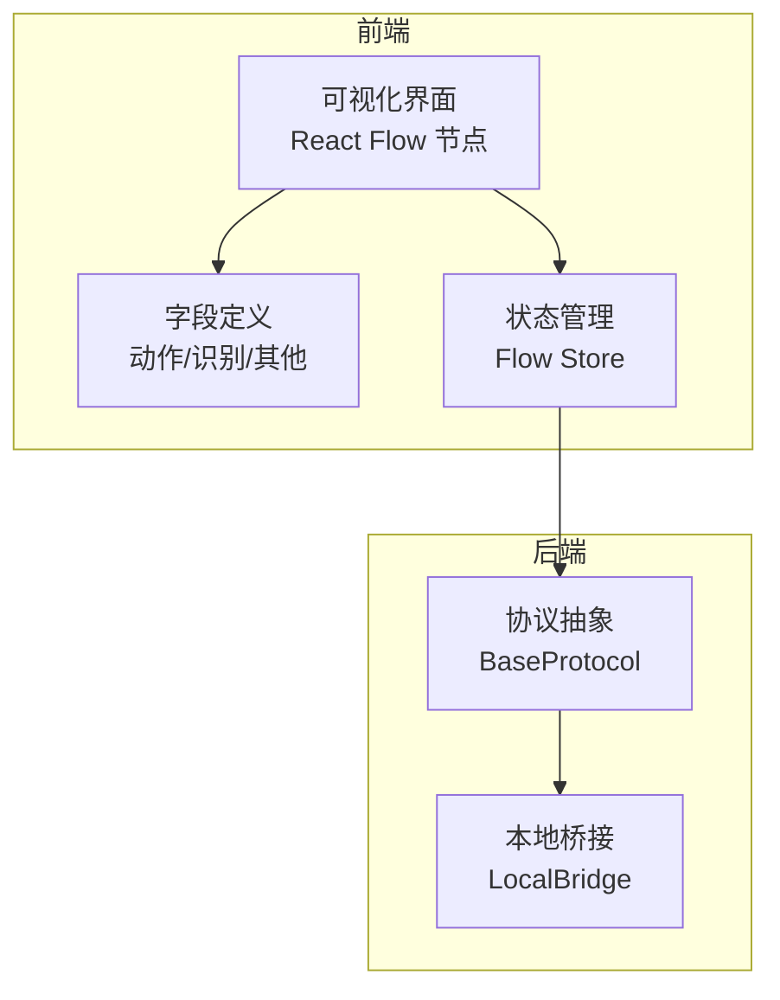
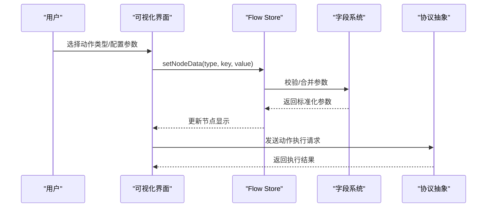
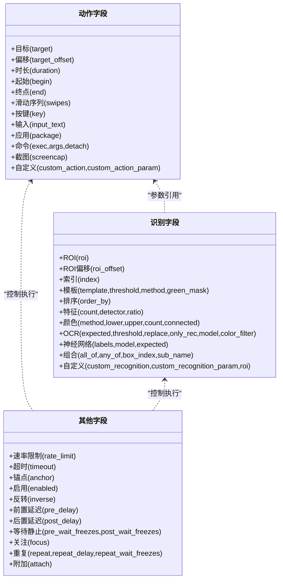
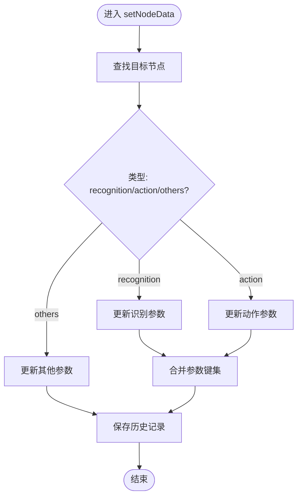
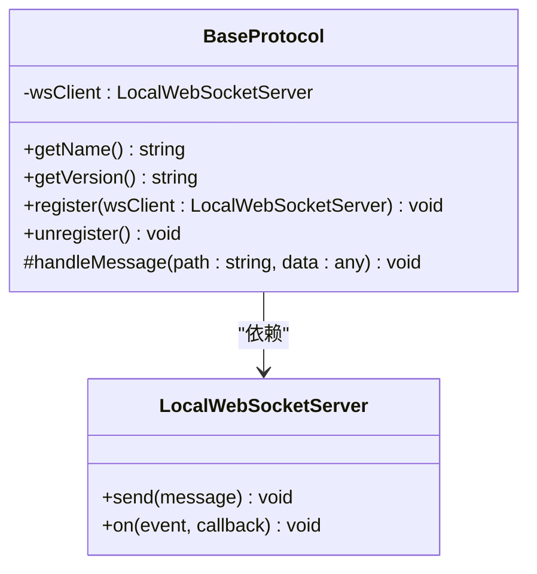
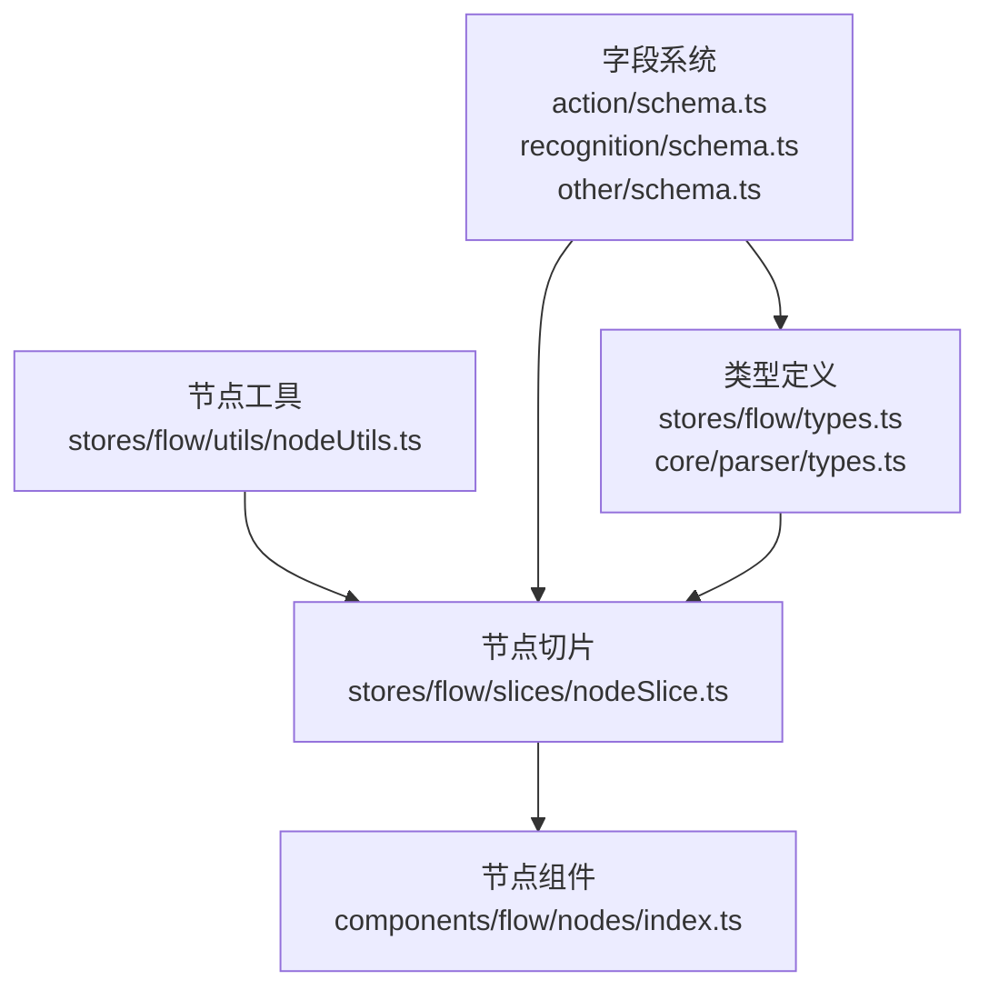

# 统一动作系统

<cite>
**本文档引用的文件**
- [README.md](file://README.md)
- [types.ts](file://src/core/parser/types.ts)
- [fieldFactory.ts](file://src/core/fields/fieldFactory.ts)
- [types.ts](file://src/stores/flow/types.ts)
- [BaseProtocol.ts](file://src/services/protocols/BaseProtocol.ts)
- [index.ts](file://src/core/fields/action/index.ts)
- [schema.ts](file://src/core/fields/action/schema.ts)
- [index.ts](file://src/core/fields/recognition/index.ts)
- [schema.ts](file://src/core/fields/recognition/schema.ts)
- [index.ts](file://src/core/fields/other/index.ts)
- [schema.ts](file://src/core/fields/other/schema.ts)
- [index.ts](file://src/components/flow/nodes/index.ts)
- [nodeSlice.ts](file://src/stores/flow/slices/nodeSlice.ts)
- [nodeUtils.ts](file://src/stores/flow/utils/nodeUtils.ts)
</cite>

## 目录
1. [简介](#简介)
2. [项目结构](#项目结构)
3. [核心组件](#核心组件)
4. [架构总览](#架构总览)
5. [详细组件分析](#详细组件分析)
6. [依赖关系分析](#依赖关系分析)
7. [性能考量](#性能考量)
8. [故障排查指南](#故障排查指南)
9. [结论](#结论)

## 简介
本项目是一个面向 MaaFramework 的可视化 Pipeline 编辑器，提供统一的动作系统与识别系统，支持节点式配置、拖拽连接、流程调试与 AI 辅助补全。统一动作系统旨在通过标准化的动作参数、识别参数与通用控制参数，实现跨节点、跨类型的可复用与可组合的自动化流程。

## 项目结构
整体采用前后端分离架构，前端基于 React + TypeScript + React Flow，后端提供本地服务与协议桥接。统一动作系统主要分布在核心字段定义、节点状态管理与协议抽象层。

**图表来源**
- [README.md](file://README.md#L30-L120)
- [BaseProtocol.ts](file://src/services/protocols/BaseProtocol.ts#L1-L40)

**章节来源**
- [README.md](file://README.md#L30-L120)

## 核心组件
- 字段系统：统一的动作参数、识别参数与通用控制参数，提供类型约束、默认值与描述。
- 节点状态：集中管理节点增删改、分组、连接与历史记录。
- 协议抽象：定义协议生命周期与消息处理入口，便于扩展本地能力。

**章节来源**
- [fieldFactory.ts](file://src/core/fields/fieldFactory.ts#L1-L16)
- [nodeSlice.ts](file://src/stores/flow/slices/nodeSlice.ts#L1-L691)
- [BaseProtocol.ts](file://src/services/protocols/BaseProtocol.ts#L1-L40)

## 架构总览
统一动作系统围绕“字段定义 → 节点状态 → 协议桥接”的链路展开，确保动作参数在不同节点间的一致性与可移植性。

**图表来源**
- [nodeSlice.ts](file://src/stores/flow/slices/nodeSlice.ts#L290-L394)
- [schema.ts](file://src/core/fields/action/schema.ts#L1-L299)
- [BaseProtocol.ts](file://src/services/protocols/BaseProtocol.ts#L1-L40)

## 详细组件分析

### 字段系统（动作/识别/其他）
字段系统通过统一的字段定义与校验机制，确保动作与识别参数在不同节点类型中保持一致的语义与约束。

**图表来源**
- [schema.ts](file://src/core/fields/action/schema.ts#L1-L299)
- [schema.ts](file://src/core/fields/recognition/schema.ts#L1-L276)
- [schema.ts](file://src/core/fields/other/schema.ts#L1-L363)

**章节来源**
- [index.ts](file://src/core/fields/action/index.ts#L1-L3)
- [schema.ts](file://src/core/fields/action/schema.ts#L1-L299)
- [index.ts](file://src/core/fields/recognition/index.ts#L1-L3)
- [schema.ts](file://src/core/fields/recognition/schema.ts#L1-L276)
- [index.ts](file://src/core/fields/other/index.ts#L1-L8)
- [schema.ts](file://src/core/fields/other/schema.ts#L1-L363)

### 节点状态管理
节点状态管理负责节点的创建、更新、分组与历史记录，确保动作系统在可视化编辑中的稳定性与可回溯性。

**图表来源**
- [nodeSlice.ts](file://src/stores/flow/slices/nodeSlice.ts#L290-L394)

**章节来源**
- [nodeSlice.ts](file://src/stores/flow/slices/nodeSlice.ts#L1-L691)
- [nodeUtils.ts](file://src/stores/flow/utils/nodeUtils.ts#L1-L335)

### 协议抽象层
协议抽象层定义了协议的生命周期与消息处理入口，便于扩展本地能力（如文件、资源、调试等）并与前端进行通信。

**图表来源**
- [BaseProtocol.ts](file://src/services/protocols/BaseProtocol.ts#L1-L40)

**章节来源**
- [BaseProtocol.ts](file://src/services/protocols/BaseProtocol.ts#L1-L40)

## 依赖关系分析
统一动作系统的关键依赖关系如下：

**图表来源**
- [schema.ts](file://src/core/fields/action/schema.ts#L1-L299)
- [schema.ts](file://src/core/fields/recognition/schema.ts#L1-L276)
- [schema.ts](file://src/core/fields/other/schema.ts#L1-L363)
- [types.ts](file://src/stores/flow/types.ts#L1-L362)
- [types.ts](file://src/core/parser/types.ts#L1-L107)
- [nodeUtils.ts](file://src/stores/flow/utils/nodeUtils.ts#L1-L335)
- [nodeSlice.ts](file://src/stores/flow/slices/nodeSlice.ts#L1-L691)
- [index.ts](file://src/components/flow/nodes/index.ts#L1-L26)

**章节来源**
- [index.ts](file://src/components/flow/nodes/index.ts#L1-L26)
- [nodeSlice.ts](file://src/stores/flow/slices/nodeSlice.ts#L1-L691)
- [nodeUtils.ts](file://src/stores/flow/utils/nodeUtils.ts#L1-L335)
- [types.ts](file://src/stores/flow/types.ts#L1-L362)
- [types.ts](file://src/core/parser/types.ts#L1-L107)

## 性能考量
- 参数合并与校验：在批量更新节点数据时，应避免频繁触发深度拷贝与重复校验，建议在 UI 层进行批处理。
- 历史记录：历史保存策略应根据操作类型（拖拽、删除、修改）设置不同的延迟，以平衡性能与用户体验。
- 分组节点：分组节点的顺序与父子关系维护需保证 O(n log n) 以内的排序与查找，避免大规模节点时的卡顿。
- 协议通信：协议消息处理应异步化，避免阻塞主线程，必要时引入节流与去抖。

## 故障排查指南
- 节点名重复：当启用导出配置且存在前缀时，节点名重复会触发错误提示。请检查节点标签与前缀配置。
- 参数缺失：当动作或识别类型变更时，系统会自动清理不存在的参数并补充必填默认值。若出现异常，请检查字段键集与默认值映射。
- 分组节点异常：分组节点必须位于子节点之前，确保顺序正确；若出现渲染异常，请检查分组顺序与父子关系。
- 协议未注册：若本地能力无法使用，请确认协议已正确注册并保持连接状态。

**章节来源**
- [nodeSlice.ts](file://src/stores/flow/slices/nodeSlice.ts#L377-L394)
- [nodeSlice.ts](file://src/stores/flow/slices/nodeSlice.ts#L518-L598)
- [BaseProtocol.ts](file://src/services/protocols/BaseProtocol.ts#L1-L40)

## 结论
统一动作系统通过标准化的字段定义、健壮的节点状态管理与可扩展的协议抽象，实现了动作与识别参数在不同节点类型间的统一与复用。配合可视化编辑与本地桥接能力，能够显著提升自动化流程的设计效率与可维护性。