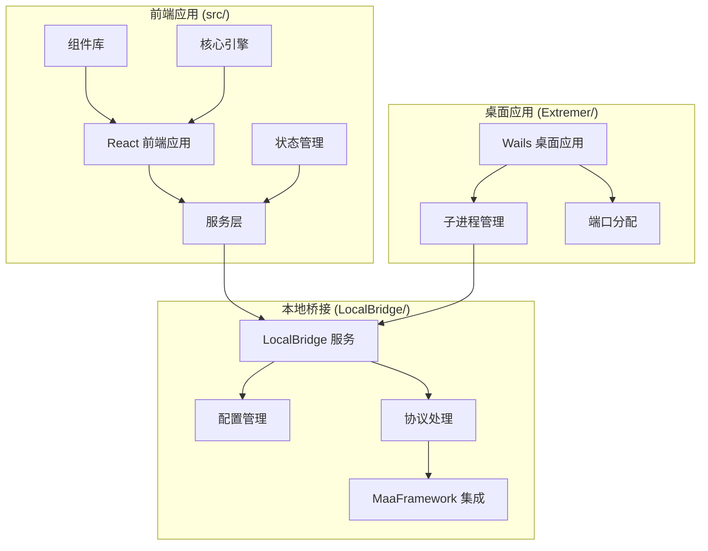
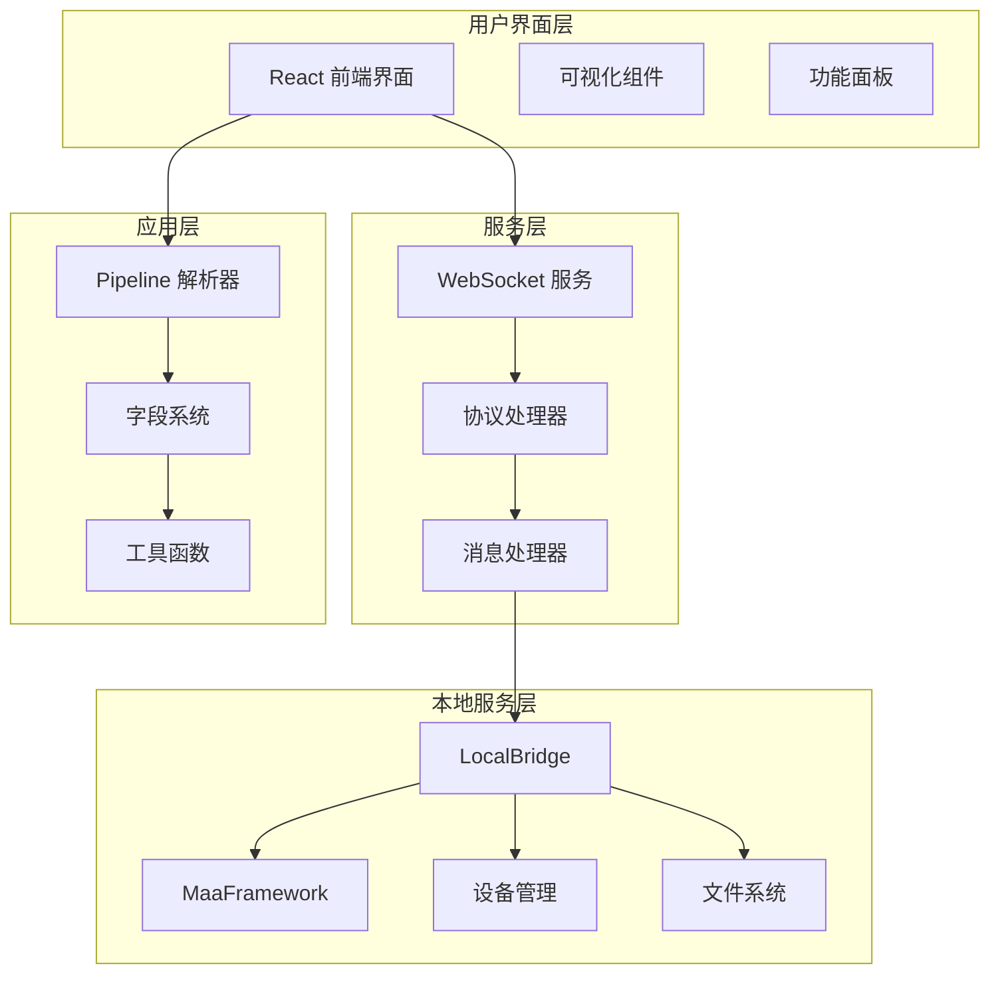
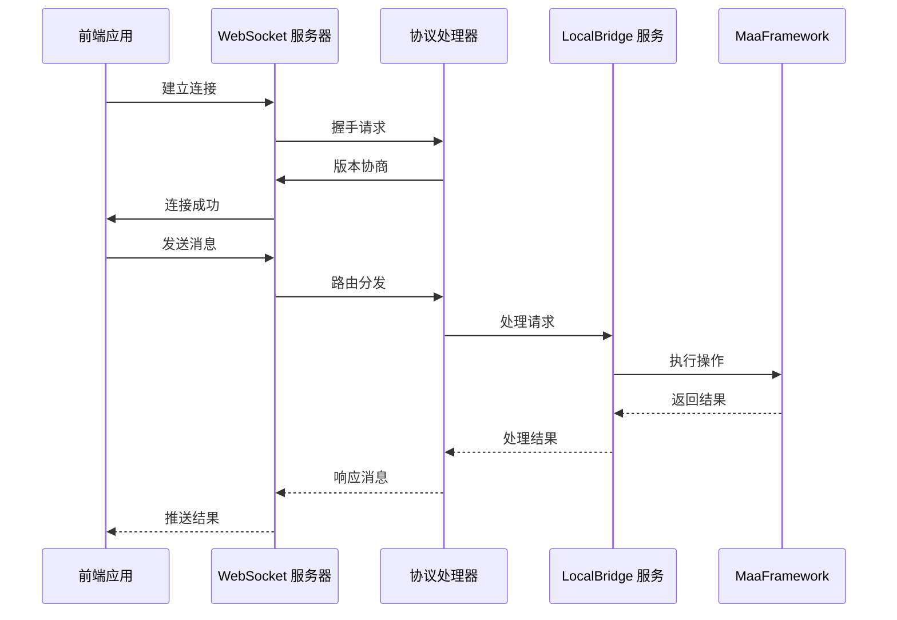
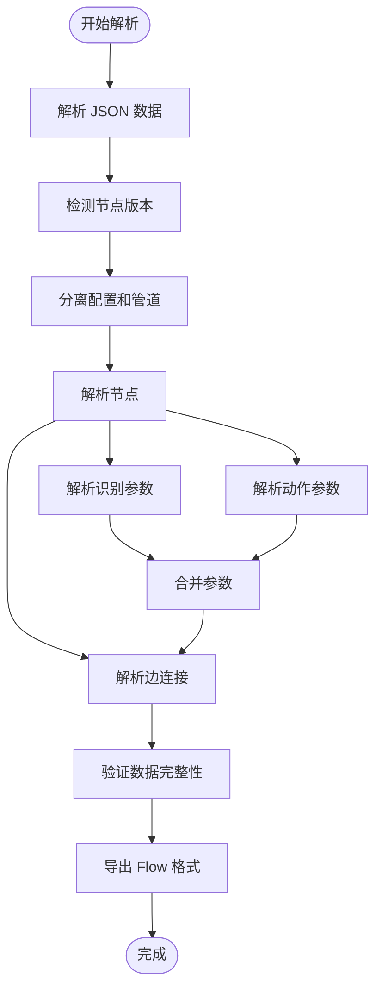
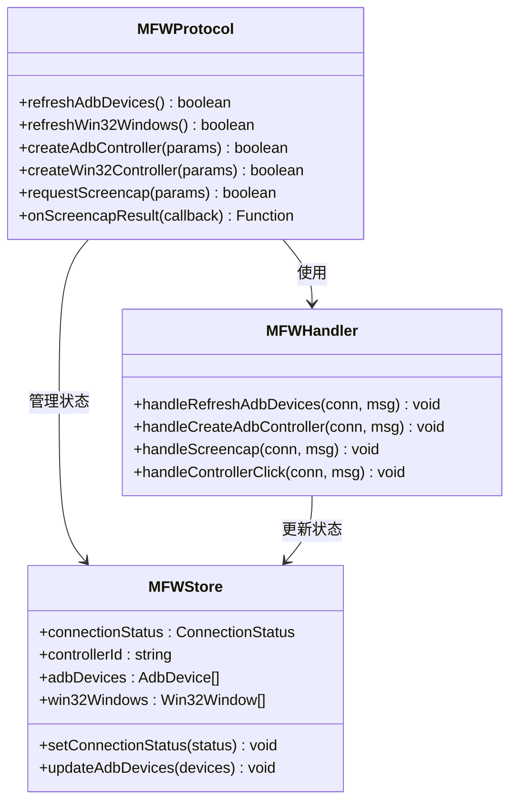
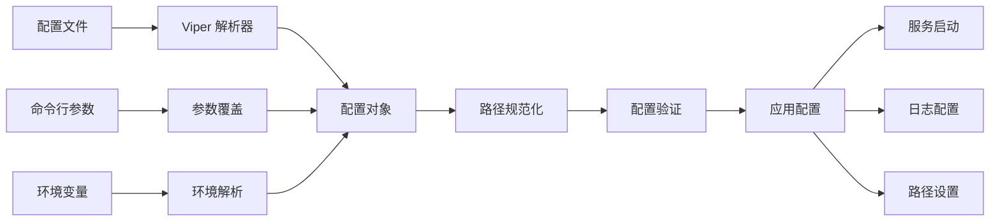

# 统一识别系统

<cite>
**本文档引用的文件**
- [README.md](file://README.md)
- [package.json](file://package.json)
- [Extremer/main.go](file://Extremer/main.go)
- [Extremer/app.go](file://Extremer/app.go)
- [LocalBridge/cmd/lb/main.go](file://LocalBridge/cmd/lb/main.go)
- [LocalBridge/internal/config/config.go](file://LocalBridge/internal/config/config.go)
- [LocalBridge/internal/protocol/mfw/handler.go](file://LocalBridge/internal/protocol/mfw/handler.go)
- [src/App.tsx](file://src/App.tsx)
- [src/services/server.ts](file://src/services/server.ts)
- [src/services/protocols/MFWProtocol.ts](file://src/services/protocols/MFWProtocol.ts)
- [src/core/parser/index.ts](file://src/core/parser/index.ts)
- [src/stores/flow/types.ts](file://src/stores/flow/types.ts)
- [src/stores/mfwStore.ts](file://src/stores/mfwStore.ts)
- [src/components/flow/nodes/index.ts](file://src/components/flow/nodes/index.ts)
- [src/core/fields/types.ts](file://src/core/fields/types.ts)
</cite>

## 目录
1. [简介](#简介)
2. [项目结构](#项目结构)
3. [核心组件](#核心组件)
4. [架构概览](#架构概览)
5. [详细组件分析](#详细组件分析)
6. [依赖关系分析](#依赖关系分析)
7. [性能考虑](#性能考虑)
8. [故障排除指南](#故障排除指南)
9. [结论](#结论)

## 简介

MaaPipelineEditor (MPE) 是一款基于 MaaFramework 的可视化 Pipeline 编辑器，采用前后端分离架构设计。该项目旨在为资源开发者提供一个强大、直观的工具，用于构建、调试和分享 MaaFramework 自动化流程。

**项目特点**：
- 基于 React 19 和 TypeScript 5.8 的现代化前端架构
- 使用 Wails 作为桌面应用框架，支持跨平台部署
- 集成 LocalBridge 本地服务，提供文件管理和设备控制功能
- 支持 AI 辅助的智能节点搜索和补全
- 提供完整的本地一体包解决方案

## 项目结构

项目采用模块化架构设计，主要分为以下几个核心模块：



**图表来源**
- [src/App.tsx](file://src/App.tsx#L1-L333)
- [LocalBridge/cmd/lb/main.go](file://LocalBridge/cmd/lb/main.go#L1-L882)
- [Extremer/app.go](file://Extremer/app.go#L1-L620)

**章节来源**
- [README.md](file://README.md#L30-L90)
- [package.json](file://package.json#L1-L64)

## 核心组件

### 前端应用架构

前端应用采用 React 19 的现代化架构，集成了多种核心组件：

**主要组件层次**：
- **应用入口**：App.tsx - 主应用组件，负责全局状态管理和组件协调
- **服务层**：WebSocket 服务器封装，协议处理器管理
- **状态管理**：Zustand 状态管理，支持设备连接状态、文件管理等
- **组件库**：基于 React Flow 的可视化编辑器，支持节点拖拽和连接
- **核心引擎**：Pipeline 解析器，支持 JSON 和 Flow 格式互转

**章节来源**
- [src/App.tsx](file://src/App.tsx#L1-L333)
- [src/services/server.ts](file://src/services/server.ts#L1-L373)
- [src/stores/mfwStore.ts](file://src/stores/mfwStore.ts#L1-L158)

### 本地桥接服务

LocalBridge 作为本地服务的核心组件，提供了完整的后端功能：

**核心功能模块**：
- **配置管理**：Viper 配置系统，支持多种配置格式
- **协议处理**：多协议路由分发，支持文件、MFW、调试等协议
- **设备管理**：ADB 设备、Win32 窗口、手柄等设备控制
- **资源管理**：文件扫描、资源加载、路径解析

**章节来源**
- [LocalBridge/cmd/lb/main.go](file://LocalBridge/cmd/lb/main.go#L1-L882)
- [LocalBridge/internal/config/config.go](file://LocalBridge/internal/config/config.go#L1-L339)

### 桌面应用包装

Extremer 作为桌面应用包装器，提供了完整的桌面应用体验：

**主要特性**：
- **子进程管理**：自动启动和管理 LocalBridge 服务
- **端口分配**：动态端口分配和管理
- **配置集成**：与 LocalBridge 配置系统无缝集成
- **启动画面**：跨平台启动画面支持

**章节来源**
- [Extremer/main.go](file://Extremer/main.go#L1-L90)
- [Extremer/app.go](file://Extremer/app.go#L1-L620)

## 架构概览

系统采用三层架构设计，实现了前后端分离和模块化管理：



**图表来源**
- [src/services/server.ts](file://src/services/server.ts#L1-L373)
- [src/core/parser/index.ts](file://src/core/parser/index.ts#L1-L85)
- [LocalBridge/internal/protocol/mfw/handler.go](file://LocalBridge/internal/protocol/mfw/handler.go#L1-L860)

## 详细组件分析

### WebSocket 通信架构

系统采用基于 WebSocket 的实时通信架构，实现了前后端的双向数据传输：



**图表来源**
- [src/services/server.ts](file://src/services/server.ts#L104-L251)
- [src/services/protocols/MFWProtocol.ts](file://src/services/protocols/MFWProtocol.ts#L38-L97)

**章节来源**
- [src/services/server.ts](file://src/services/server.ts#L20-L331)
- [src/services/protocols/MFWProtocol.ts](file://src/services/protocols/MFWProtocol.ts#L1-L774)

### Pipeline 解析系统

系统实现了完整的 Pipeline 解析和转换功能：



**图表来源**
- [src/core/parser/index.ts](file://src/core/parser/index.ts#L1-L85)

**章节来源**
- [src/core/parser/index.ts](file://src/core/parser/index.ts#L1-L85)

### 设备管理系统

系统提供了完整的设备管理功能，支持多种设备类型的连接和控制：



**图表来源**
- [src/services/protocols/MFWProtocol.ts](file://src/services/protocols/MFWProtocol.ts#L16-L774)
- [LocalBridge/internal/protocol/mfw/handler.go](file://LocalBridge/internal/protocol/mfw/handler.go#L11-L860)
- [src/stores/mfwStore.ts](file://src/stores/mfwStore.ts#L72-L158)

**章节来源**
- [src/services/protocols/MFWProtocol.ts](file://src/services/protocols/MFWProtocol.ts#L1-L774)
- [src/stores/mfwStore.ts](file://src/stores/mfwStore.ts#L1-L158)

### 配置管理系统

系统采用了灵活的配置管理机制，支持多种配置来源和动态更新：



**图表来源**
- [LocalBridge/internal/config/config.go](file://LocalBridge/internal/config/config.go#L54-L182)

**章节来源**
- [LocalBridge/internal/config/config.go](file://LocalBridge/internal/config/config.go#L1-L339)

## 依赖关系分析

系统采用了清晰的依赖关系设计，实现了良好的模块解耦：

```mermaid
graph TB
subgraph "外部依赖"
React[React 19]
TS[TypeScript 5.8]
Wails[Wails v2]
GoLang[Golang 1.24]
end
subgraph "前端依赖"
XYFlow[@xyflow/react]
Antd[Ant Design]
Zustand[zustand]
DarkReader[darkreader]
end
subgraph "后端依赖"
Cobra[cobra]
Viper[viper]
WailsGo[wails v2]
end
subgraph "核心模块"
Parser[解析器]
Server[服务器]
Bridge[桥接层]
end
React --> Parser
TS --> Parser
XYFlow --> Server
Antd --> Bridge
Cobra --> Server
Viper --> Server
WailsGo --> Bridge
```

**图表来源**
- [package.json](file://package.json#L20-L40)
- [LocalBridge/cmd/lb/main.go](file://LocalBridge/cmd/lb/main.go#L3-L35)

**章节来源**
- [package.json](file://package.json#L1-L64)

## 性能考虑

系统在设计时充分考虑了性能优化和用户体验：

### 连接管理优化
- **连接池管理**：WebSocket 连接的生命周期管理，避免内存泄漏
- **超时处理**：智能的连接超时检测和重连机制
- **状态同步**：实时的状态变更通知和错误处理

### 数据处理优化
- **异步处理**：大量 I/O 操作采用异步处理模式
- **缓存策略**：设备列表和文件资源的智能缓存
- **批量操作**：支持批量节点操作和状态更新

### 资源管理优化
- **内存管理**：及时清理不再使用的资源和监听器
- **并发控制**：合理的并发操作限制和队列管理
- **错误隔离**：单个组件的错误不影响整体系统稳定性

## 故障排除指南

### 常见问题诊断

**连接问题排查**：
1. 检查 LocalBridge 服务是否正常启动
2. 验证 WebSocket 端口是否被占用
3. 确认防火墙设置允许本地连接
4. 查看浏览器开发者工具的网络面板

**设备连接问题**：
1. 确认设备驱动程序正确安装
2. 检查 ADB 服务状态和权限设置
3. 验证设备连接参数配置正确
4. 查看设备管理器中的设备状态

**性能问题排查**：
1. 监控系统资源使用情况
2. 检查是否有过多的并发操作
3. 优化大型 Pipeline 的渲染性能
4. 考虑启用懒加载和虚拟化

**章节来源**
- [src/services/server.ts](file://src/services/server.ts#L104-L251)
- [LocalBridge/cmd/lb/main.go](file://LocalBridge/cmd/lb/main.go#L222-L262)

## 结论

MaaPipelineEditor 是一个设计精良的统一识别系统，具有以下显著优势：

**技术优势**：
- 采用现代化的前后端分离架构，具备良好的可维护性和扩展性
- 集成了完整的本地服务生态，提供丰富的本地功能
- 支持多种设备类型和平台，具备良好的兼容性
- 实现了智能化的 AI 辅助功能，提升用户体验

**架构优势**：
- 清晰的模块划分和依赖关系，便于团队协作开发
- 完善的错误处理和异常恢复机制
- 灵活的配置管理和动态更新能力
- 良好的性能优化和资源管理

**未来发展**：
随着 MaaFramework 生态系统的不断完善，MaaPipelineEditor 将继续演进，为资源开发者提供更加智能、高效的自动化流程构建工具。建议关注后续版本的功能更新和技术改进，以充分利用系统的新特性和优化。