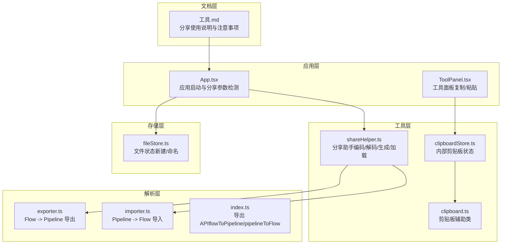
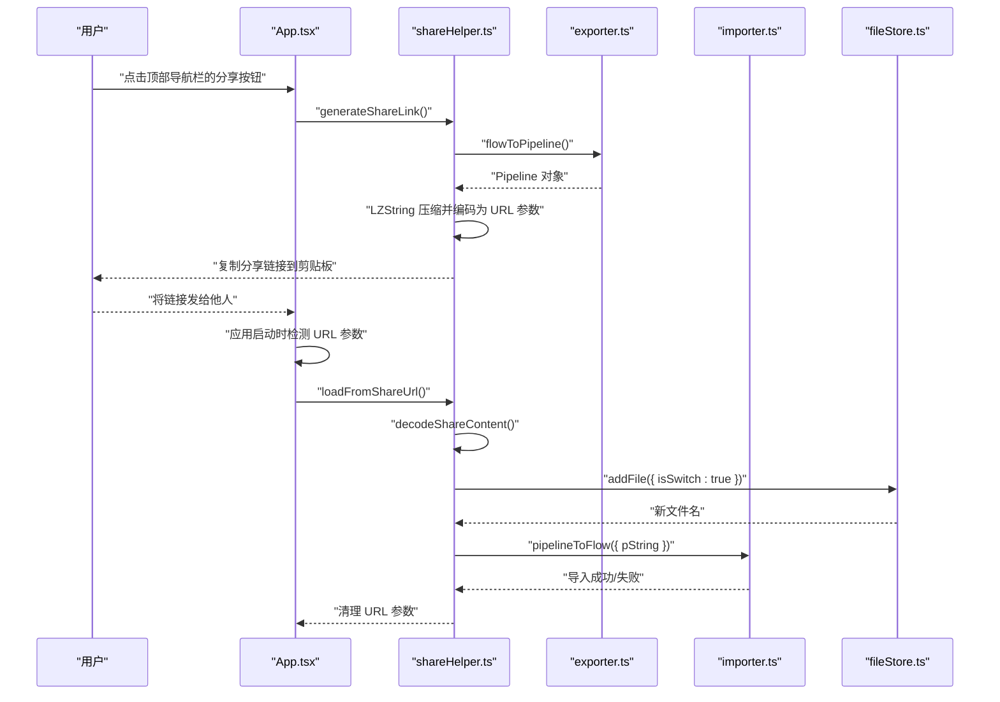
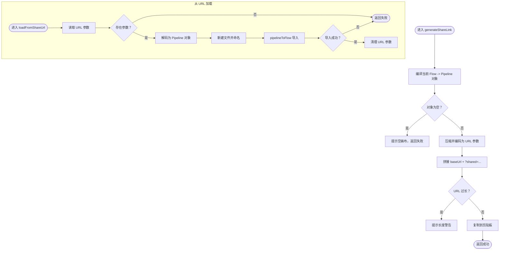
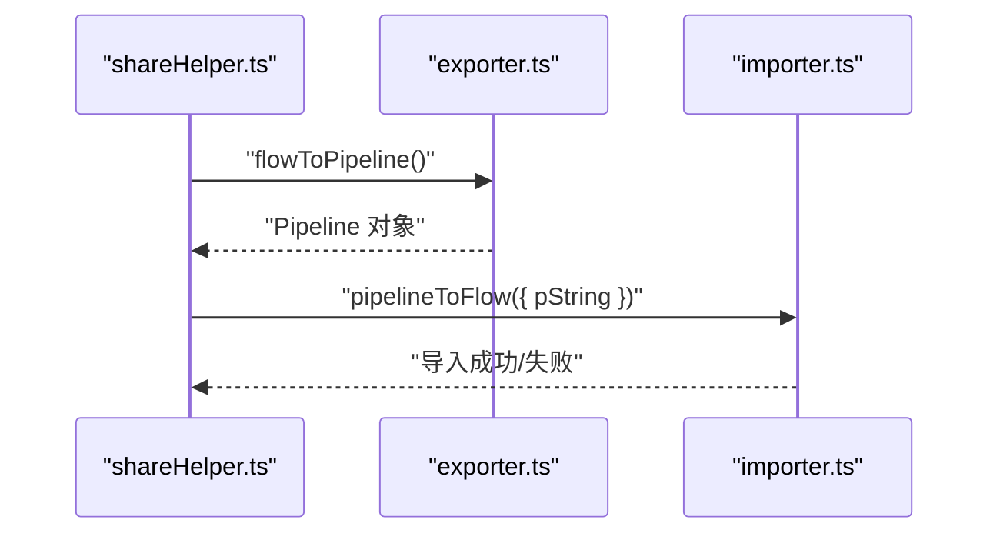
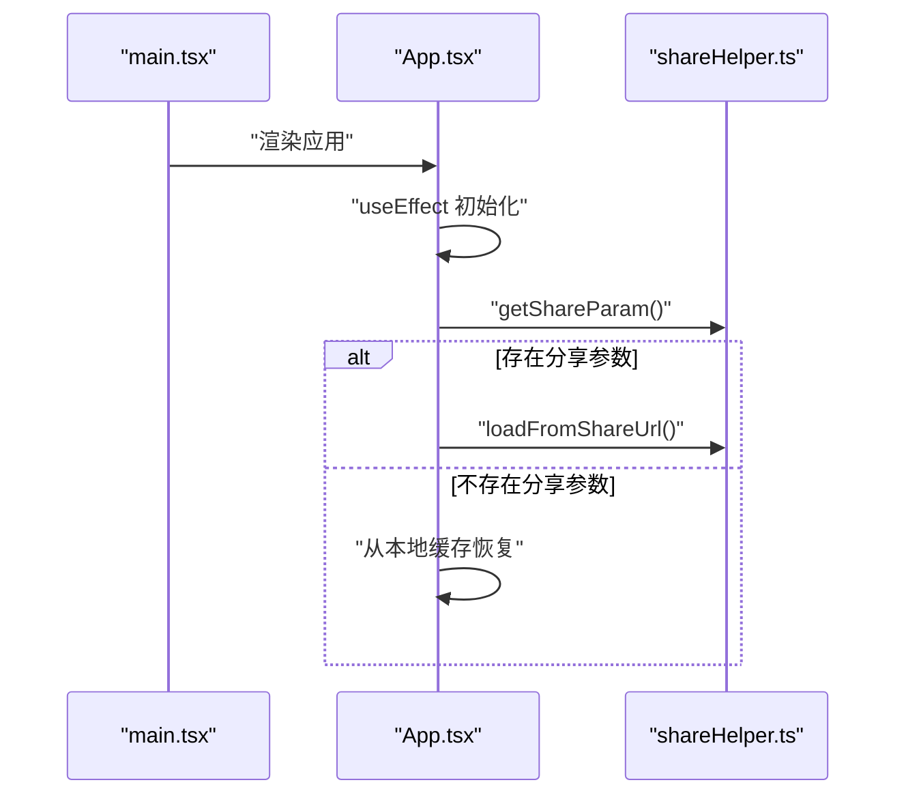
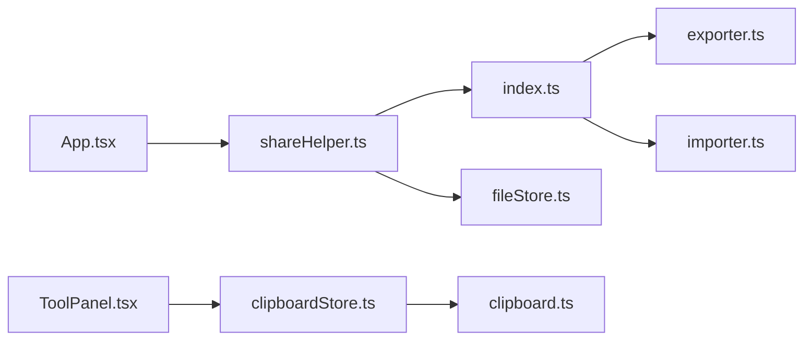

# 分享链接功能

<cite>
**本文引用的文件**
- [shareHelper.ts](file://src/utils/shareHelper.ts)
- [App.tsx](file://src/App.tsx)
- [main.tsx](file://src/main.tsx)
- [exporter.ts](file://src/core/parser/exporter.ts)
- [importer.ts](file://src/core/parser/importer.ts)
- [index.ts](file://src/core/parser/index.ts)
- [ToolPanel.tsx](file://src/components/panels/ToolPanel.tsx)
- [clipboard.ts](file://src/utils/clipboard.ts)
- [clipboardStore.ts](file://src/stores/clipboardStore.ts)
- [JsonViewer.tsx](file://src/components/JsonViewer.tsx)
- [工具.md](file://docsite/docs/01.指南/10.工作流面板/60.工具.md)
</cite>

## 目录
1. [简介](#简介)
2. [项目结构](#项目结构)
3. [核心组件](#核心组件)
4. [架构总览](#架构总览)
5. [详细组件分析](#详细组件分析)
6. [依赖分析](#依赖分析)
7. [性能考虑](#性能考虑)
8. [故障排查指南](#故障排查指南)
9. [结论](#结论)
10. [附录](#附录)

## 简介
本节介绍“分享链接功能”的目标与范围：通过将当前工作区的 Pipeline 配置压缩并编码为 URL 参数，实现跨设备、跨浏览器的快速分享与导入。分享链接具备以下特点：
- 采用 URL 查询参数传递，无需服务器即可分享
- 自动复制到剪贴板，便于快速转发
- 打开链接后自动新建文件并导入分享内容，不覆盖当前工作
- 支持版本标记与解码校验，避免跨版本不兼容问题
- 对超长链接提供长度警告，提升浏览器兼容性

## 项目结构
围绕“分享链接功能”涉及的关键文件与职责如下：
- 工具层：分享助手模块负责编码/解码、生成链接、读取/清除 URL 参数
- 解析层：导出器将 Flow 格式转换为 Pipeline 对象；导入器将 Pipeline 对象还原为 Flow
- 应用层：应用启动时检测分享参数并触发加载流程；工具面板提供复制/粘贴能力
- 存储层：文件存储与剪贴板存储支撑分享与导入过程
- 文档层：指南文档说明分享使用方式与注意事项



图表来源
- [App.tsx](file://src/App.tsx#L120-L180)
- [shareHelper.ts](file://src/utils/shareHelper.ts#L1-L182)
- [exporter.ts](file://src/core/parser/exporter.ts#L1-L120)
- [importer.ts](file://src/core/parser/importer.ts#L1-L181)
- [index.ts](file://src/core/parser/index.ts#L1-L53)
- [ToolPanel.tsx](file://src/components/panels/ToolPanel.tsx#L60-L180)
- [clipboard.ts](file://src/utils/clipboard.ts#L1-L44)
- [clipboardStore.ts](file://src/stores/clipboardStore.ts#L1-L51)
- [工具.md](file://docsite/docs/01.指南/10.工作流面板/60.工具.md#L66-L85)

章节来源
- [App.tsx](file://src/App.tsx#L120-L180)
- [shareHelper.ts](file://src/utils/shareHelper.ts#L1-L182)
- [exporter.ts](file://src/core/parser/exporter.ts#L1-L120)
- [importer.ts](file://src/core/parser/importer.ts#L1-L181)
- [index.ts](file://src/core/parser/index.ts#L1-L53)
- [ToolPanel.tsx](file://src/components/panels/ToolPanel.tsx#L60-L180)
- [clipboard.ts](file://src/utils/clipboard.ts#L1-L44)
- [clipboardStore.ts](file://src/stores/clipboardStore.ts#L1-L51)
- [工具.md](file://docsite/docs/01.指南/10.工作流面板/60.工具.md#L66-L85)

## 核心组件
- 分享助手（shareHelper）
  - 负责将当前 Flow 编译为 Pipeline 对象，使用 LZString 压缩并编码为 URL 参数，生成分享链接并复制到剪贴板；同时支持从 URL 参数解析并导入 Pipeline 到新文件。
- 解析器（exporter/importer）
  - 导出器将 Flow 格式转换为 Pipeline 对象；导入器将 Pipeline 对象解析回 Flow 并写入画布。
- 应用入口（App）
  - 应用启动时检测 URL 是否包含分享参数，存在则自动加载分享内容。
- 工具面板（ToolPanel）
  - 提供复制/粘贴等通用工具，配合内部剪贴板与剪贴板辅助类完成节点级复制与导入。
- 文档（工具.md）
  - 提供分享功能的使用说明与注意事项，强调隐私与兼容性。

章节来源
- [shareHelper.ts](file://src/utils/shareHelper.ts#L1-L182)
- [exporter.ts](file://src/core/parser/exporter.ts#L1-L120)
- [importer.ts](file://src/core/parser/importer.ts#L1-L181)
- [index.ts](file://src/core/parser/index.ts#L1-L53)
- [App.tsx](file://src/App.tsx#L120-L180)
- [ToolPanel.tsx](file://src/components/panels/ToolPanel.tsx#L60-L180)
- [工具.md](file://docsite/docs/01.指南/10.工作流面板/60.工具.md#L66-L85)

## 架构总览
分享链接功能的端到端流程如下：
- 生成阶段：应用读取当前 Flow，导出为 Pipeline 对象，压缩编码为 URL 参数，拼接为分享链接并复制到剪贴板
- 打开阶段：接收方打开链接，应用检测到分享参数后，解码并导入 Pipeline 至新文件，随后清理 URL 参数



图表来源
- [App.tsx](file://src/App.tsx#L120-L180)
- [shareHelper.ts](file://src/utils/shareHelper.ts#L62-L181)
- [exporter.ts](file://src/core/parser/exporter.ts#L1-L120)
- [importer.ts](file://src/core/parser/importer.ts#L141-L181)

章节来源
- [App.tsx](file://src/App.tsx#L120-L180)
- [shareHelper.ts](file://src/utils/shareHelper.ts#L62-L181)
- [exporter.ts](file://src/core/parser/exporter.ts#L1-L120)
- [importer.ts](file://src/core/parser/importer.ts#L141-L181)

## 详细组件分析

### 组件A：分享助手（shareHelper）
- 编码/解码
  - 使用 LZString 对包含版本号的 JSON 进行压缩与 URL 安全编码；解码时进行版本号校验与错误处理
- 生成分享链接
  - 从当前画布编译 Pipeline 对象，构建 URL 参数，复制到剪贴板；对超长链接给出警告
- 从 URL 加载
  - 检测分享参数，解码后新建文件并导入 Pipeline；导入成功后清理 URL 参数
- 清理 URL 参数
  - 移除查询参数，避免重复加载



图表来源
- [shareHelper.ts](file://src/utils/shareHelper.ts#L62-L181)

章节来源
- [shareHelper.ts](file://src/utils/shareHelper.ts#L1-L182)

### 组件B：解析器（exporter/importer）
- 导出器（exporter）
  - 从 Flow 状态与文件状态收集节点、边、配置与文件名，转换为 Pipeline 对象
- 导入器（importer）
  - 从字符串解析 Pipeline，迁移旧字段，解析配置与节点，重建连接关系并写入 Flow



图表来源
- [exporter.ts](file://src/core/parser/exporter.ts#L1-L120)
- [importer.ts](file://src/core/parser/importer.ts#L141-L181)
- [index.ts](file://src/core/parser/index.ts#L1-L53)

章节来源
- [exporter.ts](file://src/core/parser/exporter.ts#L1-L120)
- [importer.ts](file://src/core/parser/importer.ts#L1-L181)
- [index.ts](file://src/core/parser/index.ts#L1-L53)

### 组件C：应用入口（App）
- 启动时检测分享参数，若存在则调用分享助手加载 Pipeline
- 未检测到分享参数时，优先从本地缓存恢复工作
- 注册 WebSocket 状态回调，支持本地服务连接



图表来源
- [main.tsx](file://src/main.tsx#L1-L18)
- [App.tsx](file://src/App.tsx#L120-L180)
- [shareHelper.ts](file://src/utils/shareHelper.ts#L107-L172)

章节来源
- [main.tsx](file://src/main.tsx#L1-L18)
- [App.tsx](file://src/App.tsx#L120-L180)
- [shareHelper.ts](file://src/utils/shareHelper.ts#L107-L172)

### 组件D：工具面板与剪贴板（ToolPanel/clipboard）
- 工具面板提供复制/粘贴工具，复制时将选中节点写入内部剪贴板；粘贴时从内部剪贴板导入到画布
- 剪贴板辅助类封装浏览器剪贴板 API，统一错误提示与成功反馈
- 内部剪贴板状态管理，支持检查是否有内容

```mermaid
classDiagram
class ClipboardHelper {
+write(content, options) Promise~boolean~
+read(options) Promise~string~
}
class useClipboardStore {
+clipboardNodes : NodeType[]
+clipboardEdges : EdgeType[]
+copy(nodes, edges) void
+paste() {nodes, edges}|null
+hasContent() boolean
}
class ToolPanel {
+GlobalPanel()
+LayoutPanel()
+AddPanel()
}
ToolPanel --> useClipboardStore : "读取/写入内部剪贴板"
ToolPanel --> ClipboardHelper : "粘贴时读取剪贴板"
ClipboardHelper --> ToolPanel : "提供读写能力"
```

图表来源
- [ToolPanel.tsx](file://src/components/panels/ToolPanel.tsx#L60-L180)
- [clipboard.ts](file://src/utils/clipboard.ts#L1-L44)
- [clipboardStore.ts](file://src/stores/clipboardStore.ts#L1-L51)

章节来源
- [ToolPanel.tsx](file://src/components/panels/ToolPanel.tsx#L60-L180)
- [clipboard.ts](file://src/utils/clipboard.ts#L1-L44)
- [clipboardStore.ts](file://src/stores/clipboardStore.ts#L1-L51)

### 组件E：JSON 查看器与导入（JsonViewer）
- JSON 查看器支持从粘贴板导入 Pipeline 字符串并编译预览
- 支持将选中节点编译为 Pipeline 对象并复制到剪贴板，便于分享

章节来源
- [JsonViewer.tsx](file://src/components/JsonViewer.tsx#L126-L167)

## 依赖分析
- 分享助手依赖解析器导出/导入 API，以及浏览器剪贴板 API
- 应用入口依赖分享助手与文件存储，用于检测参数与创建新文件
- 工具面板依赖内部剪贴板状态与剪贴板辅助类，实现节点级复制/粘贴
- 文档层提供使用说明与注意事项，指导用户正确使用分享功能



图表来源
- [shareHelper.ts](file://src/utils/shareHelper.ts#L1-L182)
- [index.ts](file://src/core/parser/index.ts#L1-L53)
- [exporter.ts](file://src/core/parser/exporter.ts#L1-L120)
- [importer.ts](file://src/core/parser/importer.ts#L1-L181)
- [App.tsx](file://src/App.tsx#L120-L180)
- [ToolPanel.tsx](file://src/components/panels/ToolPanel.tsx#L60-L180)
- [clipboardStore.ts](file://src/stores/clipboardStore.ts#L1-L51)
- [clipboard.ts](file://src/utils/clipboard.ts#L1-L44)

章节来源
- [shareHelper.ts](file://src/utils/shareHelper.ts#L1-L182)
- [index.ts](file://src/core/parser/index.ts#L1-L53)
- [exporter.ts](file://src/core/parser/exporter.ts#L1-L120)
- [importer.ts](file://src/core/parser/importer.ts#L1-L181)
- [App.tsx](file://src/App.tsx#L120-L180)
- [ToolPanel.tsx](file://src/components/panels/ToolPanel.tsx#L60-L180)
- [clipboardStore.ts](file://src/stores/clipboardStore.ts#L1-L51)
- [clipboard.ts](file://src/utils/clipboard.ts#L1-L44)

## 性能考虑
- 压缩与编码
  - 使用 LZString 对 JSON 进行压缩，显著降低 URL 长度，提升传输效率
- URL 长度限制
  - 对超长链接给出警告，避免部分浏览器对超长 URL 的兼容性问题
- 导入性能
  - 导入器在解析 Pipeline 时进行版本检测与字段迁移，保证兼容性与稳定性
- 交互体验
  - 生成链接后自动复制到剪贴板，减少用户操作步骤；导入成功/失败提供即时反馈

[本节为通用性能讨论，不直接分析具体文件]

## 故障排查指南
- 生成链接失败
  - 当前画布为空时会提示无法生成分享链接；请先绘制至少一个节点
  - 超长链接可能在某些浏览器中无法正常打开，建议拆分或使用文件导入
- 打开链接后未导入
  - 分享链接解析失败时会提示链接不完整或版本不匹配；请确认链接完整且未被截断
  - 新建文件失败时会提示创建失败；请检查文件存储状态
- 导入失败
  - 导入器在解析 Pipeline 时可能遇到格式错误或版本不兼容；请确认分享内容为有效 Pipeline
- 剪贴板权限
  - 复制/粘贴失败时检查浏览器剪贴板权限与 HTTPS 环境要求

章节来源
- [shareHelper.ts](file://src/utils/shareHelper.ts#L62-L181)
- [importer.ts](file://src/core/parser/importer.ts#L141-L181)
- [clipboard.ts](file://src/utils/clipboard.ts#L1-L44)

## 结论
分享链接功能通过“压缩编码 + URL 参数 + 自动导入”的设计，实现了无需服务器即可分享与导入 Pipeline 的便捷能力。其核心在于：
- 明确的版本标记与解码校验，保障跨版本兼容
- 与应用启动流程无缝集成，自动检测并加载分享内容
- 与工具面板、剪贴板系统协同，提供节点级复制与导入能力
- 文档化使用说明与注意事项，提升用户体验与安全性

[本节为总结性内容，不直接分析具体文件]

## 附录
- 使用说明与注意事项
  - 分享链接包含完整的 Pipeline 配置（节点、连接、参数等），请注意隐私安全
  - 打开分享链接时会自动创建新文件，不会覆盖现有工作
  - 分享的内容不包含本地文件路径等环境相关配置

章节来源
- [工具.md](file://docsite/docs/01.指南/10.工作流面板/60.工具.md#L66-L85)