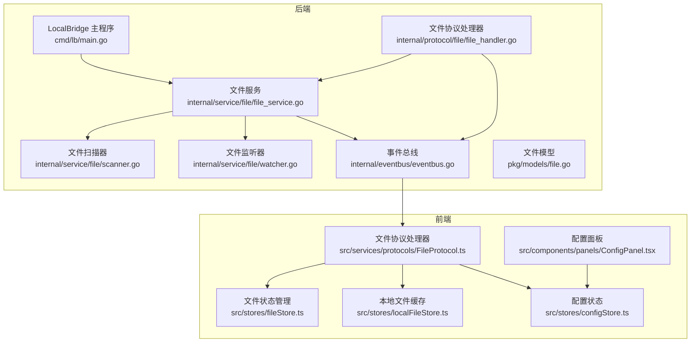
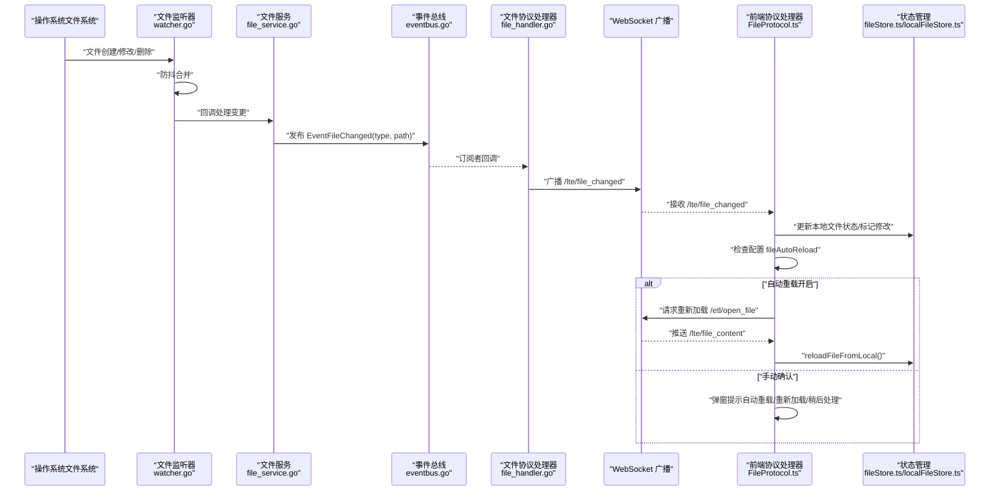
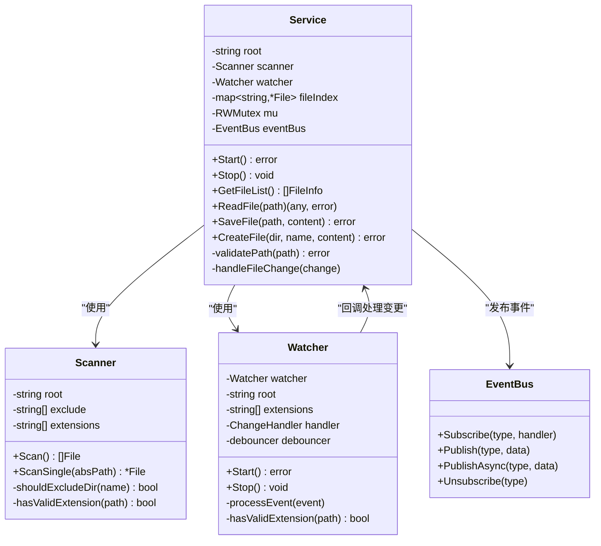
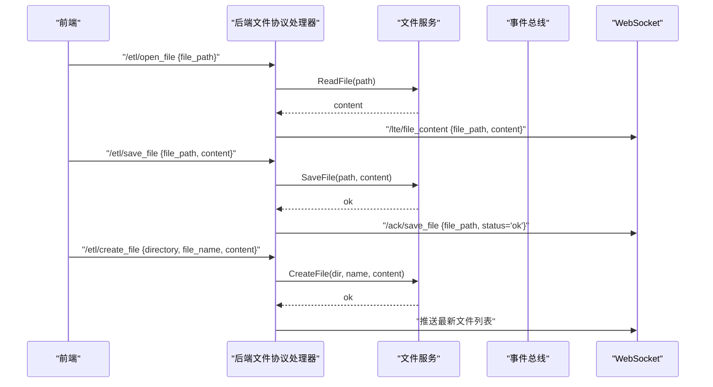
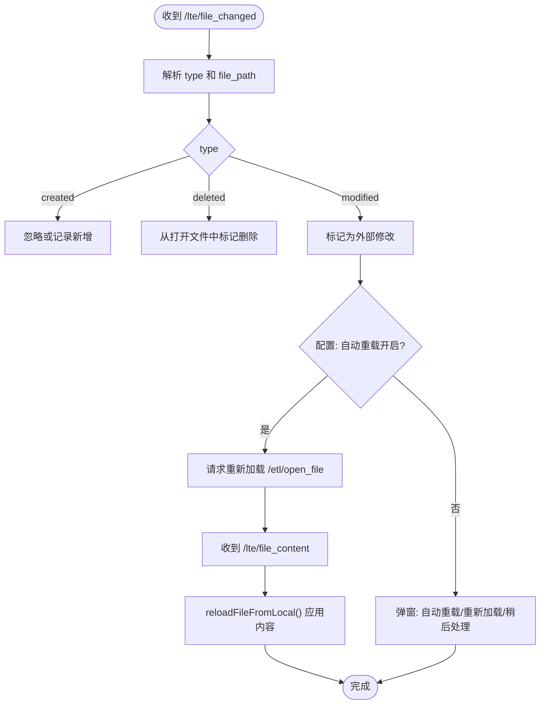
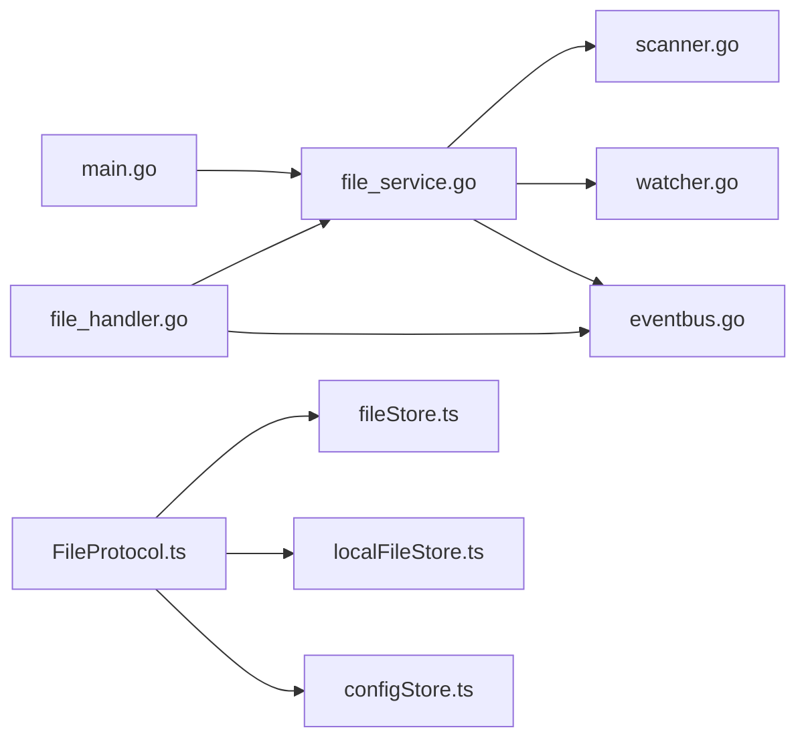

# 文件自动重载

<cite>
**本文引用的文件**
- [main.go](file://LocalBridge/cmd/lb/main.go)
- [file_service.go](file://LocalBridge/internal/service/file/file_service.go)
- [scanner.go](file://LocalBridge/internal/service/file/scanner.go)
- [watcher.go](file://LocalBridge/internal/service/file/watcher.go)
- [file_handler.go](file://LocalBridge/internal/protocol/file/file_handler.go)
- [eventbus.go](file://LocalBridge/internal/eventbus/eventbus.go)
- [file.go](file://LocalBridge/pkg/models/file.go)
- [FileProtocol.ts](file://src/services/protocols/FileProtocol.ts)
- [fileStore.ts](file://src/stores/fileStore.ts)
- [localFileStore.ts](file://src/stores/localFileStore.ts)
- [configStore.ts](file://src/stores/configStore.ts)
- [ConfigPanel.tsx](file://src/components/panels/ConfigPanel.tsx)
</cite>

## 目录
1. [简介](#简介)
2. [项目结构](#项目结构)
3. [核心组件](#核心组件)
4. [架构总览](#架构总览)
5. [详细组件分析](#详细组件分析)
6. [依赖关系分析](#依赖关系分析)
7. [性能考量](#性能考量)
8. [故障排查指南](#故障排查指南)
9. [结论](#结论)

## 简介
本文档围绕“文件自动重载”能力进行系统化说明，涵盖从本地文件系统监控、桥接服务处理、前端协议与状态管理到用户交互的完整链路。读者可据此理解：
- 文件变更如何被检测与传播
- 前端如何根据配置决定是否自动重载
- 保存与重载的协同机制
- 如何在不同场景下正确使用与调试自动重载

## 项目结构
围绕“文件自动重载”的关键模块分布如下：
- 后端桥接服务（LocalBridge）
  - 命令入口与服务编排：[main.go](file://LocalBridge/cmd/lb/main.go)
  - 文件服务与索引：[file_service.go](file://LocalBridge/internal/service/file/file_service.go)
  - 文件扫描器：[scanner.go](file://LocalBridge/internal/service/file/scanner.go)
  - 文件监听器（基于 fsnotify）：[watcher.go](file://LocalBridge/internal/service/file/watcher.go)
  - 文件协议处理器（WebSocket 路由）：[file_handler.go](file://LocalBridge/internal/protocol/file/file_handler.go)
  - 事件总线：[eventbus.go](file://LocalBridge/internal/eventbus/eventbus.go)
  - 文件模型：[file.go](file://LocalBridge/pkg/models/file.go)
- 前端协议与状态
  - 文件协议处理器（前端）：[FileProtocol.ts](file://src/services/protocols/FileProtocol.ts)
  - 文件状态管理：[fileStore.ts](file://src/stores/fileStore.ts)
  - 本地文件列表缓存：[localFileStore.ts](file://src/stores/localFileStore.ts)
  - 配置状态与开关：[configStore.ts](file://src/stores/configStore.ts)
  - 配置面板 UI：[ConfigPanel.tsx](file://src/components/panels/ConfigPanel.tsx)

图表来源
- [main.go](file://LocalBridge/cmd/lb/main.go#L54-L147)
- [file_service.go](file://LocalBridge/internal/service/file/file_service.go#L27-L71)
- [scanner.go](file://LocalBridge/internal/service/file/scanner.go#L27-L68)
- [watcher.go](file://LocalBridge/internal/service/file/watcher.go#L59-L80)
- [file_handler.go](file://LocalBridge/internal/protocol/file/file_handler.go#L37-L61)
- [eventbus.go](file://LocalBridge/internal/eventbus/eventbus.go#L75-L81)
- [file.go](file://LocalBridge/pkg/models/file.go#L1-L19)
- [FileProtocol.ts](file://src/services/protocols/FileProtocol.ts#L29-L47)
- [fileStore.ts](file://src/stores/fileStore.ts#L120-L126)
- [localFileStore.ts](file://src/stores/localFileStore.ts#L1-L41)
- [configStore.ts](file://src/stores/configStore.ts#L23-L41)
- [ConfigPanel.tsx](file://src/components/panels/ConfigPanel.tsx#L370-L396)

章节来源
- [main.go](file://LocalBridge/cmd/lb/main.go#L54-L147)
- [file_service.go](file://LocalBridge/internal/service/file/file_service.go#L27-L71)
- [scanner.go](file://LocalBridge/internal/service/file/scanner.go#L27-L68)
- [watcher.go](file://LocalBridge/internal/service/file/watcher.go#L59-L80)
- [file_handler.go](file://LocalBridge/internal/protocol/file/file_handler.go#L37-L61)
- [eventbus.go](file://LocalBridge/internal/eventbus/eventbus.go#L75-L81)
- [file.go](file://LocalBridge/pkg/models/file.go#L1-L19)
- [FileProtocol.ts](file://src/services/protocols/FileProtocol.ts#L29-L47)
- [fileStore.ts](file://src/stores/fileStore.ts#L120-L126)
- [localFileStore.ts](file://src/stores/localFileStore.ts#L1-L41)
- [configStore.ts](file://src/stores/configStore.ts#L23-L41)
- [ConfigPanel.tsx](file://src/components/panels/ConfigPanel.tsx#L370-L396)

## 核心组件
- 后端文件服务
  - 负责初始扫描、增量索引维护、文件读写、路径校验与变更事件发布。
- 文件监听器
  - 基于 fsnotify 递归监听根目录，过滤扩展名，使用防抖合并高频事件。
- 文件协议处理器（后端）
  - 负责路由处理、推送文件列表、广播文件变更、返回保存确认。
- 事件总线
  - 在文件服务与协议处理器之间解耦事件发布/订阅。
- 前端文件协议处理器
  - 接收后端推送的文件列表、内容与变更通知，依据配置决定是否自动重载。
- 前端状态管理
  - 文件状态（打开/保存/重载）、本地文件列表缓存、配置开关。

章节来源
- [file_service.go](file://LocalBridge/internal/service/file/file_service.go#L27-L71)
- [watcher.go](file://LocalBridge/internal/service/file/watcher.go#L59-L80)
- [file_handler.go](file://LocalBridge/internal/protocol/file/file_handler.go#L37-L61)
- [eventbus.go](file://LocalBridge/internal/eventbus/eventbus.go#L75-L81)
- [FileProtocol.ts](file://src/services/protocols/FileProtocol.ts#L29-L47)
- [fileStore.ts](file://src/stores/fileStore.ts#L120-L126)
- [localFileStore.ts](file://src/stores/localFileStore.ts#L1-L41)
- [configStore.ts](file://src/stores/configStore.ts#L23-L41)

## 架构总览
文件自动重载的整体流程如下：
- 后端启动时进行一次全量扫描并发布“扫描完成”事件，随后启动文件监听。
- 文件变更通过监听器捕获，经防抖合并后触发文件服务的变更处理，发布“文件变更”事件。
- 协议处理器订阅事件并广播给前端，前端根据配置决定是否自动重载或弹窗提示。
- 用户保存文件时，前端通过 WebSocket 发送保存请求，后端写入文件并返回确认，前端清除“最近保存”标识，避免自触发重载。

图表来源
- [watcher.go](file://LocalBridge/internal/service/file/watcher.go#L92-L138)
- [file_service.go](file://LocalBridge/internal/service/file/file_service.go#L196-L228)
- [eventbus.go](file://LocalBridge/internal/eventbus/eventbus.go#L38-L51)
- [file_handler.go](file://LocalBridge/internal/protocol/file/file_handler.go#L153-L179)
- [FileProtocol.ts](file://src/services/protocols/FileProtocol.ts#L117-L179)
- [fileStore.ts](file://src/stores/fileStore.ts#L444-L483)

章节来源
- [watcher.go](file://LocalBridge/internal/service/file/watcher.go#L92-L138)
- [file_service.go](file://LocalBridge/internal/service/file/file_service.go#L196-L228)
- [file_handler.go](file://LocalBridge/internal/protocol/file/file_handler.go#L153-L179)
- [FileProtocol.ts](file://src/services/protocols/FileProtocol.ts#L117-L179)
- [fileStore.ts](file://src/stores/fileStore.ts#L444-L483)

## 详细组件分析

### 后端文件服务与监听
- 文件服务
  - 初始化时执行全量扫描，构建文件索引，并发布“扫描完成”事件。
  - 提供读取、保存、创建等接口，并在保存后记录日志。
  - 处理文件变更时，根据类型执行新增、忽略或删除索引，并发布“文件变更”事件。
- 文件监听器
  - 递归注册目录监听，过滤扩展名，使用防抖器合并高频事件，降低重复处理开销。
- 事件总线
  - 提供同步/异步发布与订阅，确保文件服务与协议处理器松耦合。

图表来源
- [file_service.go](file://LocalBridge/internal/service/file/file_service.go#L16-L24)
- [scanner.go](file://LocalBridge/internal/service/file/scanner.go#L11-L16)
- [watcher.go](file://LocalBridge/internal/service/file/watcher.go#L31-L39)
- [eventbus.go](file://LocalBridge/internal/eventbus/eventbus.go#L7-L21)

章节来源
- [file_service.go](file://LocalBridge/internal/service/file/file_service.go#L46-L71)
- [scanner.go](file://LocalBridge/internal/service/file/scanner.go#L27-L68)
- [watcher.go](file://LocalBridge/internal/service/file/watcher.go#L59-L80)
- [eventbus.go](file://LocalBridge/internal/eventbus/eventbus.go#L29-L51)

### 文件协议处理器（后端）
- 路由前缀与消息处理
  - 支持打开、保存、创建、刷新文件列表等路由。
  - 处理打开/保存/创建请求，返回对应结果或错误消息。
- 事件订阅与广播
  - 订阅连接建立事件，首次连接即推送文件列表。
  - 订阅文件变更事件，广播给所有前端客户端。

图表来源
- [file_handler.go](file://LocalBridge/internal/protocol/file/file_handler.go#L37-L61)
- [file_handler.go](file://LocalBridge/internal/protocol/file/file_handler.go#L63-L121)
- [file_handler.go](file://LocalBridge/internal/protocol/file/file_handler.go#L147-L179)

章节来源
- [file_handler.go](file://LocalBridge/internal/protocol/file/file_handler.go#L37-L61)
- [file_handler.go](file://LocalBridge/internal/protocol/file/file_handler.go#L63-L121)
- [file_handler.go](file://LocalBridge/internal/protocol/file/file_handler.go#L147-L179)

### 前端文件协议与自动重载
- 文件列表与内容
  - 接收后端推送的文件列表与文件内容，更新本地缓存与当前打开的文件。
- 文件变更通知
  - 接收“文件变更”通知，区分创建、修改、删除三类。
  - 若为修改且非“最近保存”触发，则根据配置决定自动重载或弹窗提示。
- 保存确认
  - 接收保存确认后，前端记录“最近保存”集合并在短暂时间内忽略该文件的变更通知，避免自触发重载。

图表来源
- [FileProtocol.ts](file://src/services/protocols/FileProtocol.ts#L117-L179)
- [FileProtocol.ts](file://src/services/protocols/FileProtocol.ts#L259-L318)
- [fileStore.ts](file://src/stores/fileStore.ts#L444-L483)

章节来源
- [FileProtocol.ts](file://src/services/protocols/FileProtocol.ts#L117-L179)
- [FileProtocol.ts](file://src/services/protocols/FileProtocol.ts#L259-L318)
- [fileStore.ts](file://src/stores/fileStore.ts#L444-L483)

### 配置与用户交互
- 配置项
  - fileAutoReload：控制是否自动重载外部修改的文件。
- 配置面板
  - 提供开关控件，用户可一键开启自动重载。
- 状态管理
  - 配置状态与文件状态分别由独立 store 管理，保证职责清晰。

章节来源
- [configStore.ts](file://src/stores/configStore.ts#L23-L41)
- [ConfigPanel.tsx](file://src/components/panels/ConfigPanel.tsx#L370-L396)
- [fileStore.ts](file://src/stores/fileStore.ts#L120-L126)

## 依赖关系分析
- 后端
  - main.go 负责装配：配置加载、日志初始化、事件总线、文件服务、MFW 服务、WebSocket 服务器与路由注册。
  - 文件服务依赖扫描器与监听器，通过事件总线与协议处理器解耦。
- 前端
  - FileProtocol 依赖 WebSocket 客户端、文件状态与本地文件缓存、配置状态。
  - fileStore 与 localFileStore 分别负责“打开/保存/重载”与“文件列表缓存”。

图表来源
- [main.go](file://LocalBridge/cmd/lb/main.go#L54-L147)
- [file_service.go](file://LocalBridge/internal/service/file/file_service.go#L27-L71)
- [scanner.go](file://LocalBridge/internal/service/file/scanner.go#L27-L68)
- [watcher.go](file://LocalBridge/internal/service/file/watcher.go#L59-L80)
- [file_handler.go](file://LocalBridge/internal/protocol/file/file_handler.go#L37-L61)
- [FileProtocol.ts](file://src/services/protocols/FileProtocol.ts#L29-L47)
- [fileStore.ts](file://src/stores/fileStore.ts#L120-L126)
- [localFileStore.ts](file://src/stores/localFileStore.ts#L1-L41)
- [configStore.ts](file://src/stores/configStore.ts#L23-L41)

章节来源
- [main.go](file://LocalBridge/cmd/lb/main.go#L54-L147)
- [file_handler.go](file://LocalBridge/internal/protocol/file/file_handler.go#L37-L61)
- [FileProtocol.ts](file://src/services/protocols/FileProtocol.ts#L29-L47)

## 性能考量
- 监听范围与过滤
  - 监听器递归注册目录，建议合理设置根目录与扩展名过滤，减少无效事件。
- 防抖策略
  - 通过防抖器合并高频事件，降低重复处理与广播次数。
- 索引与并发
  - 文件索引访问使用读写锁保护，避免竞态；初始扫描一次性构建，后续增量更新。
- 前端重载
  - 自动重载仅在配置开启时生效，避免不必要的网络与解析开销。

章节来源
- [watcher.go](file://LocalBridge/internal/service/file/watcher.go#L59-L80)
- [watcher.go](file://LocalBridge/internal/service/file/watcher.go#L110-L138)
- [file_service.go](file://LocalBridge/internal/service/file/file_service.go#L80-L91)
- [FileProtocol.ts](file://src/services/protocols/FileProtocol.ts#L267-L272)

## 故障排查指南
- 无法接收文件变更通知
  - 检查后端是否成功启动监听与广播。
  - 确认前端 WebSocket 已连接且路由已注册。
- 自动重载未生效
  - 确认配置项 fileAutoReload 已开启。
  - 检查保存确认是否到达前端，避免“最近保存”集合导致的忽略。
- 文件内容未更新
  - 确认后端保存成功并返回确认消息。
  - 检查前端 reloadFileFromLocal 是否被调用。
- 路径权限问题
  - 后端会对路径进行合法性校验，确保在根目录范围内。
- 日志定位
  - 后端日志包含启动、扫描、保存、监听错误等关键信息，便于定位问题。

章节来源
- [file_handler.go](file://LocalBridge/internal/protocol/file/file_handler.go#L181-L194)
- [FileProtocol.ts](file://src/services/protocols/FileProtocol.ts#L181-L206)
- [fileStore.ts](file://src/stores/fileStore.ts#L444-L483)
- [file_service.go](file://LocalBridge/internal/service/file/file_service.go#L230-L245)

## 结论
“文件自动重载”通过后端文件服务与监听器、事件总线与协议处理器的协作，实现了从文件系统变更到前端即时响应的闭环。前端基于配置决定是否自动重载，既保证了开发效率，也保留了用户的手动控制权。结合合理的监听范围、防抖策略与状态管理，整体具备良好的稳定性与可维护性。