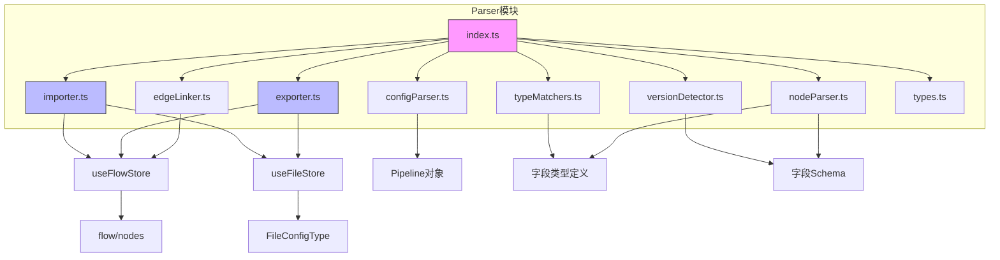
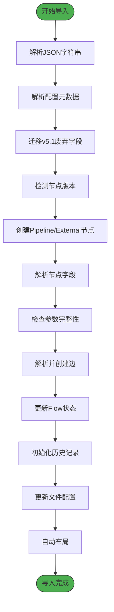
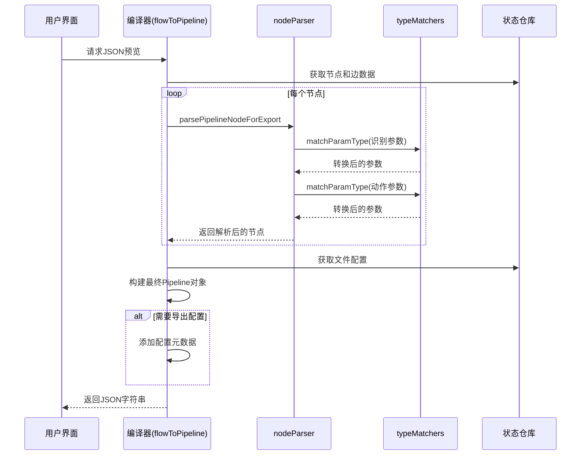

# 特性

<cite>
**本文档中引用的文件**  
- [index.ts](file://src/core/parser/index.ts)
- [importer.ts](file://src/core/parser/importer.ts)
- [exporter.ts](file://src/core/parser/exporter.ts)
- [configParser.ts](file://src/core/parser/configParser.ts)
- [typeMatchers.ts](file://src/core/parser/typeMatchers.ts)
- [versionDetector.ts](file://src/core/parser/versionDetector.ts)
- [nodeParser.ts](file://src/core/parser/nodeParser.ts)
- [edgeLinker.ts](file://src/core/parser/edgeLinker.ts)
- [types.ts](file://src/core/parser/types.ts)
- [index.ts](file://src/core/fields/index.ts)
- [fileStore.ts](file://src/stores/fileStore.ts)
- [flow/index.ts](file://src/stores/flow/index.ts)
</cite>

## 目录
1. [介绍](#介绍)
2. [编译器与解析器架构概览](#编译器与解析器架构概览)
3. [解析器模块工作机制](#解析器模块工作机制)
4. [编译器实时生成与兼容性保障](#编译器实时生成与兼容性保障)
5. [关键逻辑深入解析](#关键逻辑深入解析)
6. [旧配置迁移支持能力](#旧配置迁移支持能力)
7. [总结](#总结)

## 介绍
MaaPipelineEditor 是一个可视化流程编辑器，旨在实现与 MaaFramework 原生 JSON 协议之间的无缝双向转换。其核心特性之一是“编译器”与“解析器”模块，分别负责将可视化编辑器状态编译为标准 JSON 输出，以及将 JSON 配置解析为 React Flow 兼容的节点与边数据结构。本文档深入解析这两个模块的设计与实现，阐明其在用户操作、配置处理、版本兼容和迁移支持方面的关键机制。

## 编译器与解析器架构概览

MaaPipelineEditor 的编译与解析功能由 `src/core/parser` 模块统一管理，该模块采用高内聚、低耦合的设计原则，被拆分为多个子模块以提高可维护性。

**Diagram sources**
- [index.ts](file://src/core/parser/index.ts#L1-L73)

**Section sources**
- [index.ts](file://src/core/parser/index.ts#L1-L73)

## 解析器模块工作机制

解析器模块的核心功能是 `pipelineToFlow`，它负责将 MaaFramework 的 JSON 格式配置解析并加载到可视化编辑器中。该过程涉及配置解析、版本迁移、节点创建和边连接等多个步骤。

### JSON配置到Flow数据的转换流程

当用户导入一个 JSON 配置时，`pipelineToFlow` 函数首先通过 `jsonc-parser` 解析字符串，然后调用 `parsePipelineConfig` 提取配置元数据（如文件名、前缀等）。接着，系统会执行 `migratePipelineV5` 函数，将 v5.1 版本中废弃的 `interrupt` 和 `is_sub` 字段迁移到新的 `next` 字段中，确保向后兼容。

**Diagram sources**
- [importer.ts](file://src/core/parser/importer.ts#L125-L295)

**Section sources**
- [importer.ts](file://src/core/parser/importer.ts#L125-L295)

### configParser在配置元数据处理中的作用

`configParser` 模块专门负责处理嵌入在 JSON 配置中的元数据。它通过 `isConfigKey` 函数识别以 `__$mpe_config_`、`__mpe_config_` 或 `__yamaape_config_` 开头的特殊键，这些键用于存储编辑器的配置信息。`getConfigMark` 函数则兼容新旧版本的标记（`$__mpe_code`、`__mpe_code`、`__yamaape`），确保能正确提取配置对象。最终，`parsePipelineConfig` 将这些信息整合到 `PipelineConfigType` 中，用于恢复文件名、前缀等设置。

**Section sources**
- [configParser.ts](file://src/core/parser/configParser.ts#L1-L69)

## 编译器实时生成与兼容性保障

编译器模块的核心功能是 `flowToPipeline`，它负责将当前编辑器的状态实时编译为符合 MaaFramework 协议的 JSON 输出。这一过程不仅发生在用户显式导出时，也用于实时预览，确保输出格式的正确性与兼容性。

### 实时JSON预览生成机制

`flowToPipeline` 函数从 `useFlowStore` 和 `useFileStore` 中获取当前的节点、边、文件名和配置信息。它遍历所有节点，根据节点类型（`Pipeline` 或 `External`）调用 `parsePipelineNodeForExport` 或 `parseExternalNodeForExport` 进行转换。在转换过程中，会根据全局配置决定是否导出位置信息等元数据。

**Diagram sources**
- [exporter.ts](file://src/core/parser/exporter.ts#L28-L137)
- [nodeParser.ts](file://src/core/parser/nodeParser.ts#L21-L76)

**Section sources**
- [exporter.ts](file://src/core/parser/exporter.ts#L28-L137)

## 关键逻辑深入解析

### 类型匹配（typeMatchers）机制

`typeMatchers` 模块是确保数据类型正确性的核心。`matchParamType` 函数接收一个参数对象和一个预定义的字段类型数组。它遍历参数的每个键，查找对应的字段定义，并调用 `matchSingleType` 进行类型转换。`matchSingleType` 支持多种类型，如 `Int`、`Double`、`StringList`、`XYWH` 等，并能处理字符串列表、二维数组等复杂格式。如果类型匹配失败，会触发错误通知，提示用户检查字段。

**Section sources**
- [typeMatchers.ts](file://src/core/parser/typeMatchers.ts#L261-L302)

### 版本检测（versionDetector）逻辑

`versionDetector` 模块负责识别 JSON 配置的版本，以实现向后兼容。`detectNodeVersion` 函数通过检查 `recognition` 和 `action` 字段的结构来判断版本：如果它们是字符串，则为 v1 版本；如果它们是包含 `type` 键的对象，则为 v2 版本。`normalizeRecoType` 和 `normalizeActionType` 函数则确保识别算法和动作类型的值是标准化的大写形式，防止因大小写导致的错误。

**Section sources**
- [versionDetector.ts](file://src/core/parser/versionDetector.ts#L23-L149)

## 旧配置迁移支持能力

MaaPipelineEditor 具备强大的旧配置迁移能力，特别是对从 YAMaaPE 迁移的支持。这主要体现在两个方面：

1.  **配置键兼容性**：`configParser` 中的 `isConfigKey` 函数明确检查 `__yamaape_config_` 前缀，表明系统能识别 YAMaaPE 的配置格式。
2.  **字段迁移**：`importer.ts` 中的 `migratePipelineV5` 函数专门处理 v5.1 版本的废弃字段，将 `interrupt` 和 `is_sub` 节点引用转换为带有 `[JumpBack]` 前缀的 `next` 引用。这种设计允许用户无缝导入旧版本的 Pipeline 配置，而无需手动修改。

这些机制共同确保了 MaaPipelineEditor 能够作为一个现代化的编辑器，同时保持对历史配置和旧工具（如 YAMaaPE）生态的兼容性，极大地降低了用户的迁移成本。

**Section sources**
- [configParser.ts](file://src/core/parser/configParser.ts#L9-L14)
- [importer.ts](file://src/core/parser/importer.ts#L31-L119)

## 总结
MaaPipelineEditor 的编译器与解析器特性通过模块化、分层的设计，实现了可视化流程与 JSON 协议之间的高效、可靠双向转换。解析器（importer）能够智能地处理版本迁移和配置元数据，将复杂的 JSON 结构还原为直观的 Flow 数据。编译器（exporter）则通过严格的类型匹配和版本检测，确保生成的 JSON 完全符合 MaaFramework 协议。这些核心机制不仅保证了功能的正确性，还为用户从旧工具（如 YAMaaPE）迁移提供了坚实的支持，体现了项目在用户体验和兼容性方面的深度考量。