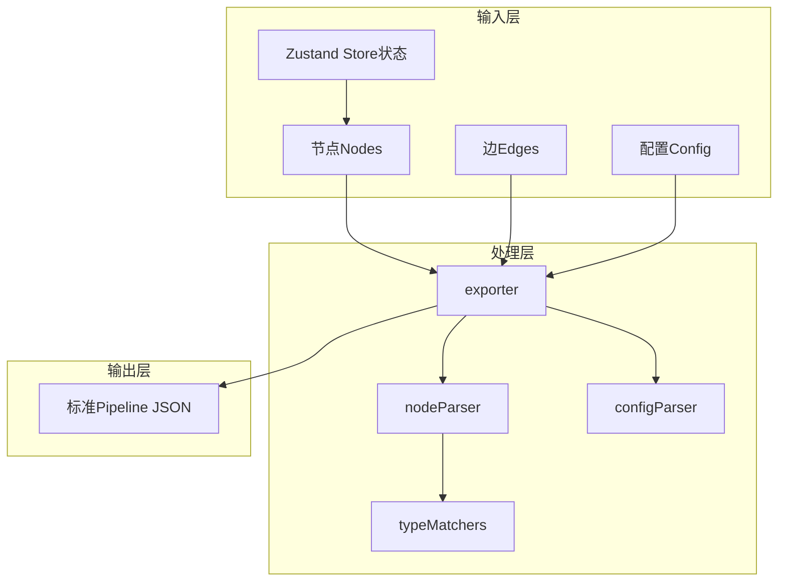
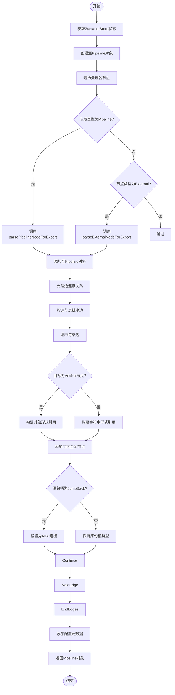
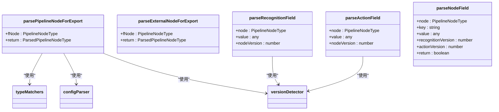
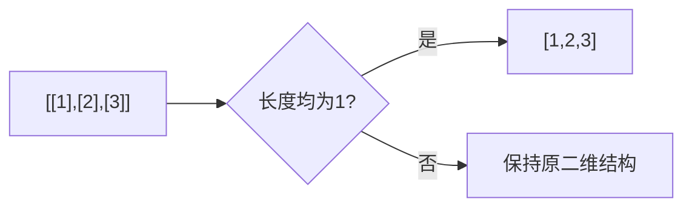
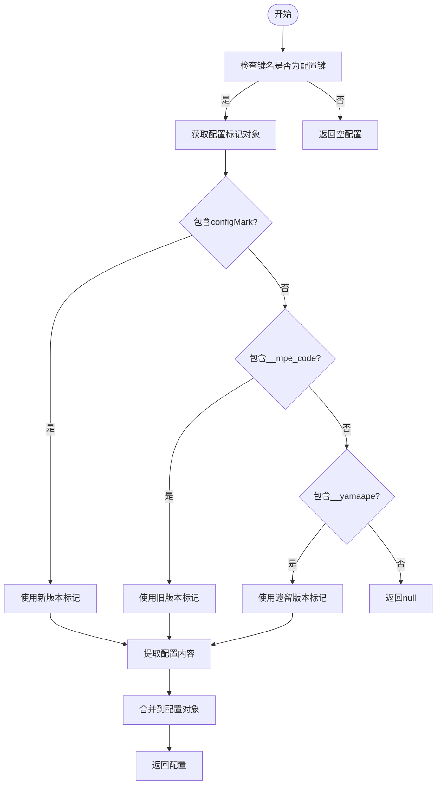
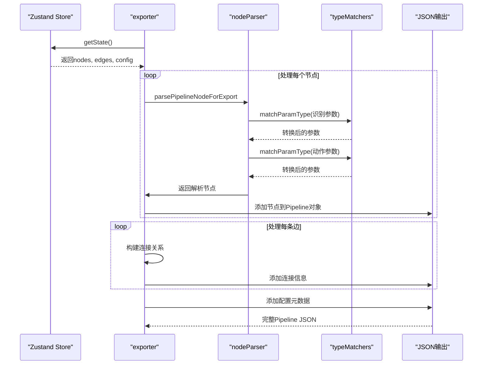

# 编译器

<cite>
**本文档中引用的文件**  
- [exporter.ts](file://src/core/parser/exporter.ts)
- [typeMatchers.ts](file://src/core/parser/typeMatchers.ts)
- [configParser.ts](file://src/core/parser/configParser.ts)
- [nodeParser.ts](file://src/core/parser/nodeParser.ts)
- [types.ts](file://src/core/parser/types.ts)
- [fieldTypes.ts](file://src/core/fields/fieldTypes.ts)
- [jsonHelper.ts](file://src/utils/jsonHelper.ts)
- [flowStore.ts](file://src/stores/flow/index.ts)
</cite>

## 目录
1. [简介](#简介)
2. [编译器架构概述](#编译器架构概述)
3. [核心组件分析](#核心组件分析)
4. [字段编译准则与类型优先级机制](#字段编译准则与类型优先级机制)
5. [类型推断过程与typeMatchers实现](#类型推断过程与typematchers实现)
6. [语法糖处理逻辑](#语法糖处理逻辑)
7. [配置元数据提取与序列化](#配置元数据提取与序列化)
8. [从Zustand状态到JSON的转换流程](#从zustand状态到json的转换流程)
9. [性能优化策略](#性能优化策略)
10. [错误处理与调试支持](#错误处理与调试支持)

## 简介

MaaPipelineEditor中的编译器（Compiler）负责将可视化流程编辑器中的节点、边和字段状态实时编译为符合MaaFramework v2标准的Pipeline JSON协议。该编译过程通过`exporter`模块驱动，结合`typeMatchers`进行类型推断，利用`configParser`提取配置信息，并通过`nodeParser`解析节点结构，最终生成标准化的JSON输出。整个系统设计注重向后兼容性、用户输入灵活性以及编译性能。

**Section sources**
- [exporter.ts](file://src/core/parser/exporter.ts#L28-L136)
- [nodeParser.ts](file://src/core/parser/nodeParser.ts#L21-L75)

## 编译器架构概述

编译器采用分层架构，主要由以下核心模块构成：
- **exporter**：主控逻辑，协调节点与连接的导出流程
- **typeMatchers**：类型匹配引擎，实现字段值的类型推断与转换
- **configParser**：配置解析器，提取并序列化元数据
- **nodeParser**：节点解析器，处理识别与动作字段的版本兼容性
- **versionDetector**：版本检测器，判断Pipeline节点的协议版本



**Diagram sources**
- [exporter.ts](file://src/core/parser/exporter.ts)
- [nodeParser.ts](file://src/core/parser/nodeParser.ts)
- [typeMatchers.ts](file://src/core/parser/typeMatchers.ts)
- [configParser.ts](file://src/core/parser/configParser.ts)

**Section sources**
- [exporter.ts](file://src/core/parser/exporter.ts#L28-L136)
- [nodeParser.ts](file://src/core/parser/nodeParser.ts#L21-L75)
- [typeMatchers.ts](file://src/core/parser/typeMatchers.ts#L261-L301)
- [configParser.ts](file://src/core/parser/configParser.ts#L47-L68)

## 核心组件分析

### exporter主流程分析

`flowToPipeline`函数是编译器的核心入口，接收可视化流程的状态数据（节点、边、文件名、配置），并将其转换为符合MaaFramework v2标准的Pipeline对象。



**Diagram sources**
- [exporter.ts](file://src/core/parser/exporter.ts#L28-L136)

**Section sources**
- [exporter.ts](file://src/core/parser/exporter.ts#L28-L136)

### nodeParser节点解析分析

`nodeParser`模块负责将编辑器中的节点数据结构转换为标准的Pipeline节点格式，同时处理v1与v2版本的兼容性问题。



**Diagram sources**
- [nodeParser.ts](file://src/core/parser/nodeParser.ts#L21-L200)
- [typeMatchers.ts](file://src/core/parser/typeMatchers.ts#L261-L301)
- [versionDetector.ts](file://src/core/parser/versionDetector.ts)

**Section sources**
- [nodeParser.ts](file://src/core/parser/nodeParser.ts#L21-L200)

## 字段编译准则与类型优先级机制

编译器定义了一套完整的字段类型系统，通过`FieldTypeEnum`枚举实现17级类型优先级判定机制。该机制确保用户输入能被正确解析为预期的数据结构。

### 类型优先级列表

| 优先级 | 类型名称 | 类型标识 | 说明 |
|--------|--------|--------|------|
| 1 | 整型 | int | 单个整数 |
| 2 | 浮点数 | double | 单个浮点数 |
| 3 | 布尔值true | true | 仅匹配字符串"true" |
| 4 | 布尔值 | bool | 匹配"true"/"false" |
| 5 | 字符串 | string | 任意字符串 |
| 6 | 整型数组 | list<int, > | 整数列表 |
| 7 | 二维整型数组 | list<list<int, >> | 二维整数列表 |
| 8 | 浮点数数组 | list<double, > | 浮点数列表 |
| 9 | 字符串数组 | list<string, > | 字符串列表 |
| 10 | XYWH四元组 | array<int, 4> | [x,y,w,h]格式的位置信息 |
| 11 | XYWH数组 | list<array<int, 4>> | 多个XYWH组成的列表 |
| 12 | 位置复合数组 | list<true \| string \| array<int, 4>> | 混合类型的位置列表 |
| 13 | 整型键值对 | array<int, 2> | [key,value]格式的整数对 |
| 14 | 字符串键值对 | array<string, 2> | [key,value]格式的字符串对 |
| 15 | 字符串键值对数组 | list<array<string, 2>> | 多个字符串键值对 |
| 16 | 任意类型 | any | 可为对象或JSON字符串 |
| 17 | 对象列表 | list<object,> | 对象数组 |

**Section sources**
- [fieldTypes.ts](file://src/core/fields/fieldTypes.ts#L4-L22)

## 类型推断过程与typeMatchers实现

`typeMatchers`模块是类型推断的核心，通过`matchParamType`函数实现多类型尝试匹配机制。

```mermaid
sequenceDiagram
participant User as "用户输入"
participant Exporter as "exporter"
participant NodeParser as "nodeParser"
participant TypeMatcher as "typeMatchers"
User->>Exporter : 触发导出操作
Exporter->>NodeParser : 调用parsePipelineNodeForExport
NodeParser->>TypeMatcher : 调用matchParamType(识别参数)
TypeMatcher->>TypeMatcher : 遍历预定义字段类型
TypeMatcher->>TypeMatcher : 对每个类型调用matchSingleType
loop 尝试所有可能类型
TypeMatcher->>TypeMatcher : matchSingleType(value, fieldType)
alt 匹配成功
TypeMatcher-->>NodeParser : 返回转换后的值
break 返回结果
end
end
NodeParser->>Exporter : 返回解析后的节点
Exporter->>User : 生成最终JSON
```

**Diagram sources**
- [typeMatchers.ts](file://src/core/parser/typeMatchers.ts#L261-L301)
- [nodeParser.ts](file://src/core/parser/nodeParser.ts#L30-L33)

**Section sources**
- [typeMatchers.ts](file://src/core/parser/typeMatchers.ts#L24-L253)
- [nodeParser.ts](file://src/core/parser/nodeParser.ts#L30-L33)

## 语法糖处理逻辑

编译器支持多种便捷输入方式，通过预处理和正则表达式实现语法糖解析。

### 方括号省略处理

用户可省略方括号直接输入数字序列，系统自动识别为数组类型。

```typescript
// 用户输入: 100,200,300,400
// 系统处理: 自动转换为 [100,200,300,400]
```

### 中英文逗号/引号混用

通过正则表达式统一处理中英文标点符号：

```typescript
.replace(/[\s\[\]]/g, "")  // 清除空格和方括号
.split(/[,，]/)             // 支持中英文逗号分隔
.replaceAll(/[" \[\]]/g, "") // 清除引号和空格
```

### 列表降维处理

对于二维数组，当所有子数组长度为1时自动降维：



**Section sources**
- [typeMatchers.ts](file://src/core/parser/typeMatchers.ts#L12-L16)
- [typeMatchers.ts](file://src/core/parser/typeMatchers.ts#L194-L195)

## 配置元数据提取与序列化

`configParser`模块负责提取和序列化配置元数据，确保输出的JSON包含必要的上下文信息。



**Diagram sources**
- [configParser.ts](file://src/core/parser/configParser.ts#L47-L68)

**Section sources**
- [configParser.ts](file://src/core/parser/configParser.ts#L47-L68)
- [types.ts](file://src/core/parser/types.ts#L15-L17)

## 从Zustand状态到JSON的转换流程

编译器通过Zustand store获取实时状态，并将其转换为标准JSON格式。



**Diagram sources**
- [exporter.ts](file://src/core/parser/exporter.ts#L28-L136)
- [nodeParser.ts](file://src/core/parser/nodeParser.ts#L21-L75)
- [flowStore.ts](file://src/stores/flow/index.ts)

**Section sources**
- [exporter.ts](file://src/core/parser/exporter.ts#L28-L136)
- [nodeParser.ts](file://src/core/parser/nodeParser.ts#L21-L75)
- [flowStore.ts](file://src/stores/flow/index.ts)

## 性能优化策略

编译器采用了多种性能优化策略，确保在大型流程图中仍能快速响应。

### 增量编译机制

通过Zustand的状态选择器（selector）实现局部更新，仅重新编译发生变化的节点。

### 防抖机制

在实时预览场景中，对编译操作添加防抖处理，避免频繁触发：

```typescript
// 伪代码示例
const debouncedCompile = debounce(() => {
    const result = flowToPipeline();
    updatePreview(result);
}, 300); // 300ms防抖
```

### 排序优化

对边进行预排序，确保连接顺序的确定性：

```typescript
const sortedEdges = [...edges].sort((a, b) => {
    if (a.source === b.source) {
        return (a.label as number) - (b.label as number);
    }
    return 0;
});
```

**Section sources**
- [exporter.ts](file://src/core/parser/exporter.ts#L61-L66)

## 错误处理与调试支持

编译器内置了完善的错误处理机制，确保用户能及时发现并修正问题。

### 异常捕获

在主流程中使用try-catch包裹，防止编译错误导致应用崩溃：

```typescript
try {
    // 编译逻辑
} catch (err) {
    notification.error({
        title: "导出失败！",
        description: "请检查个节点字段是否符合格式"
    });
    console.error(err);
    return {};
}
```

### 类型匹配错误提示

当字段类型匹配失败时，提供具体的错误通知：

```typescript
notification.error({
    message: "类型错误",
    description: `部分参数类型错误，请检查各节点字段是否符合Pipeline协议；可能的参数：${key}`
});
```

**Section sources**
- [exporter.ts](file://src/core/parser/exporter.ts#L127-L135)
- [typeMatchers.ts](file://src/core/parser/typeMatchers.ts#L292-L297)