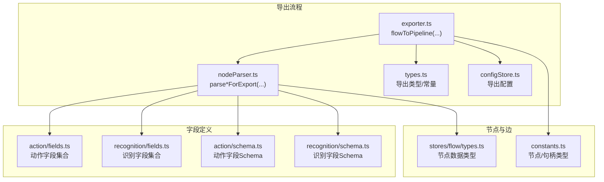
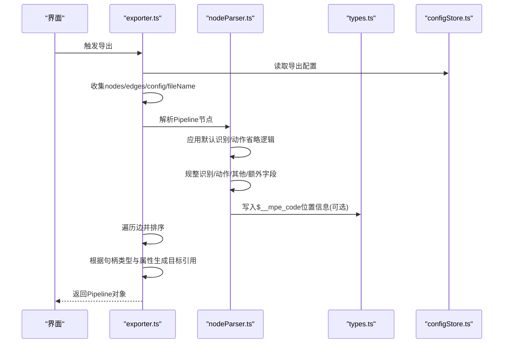
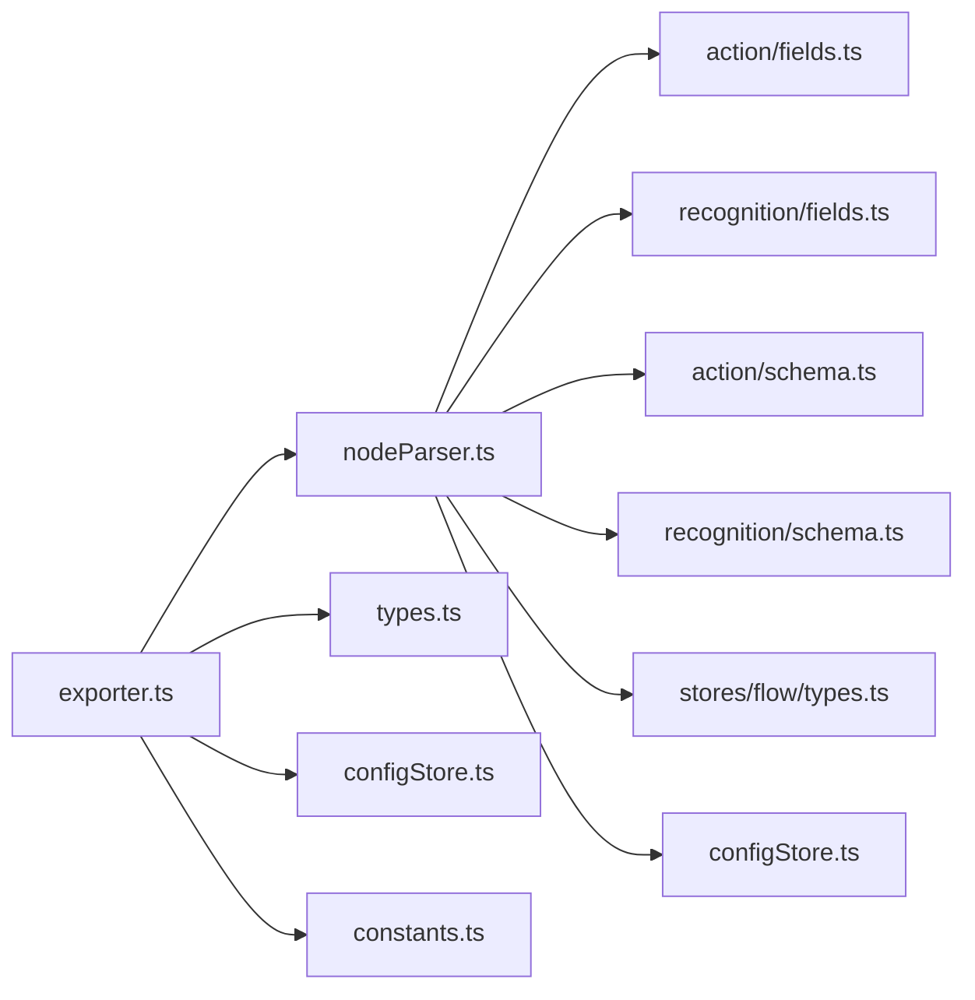

# 节点属性导出格式

<cite>
**本文引用的文件**
- [exporter.ts](file://src/core/parser/exporter.ts)
- [nodeParser.ts](file://src/core/parser/nodeParser.ts)
- [types.ts](file://src/core/parser/types.ts)
- [constants.ts](file://src/components/flow/nodes/constants.ts)
- [configStore.ts](file://src/stores/configStore.ts)
- [types.ts](file://src/stores/flow/types.ts)
- [index.tsx](file://src/components/flow/nodes/PipelineNode/index.tsx)
- [fields.ts](file://src/core/fields/action/fields.ts)
- [schema.ts](file://src/core/fields/action/schema.ts)
- [fields.ts](file://src/core/fields/recognition/fields.ts)
- [schema.ts](file://src/core/fields/recognition/schema.ts)
</cite>

## 更新摘要
**变更内容**
- 新增默认识别/动作省略功能的详细说明
- 更新节点解析部分以反映新的条件导出逻辑
- 增强导出配置与行为的说明
- 完善故障排查指南中的相关问题

## 目录
1. [简介](#简介)
2. [项目结构](#项目结构)
3. [核心组件](#核心组件)
4. [架构总览](#架构总览)
5. [详细组件分析](#详细组件分析)
6. [依赖分析](#依赖分析)
7. [性能考量](#性能考量)
8. [故障排查指南](#故障排查指南)
9. [结论](#结论)
10. [附录](#附录)

## 简介
本文档聚焦于"节点属性导出格式"，系统阐述编辑器如何将可视化画布上的节点与边转换为可序列化的流水线对象，并说明导出时节点属性的组织方式、字段映射规则、边连接的表达形式以及可配置的导出样式。特别关注新增的默认识别/动作省略功能，该功能允许用户控制是否导出DirectHit类型且无参数的识别字段，以及DoNothing类型且无参数的动作字段。读者无需深入代码即可理解导出产物的结构与用途。

## 项目结构
围绕节点属性导出的关键模块包括：
- 导出入口与流程控制：exporter.ts
- 节点解析与字段规整：nodeParser.ts
- 导出类型与标记常量：types.ts
- 节点类型与句柄类型：constants.ts
- 导出配置与样式开关：configStore.ts
- 节点数据结构与参数类型：stores/flow/types.ts
- 节点组件与展示：components/flow/nodes/PipelineNode/index.tsx
- 字段定义与校验：fields 与 schema（识别与动作）

**图表来源**
- [exporter.ts](file://src/core/parser/exporter.ts#L1-L150)
- [nodeParser.ts](file://src/core/parser/nodeParser.ts#L1-L220)
- [types.ts](file://src/core/parser/types.ts#L1-L79)
- [constants.ts](file://src/components/flow/nodes/constants.ts#L1-L14)
- [configStore.ts](file://src/stores/configStore.ts#L1-L107)
- [types.ts](file://src/stores/flow/types.ts#L1-L200)
- [fields.ts](file://src/core/fields/action/fields.ts#L1-L123)
- [schema.ts](file://src/core/fields/action/schema.ts#L1-L200)
- [fields.ts](file://src/core/fields/recognition/fields.ts#L1-L101)
- [schema.ts](file://src/core/fields/recognition/schema.ts#L1-L200)

**章节来源**
- [exporter.ts](file://src/core/parser/exporter.ts#L1-L150)
- [nodeParser.ts](file://src/core/parser/nodeParser.ts#L1-L220)
- [types.ts](file://src/core/parser/types.ts#L1-L79)
- [constants.ts](file://src/components/flow/nodes/constants.ts#L1-L14)
- [configStore.ts](file://src/stores/configStore.ts#L1-L107)
- [types.ts](file://src/stores/flow/types.ts#L1-L200)

## 核心组件
- 导出入口：将当前画布节点、边、文件名与配置整合，输出标准化的流水线对象。
- 节点解析：将识别、动作、其他参数与额外字段规整为导出格式，并按配置写入位置信息。**新增**：支持默认识别/动作省略功能，根据exportDefaultRecoAction配置决定是否导出DirectHit类型且无参数的识别字段，以及DoNothing类型且无参数的动作字段。
- 边解析：根据边的源句柄类型与属性，决定目标引用的表达形式（字符串、带前缀、对象）。
- 导出配置：控制是否导出配置、导出样式（对象/前缀）、节点标签前缀等。

**章节来源**
- [exporter.ts](file://src/core/parser/exporter.ts#L34-L149)
- [nodeParser.ts](file://src/core/parser/nodeParser.ts#L21-L76)
- [configStore.ts](file://src/stores/configStore.ts#L16-L41)

## 架构总览
导出流程从画布状态读取节点与边，依据节点类型与边属性生成目标引用，最终输出包含节点与可选配置的流水线对象。**新增**：在节点解析阶段应用默认识别/动作省略逻辑，根据配置决定是否省略默认的识别/动作字段。

**图表来源**
- [exporter.ts](file://src/core/parser/exporter.ts#L34-L149)
- [nodeParser.ts](file://src/core/parser/nodeParser.ts#L21-L76)
- [types.ts](file://src/core/parser/types.ts#L14-L36)
- [configStore.ts](file://src/stores/configStore.ts#L16-L41)

## 详细组件分析

### 导出入口 flowToPipeline
- 输入：可选覆盖的节点、边、文件名、配置；默认从全局状态读取。
- 节点生成：根据节点类型生成对象键名（Pipeline节点使用label，External/Anchor节点使用带前缀的键名）。
- 边链接：按源句柄类型（next/jump_back/on_error）写入目标引用；目标引用形式由导出样式配置决定。
- 配置导出：当开启导出配置时，将文件名、版本、前缀等写入以特定前缀命名的对象。

**章节来源**
- [exporter.ts](file://src/core/parser/exporter.ts#L34-L149)

### 节点解析 parsePipelineNodeForExport
- 识别字段：读取识别类型与参数，按字段Schema进行类型匹配与规整。
- 动作字段：读取动作类型与参数，同样按字段Schema进行类型匹配与规整。
- **新增**：默认识别/动作省略逻辑：
  - 当exportDefaultRecoAction配置为true时，无论是否为默认类型都导出
  - 当exportDefaultRecoAction配置为false时，省略以下默认字段：
    - DirectHit类型且无参数的识别字段
    - DoNothing类型且无参数的动作字段
- 其他参数与额外字段：将others与extras合并到节点对象。
- 位置信息：当开启导出配置时，写入$__mpe_code标记及其position。

**章节来源**
- [nodeParser.ts](file://src/core/parser/nodeParser.ts#L21-L76)
- [nodeParser.ts](file://src/core/parser/nodeParser.ts#L76-L91)

### 边解析与目标引用
- 排序：按源节点分组并对标签进行排序，确保输出稳定。
- 目标引用形式：
  - 当目标为锚点或边属性含jump_back时，依据导出样式生成：
    - 对象形式：包含name、anchor、jump_back等属性。
    - 前缀形式：在名称前拼接"[Anchor]"、"[JumpBack]"等标记。
  - 普通边：直接使用节点label作为字符串引用。
- 连接类型：next、on_error等句柄类型作为键写入目标数组。

**章节来源**
- [exporter.ts](file://src/core/parser/exporter.ts#L71-L126)
- [constants.ts](file://src/components/flow/nodes/constants.ts#L1-L14)

### 导出配置与样式
- 导出样式：object/prefix两种形式，影响目标引用的表达。
- 导出配置：是否导出节点位置信息、是否导出文件配置等。
- **新增**：exportDefaultRecoAction配置项，控制是否导出默认识别/动作字段。
- 文件配置：导出时写入filename、version、prefix等元信息。

**章节来源**
- [configStore.ts](file://src/stores/configStore.ts#L16-L41)
- [configStore.ts](file://src/stores/configStore.ts#L62-L106)
- [configStore.ts](file://src/stores/configStore.ts#L96-L152)
- [types.ts](file://src/core/parser/types.ts#L14-L36)

### 字段类型与参数映射
- 字段类型：通过字段Schema定义键、类型、默认值、可选项等。
- 参数键映射：根据字段集合生成all、requires、required_default三类映射，用于参数校验与补全。
- 大小写映射：将字段集合的键转换为大写形式，便于兼容大小写差异。

**章节来源**
- [schema.ts](file://src/core/fields/action/schema.ts#L1-L200)
- [fields.ts](file://src/core/fields/action/fields.ts#L1-L123)
- [schema.ts](file://src/core/fields/recognition/schema.ts#L1-L200)
- [fields.ts](file://src/core/fields/recognition/fields.ts#L1-L101)
- [utils.ts](file://src/core/fields/utils.ts#L1-L41)
- [types.ts](file://src/core/fields/types.ts#L1-L32)

### 节点数据结构与参数类型
- 节点数据：包含label、识别类型与参数、动作类型与参数、others、extras等。
- 参数类型：识别参数、动作参数、其他参数的联合类型，确保字段合并与扩展。

**章节来源**
- [types.ts](file://src/stores/flow/types.ts#L42-L119)
- [types.ts](file://src/stores/flow/types.ts#L102-L119)

### 节点组件与导出一致性
- 组件渲染：根据节点样式（modern/classic）渲染内容，不影响导出结构。
- 导出一致性：导出时仅依赖节点数据结构，不依赖UI样式。

**章节来源**
- [index.tsx](file://src/components/flow/nodes/PipelineNode/index.tsx#L1-L77)

## 依赖分析
- 导出入口依赖：
  - 节点解析：将节点数据规整为导出格式。
  - 类型常量：使用句柄类型与标记常量。
  - 导出配置：控制导出行为与样式。
- 节点解析依赖：
  - 字段Schema与字段集合：保证参数类型正确与默认值补全。
  - JSON辅助：处理extras的字符串到对象转换。
  - 版本检测：规范化识别/动作类型。
  - **新增**：配置存储：读取exportDefaultRecoAction配置决定省略逻辑。

**图表来源**
- [exporter.ts](file://src/core/parser/exporter.ts#L1-L150)
- [nodeParser.ts](file://src/core/parser/nodeParser.ts#L1-L220)
- [types.ts](file://src/core/parser/types.ts#L1-L79)
- [constants.ts](file://src/components/flow/nodes/constants.ts#L1-L14)
- [configStore.ts](file://src/stores/configStore.ts#L1-L107)
- [fields.ts](file://src/core/fields/action/fields.ts#L1-L123)
- [schema.ts](file://src/core/fields/action/schema.ts#L1-L200)
- [fields.ts](file://src/core/fields/recognition/fields.ts#L1-L101)
- [schema.ts](file://src/core/fields/recognition/schema.ts#L1-L200)
- [types.ts](file://src/stores/flow/types.ts#L1-L200)

## 性能考量
- 导出过程涉及遍历节点与边、排序与字符串/对象拼接，整体复杂度近似O(N+E)，N为节点数，E为边数。
- 字段匹配与参数规整依赖字段集合与Schema，建议保持字段集合稳定以减少重复计算。
- 导出配置开关可避免不必要的位置信息写入，降低输出体积。
- **新增**：默认识别/动作省略功能通过简单的类型和参数检查实现，对性能影响微乎其微。

## 故障排查指南
- 导出失败提示：导出异常时会弹出错误通知并打印控制台错误，建议检查节点字段是否符合Schema定义。
- **新增**：默认识别/动作省略相关问题：
  - 导出结果缺少DirectHit识别字段：检查exportDefaultRecoAction配置是否为false
  - 导出结果缺少DoNothing动作字段：检查exportDefaultRecoAction配置是否为false
  - 默认字段被意外省略：将exportDefaultRecoAction配置切换为true
- 常见问题：
  - 缺少必填参数：根据字段Schema的required标记补齐。
  - 类型不匹配：根据字段Schema的type标记修正参数类型。
  - 未知字段：将额外字段放入extras，或确认字段是否属于识别/动作/其他范畴。
  - 目标引用异常：检查边的源句柄类型与目标节点是否存在，锚点/回跳属性是否正确设置。

**章节来源**
- [exporter.ts](file://src/core/parser/exporter.ts#L130-L149)

## 结论
节点属性导出格式以标准化的流水线对象为核心，通过节点解析与边解析将可视化数据转换为可序列化结构。**新增**的默认识别/动作省略功能提供了更精细的导出控制，允许用户根据需要选择导出或省略默认的DirectHit识别字段和DoNothing动作字段。导出样式与配置可通过设置灵活控制，既满足简洁字符串引用，也支持携带属性的详细对象形式。字段Schema与参数映射确保了导出的一致性与可维护性。

## 附录

### 导出产物结构要点
- 节点对象键名：
  - Pipeline节点：使用节点label作为键。
  - External节点：使用"$__mpe_external_"前缀+label+"_"+fileName。
  - Anchor节点：使用"$__mpe_anchor_"前缀+label+"_"+fileName。
- 节点内容：
  - recognition：包含type与param。**新增**：当exportDefaultRecoAction为false且为DirectHit类型且无参数时省略。
  - action：包含type与param。**新增**：当exportDefaultRecoAction为false且为DoNothing类型且无参数时省略。
  - 其他参数与额外字段：合并到节点对象。
  - 位置信息：当开启导出配置时，写入$__mpe_code标记及其position。
- 边连接：
  - 键：next或on_error（受源句柄类型影响）。
  - 值：目标引用（字符串/对象/带前缀字符串）。

**章节来源**
- [exporter.ts](file://src/core/parser/exporter.ts#L34-L149)
- [nodeParser.ts](file://src/core/parser/nodeParser.ts#L21-L76)
- [types.ts](file://src/core/parser/types.ts#L14-L36)

### 默认识别/动作省略规则
- **适用条件**：当exportDefaultRecoAction配置为false时生效
- **省略规则**：
  - DirectHit类型且无参数的识别字段：省略recognition字段
  - DoNothing类型且无参数的动作字段：省略action字段
- **例外情况**：
  - exportDefaultRecoAction配置为true时：始终导出所有字段
  - 任何非默认类型的识别/动作字段：始终导出
  - 有参数的默认识别/动作字段：始终导出

**章节来源**
- [nodeParser.ts](file://src/core/parser/nodeParser.ts#L76-L91)
- [configStore.ts](file://src/stores/configStore.ts#L151-L152)