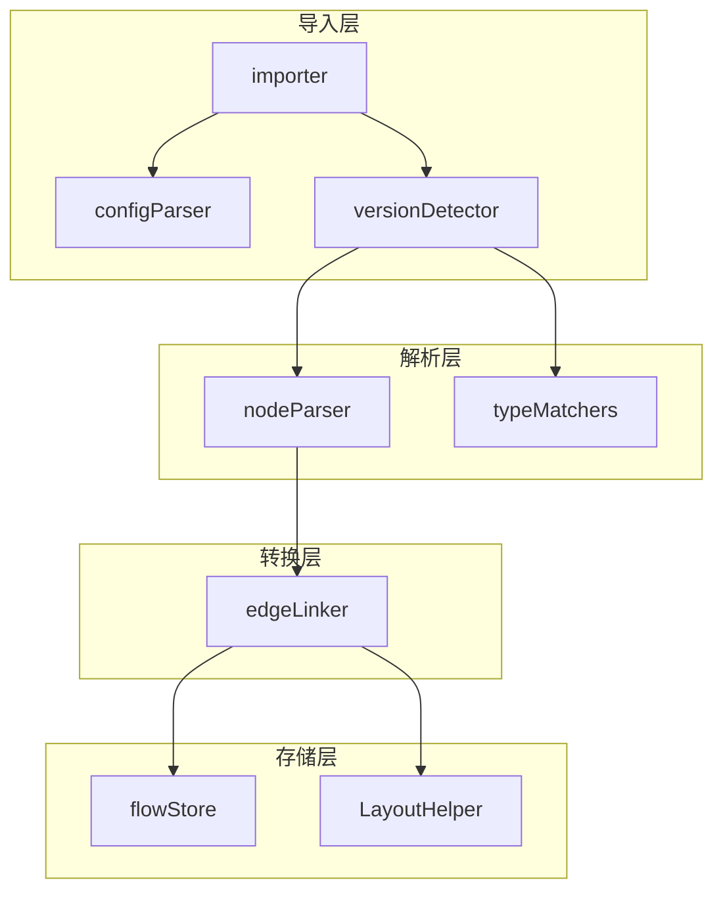
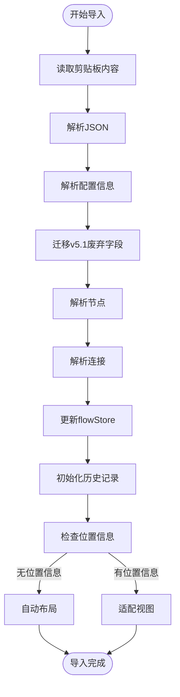
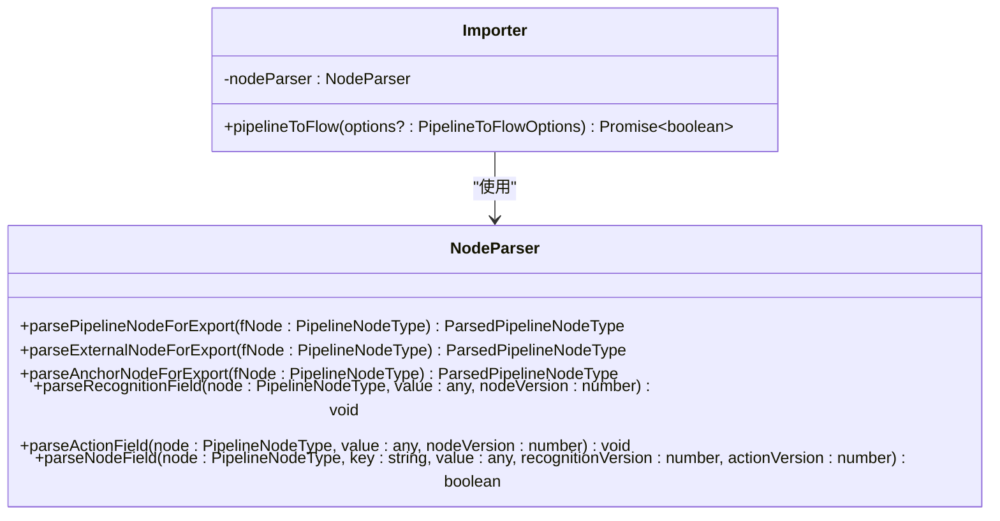
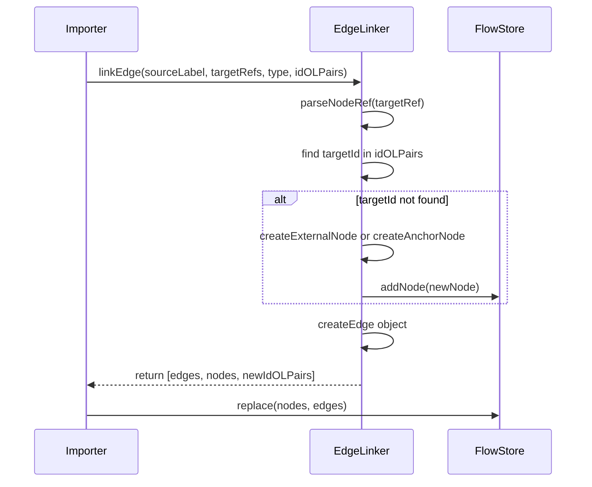
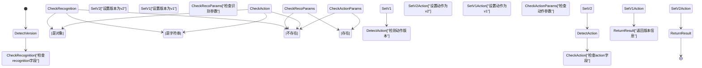
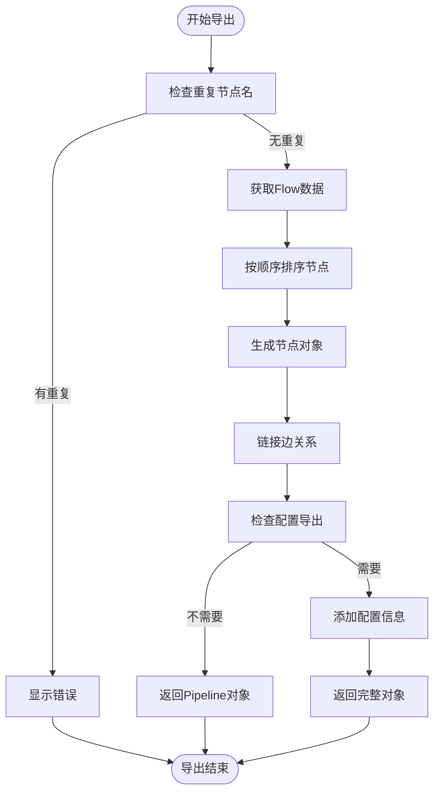
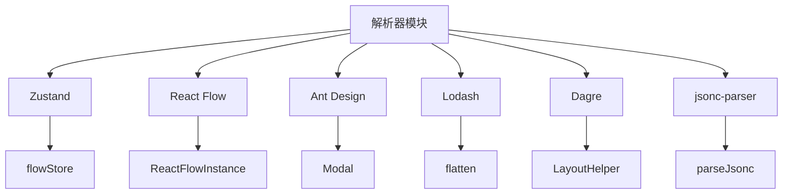

# 解析器

<cite>
**本文档引用的文件**
- [importer.ts](file://src/core/parser/importer.ts)
- [nodeParser.ts](file://src/core/parser/nodeParser.ts)
- [edgeLinker.ts](file://src/core/parser/edgeLinker.ts)
- [typeMatchers.ts](file://src/core/parser/typeMatchers.ts)
- [versionDetector.ts](file://src/core/parser/versionDetector.ts)
- [configParser.ts](file://src/core/parser/configParser.ts)
- [configSplitter.ts](file://src/core/parser/configSplitter.ts)
- [exporter.ts](file://src/core/parser/exporter.ts)
- [types.ts](file://src/core/parser/types.ts)
- [index.ts](file://src/core/parser/index.ts)
- [flow/index.ts](file://src/stores/flow/index.ts)
- [layout.ts](file://src/core/layout.ts)
- [configStore.ts](file://src/stores/configStore.ts)
</cite>

## 更新摘要
**变更内容**
- 新增默认识别/动作处理机制的详细说明
- 更新导出逻辑中关于exportDefaultRecoAction配置的处理
- 补充默认DirectHit识别和DoNothing动作的条件判断
- 增强导出配置的用户控制能力

## 目录
1. [简介](#简介)
2. [核心组件](#核心组件)
3. [架构概述](#架构概述)
4. [详细组件分析](#详细组件分析)
5. [依赖分析](#依赖分析)
6. [性能考虑](#性能考虑)
7. [故障排除指南](#故障排除指南)
8. [结论](#结论)

## 简介
MaaPipelineEditor的解析器模块负责将符合MaaFramework Pipeline协议的JSON配置文件转换为React Flow兼容的可视化流程图数据结构。该模块实现了双向转换功能，支持从可视化编辑器导出为Pipeline JSON格式，以及从JSON配置文件导入为可视化流程图。解析器采用模块化设计，包含版本检测、类型匹配、节点解析、边连接等多个子模块，确保了代码的可维护性和扩展性。

**更新** 新增了默认识别/动作处理机制，允许用户控制是否导出默认的DirectHit识别和DoNothing动作配置。

## 核心组件
解析器模块由多个核心组件构成，包括importer、nodeParser、edgeLinker、typeMatchers和versionDetector。这些组件协同工作，完成从原始JSON到nodes/edges状态对象的转换过程。importer负责整体导入流程的协调，nodeParser处理节点类型的识别和解析，edgeLinker重建节点间的连接关系，typeMatchers进行字段类型匹配判断，versionDetector识别不同版本的配置格式并进行兼容性处理。

**Section sources**
- [index.ts](file://src/core/parser/index.ts#L1-L73)

## 架构概述
解析器模块采用分层架构设计，各组件职责明确，通过清晰的接口进行通信。整体架构分为导入层、解析层、转换层和存储层。导入层负责读取和预处理JSON数据，解析层处理版本检测和类型匹配，转换层将数据转换为React Flow兼容的格式，存储层负责将结果注入Zustand状态管理系统。



**Diagram sources**
- [importer.ts](file://src/core/parser/importer.ts#L147-L399)
- [nodeParser.ts](file://src/core/parser/nodeParser.ts#L1-L273)
- [edgeLinker.ts](file://src/core/parser/edgeLinker.ts#L88-L158)
- [typeMatchers.ts](file://src/core/parser/typeMatchers.ts#L261-L301)
- [versionDetector.ts](file://src/core/parser/versionDetector.ts#L23-L32)

## 详细组件分析

### Importer分析
Importer组件是解析器的入口，负责协调整个导入流程。它首先通过ClipboardHelper读取JSON字符串，然后使用jsonc-parser进行解析。接着调用configParser提取配置信息，通过versionDetector进行版本兼容性处理，最后依次调用nodeParser和edgeLinker完成节点和边的解析。

#### Importer流程图


**Diagram sources**
- [importer.ts](file://src/core/parser/importer.ts#L147-L399)

**Section sources**
- [importer.ts](file://src/core/parser/importer.ts#L1-L399)

### NodeParser分析
NodeParser组件负责节点类型的识别和解析。它根据节点的键名前缀判断节点类型，支持Pipeline节点、外部节点和锚点节点。对于Pipeline节点，它会解析识别算法、动作类型和其他参数；对于外部节点，它会提取引用的文件名和节点名。

**更新** 新增了默认识别/动作处理机制，在导出时根据exportDefaultRecoAction配置决定是否包含默认的DirectHit识别和DoNothing动作。

#### NodeParser类图


**Diagram sources**
- [nodeParser.ts](file://src/core/parser/nodeParser.ts#L21-L273)

**Section sources**
- [nodeParser.ts](file://src/core/parser/nodeParser.ts#L1-L273)

### EdgeLinker分析
EdgeLinker组件负责重建节点间的连接关系。它支持两种连接类型：正常连接和错误连接。对于每个连接，它会解析目标节点的引用，如果目标节点不存在，则自动创建外部节点或锚点节点。EdgeLinker还支持连接属性，如跳回和锚点。

#### EdgeLinker序列图


**Diagram sources**
- [edgeLinker.ts](file://src/core/parser/edgeLinker.ts#L88-L158)

**Section sources**
- [edgeLinker.ts](file://src/core/parser/edgeLinker.ts#L1-L159)

### TypeMatchers分析
TypeMatchers组件负责字段类型匹配判断。它定义了一套类型匹配规则，支持多种数据类型，包括整型、浮点数、布尔值、字符串、数组等。对于每个字段，它会尝试所有可能的类型匹配，直到找到合适的类型或返回null。

#### TypeMatchers数据流图
```mermaid
flowchart TD
Start([开始类型匹配]) --> GetParamKeys["获取参数键列表"]
GetParamKeys --> LoopKeys["遍历每个键"]
LoopKeys --> FindType["查找预定义类型"]
alt 类型未定义
FindType --> KeepOriginal["保留原始值"]
KeepOriginal --> NextKey
end
alt 类型已定义
FindType --> MatchTypes["尝试所有可能的类型"]
MatchTypes --> LoopTypes["遍历每种类型"]
LoopTypes --> MatchSingle["matchSingleType(value, type)"]
MatchSingle --> |匹配成功| SetMatchedValue["设置匹配值"]
MatchSingle --> |匹配失败| ContinueLoop["继续尝试"]
ContinueLoop --> LoopTypes
SetMatchedValue --> NextKey
end
NextKey --> |还有键| LoopKeys
NextKey --> |无更多键| ReturnResult["返回匹配结果"]
ReturnResult --> End([结束])
```

**Diagram sources**
- [typeMatchers.ts](file://src/core/parser/typeMatchers.ts#L261-L301)

**Section sources**
- [typeMatchers.ts](file://src/core/parser/typeMatchers.ts#L1-L302)

### VersionDetector分析
VersionDetector组件负责识别不同版本的配置格式并进行兼容性处理。它支持两种版本的识别算法和动作类型：v1版本使用字符串表示，v2版本使用对象表示。通过检测字段的存在和类型，它可以准确判断配置的版本。

#### VersionDetector状态图


**Diagram sources**
- [versionDetector.ts](file://src/core/parser/versionDetector.ts#L23-L32)

**Section sources**
- [versionDetector.ts](file://src/core/parser/versionDetector.ts#L1-L149)

### Exporter分析
Exporter组件负责将Flow数据转换为Pipeline格式。它处理节点导出、边连接重建、配置导出等功能。**新增**了默认识别/动作处理机制，根据exportDefaultRecoAction配置决定是否导出默认的DirectHit识别和DoNothing动作。

#### Exporter流程图


**Diagram sources**
- [exporter.ts](file://src/core/parser/exporter.ts#L38-L196)

**Section sources**
- [exporter.ts](file://src/core/parser/exporter.ts#L1-L228)

## 依赖分析
解析器模块依赖于多个外部组件和内部模块。它依赖于Zustand状态管理系统来存储和管理流程图数据，依赖于React Flow库来实现可视化功能，依赖于Ant Design组件库来提供用户界面。内部模块之间通过清晰的接口进行通信，确保了代码的可维护性和扩展性。



**Diagram sources**
- [importer.ts](file://src/core/parser/importer.ts#L1-L2)
- [typeMatchers.ts](file://src/core/parser/typeMatchers.ts#L2)
- [layout.ts](file://src/core/layout.ts#L2)
- [flow/index.ts](file://src/stores/flow/index.ts#L1)

**Section sources**
- [importer.ts](file://src/core/parser/importer.ts#L1-L399)
- [typeMatchers.ts](file://src/core/parser/typeMatchers.ts#L1-L302)
- [layout.ts](file://src/core/layout.ts#L1-L103)
- [flow/index.ts](file://src/stores/flow/index.ts#L1-L101)

## 性能考虑
解析器模块在性能方面进行了多项优化。首先，它使用requestAnimationFrame来避免阻塞主线程，确保用户界面的流畅性。其次，它采用延迟布局策略，只有在节点测量完成后才执行布局计算。此外，它还实现了自动去抖机制，避免频繁的状态更新。

## 故障排除指南
解析器模块提供了完善的错误处理机制。当遇到无效JSON或字段类型不匹配时，它会显示相应的错误提示。对于版本不兼容的情况，它会尝试进行自动迁移。开发者可以通过查看控制台日志来获取详细的错误信息。

**Section sources**
- [importer.ts](file://src/core/parser/importer.ts#L389-L397)
- [typeMatchers.ts](file://src/core/parser/typeMatchers.ts#L292-L297)

## 结论
MaaPipelineEditor的解析器模块是一个功能强大且设计精良的组件，它成功地实现了JSON配置文件与可视化流程图之间的双向转换。通过模块化设计和清晰的接口定义，它确保了代码的可维护性和扩展性。该模块不仅支持多种版本的配置格式，还提供了完善的错误处理和用户体验优化，是MaaPipelineEditor的核心组件之一。

**更新** 新增的默认识别/动作处理机制进一步增强了导出功能的灵活性，用户可以根据需要选择是否导出默认的DirectHit识别和DoNothing动作配置，提高了配置文件的简洁性和可读性。