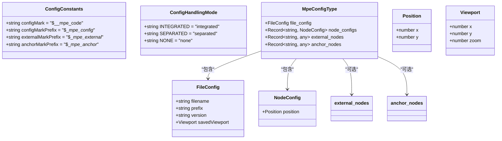
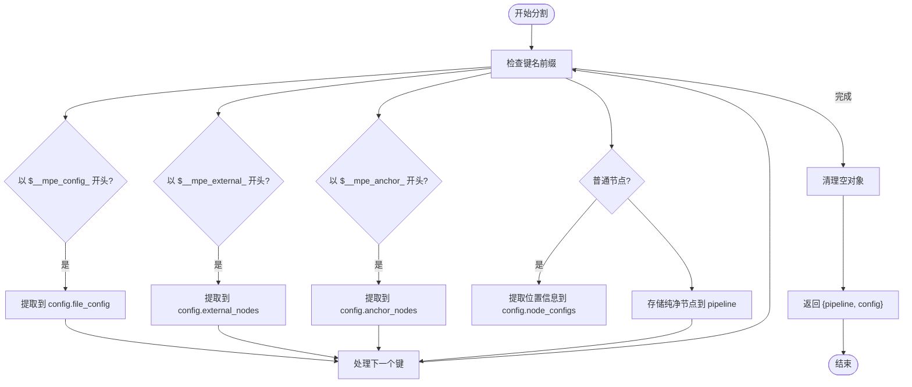
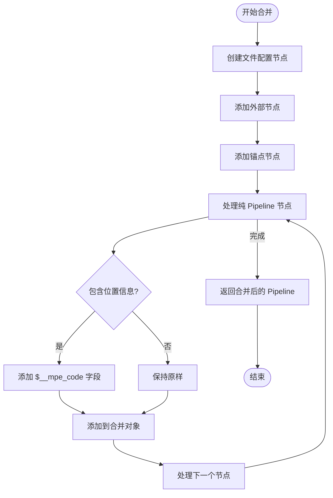
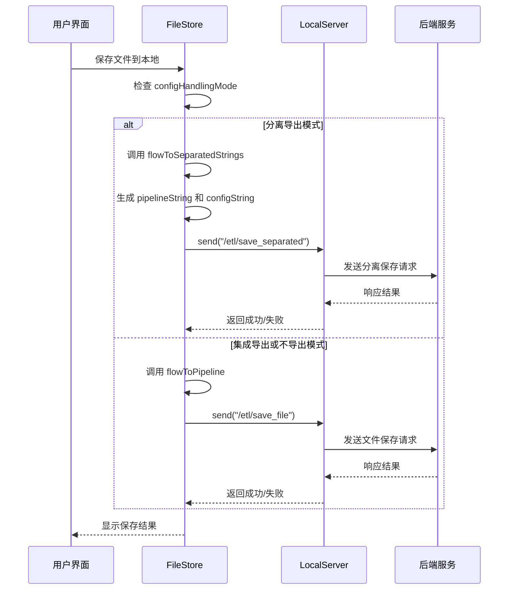

# 配置分割与合并

<cite>
**本文档引用文件**  
- [configSplitter.ts](file://src/core/parser/configSplitter.ts)
- [configParser.ts](file://src/core/parser/configParser.ts)
- [exporter.ts](file://src/core/parser/exporter.ts)
- [importer.ts](file://src/core/parser/importer.ts)
- [types.ts](file://src/core/parser/types.ts)
- [configStore.ts](file://src/stores/configStore.ts)
- [fileStore.ts](file://src/stores/fileStore.ts)
- [ConfigPanel.tsx](file://src/components/panels/ConfigPanel.tsx)
- [server.ts](file://src/services/server.ts)
- [ConfigProtocol.ts](file://src/services/protocols/ConfigProtocol.ts)
</cite>

## 目录
1. [简介](#简介)
2. [配置处理模式](#配置处理模式)
3. [核心机制](#核心机制)
4. [配置分割](#配置分割)
5. [配置合并](#配置合并)
6. [文件命名规则](#文件命名规则)
7. [用户界面配置](#用户界面配置)
8. [后端通信协议](#后端通信协议)
9. [工作流程](#工作流程)

## 简介
MaaPipelineEditor 提供了灵活的配置管理机制，支持将 Pipeline 配置信息以不同方式存储。系统实现了配置的分割与合并功能，允许用户选择将配置信息嵌入主文件或分离到独立的配置文件中。这种设计既满足了单文件分享的便捷性，又支持了版本控制环境下的配置管理需求。

## 配置处理模式
系统提供了三种配置处理模式，用户可以在设置面板中进行选择：

- **集成导出**：配置信息嵌入到 Pipeline JSON 文件中，适合单文件分享和传输
- **分离导出**：配置信息存储到独立的 `.mpe.json` 文件中，便于版本管理和团队协作
- **不导出**：不保存任何配置信息，每次导入时触发自动布局

这些模式通过 `configHandlingMode` 配置项进行管理，其类型定义为 `ConfigHandlingMode`，包含 `"integrated"`、`"separated"` 和 `"none"` 三种取值。

**Section sources**
- [configStore.ts](file://src/stores/configStore.ts#L23)
- [ConfigPanel.tsx](file://src/components/panels/ConfigPanel.tsx#L364-L391)

## 核心机制
配置分割与合并的核心机制基于特定的标记前缀来识别和处理不同类型的配置信息。系统定义了多个常量来标识这些特殊字段：

- `configMark`：`$__mpe_code`，用于标记节点的位置信息
- `configMarkPrefix`：`$__mpe_config_`，用于标识文件配置节点
- `externalMarkPrefix`：`$__mpe_external_`，用于标识外部节点
- `anchorMarkPrefix`：`$__mpe_anchor_`，用于标识锚点节点

这些标记在配置的分割和合并过程中起着关键作用，确保不同类型的信息能够被正确识别和处理。

**Diagram sources**
- [types.ts](file://src/core/parser/types.ts#L15-L18)
- [types.ts](file://src/core/parser/types.ts#L55-L67)
- [fileStore.ts](file://src/stores/fileStore.ts#L10-L22)

## 配置分割
配置分割功能将完整的 Pipeline 对象拆分为纯 Pipeline 数据和独立的配置对象。这一过程由 `splitPipelineAndConfig` 函数实现，该函数接收包含配置的完整 Pipeline 对象，并返回一个包含 `pipeline` 和 `config` 两个属性的对象。

分割过程遵循以下规则：
1. 以 `configMarkPrefix` 开头的键被视为文件配置节点，其内容被提取到 `config.file_config` 中
2. 以 `externalMarkPrefix` 开头的键被视为外部节点，其内容被提取到 `config.external_nodes` 中
3. 以 `anchorMarkPrefix` 开头的键被视为锚点节点，其内容被提取到 `config.anchor_nodes` 中
4. 普通节点中的 `configMark` 字段（包含位置信息）被提取到 `config.node_configs` 中，其余部分保留在纯 Pipeline 对象中

**Diagram sources**
- [configSplitter.ts](file://src/core/parser/configSplitter.ts#L19-L83)

## 配置合并
配置合并功能将分离的 Pipeline 数据和配置对象重新组合成完整的 Pipeline 对象。这一过程由 `mergePipelineAndConfig` 函数实现，该函数接收纯 Pipeline 对象、配置对象和可选的文件名参数，返回合并后的完整 Pipeline 对象。

合并过程遵循以下规则：
1. 创建以 `configMarkPrefix` 和文件名组成的键，将 `config.file_config` 内容作为文件配置节点添加
2. 遍历 `config.external_nodes`，为每个外部节点创建以 `externalMarkPrefix`、节点名和文件名组成的键，并添加相应数据
3. 遍历 `config.anchor_nodes`，为每个锚点节点创建以 `anchorMarkPrefix`、节点名和文件名组成的键，并添加相应数据
4. 遍历纯 Pipeline 对象，为包含位置信息的节点添加 `configMark` 字段

**Diagram sources**
- [configSplitter.ts](file://src/core/parser/configSplitter.ts#L93-L136)

## 文件命名规则
系统定义了标准的文件命名规则，以确保配置文件与主文件之间的正确关联：

- **主文件**：通常为 `.json` 或 `.jsonc` 格式的 Pipeline 文件，如 `my_task.json`
- **配置文件**：通过 `getConfigFileName` 函数生成，格式为 `.{basename}.mpe.json`，如 `.my_task.mpe.json`

当从配置文件名推导主文件名时，使用 `getPipelineFileNameFromConfig` 函数，该函数会移除开头的点号和 `.mpe.json` 后缀。

**Diagram sources**
- [configSplitter.ts](file://src/core/parser/configSplitter.ts#L144-L158)

## 用户界面配置
用户可以通过配置面板（ConfigPanel）直观地管理配置处理模式和其他相关设置。配置面板提供了以下与配置管理相关的选项：

- **配置处理方案**：下拉菜单选择集成导出、分离导出或不导出
- **节点前缀**：为所有节点添加统一前缀，防止跨文件节点名冲突
- **文件路径**：指定本地 JSON 文件的完整路径，用于与本地服务通信
- **分离配置路径**：在文件配置中存储分离配置文件的路径

配置面板的更改会实时更新 `configStore` 中的状态，并通过 `setConfig` 方法持久化。

**Section sources**
- [ConfigPanel.tsx](file://src/components/panels/ConfigPanel.tsx#L364-L391)
- [configStore.ts](file://src/stores/configStore.ts#L31)

## 后端通信协议
系统通过 WebSocket 与后端服务通信，实现配置文件的保存和加载。相关的通信协议定义在 `ConfigProtocol` 类中：

- **保存分离配置**：发送到 `/etl/save_separated` 路由，包含 `pipeline_path`、`config_path`、`pipeline` 和 `config` 参数
- **保存文件**：发送到 `/etl/save_file` 路由，包含 `file_path` 和 `content` 参数

当用户选择分离导出模式并保存文件时，前端会通过 `localServer.send` 方法调用相应的后端接口，将 Pipeline 数据和配置数据分别保存到指定路径。

**Diagram sources**
- [fileStore.ts](file://src/stores/fileStore.ts#L474-L532)
- [server.ts](file://src/services/server.ts#L220-L233)
- [ConfigProtocol.ts](file://src/services/protocols/ConfigProtocol.ts)

## 工作流程
配置分割与合并的工作流程贯穿于文件的导入、编辑和导出过程：

1. **导入文件**：当导入一个 Pipeline 文件时，系统会检查是否存在对应的 `.mpe.json` 配置文件。如果存在，会调用 `mergePipelineAndConfig` 将两者合并，恢复完整的编辑状态。

2. **编辑过程**：在编辑过程中，所有配置信息（如节点位置、视口状态等）都存储在内存中的 `fileStore` 和 `configStore` 中，用户界面实时反映这些状态。

3. **导出文件**：当导出文件时，系统根据 `configHandlingMode` 设置决定导出方式：
   - 集成导出：调用 `flowToPipeline` 生成包含配置的完整 Pipeline 对象
   - 分离导出：调用 `flowToSeparatedStrings` 生成分离的 Pipeline 和配置字符串
   - 不导出：调用 `flowToPipeline` 但不包含配置信息

4. **保存文件**：保存操作会根据配置模式调用相应的后端接口，将数据持久化到文件系统。

这一完整的工作流程确保了配置信息的一致性和可靠性，为用户提供灵活而强大的配置管理能力。

**Section sources**
- [importer.ts](file://src/core/parser/importer.ts#L147-L387)
- [exporter.ts](file://src/core/parser/exporter.ts#L37-L220)
- [fileStore.ts](file://src/stores/fileStore.ts#L449-L537)