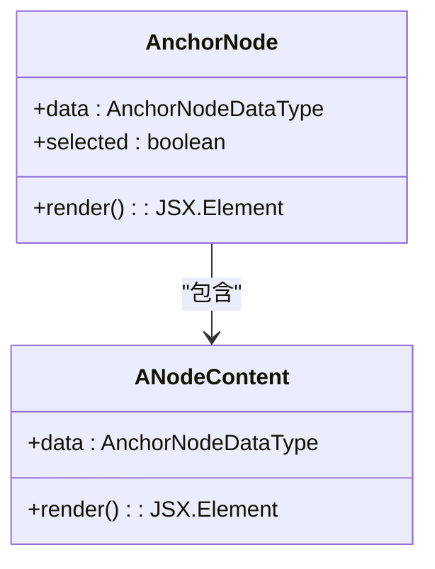
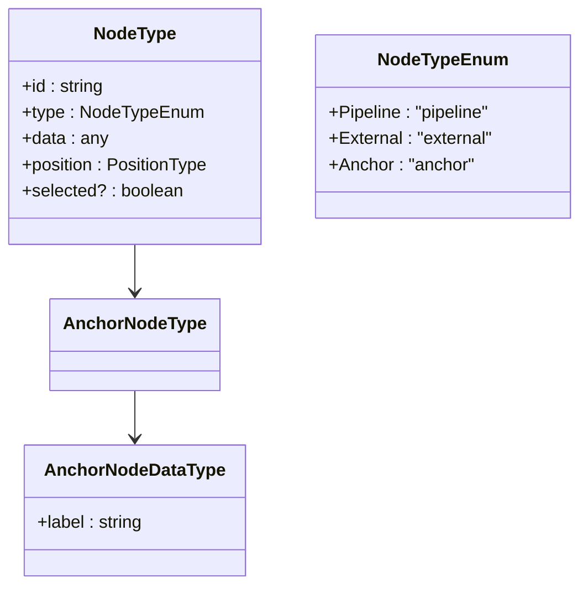
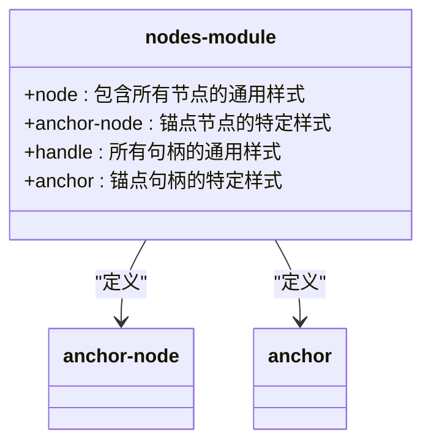
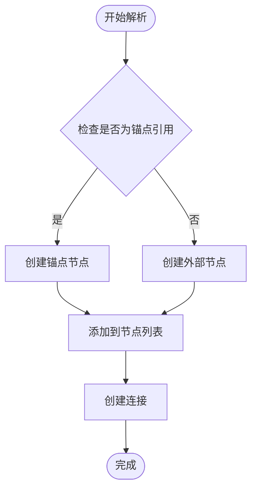
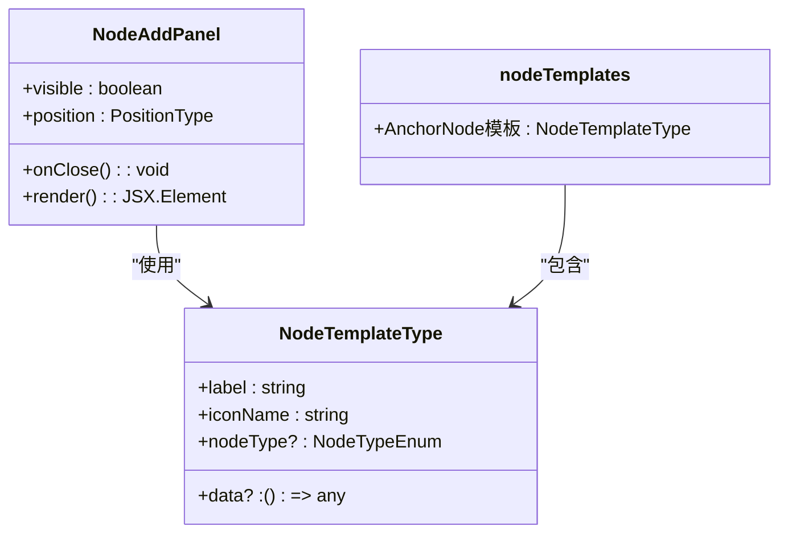
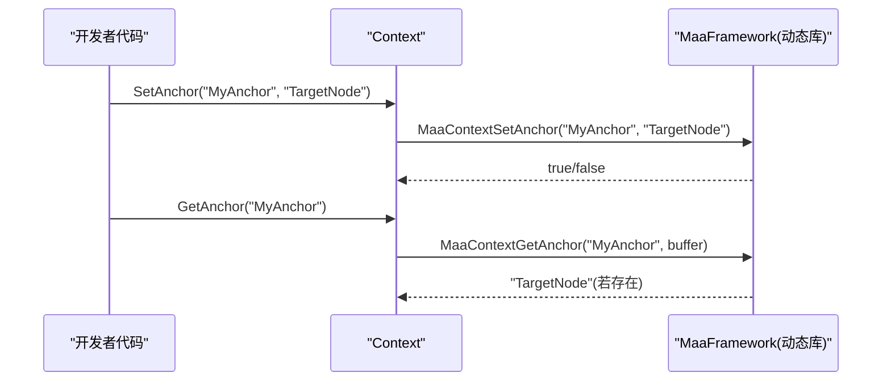

# 锚点节点支持

<cite>
**本文档引用的文件**
- [AnchorNode.tsx](file://src\components\flow\nodes\AnchorNode.tsx)
- [constants.ts](file://src\components\flow\nodes\constants.ts)
- [utils.ts](file://src\components\flow\nodes\utils.ts)
- [types.ts](file://src\stores\flow\types.ts)
- [nodes.module.less](file://src\styles\nodes.module.less)
- [edgeLinker.ts](file://src\core\parser\edgeLinker.ts)
- [nodeTemplates.ts](file://src\data\nodeTemplates.ts)
- [NodeAddPanel.tsx](file://src\components\panels\NodeAddPanel.tsx)
- [锚点引用系统.md](file://instructions\maafw-golang\高级功能\流水线配置\流程控制机制\锚点引用系统.md)
- [3.1-任务流水线协议.md](file://instructions\maafw-pipeline\3.1-任务流水线协议.md)
</cite>

## 目录
1. [简介](#简介)
2. [核心概念](#核心概念)
3. [前端实现](#前端实现)
4. [节点类型与数据结构](#节点类型与数据结构)
5. [样式与视觉设计](#样式与视觉设计)
6. [解析与连接逻辑](#解析与连接逻辑)
7. [模板与添加面板](#模板与添加面板)
8. [后端锚点系统](#后端锚点系统)
9. [使用场景与最佳实践](#使用场景与最佳实践)
10. [故障排查指南](#故障排查指南)

## 简介
锚点节点支持是MaaPipelineEditor中的一个重要功能，它允许用户创建特殊的重定向节点，用于在复杂的自动化流程中实现灵活的跳转和引用。这种机制特别适用于需要模块化设计、动态流程调整和跨流程调用的场景。本文档将全面介绍锚点节点在前端和后端的实现细节、使用方法以及最佳实践。

## 核心概念
锚点节点（Anchor Node）是一种特殊类型的节点，其主要功能是作为流程中的重定向点。当其他节点引用一个锚点时，它们实际上是在引用最近一次设置该锚点的节点。这种机制允许开发者在不改变原有节点结构的情况下，动态地调整流程的执行路径。

锚点系统的核心思想是将"位置"与"引用"分离。一个节点可以被标记为某个锚点，而其他节点则可以通过锚点名称来引用这个位置。这使得流程设计更加灵活，特别是在处理复杂的条件分支和循环结构时。

**Section sources**
- [锚点引用系统.md](file://instructions\maafw-golang\高级功能\流水线配置\流程控制机制\锚点引用系统.md)
- [3.1-任务流水线协议.md](file://instructions\maafw-pipeline\3.1-任务流水线协议.md)

## 前端实现
锚点节点的前端实现主要位于`src/components/flow/nodes/AnchorNode.tsx`文件中。该组件使用React和@xyflow/react库来构建可视化节点。锚点节点包含一个标题和一个目标句柄（target handle），这个句柄位于节点的左侧，用于接收来自其他节点的连接。

**Diagram sources**
- [AnchorNode.tsx](file://src\components\flow\nodes\AnchorNode.tsx)

**Section sources**
- [AnchorNode.tsx](file://src\components\flow\nodes\AnchorNode.tsx)

## 节点类型与数据结构
锚点节点的数据结构定义在`src/stores/flow/types.ts`文件中。`AnchorNodeDataType`接口仅包含一个`label`属性，用于显示节点的标签。`AnchorNodeType`接口则扩展了基本的节点属性，包括ID、类型、数据和位置信息。

**Diagram sources**
- [types.ts](file://src\stores\flow\types.ts)
- [constants.ts](file://src\components\flow\nodes\constants.ts)

**Section sources**
- [types.ts](file://src\stores\flow\types.ts)
- [constants.ts](file://src\components\flow\nodes\constants.ts)

## 样式与视觉设计
锚点节点的视觉设计通过CSS模块化的方式实现，相关样式定义在`src/styles/nodes.module.less`文件中。锚点节点具有独特的绿色背景色（#4a9d8e），以区别于其他类型的节点。节点内部的句柄也有专门的样式定义，锚点句柄的背景色为深绿色（#2e8b7a）。

**Diagram sources**
- [nodes.module.less](file://src\styles\nodes.module.less)

**Section sources**
- [nodes.module.less](file://src\styles\nodes.module.less)

## 解析与连接逻辑
锚点节点的解析和连接逻辑主要在`src/core/parser/edgeLinker.ts`文件中实现。当解析器遇到一个带有`anchor`属性的节点引用时，它会创建一个锚点节点而不是普通的外部节点。这个过程确保了锚点引用能够正确地在流程图中表示。

**Diagram sources**
- [edgeLinker.ts](file://src\core\parser\edgeLinker.ts)

**Section sources**
- [edgeLinker.ts](file://src\core\parser\edgeLinker.ts)

## 模板与添加面板
锚点节点可以通过节点添加面板方便地添加到流程图中。相关的模板定义在`src/data/nodeTemplates.ts`文件中，而添加面板的实现则位于`src/components/panels/NodeAddPanel.tsx`文件中。在添加面板中，锚点节点被标记为"重定向节点 (Anchor)"，并配有特定的图标。

**Diagram sources**
- [NodeAddPanel.tsx](file://src\components\panels\NodeAddPanel.tsx)
- [nodeTemplates.ts](file://src\data\nodeTemplates.ts)

**Section sources**
- [NodeAddPanel.tsx](file://src\components\panels\NodeAddPanel.tsx)
- [nodeTemplates.ts](file://src\data\nodeTemplates.ts)

## 后端锚点系统
锚点系统的后端实现基于MaaFramework的流水线配置协议。根据`instructions/maafw-golang/高级功能/流水线配置/流程控制机制/锚点引用系统.md`文档，锚点系统通过"节点锚点集合 + 下一跳锚点引用 + 运行时锚点设置"的组合来实现动态跳转。

**Diagram sources**
- [锚点引用系统.md](file://instructions\maafw-golang\高级功能\流水线配置\流程控制机制\锚点引用系统.md)

**Section sources**
- [锚点引用系统.md](file://instructions\maafw-golang\高级功能\流水线配置\流程控制机制\锚点引用系统.md)

## 使用场景与最佳实践
锚点节点在多种场景下都非常有用。首先，在模块化设计中，可以将通用的流程片段（如登录、引导、设置）定义为独立节点，并在需要的地方设置锚点，以便其他流程复用。其次，在动态流程调整中，可以根据识别结果或外部条件，通过Context设置新的锚点，实现动态跳转。最后，在跨流程调用中，可以在不同任务之间共享同一锚点名，通过设置锚点实现跨任务的跳转与复用。

最佳实践包括：为每个锚点命名清晰、语义明确，避免歧义；在下一跳列表中显式标注锚点属性，确保解析逻辑清晰；使用任务详情与锚点查询进行调试，及时发现锚点未生效或解析失败的问题；避免在同一节点上重复设置相同锚点，保持锚点集合的唯一性与可维护性。

**Section sources**
- [锚点引用系统.md](file://instructions\maafw-golang\高级功能\流水线配置\流程控制机制\锚点引用系统.md)

## 故障排查指南
当锚点节点未能按预期工作时，可以按照以下步骤进行排查：首先，通过Context的GetAnchor查询锚点值，确认是否与预期一致；其次，检查下一跳列表，确保下一跳项正确设置了锚点属性，且锚点名与设置的锚点名一致；然后，使用Tasker获取任务详情，查看节点链路与状态，定位锚点跳转是否按预期发生；最后，参考现有的测试用例验证锚点行为，包括节点属性、锚点集合与下一跳项的增删改查。

**Section sources**
- [锚点引用系统.md](file://instructions\maafw-golang\高级功能\流水线配置\流程控制机制\锚点引用系统.md)