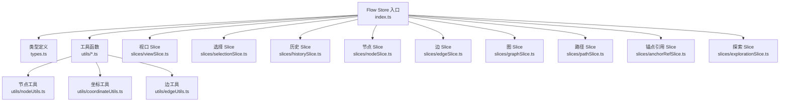
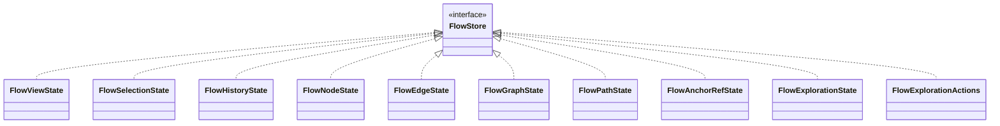
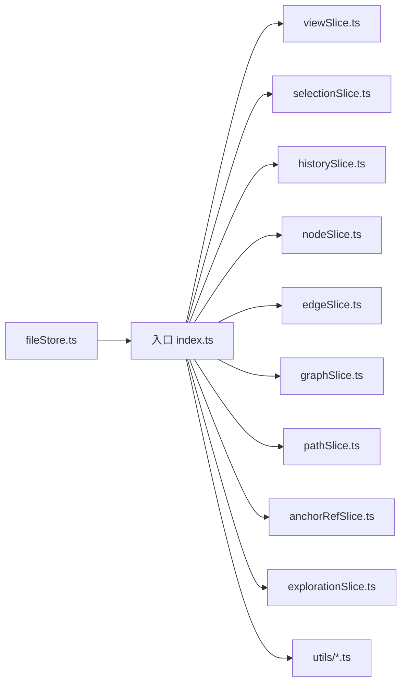
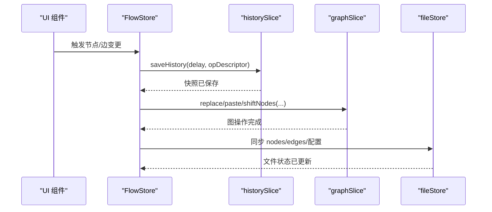
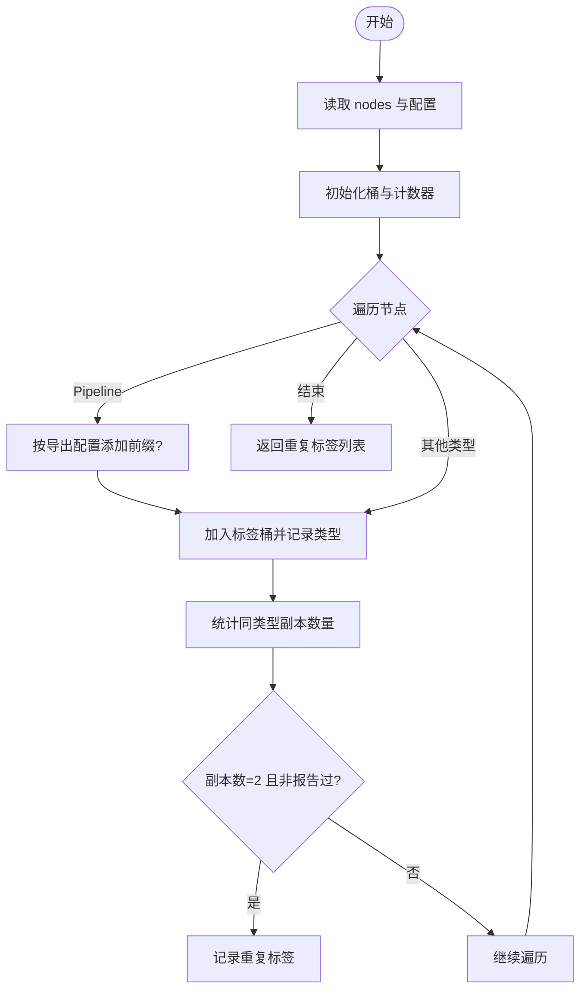
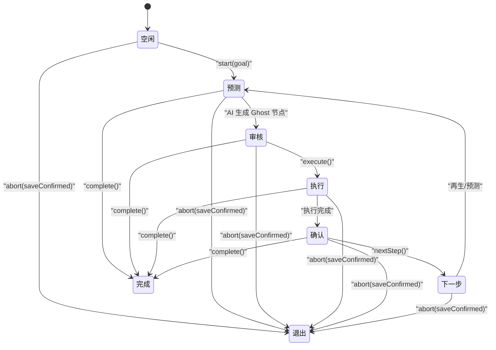

# Flow Store 核心状态

<cite>
**本文档引用的文件**
- [src/stores/flow/index.ts](file://src/stores/flow/index.ts)
- [src/stores/flow/types.ts](file://src/stores/flow/types.ts)
- [src/stores/flow/utils/nodeUtils.ts](file://src/stores/flow/utils/nodeUtils.ts)
- [src/stores/flow/utils/coordinateUtils.ts](file://src/stores/flow/utils/coordinateUtils.ts)
- [src/stores/flow/utils/edgeUtils.ts](file://src/stores/flow/utils/edgeUtils.ts)
- [src/stores/flow/slices/viewSlice.ts](file://src/stores/flow/slices/viewSlice.ts)
- [src/stores/flow/slices/selectionSlice.ts](file://src/stores/flow/slices/selectionSlice.ts)
- [src/stores/flow/slices/historySlice.ts](file://src/stores/flow/slices/historySlice.ts)
- [src/stores/flow/slices/nodeSlice.ts](file://src/stores/flow/slices/nodeSlice.ts)
- [src/stores/flow/slices/edgeSlice.ts](file://src/stores/flow/slices/edgeSlice.ts)
- [src/stores/flow/slices/graphSlice.ts](file://src/stores/flow/slices/graphSlice.ts)
- [src/stores/flow/slices/pathSlice.ts](file://src/stores/flow/slices/pathSlice.ts)
- [src/stores/flow/slices/anchorRefSlice.ts](file://src/stores/flow/slices/anchorRefSlice.ts)
- [src/stores/flow/slices/explorationSlice.ts](file://src/stores/flow/slices/explorationSlice.ts)
- [src/stores/fileStore.ts](file://src/stores/fileStore.ts)
</cite>

## 目录
1. [简介](#简介)
2. [项目结构](#项目结构)
3. [核心组件](#核心组件)
4. [架构总览](#架构总览)
5. [详细组件分析](#详细组件分析)
6. [依赖关系分析](#依赖关系分析)
7. [性能考量](#性能考量)
8. [故障排查指南](#故障排查指南)
9. [结论](#结论)
10. [附录](#附录)

## 简介
本文件系统性梳理 Flow Store 的整体架构与状态组织方式，聚焦于多 slice 的职责划分、数据结构与类型定义、状态更新与同步机制、工具函数使用方法，并提供扩展与自定义 slice 的实践指导，以及调试与性能优化建议。Flow Store 基于 Zustand 构建，采用“单仓多 slice”的组织方式，将视口、选择、历史、节点、边、图操作、路径、锚点引用、探索模式等能力模块化，统一暴露给 Flow 编辑器使用。

## 项目结构
Flow Store 的核心位于 src/stores/flow 目录，包含：
- 入口与聚合导出：index.ts
- 类型定义：types.ts
- 工具函数：utils/*（节点、坐标、边、视口等）
- Slice 实现：slices/*（view、selection、history、node、edge、graph、path、anchorRef、exploration）

图表来源
- [src/stores/flow/index.ts:1-82](file://src/stores/flow/index.ts#L1-L82)
- [src/stores/flow/types.ts:1-439](file://src/stores/flow/types.ts#L1-L439)
- [src/stores/flow/utils/nodeUtils.ts:1-339](file://src/stores/flow/utils/nodeUtils.ts#L1-L339)
- [src/stores/flow/utils/coordinateUtils.ts:1-199](file://src/stores/flow/utils/coordinateUtils.ts#L1-L199)
- [src/stores/flow/utils/edgeUtils.ts:1-32](file://src/stores/flow/utils/edgeUtils.ts#L1-L32)

章节来源
- [src/stores/flow/index.ts:1-82](file://src/stores/flow/index.ts#L1-L82)

## 核心组件
- FlowStore 类型：由多个 Slice 的状态与动作接口联合而成，统一对外暴露。
- Slice 职责：
  - viewSlice：维护 ReactFlow 实例、视口、画布尺寸等。
  - selectionSlice：维护选中节点/边、目标节点、防抖选中结果与超时管理。
  - historySlice：维护历史栈、撤销/重做、快照保存策略。
  - nodeSlice：维护节点列表、ID 计数器、节点增删改、分组/解组、批量更新。
  - edgeSlice：维护边列表、控制重置键、边增删改、标签与数据更新。
  - graphSlice：维护粘贴计数器、替换/粘贴/平移等图级操作。
  - pathSlice：维护路径模式、起止节点、路径集合、路径计算与清理。
  - anchorRefSlice：维护锚点名称到使用节点的索引、高亮集合、选中锚点名。
  - explorationSlice：维护探索模式状态机、目标、Ghost 节点、步骤与进度。

章节来源
- [src/stores/flow/types.ts:237-438](file://src/stores/flow/types.ts#L237-L438)
- [src/stores/flow/index.ts:18-28](file://src/stores/flow/index.ts#L18-L28)

## 架构总览
Flow Store 通过 Zustand 的 create 组合多个 slice，形成单一 Store 实例。各 slice 仅关注自身状态域，通过统一的 FlowStore 类型进行类型约束。工具函数模块化，服务于节点创建、坐标转换、边计算与视口适配等通用场景。

图表来源
- [src/stores/flow/types.ts:429-438](file://src/stores/flow/types.ts#L429-L438)

## 详细组件分析

### 视口 Slice（viewSlice）
- 职责：持有 ReactFlow 实例、当前视口、画布尺寸；提供实例/视口/尺寸更新方法。
- 关键点：与 UI 层 ReactFlow 实例绑定，保证渲染一致性；尺寸变化影响布局与适配。

章节来源
- [src/stores/flow/types.ts:239-247](file://src/stores/flow/types.ts#L239-L247)
- [src/stores/flow/slices/viewSlice.ts:1-200](file://src/stores/flow/slices/viewSlice.ts#L1-L200)

### 选择 Slice（selectionSlice）
- 职责：维护选中节点/边、目标节点、防抖版本与超时管理；提供更新与清空方法。
- 关键点：防抖设计降低频繁更新带来的重渲染压力；debounceTimeouts 用于跨组件协调。

章节来源
- [src/stores/flow/types.ts:249-261](file://src/stores/flow/types.ts#L249-L261)
- [src/stores/flow/slices/selectionSlice.ts:1-200](file://src/stores/flow/slices/selectionSlice.ts#L1-L200)

### 历史 Slice（historySlice）
- 职责：维护历史栈、当前索引、保存超时、最后快照时间；提供撤销/重做、初始化、清理与查询可回退状态。
- 关键点：延迟保存策略减少频繁快照；支持携带操作描述以便审计。

章节来源
- [src/stores/flow/types.ts:263-275](file://src/stores/flow/types.ts#L263-L275)
- [src/stores/flow/slices/historySlice.ts:1-200](file://src/stores/flow/slices/historySlice.ts#L1-L200)

### 节点 Slice（nodeSlice）
- 职责：维护节点列表、ID 计数器；提供节点变更、新增、数据更新、分组/解组、批量更新、重置计数等。
- 关键点：支持按选项新增节点（类型、数据、位置、是否选中、是否连接、是否聚焦）；分组顺序要求父节点先于子节点。

章节来源
- [src/stores/flow/types.ts:277-301](file://src/stores/flow/types.ts#L277-L301)
- [src/stores/flow/slices/nodeSlice.ts:1-200](file://src/stores/flow/slices/nodeSlice.ts#L1-L200)
- [src/stores/flow/utils/nodeUtils.ts:281-339](file://src/stores/flow/utils/nodeUtils.ts#L281-L339)

### 边 Slice（edgeSlice）
- 职责：维护边列表、控制重置键；提供边变更、新增、数据与标签更新、重置控制等。
- 关键点：控制重置键用于触发边控件刷新；新增边时可选择校验逻辑。

章节来源
- [src/stores/flow/types.ts:303-314](file://src/stores/flow/types.ts#L303-L314)
- [src/stores/flow/slices/edgeSlice.ts:1-200](file://src/stores/flow/slices/edgeSlice.ts#L1-L200)

### 图 Slice（graphSlice）
- 职责：维护粘贴计数器；提供替换、粘贴、重置计数、水平/垂直平移等图级操作。
- 关键点：替换支持视图适配与历史/保存跳过选项；平移支持目标节点过滤。

章节来源
- [src/stores/flow/types.ts:316-339](file://src/stores/flow/types.ts#L316-L339)
- [src/stores/flow/slices/graphSlice.ts:1-200](file://src/stores/flow/slices/graphSlice.ts#L1-L200)

### 路径 Slice（pathSlice）
- 职责：维护路径模式开关、起止节点、路径节点与边集合；提供模式切换、起止节点设置、路径计算与清理。
- 关键点：路径计算需结合边的 next 关系与拓扑结构。

章节来源
- [src/stores/flow/types.ts:341-353](file://src/stores/flow/types.ts#L341-L353)
- [src/stores/flow/slices/pathSlice.ts:1-200](file://src/stores/flow/slices/pathSlice.ts#L1-L200)

### 锚点引用 Slice（anchorRefSlice）
- 职责：维护锚点名称到使用节点的索引映射、当前高亮节点集合、选中的锚点名；提供重建索引、设置选中锚点、查询使用锚点的节点列表。
- 关键点：用于锚点重定向与引用高亮联动。

章节来源
- [src/stores/flow/types.ts:355-369](file://src/stores/flow/types.ts#L355-L369)
- [src/stores/flow/slices/anchorRefSlice.ts:1-200](file://src/stores/flow/slices/anchorRefSlice.ts#L1-L200)

### 探索 Slice（explorationSlice）
- 职责：维护探索状态机（空闲/预测/审核/执行/确认/完成）、目标、起始节点、Ghost 节点、步骤计数、错误与进度信息；提供开始、执行、确认、下一步、再生、完成、退出等动作。
- 关键点：状态机驱动 AI 探索流程，支持与 UI 的交互式推进。

章节来源
- [src/stores/flow/types.ts:371-426](file://src/stores/flow/types.ts#L371-L426)
- [src/stores/flow/slices/explorationSlice.ts:1-200](file://src/stores/flow/slices/explorationSlice.ts#L1-L200)

### 工具函数与类型
- 节点工具：创建各类节点、查找节点、筛选选中节点、计算新节点位置、节点名查重、确保分组顺序。
- 坐标工具：解析父链、计算绝对位置与矩形、运行时绝对矩形、相对位置换算、导入位置归一化、序列化位置。
- 边工具：查找边、筛选选中边、计算链接次序。
- 视口适配：提供视口适配工具函数。

章节来源
- [src/stores/flow/utils/nodeUtils.ts:1-339](file://src/stores/flow/utils/nodeUtils.ts#L1-L339)
- [src/stores/flow/utils/coordinateUtils.ts:1-199](file://src/stores/flow/utils/coordinateUtils.ts#L1-L199)
- [src/stores/flow/utils/edgeUtils.ts:1-32](file://src/stores/flow/utils/edgeUtils.ts#L1-L32)
- [src/stores/flow/index.ts:68-82](file://src/stores/flow/index.ts#L68-L82)

## 依赖关系分析
Flow Store 的入口通过 import 各个 slice 的工厂函数并组合；类型定义集中于 types.ts；工具函数模块独立，被入口与各 slice 使用。文件存储层通过同步函数将 FlowStore 的 nodes/edges 同步到 FileStore。

图表来源
- [src/stores/flow/index.ts:1-82](file://src/stores/flow/index.ts#L1-L82)
- [src/stores/fileStore.ts:92-130](file://src/stores/fileStore.ts#L92-L130)

章节来源
- [src/stores/flow/index.ts:1-82](file://src/stores/flow/index.ts#L1-L82)
- [src/stores/fileStore.ts:92-130](file://src/stores/fileStore.ts#L92-L130)

## 性能考量
- 历史快照节流：historySlice 支持延迟保存与超时控制，避免频繁快照导致的内存与性能压力。
- 防抖选择：selectionSlice 的防抖机制减少高频选择变化引发的重渲染。
- 批量更新：nodeSlice 提供批量设置节点数据的能力，降低多次 setState 带来的开销。
- 坐标计算缓存：coordinateUtils 对尺寸解析与相对/绝对位置转换做了兼容处理，建议在高频调用处复用中间结果。
- 控制重置键：edgeSlice 的控制重置键用于触发边控件刷新，避免不必要的全局重绘。
- 同步策略：graphSlice 的替换/粘贴支持跳过历史与保存，适合批量导入或重放场景。

章节来源
- [src/stores/flow/slices/historySlice.ts:1-200](file://src/stores/flow/slices/historySlice.ts#L1-L200)
- [src/stores/flow/slices/selectionSlice.ts:1-200](file://src/stores/flow/slices/selectionSlice.ts#L1-L200)
- [src/stores/flow/slices/nodeSlice.ts:1-200](file://src/stores/flow/slices/nodeSlice.ts#L1-L200)
- [src/stores/flow/slices/edgeSlice.ts:1-200](file://src/stores/flow/slices/edgeSlice.ts#L1-L200)
- [src/stores/flow/slices/graphSlice.ts:1-200](file://src/stores/flow/slices/graphSlice.ts#L1-L200)
- [src/stores/flow/utils/coordinateUtils.ts:1-199](file://src/stores/flow/utils/coordinateUtils.ts#L1-L199)

## 故障排查指南
- 节点名冲突检测：入口提供重复节点名检测函数，结合错误存储与配置前缀，输出冲突标签列表并写入错误状态。
- 节点名重复规则：Pipeline 之间重复视为真冲突；跨类型同名也视为冲突；外部/锚点同类型同名仅作为视觉副本不报错。
- 下一节点查询：根据边的 sourceHandle 包含 “next” 条件筛选，返回目标节点 ID 并去重。
- 同步问题：若 FlowStore 变更未反映到文件存储，检查同步函数是否正确执行，确保 nodes/edges 的 selected 字段被剔除后再写入。

章节来源
- [src/stores/flow/index.ts:84-124](file://src/stores/flow/index.ts#L84-L124)
- [src/stores/flow/utils/nodeUtils.ts:228-279](file://src/stores/flow/utils/nodeUtils.ts#L228-L279)
- [src/stores/fileStore.ts:92-130](file://src/stores/fileStore.ts#L92-L130)

## 结论
Flow Store 通过清晰的 slice 分层与完善的类型体系，实现了对 Flow 编辑器状态的高效管理。其工具函数模块化、状态更新与同步机制明确，便于扩展与维护。遵循本文档的实践建议，可在保证性能与稳定性的同时，灵活扩展新的 slice 或功能。

## 附录

### 状态更新与同步机制（序列图）

图表来源
- [src/stores/flow/slices/historySlice.ts:1-200](file://src/stores/flow/slices/historySlice.ts#L1-L200)
- [src/stores/flow/slices/graphSlice.ts:1-200](file://src/stores/flow/slices/graphSlice.ts#L1-L200)
- [src/stores/fileStore.ts:92-130](file://src/stores/fileStore.ts#L92-L130)

### 节点名重复检测（流程图）

图表来源
- [src/stores/flow/index.ts:84-104](file://src/stores/flow/index.ts#L84-L104)
- [src/stores/flow/utils/nodeUtils.ts:228-279](file://src/stores/flow/utils/nodeUtils.ts#L228-L279)

### 探索模式状态机（状态图）

图表来源
- [src/stores/flow/types.ts:371-426](file://src/stores/flow/types.ts#L371-L426)
- [src/stores/flow/slices/explorationSlice.ts:1-200](file://src/stores/flow/slices/explorationSlice.ts#L1-L200)

### 自定义 Slice 实践要点
- 设计职责边界：每个 slice 仅负责单一状态域，避免过度耦合。
- 明确动作签名：在 types.ts 中定义清晰的 State 与 Actions 接口，保持类型安全。
- 合理使用工具函数：优先复用 utils/*，减少重复逻辑。
- 注意同步与副作用：如涉及持久化或跨 Store 同步，应在入口或专用服务中集中处理。
- 性能优化：对高频更新采用防抖、批处理与延迟保存策略。

章节来源
- [src/stores/flow/types.ts:237-438](file://src/stores/flow/types.ts#L237-L438)
- [src/stores/flow/index.ts:1-82](file://src/stores/flow/index.ts#L1-L82)