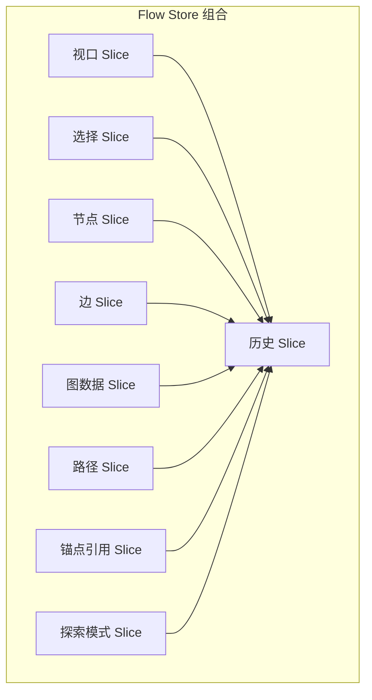
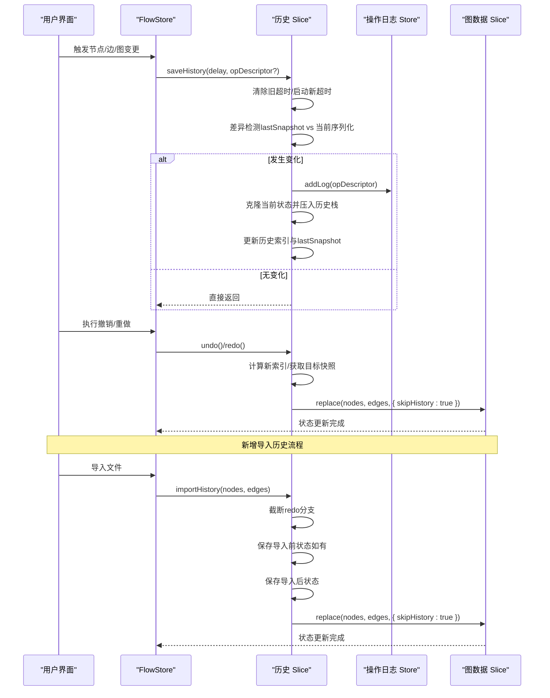
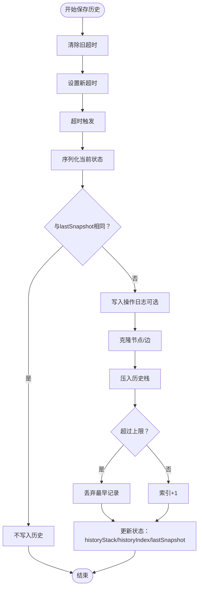
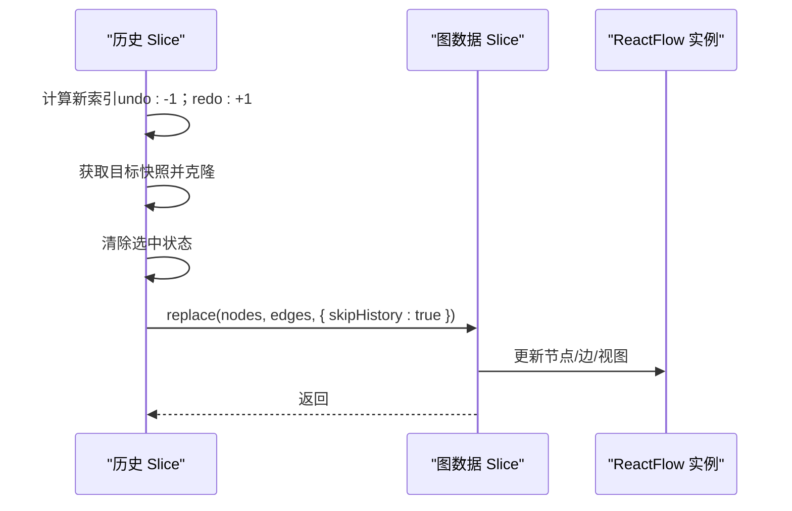
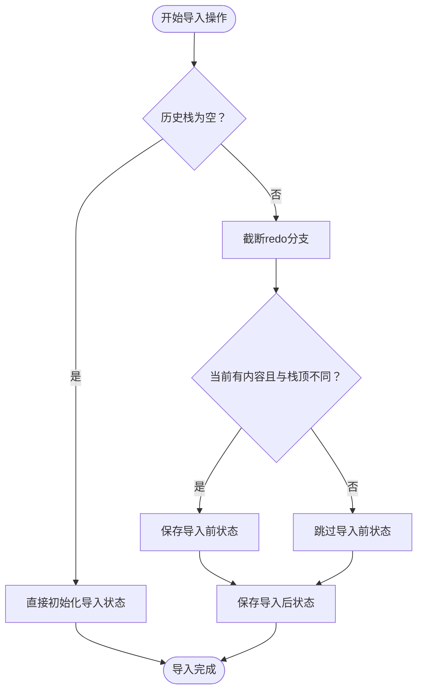
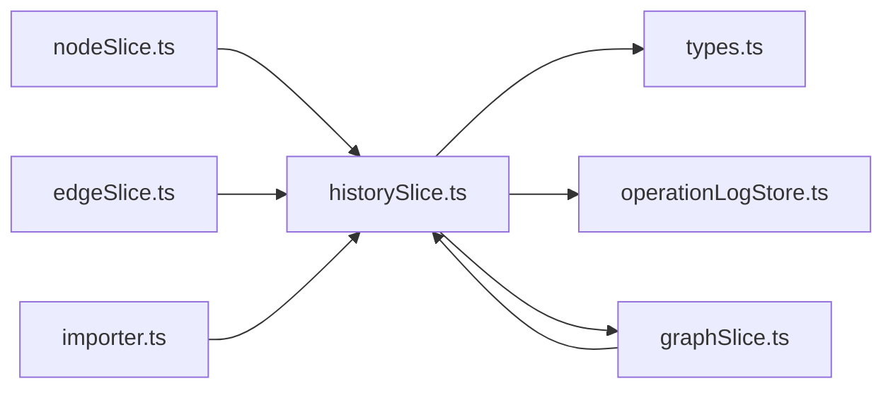

# 历史状态管理（historySlice）

<cite>
**本文档引用的文件**
- [historySlice.ts](file://src/stores/flow/slices/historySlice.ts)
- [types.ts](file://src/stores/flow/types.ts)
- [operationLogStore.ts](file://src/stores/operationLogStore.ts)
- [index.ts](file://src/stores/flow/index.ts)
- [graphSlice.ts](file://src/stores/flow/slices/graphSlice.ts)
- [edgeSlice.ts](file://src/stores/flow/slices/edgeSlice.ts)
- [nodeSlice.ts](file://src/stores/flow/slices/nodeSlice.ts)
- [importer.ts](file://src/core/parser/importer.ts)
</cite>

## 目录
1. [简介](#简介)
2. [项目结构](#项目结构)
3. [核心组件](#核心组件)
4. [架构总览](#架构总览)
5. [详细组件分析](#详细组件分析)
6. [依赖关系分析](#依赖关系分析)
7. [性能考虑](#性能考虑)
8. [故障排查指南](#故障排查指南)
9. [结论](#结论)

## 简介
本文件系统性解析历史状态管理（historySlice）的设计与实现，重点覆盖以下方面：
- 撤销/重做机制的实现原理与调用链路
- 历史记录的存储结构、时间线管理与快照捕获/恢复
- 历史操作的合并与去重策略
- **新增**：导入撤销功能的实现与使用场景
- 历史状态的扩展与自定义撤销行为的实现指导
- 性能优化与内存管理技巧

## 项目结构
historySlice 属于 Flow Store 的一部分，采用 Zustand 的 slice 模式组织，与其他 slice（视口、选择、节点、边、图数据、路径、锚点引用、探索模式）共同构成完整的编辑器状态管理。

**图表来源**
- [index.ts:18-28](file://src/stores/flow/index.ts#L18-L28)

**章节来源**
- [index.ts:18-28](file://src/stores/flow/index.ts#L18-L28)

## 核心组件
- 历史 Slice（historySlice）：负责历史记录的保存、撤销、重做、初始化与清理；提供差异检测与超时聚合，避免频繁写入；**新增**：导入历史记录支持，实现覆盖式导入的完整撤销能力。
- FlowStore 类型定义：统一暴露历史状态接口（canUndo/canRedo）、历史栈与索引、快照字符串等。
- 操作日志（operationLogStore）：与历史记录联动，记录每次有效变更的操作元信息，便于审计与回溯。

**章节来源**
- [historySlice.ts:41-315](file://src/stores/flow/slices/historySlice.ts#L41-L315)
- [types.ts:263-276](file://src/stores/flow/types.ts#L263-L276)
- [operationLogStore.ts:1-52](file://src/stores/operationLogStore.ts#L1-L52)

## 架构总览
historySlice 通过以下关键流程实现撤销/重做：
- 保存历史：在变更发生后延迟触发，进行差异检测，若发生变化则克隆当前状态并压入历史栈，维护历史索引与最后快照字符串。
- 撤销/重做：根据历史索引定位目标快照，清除选中状态后调用图数据替换接口，不产生新的历史记录。
- **新增**：导入历史：在导入操作前后分别保存状态快照，确保覆盖式导入可以完整撤销。
- 初始化与清理：支持从初始图数据建立第一条历史记录，以及清空历史栈。

**图表来源**
- [historySlice.ts:54-122](file://src/stores/flow/slices/historySlice.ts#L54-L122)
- [historySlice.ts:124-202](file://src/stores/flow/slices/historySlice.ts#L124-L202)
- [historySlice.ts:220-289](file://src/stores/flow/slices/historySlice.ts#L220-L289)
- [operationLogStore.ts:32-51](file://src/stores/operationLogStore.ts#L32-L51)
- [graphSlice.ts:24-62](file://src/stores/flow/slices/graphSlice.ts#L24-L62)

## 详细组件分析

### 历史记录存储结构与时间线管理
- 历史栈：数组形式保存每个快照，元素包含节点与边的克隆数据。
- 历史索引：指向当前"时间点"，撤销/重做通过索引移动实现。
- 最后快照字符串：基于序列化后的节点与边数据，用于差异检测，避免重复写入。
- 限制策略：固定上限（示例中为 100），超过时丢弃最早记录，保持空间稳定。

**图表来源**
- [historySlice.ts:54-122](file://src/stores/flow/slices/historySlice.ts#L54-L122)

**章节来源**
- [historySlice.ts:48-122](file://src/stores/flow/slices/historySlice.ts#L48-L122)

### 快照捕获与恢复机制
- 捕获：在超时到期后，克隆当前节点与边，并序列化为字符串用于差异检测。
- 恢复：撤销/重做时，根据新索引获取目标快照，清除选中状态后调用图数据替换接口，跳过历史记录写入。
- 替换接口：graphSlice 的 replace 方法负责实际的状态更新与视图适配，historySlice 仅负责选择状态清理与索引推进。

**图表来源**
- [historySlice.ts:124-202](file://src/stores/flow/slices/historySlice.ts#L124-L202)
- [graphSlice.ts:24-62](file://src/stores/flow/slices/graphSlice.ts#L24-L62)

**章节来源**
- [historySlice.ts:124-202](file://src/stores/flow/slices/historySlice.ts#L124-L202)
- [graphSlice.ts:24-62](file://src/stores/flow/slices/graphSlice.ts#L24-L62)

### 导入历史记录机制（新增功能）
**重要更新**：新增的 importHistory 方法专门解决覆盖式导入时无法撤销的问题。

- **工作原理**：
  - 在导入操作前后分别保存状态快照，确保 undo 可以回到导入前的状态
  - 截断 redo 分支，避免导入后的新状态影响后续重做
  - 仅在状态确实发生变化时才保存导入前状态，避免冗余记录
  - 将导入后的状态作为新的历史记录压入栈顶

- **使用场景**：
  - 文件导入（覆盖式替换）
  - URL 分享链接加载
  - 外部资源导入
  - 任何可能覆盖当前画布内容的操作

**图表来源**
- [historySlice.ts:220-289](file://src/stores/flow/slices/historySlice.ts#L220-L289)

**章节来源**
- [historySlice.ts:220-289](file://src/stores/flow/slices/historySlice.ts#L220-L289)
- [importer.ts:516-523](file://src/core/parser/importer.ts#L516-L523)

### 历史操作的合并与去重策略
- 差异检测：通过序列化当前状态与 lastSnapshot 比较，过滤无变化的写入。
- 超时聚合：saveHistory 支持延迟参数，默认 500ms，将连续变更合并为一次历史记录，降低写入频率。
- 选择状态清理：恢复时自动清除选中状态，避免历史切换导致的视觉干扰。
- 操作日志联动：当存在操作描述符时，写入操作日志，便于审计与问题追踪。

**章节来源**
- [historySlice.ts:54-122](file://src/stores/flow/slices/historySlice.ts#L54-L122)
- [historySlice.ts:124-202](file://src/stores/flow/slices/historySlice.ts#L124-L202)
- [operationLogStore.ts:32-51](file://src/stores/operationLogStore.ts#L32-L51)

### 历史状态扩展与自定义撤销行为
- 自定义延迟：调用 saveHistory 时传入不同延迟值，平衡响应速度与历史粒度。
- 操作描述符：通过 opDescriptor 提供分类、动作、描述与目标 ID，增强可追溯性。
- 跳过历史：在撤销/重做或批量操作中使用 skipHistory，避免引入额外历史记录。
- **新增**：导入历史：使用 importHistory 替代传统的 replace 操作，确保导入操作具备完整的撤销能力。
- 扩展点建议：
  - 条件化保存：在 saveHistory 中增加业务条件判断，仅在满足特定场景时写入历史。
  - 自定义合并：在应用层对连续变更进行语义合并（如拖拽过程中的多次位置变更合并为一次历史）。
  - 自定义快照：对复杂状态进行选择性序列化，减少无关字段带来的体积与比较成本。

**章节来源**
- [historySlice.ts:54-122](file://src/stores/flow/slices/historySlice.ts#L54-L122)
- [graphSlice.ts:24-62](file://src/stores/flow/slices/graphSlice.ts#L24-L62)
- [importer.ts:516-523](file://src/core/parser/importer.ts#L516-L523)

### 与各 Slice 的集成点
- 节点变更：节点增删改、分组/解组等操作均会调用 saveHistory，确保历史一致性。
- 边变更：边的添加、删除、属性更新与顺序调整均写入历史。
- 图数据替换：replace/paste/位移等操作在必要时写入历史，支持整体状态回退。
- **新增**：导入操作：importer.ts 中的导入流程通过 importHistory 实现完整的撤销支持。

**章节来源**
- [nodeSlice.ts:111-136](file://src/stores/flow/slices/nodeSlice.ts#L111-L136)
- [edgeSlice.ts:56-66](file://src/stores/flow/slices/edgeSlice.ts#L56-L66)
- [edgeSlice.ts:102-110](file://src/stores/flow/slices/edgeSlice.ts#L102-L110)
- [edgeSlice.ts:155-163](file://src/stores/flow/slices/edgeSlice.ts#L155-L163)
- [edgeSlice.ts:215-222](file://src/stores/flow/slices/edgeSlice.ts#L215-L222)
- [graphSlice.ts:24-62](file://src/stores/flow/slices/graphSlice.ts#L24-L62)
- [graphSlice.ts:243-249](file://src/stores/flow/slices/graphSlice.ts#L243-L249)
- [graphSlice.ts:302-308](file://src/stores/flow/slices/graphSlice.ts#L302-L308)
- [importer.ts:516-523](file://src/core/parser/importer.ts#L516-L523)

## 依赖关系分析
- 内部依赖
  - types.ts：定义 FlowStore 联合类型与历史状态接口，确保历史 Slice 的类型安全。
  - operationLogStore.ts：与历史记录联动，提供操作审计能力。
  - graphSlice.ts：提供 replace 接口，历史恢复时用于无历史写入的状态更新。
- 外部依赖
  - Zustand：slice 组合与状态访问。
  - React Flow：节点/边变更事件驱动历史写入。
  - **新增**：importer.ts：导入功能的外部调用方，使用 importHistory 实现撤销支持。

**图表来源**
- [historySlice.ts:1-6](file://src/stores/flow/slices/historySlice.ts#L1-L6)
- [types.ts:428-439](file://src/stores/flow/types.ts#L428-L439)
- [operationLogStore.ts:1-52](file://src/stores/operationLogStore.ts#L1-L52)
- [graphSlice.ts:1-20](file://src/stores/flow/slices/graphSlice.ts#L1-L20)
- [importer.ts:516-523](file://src/core/parser/importer.ts#L516-L523)

**章节来源**
- [historySlice.ts:1-6](file://src/stores/flow/slices/historySlice.ts#L1-L6)
- [types.ts:428-439](file://src/stores/flow/types.ts#L428-L439)

## 性能考虑
- 写入节流：默认 500ms 聚合，减少高频变更造成的写入压力。
- 差异检测：通过 lastSnapshot 与序列化结果对比，避免无效写入。
- 克隆策略：优先使用结构化克隆，失败时回退到 JSON 克隆，兼顾兼容性与性能。
- 历史上限：固定上限（示例 100）防止无限增长，结合序列化字符串长度控制内存占用。
- 恢复效率：撤销/重做仅更新索引与少量状态，替换操作通过 replace 一次性完成，避免逐项变更的开销。
- **新增**：导入历史优化：仅在状态确实发生变化时保存导入前状态，避免冗余的历史记录。

**章节来源**
- [historySlice.ts:54-122](file://src/stores/flow/slices/historySlice.ts#L54-L122)
- [historySlice.ts:124-202](file://src/stores/flow/slices/historySlice.ts#L124-L202)
- [historySlice.ts:220-289](file://src/stores/flow/slices/historySlice.ts#L220-L289)

## 故障排查指南
- 撤销/重做不可用
  - 检查历史索引边界：canUndo/canRedo 由索引与栈长度决定。
  - 确认 saveTimeout 是否被意外清除：超时清理会影响保存时机。
- 历史记录过多或过少
  - 调整 saveHistory 的延迟参数，平衡历史粒度与性能。
  - 修改历史上限常量，适应不同场景下的内存与回退需求。
- 恢复后仍保留选中状态
  - 确认撤销/重做流程中是否正确清除选中状态。
- 操作日志缺失
  - 确认调用 saveHistory 时是否传入了有效的操作描述符。
- **新增**：导入后无法撤销
  - 确认导入操作是否使用了 importHistory 而非直接调用 replace
  - 检查导入前状态是否正确保存到历史栈中
  - 确认导入操作是否在正确的时机调用了 importHistory

**章节来源**
- [historySlice.ts:235-242](file://src/stores/flow/slices/historySlice.ts#L235-L242)
- [historySlice.ts:124-202](file://src/stores/flow/slices/historySlice.ts#L124-L202)
- [operationLogStore.ts:32-51](file://src/stores/operationLogStore.ts#L32-L51)
- [importer.ts:516-523](file://src/core/parser/importer.ts#L516-L523)

## 结论
historySlice 通过"延迟聚合 + 差异检测 + 固定上限"的策略，在保证用户体验的同时实现了高效的撤销/重做能力。**最新的更新**增加了 importHistory 方法，专门解决覆盖式导入时无法撤销的问题，通过在导入前后分别保存状态快照，确保任何导入操作都具备完整的撤销能力。

其与各 Slice 的紧密协作确保了复杂编辑场景下的历史一致性。通过合理配置延迟与上限、利用 skipHistory 与操作描述符，可在性能与可追溯性之间取得良好平衡。对于更复杂的业务需求，可在应用层进行语义合并与自定义快照，进一步提升历史系统的灵活性与稳定性。

**新增功能的价值**：
- 解决了覆盖式导入（如文件导入、URL加载）无法撤销的核心问题
- 保持了历史记录的完整性，提升了用户体验
- 通过智能的状态检测避免了冗余的历史记录
- 与现有的撤销/重做机制无缝集成