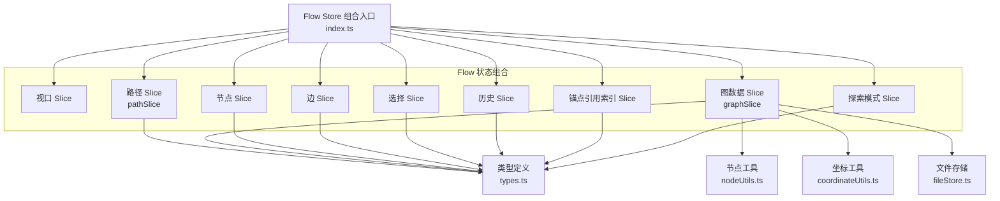
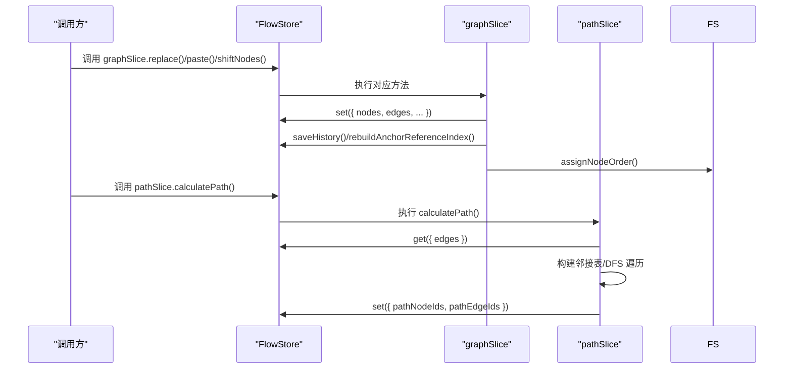
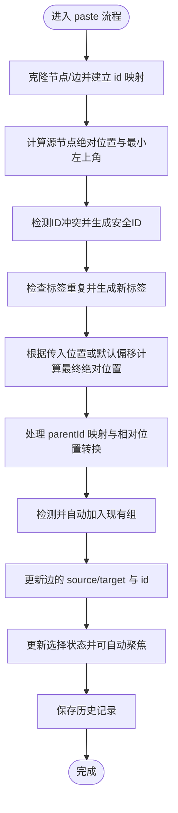
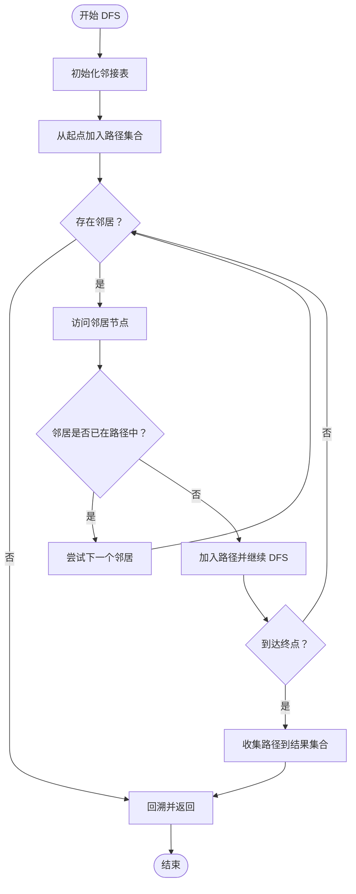
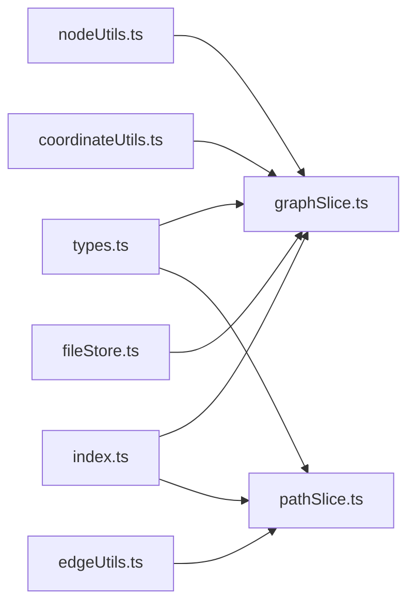

# 图状态管理（graphSlice）

<cite>
**本文档引用的文件**
- [graphSlice.ts](file://src/stores/flow/slices/graphSlice.ts)
- [pathSlice.ts](file://src/stores/flow/slices/pathSlice.ts)
- [types.ts](file://src/stores/flow/types.ts)
- [index.ts](file://src/stores/flow/index.ts)
- [nodeUtils.ts](file://src/stores/flow/utils/nodeUtils.ts)
- [coordinateUtils.ts](file://src/stores/flow/utils/coordinateUtils.ts)
- [edgeUtils.ts](file://src/stores/flow/utils/edgeUtils.ts)
- [fileStore.ts](file://src/stores/fileStore.ts)
- [nodes/index.ts](file://src/components/flow/nodes/index.ts)
</cite>

## 更新摘要
**变更内容**
- 增强图形切片存储的粘贴功能，实现ID冲突检测和安全的粘贴ID生成机制
- 修复粘贴操作可能生成无效节点的问题
- 改进pasteIdCounter和nodeIdCounter的状态管理
- 增强节点标签重复检查机制
- 优化粘贴过程中的ID和标签冲突处理

## 目录
1. [简介](#简介)
2. [项目结构](#项目结构)
3. [核心组件](#核心组件)
4. [架构总览](#架构总览)
5. [详细组件分析](#详细组件分析)
6. [依赖分析](#依赖分析)
7. [性能考虑](#性能考虑)
8. [故障排查指南](#故障排查指南)
9. [结论](#结论)
10. [附录](#附录)

## 简介
本文件系统性阐述图状态管理（graphSlice）在前端状态层中的职责与实现方式，重点覆盖以下方面：
- graphSlice 如何管理整幅图的节点与边状态，包括替换、批量粘贴、节点位移等操作；
- 图的拓扑关系与依赖分析：基于边的邻接表构建与路径遍历；
- 图遍历算法与路径查找机制：深度优先搜索（DFS）在可达路径上的应用；
- 图结构完整性检查与循环依赖检测：节点标签重复校验、锚点引用索引重建；
- 图状态扩展与自定义分析：如何在现有 slice 基础上扩展新的分析能力；
- 性能优化与大型图结构处理技巧：时间复杂度控制、坐标转换与布局策略。

**更新** 增强了粘贴功能的安全性，实现了完整的ID冲突检测和安全的粘贴ID生成机制，修复了粘贴操作可能生成无效节点的问题。

## 项目结构
Flow 状态由多个 slice 组合而成，graphSlice 与 pathSlice 分别负责"图数据状态"和"路径分析"。它们共同依赖于通用类型定义、节点工具函数与坐标工具函数。



图表来源
- [index.ts:18-28](file://src/stores/flow/index.ts#L18-L28)
- [graphSlice.ts:15-20](file://src/stores/flow/slices/graphSlice.ts#L15-L20)
- [pathSlice.ts:1-3](file://src/stores/flow/slices/pathSlice.ts#L1-L3)
- [types.ts:429-439](file://src/stores/flow/types.ts#L429-L439)
- [fileStore.ts:317-329](file://src/stores/fileStore.ts#L317-L329)

章节来源
- [index.ts:17-28](file://src/stores/flow/index.ts#L17-L28)
- [types.ts:429-439](file://src/stores/flow/types.ts#L429-L439)

## 核心组件
- 图数据 Slice（graphSlice）：负责替换整图、批量粘贴、重置粘贴计数、按方向移动节点等操作；维护 pasteIdCounter 以支持粘贴时的唯一性与相对定位。
- 路径 Slice（pathSlice）：基于 DFS 在有向边构成的邻接表上查找从起点到终点的所有可达路径，收集途经节点与边集合。
- 类型定义（types.ts）：统一声明节点、边、参数类型及各 Slice 的状态接口。
- 节点工具（nodeUtils.ts）：提供节点创建、查找、分组顺序保证、标签重复检查等。
- 坐标工具（coordinateUtils.ts）：提供节点绝对/相对坐标转换、父链解析、矩形计算等。
- 边工具（edgeUtils.ts）：提供边查找、选中边筛选、链接次序计算等。
- 文件存储（fileStore.ts）：提供节点顺序管理、ID分配等功能。

**更新** 增强了粘贴功能的安全性，包括ID冲突检测、标签重复检查和安全的ID生成机制。

章节来源
- [graphSlice.ts:25-62](file://src/stores/flow/slices/graphSlice.ts#L25-L62)
- [graphSlice.ts:65-249](file://src/stores/flow/slices/graphSlice.ts#L65-L249)
- [graphSlice.ts:252-308](file://src/stores/flow/slices/graphSlice.ts#L252-L308)
- [pathSlice.ts:9-87](file://src/stores/flow/slices/pathSlice.ts#L9-L87)
- [types.ts:316-353](file://src/stores/flow/types.ts#L316-L353)
- [nodeUtils.ts:228-279](file://src/stores/flow/utils/nodeUtils.ts#L228-L279)
- [coordinateUtils.ts:85-144](file://src/stores/flow/utils/coordinateUtils.ts#L85-L144)
- [edgeUtils.ts:5-31](file://src/stores/flow/utils/edgeUtils.ts#L5-L31)
- [fileStore.ts:317-329](file://src/stores/fileStore.ts#L317-L329)

## 架构总览
graphSlice 与 pathSlice 通过 Zustand 的组合式设计被注入到统一的 FlowStore 中，二者均依赖于 FlowStore 的只读状态（nodes、edges、viewport 等）进行状态变更。



图表来源
- [index.ts:18-28](file://src/stores/flow/index.ts#L18-L28)
- [graphSlice.ts:25-62](file://src/stores/flow/slices/graphSlice.ts#L25-L62)
- [graphSlice.ts:130-241](file://src/stores/flow/slices/graphSlice.ts#L130-L241)
- [pathSlice.ts:130-147](file://src/stores/flow/slices/pathSlice.ts#L130-L147)
- [fileStore.ts:317-329](file://src/stores/fileStore.ts#L317-L329)

## 详细组件分析

### graphSlice：图数据状态管理
graphSlice 负责对整幅图进行"替换"、"粘贴"、"位移"等操作，并维护粘贴计数器与历史记录。

**更新** 增强了粘贴功能的安全性，实现了完整的ID冲突检测和安全的粘贴ID生成机制。

- 替换整图（replace）
  - 对传入的 nodes/edges 进行浅拷贝与深拷贝，确保不污染外部数据；
  - 通过 ensureGroupNodeOrder 保证 Group 节点排在子节点之前；
  - 可选聚焦视图与历史记录保存；
  - 最终重建锚点引用索引以保持引用一致性。
  - **更新** 改进了 pasteIdCounter 和 nodeIdCounter 的管理，通过扫描现有节点ID来确定最大值，确保计数器的正确性。

- 批量粘贴（paste）
  - 克隆节点与边，生成新的 id 映射 pairs；
  - 计算源节点的绝对位置与最小左上角，根据偏移生成最终绝对位置；
  - 处理 parentId 映射与相对位置转换，支持继承父节点或自动加入现有组；
  - 更新边的 source/target 与 id，更新选择状态并可自动聚焦；
  - 保存历史记录。
  - **更新** 实现了完整的ID冲突检测机制：
    - 使用 Set 收集所有已存在的节点ID，用于检测冲突
    - 生成安全的粘贴ID："paste_" + pasteCounter
    - 检测ID冲突，跳过已存在的 paste_ ID
    - 动态递增pasteCounter直到找到可用ID
    - 为External/Anchor节点保留原始标签，作为视觉副本
    - 为其他节点生成不重复的新标签，避免标签冲突

- 重置粘贴计数器（resetPasteCounter）
  - 将 pasteIdCounter 归零，避免粘贴序列过长导致 id 冲突。

- 节点位移（shiftNodes）
  - 以目标节点集合的最左上角为基准，按节点与基准的距离比例计算位移增量；
  - 支持水平/垂直两个方向，保存历史记录。



图表来源
- [graphSlice.ts:65-249](file://src/stores/flow/slices/graphSlice.ts#L65-L249)
- [coordinateUtils.ts:85-159](file://src/stores/flow/utils/coordinateUtils.ts#L85-L159)
- [nodeUtils.ts:325-338](file://src/stores/flow/utils/nodeUtils.ts#L325-L338)

章节来源
- [graphSlice.ts:25-62](file://src/stores/flow/slices/graphSlice.ts#L25-L62)
- [graphSlice.ts:65-249](file://src/stores/flow/slices/graphSlice.ts#L65-L249)
- [graphSlice.ts:252-308](file://src/stores/flow/slices/graphSlice.ts#L252-L308)
- [coordinateUtils.ts:85-159](file://src/stores/flow/utils/coordinateUtils.ts#L85-L159)
- [nodeUtils.ts:325-338](file://src/stores/flow/utils/nodeUtils.ts#L325-L338)

### pathSlice：路径查找与拓扑分析
pathSlice 提供路径模式下的"起止节点设置—路径计算—结果展示"的完整流程。其核心是基于 DFS 的可达路径搜索。

- 数据结构
  - 邻接表：以 source 节点为键，存储 {targetNodeId, edgeId} 列表；
  - 路径集合：使用 Set 记录途经节点与边，避免重复。

- DFS 算法
  - 从起始节点出发，维护当前路径的节点集合与边集合；
  - 若到达终点，将当前路径的节点与边加入全局结果集合；
  - 遍历邻居时跳过已访问节点，防止环路导致无限递归；
  - 返回是否存在任意一条从起点到终点的路径。



图表来源
- [pathSlice.ts:9-87](file://src/stores/flow/slices/pathSlice.ts#L9-L87)

章节来源
- [pathSlice.ts:9-87](file://src/stores/flow/slices/pathSlice.ts#L9-L87)
- [pathSlice.ts:130-147](file://src/stores/flow/slices/pathSlice.ts#L130-L147)

### 节点与边类型体系
- 节点类型：Pipeline、External、Anchor、Sticker、Group；
- 边类型：包含 source/target、handle 类型、label、attributes 等；
- 参数类型：RecognitionParamType、ActionParamType、OtherParamType；
- Slice 状态接口：FlowGraphState、FlowPathState 等。

```mermaid
classDiagram
class NodeType {
+id : string
+type : NodeTypeEnum
+data : any
+position : PositionType
+dragging? : boolean
+selected? : boolean
+measured? : { width : number; height : number }
}
class EdgeType {
+id : string
+source : string
+sourceHandle : SourceHandleTypeEnum
+target : string
+targetHandle : TargetHandleTypeEnum
+label : number
+type : "marked"
+selected? : boolean
+attributes? : EdgeAttributesType
}
class FlowGraphState {
+pasteIdCounter : number
+replace(nodes, edges, options)
+paste(nodes, edges, position?)
+resetPasteCounter()
+shiftNodes(direction, delta, targetNodeIds?)
}
class FlowPathState {
+pathMode : boolean
+pathStartNodeId : string|null
+pathEndNodeId : string|null
+pathNodeIds : Set<string>
+pathEdgeIds : Set<string>
+setPathMode(enabled)
+setPathStartNode(nodeId)
+setPathEndNode(nodeId)
+calculatePath()
+clearPath()
}
NodeType <.. FlowGraphState : "管理"
EdgeType <.. FlowPathState : "分析"
```

图表来源
- [types.ts:230-236](file://src/stores/flow/types.ts#L230-L236)
- [types.ts:29-40](file://src/stores/flow/types.ts#L29-L40)
- [types.ts:316-353](file://src/stores/flow/types.ts#L316-L353)

章节来源
- [types.ts:230-236](file://src/stores/flow/types.ts#L230-L236)
- [types.ts:29-40](file://src/stores/flow/types.ts#L29-L40)
- [types.ts:316-353](file://src/stores/flow/types.ts#L316-L353)

### 节点标签重复检查与锚点引用索引
- 节点标签重复检查：在导出配置时可添加前缀，不同类型节点（Pipeline/External/Anchor/Sticker/Group）的重复规则不同，避免 JSON key 冲突与语义不一致。
- 锚点引用索引：通过 rebuildAnchorReferenceIndex 重建 anchor 名称到使用该 anchor 的节点集合的映射，便于高亮与查询。

**更新** 增强了标签重复检查机制，支持更精确的标签冲突检测和处理。

章节来源
- [nodeUtils.ts:228-279](file://src/stores/flow/utils/nodeUtils.ts#L228-L279)
- [index.ts:84-104](file://src/stores/flow/index.ts#L84-L104)

### ID冲突检测与安全的粘贴ID生成机制
**新增功能** 实现了完整的ID冲突检测和安全的粘贴ID生成机制，确保粘贴操作的可靠性。

- ID冲突检测
  - 使用 Set 收集所有已存在的节点ID，用于检测冲突
  - 生成安全的粘贴ID："paste_" + pasteCounter
  - 检测ID冲突，跳过已存在的 paste_ ID
  - 动态递增pasteCounter直到找到可用ID
  - 确保生成的ID不会与现有节点ID冲突

- 安全的粘贴ID生成
  - 为每个粘贴操作分配唯一的pasteCounter
  - 通过existingIds Set跟踪已使用的ID
  - 自动处理ID冲突，确保ID的唯一性
  - 维护pasteIdCounter的最大值，避免重复

- 标签重复检查
  - 为External/Anchor节点保留原始标签，作为视觉副本
  - 为其他节点生成不重复的新标签，避免标签冲突
  - 使用existingLabels Set跟踪已使用的标签
  - 动态递增标签计数器直到找到可用标签

章节来源
- [graphSlice.ts:107-159](file://src/stores/flow/slices/graphSlice.ts#L107-L159)

## 依赖分析
graphSlice 与 pathSlice 的耦合关系主要体现在对 FlowStore 状态的只读访问与写入。它们分别依赖于：
- graphSlice：依赖 nodeUtils（ensureGroupNodeOrder）、coordinateUtils（绝对/相对坐标转换）、viewport 工具（fitFlowView）以及历史与锚点索引管理；
- pathSlice：依赖 EdgeType 定义与 edges 状态，通过邻接表与 DFS 实现路径分析。
- fileStore：提供assignNodeOrder函数，用于分配节点顺序号。

**更新** 增加了对fileStore的依赖，用于节点顺序管理。



图表来源
- [types.ts:429-439](file://src/stores/flow/types.ts#L429-L439)
- [graphSlice.ts:15-20](file://src/stores/flow/slices/graphSlice.ts#L15-L20)
- [pathSlice.ts:1-3](file://src/stores/flow/slices/pathSlice.ts#L1-L3)
- [index.ts:18-28](file://src/stores/flow/index.ts#L18-L28)
- [fileStore.ts:317-329](file://src/stores/fileStore.ts#L317-L329)

章节来源
- [graphSlice.ts:15-20](file://src/stores/flow/slices/graphSlice.ts#L15-L20)
- [pathSlice.ts:1-3](file://src/stores/flow/slices/pathSlice.ts#L1-L3)
- [index.ts:18-28](file://src/stores/flow/index.ts#L18-L28)
- [fileStore.ts:317-329](file://src/stores/fileStore.ts#L317-L329)

## 性能考虑
- 时间复杂度
  - replace/paste/shiftNodes：线性复杂度 O(N)，其中 N 为节点/边数量；
  - DFS 路径查找：邻接表构建 O(E)，DFS 最坏 O(V+E)，其中 V 为节点数，E 为边数。
  - **更新** 粘贴操作增加了ID冲突检测，时间复杂度为O(N*M)，其中N为粘贴节点数，M为现有节点数。
- 空间复杂度
  - 邻接表占用 O(V+E)；
  - DFS 递归栈深度最坏 O(V)；
  - **更新** 粘贴操作增加了Set数据结构，空间复杂度为O(N)。
- 优化建议
  - 大规模图时，尽量减少频繁的 set 调用，合并状态更新；
  - 使用 Set 存储路径节点/边，避免重复计算；
  - 对粘贴场景，先计算绝对位置再统一转换为相对位置，减少重复计算；
  - 在导出/校验场景，提前过滤无效节点（如 Sticker/Group），降低重复检查成本；
  - **更新** 对于大量粘贴操作，可以考虑批量处理ID冲突检测，提高效率。

## 故障排查指南
- 粘贴后节点未正确加入组
  - 检查 getNodeAbsoluteRect 与 getNodeAbsolutePosition 的计算是否正确；
  - 确认父链解析逻辑与相对位置转换是否匹配。
- 路径计算为空
  - 确认 edges 是否包含正确的 source/target 与 handle 类型；
  - 检查 DFS 是否因环路导致提前终止（已通过路径集合避免循环）。
- 节点标签重复告警
  - 导出配置时检查前缀设置与重复规则；
  - 不同类型节点间的同名冲突需修正。
- **新增** 粘贴ID冲突问题
  - 检查pasteIdCounter的值是否正确更新；
  - 确认existingIds Set是否正确收集了所有现有ID；
  - 验证ID冲突检测逻辑是否正常工作。
- **新增** 标签重复问题
  - 检查existingLabels Set是否正确收集了所有现有标签；
  - 确认标签冲突检测和处理逻辑是否正常。

章节来源
- [coordinateUtils.ts:85-144](file://src/stores/flow/utils/coordinateUtils.ts#L85-L144)
- [pathSlice.ts:9-87](file://src/stores/flow/slices/pathSlice.ts#L9-L87)
- [nodeUtils.ts:228-279](file://src/stores/flow/utils/nodeUtils.ts#L228-L279)
- [graphSlice.ts:107-159](file://src/stores/flow/slices/graphSlice.ts#L107-L159)

## 结论
graphSlice 与 pathSlice 在 FlowStore 中承担了"图数据状态管理"和"路径分析"的核心职责。前者通过替换、粘贴、位移等操作保障图结构的可控与可追溯，后者通过邻接表与 DFS 提供了灵活的可达路径分析能力。结合节点工具与坐标工具，系统在大型图场景下仍具备良好的扩展性与性能表现。

**更新** 增强的粘贴功能通过完整的ID冲突检测和安全的粘贴ID生成机制，显著提高了系统的可靠性和用户体验，修复了粘贴操作可能生成无效节点的问题。

## 附录

### 自定义图分析扩展指引
- 新增分析维度
  - 在 pathSlice 基础上扩展：例如增加"环路检测"（基于 DFS 回溯边）、"强连通分量"（Tarjan/Kosaraju）等；
  - 在 graphSlice 上扩展：例如"节点度分布统计"、"边权重聚合"等。
- 与现有 slice 的集成
  - 通过 FlowStore 的只读状态访问 nodes/edges，避免直接修改；
  - 将分析结果写入新的 Slice 或状态字段，保持单一职责。
- 性能与可观测性
  - 对大规模图采用分批处理或采样策略；
  - 提供分析进度与错误上报，便于调试与监控。
- **新增** 安全性考虑
  - 在扩展功能时，确保遵循现有的ID冲突检测和标签重复检查机制；
  - 为新功能实现相应的冲突处理逻辑，保证系统的稳定性。