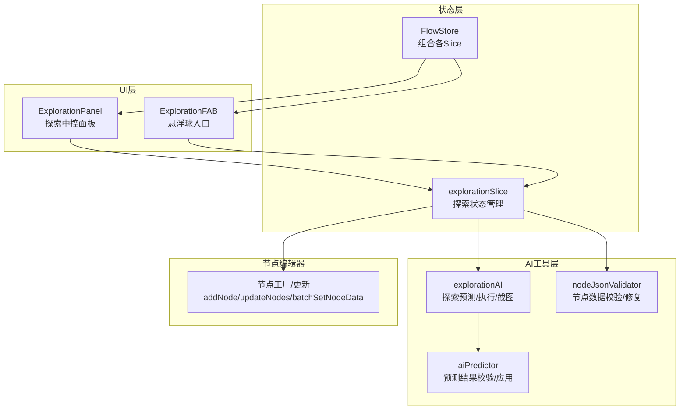
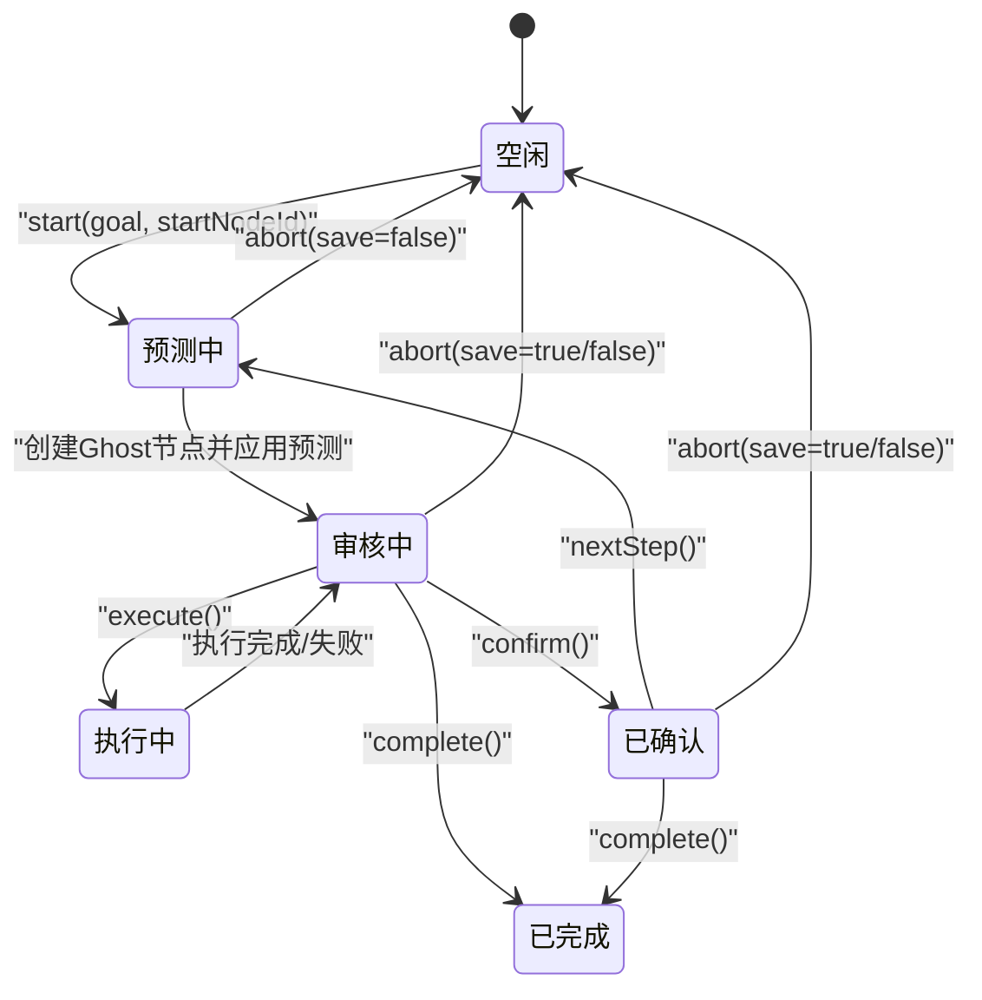
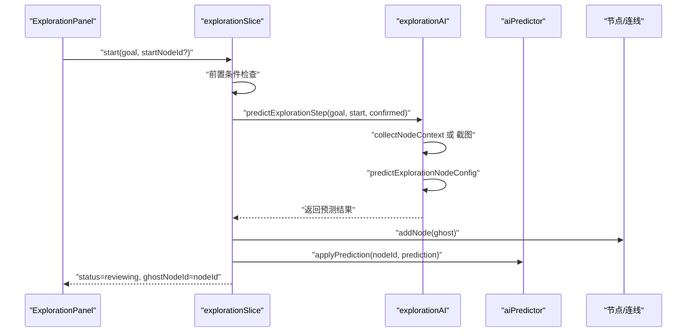
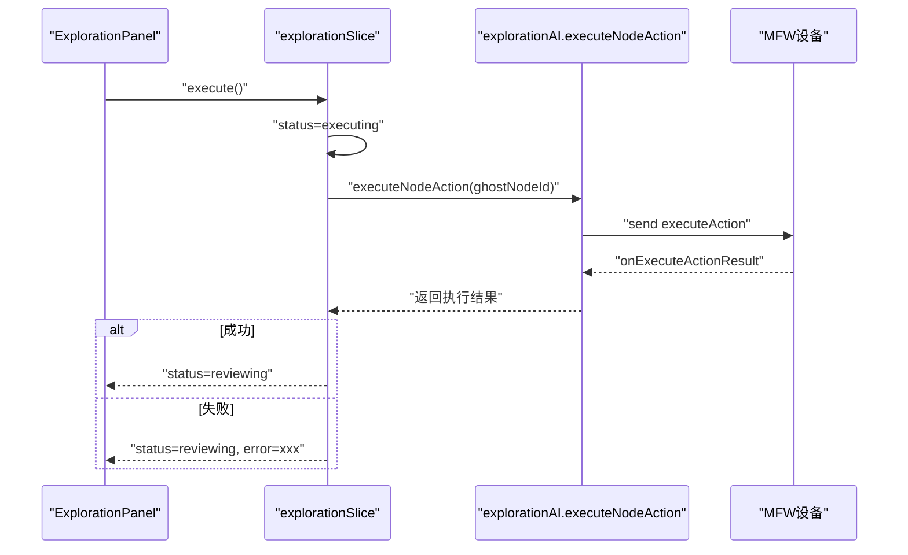
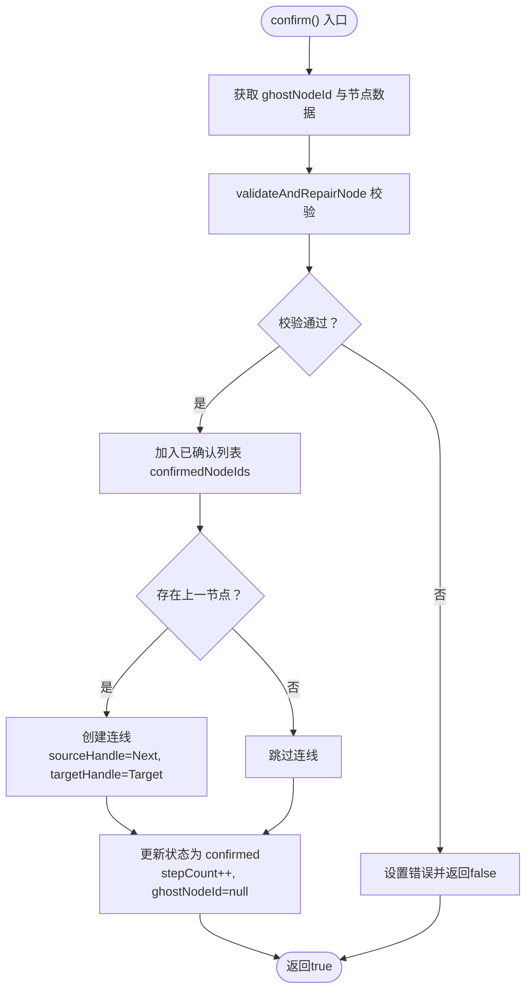
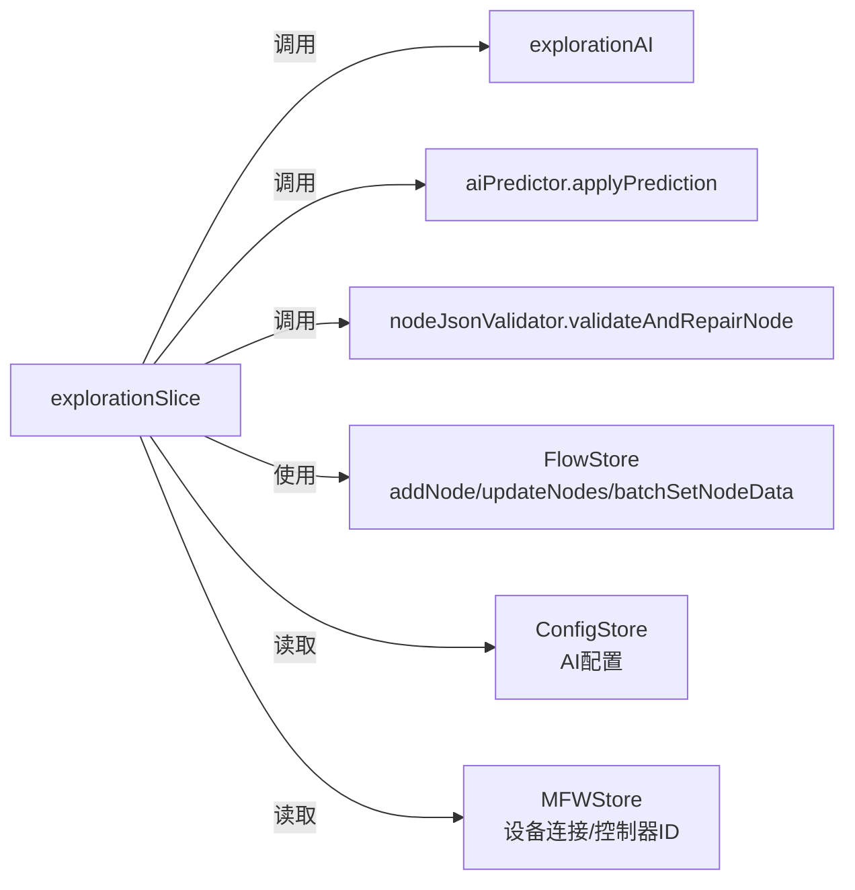

# 探索状态管理 (explorationSlice)

<cite>
**本文档引用的文件**
- [explorationSlice.ts](file://src/stores/flow/slices/explorationSlice.ts)
- [types.ts](file://src/stores/flow/types.ts)
- [index.ts](file://src/stores/flow/index.ts)
- [ExplorationPanel.tsx](file://src/components/panels/exploration/ExplorationPanel.tsx)
- [ExplorationFAB.tsx](file://src/components/panels/exploration/ExplorationFAB.tsx)
- [ExplorationPanel.module.less](file://src/styles/panels/ExplorationPanel.module.less)
- [explorationAI.ts](file://src/utils/ai/explorationAI.ts)
- [aiPredictor.ts](file://src/utils/ai/aiPredictor.ts)
- [nodeJsonValidator.ts](file://src/utils/node/nodeJsonValidator.ts)
</cite>

## 目录
1. [简介](#简介)
2. [项目结构](#项目结构)
3. [核心组件](#核心组件)
4. [架构总览](#架构总览)
5. [详细组件分析](#详细组件分析)
6. [依赖关系分析](#依赖关系分析)
7. [性能考虑](#性能考虑)
8. [故障排查指南](#故障排查指南)
9. [结论](#结论)
10. [附录](#附录)

## 简介
本文件聚焦于探索状态管理（explorationSlice），系统性阐述其如何管理AI探索功能的全流程状态，包括探索模式的启动、暂停、停止流程；探索状态与节点/连线的交互机制；探索进度跟踪与结果收集逻辑；以及扩展与自定义探索行为的实现指导，并提供性能优化与大规模探索任务处理技巧。

## 项目结构
探索状态管理位于前端状态层，采用Zustand分片（slice）设计，结合AI工具链与节点编辑器，形成“状态驱动 + AI预测 + 节点应用”的闭环。

图表来源
- [index.ts:18-28](file://src/stores/flow/index.ts#L18-L28)
- [explorationSlice.ts:35-343](file://src/stores/flow/slices/explorationSlice.ts#L35-L343)
- [ExplorationPanel.tsx:29-105](file://src/components/panels/exploration/ExplorationPanel.tsx#L29-L105)
- [ExplorationFAB.tsx:23-62](file://src/components/panels/exploration/ExplorationFAB.tsx#L23-L62)
- [explorationAI.ts:70-117](file://src/utils/ai/explorationAI.ts#L70-L117)
- [aiPredictor.ts:512-582](file://src/utils/ai/aiPredictor.ts#L512-L582)
- [nodeJsonValidator.ts:21-95](file://src/utils/node/nodeJsonValidator.ts#L21-L95)

章节来源
- [index.ts:18-28](file://src/stores/flow/index.ts#L18-L28)
- [ExplorationPanel.tsx:29-105](file://src/components/panels/exploration/ExplorationPanel.tsx#L29-L105)
- [ExplorationFAB.tsx:23-62](file://src/components/panels/exploration/ExplorationFAB.tsx#L23-L62)

## 核心组件
- explorationSlice：定义探索状态、动作与内部方法，协调AI预测、节点创建与连线建立。
- ExplorationPanel：探索中控面板，负责渲染不同状态下的界面与交互。
- ExplorationFAB：悬浮球入口，提供前置条件检查与状态提示。
- explorationAI：封装探索模式的预测、执行、截图与位置计算。
- aiPredictor：提供预测结果校验与批量应用。
- nodeJsonValidator：对节点数据进行校验与修复。

章节来源
- [explorationSlice.ts:22-343](file://src/stores/flow/slices/explorationSlice.ts#L22-L343)
- [types.ts:371-426](file://src/stores/flow/types.ts#L371-L426)
- [ExplorationPanel.tsx:108-253](file://src/components/panels/exploration/ExplorationPanel.tsx#L108-L253)
- [ExplorationFAB.tsx:23-62](file://src/components/panels/exploration/ExplorationFAB.tsx#L23-L62)
- [explorationAI.ts:25-117](file://src/utils/ai/explorationAI.ts#L25-L117)
- [aiPredictor.ts:512-582](file://src/utils/ai/aiPredictor.ts#L512-L582)
- [nodeJsonValidator.ts:21-95](file://src/utils/node/nodeJsonValidator.ts#L21-L95)

## 架构总览
探索状态机贯穿“准备 -> 预测 -> 审核 -> 执行 -> 确认 -> 下一步”的循环，配合Ghost节点可视化与节点/连线的动态创建，实现“所见即所得”的探索体验。

图表来源
- [types.ts:371-378](file://src/stores/flow/types.ts#L371-L378)
- [explorationSlice.ts:44-343](file://src/stores/flow/slices/explorationSlice.ts#L44-L343)

## 详细组件分析

### 探索状态机与生命周期
- 状态枚举：idle、predicting、reviewing、executing、confirmed、completed。
- 生命周期关键节点：
  - start：前置条件校验（设备连接、AI配置），进入预测阶段，调用AI预测生成节点建议，创建Ghost节点并应用预测。
  - execute：向设备发送执行请求，等待执行结果，失败时回退至审核态。
  - confirm：验证节点数据完整性，追加到已确认列表，必要时创建连接，进入confirmed态。
  - nextStep：基于已确认节点集合再次预测，生成新Ghost节点。
  - regenerate：删除当前Ghost节点并重新预测生成。
  - complete：结束探索，清空进度。
  - abort：根据是否保存已确认节点清理节点与状态。

章节来源
- [types.ts:371-378](file://src/stores/flow/types.ts#L371-L378)
- [explorationSlice.ts:44-343](file://src/stores/flow/slices/explorationSlice.ts#L44-L343)

### 探索模式启动流程（start）

图表来源
- [explorationSlice.ts:44-118](file://src/stores/flow/slices/explorationSlice.ts#L44-L118)
- [explorationAI.ts:70-117](file://src/utils/ai/explorationAI.ts#L70-L117)
- [aiPredictor.ts:512-582](file://src/utils/ai/aiPredictor.ts#L512-L582)

章节来源
- [explorationSlice.ts:44-118](file://src/stores/flow/slices/explorationSlice.ts#L44-L118)
- [explorationAI.ts:70-117](file://src/utils/ai/explorationAI.ts#L70-L117)

### 探索模式执行流程（execute）

图表来源
- [explorationSlice.ts:121-142](file://src/stores/flow/slices/explorationSlice.ts#L121-L142)
- [explorationAI.ts:344-518](file://src/utils/ai/explorationAI.ts#L344-L518)

章节来源
- [explorationSlice.ts:121-142](file://src/stores/flow/slices/explorationSlice.ts#L121-L142)
- [explorationAI.ts:344-518](file://src/utils/ai/explorationAI.ts#L344-L518)

### 探索模式确认与连线建立（confirm）

图表来源
- [explorationSlice.ts:146-187](file://src/stores/flow/slices/explorationSlice.ts#L146-L187)
- [nodeJsonValidator.ts:21-95](file://src/utils/node/nodeJsonValidator.ts#L21-L95)

章节来源
- [explorationSlice.ts:146-187](file://src/stores/flow/slices/explorationSlice.ts#L146-L187)
- [nodeJsonValidator.ts:21-95](file://src/utils/node/nodeJsonValidator.ts#L21-L95)

### 探索模式下一步（nextStep）与重新生成（regenerate）
- nextStep：在confirmed态下，基于已确认节点集合再次预测，创建新Ghost节点并应用预测，回到reviewing态。
- regenerate：在reviewing态下，删除当前Ghost节点并重新预测生成，保持reviewing态。

章节来源
- [explorationSlice.ts:191-247](file://src/stores/flow/slices/explorationSlice.ts#L191-L247)
- [explorationSlice.ts:250-305](file://src/stores/flow/slices/explorationSlice.ts#L250-L305)

### 探索进度跟踪与结果收集
- 进度阶段与详情：通过内部方法_setProgress实时更新progressStage与progressDetail，供UI展示。
- 结果收集：predictExplorationStep返回包含label与prediction的对象，其中label用于节点标签，prediction用于后续applyPrediction填充节点字段。
- 截图采集：performExplorationScreenshot通过MFW协议请求截图，超时与失败均有明确错误反馈。

章节来源
- [explorationSlice.ts:77-80](file://src/stores/flow/slices/explorationSlice.ts#L77-L80)
- [explorationSlice.ts:206-208](file://src/stores/flow/slices/explorationSlice.ts#L206-L208)
- [explorationAI.ts:70-117](file://src/utils/ai/explorationAI.ts#L70-L117)
- [explorationAI.ts:523-566](file://src/utils/ai/explorationAI.ts#L523-L566)

### 探索状态与节点/连线交互机制
- Ghost节点：在reviewing态下临时显示，标识当前AI建议的节点，支持执行、重新生成与确认。
- 位置计算：calculateGhostNodePosition优先基于最后确认节点右侧，其次起始节点右侧，否则视口中心。
- 连线策略：确认节点时，若存在上一节点（已确认或起始），自动创建next连接，handle类型分别为Next与Target。

章节来源
- [explorationSlice.ts:83-99](file://src/stores/flow/slices/explorationSlice.ts#L83-L99)
- [explorationSlice.ts:169-176](file://src/stores/flow/slices/explorationSlice.ts#L169-L176)
- [explorationAI.ts:25-56](file://src/utils/ai/explorationAI.ts#L25-L56)

### UI组件与状态联动
- ExplorationPanel：根据状态渲染不同内容，提供开始、下一步、完成、退出等交互入口。
- ExplorationFAB：始终可见，但未连接或未配置AI时禁用，探索中显示脉冲动画与步数徽章。
- 样式：通过模块化CSS实现面板显隐、动画与Ghost节点样式。

章节来源
- [ExplorationPanel.tsx:108-253](file://src/components/panels/exploration/ExplorationPanel.tsx#L108-L253)
- [ExplorationFAB.tsx:23-62](file://src/components/panels/exploration/ExplorationFAB.tsx#L23-L62)
- [ExplorationPanel.module.less:6-63](file://src/styles/panels/ExplorationPanel.module.less#L6-L63)
- [ExplorationPanel.module.less:278-317](file://src/styles/panels/ExplorationPanel.module.less#L278-L317)

## 依赖关系分析
- explorationSlice依赖：
  - mfw设备状态与控制器ID（设备连接）
  - AI配置（API地址、密钥、模型）
  - explorationAI（预测、执行、截图、位置计算）
  - aiPredictor（预测结果校验与应用）
  - nodeJsonValidator（节点数据校验/修复）
  - FlowStore（节点/连线增删改与批量更新）

图表来源
- [explorationSlice.ts:7-20](file://src/stores/flow/slices/explorationSlice.ts#L7-L20)
- [index.ts:18-28](file://src/stores/flow/index.ts#L18-L28)

章节来源
- [explorationSlice.ts:7-20](file://src/stores/flow/slices/explorationSlice.ts#L7-L20)
- [index.ts:18-28](file://src/stores/flow/index.ts#L18-L28)

## 性能考虑
- 预测与执行分离：将AI预测与设备执行解耦，避免阻塞UI线程；执行阶段设置超时与错误回退。
- 批量更新：通过batchSetNodeData一次性应用预测结果，减少多次渲染与状态抖动。
- 截图缓存：截图请求使用缓存策略，降低重复截图开销。
- 位置计算优化：优先使用已确认节点或起始节点相对位置，避免复杂布局计算。
- 大规模探索建议：
  - 控制并发：单次仅维护一个Ghost节点，避免多节点同时预测导致的资源竞争。
  - 分批确认：逐步确认并建立连接，降低后续预测上下文复杂度。
  - 缓存与复用：利用已确认节点的上下文信息，减少重复采集与解析成本。
  - UI节流：在predicting态下限制频繁触发的UI更新，仅在必要时刷新。

## 故障排查指南
- 设备未连接或AI未配置：start阶段会直接设置错误并返回，检查MFW连接状态与AI配置。
- 截图失败：performExplorationScreenshot在超时或失败时抛出错误，检查设备权限与网络。
- 执行失败：executeNodeAction捕获异常并回退至reviewing态，查看错误信息并重试。
- 节点数据异常：confirm前validateAndRepairNode会尝试修复结构不完整问题，必要时删除并重新创建节点。
- 进度卡住：检查_progress回调是否被正确调用，确认AI服务可用与网络稳定。

章节来源
- [explorationSlice.ts:49-56](file://src/stores/flow/slices/explorationSlice.ts#L49-L56)
- [explorationSlice.ts:110-117](file://src/stores/flow/slices/explorationSlice.ts#L110-L117)
- [explorationAI.ts:523-566](file://src/utils/ai/explorationAI.ts#L523-L566)
- [explorationSlice.ts:127-141](file://src/stores/flow/slices/explorationSlice.ts#L127-L141)
- [nodeJsonValidator.ts:21-95](file://src/utils/node/nodeJsonValidator.ts#L21-L95)

## 结论
explorationSlice通过清晰的状态机与完善的前后置条件检查，将AI预测、节点应用与用户交互有机融合。借助Ghost节点与增量确认机制，探索过程具备良好的可控性与可回溯性。配合AI工具链与节点校验修复，系统在保证稳定性的同时提供了强大的探索能力。

## 附录

### 探索状态扩展与自定义行为实现指导
- 新增状态：在状态枚举与类型定义中扩展状态，补充对应动作与UI渲染。
- 自定义预测：在explorationAI中扩展predictExplorationNodeConfig，增加领域特定的提示词与输出约束。
- 自定义执行：在executeNodeAction中扩展pipeline_override策略或引入新的执行通道。
- 自定义校验：在validateAndRepairNode中增加针对新字段的校验规则与默认值策略。
- UI扩展：在ExplorationPanel中新增状态分支与按钮，确保与状态机一致。

章节来源
- [types.ts:371-426](file://src/stores/flow/types.ts#L371-L426)
- [explorationAI.ts:197-231](file://src/utils/ai/explorationAI.ts#L197-L231)
- [explorationAI.ts:441-518](file://src/utils/ai/explorationAI.ts#L441-L518)
- [nodeJsonValidator.ts:21-95](file://src/utils/node/nodeJsonValidator.ts#L21-L95)
- [ExplorationPanel.tsx:108-253](file://src/components/panels/exploration/ExplorationPanel.tsx#L108-L253)