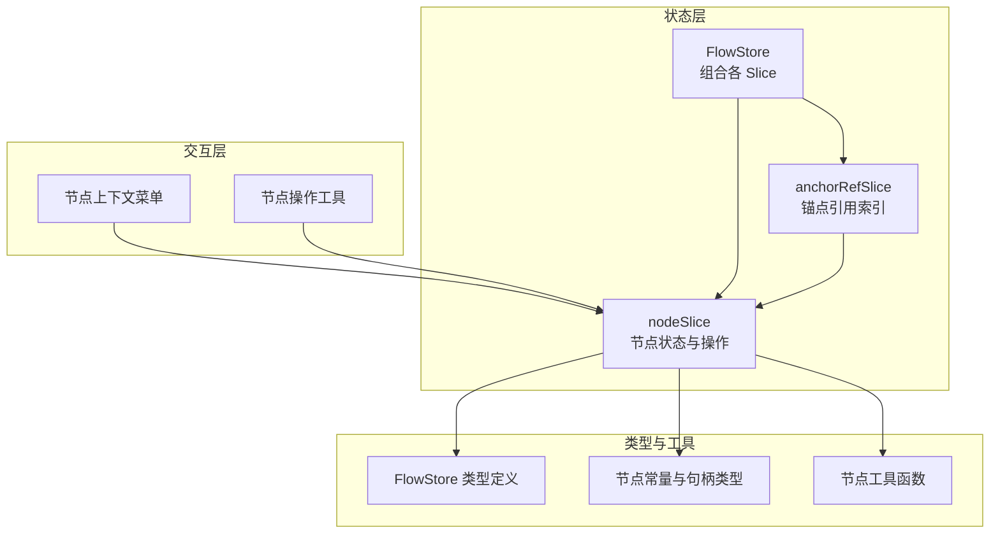
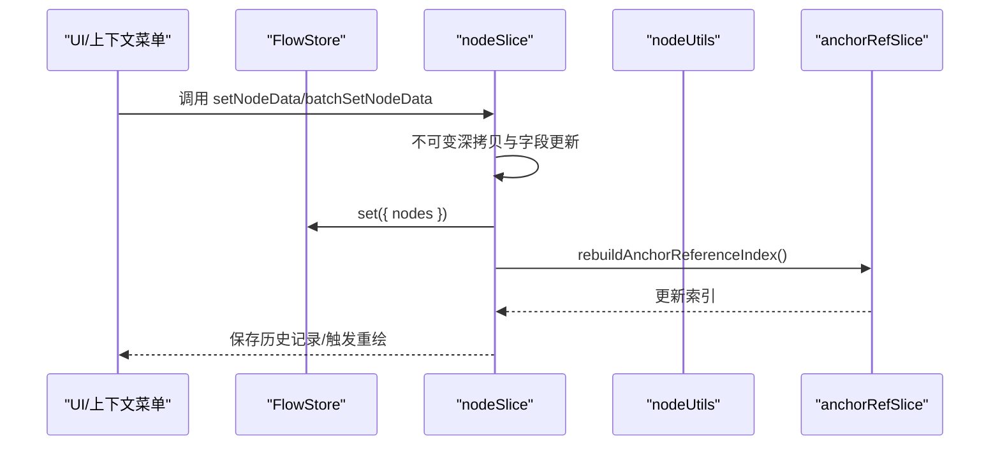
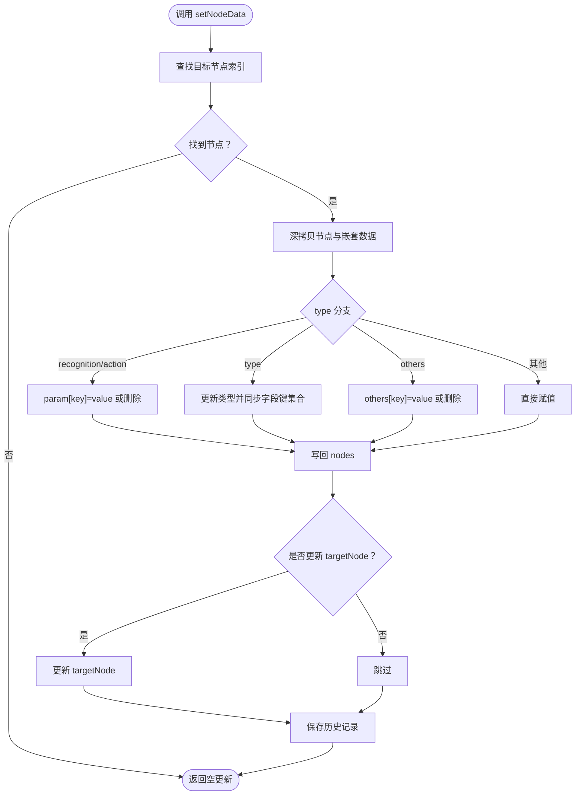
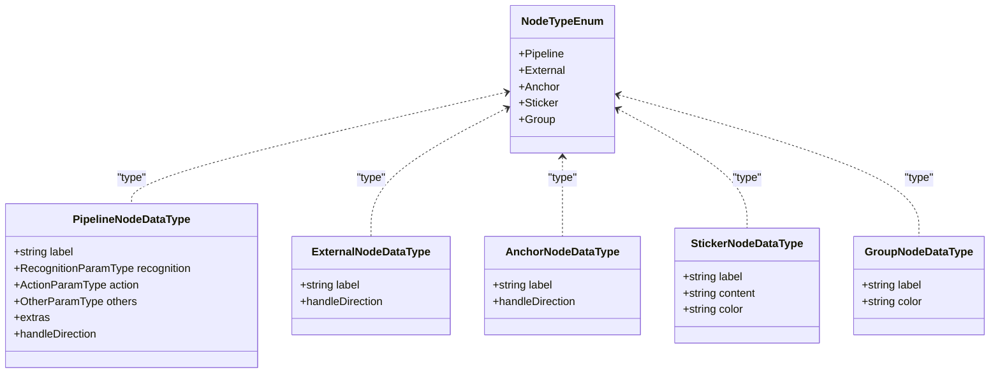
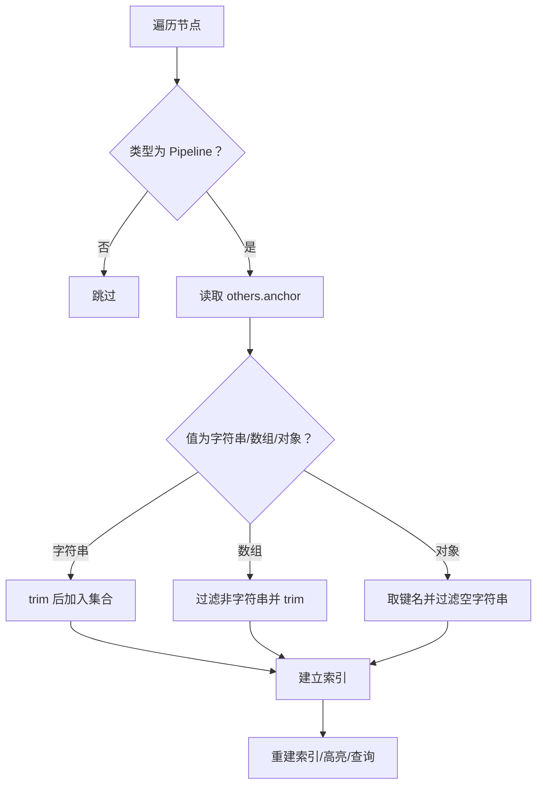
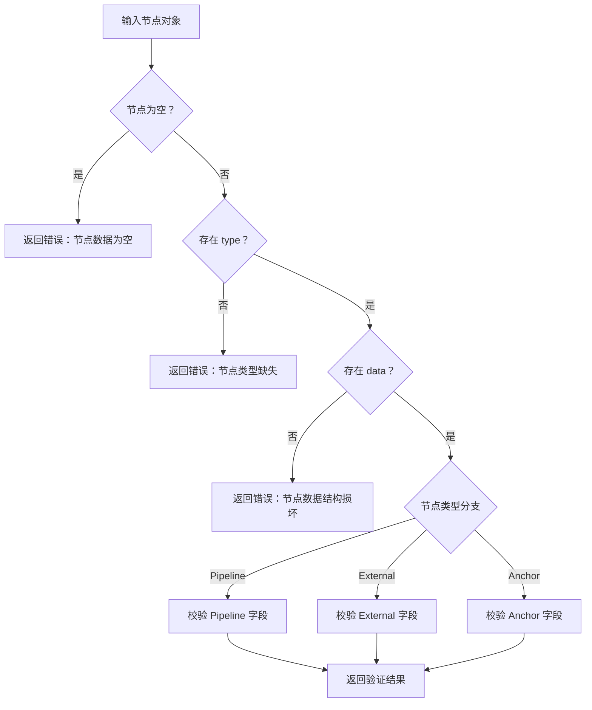
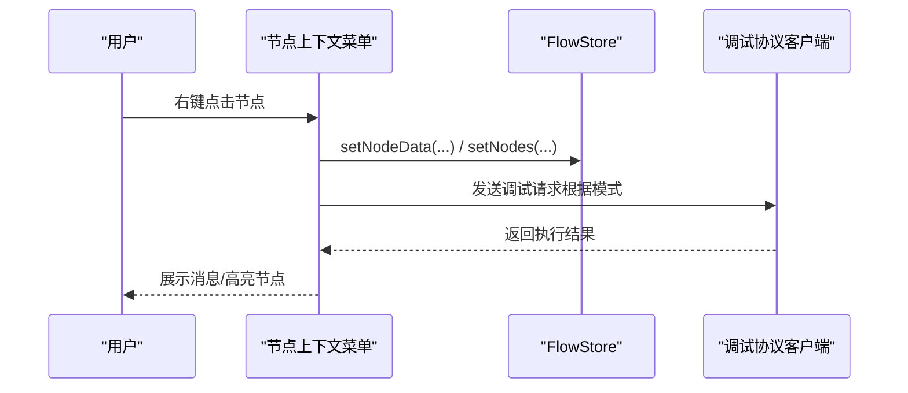
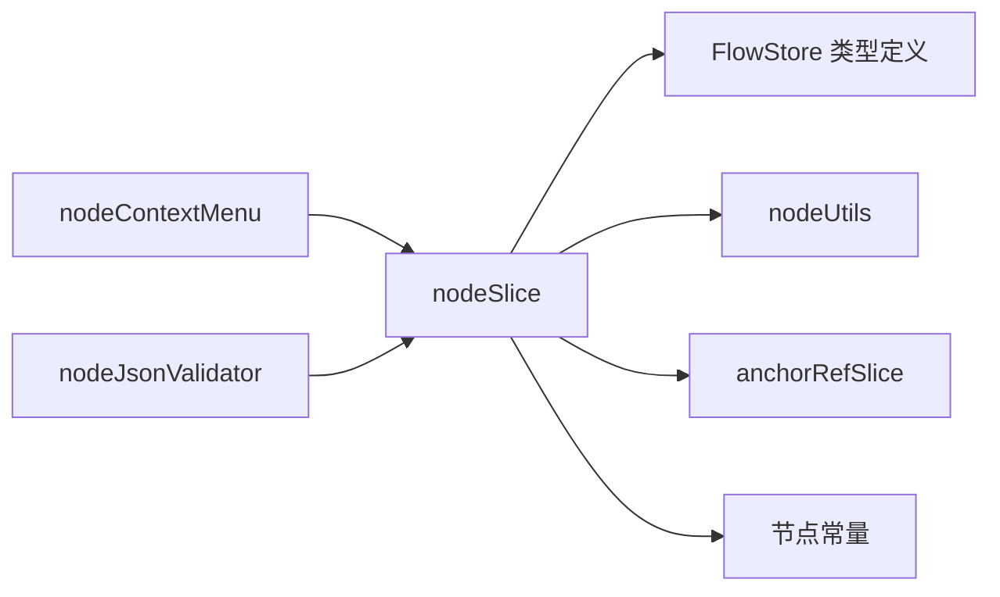

# 节点状态管理（nodeSlice）

<cite>
**本文档引用的文件**
- [nodeSlice.ts](file://src/stores/flow/slices/nodeSlice.ts)
- [index.ts](file://src/stores/flow/index.ts)
- [types.ts](file://src/stores/flow/types.ts)
- [nodeUtils.ts](file://src/stores/flow/utils/nodeUtils.ts)
- [anchorRefSlice.ts](file://src/stores/flow/slices/anchorRefSlice.ts)
- [nodeContextMenu.tsx](file://src/components/flow/nodes/nodeContextMenu.tsx)
- [constants.ts](file://src/components/flow/nodes/constants.ts)
- [nodeOperations.tsx](file://src/components/flow/nodes/utils/nodeOperations.tsx)
- [nodeJsonValidator.ts](file://src/utils/node/nodeJsonValidator.ts)
- [fieldTypes.ts](file://src/core/fields/fieldTypes.ts)
- [fieldFactory.ts](file://src/core/fields/fieldFactory.ts)
</cite>

## 目录
1. [简介](#简介)
2. [项目结构](#项目结构)
3. [核心组件](#核心组件)
4. [架构总览](#架构总览)
5. [详细组件分析](#详细组件分析)
6. [依赖分析](#依赖分析)
7. [性能考虑](#性能考虑)
8. [故障排查指南](#故障排查指南)
9. [结论](#结论)
10. [附录](#附录)

## 简介
本文件围绕前端状态管理中的“节点状态”进行系统化技术说明，重点聚焦于 nodeSlice 如何统一管理所有节点的数据与状态，涵盖节点的增删改查、批量操作、节点类型系统与数据验证、节点间依赖关系与约束检查，并提供扩展与自定义节点类型的实践指导，以及大规模节点场景下的性能优化策略。

## 项目结构
- 节点状态由 Zustand Store 的多个 Slice 组合而成，其中 nodeSlice 负责节点的生命周期与状态变更。
- 节点类型定义集中在 FlowStore 类型声明中，配合节点常量与工具函数形成完整的类型系统。
- 节点操作通过上下文菜单与工具函数落地，同时提供锚点引用索引与重复标签检查等约束能力。

**图表来源**
- [index.ts:18-28](file://src/stores/flow/index.ts#L18-L28)
- [nodeSlice.ts:36-718](file://src/stores/flow/slices/nodeSlice.ts#L36-L718)
- [types.ts:237-439](file://src/stores/flow/types.ts#L237-L439)
- [constants.ts:1-47](file://src/components/flow/nodes/constants.ts#L1-L47)
- [nodeUtils.ts:1-339](file://src/stores/flow/utils/nodeUtils.ts#L1-L339)
- [anchorRefSlice.ts:57-101](file://src/stores/flow/slices/anchorRefSlice.ts#L57-L101)

**章节来源**
- [index.ts:1-124](file://src/stores/flow/index.ts#L1-L124)
- [types.ts:1-439](file://src/stores/flow/types.ts#L1-L439)

## 核心组件
- 节点状态切片（nodeSlice）：负责节点的增删改、批量更新、分组/解组、计数器与历史记录等。
- 锚点引用索引（anchorRefSlice）：维护“锚点名称 → 使用该锚点的节点 ID 集合”的映射，支持高亮与查询。
- 节点工具（nodeUtils）：提供节点创建、查找、位置计算、重复标签检查、分组顺序保证等。
- 节点类型系统（types.ts + constants.ts）：统一定义节点类型、句柄类型、参数类型与节点数据结构。
- 节点上下文菜单（nodeContextMenu.tsx）：提供节点操作入口，如设置端点位置、颜色、删除、调试等。
- 数据验证（nodeJsonValidator.ts）：对节点 JSON 进行校验与修复，确保字段完整性与类型正确性。

**章节来源**
- [nodeSlice.ts:36-718](file://src/stores/flow/slices/nodeSlice.ts#L36-L718)
- [anchorRefSlice.ts:57-101](file://src/stores/flow/slices/anchorRefSlice.ts#L57-L101)
- [nodeUtils.ts:1-339](file://src/stores/flow/utils/nodeUtils.ts#L1-L339)
- [types.ts:1-439](file://src/stores/flow/types.ts#L1-L439)
- [constants.ts:1-47](file://src/components/flow/nodes/constants.ts#L1-L47)
- [nodeContextMenu.tsx:1-701](file://src/components/flow/nodes/nodeContextMenu.tsx#L1-L701)
- [nodeJsonValidator.ts:1-257](file://src/utils/node/nodeJsonValidator.ts#L1-L257)

## 架构总览
nodeSlice 作为 FlowStore 的一部分，通过不可变更新与浅拷贝策略保障 React Flow 的响应式渲染；同时与 anchorRefSlice 协作维护锚点引用索引，与 nodeUtils 协同完成节点创建与位置计算，与上下文菜单联动提供用户操作入口。

**图表来源**
- [nodeSlice.ts:310-414](file://src/stores/flow/slices/nodeSlice.ts#L310-L414)
- [anchorRefSlice.ts:68-73](file://src/stores/flow/slices/anchorRefSlice.ts#L68-L73)
- [nodeUtils.ts:1-339](file://src/stores/flow/utils/nodeUtils.ts#L1-L339)

## 详细组件分析

### 节点增删改查与批量操作
- 新增节点（addNode）
  - 根据类型生成唯一 ID 与标签，必要时避免重复。
  - 计算默认位置，支持连接到选中节点与聚焦画布。
  - 分配顺序号并保存历史记录。
- 更新节点（setNodeData）
  - 支持识别/动作参数、类型切换与 others 字段更新。
  - 类型切换时按字段键集合自动清理/填充必填参数。
  - 更新 others.anchor 时重建锚点索引。
- 批量更新（batchSetNodeData）
  - 一次性应用多条更新，减少多次不可变更新带来的开销。
  - 同样支持类型切换与锚点索引重建。
- 删除节点（updateNodes）
  - 删除前处理 Group 子节点脱离，清理选中状态与顺序。
  - 保存删除历史并重建锚点索引。
- 查询与定位（findNode*）
  - 提供按 ID/标签/索引的查找与选中节点筛选。

**图表来源**
- [nodeSlice.ts:310-414](file://src/stores/flow/slices/nodeSlice.ts#L310-L414)

**章节来源**
- [nodeSlice.ts:138-308](file://src/stores/flow/slices/nodeSlice.ts#L138-L308)
- [nodeSlice.ts:310-414](file://src/stores/flow/slices/nodeSlice.ts#L310-L414)
- [nodeSlice.ts:423-541](file://src/stores/flow/slices/nodeSlice.ts#L423-L541)
- [nodeUtils.ts:163-193](file://src/stores/flow/utils/nodeUtils.ts#L163-L193)

### 节点类型系统与数据结构
- 节点类型枚举（NodeTypeEnum）：pipeline、external、anchor、sticker、group。
- 句柄类型（SourceHandleTypeEnum、TargetHandleTypeEnum）：next、on_error、target、jump_back。
- 节点数据结构（PipelineNodeDataType、ExternalNodeDataType、AnchorNodeDataType、StickerNodeDataType、GroupNodeDataType）：统一字段组织与可扩展的 extras/others。
- 参数类型（RecognitionParamType、ActionParamType、OtherParamType）：通过字段工厂与类型枚举定义参数键与类型。

**图表来源**
- [constants.ts:14-20](file://src/components/flow/nodes/constants.ts#L14-L20)
- [types.ts:109-155](file://src/stores/flow/types.ts#L109-L155)

**章节来源**
- [constants.ts:1-47](file://src/components/flow/nodes/constants.ts#L1-L47)
- [types.ts:1-439](file://src/stores/flow/types.ts#L1-L439)
- [fieldTypes.ts:1-27](file://src/core/fields/fieldTypes.ts#L1-L27)
- [fieldFactory.ts:1-16](file://src/core/fields/fieldFactory.ts#L1-L16)

### 节点间依赖关系与约束检查
- 锚点引用索引（anchorRefSlice）
  - 从 Pipeline 节点的 others.anchor 提取名称，构建“锚点名 → 使用该锚点的节点 ID 集合”映射。
  - 支持高亮、查询与重建索引。
- 重复标签检查（checkRepeatNodeLabelList）
  - 跨类型同名视为冲突；同类型同名仅作为视觉副本不报错。
  - 导出配置时可添加前缀，避免 JSON key 冲突。
- 分组约束
  - Group 节点必须排在子节点之前，确保渲染与交互正确。
  - Group 子节点位置采用相对坐标，离开分组时转换为绝对坐标。

**图表来源**
- [anchorRefSlice.ts:12-55](file://src/stores/flow/slices/anchorRefSlice.ts#L12-L55)
- [nodeUtils.ts:228-279](file://src/stores/flow/utils/nodeUtils.ts#L228-L279)

**章节来源**
- [anchorRefSlice.ts:57-101](file://src/stores/flow/slices/anchorRefSlice.ts#L57-L101)
- [nodeUtils.ts:228-279](file://src/stores/flow/utils/nodeUtils.ts#L228-L279)
- [nodeUtils.ts:321-339](file://src/stores/flow/utils/nodeUtils.ts#L321-L339)

### 数据验证机制
- 节点 JSON 验证与修复（nodeJsonValidator）
  - 校验节点类型、数据结构完整性与必填字段。
  - 针对 Pipeline/External/Anchor 节点分别进行字段校验。
  - 返回验证结果与修复建议，确保后续渲染与导出稳定。

**图表来源**
- [nodeJsonValidator.ts:21-257](file://src/utils/node/nodeJsonValidator.ts#L21-L257)

**章节来源**
- [nodeJsonValidator.ts:1-257](file://src/utils/node/nodeJsonValidator.ts#L1-L257)

### 节点上下文菜单与操作入口
- 调试运行模式：支持从节点运行、单节点运行、仅识别、仅动作等模式。
- 节点属性：设置端点位置、颜色、复制节点名/内容、编辑 JSON、保存为模板等。
- 分组操作：解散分组、更改分组颜色、加入/移出分组。

**图表来源**
- [nodeContextMenu.tsx:140-170](file://src/components/flow/nodes/nodeContextMenu.tsx#L140-L170)
- [nodeContextMenu.tsx:233-451](file://src/components/flow/nodes/nodeContextMenu.tsx#L233-L451)

**章节来源**
- [nodeContextMenu.tsx:1-701](file://src/components/flow/nodes/nodeContextMenu.tsx#L1-L701)

### 扩展与自定义节点类型指导
- 新增节点类型步骤
  - 在 NodeTypeEnum 中新增类型枚举值。
  - 在 FlowStore 类型定义中添加对应节点类型与数据类型。
  - 在 nodeTypes 映射中注册渲染组件。
  - 在 nodeUtils 中实现 createXxxNode 工厂函数。
  - 在 nodeSlice 中扩展 addNode 与 setNodeData 的类型分支。
  - 在字段系统中补充参数键与类型定义（如需）。
- 注意事项
  - 保持数据结构一致性与可序列化。
  - 若涉及锚点或分组，同步更新索引与约束检查逻辑。
  - 为新类型提供默认参数与可视化样式。

**章节来源**
- [constants.ts:14-20](file://src/components/flow/nodes/constants.ts#L14-L20)
- [types.ts:157-235](file://src/stores/flow/types.ts#L157-L235)
- [nodeUtils.ts:15-161](file://src/stores/flow/utils/nodeUtils.ts#L15-L161)
- [nodeSlice.ts:224-252](file://src/stores/flow/slices/nodeSlice.ts#L224-L252)
- [fieldTypes.ts:1-27](file://src/core/fields/fieldTypes.ts#L1-L27)

## 依赖分析
- nodeSlice 依赖
  - FlowStore 类型定义：确保节点数据结构与接口一致。
  - nodeUtils：节点创建、查找、位置计算、重复检查、分组顺序保证。
  - anchorRefSlice：锚点索引重建与高亮。
  - constants：节点类型与句柄类型。
- 交互依赖
  - nodeContextMenu：用户操作入口，驱动 nodeSlice 的状态变更。
  - nodeJsonValidator：导入/修复节点数据，保障一致性。

**图表来源**
- [nodeSlice.ts:1-35](file://src/stores/flow/slices/nodeSlice.ts#L1-L35)
- [index.ts:18-28](file://src/stores/flow/index.ts#L18-L28)

**章节来源**
- [index.ts:1-124](file://src/stores/flow/index.ts#L1-L124)

## 性能考虑
- 不可变更新与浅拷贝
  - setNodeData/batchSetNodeData 采用深拷贝关键字段，避免意外共享导致的渲染问题。
- 批量更新
  - 使用 batchSetNodeData 合并多次更新，降低多次不可变更新的开销。
- 索引重建
  - 仅在锚点字段或节点列表变化时重建锚点索引，避免频繁全量扫描。
- 重复检查
  - 在节点名变更后触发重复检查，及时发现并提示冲突。
- 分组顺序
  - ensureGroupNodeOrder 保证 Group 在子节点之前，减少渲染与交互异常。

**章节来源**
- [nodeSlice.ts:310-414](file://src/stores/flow/slices/nodeSlice.ts#L310-L414)
- [nodeSlice.ts:423-541](file://src/stores/flow/slices/nodeSlice.ts#L423-L541)
- [anchorRefSlice.ts:68-73](file://src/stores/flow/slices/anchorRefSlice.ts#L68-L73)
- [nodeUtils.ts:321-339](file://src/stores/flow/utils/nodeUtils.ts#L321-L339)

## 故障排查指南
- 节点名重复
  - 现象：出现重复标签提示。
  - 处理：修改标签或启用导出前缀，避免跨类型冲突。
- 锚点引用异常
  - 现象：锚点高亮无效或查询不到节点。
  - 处理：检查 others.anchor 格式（字符串/数组/对象），重建索引。
- 分组位置异常
  - 现象：子节点层级错误或渲染异常。
  - 处理：确保 Group 在子节点之前，必要时调用 ensureGroupNodeOrder。
- 调试运行失败
  - 现象：调试请求发送失败或资源检测异常。
  - 处理：检查本地桥连接、设备连接状态与资源路径配置。

**章节来源**
- [index.ts:84-104](file://src/stores/flow/index.ts#L84-L104)
- [anchorRefSlice.ts:68-73](file://src/stores/flow/slices/anchorRefSlice.ts#L68-L73)
- [nodeUtils.ts:321-339](file://src/stores/flow/utils/nodeUtils.ts#L321-L339)
- [nodeContextMenu.tsx:373-397](file://src/components/flow/nodes/nodeContextMenu.tsx#L373-L397)

## 结论
nodeSlice 通过清晰的状态模型与严格的约束检查，实现了对节点全生命周期的可靠管理。结合锚点索引、重复检查与批量更新等机制，在保证数据一致性的同时提升了用户体验与可扩展性。对于大规模节点场景，建议优先采用批量更新、延迟重建索引与合理的分组策略，以获得更佳性能。

## 附录
- 常用操作速查
  - 新增节点：addNode({ type, data, position, select, link, focus })
  - 更新节点：setNodeData(id, type, key, value)
  - 批量更新：batchSetNodeData(id, updates[])
  - 删除节点：updateNodes([{ type: "remove", id }])
  - 分组操作：groupSelectedNodes()/ungroupNodes()/attach/detach
  - 锚点索引：rebuildAnchorReferenceIndex()/getNodesUsingAnchor()

**章节来源**
- [nodeSlice.ts:138-718](file://src/stores/flow/slices/nodeSlice.ts#L138-L718)
- [anchorRefSlice.ts:68-101](file://src/stores/flow/slices/anchorRefSlice.ts#L68-L101)