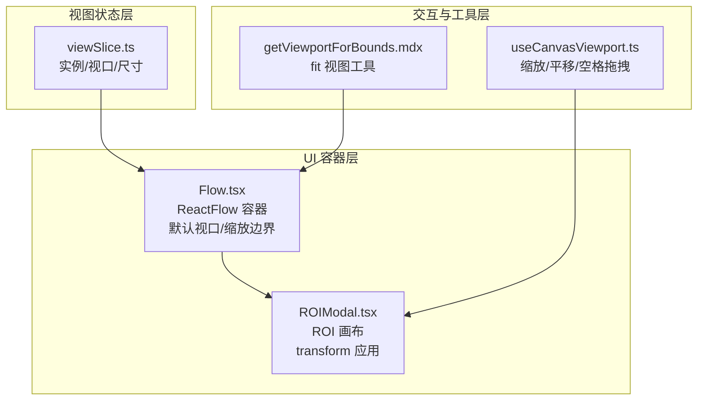
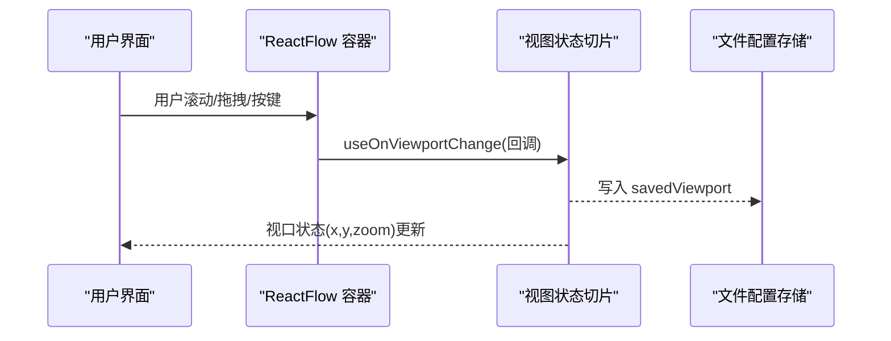
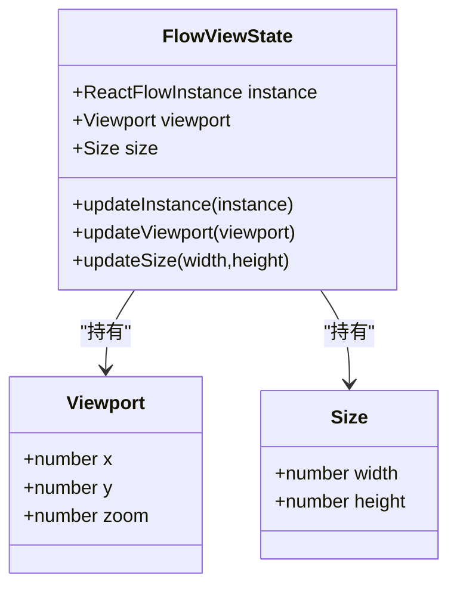
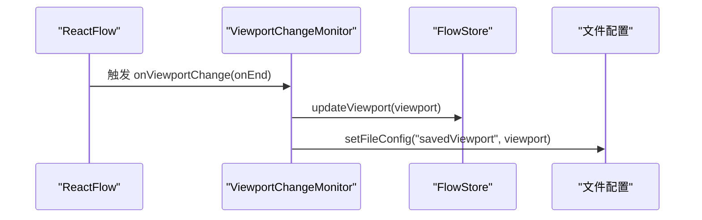
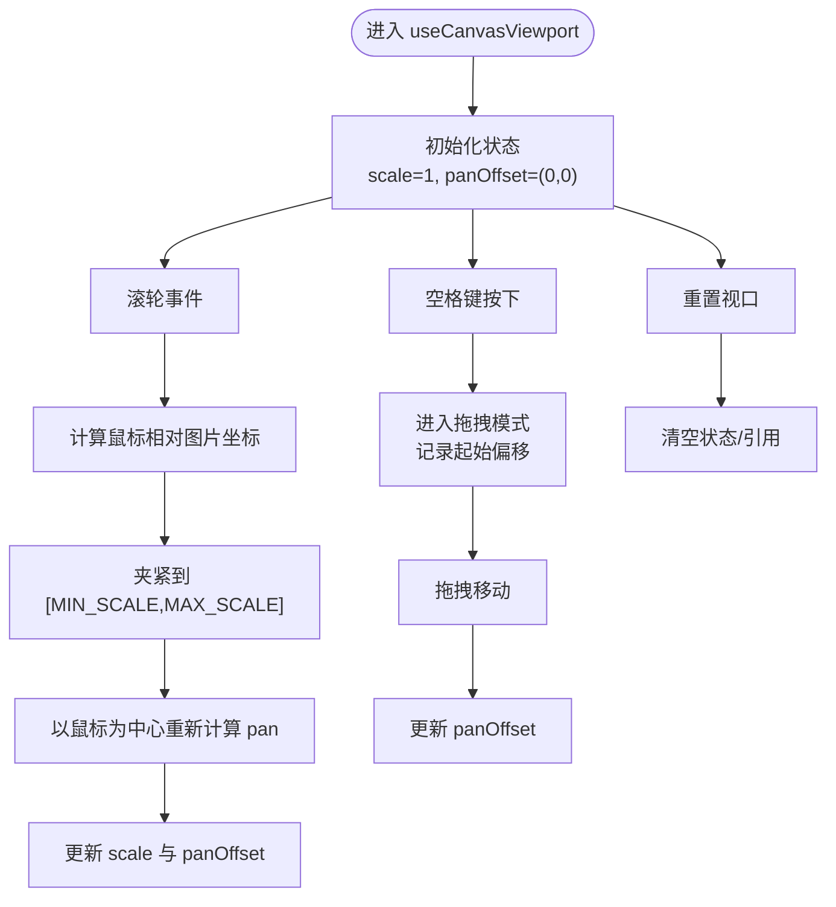
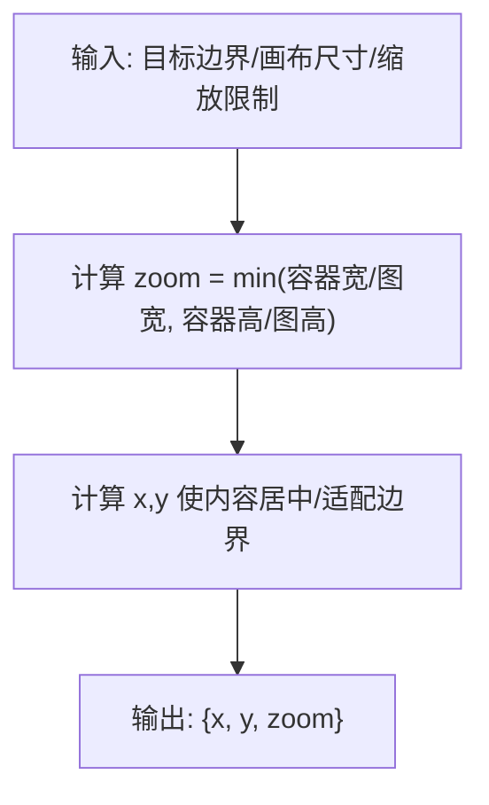
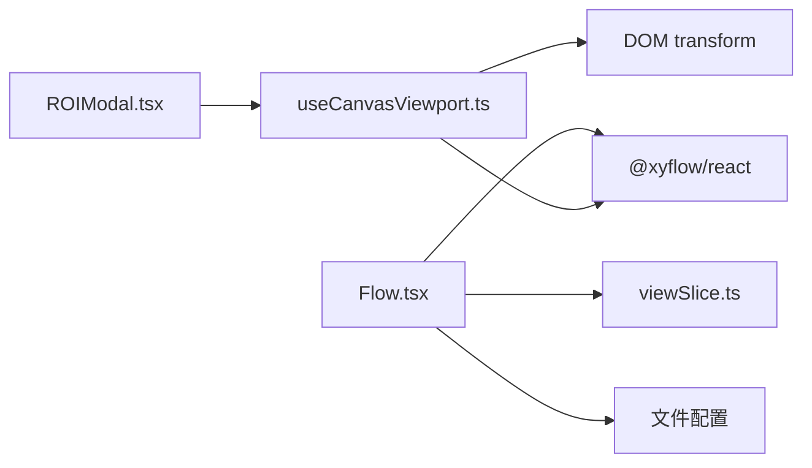

# 视图状态管理（viewSlice）

<cite>
**本文引用的文件**
- [src/stores/flow/slices/viewSlice.ts](file://src/stores/flow/slices/viewSlice.ts)
- [src/components/Flow.tsx](file://src/components/Flow.tsx)
- [src/hooks/useCanvasViewport.ts](file://src/hooks/useCanvasViewport.ts)
- [src/components/modals/ROIModal.tsx](file://src/components/modals/ROIModal.tsx)
- [dev/instructions/react-flow/api-reference/utils/get-viewport-for-bounds.mdx](file://dev/instructions/react-flow/api-reference/utils/get-viewport-for-bounds.mdx)
- [dev/instructions/react-flow/api-reference/types/viewport.mdx](file://dev/instructions/react-flow/api-reference/types/viewport.mdx)
- [dev/instructions/react-flow/learn/advanced-use/devtools-and-debugging.mdx](file://dev/instructions/react-flow/learn/advanced-use/devtools-and-debugging.mdx)
- [dev/instructions/react-flow/api-reference/hooks/use-store.mdx](file://dev/instructions/react-flow/api-reference/hooks/use-store.mdx)
- [dev/instructions/react-flow/learn/troubleshooting/migrate-to-v10.mdx](file://dev/instructions/react-flow/learn/troubleshooting/migrate-to-v10.mdx)
</cite>

## 目录
1. [引言](#引言)
2. [项目结构](#项目结构)
3. [核心组件](#核心组件)
4. [架构总览](#架构总览)
5. [详细组件分析](#详细组件分析)
6. [依赖分析](#依赖分析)
7. [性能考量](#性能考量)
8. [故障排查指南](#故障排查指南)
9. [结论](#结论)
10. [附录](#附录)

## 引言
本文件聚焦于“视图状态管理（viewSlice）”的技术文档，系统阐述画布视图状态的管理方式，包括缩放级别、平移位置、视口边界等；解析视图变换矩阵的计算与应用；说明 fitFlowView 等视图操作工具函数的实现原理；阐明视图状态与其他 slice 的交互关系；并提供扩展与自定义视图行为的实践建议及性能优化与用户体验改进建议。

## 项目结构
围绕视图状态管理的关键文件与模块如下：
- 视图状态切片：负责维护 ReactFlow 实例、视口（x, y, zoom）、画布尺寸（width, height）
- Flow 主容器：订阅视口变化并持久化到文件配置；提供默认视口与缩放边界
- Canvas 视口 Hook：封装截图画布的缩放、平移、空格拖拽、滚轮缩放等交互
- ROI 模态：基于平移与缩放的 transform 应用示例
- React Flow 文档与工具：提供 viewport 类型、fit 视图工具与内部 transform 存储机制

图表来源
- [src/stores/flow/slices/viewSlice.ts:1-27](file://src/stores/flow/slices/viewSlice.ts#L1-L27)
- [src/components/Flow.tsx:145-157](file://src/components/Flow.tsx#L145-L157)
- [src/hooks/useCanvasViewport.ts:1-307](file://src/hooks/useCanvasViewport.ts#L1-L307)
- [src/components/modals/ROIModal.tsx:267-301](file://src/components/modals/ROIModal.tsx#L267-L301)
- [dev/instructions/react-flow/api-reference/utils/get-viewport-for-bounds.mdx:1-49](file://dev/instructions/react-flow/api-reference/utils/get-viewport-for-bounds.mdx#L1-L49)

章节来源
- [src/stores/flow/slices/viewSlice.ts:1-27](file://src/stores/flow/slices/viewSlice.ts#L1-L27)
- [src/components/Flow.tsx:145-157](file://src/components/Flow.tsx#L145-L157)
- [src/hooks/useCanvasViewport.ts:1-307](file://src/hooks/useCanvasViewport.ts#L1-L307)
- [src/components/modals/ROIModal.tsx:267-301](file://src/components/modals/ROIModal.tsx#L267-L301)
- [dev/instructions/react-flow/api-reference/utils/get-viewport-for-bounds.mdx:1-49](file://dev/instructions/react-flow/api-reference/utils/get-viewport-for-bounds.mdx#L1-L49)

## 核心组件
- 视图状态切片（viewSlice）
  - 维护 ReactFlow 实例、当前视口（x, y, zoom）、画布尺寸（width, height）
  - 提供更新实例、视口与尺寸的方法
- Flow 容器
  - 使用 useOnViewportChange 订阅视口变化，写回视图状态并持久化到文件配置
  - 设置默认视口与最小/最大缩放边界
- Canvas 视口 Hook（useCanvasViewport）
  - 管理缩放（含滚轮缩放、+/- 按钮、重置）、平移（空格拖拽、中键拖拽）、初始缩放
  - 提供初始化图片、重置视口、光标样式辅助等能力
- ROI 模态
  - 通过 transform: translate(...) scale(...) 应用平移与缩放
- fit 视图工具
  - 提供计算目标视口（x, y, zoom）的工具函数，便于预计算或无副作用地获取视口

章节来源
- [src/stores/flow/slices/viewSlice.ts:1-27](file://src/stores/flow/slices/viewSlice.ts#L1-L27)
- [src/components/Flow.tsx:145-157](file://src/components/Flow.tsx#L145-L157)
- [src/hooks/useCanvasViewport.ts:1-307](file://src/hooks/useCanvasViewport.ts#L1-L307)
- [src/components/modals/ROIModal.tsx:267-301](file://src/components/modals/ROIModal.tsx#L267-L301)
- [dev/instructions/react-flow/api-reference/utils/get-viewport-for-bounds.mdx:1-49](file://dev/instructions/react-flow/api-reference/utils/get-viewport-for-bounds.mdx#L1-L49)

## 架构总览
视图状态在 Flow 容器中被订阅并写回全局状态，同时支持外部工具（如 fit 视图）按需计算视口而不直接改变状态。Canvas 视口 Hook 为独立场景（如 ROI 画布）提供一致的缩放/平移体验。

图表来源
- [src/components/Flow.tsx:145-157](file://src/components/Flow.tsx#L145-L157)
- [src/stores/flow/slices/viewSlice.ts:18-21](file://src/stores/flow/slices/viewSlice.ts#L18-L21)

章节来源
- [src/components/Flow.tsx:145-157](file://src/components/Flow.tsx#L145-L157)
- [src/stores/flow/slices/viewSlice.ts:18-21](file://src/stores/flow/slices/viewSlice.ts#L18-L21)

## 详细组件分析

### 视图状态切片（viewSlice）
- 职责
  - 维护 instance、viewport、size 三要素
  - 提供 updateInstance、updateViewport、updateSize 方法
- 数据结构
  - viewport: { x: number; y: number; zoom: number }
  - size: { width: number; height: number }
- 与 React Flow 的关系
  - 通过 useReactFlow 获取实例，通过 useOnViewportChange 推送视口变化
  - 与文件配置联动，保存/恢复视口

图表来源
- [src/stores/flow/slices/viewSlice.ts:1-27](file://src/stores/flow/slices/viewSlice.ts#L1-L27)

章节来源
- [src/stores/flow/slices/viewSlice.ts:1-27](file://src/stores/flow/slices/viewSlice.ts#L1-L27)

### Flow 容器与视口订阅
- 默认视口与缩放边界
  - 设置 defaultViewport 与 minZoom/maxZoom，约束初始与交互范围
- 视口变化监听
  - 使用 useOnViewportChange 订阅 onEnd 事件，写回视口并持久化到文件配置
- 与文件配置的交互
  - setFileConfig("savedViewport", { ...viewport }) 将视口写入当前文件配置

图表来源
- [src/components/Flow.tsx:145-157](file://src/components/Flow.tsx#L145-L157)

章节来源
- [src/components/Flow.tsx:145-157](file://src/components/Flow.tsx#L145-L157)

### Canvas 视口 Hook（useCanvasViewport）
- 状态与行为
  - 缩放：MIN_SCALE/MAX_SCALE/ZOOM_STEP 控制；滚轮缩放以鼠标位置为中心
  - 平移：空格键按下或中键按下进入拖拽模式；记录起始偏移并实时更新 panOffset
  - 初始化：根据容器与图片尺寸计算 initialScale，并居中显示
  - 重置：恢复 scale=1、panOffset=(0,0)，清理拖拽状态
- 与 ROI 画布的集成
  - 通过 style.transform: translate(x,y) scale(zoom) 应用平移与缩放
- 光标样式
  - 根据 isPanning/isSpacePressed/isMiddleMouseDown 返回 grab/grabbing 或 undefined

图表来源
- [src/hooks/useCanvasViewport.ts:123-158](file://src/hooks/useCanvasViewport.ts#L123-L158)
- [src/hooks/useCanvasViewport.ts:217-249](file://src/hooks/useCanvasViewport.ts#L217-L249)
- [src/hooks/useCanvasViewport.ts:251-260](file://src/hooks/useCanvasViewport.ts#L251-L260)

章节来源
- [src/hooks/useCanvasViewport.ts:1-307](file://src/hooks/useCanvasViewport.ts#L1-L307)
- [src/components/modals/ROIModal.tsx:267-301](file://src/components/modals/ROIModal.tsx#L267-L301)

### fit 视图工具与视图变换矩阵
- 工具函数
  - getViewportForBounds：根据给定边界与画布尺寸计算合适的视口（x, y, zoom），常用于预计算或无副作用场景
- 视图变换矩阵
  - React Flow 内部以 transform（与 d3-zoom 的 transform 同名）存储视口信息
  - viewport 与 transform 字段语义相同，但代表不同含义，需避免混淆
- 与 React Flow 的关系
  - 可通过 useStore 或 useStoreApi 获取内部 transform，或使用 React Flow 提供的 fitView/fitBounds 方法

图表来源
- [dev/instructions/react-flow/api-reference/utils/get-viewport-for-bounds.mdx:10-49](file://dev/instructions/react-flow/api-reference/utils/get-viewport-for-bounds.mdx#L10-L49)
- [dev/instructions/react-flow/api-reference/types/viewport.mdx:1-23](file://dev/instructions/react-flow/api-reference/types/viewport.mdx#L1-L23)
- [dev/instructions/react-flow/learn/advanced-use/devtools-and-debugging.mdx:78-89](file://dev/instructions/react-flow/learn/advanced-use/devtools-and-debugging.mdx#L78-L89)

章节来源
- [dev/instructions/react-flow/api-reference/utils/get-viewport-for-bounds.mdx:1-49](file://dev/instructions/react-flow/api-reference/utils/get-viewport-for-bounds.mdx#L1-L49)
- [dev/instructions/react-flow/api-reference/types/viewport.mdx:1-23](file://dev/instructions/react-flow/api-reference/types/viewport.mdx#L1-L23)
- [dev/instructions/react-flow/learn/advanced-use/devtools-and-debugging.mdx:78-89](file://dev/instructions/react-flow/learn/advanced-use/devtools-and-debugging.mdx#L78-L89)

### 视图状态与其他 slice 的交互
- 与 FlowStore 的交互
  - Flow 容器通过 useOnViewportChange 将视口写回 FlowStore 的 viewSlice
  - FlowStore 的其他 slice（如 nodes/edges/selection）可读取 viewport 以进行对齐、吸附等逻辑
- 与文件配置的交互
  - 视口变化后写入文件配置的 savedViewport，以便下次打开时恢复
- 与 React Flow 内部状态的关系
  - 可通过 useStore/useStoreApi 访问内部 transform，或使用 fitView/fitBounds 等方法

章节来源
- [src/components/Flow.tsx:145-157](file://src/components/Flow.tsx#L145-L157)
- [dev/instructions/react-flow/api-reference/hooks/use-store.mdx:1-74](file://dev/instructions/react-flow/api-reference/hooks/use-store.mdx#L1-L74)
- [dev/instructions/react-flow/learn/troubleshooting/migrate-to-v10.mdx:211-246](file://dev/instructions/react-flow/learn/troubleshooting/migrate-to-v10.mdx#L211-L246)

## 依赖分析
- 组件耦合
  - Flow.tsx 依赖 viewSlice 的 updateViewport 与文件配置存储
  - useCanvasViewport 与 ROI 模态解耦于 FlowStore，通过自身状态驱动 DOM transform
- 外部依赖
  - @xyflow/react 提供 ReactFlow、useOnViewportChange、fit 视图工具与内部状态访问
  - 文档与指南明确 viewport/transform 的概念与使用方式

图表来源
- [src/components/Flow.tsx:145-157](file://src/components/Flow.tsx#L145-L157)
- [src/stores/flow/slices/viewSlice.ts:1-27](file://src/stores/flow/slices/viewSlice.ts#L1-L27)
- [src/hooks/useCanvasViewport.ts:1-307](file://src/hooks/useCanvasViewport.ts#L1-L307)
- [src/components/modals/ROIModal.tsx:267-301](file://src/components/modals/ROIModal.tsx#L267-L301)

章节来源
- [src/components/Flow.tsx:145-157](file://src/components/Flow.tsx#L145-L157)
- [src/stores/flow/slices/viewSlice.ts:1-27](file://src/stores/flow/slices/viewSlice.ts#L1-L27)
- [src/hooks/useCanvasViewport.ts:1-307](file://src/hooks/useCanvasViewport.ts#L1-L307)
- [src/components/modals/ROIModal.tsx:267-301](file://src/components/modals/ROIModal.tsx#L267-L301)

## 性能考量
- 视口订阅与持久化
  - 使用 useOnViewportChange 的 onEnd 钩子减少频繁写入
  - 对视口变化进行去抖（debounce）以降低写入频率
- 计算复杂度
  - fit 视图工具为 O(1) 计算，适合在渲染前预计算
- DOM 变换
  - ROI 画布通过 transform 应用缩放与平移，避免重排与重绘
- 交互响应
  - 滚轮缩放与拖拽采用节流/去抖策略，提升流畅度

章节来源
- [src/components/Flow.tsx:173-186](file://src/components/Flow.tsx#L173-L186)
- [src/hooks/useCanvasViewport.ts:123-158](file://src/hooks/useCanvasViewport.ts#L123-L158)
- [src/components/modals/ROIModal.tsx:267-301](file://src/components/modals/ROIModal.tsx#L267-L301)

## 故障排查指南
- 视口不生效或跳变
  - 检查是否正确使用 useOnViewportChange 的 onEnd 钩子
  - 确认 defaultViewport 与 minZoom/maxZoom 设置合理
- 缩放中心异常
  - 确保滚轮缩放时正确计算鼠标相对图片坐标，并以该点为中心调整 panOffset
- 无法获取内部 transform
  - 使用 useStore 或 useStoreApi 访问内部状态；注意 viewport 与 transform 的区别
- fit 视图结果不符合预期
  - 使用 getViewportForBounds 预计算视口，确认边界与画布尺寸参数

章节来源
- [src/components/Flow.tsx:145-157](file://src/components/Flow.tsx#L145-L157)
- [src/hooks/useCanvasViewport.ts:123-158](file://src/hooks/useCanvasViewport.ts#L123-L158)
- [dev/instructions/react-flow/api-reference/hooks/use-store.mdx:1-74](file://dev/instructions/react-flow/api-reference/hooks/use-store.mdx#L1-L74)
- [dev/instructions/react-flow/api-reference/utils/get-viewport-for-bounds.mdx:1-49](file://dev/instructions/react-flow/api-reference/utils/get-viewport-for-bounds.mdx#L1-L49)

## 结论
viewSlice 通过简洁的状态模型与 React Flow 的视口订阅机制，实现了稳定的画布视图管理。结合 useCanvasViewport 与 ROI 画布的 transform 应用，既满足通用工作流编辑场景，又为独立画布交互提供了灵活扩展。配合 fit 视图工具与文件配置持久化，可在性能与用户体验之间取得良好平衡。

## 附录
- 扩展与自定义建议
  - 自定义 fit 行为：基于 getViewportForBounds 计算目标视口，再调用 React Flow 的 fitView/fitBounds
  - 自定义拖拽行为：在 useCanvasViewport 中扩展拖拽起点与偏移计算逻辑
  - 自定义缩放策略：引入多步缩放曲线或基于手势的缩放算法
- 最佳实践
  - 将视口变化与文件配置解耦，优先使用无副作用的工具函数进行预计算
  - 对高频交互（滚轮、拖拽）进行节流/去抖，避免过度重渲染
  - 明确 viewport 与 transform 的语义差异，避免误用导致视觉错位