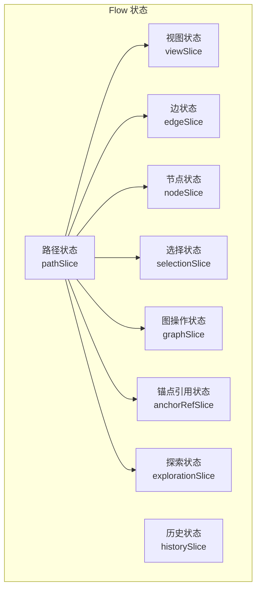
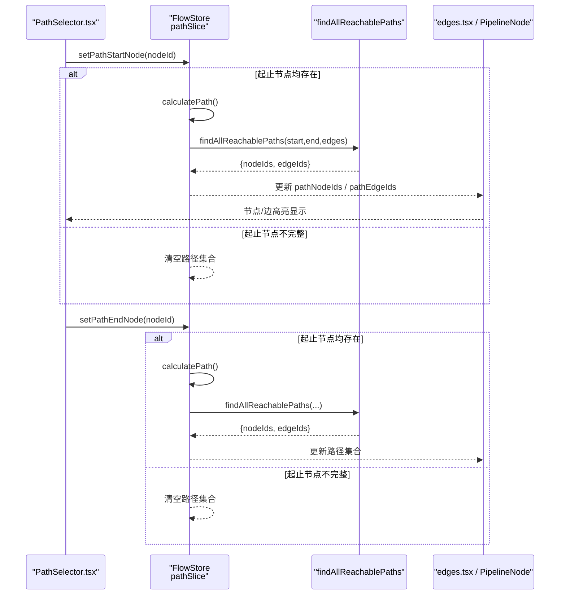
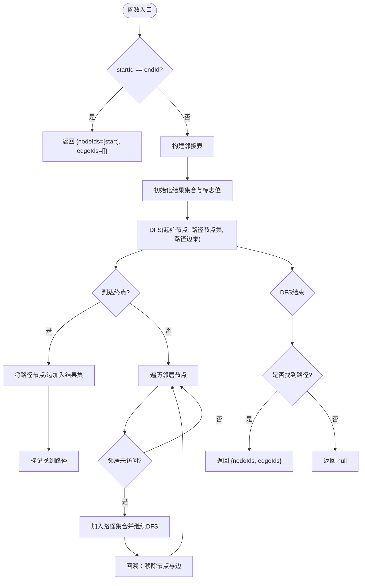
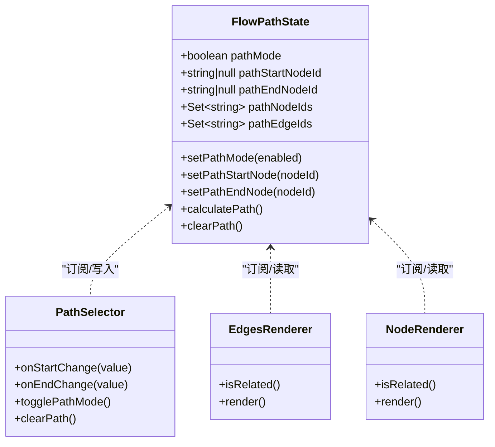
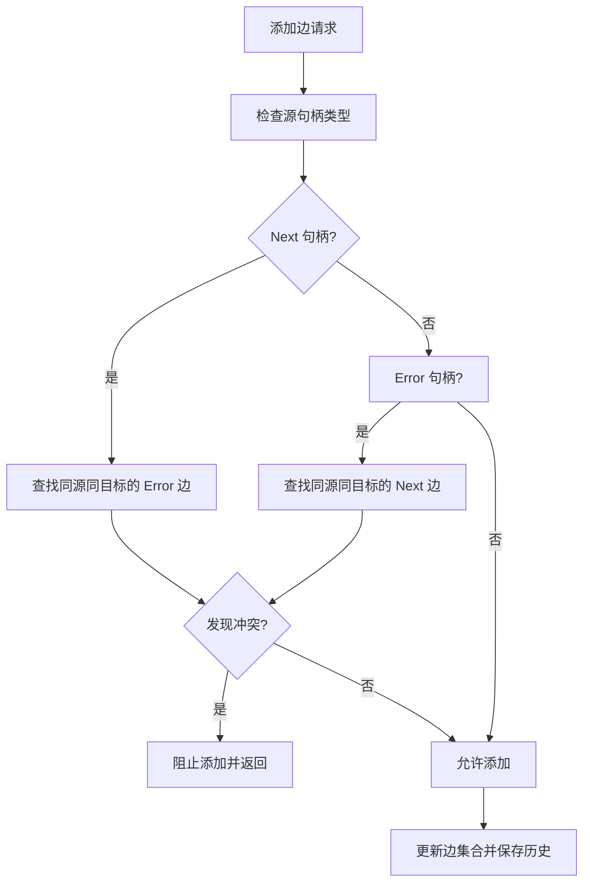
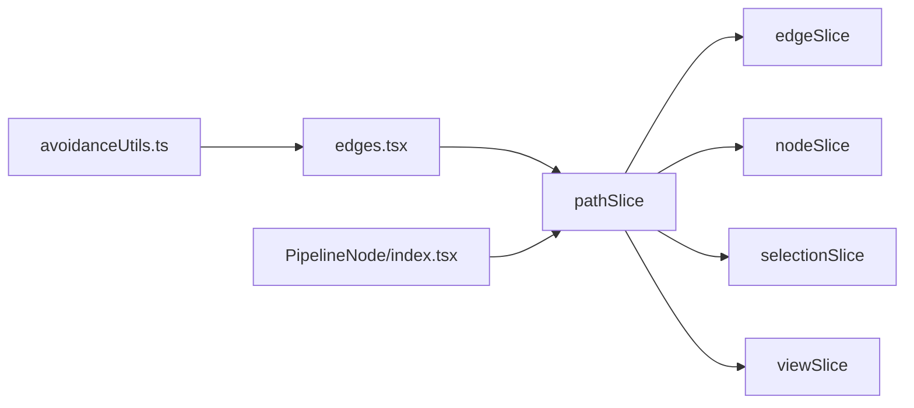

# 路径状态管理（pathSlice）

<cite>
**本文档引用的文件**
- [pathSlice.ts](file://src/stores/flow/slices/pathSlice.ts)
- [types.ts](file://src/stores/flow/types.ts)
- [index.ts](file://src/stores/flow/index.ts)
- [PathSelector.tsx](file://src/components/panels/tools/PathSelector.tsx)
- [edges.tsx](file://src/components/flow/edges.tsx)
- [PipelineNode/index.tsx](file://src/components/flow/nodes/PipelineNode/index.tsx)
- [edgeSlice.ts](file://src/stores/flow/slices/edgeSlice.ts)
- [avoidanceUtils.ts](file://src/core/avoidanceUtils.ts)
</cite>

## 目录
1. [简介](#简介)
2. [项目结构](#项目结构)
3. [核心组件](#核心组件)
4. [架构总览](#架构总览)
5. [详细组件分析](#详细组件分析)
6. [依赖分析](#依赖分析)
7. [性能考量](#性能考量)
8. [故障排查指南](#故障排查指南)
9. [结论](#结论)
10. [附录](#附录)

## 简介
本文件围绕“路径状态管理”展开，系统性阐述 pathSlice 如何管理节点间的路径信息，覆盖以下关键主题：
- pathSlice 如何基于图数据维护路径模式、起止节点与路径集合
- 路径计算与“可达路径”遍历算法（DFS）
- 路径缓存与增量更新机制（基于状态与选择器的最小化订阅）
- 路径验证与冲突检测（边层面的冲突检查）
- 路径状态扩展与自定义路径分析的实现指导
- 路径性能优化与动态路径更新技巧

## 项目结构
pathSlice 是 FlowStore 的一部分，位于 flow 状态管理子系统中，与节点、边、选择、历史等 slice 协同工作。其职责是：
- 维护路径模式开关与起止节点
- 在起止节点确定后，计算从起点到终点的所有可达路径上的节点与边集合
- 将路径状态暴露给 UI，驱动节点与边的视觉高亮

图表来源
- [index.ts:18-28](file://src/stores/flow/index.ts#L18-L28)
- [types.ts:429-439](file://src/stores/flow/types.ts#L429-L439)

章节来源
- [index.ts:18-28](file://src/stores/flow/index.ts#L18-L28)
- [types.ts:429-439](file://src/stores/flow/types.ts#L429-L439)

## 核心组件
- 路径状态接口 FlowPathState
  - 字段：pathMode、pathStartNodeId、pathEndNodeId、pathNodeIds、pathEdgeIds
  - 方法：setPathMode、setPathStartNode、setPathEndNode、calculatePath、clearPath
- 路径计算函数 findAllReachablePaths
  - 输入：起始节点ID、结束节点ID、边数组
  - 输出：节点ID集合与边ID集合；若无路径则返回空
- 路径 Slice 创建器 createPathSlice
  - 将上述状态与方法注入 FlowStore
- UI 集成
  - PathSelector.tsx：提供路径模式开关与起止节点选择
  - edges.tsx 与 PipelineNode/index.tsx：根据 pathMode 与 pathNodeIds/pathEdgeIds 高亮渲染

章节来源
- [types.ts:341-353](file://src/stores/flow/types.ts#L341-L353)
- [pathSlice.ts:9-87](file://src/stores/flow/slices/pathSlice.ts#L9-L87)
- [pathSlice.ts:89-158](file://src/stores/flow/slices/pathSlice.ts#L89-L158)
- [PathSelector.tsx:7-119](file://src/components/panels/tools/PathSelector.tsx#L7-L119)
- [edges.tsx:520-622](file://src/components/flow/edges.tsx#L520-L622)
- [PipelineNode/index.tsx:77-150](file://src/components/flow/nodes/PipelineNode/index.tsx#L77-L150)

## 架构总览
pathSlice 的工作流由“状态变更 → 计算 → 渲染高亮”三部分组成。

图表来源
- [PathSelector.tsx:18-29](file://src/components/panels/tools/PathSelector.tsx#L18-L29)
- [pathSlice.ts:105-127](file://src/stores/flow/slices/pathSlice.ts#L105-L127)
- [pathSlice.ts:129-147](file://src/stores/flow/slices/pathSlice.ts#L129-L147)
- [pathSlice.ts:9-87](file://src/stores/flow/slices/pathSlice.ts#L9-L87)
- [edges.tsx:520-622](file://src/components/flow/edges.tsx#L520-L622)
- [PipelineNode/index.tsx:77-150](file://src/components/flow/nodes/PipelineNode/index.tsx#L77-L150)

## 详细组件分析

### 路径计算与可达路径遍历（DFS）
- 数据结构
  - 邻接表：以 Map<sourceId, {nodeId, edgeId}[]> 构建，便于 O(1) 获取邻居
  - 路径追踪：使用 Set 记录当前 DFS 路径上的节点与边，避免环路
- 算法流程
  - 若 startId === endId，直接返回包含起点的节点集合与空边集合
  - 构建邻接表
  - DFS 递归遍历，遇到 endId 时将当前路径上的节点与边加入结果集
  - 返回是否存在任意一条从起点到终点的路径
- 时间复杂度
  - 邻接表构建：O(E)
  - DFS 最坏情况：O(V + E)，其中 V 为节点数，E 为边数
- 空间复杂度
  - 邻接表：O(V + E)
  - 递归栈深度：O(V)

图表来源
- [pathSlice.ts:9-87](file://src/stores/flow/slices/pathSlice.ts#L9-L87)

章节来源
- [pathSlice.ts:9-87](file://src/stores/flow/slices/pathSlice.ts#L9-L87)

### 路径状态与 UI 集成
- 状态字段
  - pathMode：布尔，控制是否启用路径模式
  - pathStartNodeId / pathEndNodeId：起止节点 ID
  - pathNodeIds / pathEdgeIds：Set，存储路径上的节点与边 ID
- 计算触发
  - setPathStartNode 与 setPathEndNode 在两端均有效时调用 calculatePath
  - calculatePath 读取 edges 并执行 DFS，更新 pathNodeIds 与 pathEdgeIds
- 渲染高亮
  - edges.tsx：当 pathMode 为真且 pathEdgeIds 存在时，对应边高亮
  - PipelineNode/index.tsx：当 pathMode 为真且 pathNodeIds 包含当前节点时，当前节点高亮

图表来源
- [types.ts:341-353](file://src/stores/flow/types.ts#L341-L353)
- [PathSelector.tsx:18-29](file://src/components/panels/tools/PathSelector.tsx#L18-L29)
- [edges.tsx:520-622](file://src/components/flow/edges.tsx#L520-L622)
- [PipelineNode/index.tsx:77-150](file://src/components/flow/nodes/PipelineNode/index.tsx#L77-L150)

章节来源
- [types.ts:341-353](file://src/stores/flow/types.ts#L341-L353)
- [PathSelector.tsx:7-119](file://src/components/panels/tools/PathSelector.tsx#L7-L119)
- [edges.tsx:520-622](file://src/components/flow/edges.tsx#L520-L622)
- [PipelineNode/index.tsx:77-150](file://src/components/flow/nodes/PipelineNode/index.tsx#L77-L150)

### 路径缓存与增量更新机制
- 缓存策略
  - pathNodeIds 与 pathEdgeIds 作为 Set 缓存当前路径结果
  - 仅在起止节点与边集合发生变化时重新计算
- 增量更新
  - setPathStartNode 与 setPathEndNode 采用浅比较与条件触发，避免不必要的计算
  - calculatePath 仅在两端均有效时执行 DFS
- UI 选择器
  - edges.tsx 与 PipelineNode/index.tsx 使用 useShallow 选择器，仅在 pathMode、pathNodeIds、pathEdgeIds 变化时重渲染

章节来源
- [pathSlice.ts:105-127](file://src/stores/flow/slices/pathSlice.ts#L105-L127)
- [pathSlice.ts:129-147](file://src/stores/flow/slices/pathSlice.ts#L129-L147)
- [edges.tsx:520-622](file://src/components/flow/edges.tsx#L520-L622)
- [PipelineNode/index.tsx:77-150](file://src/components/flow/nodes/PipelineNode/index.tsx#L77-L150)

### 路径验证与冲突检测逻辑
- 边层面冲突检测
  - edgeSlice.ts 中在添加边时，针对 SourceHandleTypeEnum.Next 与 SourceHandleTypeEnum.Error 的互斥约束进行检查
  - 若冲突，阻止新增边并保持状态不变
- 路径层面验证
  - pathSlice 不直接进行冲突检测，但 DFS 会遍历现有边集合，确保只考虑图中真实存在的边
  - 若起止节点不存在或边集合为空，calculatePath 将清空路径集合

图表来源
- [edgeSlice.ts:165-222](file://src/stores/flow/slices/edgeSlice.ts#L165-L222)

章节来源
- [edgeSlice.ts:165-222](file://src/stores/flow/slices/edgeSlice.ts#L165-L222)

### 路径状态扩展与自定义路径分析
- 扩展建议
  - 新增路径分析维度：如按边权重、标签顺序、属性过滤等，可在 findAllReachablePaths 基础上增加筛选条件
  - 多目标路径：支持从单起点到多终点的聚合路径集合
  - 最短路径：引入 Dijkstra/BFS 以获取“步数最少”的路径集合
- 自定义路径分析
  - 在 calculatePath 中封装自定义分析函数，返回 { nodeIds, edgeIds, metrics? }
  - 将 metrics 暴露给 UI，用于展示路径统计信息（例如边数、节点数、标签最大值等）

章节来源
- [pathSlice.ts:129-147](file://src/stores/flow/slices/pathSlice.ts#L129-L147)
- [pathSlice.ts:9-87](file://src/stores/flow/slices/pathSlice.ts#L9-L87)

## 依赖分析
- 对外依赖
  - 边集合 edges：DFS 遍历的输入
  - 节点集合 nodes：用于 UI 渲染高亮与节点绝对位置（在避让路径等场景）
- 内部耦合
  - pathSlice 与 edgeSlice、nodeSlice、selectionSlice、viewSlice 解耦，通过状态读取与 UI 选择器实现松耦合
- 潜在风险
  - 若 edges 与 nodes 不一致，可能导致路径计算与渲染不一致
  - DFS 遍历在大型图上可能成为性能瓶颈

图表来源
- [index.ts:18-28](file://src/stores/flow/index.ts#L18-L28)
- [edges.tsx:520-622](file://src/components/flow/edges.tsx#L520-L622)
- [PipelineNode/index.tsx:77-150](file://src/components/flow/nodes/PipelineNode/index.tsx#L77-L150)
- [avoidanceUtils.ts:691-706](file://src/core/avoidanceUtils.ts#L691-L706)

章节来源
- [index.ts:18-28](file://src/stores/flow/index.ts#L18-L28)
- [edges.tsx:520-622](file://src/components/flow/edges.tsx#L520-L622)
- [PipelineNode/index.tsx:77-150](file://src/components/flow/nodes/PipelineNode/index.tsx#L77-L150)
- [avoidanceUtils.ts:691-706](file://src/core/avoidanceUtils.ts#L691-L706)

## 性能考量
- 算法优化
  - 使用邻接表替代全边扫描，降低查询成本
  - DFS 回溯时及时移除路径节点与边，避免重复计算
- 状态与渲染优化
  - 使用 useShallow 选择器，仅在 pathMode、pathNodeIds、pathEdgeIds 变化时重渲染
  - 避免在路径计算过程中触发额外副作用
- 大规模图优化建议
  - BFS 优先：若需最短路径，优先采用 BFS 层序遍历
  - 限制搜索深度：在 UI 层限制可选节点数量或搜索范围
  - 增加缓存：对常用路径组合进行缓存，命中则直接返回

## 故障排查指南
- 症状：路径无法计算或始终为空
  - 检查起止节点是否有效（非空）
  - 检查 edges 是否包含有效边
  - 检查是否存在环导致 DFS 无法终止（当前实现通过路径集去重避免）
- 症状：边添加失败
  - 检查是否违反 Next/Error 互斥约束
- 症状：渲染未高亮
  - 检查 pathMode 是否开启
  - 检查 pathNodeIds/pathEdgeIds 是否正确更新
  - 检查 UI 选择器是否正确订阅状态

章节来源
- [pathSlice.ts:129-147](file://src/stores/flow/slices/pathSlice.ts#L129-L147)
- [edgeSlice.ts:165-222](file://src/stores/flow/slices/edgeSlice.ts#L165-L222)
- [edges.tsx:520-622](file://src/components/flow/edges.tsx#L520-L622)
- [PipelineNode/index.tsx:77-150](file://src/components/flow/nodes/PipelineNode/index.tsx#L77-L150)

## 结论
pathSlice 通过简洁的状态模型与 DFS 遍历，实现了对“从起点到终点的可达路径”的高效管理，并与 UI 形成松耦合的增量更新机制。结合边层面的冲突检测与 UI 的高亮渲染，形成了完整的路径可视化与交互闭环。对于大规模图与更复杂的路径需求，可通过 BFS/最短路径、缓存与选择器优化进一步提升性能与体验。

## 附录
- 相关实现参考路径
  - [路径计算函数 findAllReachablePaths:9-87](file://src/stores/flow/slices/pathSlice.ts#L9-L87)
  - [路径 Slice 方法集:89-158](file://src/stores/flow/slices/pathSlice.ts#L89-L158)
  - [边冲突检测与添加流程:165-222](file://src/stores/flow/slices/edgeSlice.ts#L165-L222)
  - [边渲染与路径高亮:520-622](file://src/components/flow/edges.tsx#L520-L622)
  - [节点渲染与路径高亮:77-150](file://src/components/flow/nodes/PipelineNode/index.tsx#L77-L150)
  - [避让路径算法（与边渲染联动）:691-706](file://src/core/avoidanceUtils.ts#L691-L706)